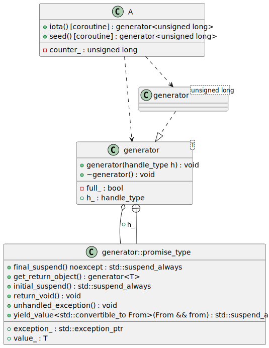

# t00069 - Coroutine methods in class diagrams
## Config
```yaml
diagrams:
  t00069_class:
    type: class
    glob:
      - t00069.cc
    include:
      namespaces:
        - clanguml::t00069
    using_namespace: clanguml::t00069
```
## Source code
File `tests/t00069/t00069.cc`
```cpp
#include <coroutine>
#include <optional>

namespace clanguml {
namespace t00069 {

template <typename T> struct generator {
    struct promise_type;
    using handle_type = std::coroutine_handle<promise_type>;

    generator(handle_type h)
        : h_(h)
    {
    }

    ~generator() { h_.destroy(); }

    struct promise_type {
        T value_;
        std::exception_ptr exception_;

        generator get_return_object()
        {
            return generator(handle_type::from_promise(*this));
        }
        std::suspend_always initial_suspend() { return {}; }

        std::suspend_always final_suspend() noexcept { return {}; }

        void unhandled_exception() { exception_ = std::current_exception(); }

        template <std::convertible_to<T> From>
        std::suspend_always yield_value(From &&from)
        {
            value_ = std::forward<From>(from);
            return {};
        }

        void return_void() { }
    };

    handle_type h_;

private:
    bool full_ = false;
};

class A {
public:
    generator<unsigned long> iota() { co_yield counter_++; }

    generator<unsigned long> seed()
    {
        counter_ = 42;
        co_return;
    }

private:
    unsigned long counter_;
};

} // namespace t00069
} // namespace clanguml

```
## Generated PlantUML diagrams

## Generated Mermaid diagrams

## Generated JSON models
```json
{
  "diagram_type": "class",
  "elements": [
    {
      "bases": [],
      "display_name": "generator<T>",
      "id": "17139969871117485261",
      "is_abstract": false,
      "is_nested": false,
      "is_struct": true,
      "is_template": true,
      "is_union": false,
      "members": [
        {
          "access": "public",
          "is_static": false,
          "name": "h_",
          "source_location": {
            "column": 17,
            "file": "t00069.cc",
            "line": 42,
            "translation_unit": "t00069.cc"
          },
          "type": "handle_type"
        },
        {
          "access": "private",
          "is_static": false,
          "name": "full_",
          "source_location": {
            "column": 10,
            "file": "t00069.cc",
            "line": 45,
            "translation_unit": "t00069.cc"
          },
          "type": "bool"
        }
      ],
      "methods": [
        {
          "access": "public",
          "display_name": "generator",
          "is_const": false,
          "is_consteval": false,
          "is_constexpr": false,
          "is_constructor": true,
          "is_copy_assignment": false,
          "is_coroutine": false,
          "is_defaulted": false,
          "is_deleted": false,
          "is_move_assignment": false,
          "is_noexcept": false,
          "is_operator": false,
          "is_pure_virtual": false,
          "is_static": false,
          "is_virtual": false,
          "name": "generator",
          "parameters": [
            {
              "name": "h",
              "type": "handle_type"
            }
          ],
          "source_location": {
            "column": 5,
            "file": "t00069.cc",
            "line": 11,
            "translation_unit": "t00069.cc"
          },
          "template_parameters": [],
          "type": "void"
        },
        {
          "access": "public",
          "display_name": "~generator",
          "is_const": false,
          "is_consteval": false,
          "is_constexpr": false,
          "is_constructor": false,
          "is_copy_assignment": false,
          "is_coroutine": false,
          "is_defaulted": false,
          "is_deleted": false,
          "is_move_assignment": false,
          "is_noexcept": false,
          "is_operator": false,
          "is_pure_virtual": false,
          "is_static": false,
          "is_virtual": false,
          "name": "~generator",
          "parameters": [],
          "source_location": {
            "column": 5,
            "file": "t00069.cc",
            "line": 16,
            "translation_unit": "t00069.cc"
          },
          "template_parameters": [],
          "type": "void"
        }
      ],
      "name": "generator",
      "namespace": "clanguml::t00069",
      "source_location": {
        "column": 30,
        "file": "t00069.cc",
        "line": 7,
        "translation_unit": "t00069.cc"
      },
      "template_parameters": [
        {
          "is_variadic": false,
          "kind": "template_type",
          "name": "T",
          "template_parameters": []
        }
      ],
      "type": "class"
    },
    {
      "bases": [],
      "display_name": "generator::promise_type",
      "id": "5774501819983744937",
      "is_abstract": false,
      "is_nested": true,
      "is_struct": true,
      "is_template": false,
      "is_union": false,
      "members": [
        {
          "access": "public",
          "is_static": false,
          "name": "value_",
          "source_location": {
            "column": 11,
            "file": "t00069.cc",
            "line": 19,
            "translation_unit": "t00069.cc"
          },
          "type": "T"
        },
        {
          "access": "public",
          "is_static": false,
          "name": "exception_",
          "source_location": {
            "column": 28,
            "file": "t00069.cc",
            "line": 20,
            "translation_unit": "t00069.cc"
          },
          "type": "std::exception_ptr"
        }
      ],
      "methods": [
        {
          "access": "public",
          "display_name": "get_return_object",
          "is_const": false,
          "is_consteval": false,
          "is_constexpr": false,
          "is_constructor": false,
          "is_copy_assignment": false,
          "is_coroutine": false,
          "is_defaulted": false,
          "is_deleted": false,
          "is_move_assignment": false,
          "is_noexcept": false,
          "is_operator": false,
          "is_pure_virtual": false,
          "is_static": false,
          "is_virtual": false,
          "name": "get_return_object",
          "parameters": [],
          "source_location": {
            "column": 19,
            "file": "t00069.cc",
            "line": 22,
            "translation_unit": "t00069.cc"
          },
          "template_parameters": [],
          "type": "generator<T>"
        },
        {
          "access": "public",
          "display_name": "initial_suspend",
          "is_const": false,
          "is_consteval": false,
          "is_constexpr": false,
          "is_constructor": false,
          "is_copy_assignment": false,
          "is_coroutine": false,
          "is_defaulted": false,
          "is_deleted": false,
          "is_move_assignment": false,
          "is_noexcept": false,
          "is_operator": false,
          "is_pure_virtual": false,
          "is_static": false,
          "is_virtual": false,
          "name": "initial_suspend",
          "parameters": [],
          "source_location": {
            "column": 29,
            "file": "t00069.cc",
            "line": 26,
            "translation_unit": "t00069.cc"
          },
          "template_parameters": [],
          "type": "std::suspend_always"
        },
        {
          "access": "public",
          "display_name": "final_suspend",
          "is_const": false,
          "is_consteval": false,
          "is_constexpr": false,
          "is_constructor": false,
          "is_copy_assignment": false,
          "is_coroutine": false,
          "is_defaulted": false,
          "is_deleted": false,
          "is_move_assignment": false,
          "is_noexcept": true,
          "is_operator": false,
          "is_pure_virtual": false,
          "is_static": false,
          "is_virtual": false,
          "name": "final_suspend",
          "parameters": [],
          "source_location": {
            "column": 29,
            "file": "t00069.cc",
            "line": 28,
            "translation_unit": "t00069.cc"
          },
          "template_parameters": [],
          "type": "std::suspend_always"
        },
        {
          "access": "public",
          "display_name": "unhandled_exception",
          "is_const": false,
          "is_consteval": false,
          "is_constexpr": false,
          "is_constructor": false,
          "is_copy_assignment": false,
          "is_coroutine": false,
          "is_defaulted": false,
          "is_deleted": false,
          "is_move_assignment": false,
          "is_noexcept": false,
          "is_operator": false,
          "is_pure_virtual": false,
          "is_static": false,
          "is_virtual": false,
          "name": "unhandled_exception",
          "parameters": [],
          "source_location": {
            "column": 14,
            "file": "t00069.cc",
            "line": 30,
            "translation_unit": "t00069.cc"
          },
          "template_parameters": [],
          "type": "void"
        },
        {
          "access": "public",
          "display_name": "return_void",
          "is_const": false,
          "is_consteval": false,
          "is_constexpr": false,
          "is_constructor": false,
          "is_copy_assignment": false,
          "is_coroutine": false,
          "is_defaulted": false,
          "is_deleted": false,
          "is_move_assignment": false,
          "is_noexcept": false,
          "is_operator": false,
          "is_pure_virtual": false,
          "is_static": false,
          "is_virtual": false,
          "name": "return_void",
          "parameters": [],
          "source_location": {
            "column": 14,
            "file": "t00069.cc",
            "line": 39,
            "translation_unit": "t00069.cc"
          },
          "template_parameters": [],
          "type": "void"
        },
        {
          "access": "public",
          "display_name": "yield_value<std::convertible_to From>",
          "is_const": false,
          "is_consteval": false,
          "is_constexpr": false,
          "is_constructor": false,
          "is_copy_assignment": false,
          "is_coroutine": false,
          "is_defaulted": false,
          "is_deleted": false,
          "is_move_assignment": false,
          "is_noexcept": false,
          "is_operator": false,
          "is_pure_virtual": false,
          "is_static": false,
          "is_virtual": false,
          "name": "yield_value",
          "parameters": [
            {
              "name": "from",
              "type": "From &&"
            }
          ],
          "template_parameters": [
            {
              "is_variadic": false,
              "kind": "template_type",
              "name": "From",
              "template_parameters": []
            }
          ],
          "type": "std::suspend_always"
        }
      ],
      "name": "generator::promise_type",
      "namespace": "clanguml::t00069",
      "source_location": {
        "column": 12,
        "file": "t00069.cc",
        "line": 18,
        "translation_unit": "t00069.cc"
      },
      "template_parameters": [],
      "type": "class"
    },
    {
      "bases": [],
      "display_name": "generator<unsigned long>",
      "id": "12834866777124212868",
      "is_abstract": false,
      "is_nested": false,
      "is_struct": false,
      "is_template": true,
      "is_union": false,
      "members": [],
      "methods": [],
      "name": "generator",
      "namespace": "clanguml::t00069",
      "source_location": {
        "column": 30,
        "file": "t00069.cc",
        "line": 7,
        "translation_unit": "t00069.cc"
      },
      "template_parameters": [
        {
          "is_variadic": false,
          "kind": "argument",
          "template_parameters": [],
          "type": "unsigned long"
        }
      ],
      "type": "class"
    },
    {
      "bases": [],
      "display_name": "A",
      "id": "17281140026022138322",
      "is_abstract": false,
      "is_nested": false,
      "is_struct": false,
      "is_template": false,
      "is_union": false,
      "members": [
        {
          "access": "private",
          "is_static": false,
          "name": "counter_",
          "source_location": {
            "column": 19,
            "file": "t00069.cc",
            "line": 59,
            "translation_unit": "t00069.cc"
          },
          "type": "unsigned long"
        }
      ],
      "methods": [
        {
          "access": "public",
          "display_name": "iota",
          "is_const": false,
          "is_consteval": false,
          "is_constexpr": false,
          "is_constructor": false,
          "is_copy_assignment": false,
          "is_coroutine": true,
          "is_defaulted": false,
          "is_deleted": false,
          "is_move_assignment": false,
          "is_noexcept": false,
          "is_operator": false,
          "is_pure_virtual": false,
          "is_static": false,
          "is_virtual": false,
          "name": "iota",
          "parameters": [],
          "source_location": {
            "column": 30,
            "file": "t00069.cc",
            "line": 50,
            "translation_unit": "t00069.cc"
          },
          "template_parameters": [],
          "type": "clanguml::t00069::generator<unsigned long>"
        },
        {
          "access": "public",
          "display_name": "seed",
          "is_const": false,
          "is_consteval": false,
          "is_constexpr": false,
          "is_constructor": false,
          "is_copy_assignment": false,
          "is_coroutine": true,
          "is_defaulted": false,
          "is_deleted": false,
          "is_move_assignment": false,
          "is_noexcept": false,
          "is_operator": false,
          "is_pure_virtual": false,
          "is_static": false,
          "is_virtual": false,
          "name": "seed",
          "parameters": [],
          "source_location": {
            "column": 30,
            "file": "t00069.cc",
            "line": 52,
            "translation_unit": "t00069.cc"
          },
          "template_parameters": [],
          "type": "clanguml::t00069::generator<unsigned long>"
        }
      ],
      "name": "A",
      "namespace": "clanguml::t00069",
      "source_location": {
        "column": 7,
        "file": "t00069.cc",
        "line": 48,
        "translation_unit": "t00069.cc"
      },
      "template_parameters": [],
      "type": "class"
    }
  ],
  "name": "t00069_class",
  "package_type": "namespace",
  "relationships": [
    {
      "access": "public",
      "destination": "5774501819983744937",
      "label": "h_",
      "source": "17139969871117485261",
      "type": "aggregation"
    },
    {
      "access": "public",
      "destination": "17139969871117485261",
      "source": "5774501819983744937",
      "type": "containment"
    },
    {
      "access": "public",
      "destination": "17139969871117485261",
      "source": "12834866777124212868",
      "type": "instantiation"
    },
    {
      "access": "public",
      "destination": "12834866777124212868",
      "source": "17281140026022138322",
      "type": "dependency"
    },
    {
      "access": "public",
      "destination": "17139969871117485261",
      "source": "17281140026022138322",
      "type": "dependency"
    }
  ],
  "using_namespace": "clanguml::t00069"
}
```
## Generated GraphML models
```xml
<?xml version="1.0"?>
<graphml xmlns="http://graphml.graphdrawing.org/xmlns" xmlns:xsi="http://www.w3.org/2001/XMLSchema-instance" xsi:schemaLocation="http://graphml.graphdrawing.org/xmlns http://graphml.graphdrawing.org/xmlns/1.0/graphml.xsd">
 <key attr.name="id" attr.type="string" for="graph" id="gd0" />
 <key attr.name="diagram_type" attr.type="string" for="graph" id="gd1" />
 <key attr.name="name" attr.type="string" for="graph" id="gd2" />
 <key attr.name="using_namespace" attr.type="string" for="graph" id="gd3" />
 <key attr.name="id" attr.type="string" for="node" id="nd0" />
 <key attr.name="type" attr.type="string" for="node" id="nd1" />
 <key attr.name="name" attr.type="string" for="node" id="nd2" />
 <key attr.name="stereotype" attr.type="string" for="node" id="nd3" />
 <key attr.name="url" attr.type="string" for="node" id="nd4" />
 <key attr.name="tooltip" attr.type="string" for="node" id="nd5" />
 <key attr.name="is_template" attr.type="boolean" for="node" id="nd6" />
 <key attr.name="type" attr.type="string" for="edge" id="ed0" />
 <key attr.name="access" attr.type="string" for="edge" id="ed1" />
 <key attr.name="label" attr.type="string" for="edge" id="ed2" />
 <key attr.name="url" attr.type="string" for="edge" id="ed3" />
 <graph id="g0" edgedefault="directed" parse.nodeids="canonical" parse.edgeids="canonical" parse.order="nodesfirst">
  <data key="gd3">clanguml::t00069</data>
  <node id="n0">
   <data key="nd1">class</data>
   <data key="nd2"><![CDATA[generator<T>]]></data>
   <data key="nd6">true</data>
   <data key="nd4">https://github.com/bkryza/clang-uml/blob/5a99d524aefa5b8d2a48d1d679ccb9ae351323ba/tests/t00069/t00069.cc#L7</data>
   <data key="nd5">generator</data>
  </node>
  <node id="n1">
   <data key="nd1">class</data>
   <data key="nd2"><![CDATA[generator::promise_type]]></data>
   <data key="nd6">false</data>
   <data key="nd4">https://github.com/bkryza/clang-uml/blob/5a99d524aefa5b8d2a48d1d679ccb9ae351323ba/tests/t00069/t00069.cc#L18</data>
   <data key="nd5">generator::promise_type</data>
  </node>
  <node id="n2">
   <data key="nd1">class</data>
   <data key="nd2"><![CDATA[generator<unsigned long>]]></data>
   <data key="nd6">true</data>
   <data key="nd4">https://github.com/bkryza/clang-uml/blob/5a99d524aefa5b8d2a48d1d679ccb9ae351323ba/tests/t00069/t00069.cc#L7</data>
   <data key="nd5">generator</data>
  </node>
  <node id="n3">
   <data key="nd1">class</data>
   <data key="nd2"><![CDATA[A]]></data>
   <data key="nd6">false</data>
   <data key="nd4">https://github.com/bkryza/clang-uml/blob/5a99d524aefa5b8d2a48d1d679ccb9ae351323ba/tests/t00069/t00069.cc#L48</data>
   <data key="nd5">A</data>
  </node>
  <edge id="e0" source="n0" target="n1">
   <data key="ed0">aggregation</data>
   <data key="ed2">h_</data>
   <data key="ed1">public</data>
  </edge>
  <edge id="e1" source="n1" target="n0">
   <data key="ed0">containment</data>
   <data key="ed1">public</data>
  </edge>
  <edge id="e2" source="n2" target="n0">
   <data key="ed0">instantiation</data>
   <data key="ed1">public</data>
  </edge>
  <edge id="e3" source="n3" target="n2">
   <data key="ed0">dependency</data>
   <data key="ed1">public</data>
  </edge>
  <edge id="e4" source="n3" target="n0">
   <data key="ed0">dependency</data>
   <data key="ed1">public</data>
  </edge>
 </graph>
</graphml>

```
