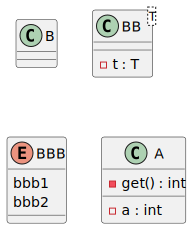

# t00070 - Diagram filter based on C++20 modules
## Config
```yaml
diagrams:
  t00070_class:
    type: class
    glob:
      - t00070.cc
    include:
      modules:
        - t00070
    exclude:
      modules:
        - t00070.lib2
      module_access:
        - private
    using_namespace: clanguml::t00070
```
## Source code
File `tests/t00070/t00070.cc`
```cpp
import t00070;
import t00070.lib1;
import t00070.lib2;

namespace clanguml {
namespace t00070 {
int tmain()
{
    B b;
    C c;

    return 0;
}
}
}
```
File `tests/t00070/src/common.cppm`
```cpp
export module t00070;
export import t00070.lib1;
export import t00070.lib2;

export namespace clanguml::t00070 {
class A {
    int get() { return a; }

    int a;
};
}
```
File `tests/t00070/src/lib2.cppm`
```cpp
export module t00070.lib2;

export namespace clanguml::t00070 {
class C { };

template <typename T> class CC {
    T t;
};

enum class CCC { ccc1, ccc2 };
}
```
File `tests/t00070/src/lib1.cppm`
```cpp
export module t00070.lib1;

export namespace clanguml::t00070 {
class B { };

template <typename T> class BB {
    T t;
};

enum class BBB { bbb1, bbb2 };
}

module :private;
namespace clanguml::t00070 {
class BBBB { };
}
```
## Generated PlantUML diagrams

## Generated Mermaid diagrams

## Generated JSON models
```json
{
  "diagram_type": "class",
  "elements": [
    {
      "bases": [],
      "display_name": "B",
      "id": "1364261599035905834",
      "is_abstract": false,
      "is_nested": false,
      "is_struct": false,
      "is_template": false,
      "is_union": false,
      "members": [],
      "methods": [],
      "module": {
        "is_private": false,
        "name": "t00070.lib1"
      },
      "name": "B",
      "namespace": "clanguml::t00070",
      "source_location": {
        "column": 7,
        "file": "src/lib1.cppm",
        "line": 4,
        "translation_unit": "t00070.cc"
      },
      "template_parameters": [],
      "type": "class"
    },
    {
      "bases": [],
      "display_name": "BB<T>",
      "id": "1485755083045282660",
      "is_abstract": false,
      "is_nested": false,
      "is_struct": false,
      "is_template": true,
      "is_union": false,
      "members": [
        {
          "access": "private",
          "is_static": false,
          "name": "t",
          "source_location": {
            "column": 7,
            "file": "src/lib1.cppm",
            "line": 7,
            "translation_unit": "t00070.cc"
          },
          "type": "T"
        }
      ],
      "methods": [],
      "module": {
        "is_private": false,
        "name": "t00070.lib1"
      },
      "name": "BB",
      "namespace": "clanguml::t00070",
      "source_location": {
        "column": 29,
        "file": "src/lib1.cppm",
        "line": 6,
        "translation_unit": "t00070.cc"
      },
      "template_parameters": [
        {
          "is_variadic": false,
          "kind": "template_type",
          "name": "T",
          "template_parameters": []
        }
      ],
      "type": "class"
    },
    {
      "constants": [
        "bbb1",
        "bbb2"
      ],
      "display_name": "BBB",
      "id": "1734694076622541097",
      "is_nested": false,
      "module": {
        "is_private": false,
        "name": "t00070.lib1"
      },
      "name": "BBB",
      "namespace": "clanguml::t00070",
      "source_location": {
        "column": 12,
        "file": "src/lib1.cppm",
        "line": 10,
        "translation_unit": "t00070.cc"
      },
      "type": "enum"
    },
    {
      "bases": [],
      "display_name": "A",
      "id": "668221430913861424",
      "is_abstract": false,
      "is_nested": false,
      "is_struct": false,
      "is_template": false,
      "is_union": false,
      "members": [
        {
          "access": "private",
          "is_static": false,
          "name": "a",
          "source_location": {
            "column": 9,
            "file": "src/common.cppm",
            "line": 9,
            "translation_unit": "t00070.cc"
          },
          "type": "int"
        }
      ],
      "methods": [
        {
          "access": "private",
          "display_name": "get",
          "is_const": false,
          "is_consteval": false,
          "is_constexpr": false,
          "is_constructor": false,
          "is_copy_assignment": false,
          "is_coroutine": false,
          "is_defaulted": false,
          "is_deleted": false,
          "is_move_assignment": false,
          "is_noexcept": false,
          "is_operator": false,
          "is_pure_virtual": false,
          "is_static": false,
          "is_virtual": false,
          "name": "get",
          "parameters": [],
          "source_location": {
            "column": 9,
            "file": "src/common.cppm",
            "line": 7,
            "translation_unit": "t00070.cc"
          },
          "template_parameters": [],
          "type": "int"
        }
      ],
      "module": {
        "is_private": false,
        "name": "t00070"
      },
      "name": "A",
      "namespace": "clanguml::t00070",
      "source_location": {
        "column": 7,
        "file": "src/common.cppm",
        "line": 6,
        "translation_unit": "t00070.cc"
      },
      "template_parameters": [],
      "type": "class"
    }
  ],
  "name": "t00070_class",
  "package_type": "namespace",
  "relationships": [],
  "using_namespace": "clanguml::t00070"
}
```
