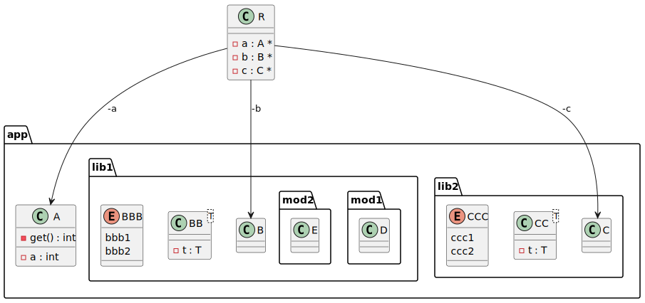

# t00071 - Class diagram with C++20 modules generated as packages
## Config
```yaml
diagrams:
  t00071_class:
    type: class
    glob:
      - t00071.cc
    include:
      namespaces:
        - clanguml::t00071
    generate_packages: true
    package_type: module
    using_namespace: clanguml::t00071
    using_module: t00071
```
## Source code
File `tests/t00071/t00071.cc`
```cpp
import t00071.app;
import t00071.app.lib1;
import t00071.app.lib1.mod1;
import t00071.app.lib1.mod2;
import t00071.app.lib2;

namespace clanguml {
namespace t00071 {
class R {
    A *a;
    B *b;
    C *c;
};
}
}
```
File `tests/t00071/src/lib1mod2.cppm`
```cpp
export module t00071.app.lib1.mod2;

export namespace clanguml::t00071 {
class E { };
}
```
File `tests/t00071/src/t00071_mod.cppm`
```cpp
export module t00071.app;
export import t00071.app.lib1;
export import t00071.app.lib2;

export namespace clanguml::t00071 {
class A {
    int get() { return a; }

    int a;
};
}
```
File `tests/t00071/src/lib2.cppm`
```cpp
export module t00071.app.lib2;

export namespace clanguml::t00071 {
class C { };

template <typename T> class CC {
    T t;
};

namespace detail {
enum class CCC { ccc1, ccc2 };
}
}
```
File `tests/t00071/src/lib1.cppm`
```cpp
export module t00071.app.lib1;

export namespace clanguml::t00071 {
class B { };

template <typename T> class BB {
    T t;
};

namespace detail {
enum class BBB { bbb1, bbb2 };
} // namespace detail
}
```
File `tests/t00071/src/lib1mod1.cppm`
```cpp
export module t00071.app.lib1.mod1;

export namespace clanguml::t00071 {
class D { };
}
```
## Generated PlantUML diagrams

## Generated Mermaid diagrams

## Generated JSON models
```json
{
  "diagram_type": "class",
  "elements": [
    {
      "display_name": "app",
      "elements": [
        {
          "display_name": "lib1",
          "elements": [
            {
              "bases": [],
              "display_name": "B",
              "id": "1319862510251967999",
              "is_abstract": false,
              "is_nested": false,
              "is_struct": false,
              "is_template": false,
              "is_union": false,
              "members": [],
              "methods": [],
              "module": {
                "is_private": false,
                "name": "t00071.app.lib1"
              },
              "name": "B",
              "namespace": "clanguml::t00071",
              "source_location": {
                "column": 7,
                "file": "src/lib1.cppm",
                "line": 4,
                "translation_unit": "t00071.cc"
              },
              "template_parameters": [],
              "type": "class"
            },
            {
              "bases": [],
              "display_name": "BB<T>",
              "id": "569632796637866961",
              "is_abstract": false,
              "is_nested": false,
              "is_struct": false,
              "is_template": true,
              "is_union": false,
              "members": [
                {
                  "access": "private",
                  "is_static": false,
                  "name": "t",
                  "source_location": {
                    "column": 7,
                    "file": "src/lib1.cppm",
                    "line": 7,
                    "translation_unit": "t00071.cc"
                  },
                  "type": "T"
                }
              ],
              "methods": [],
              "module": {
                "is_private": false,
                "name": "t00071.app.lib1"
              },
              "name": "BB",
              "namespace": "clanguml::t00071",
              "source_location": {
                "column": 29,
                "file": "src/lib1.cppm",
                "line": 6,
                "translation_unit": "t00071.cc"
              },
              "template_parameters": [
                {
                  "is_variadic": false,
                  "kind": "template_type",
                  "name": "T",
                  "template_parameters": []
                }
              ],
              "type": "class"
            },
            {
              "constants": [
                "bbb1",
                "bbb2"
              ],
              "display_name": "BBB",
              "id": "1625078061541942293",
              "is_nested": false,
              "module": {
                "is_private": false,
                "name": "t00071.app.lib1"
              },
              "name": "BBB",
              "namespace": "clanguml::t00071::detail",
              "source_location": {
                "column": 12,
                "file": "src/lib1.cppm",
                "line": 11,
                "translation_unit": "t00071.cc"
              },
              "type": "enum"
            },
            {
              "display_name": "mod1",
              "elements": [
                {
                  "bases": [],
                  "display_name": "D",
                  "id": "1168777064323042894",
                  "is_abstract": false,
                  "is_nested": false,
                  "is_struct": false,
                  "is_template": false,
                  "is_union": false,
                  "members": [],
                  "methods": [],
                  "module": {
                    "is_private": false,
                    "name": "t00071.app.lib1.mod1"
                  },
                  "name": "D",
                  "namespace": "clanguml::t00071",
                  "source_location": {
                    "column": 7,
                    "file": "src/lib1mod1.cppm",
                    "line": 4,
                    "translation_unit": "t00071.cc"
                  },
                  "template_parameters": [],
                  "type": "class"
                }
              ],
              "name": "mod1",
              "type": "module"
            },
            {
              "display_name": "mod2",
              "elements": [
                {
                  "bases": [],
                  "display_name": "E",
                  "id": "1302694761523535504",
                  "is_abstract": false,
                  "is_nested": false,
                  "is_struct": false,
                  "is_template": false,
                  "is_union": false,
                  "members": [],
                  "methods": [],
                  "module": {
                    "is_private": false,
                    "name": "t00071.app.lib1.mod2"
                  },
                  "name": "E",
                  "namespace": "clanguml::t00071",
                  "source_location": {
                    "column": 7,
                    "file": "src/lib1mod2.cppm",
                    "line": 4,
                    "translation_unit": "t00071.cc"
                  },
                  "template_parameters": [],
                  "type": "class"
                }
              ],
              "name": "mod2",
              "type": "module"
            }
          ],
          "name": "lib1",
          "type": "module"
        },
        {
          "display_name": "lib2",
          "elements": [
            {
              "bases": [],
              "display_name": "C",
              "id": "1697463991772603674",
              "is_abstract": false,
              "is_nested": false,
              "is_struct": false,
              "is_template": false,
              "is_union": false,
              "members": [],
              "methods": [],
              "module": {
                "is_private": false,
                "name": "t00071.app.lib2"
              },
              "name": "C",
              "namespace": "clanguml::t00071",
              "source_location": {
                "column": 7,
                "file": "src/lib2.cppm",
                "line": 4,
                "translation_unit": "t00071.cc"
              },
              "template_parameters": [],
              "type": "class"
            },
            {
              "bases": [],
              "display_name": "CC<T>",
              "id": "1911193033649971391",
              "is_abstract": false,
              "is_nested": false,
              "is_struct": false,
              "is_template": true,
              "is_union": false,
              "members": [
                {
                  "access": "private",
                  "is_static": false,
                  "name": "t",
                  "source_location": {
                    "column": 7,
                    "file": "src/lib2.cppm",
                    "line": 7,
                    "translation_unit": "t00071.cc"
                  },
                  "type": "T"
                }
              ],
              "methods": [],
              "module": {
                "is_private": false,
                "name": "t00071.app.lib2"
              },
              "name": "CC",
              "namespace": "clanguml::t00071",
              "source_location": {
                "column": 29,
                "file": "src/lib2.cppm",
                "line": 6,
                "translation_unit": "t00071.cc"
              },
              "template_parameters": [
                {
                  "is_variadic": false,
                  "kind": "template_type",
                  "name": "T",
                  "template_parameters": []
                }
              ],
              "type": "class"
            },
            {
              "constants": [
                "ccc1",
                "ccc2"
              ],
              "display_name": "CCC",
              "id": "931278702894205804",
              "is_nested": false,
              "module": {
                "is_private": false,
                "name": "t00071.app.lib2"
              },
              "name": "CCC",
              "namespace": "clanguml::t00071::detail",
              "source_location": {
                "column": 12,
                "file": "src/lib2.cppm",
                "line": 11,
                "translation_unit": "t00071.cc"
              },
              "type": "enum"
            }
          ],
          "name": "lib2",
          "type": "module"
        },
        {
          "bases": [],
          "display_name": "A",
          "id": "2210005074053139118",
          "is_abstract": false,
          "is_nested": false,
          "is_struct": false,
          "is_template": false,
          "is_union": false,
          "members": [
            {
              "access": "private",
              "is_static": false,
              "name": "a",
              "source_location": {
                "column": 9,
                "file": "src/t00071_mod.cppm",
                "line": 9,
                "translation_unit": "t00071.cc"
              },
              "type": "int"
            }
          ],
          "methods": [
            {
              "access": "private",
              "display_name": "get",
              "is_const": false,
              "is_consteval": false,
              "is_constexpr": false,
              "is_constructor": false,
              "is_copy_assignment": false,
              "is_coroutine": false,
              "is_defaulted": false,
              "is_deleted": false,
              "is_move_assignment": false,
              "is_noexcept": false,
              "is_operator": false,
              "is_pure_virtual": false,
              "is_static": false,
              "is_virtual": false,
              "name": "get",
              "parameters": [],
              "source_location": {
                "column": 9,
                "file": "src/t00071_mod.cppm",
                "line": 7,
                "translation_unit": "t00071.cc"
              },
              "template_parameters": [],
              "type": "int"
            }
          ],
          "module": {
            "is_private": false,
            "name": "t00071.app"
          },
          "name": "A",
          "namespace": "clanguml::t00071",
          "source_location": {
            "column": 7,
            "file": "src/t00071_mod.cppm",
            "line": 6,
            "translation_unit": "t00071.cc"
          },
          "template_parameters": [],
          "type": "class"
        }
      ],
      "name": "app",
      "type": "module"
    },
    {
      "bases": [],
      "display_name": "R",
      "id": "1629943620359873327",
      "is_abstract": false,
      "is_nested": false,
      "is_struct": false,
      "is_template": false,
      "is_union": false,
      "members": [
        {
          "access": "private",
          "is_static": false,
          "name": "a",
          "source_location": {
            "column": 8,
            "file": "t00071.cc",
            "line": 10,
            "translation_unit": "t00071.cc"
          },
          "type": "A *"
        },
        {
          "access": "private",
          "is_static": false,
          "name": "b",
          "source_location": {
            "column": 8,
            "file": "t00071.cc",
            "line": 11,
            "translation_unit": "t00071.cc"
          },
          "type": "B *"
        },
        {
          "access": "private",
          "is_static": false,
          "name": "c",
          "source_location": {
            "column": 8,
            "file": "t00071.cc",
            "line": 12,
            "translation_unit": "t00071.cc"
          },
          "type": "C *"
        }
      ],
      "methods": [],
      "name": "R",
      "namespace": "clanguml::t00071",
      "source_location": {
        "column": 7,
        "file": "t00071.cc",
        "line": 9,
        "translation_unit": "t00071.cc"
      },
      "template_parameters": [],
      "type": "class"
    }
  ],
  "name": "t00071_class",
  "package_type": "module",
  "relationships": [
    {
      "access": "private",
      "destination": "2210005074053139118",
      "label": "a",
      "source": "1629943620359873327",
      "type": "association"
    },
    {
      "access": "private",
      "destination": "1319862510251967999",
      "label": "b",
      "source": "1629943620359873327",
      "type": "association"
    },
    {
      "access": "private",
      "destination": "1697463991772603674",
      "label": "c",
      "source": "1629943620359873327",
      "type": "association"
    }
  ],
  "using_module": "t00071",
  "using_namespace": "clanguml::t00071"
}
```
