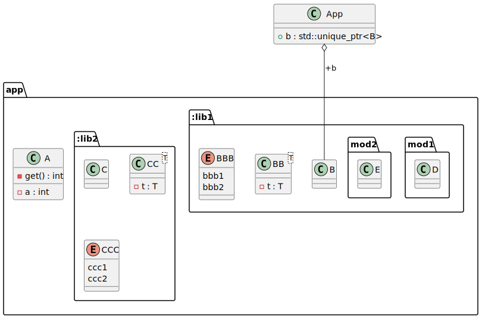

# t00072 - Class diagram with C++20 module partitions generated as packages
## Config
```yaml
diagrams:
  t00072_class:
    type: class
    glob:
      - t00072.cc
    generate_packages: true
    package_type: module
    include:
      modules:
        - t00072
    using_module: t00072
    using_namespace: clanguml::t00072
```
## Source code
File `tests/t00072/t00072.cc`
```cpp
import t00072.app;

namespace clanguml {
namespace t00072 {
}
}
```
File `tests/t00072/src/lib1mod2.cppm`
```cpp
export module t00072.app:lib1.mod2;

export namespace clanguml::t00072 {
class E { };
}
```
File `tests/t00072/src/t00072_mod.cppm`
```cpp
export module t00072.app;
export import :lib1;
export import :lib1.mod1;
export import :lib1.mod2;
export import :lib2;

export namespace clanguml::t00072 {
class A {
    int get() { return a; }

    int a;
};
}
```
File `tests/t00072/src/lib2.cppm`
```cpp
export module t00072.app:lib2;

export namespace clanguml::t00072 {
class C { };

template <typename T> class CC {
    T t;
};

namespace detail {
enum class CCC { ccc1, ccc2 };
}
}
```
File `tests/t00072/src/lib1.cppm`
```cpp
export module t00072.app:lib1;

export namespace clanguml::t00072 {
class B { };

template <typename T> class BB {
    T t;
};

namespace detail {
enum class BBB { bbb1, bbb2 };
} // namespace detail
}
```
File `tests/t00072/src/lib1mod1.cppm`
```cpp
export module t00072.app:lib1.mod1;

export namespace clanguml::t00072 {
class D { };
}
```
## Generated PlantUML diagrams

## Generated Mermaid diagrams

## Generated JSON models
```json
{
  "diagram_type": "class",
  "elements": [
    {
      "display_name": "app",
      "elements": [
        {
          "display_name": ":lib1",
          "elements": [
            {
              "bases": [],
              "display_name": "B",
              "id": "1450150421445257774",
              "is_abstract": false,
              "is_nested": false,
              "is_struct": false,
              "is_template": false,
              "is_union": false,
              "members": [],
              "methods": [],
              "module": {
                "is_private": false,
                "name": "t00072.app:lib1"
              },
              "name": "B",
              "namespace": "clanguml::t00072",
              "source_location": {
                "column": 7,
                "file": "src/lib1.cppm",
                "line": 4,
                "translation_unit": "t00072.cc"
              },
              "template_parameters": [],
              "type": "class"
            },
            {
              "bases": [],
              "display_name": "BB<T>",
              "id": "744925471008373109",
              "is_abstract": false,
              "is_nested": false,
              "is_struct": false,
              "is_template": true,
              "is_union": false,
              "members": [
                {
                  "access": "private",
                  "is_static": false,
                  "name": "t",
                  "source_location": {
                    "column": 7,
                    "file": "src/lib1.cppm",
                    "line": 7,
                    "translation_unit": "t00072.cc"
                  },
                  "type": "T"
                }
              ],
              "methods": [],
              "module": {
                "is_private": false,
                "name": "t00072.app:lib1"
              },
              "name": "BB",
              "namespace": "clanguml::t00072",
              "source_location": {
                "column": 29,
                "file": "src/lib1.cppm",
                "line": 6,
                "translation_unit": "t00072.cc"
              },
              "template_parameters": [
                {
                  "is_variadic": false,
                  "kind": "template_type",
                  "name": "T",
                  "template_parameters": []
                }
              ],
              "type": "class"
            },
            {
              "constants": [
                "bbb1",
                "bbb2"
              ],
              "display_name": "BBB",
              "id": "610293402618118513",
              "is_nested": false,
              "module": {
                "is_private": false,
                "name": "t00072.app:lib1"
              },
              "name": "BBB",
              "namespace": "clanguml::t00072::detail",
              "source_location": {
                "column": 12,
                "file": "src/lib1.cppm",
                "line": 11,
                "translation_unit": "t00072.cc"
              },
              "type": "enum"
            },
            {
              "display_name": "mod1",
              "elements": [
                {
                  "bases": [],
                  "display_name": "D",
                  "id": "516204432765266678",
                  "is_abstract": false,
                  "is_nested": false,
                  "is_struct": false,
                  "is_template": false,
                  "is_union": false,
                  "members": [],
                  "methods": [],
                  "module": {
                    "is_private": false,
                    "name": "t00072.app:lib1.mod1"
                  },
                  "name": "D",
                  "namespace": "clanguml::t00072",
                  "source_location": {
                    "column": 7,
                    "file": "src/lib1mod1.cppm",
                    "line": 4,
                    "translation_unit": "t00072.cc"
                  },
                  "template_parameters": [],
                  "type": "class"
                }
              ],
              "name": "mod1",
              "type": "module"
            },
            {
              "display_name": "mod2",
              "elements": [
                {
                  "bases": [],
                  "display_name": "E",
                  "id": "347204883768272660",
                  "is_abstract": false,
                  "is_nested": false,
                  "is_struct": false,
                  "is_template": false,
                  "is_union": false,
                  "members": [],
                  "methods": [],
                  "module": {
                    "is_private": false,
                    "name": "t00072.app:lib1.mod2"
                  },
                  "name": "E",
                  "namespace": "clanguml::t00072",
                  "source_location": {
                    "column": 7,
                    "file": "src/lib1mod2.cppm",
                    "line": 4,
                    "translation_unit": "t00072.cc"
                  },
                  "template_parameters": [],
                  "type": "class"
                }
              ],
              "name": "mod2",
              "type": "module"
            }
          ],
          "name": ":lib1",
          "type": "module"
        },
        {
          "display_name": ":lib2",
          "elements": [
            {
              "bases": [],
              "display_name": "C",
              "id": "1144612141363797057",
              "is_abstract": false,
              "is_nested": false,
              "is_struct": false,
              "is_template": false,
              "is_union": false,
              "members": [],
              "methods": [],
              "module": {
                "is_private": false,
                "name": "t00072.app:lib2"
              },
              "name": "C",
              "namespace": "clanguml::t00072",
              "source_location": {
                "column": 7,
                "file": "src/lib2.cppm",
                "line": 4,
                "translation_unit": "t00072.cc"
              },
              "template_parameters": [],
              "type": "class"
            },
            {
              "bases": [],
              "display_name": "CC<T>",
              "id": "1472938318775327089",
              "is_abstract": false,
              "is_nested": false,
              "is_struct": false,
              "is_template": true,
              "is_union": false,
              "members": [
                {
                  "access": "private",
                  "is_static": false,
                  "name": "t",
                  "source_location": {
                    "column": 7,
                    "file": "src/lib2.cppm",
                    "line": 7,
                    "translation_unit": "t00072.cc"
                  },
                  "type": "T"
                }
              ],
              "methods": [],
              "module": {
                "is_private": false,
                "name": "t00072.app:lib2"
              },
              "name": "CC",
              "namespace": "clanguml::t00072",
              "source_location": {
                "column": 29,
                "file": "src/lib2.cppm",
                "line": 6,
                "translation_unit": "t00072.cc"
              },
              "template_parameters": [
                {
                  "is_variadic": false,
                  "kind": "template_type",
                  "name": "T",
                  "template_parameters": []
                }
              ],
              "type": "class"
            },
            {
              "constants": [
                "ccc1",
                "ccc2"
              ],
              "display_name": "CCC",
              "id": "448885573685763285",
              "is_nested": false,
              "module": {
                "is_private": false,
                "name": "t00072.app:lib2"
              },
              "name": "CCC",
              "namespace": "clanguml::t00072::detail",
              "source_location": {
                "column": 12,
                "file": "src/lib2.cppm",
                "line": 11,
                "translation_unit": "t00072.cc"
              },
              "type": "enum"
            }
          ],
          "name": ":lib2",
          "type": "module"
        },
        {
          "bases": [],
          "display_name": "A",
          "id": "1552096180171121044",
          "is_abstract": false,
          "is_nested": false,
          "is_struct": false,
          "is_template": false,
          "is_union": false,
          "members": [
            {
              "access": "private",
              "is_static": false,
              "name": "a",
              "source_location": {
                "column": 9,
                "file": "src/t00072_mod.cppm",
                "line": 11,
                "translation_unit": "t00072.cc"
              },
              "type": "int"
            }
          ],
          "methods": [
            {
              "access": "private",
              "display_name": "get",
              "is_const": false,
              "is_consteval": false,
              "is_constexpr": false,
              "is_constructor": false,
              "is_copy_assignment": false,
              "is_coroutine": false,
              "is_defaulted": false,
              "is_deleted": false,
              "is_move_assignment": false,
              "is_noexcept": false,
              "is_operator": false,
              "is_pure_virtual": false,
              "is_static": false,
              "is_virtual": false,
              "name": "get",
              "parameters": [],
              "source_location": {
                "column": 9,
                "file": "src/t00072_mod.cppm",
                "line": 9,
                "translation_unit": "t00072.cc"
              },
              "template_parameters": [],
              "type": "int"
            }
          ],
          "module": {
            "is_private": false,
            "name": "t00072.app"
          },
          "name": "A",
          "namespace": "clanguml::t00072",
          "source_location": {
            "column": 7,
            "file": "src/t00072_mod.cppm",
            "line": 8,
            "translation_unit": "t00072.cc"
          },
          "template_parameters": [],
          "type": "class"
        }
      ],
      "name": "app",
      "type": "module"
    }
  ],
  "name": "t00072_class",
  "package_type": "module",
  "relationships": [],
  "using_module": "t00072",
  "using_namespace": "clanguml::t00072"
}
```
