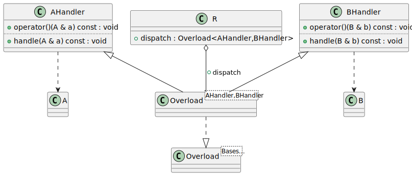

# t00073 - Class diagram for template overload pattern
## Config
```yaml
diagrams:
  t00073_class:
    type: class
    glob:
      - t00073.cc
    include:
      namespaces:
        - clanguml::t00073
    using_namespace: clanguml::t00073
```
## Source code
File `tests/t00073/t00073.cc`
```cpp
namespace clanguml {
namespace t00073 {
struct A { };
struct AHandler {
    void handle(A &a) const { }
    void operator()(A &a) const { handle(a); }
};

struct B { };
struct BHandler {
    void handle(B &b) const { }
    void operator()(B &b) const { handle(b); }
};

template <typename... Bases> struct Overload : public Bases... {
    using Bases::operator()...;
};
template <typename... Bases> Overload(Bases...) -> Overload<Bases...>;

struct R {
    Overload<AHandler, BHandler> dispatch;
};
}
}
```
## Generated PlantUML diagrams

## Generated Mermaid diagrams

## Generated JSON models
```json
{
  "diagram_type": "class",
  "elements": [
    {
      "bases": [],
      "display_name": "A",
      "id": "13978220967333947858",
      "is_abstract": false,
      "is_nested": false,
      "is_struct": true,
      "is_template": false,
      "is_union": false,
      "members": [],
      "methods": [],
      "name": "A",
      "namespace": "clanguml::t00073",
      "source_location": {
        "column": 8,
        "file": "t00073.cc",
        "line": 3,
        "translation_unit": "t00073.cc"
      },
      "template_parameters": [],
      "type": "class"
    },
    {
      "bases": [],
      "display_name": "AHandler",
      "id": "12424623007175064860",
      "is_abstract": false,
      "is_nested": false,
      "is_struct": true,
      "is_template": false,
      "is_union": false,
      "members": [],
      "methods": [
        {
          "access": "public",
          "display_name": "handle",
          "is_const": true,
          "is_consteval": false,
          "is_constexpr": false,
          "is_constructor": false,
          "is_copy_assignment": false,
          "is_coroutine": false,
          "is_defaulted": false,
          "is_deleted": false,
          "is_move_assignment": false,
          "is_noexcept": false,
          "is_operator": false,
          "is_pure_virtual": false,
          "is_static": false,
          "is_virtual": false,
          "name": "handle",
          "parameters": [
            {
              "name": "a",
              "type": "A &"
            }
          ],
          "source_location": {
            "column": 10,
            "file": "t00073.cc",
            "line": 5,
            "translation_unit": "t00073.cc"
          },
          "template_parameters": [],
          "type": "void"
        },
        {
          "access": "public",
          "display_name": "operator()",
          "is_const": true,
          "is_consteval": false,
          "is_constexpr": false,
          "is_constructor": false,
          "is_copy_assignment": false,
          "is_coroutine": false,
          "is_defaulted": false,
          "is_deleted": false,
          "is_move_assignment": false,
          "is_noexcept": false,
          "is_operator": true,
          "is_pure_virtual": false,
          "is_static": false,
          "is_virtual": false,
          "name": "operator()",
          "parameters": [
            {
              "name": "a",
              "type": "A &"
            }
          ],
          "source_location": {
            "column": 10,
            "file": "t00073.cc",
            "line": 6,
            "translation_unit": "t00073.cc"
          },
          "template_parameters": [],
          "type": "void"
        }
      ],
      "name": "AHandler",
      "namespace": "clanguml::t00073",
      "source_location": {
        "column": 8,
        "file": "t00073.cc",
        "line": 4,
        "translation_unit": "t00073.cc"
      },
      "template_parameters": [],
      "type": "class"
    },
    {
      "bases": [],
      "display_name": "B",
      "id": "18318917281529387309",
      "is_abstract": false,
      "is_nested": false,
      "is_struct": true,
      "is_template": false,
      "is_union": false,
      "members": [],
      "methods": [],
      "name": "B",
      "namespace": "clanguml::t00073",
      "source_location": {
        "column": 8,
        "file": "t00073.cc",
        "line": 9,
        "translation_unit": "t00073.cc"
      },
      "template_parameters": [],
      "type": "class"
    },
    {
      "bases": [],
      "display_name": "BHandler",
      "id": "9201412624975017558",
      "is_abstract": false,
      "is_nested": false,
      "is_struct": true,
      "is_template": false,
      "is_union": false,
      "members": [],
      "methods": [
        {
          "access": "public",
          "display_name": "handle",
          "is_const": true,
          "is_consteval": false,
          "is_constexpr": false,
          "is_constructor": false,
          "is_copy_assignment": false,
          "is_coroutine": false,
          "is_defaulted": false,
          "is_deleted": false,
          "is_move_assignment": false,
          "is_noexcept": false,
          "is_operator": false,
          "is_pure_virtual": false,
          "is_static": false,
          "is_virtual": false,
          "name": "handle",
          "parameters": [
            {
              "name": "b",
              "type": "B &"
            }
          ],
          "source_location": {
            "column": 10,
            "file": "t00073.cc",
            "line": 11,
            "translation_unit": "t00073.cc"
          },
          "template_parameters": [],
          "type": "void"
        },
        {
          "access": "public",
          "display_name": "operator()",
          "is_const": true,
          "is_consteval": false,
          "is_constexpr": false,
          "is_constructor": false,
          "is_copy_assignment": false,
          "is_coroutine": false,
          "is_defaulted": false,
          "is_deleted": false,
          "is_move_assignment": false,
          "is_noexcept": false,
          "is_operator": true,
          "is_pure_virtual": false,
          "is_static": false,
          "is_virtual": false,
          "name": "operator()",
          "parameters": [
            {
              "name": "b",
              "type": "B &"
            }
          ],
          "source_location": {
            "column": 10,
            "file": "t00073.cc",
            "line": 12,
            "translation_unit": "t00073.cc"
          },
          "template_parameters": [],
          "type": "void"
        }
      ],
      "name": "BHandler",
      "namespace": "clanguml::t00073",
      "source_location": {
        "column": 8,
        "file": "t00073.cc",
        "line": 10,
        "translation_unit": "t00073.cc"
      },
      "template_parameters": [],
      "type": "class"
    },
    {
      "bases": [],
      "display_name": "Overload<Bases...>",
      "id": "1025907370326213117",
      "is_abstract": false,
      "is_nested": false,
      "is_struct": true,
      "is_template": true,
      "is_union": false,
      "members": [],
      "methods": [],
      "name": "Overload",
      "namespace": "clanguml::t00073",
      "source_location": {
        "column": 37,
        "file": "t00073.cc",
        "line": 15,
        "translation_unit": "t00073.cc"
      },
      "template_parameters": [
        {
          "is_variadic": true,
          "kind": "template_type",
          "name": "Bases...",
          "template_parameters": []
        }
      ],
      "type": "class"
    },
    {
      "bases": [
        {
          "access": "public",
          "id": "12424623007175064860",
          "is_virtual": false
        },
        {
          "access": "public",
          "id": "9201412624975017558",
          "is_virtual": false
        }
      ],
      "display_name": "Overload<AHandler,BHandler>",
      "id": "15541587871136239694",
      "is_abstract": false,
      "is_nested": false,
      "is_struct": false,
      "is_template": true,
      "is_union": false,
      "members": [],
      "methods": [],
      "name": "Overload",
      "namespace": "clanguml::t00073",
      "source_location": {
        "column": 37,
        "file": "t00073.cc",
        "line": 15,
        "translation_unit": "t00073.cc"
      },
      "template_parameters": [
        {
          "is_variadic": false,
          "kind": "argument",
          "template_parameters": [],
          "type": "AHandler"
        },
        {
          "is_variadic": false,
          "kind": "argument",
          "template_parameters": [],
          "type": "BHandler"
        }
      ],
      "type": "class"
    },
    {
      "bases": [],
      "display_name": "R",
      "id": "3531521522969213013",
      "is_abstract": false,
      "is_nested": false,
      "is_struct": true,
      "is_template": false,
      "is_union": false,
      "members": [
        {
          "access": "public",
          "is_static": false,
          "name": "dispatch",
          "source_location": {
            "column": 34,
            "file": "t00073.cc",
            "line": 21,
            "translation_unit": "t00073.cc"
          },
          "type": "Overload<AHandler,BHandler>"
        }
      ],
      "methods": [],
      "name": "R",
      "namespace": "clanguml::t00073",
      "source_location": {
        "column": 8,
        "file": "t00073.cc",
        "line": 20,
        "translation_unit": "t00073.cc"
      },
      "template_parameters": [],
      "type": "class"
    }
  ],
  "name": "t00073_class",
  "package_type": "namespace",
  "relationships": [
    {
      "access": "public",
      "destination": "13978220967333947858",
      "source": "12424623007175064860",
      "type": "dependency"
    },
    {
      "access": "public",
      "destination": "18318917281529387309",
      "source": "9201412624975017558",
      "type": "dependency"
    },
    {
      "access": "public",
      "destination": "12424623007175064860",
      "source": "15541587871136239694",
      "type": "extension"
    },
    {
      "access": "public",
      "destination": "9201412624975017558",
      "source": "15541587871136239694",
      "type": "extension"
    },
    {
      "access": "public",
      "destination": "1025907370326213117",
      "source": "15541587871136239694",
      "type": "instantiation"
    },
    {
      "access": "public",
      "destination": "15541587871136239694",
      "label": "dispatch",
      "source": "3531521522969213013",
      "type": "aggregation"
    }
  ],
  "using_namespace": "clanguml::t00073"
}
```
## Generated GraphML models
```xml
<?xml version="1.0"?>
<graphml xmlns="http://graphml.graphdrawing.org/xmlns" xmlns:xsi="http://www.w3.org/2001/XMLSchema-instance" xsi:schemaLocation="http://graphml.graphdrawing.org/xmlns http://graphml.graphdrawing.org/xmlns/1.0/graphml.xsd">
 <key attr.name="id" attr.type="string" for="graph" id="gd0" />
 <key attr.name="diagram_type" attr.type="string" for="graph" id="gd1" />
 <key attr.name="name" attr.type="string" for="graph" id="gd2" />
 <key attr.name="using_namespace" attr.type="string" for="graph" id="gd3" />
 <key attr.name="id" attr.type="string" for="node" id="nd0" />
 <key attr.name="type" attr.type="string" for="node" id="nd1" />
 <key attr.name="name" attr.type="string" for="node" id="nd2" />
 <key attr.name="stereotype" attr.type="string" for="node" id="nd3" />
 <key attr.name="url" attr.type="string" for="node" id="nd4" />
 <key attr.name="tooltip" attr.type="string" for="node" id="nd5" />
 <key attr.name="is_template" attr.type="boolean" for="node" id="nd6" />
 <key attr.name="type" attr.type="string" for="edge" id="ed0" />
 <key attr.name="access" attr.type="string" for="edge" id="ed1" />
 <key attr.name="label" attr.type="string" for="edge" id="ed2" />
 <key attr.name="url" attr.type="string" for="edge" id="ed3" />
 <graph id="g0" edgedefault="directed" parse.nodeids="canonical" parse.edgeids="canonical" parse.order="nodesfirst">
  <data key="gd3">clanguml::t00073</data>
  <node id="n0">
   <data key="nd1">class</data>
   <data key="nd2"><![CDATA[A]]></data>
   <data key="nd6">false</data>
  </node>
  <node id="n1">
   <data key="nd1">class</data>
   <data key="nd2"><![CDATA[AHandler]]></data>
   <data key="nd6">false</data>
  </node>
  <node id="n2">
   <data key="nd1">class</data>
   <data key="nd2"><![CDATA[B]]></data>
   <data key="nd6">false</data>
  </node>
  <node id="n3">
   <data key="nd1">class</data>
   <data key="nd2"><![CDATA[BHandler]]></data>
   <data key="nd6">false</data>
  </node>
  <node id="n4">
   <data key="nd1">class</data>
   <data key="nd2"><![CDATA[Overload<Bases...>]]></data>
   <data key="nd6">true</data>
  </node>
  <node id="n5">
   <data key="nd1">class</data>
   <data key="nd2"><![CDATA[Overload<AHandler,BHandler>]]></data>
   <data key="nd6">true</data>
  </node>
  <node id="n6">
   <data key="nd1">class</data>
   <data key="nd2"><![CDATA[R]]></data>
   <data key="nd6">false</data>
  </node>
  <edge id="e0" source="n1" target="n0">
   <data key="ed0">dependency</data>
   <data key="ed1">public</data>
  </edge>
  <edge id="e1" source="n3" target="n2">
   <data key="ed0">dependency</data>
   <data key="ed1">public</data>
  </edge>
  <edge id="e2" source="n5" target="n1">
   <data key="ed0">extension</data>
   <data key="ed1">public</data>
  </edge>
  <edge id="e3" source="n5" target="n3">
   <data key="ed0">extension</data>
   <data key="ed1">public</data>
  </edge>
  <edge id="e4" source="n5" target="n4">
   <data key="ed0">instantiation</data>
   <data key="ed1">public</data>
  </edge>
  <edge id="e5" source="n6" target="n5">
   <data key="ed0">aggregation</data>
   <data key="ed2">dispatch</data>
   <data key="ed1">public</data>
  </edge>
 </graph>
</graphml>

```
