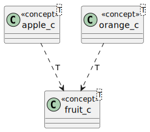

# t00074 - Test case for rendering concepts without requirements
## Config
```yaml
diagrams:
  t00074_class:
    type: class
    glob:
      - t00074.cc
    generate_concept_requirements: false
    include:
      namespaces:
        - clanguml::t00074
    using_namespace: clanguml::t00074
```
## Source code
File `tests/t00074/t00074.cc`
```cpp
namespace clanguml {
namespace t00074 {
template <typename T>
concept fruit_c = requires(T t) {
                      T{};
                      t.get_name();
                  };

template <typename T>
concept apple_c = fruit_c<T> && requires(T t) { t.get_sweetness(); };

template <typename T>
concept orange_c = fruit_c<T> && requires(T t) { t.get_bitterness(); };

}
}
```
## Generated PlantUML diagrams

## Generated Mermaid diagrams

## Generated JSON models
```json
{
  "diagram_type": "class",
  "elements": [
    {
      "display_name": "fruit_c<T>",
      "id": "486119377394642787",
      "name": "fruit_c",
      "namespace": "clanguml::t00074",
      "parameters": [
        {
          "name": "t",
          "type": "T"
        }
      ],
      "source_location": {
        "column": 9,
        "file": "t00074.cc",
        "line": 4,
        "translation_unit": "t00074.cc"
      },
      "statements": [
        "T{}",
        "t.get_name()"
      ],
      "type": "concept"
    },
    {
      "display_name": "apple_c<T>",
      "id": "560253541144761762",
      "name": "apple_c",
      "namespace": "clanguml::t00074",
      "parameters": [
        {
          "name": "t",
          "type": "T"
        }
      ],
      "source_location": {
        "column": 9,
        "file": "t00074.cc",
        "line": 10,
        "translation_unit": "t00074.cc"
      },
      "statements": [
        "t.get_sweetness()"
      ],
      "type": "concept"
    },
    {
      "display_name": "orange_c<T>",
      "id": "1059590388833603455",
      "name": "orange_c",
      "namespace": "clanguml::t00074",
      "parameters": [
        {
          "name": "t",
          "type": "T"
        }
      ],
      "source_location": {
        "column": 9,
        "file": "t00074.cc",
        "line": 13,
        "translation_unit": "t00074.cc"
      },
      "statements": [
        "t.get_bitterness()"
      ],
      "type": "concept"
    }
  ],
  "name": "t00074_class",
  "package_type": "namespace",
  "relationships": [
    {
      "destination": "486119377394642787",
      "label": "T",
      "source": "560253541144761762",
      "type": "constraint"
    },
    {
      "destination": "486119377394642787",
      "label": "T",
      "source": "1059590388833603455",
      "type": "constraint"
    }
  ],
  "using_namespace": "clanguml::t00074"
}
```
