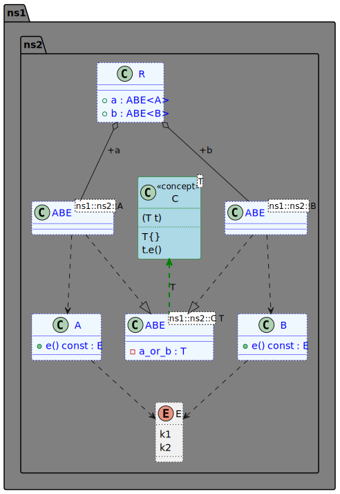

# t00075 - Test case for class diagram styles in config file
## Config
```yaml
diagrams:
  t00075_class:
    type: class
    glob:
      - t00075.cc
    include:
      namespaces:
        - clanguml::t00075
    generate_packages: true
    using_namespace: clanguml::t00075
    plantuml:
      style:
        concept: "#line:green;back:lightblue"
        class: "#aliceblue;line:blue;line.dotted;text:blue"
        package: "#back:grey"
        enum: "#line.dotted"
        constraint: "up[#green,dashed,thickness=2]"

```
## Source code
File `tests/t00075/t00075.cc`
```cpp
namespace clanguml {
namespace t00075 {
namespace ns1 {
namespace ns2 {

template <typename T>
concept C = requires(T t) {
                T{};
                t.e();
            };

enum class E { k1, k2 };

struct A {
    E e() const { return E::k1; };
};

class B {
public:
    E e() const { return E::k2; };
};

template <C T> class ABE {
    T a_or_b;
};

struct R {
    ABE<A> a;
    ABE<B> b;
};
} // namespace ns2
} // namespace ns1
}
}
```
## Generated PlantUML diagrams

## Generated Mermaid diagrams

## Generated JSON models
```json
{
  "diagram_type": "class",
  "elements": [
    {
      "display_name": "ns1",
      "elements": [
        {
          "display_name": "ns2",
          "elements": [
            {
              "display_name": "C<T>",
              "id": "1809332102026994985",
              "name": "C",
              "namespace": "clanguml::t00075::ns1::ns2",
              "parameters": [
                {
                  "name": "t",
                  "type": "T"
                }
              ],
              "source_location": {
                "column": 9,
                "file": "t00075.cc",
                "line": 7,
                "translation_unit": "t00075.cc"
              },
              "statements": [
                "T{}",
                "t.e()"
              ],
              "type": "concept"
            },
            {
              "constants": [
                "k1",
                "k2"
              ],
              "display_name": "E",
              "id": "1495076068471344273",
              "is_nested": false,
              "name": "E",
              "namespace": "clanguml::t00075::ns1::ns2",
              "source_location": {
                "column": 12,
                "file": "t00075.cc",
                "line": 12,
                "translation_unit": "t00075.cc"
              },
              "type": "enum"
            },
            {
              "bases": [],
              "display_name": "A",
              "id": "939187921829983364",
              "is_abstract": false,
              "is_nested": false,
              "is_struct": true,
              "is_template": false,
              "is_union": false,
              "members": [],
              "methods": [
                {
                  "access": "public",
                  "display_name": "e",
                  "is_const": true,
                  "is_consteval": false,
                  "is_constexpr": false,
                  "is_constructor": false,
                  "is_copy_assignment": false,
                  "is_coroutine": false,
                  "is_defaulted": false,
                  "is_deleted": false,
                  "is_move_assignment": false,
                  "is_noexcept": false,
                  "is_operator": false,
                  "is_pure_virtual": false,
                  "is_static": false,
                  "is_virtual": false,
                  "name": "e",
                  "parameters": [],
                  "source_location": {
                    "column": 7,
                    "file": "t00075.cc",
                    "line": 15,
                    "translation_unit": "t00075.cc"
                  },
                  "template_parameters": [],
                  "type": "E"
                }
              ],
              "name": "A",
              "namespace": "clanguml::t00075::ns1::ns2",
              "source_location": {
                "column": 8,
                "file": "t00075.cc",
                "line": 14,
                "translation_unit": "t00075.cc"
              },
              "template_parameters": [],
              "type": "class"
            },
            {
              "bases": [],
              "display_name": "B",
              "id": "707211578295440427",
              "is_abstract": false,
              "is_nested": false,
              "is_struct": false,
              "is_template": false,
              "is_union": false,
              "members": [],
              "methods": [
                {
                  "access": "public",
                  "display_name": "e",
                  "is_const": true,
                  "is_consteval": false,
                  "is_constexpr": false,
                  "is_constructor": false,
                  "is_copy_assignment": false,
                  "is_coroutine": false,
                  "is_defaulted": false,
                  "is_deleted": false,
                  "is_move_assignment": false,
                  "is_noexcept": false,
                  "is_operator": false,
                  "is_pure_virtual": false,
                  "is_static": false,
                  "is_virtual": false,
                  "name": "e",
                  "parameters": [],
                  "source_location": {
                    "column": 7,
                    "file": "t00075.cc",
                    "line": 20,
                    "translation_unit": "t00075.cc"
                  },
                  "template_parameters": [],
                  "type": "E"
                }
              ],
              "name": "B",
              "namespace": "clanguml::t00075::ns1::ns2",
              "source_location": {
                "column": 7,
                "file": "t00075.cc",
                "line": 18,
                "translation_unit": "t00075.cc"
              },
              "template_parameters": [],
              "type": "class"
            },
            {
              "bases": [],
              "display_name": "ABE<ns1::ns2::C T>",
              "id": "783353028058924890",
              "is_abstract": false,
              "is_nested": false,
              "is_struct": false,
              "is_template": true,
              "is_union": false,
              "members": [
                {
                  "access": "private",
                  "is_static": false,
                  "name": "a_or_b",
                  "source_location": {
                    "column": 7,
                    "file": "t00075.cc",
                    "line": 24,
                    "translation_unit": "t00075.cc"
                  },
                  "type": "T"
                }
              ],
              "methods": [],
              "name": "ABE",
              "namespace": "clanguml::t00075::ns1::ns2",
              "source_location": {
                "column": 22,
                "file": "t00075.cc",
                "line": 23,
                "translation_unit": "t00075.cc"
              },
              "template_parameters": [
                {
                  "is_variadic": false,
                  "kind": "template_type",
                  "name": "T",
                  "template_parameters": []
                }
              ],
              "type": "class"
            },
            {
              "bases": [],
              "display_name": "ABE<ns1::ns2::A>",
              "id": "1387241450840584649",
              "is_abstract": false,
              "is_nested": false,
              "is_struct": false,
              "is_template": true,
              "is_union": false,
              "members": [],
              "methods": [],
              "name": "ABE",
              "namespace": "clanguml::t00075::ns1::ns2",
              "source_location": {
                "column": 22,
                "file": "t00075.cc",
                "line": 23,
                "translation_unit": "t00075.cc"
              },
              "template_parameters": [
                {
                  "is_variadic": false,
                  "kind": "argument",
                  "template_parameters": [],
                  "type": "ns1::ns2::A"
                }
              ],
              "type": "class"
            },
            {
              "bases": [],
              "display_name": "ABE<ns1::ns2::B>",
              "id": "1119831184809815406",
              "is_abstract": false,
              "is_nested": false,
              "is_struct": false,
              "is_template": true,
              "is_union": false,
              "members": [],
              "methods": [],
              "name": "ABE",
              "namespace": "clanguml::t00075::ns1::ns2",
              "source_location": {
                "column": 22,
                "file": "t00075.cc",
                "line": 23,
                "translation_unit": "t00075.cc"
              },
              "template_parameters": [
                {
                  "is_variadic": false,
                  "kind": "argument",
                  "template_parameters": [],
                  "type": "ns1::ns2::B"
                }
              ],
              "type": "class"
            },
            {
              "bases": [],
              "display_name": "R",
              "id": "48082947340048353",
              "is_abstract": false,
              "is_nested": false,
              "is_struct": true,
              "is_template": false,
              "is_union": false,
              "members": [
                {
                  "access": "public",
                  "is_static": false,
                  "name": "a",
                  "source_location": {
                    "column": 12,
                    "file": "t00075.cc",
                    "line": 28,
                    "translation_unit": "t00075.cc"
                  },
                  "type": "ABE<A>"
                },
                {
                  "access": "public",
                  "is_static": false,
                  "name": "b",
                  "source_location": {
                    "column": 12,
                    "file": "t00075.cc",
                    "line": 29,
                    "translation_unit": "t00075.cc"
                  },
                  "type": "ABE<B>"
                }
              ],
              "methods": [],
              "name": "R",
              "namespace": "clanguml::t00075::ns1::ns2",
              "source_location": {
                "column": 8,
                "file": "t00075.cc",
                "line": 27,
                "translation_unit": "t00075.cc"
              },
              "template_parameters": [],
              "type": "class"
            }
          ],
          "name": "ns2",
          "type": "namespace"
        }
      ],
      "name": "ns1",
      "type": "namespace"
    }
  ],
  "name": "t00075_class",
  "package_type": "namespace",
  "relationships": [
    {
      "access": "public",
      "destination": "1495076068471344273",
      "source": "939187921829983364",
      "type": "dependency"
    },
    {
      "access": "public",
      "destination": "1495076068471344273",
      "source": "707211578295440427",
      "type": "dependency"
    },
    {
      "destination": "1809332102026994985",
      "label": "T",
      "source": "783353028058924890",
      "type": "constraint"
    },
    {
      "access": "public",
      "destination": "939187921829983364",
      "source": "1387241450840584649",
      "type": "dependency"
    },
    {
      "access": "public",
      "destination": "783353028058924890",
      "source": "1387241450840584649",
      "type": "instantiation"
    },
    {
      "access": "public",
      "destination": "707211578295440427",
      "source": "1119831184809815406",
      "type": "dependency"
    },
    {
      "access": "public",
      "destination": "783353028058924890",
      "source": "1119831184809815406",
      "type": "instantiation"
    },
    {
      "access": "public",
      "destination": "1387241450840584649",
      "label": "a",
      "source": "48082947340048353",
      "type": "aggregation"
    },
    {
      "access": "public",
      "destination": "1119831184809815406",
      "label": "b",
      "source": "48082947340048353",
      "type": "aggregation"
    }
  ],
  "using_namespace": "clanguml::t00075"
}
```
