# t00076 - Test case for context diagram with inward direction flag
## Config
```yaml
diagrams:
  t00076_class:
    type: class
    glob:
      - t00076.cc
    include:
      namespaces:
        - clanguml::t00076
      context:
        - match:
            radius: 2
            pattern: clanguml::t00076::B
            direction: inward
    using_namespace: clanguml::t00076
```
## Source code
File `tests/t00076/t00076.cc`
```cpp
namespace clanguml {
namespace t00076 {

enum Color { red, green, blue };

struct F;
struct GG { };
struct G {
    GG gg;
};
struct GGG {
    G g;
};
struct H { };
struct J { };

struct A { };

struct B : public A {
    F *f;
    Color c;
    G g;
    /// @uml{composition[0..1:1..*]}
    J j;

    struct BB { };

    BB *bb;

    void a(H *h) { (void)h; }
};

struct C : public B { };

struct D : public C { };

struct EE { };

struct E {
    B *b;
    EE *ee;
};

struct EEE {
    E *e;
};

struct F { };

struct I {
    void i(B *b) { (void)b; }
};
}
}
```
## Generated PlantUML diagrams

## Generated Mermaid diagrams

## Generated JSON models
```json
{
  "diagram_type": "class",
  "elements": [
    {
      "constants": [
        "red",
        "green",
        "blue"
      ],
      "display_name": "Color",
      "id": "1357160052467496131",
      "is_nested": false,
      "name": "Color",
      "namespace": "clanguml::t00076",
      "source_location": {
        "column": 6,
        "file": "t00076.cc",
        "line": 4,
        "translation_unit": "t00076.cc"
      },
      "type": "enum"
    },
    {
      "bases": [],
      "display_name": "GG",
      "id": "268571154127239712",
      "is_abstract": false,
      "is_nested": false,
      "is_struct": true,
      "is_template": false,
      "is_union": false,
      "members": [],
      "methods": [],
      "name": "GG",
      "namespace": "clanguml::t00076",
      "source_location": {
        "column": 8,
        "file": "t00076.cc",
        "line": 7,
        "translation_unit": "t00076.cc"
      },
      "template_parameters": [],
      "type": "class"
    },
    {
      "bases": [],
      "display_name": "G",
      "id": "14155804895193829672",
      "is_abstract": false,
      "is_nested": false,
      "is_struct": true,
      "is_template": false,
      "is_union": false,
      "members": [
        {
          "access": "public",
          "is_static": false,
          "name": "gg",
          "source_location": {
            "column": 8,
            "file": "t00076.cc",
            "line": 9,
            "translation_unit": "t00076.cc"
          },
          "type": "GG"
        }
      ],
      "methods": [],
      "name": "G",
      "namespace": "clanguml::t00076",
      "source_location": {
        "column": 8,
        "file": "t00076.cc",
        "line": 8,
        "translation_unit": "t00076.cc"
      },
      "template_parameters": [],
      "type": "class"
    },
    {
      "bases": [],
      "display_name": "J",
      "id": "2798432465627505061",
      "is_abstract": false,
      "is_nested": false,
      "is_struct": true,
      "is_template": false,
      "is_union": false,
      "members": [],
      "methods": [],
      "name": "J",
      "namespace": "clanguml::t00076",
      "source_location": {
        "column": 8,
        "file": "t00076.cc",
        "line": 15,
        "translation_unit": "t00076.cc"
      },
      "template_parameters": [],
      "type": "class"
    },
    {
      "bases": [],
      "display_name": "B",
      "id": "17401388407958641079",
      "is_abstract": false,
      "is_nested": false,
      "is_struct": true,
      "is_template": false,
      "is_union": false,
      "members": [
        {
          "access": "public",
          "is_static": false,
          "name": "f",
          "source_location": {
            "column": 8,
            "file": "t00076.cc",
            "line": 20,
            "translation_unit": "t00076.cc"
          },
          "type": "F *"
        },
        {
          "access": "public",
          "is_static": false,
          "name": "c",
          "source_location": {
            "column": 11,
            "file": "t00076.cc",
            "line": 21,
            "translation_unit": "t00076.cc"
          },
          "type": "Color"
        },
        {
          "access": "public",
          "is_static": false,
          "name": "g",
          "source_location": {
            "column": 7,
            "file": "t00076.cc",
            "line": 22,
            "translation_unit": "t00076.cc"
          },
          "type": "G"
        },
        {
          "access": "public",
          "comment": {
            "formatted": "@uml{composition[0..1:1..*]}",
            "raw": "/// @uml{composition[0..1:1..*]}"
          },
          "is_static": false,
          "name": "j",
          "source_location": {
            "column": 7,
            "file": "t00076.cc",
            "line": 24,
            "translation_unit": "t00076.cc"
          },
          "type": "J"
        },
        {
          "access": "public",
          "is_static": false,
          "name": "bb",
          "source_location": {
            "column": 9,
            "file": "t00076.cc",
            "line": 28,
            "translation_unit": "t00076.cc"
          },
          "type": "BB *"
        }
      ],
      "methods": [
        {
          "access": "public",
          "display_name": "a",
          "is_const": false,
          "is_consteval": false,
          "is_constexpr": false,
          "is_constructor": false,
          "is_copy_assignment": false,
          "is_coroutine": false,
          "is_defaulted": false,
          "is_deleted": false,
          "is_move_assignment": false,
          "is_noexcept": false,
          "is_operator": false,
          "is_pure_virtual": false,
          "is_static": false,
          "is_virtual": false,
          "name": "a",
          "parameters": [
            {
              "name": "h",
              "type": "H *"
            }
          ],
          "source_location": {
            "column": 10,
            "file": "t00076.cc",
            "line": 30,
            "translation_unit": "t00076.cc"
          },
          "template_parameters": [],
          "type": "void"
        }
      ],
      "name": "B",
      "namespace": "clanguml::t00076",
      "source_location": {
        "column": 8,
        "file": "t00076.cc",
        "line": 19,
        "translation_unit": "t00076.cc"
      },
      "template_parameters": [],
      "type": "class"
    },
    {
      "bases": [],
      "display_name": "B::BB",
      "id": "8692768569991895602",
      "is_abstract": false,
      "is_nested": true,
      "is_struct": true,
      "is_template": false,
      "is_union": false,
      "members": [],
      "methods": [],
      "name": "B##BB",
      "namespace": "clanguml::t00076",
      "source_location": {
        "column": 12,
        "file": "t00076.cc",
        "line": 26,
        "translation_unit": "t00076.cc"
      },
      "template_parameters": [],
      "type": "class"
    },
    {
      "bases": [
        {
          "access": "public",
          "id": "17401388407958641079",
          "is_virtual": false
        }
      ],
      "display_name": "C",
      "id": "6450714203544144591",
      "is_abstract": false,
      "is_nested": false,
      "is_struct": true,
      "is_template": false,
      "is_union": false,
      "members": [],
      "methods": [],
      "name": "C",
      "namespace": "clanguml::t00076",
      "source_location": {
        "column": 8,
        "file": "t00076.cc",
        "line": 33,
        "translation_unit": "t00076.cc"
      },
      "template_parameters": [],
      "type": "class"
    },
    {
      "bases": [
        {
          "access": "public",
          "id": "6450714203544144591",
          "is_virtual": false
        }
      ],
      "display_name": "D",
      "id": "8310927683014217983",
      "is_abstract": false,
      "is_nested": false,
      "is_struct": true,
      "is_template": false,
      "is_union": false,
      "members": [],
      "methods": [],
      "name": "D",
      "namespace": "clanguml::t00076",
      "source_location": {
        "column": 8,
        "file": "t00076.cc",
        "line": 35,
        "translation_unit": "t00076.cc"
      },
      "template_parameters": [],
      "type": "class"
    },
    {
      "bases": [],
      "display_name": "E",
      "id": "17377451137994128435",
      "is_abstract": false,
      "is_nested": false,
      "is_struct": true,
      "is_template": false,
      "is_union": false,
      "members": [
        {
          "access": "public",
          "is_static": false,
          "name": "b",
          "source_location": {
            "column": 8,
            "file": "t00076.cc",
            "line": 40,
            "translation_unit": "t00076.cc"
          },
          "type": "B *"
        },
        {
          "access": "public",
          "is_static": false,
          "name": "ee",
          "source_location": {
            "column": 9,
            "file": "t00076.cc",
            "line": 41,
            "translation_unit": "t00076.cc"
          },
          "type": "EE *"
        }
      ],
      "methods": [],
      "name": "E",
      "namespace": "clanguml::t00076",
      "source_location": {
        "column": 8,
        "file": "t00076.cc",
        "line": 39,
        "translation_unit": "t00076.cc"
      },
      "template_parameters": [],
      "type": "class"
    },
    {
      "bases": [],
      "display_name": "EEE",
      "id": "6110290676921432917",
      "is_abstract": false,
      "is_nested": false,
      "is_struct": true,
      "is_template": false,
      "is_union": false,
      "members": [
        {
          "access": "public",
          "is_static": false,
          "name": "e",
          "source_location": {
            "column": 8,
            "file": "t00076.cc",
            "line": 45,
            "translation_unit": "t00076.cc"
          },
          "type": "E *"
        }
      ],
      "methods": [],
      "name": "EEE",
      "namespace": "clanguml::t00076",
      "source_location": {
        "column": 8,
        "file": "t00076.cc",
        "line": 44,
        "translation_unit": "t00076.cc"
      },
      "template_parameters": [],
      "type": "class"
    },
    {
      "bases": [],
      "display_name": "I",
      "id": "427444038316199137",
      "is_abstract": false,
      "is_nested": false,
      "is_struct": true,
      "is_template": false,
      "is_union": false,
      "members": [],
      "methods": [
        {
          "access": "public",
          "display_name": "i",
          "is_const": false,
          "is_consteval": false,
          "is_constexpr": false,
          "is_constructor": false,
          "is_copy_assignment": false,
          "is_coroutine": false,
          "is_defaulted": false,
          "is_deleted": false,
          "is_move_assignment": false,
          "is_noexcept": false,
          "is_operator": false,
          "is_pure_virtual": false,
          "is_static": false,
          "is_virtual": false,
          "name": "i",
          "parameters": [
            {
              "name": "b",
              "type": "B *"
            }
          ],
          "source_location": {
            "column": 10,
            "file": "t00076.cc",
            "line": 51,
            "translation_unit": "t00076.cc"
          },
          "template_parameters": [],
          "type": "void"
        }
      ],
      "name": "I",
      "namespace": "clanguml::t00076",
      "source_location": {
        "column": 8,
        "file": "t00076.cc",
        "line": 50,
        "translation_unit": "t00076.cc"
      },
      "template_parameters": [],
      "type": "class"
    }
  ],
  "name": "t00076_class",
  "package_type": "namespace",
  "relationships": [
    {
      "access": "public",
      "destination": "268571154127239712",
      "label": "gg",
      "source": "14155804895193829672",
      "type": "aggregation"
    },
    {
      "access": "public",
      "destination": "1357160052467496131",
      "label": "c",
      "source": "17401388407958641079",
      "type": "aggregation"
    },
    {
      "access": "public",
      "destination": "14155804895193829672",
      "label": "g",
      "source": "17401388407958641079",
      "type": "aggregation"
    },
    {
      "access": "public",
      "destination": "2798432465627505061",
      "label": "j",
      "multiplicity_destination": "1..*",
      "multiplicity_source": "0..1",
      "source": "17401388407958641079",
      "type": "composition"
    },
    {
      "access": "public",
      "destination": "8692768569991895602",
      "label": "bb",
      "source": "17401388407958641079",
      "type": "association"
    },
    {
      "access": "public",
      "destination": "17401388407958641079",
      "source": "8692768569991895602",
      "type": "containment"
    },
    {
      "access": "public",
      "destination": "17401388407958641079",
      "source": "6450714203544144591",
      "type": "extension"
    },
    {
      "access": "public",
      "destination": "6450714203544144591",
      "source": "8310927683014217983",
      "type": "extension"
    },
    {
      "access": "public",
      "destination": "17401388407958641079",
      "label": "b",
      "source": "17377451137994128435",
      "type": "association"
    },
    {
      "access": "public",
      "destination": "17377451137994128435",
      "label": "e",
      "source": "6110290676921432917",
      "type": "association"
    },
    {
      "access": "public",
      "destination": "17401388407958641079",
      "source": "427444038316199137",
      "type": "dependency"
    }
  ],
  "using_namespace": "clanguml::t00076"
}
```
## Generated GraphML models
```xml
<?xml version="1.0"?>
<graphml xmlns="http://graphml.graphdrawing.org/xmlns" xmlns:xsi="http://www.w3.org/2001/XMLSchema-instance" xsi:schemaLocation="http://graphml.graphdrawing.org/xmlns http://graphml.graphdrawing.org/xmlns/1.0/graphml.xsd">
 <key attr.name="id" attr.type="string" for="graph" id="gd0" />
 <key attr.name="diagram_type" attr.type="string" for="graph" id="gd1" />
 <key attr.name="name" attr.type="string" for="graph" id="gd2" />
 <key attr.name="using_namespace" attr.type="string" for="graph" id="gd3" />
 <key attr.name="id" attr.type="string" for="node" id="nd0" />
 <key attr.name="type" attr.type="string" for="node" id="nd1" />
 <key attr.name="name" attr.type="string" for="node" id="nd2" />
 <key attr.name="stereotype" attr.type="string" for="node" id="nd3" />
 <key attr.name="url" attr.type="string" for="node" id="nd4" />
 <key attr.name="tooltip" attr.type="string" for="node" id="nd5" />
 <key attr.name="is_template" attr.type="boolean" for="node" id="nd6" />
 <key attr.name="type" attr.type="string" for="edge" id="ed0" />
 <key attr.name="access" attr.type="string" for="edge" id="ed1" />
 <key attr.name="label" attr.type="string" for="edge" id="ed2" />
 <key attr.name="url" attr.type="string" for="edge" id="ed3" />
 <graph id="g0" edgedefault="directed" parse.nodeids="canonical" parse.edgeids="canonical" parse.order="nodesfirst">
  <data key="gd3">clanguml::t00076</data>
  <node id="n0">
   <data key="nd1">enum</data>
   <data key="nd2"><![CDATA[Color]]></data>
   <data key="nd4">https://github.com/bkryza/clang-uml/blob/375fb0bfc3a0e0b702776c4e39f79ee848c5c67c/tests/t00076/t00076.cc#L4</data>
   <data key="nd5">Color</data>
  </node>
  <node id="n1">
   <data key="nd1">class</data>
   <data key="nd2"><![CDATA[GG]]></data>
   <data key="nd6">false</data>
   <data key="nd4">https://github.com/bkryza/clang-uml/blob/375fb0bfc3a0e0b702776c4e39f79ee848c5c67c/tests/t00076/t00076.cc#L7</data>
   <data key="nd5">GG</data>
  </node>
  <node id="n2">
   <data key="nd1">class</data>
   <data key="nd2"><![CDATA[G]]></data>
   <data key="nd6">false</data>
   <data key="nd4">https://github.com/bkryza/clang-uml/blob/375fb0bfc3a0e0b702776c4e39f79ee848c5c67c/tests/t00076/t00076.cc#L8</data>
   <data key="nd5">G</data>
  </node>
  <node id="n3">
   <data key="nd1">class</data>
   <data key="nd2"><![CDATA[J]]></data>
   <data key="nd6">false</data>
   <data key="nd4">https://github.com/bkryza/clang-uml/blob/375fb0bfc3a0e0b702776c4e39f79ee848c5c67c/tests/t00076/t00076.cc#L15</data>
   <data key="nd5">J</data>
  </node>
  <node id="n4">
   <data key="nd1">class</data>
   <data key="nd2"><![CDATA[B]]></data>
   <data key="nd6">false</data>
   <data key="nd4">https://github.com/bkryza/clang-uml/blob/375fb0bfc3a0e0b702776c4e39f79ee848c5c67c/tests/t00076/t00076.cc#L19</data>
   <data key="nd5">B</data>
  </node>
  <node id="n5">
   <data key="nd1">class</data>
   <data key="nd2"><![CDATA[B::BB]]></data>
   <data key="nd6">false</data>
   <data key="nd4">https://github.com/bkryza/clang-uml/blob/375fb0bfc3a0e0b702776c4e39f79ee848c5c67c/tests/t00076/t00076.cc#L26</data>
   <data key="nd5">B::BB</data>
  </node>
  <node id="n6">
   <data key="nd1">class</data>
   <data key="nd2"><![CDATA[C]]></data>
   <data key="nd6">false</data>
   <data key="nd4">https://github.com/bkryza/clang-uml/blob/375fb0bfc3a0e0b702776c4e39f79ee848c5c67c/tests/t00076/t00076.cc#L33</data>
   <data key="nd5">C</data>
  </node>
  <node id="n7">
   <data key="nd1">class</data>
   <data key="nd2"><![CDATA[D]]></data>
   <data key="nd6">false</data>
   <data key="nd4">https://github.com/bkryza/clang-uml/blob/375fb0bfc3a0e0b702776c4e39f79ee848c5c67c/tests/t00076/t00076.cc#L35</data>
   <data key="nd5">D</data>
  </node>
  <node id="n8">
   <data key="nd1">class</data>
   <data key="nd2"><![CDATA[E]]></data>
   <data key="nd6">false</data>
   <data key="nd4">https://github.com/bkryza/clang-uml/blob/375fb0bfc3a0e0b702776c4e39f79ee848c5c67c/tests/t00076/t00076.cc#L39</data>
   <data key="nd5">E</data>
  </node>
  <node id="n9">
   <data key="nd1">class</data>
   <data key="nd2"><![CDATA[EEE]]></data>
   <data key="nd6">false</data>
   <data key="nd4">https://github.com/bkryza/clang-uml/blob/375fb0bfc3a0e0b702776c4e39f79ee848c5c67c/tests/t00076/t00076.cc#L44</data>
   <data key="nd5">EEE</data>
  </node>
  <node id="n10">
   <data key="nd1">class</data>
   <data key="nd2"><![CDATA[I]]></data>
   <data key="nd6">false</data>
   <data key="nd4">https://github.com/bkryza/clang-uml/blob/375fb0bfc3a0e0b702776c4e39f79ee848c5c67c/tests/t00076/t00076.cc#L50</data>
   <data key="nd5">I</data>
  </node>
  <edge id="e0" source="n2" target="n1">
   <data key="ed0">aggregation</data>
   <data key="ed2">gg</data>
   <data key="ed1">public</data>
  </edge>
  <edge id="e1" source="n4" target="n0">
   <data key="ed0">aggregation</data>
   <data key="ed2">c</data>
   <data key="ed1">public</data>
  </edge>
  <edge id="e2" source="n4" target="n2">
   <data key="ed0">aggregation</data>
   <data key="ed2">g</data>
   <data key="ed1">public</data>
  </edge>
  <edge id="e3" source="n4" target="n3">
   <data key="ed0">composition</data>
   <data key="ed2">j</data>
   <data key="ed1">public</data>
  </edge>
  <edge id="e4" source="n4" target="n5">
   <data key="ed0">association</data>
   <data key="ed2">bb</data>
   <data key="ed1">public</data>
  </edge>
  <edge id="e5" source="n5" target="n4">
   <data key="ed0">containment</data>
   <data key="ed1">public</data>
  </edge>
  <edge id="e6" source="n6" target="n4">
   <data key="ed0">extension</data>
   <data key="ed1">public</data>
  </edge>
  <edge id="e7" source="n7" target="n6">
   <data key="ed0">extension</data>
   <data key="ed1">public</data>
  </edge>
  <edge id="e8" source="n8" target="n4">
   <data key="ed0">association</data>
   <data key="ed2">b</data>
   <data key="ed1">public</data>
  </edge>
  <edge id="e9" source="n9" target="n8">
   <data key="ed0">association</data>
   <data key="ed2">e</data>
   <data key="ed1">public</data>
  </edge>
  <edge id="e10" source="n10" target="n4">
   <data key="ed0">dependency</data>
   <data key="ed1">public</data>
  </edge>
 </graph>
</graphml>

```
