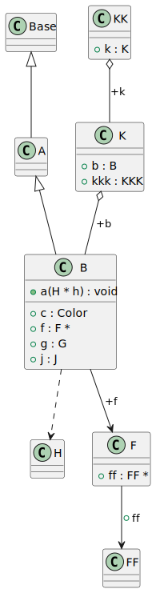

# t00077 - Test case for context diagram with outward direction flag
## Config
```yaml
diagrams:
  t00077_class:
    type: class
    glob:
      - t00077.cc
    include:
      namespaces:
        - clanguml::t00077
      context:
        - match:
            radius: 2
            pattern: clanguml::t00077::B
            direction: outward
    using_namespace: clanguml::t00077
```
## Source code
File `tests/t00077/t00077.cc`
```cpp
namespace clanguml {
namespace t00077 {

enum Color { red, green, blue };

struct F;
struct GG { };
struct G {
    GG gg;
};
struct GGG {
    G g;
};
struct H { };
struct J { };

struct Base { };

struct A : public Base { };

struct B : public A {
    F *f;
    Color c;
    G g;
    /// @uml{composition[0..1:1..*]}
    J j;

    void a(H *h) { (void)h; }
};

struct C : public B { };

struct D : public C { };

struct EE { };

struct E {
    B *b;
    EE *ee;
};

struct EEE {
    E *e;
};

struct FF { };
struct F {
    FF *ff;
};
struct FFF {
    F *f;
};

struct I {
    void i(B *b) { (void)b; }
};

struct KKK { };

struct K {
    B b;
    KKK kkk;
};

struct KK {
    K k;
};
}
}
```
## Generated PlantUML diagrams

## Generated Mermaid diagrams

## Generated JSON models
```json
{
  "diagram_type": "class",
  "elements": [
    {
      "bases": [],
      "display_name": "H",
      "id": "4471280448157207059",
      "is_abstract": false,
      "is_nested": false,
      "is_struct": true,
      "is_template": false,
      "is_union": false,
      "members": [],
      "methods": [],
      "name": "H",
      "namespace": "clanguml::t00077",
      "source_location": {
        "column": 8,
        "file": "t00077.cc",
        "line": 14,
        "translation_unit": "t00077.cc"
      },
      "template_parameters": [],
      "type": "class"
    },
    {
      "bases": [],
      "display_name": "Base",
      "id": "962922109375459669",
      "is_abstract": false,
      "is_nested": false,
      "is_struct": true,
      "is_template": false,
      "is_union": false,
      "members": [],
      "methods": [],
      "name": "Base",
      "namespace": "clanguml::t00077",
      "source_location": {
        "column": 8,
        "file": "t00077.cc",
        "line": 17,
        "translation_unit": "t00077.cc"
      },
      "template_parameters": [],
      "type": "class"
    },
    {
      "bases": [
        {
          "access": "public",
          "id": "962922109375459669",
          "is_virtual": false,
          "name": "A"
        }
      ],
      "display_name": "A",
      "id": "11110555698388355337",
      "is_abstract": false,
      "is_nested": false,
      "is_struct": true,
      "is_template": false,
      "is_union": false,
      "members": [],
      "methods": [],
      "name": "A",
      "namespace": "clanguml::t00077",
      "source_location": {
        "column": 8,
        "file": "t00077.cc",
        "line": 19,
        "translation_unit": "t00077.cc"
      },
      "template_parameters": [],
      "type": "class"
    },
    {
      "bases": [
        {
          "access": "public",
          "id": "11110555698388355337",
          "is_virtual": false,
          "name": "B"
        }
      ],
      "display_name": "B",
      "id": "611485414721657062",
      "is_abstract": false,
      "is_nested": false,
      "is_struct": true,
      "is_template": false,
      "is_union": false,
      "members": [
        {
          "access": "public",
          "is_static": false,
          "name": "f",
          "source_location": {
            "column": 8,
            "file": "t00077.cc",
            "line": 22,
            "translation_unit": "t00077.cc"
          },
          "type": "F *"
        },
        {
          "access": "public",
          "is_static": false,
          "name": "c",
          "source_location": {
            "column": 11,
            "file": "t00077.cc",
            "line": 23,
            "translation_unit": "t00077.cc"
          },
          "type": "Color"
        },
        {
          "access": "public",
          "is_static": false,
          "name": "g",
          "source_location": {
            "column": 7,
            "file": "t00077.cc",
            "line": 24,
            "translation_unit": "t00077.cc"
          },
          "type": "G"
        },
        {
          "access": "public",
          "comment": {
            "formatted": "@uml{composition[0..1:1..*]}",
            "raw": "/// @uml{composition[0..1:1..*]}"
          },
          "is_static": false,
          "name": "j",
          "source_location": {
            "column": 7,
            "file": "t00077.cc",
            "line": 26,
            "translation_unit": "t00077.cc"
          },
          "type": "J"
        }
      ],
      "methods": [
        {
          "access": "public",
          "display_name": "a",
          "is_const": false,
          "is_consteval": false,
          "is_constexpr": false,
          "is_constructor": false,
          "is_copy_assignment": false,
          "is_coroutine": false,
          "is_defaulted": false,
          "is_deleted": false,
          "is_move_assignment": false,
          "is_noexcept": false,
          "is_operator": false,
          "is_pure_virtual": false,
          "is_static": false,
          "is_virtual": false,
          "name": "a",
          "parameters": [
            {
              "name": "h",
              "type": "H *"
            }
          ],
          "source_location": {
            "column": 10,
            "file": "t00077.cc",
            "line": 28,
            "translation_unit": "t00077.cc"
          },
          "template_parameters": [],
          "type": "void"
        }
      ],
      "name": "B",
      "namespace": "clanguml::t00077",
      "source_location": {
        "column": 8,
        "file": "t00077.cc",
        "line": 21,
        "translation_unit": "t00077.cc"
      },
      "template_parameters": [],
      "type": "class"
    },
    {
      "bases": [],
      "display_name": "FF",
      "id": "100067327928786611",
      "is_abstract": false,
      "is_nested": false,
      "is_struct": true,
      "is_template": false,
      "is_union": false,
      "members": [],
      "methods": [],
      "name": "FF",
      "namespace": "clanguml::t00077",
      "source_location": {
        "column": 8,
        "file": "t00077.cc",
        "line": 46,
        "translation_unit": "t00077.cc"
      },
      "template_parameters": [],
      "type": "class"
    },
    {
      "bases": [],
      "display_name": "F",
      "id": "4107826685860758244",
      "is_abstract": false,
      "is_nested": false,
      "is_struct": true,
      "is_template": false,
      "is_union": false,
      "members": [
        {
          "access": "public",
          "is_static": false,
          "name": "ff",
          "source_location": {
            "column": 9,
            "file": "t00077.cc",
            "line": 48,
            "translation_unit": "t00077.cc"
          },
          "type": "FF *"
        }
      ],
      "methods": [],
      "name": "F",
      "namespace": "clanguml::t00077",
      "source_location": {
        "column": 8,
        "file": "t00077.cc",
        "line": 47,
        "translation_unit": "t00077.cc"
      },
      "template_parameters": [],
      "type": "class"
    },
    {
      "bases": [],
      "display_name": "K",
      "id": "2855344937087077573",
      "is_abstract": false,
      "is_nested": false,
      "is_struct": true,
      "is_template": false,
      "is_union": false,
      "members": [
        {
          "access": "public",
          "is_static": false,
          "name": "b",
          "source_location": {
            "column": 7,
            "file": "t00077.cc",
            "line": 61,
            "translation_unit": "t00077.cc"
          },
          "type": "B"
        },
        {
          "access": "public",
          "is_static": false,
          "name": "kkk",
          "source_location": {
            "column": 9,
            "file": "t00077.cc",
            "line": 62,
            "translation_unit": "t00077.cc"
          },
          "type": "KKK"
        }
      ],
      "methods": [],
      "name": "K",
      "namespace": "clanguml::t00077",
      "source_location": {
        "column": 8,
        "file": "t00077.cc",
        "line": 60,
        "translation_unit": "t00077.cc"
      },
      "template_parameters": [],
      "type": "class"
    },
    {
      "bases": [],
      "display_name": "KK",
      "id": "16909696417266973013",
      "is_abstract": false,
      "is_nested": false,
      "is_struct": true,
      "is_template": false,
      "is_union": false,
      "members": [
        {
          "access": "public",
          "is_static": false,
          "name": "k",
          "source_location": {
            "column": 7,
            "file": "t00077.cc",
            "line": 66,
            "translation_unit": "t00077.cc"
          },
          "type": "K"
        }
      ],
      "methods": [],
      "name": "KK",
      "namespace": "clanguml::t00077",
      "source_location": {
        "column": 8,
        "file": "t00077.cc",
        "line": 65,
        "translation_unit": "t00077.cc"
      },
      "template_parameters": [],
      "type": "class"
    }
  ],
  "name": "t00077_class",
  "package_type": "namespace",
  "relationships": [
    {
      "access": "public",
      "destination": "962922109375459669",
      "source": "11110555698388355337",
      "type": "extension"
    },
    {
      "access": "public",
      "destination": "4471280448157207059",
      "source": "611485414721657062",
      "type": "dependency"
    },
    {
      "access": "public",
      "destination": "4107826685860758244",
      "label": "f",
      "source": "611485414721657062",
      "type": "association"
    },
    {
      "access": "public",
      "destination": "11110555698388355337",
      "source": "611485414721657062",
      "type": "extension"
    },
    {
      "access": "public",
      "destination": "100067327928786611",
      "label": "ff",
      "source": "4107826685860758244",
      "type": "association"
    },
    {
      "access": "public",
      "destination": "611485414721657062",
      "label": "b",
      "source": "2855344937087077573",
      "type": "aggregation"
    },
    {
      "access": "public",
      "destination": "2855344937087077573",
      "label": "k",
      "source": "16909696417266973013",
      "type": "aggregation"
    }
  ],
  "using_namespace": "clanguml::t00077"
}
```
