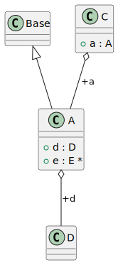

# t00078 - Test case for context diagram with relationships option
## Config
```yaml
diagrams:
  t00078_class:
    type: class
    glob:
      - t00078.cc
    include:
      namespaces:
        - clanguml::t00078
      context:
        - match:
            radius: 1
            pattern: clanguml::t00078::A
            relationships:
              - inheritance
              - aggregation
    using_namespace: clanguml::t00078
```
## Source code
File `tests/t00078/t00078.cc`
```cpp
namespace clanguml {
namespace t00078 {

struct Base { };

struct D { };
struct E { };
struct A : public Base {
    D d;
    E *e;
};

struct B {
    A *a;
};

struct C {
    A a;
};

}
}
```
## Generated PlantUML diagrams

## Generated Mermaid diagrams

## Generated JSON models
```json
{
  "diagram_type": "class",
  "elements": [
    {
      "bases": [],
      "display_name": "Base",
      "id": "8530329873091241519",
      "is_abstract": false,
      "is_nested": false,
      "is_struct": true,
      "is_template": false,
      "is_union": false,
      "members": [],
      "methods": [],
      "name": "Base",
      "namespace": "clanguml::t00078",
      "source_location": {
        "column": 8,
        "file": "t00078.cc",
        "line": 4,
        "translation_unit": "t00078.cc"
      },
      "template_parameters": [],
      "type": "class"
    },
    {
      "bases": [],
      "display_name": "D",
      "id": "827774810081248671",
      "is_abstract": false,
      "is_nested": false,
      "is_struct": true,
      "is_template": false,
      "is_union": false,
      "members": [],
      "methods": [],
      "name": "D",
      "namespace": "clanguml::t00078",
      "source_location": {
        "column": 8,
        "file": "t00078.cc",
        "line": 6,
        "translation_unit": "t00078.cc"
      },
      "template_parameters": [],
      "type": "class"
    },
    {
      "bases": [
        {
          "access": "public",
          "id": "8530329873091241519",
          "is_virtual": false
        }
      ],
      "display_name": "A",
      "id": "2648609453195038561",
      "is_abstract": false,
      "is_nested": false,
      "is_struct": true,
      "is_template": false,
      "is_union": false,
      "members": [
        {
          "access": "public",
          "is_static": false,
          "name": "d",
          "source_location": {
            "column": 7,
            "file": "t00078.cc",
            "line": 9,
            "translation_unit": "t00078.cc"
          },
          "type": "D"
        },
        {
          "access": "public",
          "is_static": false,
          "name": "e",
          "source_location": {
            "column": 8,
            "file": "t00078.cc",
            "line": 10,
            "translation_unit": "t00078.cc"
          },
          "type": "E *"
        }
      ],
      "methods": [],
      "name": "A",
      "namespace": "clanguml::t00078",
      "source_location": {
        "column": 8,
        "file": "t00078.cc",
        "line": 8,
        "translation_unit": "t00078.cc"
      },
      "template_parameters": [],
      "type": "class"
    },
    {
      "bases": [],
      "display_name": "C",
      "id": "17273429802989715399",
      "is_abstract": false,
      "is_nested": false,
      "is_struct": true,
      "is_template": false,
      "is_union": false,
      "members": [
        {
          "access": "public",
          "is_static": false,
          "name": "a",
          "source_location": {
            "column": 7,
            "file": "t00078.cc",
            "line": 18,
            "translation_unit": "t00078.cc"
          },
          "type": "A"
        }
      ],
      "methods": [],
      "name": "C",
      "namespace": "clanguml::t00078",
      "source_location": {
        "column": 8,
        "file": "t00078.cc",
        "line": 17,
        "translation_unit": "t00078.cc"
      },
      "template_parameters": [],
      "type": "class"
    }
  ],
  "name": "t00078_class",
  "package_type": "namespace",
  "relationships": [
    {
      "access": "public",
      "destination": "827774810081248671",
      "label": "d",
      "source": "2648609453195038561",
      "type": "aggregation"
    },
    {
      "access": "public",
      "destination": "8530329873091241519",
      "source": "2648609453195038561",
      "type": "extension"
    },
    {
      "access": "public",
      "destination": "2648609453195038561",
      "label": "a",
      "source": "17273429802989715399",
      "type": "aggregation"
    }
  ],
  "using_namespace": "clanguml::t00078"
}
```
## Generated GraphML models
```xml
<?xml version="1.0"?>
<graphml xmlns="http://graphml.graphdrawing.org/xmlns" xmlns:xsi="http://www.w3.org/2001/XMLSchema-instance" xsi:schemaLocation="http://graphml.graphdrawing.org/xmlns http://graphml.graphdrawing.org/xmlns/1.0/graphml.xsd">
 <key attr.name="id" attr.type="string" for="graph" id="gd0" />
 <key attr.name="diagram_type" attr.type="string" for="graph" id="gd1" />
 <key attr.name="name" attr.type="string" for="graph" id="gd2" />
 <key attr.name="using_namespace" attr.type="string" for="graph" id="gd3" />
 <key attr.name="id" attr.type="string" for="node" id="nd0" />
 <key attr.name="type" attr.type="string" for="node" id="nd1" />
 <key attr.name="name" attr.type="string" for="node" id="nd2" />
 <key attr.name="stereotype" attr.type="string" for="node" id="nd3" />
 <key attr.name="url" attr.type="string" for="node" id="nd4" />
 <key attr.name="tooltip" attr.type="string" for="node" id="nd5" />
 <key attr.name="is_template" attr.type="boolean" for="node" id="nd6" />
 <key attr.name="type" attr.type="string" for="edge" id="ed0" />
 <key attr.name="access" attr.type="string" for="edge" id="ed1" />
 <key attr.name="label" attr.type="string" for="edge" id="ed2" />
 <key attr.name="url" attr.type="string" for="edge" id="ed3" />
 <graph id="g0" edgedefault="directed" parse.nodeids="canonical" parse.edgeids="canonical" parse.order="nodesfirst">
  <data key="gd3">clanguml::t00078</data>
  <node id="n0">
   <data key="nd1">class</data>
   <data key="nd2"><![CDATA[Base]]></data>
   <data key="nd6">false</data>
   <data key="nd4">https://github.com/bkryza/clang-uml/blob/ca93ebc700c4d8ac5504d33adbb899f44e90a1a4/tests/t00078/t00078.cc#L4</data>
   <data key="nd5">Base</data>
  </node>
  <node id="n1">
   <data key="nd1">class</data>
   <data key="nd2"><![CDATA[D]]></data>
   <data key="nd6">false</data>
   <data key="nd4">https://github.com/bkryza/clang-uml/blob/ca93ebc700c4d8ac5504d33adbb899f44e90a1a4/tests/t00078/t00078.cc#L6</data>
   <data key="nd5">D</data>
  </node>
  <node id="n2">
   <data key="nd1">class</data>
   <data key="nd2"><![CDATA[A]]></data>
   <data key="nd6">false</data>
   <data key="nd4">https://github.com/bkryza/clang-uml/blob/ca93ebc700c4d8ac5504d33adbb899f44e90a1a4/tests/t00078/t00078.cc#L8</data>
   <data key="nd5">A</data>
  </node>
  <node id="n3">
   <data key="nd1">class</data>
   <data key="nd2"><![CDATA[C]]></data>
   <data key="nd6">false</data>
   <data key="nd4">https://github.com/bkryza/clang-uml/blob/ca93ebc700c4d8ac5504d33adbb899f44e90a1a4/tests/t00078/t00078.cc#L17</data>
   <data key="nd5">C</data>
  </node>
  <edge id="e0" source="n2" target="n1">
   <data key="ed0">aggregation</data>
   <data key="ed2">d</data>
   <data key="ed1">public</data>
  </edge>
  <edge id="e1" source="n2" target="n0">
   <data key="ed0">extension</data>
   <data key="ed1">public</data>
  </edge>
  <edge id="e2" source="n3" target="n2">
   <data key="ed0">aggregation</data>
   <data key="ed2">a</data>
   <data key="ed1">public</data>
  </edge>
 </graph>
</graphml>

```
