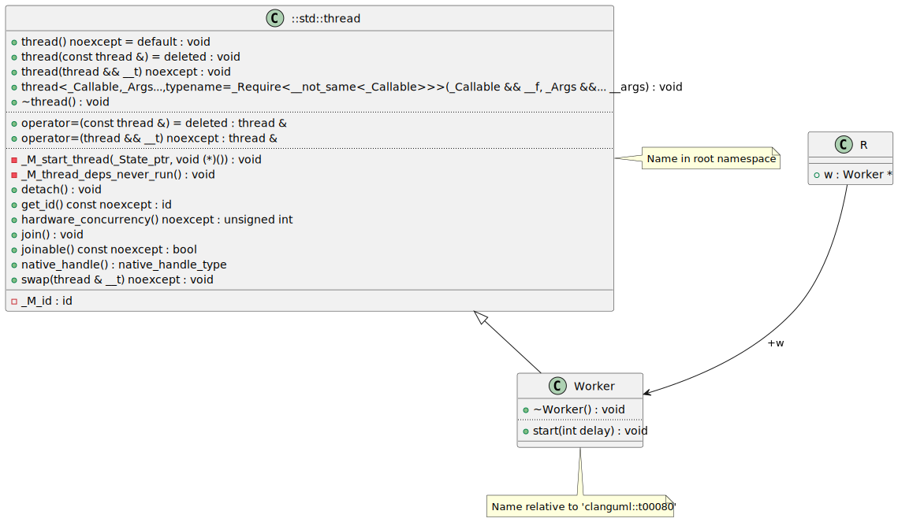

# t00080 - Test case for including elements from system headers
## Config
```yaml
diagrams:
  t00080_class:
    type: class
    filter_mode: advanced
    comment_parser: clang
    include_system_headers: true
    glob:
      - t00080.cc
    include:
      anyof:
        namespaces:
          - clanguml::t00080
        elements:
          - std::thread
    using_namespace: clanguml::t00080
```
## Source code
File `tests/t00080/t00080.cc`
```cpp
#include <thread>

namespace clanguml {
namespace t00080 {

class Worker : public std::thread {
public:
    using std::thread::thread;

    ~Worker()
    {
        if (this->joinable()) {
            this->join();
        }
    }

    void start(int delay) { }
};

struct R {
    Worker *w;
};
}
}
```
## Generated PlantUML diagrams

## Generated Mermaid diagrams

## Generated JSON models
```json
{
  "diagram_type": "class",
  "elements": [
    {
      "bases": [],
      "display_name": "std::thread",
      "id": "15292512913378933439",
      "is_abstract": false,
      "is_nested": false,
      "is_struct": false,
      "is_template": false,
      "is_union": false,
      "members": [
        {
          "access": "private",
          "is_static": false,
          "name": "_M_id",
          "source_location": {
            "column": 11,
            "file": "",
            "line": 132,
            "translation_unit": "t00080.cc"
          },
          "type": "id"
        }
      ],
      "methods": [
        {
          "access": "public",
          "display_name": "thread",
          "is_const": false,
          "is_consteval": false,
          "is_constexpr": false,
          "is_constructor": true,
          "is_copy_assignment": false,
          "is_coroutine": false,
          "is_defaulted": true,
          "is_deleted": false,
          "is_move_assignment": false,
          "is_noexcept": true,
          "is_operator": false,
          "is_pure_virtual": false,
          "is_static": false,
          "is_virtual": false,
          "name": "thread",
          "parameters": [],
          "source_location": {
            "column": 5,
            "file": "",
            "line": 141,
            "translation_unit": "t00080.cc"
          },
          "template_parameters": [],
          "type": "void"
        },
        {
          "access": "public",
          "display_name": "~thread",
          "is_const": false,
          "is_consteval": false,
          "is_constexpr": false,
          "is_constructor": false,
          "is_copy_assignment": false,
          "is_coroutine": false,
          "is_defaulted": false,
          "is_deleted": false,
          "is_move_assignment": false,
          "is_noexcept": false,
          "is_operator": false,
          "is_pure_virtual": false,
          "is_static": false,
          "is_virtual": false,
          "name": "~thread",
          "parameters": [],
          "source_location": {
            "column": 5,
            "file": "",
            "line": 169,
            "translation_unit": "t00080.cc"
          },
          "template_parameters": [],
          "type": "void"
        },
        {
          "access": "public",
          "display_name": "thread",
          "is_const": false,
          "is_consteval": false,
          "is_constexpr": false,
          "is_constructor": true,
          "is_copy_assignment": false,
          "is_coroutine": false,
          "is_defaulted": false,
          "is_deleted": true,
          "is_move_assignment": false,
          "is_noexcept": false,
          "is_operator": false,
          "is_pure_virtual": false,
          "is_static": false,
          "is_virtual": false,
          "name": "thread",
          "parameters": [
            {
              "name": "",
              "type": "const thread &"
            }
          ],
          "source_location": {
            "column": 5,
            "file": "",
            "line": 175,
            "translation_unit": "t00080.cc"
          },
          "template_parameters": [],
          "type": "void"
        },
        {
          "access": "public",
          "display_name": "thread",
          "is_const": false,
          "is_consteval": false,
          "is_constexpr": false,
          "is_constructor": true,
          "is_copy_assignment": false,
          "is_coroutine": false,
          "is_defaulted": false,
          "is_deleted": false,
          "is_move_assignment": false,
          "is_noexcept": true,
          "is_operator": false,
          "is_pure_virtual": false,
          "is_static": false,
          "is_virtual": false,
          "name": "thread",
          "parameters": [
            {
              "name": "__t",
              "type": "thread &&"
            }
          ],
          "source_location": {
            "column": 5,
            "file": "",
            "line": 177,
            "translation_unit": "t00080.cc"
          },
          "template_parameters": [],
          "type": "void"
        },
        {
          "access": "public",
          "display_name": "operator=",
          "is_const": false,
          "is_consteval": false,
          "is_constexpr": false,
          "is_constructor": false,
          "is_copy_assignment": true,
          "is_coroutine": false,
          "is_defaulted": false,
          "is_deleted": true,
          "is_move_assignment": false,
          "is_noexcept": false,
          "is_operator": true,
          "is_pure_virtual": false,
          "is_static": false,
          "is_virtual": false,
          "name": "operator=",
          "parameters": [
            {
              "name": "",
              "type": "const thread &"
            }
          ],
          "source_location": {
            "column": 13,
            "file": "",
            "line": 180,
            "translation_unit": "t00080.cc"
          },
          "template_parameters": [],
          "type": "thread &"
        },
        {
          "access": "public",
          "display_name": "operator=",
          "is_const": false,
          "is_consteval": false,
          "is_constexpr": false,
          "is_constructor": false,
          "is_copy_assignment": false,
          "is_coroutine": false,
          "is_defaulted": false,
          "is_deleted": false,
          "is_move_assignment": true,
          "is_noexcept": true,
          "is_operator": true,
          "is_pure_virtual": false,
          "is_static": false,
          "is_virtual": false,
          "name": "operator=",
          "parameters": [
            {
              "name": "__t",
              "type": "thread &&"
            }
          ],
          "source_location": {
            "column": 13,
            "file": "",
            "line": 182,
            "translation_unit": "t00080.cc"
          },
          "template_parameters": [],
          "type": "thread &"
        },
        {
          "access": "public",
          "display_name": "swap",
          "is_const": false,
          "is_consteval": false,
          "is_constexpr": false,
          "is_constructor": false,
          "is_copy_assignment": false,
          "is_coroutine": false,
          "is_defaulted": false,
          "is_deleted": false,
          "is_move_assignment": false,
          "is_noexcept": true,
          "is_operator": false,
          "is_pure_virtual": false,
          "is_static": false,
          "is_virtual": false,
          "name": "swap",
          "parameters": [
            {
              "name": "__t",
              "type": "thread &"
            }
          ],
          "source_location": {
            "column": 5,
            "file": "",
            "line": 191,
            "translation_unit": "t00080.cc"
          },
          "template_parameters": [],
          "type": "void"
        },
        {
          "access": "public",
          "display_name": "joinable",
          "is_const": true,
          "is_consteval": false,
          "is_constexpr": false,
          "is_constructor": false,
          "is_copy_assignment": false,
          "is_coroutine": false,
          "is_defaulted": false,
          "is_deleted": false,
          "is_move_assignment": false,
          "is_noexcept": true,
          "is_operator": false,
          "is_pure_virtual": false,
          "is_static": false,
          "is_virtual": false,
          "name": "joinable",
          "parameters": [],
          "source_location": {
            "column": 5,
            "file": "",
            "line": 195,
            "translation_unit": "t00080.cc"
          },
          "template_parameters": [],
          "type": "bool"
        },
        {
          "access": "public",
          "display_name": "join",
          "is_const": false,
          "is_consteval": false,
          "is_constexpr": false,
          "is_constructor": false,
          "is_copy_assignment": false,
          "is_coroutine": false,
          "is_defaulted": false,
          "is_deleted": false,
          "is_move_assignment": false,
          "is_noexcept": false,
          "is_operator": false,
          "is_pure_virtual": false,
          "is_static": false,
          "is_virtual": false,
          "name": "join",
          "parameters": [],
          "source_location": {
            "column": 5,
            "file": "",
            "line": 199,
            "translation_unit": "t00080.cc"
          },
          "template_parameters": [],
          "type": "void"
        },
        {
          "access": "public",
          "display_name": "detach",
          "is_const": false,
          "is_consteval": false,
          "is_constexpr": false,
          "is_constructor": false,
          "is_copy_assignment": false,
          "is_coroutine": false,
          "is_defaulted": false,
          "is_deleted": false,
          "is_move_assignment": false,
          "is_noexcept": false,
          "is_operator": false,
          "is_pure_virtual": false,
          "is_static": false,
          "is_virtual": false,
          "name": "detach",
          "parameters": [],
          "source_location": {
            "column": 5,
            "file": "",
            "line": 202,
            "translation_unit": "t00080.cc"
          },
          "template_parameters": [],
          "type": "void"
        },
        {
          "access": "public",
          "display_name": "get_id",
          "is_const": true,
          "is_consteval": false,
          "is_constexpr": false,
          "is_constructor": false,
          "is_copy_assignment": false,
          "is_coroutine": false,
          "is_defaulted": false,
          "is_deleted": false,
          "is_move_assignment": false,
          "is_noexcept": true,
          "is_operator": false,
          "is_pure_virtual": false,
          "is_static": false,
          "is_virtual": false,
          "name": "get_id",
          "parameters": [],
          "source_location": {
            "column": 5,
            "file": "",
            "line": 205,
            "translation_unit": "t00080.cc"
          },
          "template_parameters": [],
          "type": "id"
        },
        {
          "access": "public",
          "display_name": "native_handle",
          "is_const": false,
          "is_consteval": false,
          "is_constexpr": false,
          "is_constructor": false,
          "is_copy_assignment": false,
          "is_coroutine": false,
          "is_defaulted": false,
          "is_deleted": false,
          "is_move_assignment": false,
          "is_noexcept": false,
          "is_operator": false,
          "is_pure_virtual": false,
          "is_static": false,
          "is_virtual": false,
          "name": "native_handle",
          "parameters": [],
          "source_location": {
            "column": 5,
            "file": "",
            "line": 211,
            "translation_unit": "t00080.cc"
          },
          "template_parameters": [],
          "type": "native_handle_type"
        },
        {
          "access": "public",
          "display_name": "hardware_concurrency",
          "is_const": false,
          "is_consteval": false,
          "is_constexpr": false,
          "is_constructor": false,
          "is_copy_assignment": false,
          "is_coroutine": false,
          "is_defaulted": false,
          "is_deleted": false,
          "is_move_assignment": false,
          "is_noexcept": true,
          "is_operator": false,
          "is_pure_virtual": false,
          "is_static": true,
          "is_virtual": false,
          "name": "hardware_concurrency",
          "parameters": [],
          "source_location": {
            "column": 5,
            "file": "",
            "line": 216,
            "translation_unit": "t00080.cc"
          },
          "template_parameters": [],
          "type": "unsigned int"
        },
        {
          "access": "private",
          "display_name": "_M_start_thread",
          "is_const": false,
          "is_consteval": false,
          "is_constexpr": false,
          "is_constructor": false,
          "is_copy_assignment": false,
          "is_coroutine": false,
          "is_defaulted": false,
          "is_deleted": false,
          "is_move_assignment": false,
          "is_noexcept": false,
          "is_operator": false,
          "is_pure_virtual": false,
          "is_static": false,
          "is_virtual": false,
          "name": "_M_start_thread",
          "parameters": [
            {
              "name": "",
              "type": "_State_ptr"
            },
            {
              "name": "",
              "type": "void (*)()"
            }
          ],
          "source_location": {
            "column": 5,
            "file": "",
            "line": 235,
            "translation_unit": "t00080.cc"
          },
          "template_parameters": [],
          "type": "void"
        },
        {
          "access": "public",
          "display_name": "thread<_Callable,_Args...,typename=_Require<__not_same<_Callable> >>",
          "is_const": false,
          "is_consteval": false,
          "is_constexpr": false,
          "is_constructor": true,
          "is_copy_assignment": false,
          "is_coroutine": false,
          "is_defaulted": false,
          "is_deleted": false,
          "is_move_assignment": false,
          "is_noexcept": false,
          "is_operator": false,
          "is_pure_virtual": false,
          "is_static": false,
          "is_virtual": false,
          "name": "thread",
          "parameters": [
            {
              "name": "__f",
              "type": "_Callable &&"
            },
            {
              "name": "__args",
              "type": "_Args &&..."
            }
          ],
          "template_parameters": [
            {
              "is_variadic": false,
              "kind": "template_type",
              "name": "_Callable",
              "template_parameters": []
            },
            {
              "is_variadic": true,
              "kind": "template_type",
              "name": "_Args...",
              "template_parameters": []
            },
            {
              "default": "_Require<__not_same<_Callable> >",
              "is_variadic": false,
              "kind": "template_type",
              "name": "typename",
              "template_parameters": []
            }
          ],
          "type": "void"
        }
      ],
      "name": "thread",
      "namespace": "std",
      "source_location": {
        "column": 9,
        "file": "",
        "line": 78,
        "translation_unit": "t00080.cc"
      },
      "template_parameters": [],
      "type": "class"
    },
    {
      "bases": [
        {
          "access": "public",
          "id": "15292512913378933439",
          "is_virtual": false,
          "name": "std::thread"
        }
      ],
      "display_name": "Worker",
      "id": "9784607930441346007",
      "is_abstract": false,
      "is_nested": false,
      "is_struct": false,
      "is_template": false,
      "is_union": false,
      "members": [],
      "methods": [
        {
          "access": "public",
          "display_name": "~Worker",
          "is_const": false,
          "is_consteval": false,
          "is_constexpr": false,
          "is_constructor": false,
          "is_copy_assignment": false,
          "is_coroutine": false,
          "is_defaulted": false,
          "is_deleted": false,
          "is_move_assignment": false,
          "is_noexcept": false,
          "is_operator": false,
          "is_pure_virtual": false,
          "is_static": false,
          "is_virtual": false,
          "name": "~Worker",
          "parameters": [],
          "source_location": {
            "column": 5,
            "file": "t00080.cc",
            "line": 10,
            "translation_unit": "t00080.cc"
          },
          "template_parameters": [],
          "type": "void"
        },
        {
          "access": "public",
          "display_name": "start",
          "is_const": false,
          "is_consteval": false,
          "is_constexpr": false,
          "is_constructor": false,
          "is_copy_assignment": false,
          "is_coroutine": false,
          "is_defaulted": false,
          "is_deleted": false,
          "is_move_assignment": false,
          "is_noexcept": false,
          "is_operator": false,
          "is_pure_virtual": false,
          "is_static": false,
          "is_virtual": false,
          "name": "start",
          "parameters": [
            {
              "name": "delay",
              "type": "int"
            }
          ],
          "source_location": {
            "column": 10,
            "file": "t00080.cc",
            "line": 17,
            "translation_unit": "t00080.cc"
          },
          "template_parameters": [],
          "type": "void"
        }
      ],
      "name": "Worker",
      "namespace": "clanguml::t00080",
      "source_location": {
        "column": 7,
        "file": "t00080.cc",
        "line": 6,
        "translation_unit": "t00080.cc"
      },
      "template_parameters": [],
      "type": "class"
    },
    {
      "bases": [],
      "display_name": "R",
      "id": "12172460947490041262",
      "is_abstract": false,
      "is_nested": false,
      "is_struct": true,
      "is_template": false,
      "is_union": false,
      "members": [
        {
          "access": "public",
          "is_static": false,
          "name": "w",
          "source_location": {
            "column": 13,
            "file": "t00080.cc",
            "line": 21,
            "translation_unit": "t00080.cc"
          },
          "type": "Worker *"
        }
      ],
      "methods": [],
      "name": "R",
      "namespace": "clanguml::t00080",
      "source_location": {
        "column": 8,
        "file": "t00080.cc",
        "line": 20,
        "translation_unit": "t00080.cc"
      },
      "template_parameters": [],
      "type": "class"
    }
  ],
  "name": "t00080_class",
  "package_type": "namespace",
  "relationships": [
    {
      "access": "public",
      "destination": "15292512913378933439",
      "source": "9784607930441346007",
      "type": "extension"
    },
    {
      "access": "public",
      "destination": "9784607930441346007",
      "label": "w",
      "source": "12172460947490041262",
      "type": "association"
    }
  ],
  "using_namespace": "clanguml::t00080"
}
```
