# t00081 - Test case for class members relationships to std types
## Config
```yaml
diagrams:
  t00081_class:
    type: class
    glob:
      - t00081.cc
    filter_mode: advanced
    include_system_headers: true
    include:
      allof:
        namespaces:
          - clanguml::t00081
          - std
        context:
          - match:
              radius: 2
              pattern: clanguml::t00081::A
    exclude:
      anyof:
        access:
          - private
          - public
          - protected
        relationships:
          - dependency
    using_namespace: clanguml::t00081
```
## Source code
File `tests/t00081/t00081.cc`
```cpp
#include <map>
#include <string>
#include <vector>

namespace clanguml {
namespace t00081_detail {
struct C { };
} // namespace t00081_detail
namespace t00081 {
struct A {
    std::vector<std::string> as;
    std::string s;
    std::map<std::string, std::string> ms;

    t00081_detail::C *c;
};
} // namespace t00081
} // namespace clanguml
```
## Generated PlantUML diagrams

## Generated Mermaid diagrams

## Generated JSON models
```json
{
  "diagram_type": "class",
  "elements": [
    {
      "bases": [],
      "display_name": "std::map<_Key,_Tp,_Compare=std::less<_Key>,_Alloc=std::allocator<std::pair<const _Key, _Tp> >>",
      "id": "7797286525545490827",
      "is_abstract": false,
      "is_nested": false,
      "is_struct": false,
      "is_template": true,
      "is_union": false,
      "members": [],
      "methods": [],
      "name": "map",
      "namespace": "std",
      "source_location": {
        "column": 11,
        "file": "",
        "line": 102,
        "translation_unit": "t00081.cc"
      },
      "template_parameters": [
        {
          "is_variadic": false,
          "kind": "template_type",
          "name": "_Key",
          "template_parameters": []
        },
        {
          "is_variadic": false,
          "kind": "template_type",
          "name": "_Tp",
          "template_parameters": []
        },
        {
          "default": "std::less<_Key>",
          "is_variadic": false,
          "kind": "template_type",
          "name": "_Compare",
          "template_parameters": []
        },
        {
          "default": "std::allocator<std::pair<const _Key, _Tp> >",
          "is_variadic": false,
          "kind": "template_type",
          "name": "_Alloc",
          "template_parameters": []
        }
      ],
      "type": "class"
    },
    {
      "bases": [],
      "display_name": "std::basic_string<_CharT,_Traits=char_traits<_CharT>,_Alloc=allocator<_CharT>>",
      "id": "3849619530221140051",
      "is_abstract": false,
      "is_nested": false,
      "is_struct": false,
      "is_template": true,
      "is_union": false,
      "members": [],
      "methods": [],
      "name": "basic_string",
      "namespace": "std",
      "source_location": {
        "column": 11,
        "file": "",
        "line": 86,
        "translation_unit": "t00081.cc"
      },
      "template_parameters": [
        {
          "is_variadic": false,
          "kind": "template_type",
          "name": "_CharT",
          "template_parameters": []
        },
        {
          "default": "char_traits<_CharT>",
          "is_variadic": false,
          "kind": "template_type",
          "name": "_Traits",
          "template_parameters": []
        },
        {
          "default": "allocator<_CharT>",
          "is_variadic": false,
          "kind": "template_type",
          "name": "_Alloc",
          "template_parameters": []
        }
      ],
      "type": "class"
    },
    {
      "bases": [],
      "display_name": "std::vector<_Tp,_Alloc=std::allocator<_Tp>>",
      "id": "5805017087195686008",
      "is_abstract": false,
      "is_nested": false,
      "is_struct": false,
      "is_template": true,
      "is_union": false,
      "members": [],
      "methods": [],
      "name": "vector",
      "namespace": "std",
      "source_location": {
        "column": 11,
        "file": "",
        "line": 428,
        "translation_unit": "t00081.cc"
      },
      "template_parameters": [
        {
          "is_variadic": false,
          "kind": "template_type",
          "name": "_Tp",
          "template_parameters": []
        },
        {
          "default": "std::allocator<_Tp>",
          "is_variadic": false,
          "kind": "template_type",
          "name": "_Alloc",
          "template_parameters": []
        }
      ],
      "type": "class"
    },
    {
      "bases": [],
      "display_name": "std::string",
      "id": "1275076681856179721",
      "is_abstract": false,
      "is_nested": false,
      "is_struct": false,
      "is_template": true,
      "is_union": false,
      "members": [],
      "methods": [],
      "name": "basic_string",
      "namespace": "std",
      "source_location": {
        "column": 11,
        "file": "",
        "line": 428,
        "translation_unit": "t00081.cc"
      },
      "template_parameters": [
        {
          "is_variadic": false,
          "kind": "argument",
          "template_parameters": [],
          "type": "char"
        }
      ],
      "type": "class"
    },
    {
      "bases": [],
      "display_name": "std::vector<std::string>",
      "id": "1347152004389415025",
      "is_abstract": false,
      "is_nested": false,
      "is_struct": false,
      "is_template": true,
      "is_union": false,
      "members": [],
      "methods": [],
      "name": "vector",
      "namespace": "std",
      "source_location": {
        "column": 11,
        "file": "",
        "line": 428,
        "translation_unit": "t00081.cc"
      },
      "template_parameters": [
        {
          "is_variadic": false,
          "kind": "argument",
          "template_parameters": [],
          "type": "std::string"
        }
      ],
      "type": "class"
    },
    {
      "bases": [],
      "display_name": "std::map<std::string,std::string>",
      "id": "12004170049756060246",
      "is_abstract": false,
      "is_nested": false,
      "is_struct": false,
      "is_template": true,
      "is_union": false,
      "members": [],
      "methods": [],
      "name": "map",
      "namespace": "std",
      "source_location": {
        "column": 11,
        "file": "",
        "line": 70,
        "translation_unit": "t00081.cc"
      },
      "template_parameters": [
        {
          "is_variadic": false,
          "kind": "argument",
          "template_parameters": [],
          "type": "std::string"
        },
        {
          "is_variadic": false,
          "kind": "argument",
          "template_parameters": [],
          "type": "std::string"
        }
      ],
      "type": "class"
    },
    {
      "bases": [],
      "display_name": "A",
      "id": "9134013995454363483",
      "is_abstract": false,
      "is_nested": false,
      "is_struct": true,
      "is_template": false,
      "is_union": false,
      "members": [],
      "methods": [],
      "name": "A",
      "namespace": "clanguml::t00081",
      "source_location": {
        "column": 8,
        "file": "t00081.cc",
        "line": 10,
        "translation_unit": "t00081.cc"
      },
      "template_parameters": [],
      "type": "class"
    }
  ],
  "name": "t00081_class",
  "package_type": "namespace",
  "relationships": [
    {
      "access": "public",
      "destination": "3849619530221140051",
      "source": "1275076681856179721",
      "type": "instantiation"
    },
    {
      "access": "public",
      "destination": "5805017087195686008",
      "source": "1347152004389415025",
      "type": "instantiation"
    },
    {
      "access": "public",
      "destination": "7797286525545490827",
      "source": "12004170049756060246",
      "type": "instantiation"
    },
    {
      "access": "public",
      "destination": "1347152004389415025",
      "label": "as",
      "source": "9134013995454363483",
      "type": "aggregation"
    },
    {
      "access": "public",
      "destination": "1275076681856179721",
      "label": "s",
      "source": "9134013995454363483",
      "type": "aggregation"
    },
    {
      "access": "public",
      "destination": "12004170049756060246",
      "label": "ms",
      "source": "9134013995454363483",
      "type": "aggregation"
    }
  ],
  "using_namespace": "clanguml::t00081"
}
```
## Generated GraphML models
```xml
<?xml version="1.0"?>
<graphml xmlns="http://graphml.graphdrawing.org/xmlns" xmlns:xsi="http://www.w3.org/2001/XMLSchema-instance" xsi:schemaLocation="http://graphml.graphdrawing.org/xmlns http://graphml.graphdrawing.org/xmlns/1.0/graphml.xsd">
 <key attr.name="id" attr.type="string" for="graph" id="gd0" />
 <key attr.name="type" attr.type="string" for="graph" id="gd1" />
 <key attr.name="using_namespace" attr.type="string" for="graph" id="gd2" />
 <key attr.name="id" attr.type="string" for="node" id="nd0" />
 <key attr.name="type" attr.type="string" for="node" id="nd1" />
 <key attr.name="name" attr.type="string" for="node" id="nd2" />
 <key attr.name="stereotype" attr.type="string" for="node" id="nd3" />
 <key attr.name="url" attr.type="string" for="node" id="nd4" />
 <key attr.name="tooltip" attr.type="string" for="node" id="nd5" />
 <key attr.name="is_template" attr.type="boolean" for="node" id="nd6" />
 <key attr.name="type" attr.type="string" for="edge" id="ed0" />
 <key attr.name="access" attr.type="string" for="edge" id="ed1" />
 <key attr.name="label" attr.type="string" for="edge" id="ed2" />
 <key attr.name="url" attr.type="string" for="edge" id="ed3" />
 <graph id="g0" edgedefault="directed" parse.nodeids="canonical" parse.edgeids="canonical" parse.order="nodesfirst">
  <data key="gd2">clanguml::t00081</data>
  <node id="n0">
   <data key="nd1">class</data>
   <data key="nd2"><![CDATA[std::map<_Key,_Tp,_Compare=std::less<_Key>,_Alloc=std::allocator<std::pair<const _Key, _Tp> >>]]></data>
   <data key="nd6">true</data>
  </node>
  <node id="n1">
   <data key="nd1">class</data>
   <data key="nd2"><![CDATA[std::basic_string<_CharT,_Traits=char_traits<_CharT>,_Alloc=allocator<_CharT>>]]></data>
   <data key="nd6">true</data>
  </node>
  <node id="n2">
   <data key="nd1">class</data>
   <data key="nd2"><![CDATA[std::vector<_Tp,_Alloc=std::allocator<_Tp>>]]></data>
   <data key="nd6">true</data>
  </node>
  <node id="n3">
   <data key="nd1">class</data>
   <data key="nd2"><![CDATA[std::string]]></data>
   <data key="nd6">true</data>
  </node>
  <node id="n4">
   <data key="nd1">class</data>
   <data key="nd2"><![CDATA[std::vector<std::string>]]></data>
   <data key="nd6">true</data>
  </node>
  <node id="n5">
   <data key="nd1">class</data>
   <data key="nd2"><![CDATA[std::map<std::string,std::string>]]></data>
   <data key="nd6">true</data>
  </node>
  <node id="n6">
   <data key="nd1">class</data>
   <data key="nd2"><![CDATA[A]]></data>
   <data key="nd6">false</data>
   <data key="nd4">https://github.com/bkryza/clang-uml/blob/974c6f4a38a48a553ba3f79495af6c960d22884f/tests/t00081/t00081.cc#L10</data>
   <data key="nd5">A</data>
  </node>
  <edge id="e0" source="n3" target="n1">
   <data key="ed0">instantiation</data>
   <data key="ed1">public</data>
  </edge>
  <edge id="e1" source="n4" target="n2">
   <data key="ed0">instantiation</data>
   <data key="ed1">public</data>
  </edge>
  <edge id="e2" source="n5" target="n0">
   <data key="ed0">instantiation</data>
   <data key="ed1">public</data>
  </edge>
  <edge id="e3" source="n6" target="n4">
   <data key="ed0">aggregation</data>
   <data key="ed2">as</data>
   <data key="ed1">public</data>
  </edge>
  <edge id="e4" source="n6" target="n3">
   <data key="ed0">aggregation</data>
   <data key="ed2">s</data>
   <data key="ed1">public</data>
  </edge>
  <edge id="e5" source="n6" target="n5">
   <data key="ed0">aggregation</data>
   <data key="ed2">ms</data>
   <data key="ed1">public</data>
  </edge>
 </graph>
</graphml>

```
