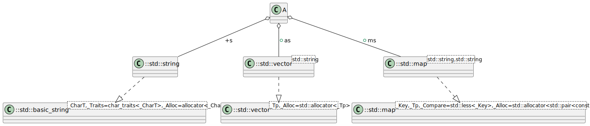

# t00081 - Test case for class members relationships to std types
## Config
```yaml
diagrams:
  t00081_class:
    type: class
    glob:
      - t00081.cc
    filter_mode: advanced
    include_system_headers: true
    include:
      allof:
        namespaces:
          - clanguml::t00081
          - std
        context:
          - match:
              radius: 2
              pattern: clanguml::t00081::A
    exclude:
      anyof:
        access:
          - private
          - public
          - protected
        relationships:
          - dependency
    using_namespace: clanguml::t00081
```
## Source code
File `tests/t00081/t00081.cc`
```cpp
#include <map>
#include <string>
#include <vector>

namespace clanguml {
namespace t00081_detail {
struct C { };
} // namespace t00081_detail
namespace t00081 {
struct A {
    std::vector<std::string> as;
    std::string s;
    std::map<std::string, std::string> ms;

    t00081_detail::C *c;
};
} // namespace t00081
} // namespace clanguml
```
## Generated PlantUML diagrams

## Generated Mermaid diagrams

## Generated JSON models
```json
{
  "diagram_type": "class",
  "elements": [
    {
      "bases": [],
      "display_name": "std::map<_Key,_Tp,_Compare=std::less<_Key>,_Alloc=std::allocator<std::pair<const _Key, _Tp> >>",
      "id": "7797286525545490827",
      "is_abstract": false,
      "is_nested": false,
      "is_struct": false,
      "is_template": true,
      "is_union": false,
      "members": [],
      "methods": [],
      "name": "map",
      "namespace": "std",
      "source_location": {
        "column": 11,
        "file": "",
        "line": 100,
        "translation_unit": "t00081.cc"
      },
      "template_parameters": [
        {
          "is_variadic": false,
          "kind": "template_type",
          "name": "_Key",
          "template_parameters": []
        },
        {
          "is_variadic": false,
          "kind": "template_type",
          "name": "_Tp",
          "template_parameters": []
        },
        {
          "default": "std::less<_Key>",
          "is_variadic": false,
          "kind": "template_type",
          "name": "_Compare",
          "template_parameters": []
        },
        {
          "default": "std::allocator<std::pair<const _Key, _Tp> >",
          "is_variadic": false,
          "kind": "template_type",
          "name": "_Alloc",
          "template_parameters": []
        }
      ],
      "type": "class"
    },
    {
      "bases": [],
      "display_name": "std::basic_string<_CharT,_Traits=char_traits<_CharT>,_Alloc=allocator<_CharT>>",
      "id": "3849619530221140051",
      "is_abstract": false,
      "is_nested": false,
      "is_struct": false,
      "is_template": true,
      "is_union": false,
      "members": [],
      "methods": [],
      "name": "basic_string",
      "namespace": "std",
      "source_location": {
        "column": 11,
        "file": "",
        "line": 85,
        "translation_unit": "t00081.cc"
      },
      "template_parameters": [
        {
          "is_variadic": false,
          "kind": "template_type",
          "name": "_CharT",
          "template_parameters": []
        },
        {
          "default": "char_traits<_CharT>",
          "is_variadic": false,
          "kind": "template_type",
          "name": "_Traits",
          "template_parameters": []
        },
        {
          "default": "allocator<_CharT>",
          "is_variadic": false,
          "kind": "template_type",
          "name": "_Alloc",
          "template_parameters": []
        }
      ],
      "type": "class"
    },
    {
      "bases": [],
      "display_name": "std::string",
      "id": "1275076681856179721",
      "is_abstract": false,
      "is_nested": false,
      "is_struct": false,
      "is_template": true,
      "is_union": false,
      "members": [],
      "methods": [],
      "name": "basic_string",
      "namespace": "std",
      "source_location": {
        "column": 12,
        "file": "",
        "line": 4243,
        "translation_unit": "t00081.cc"
      },
      "template_parameters": [
        {
          "is_variadic": false,
          "kind": "argument",
          "template_parameters": [],
          "type": "char"
        }
      ],
      "type": "class"
    },
    {
      "bases": [],
      "display_name": "std::vector<_Tp,_Alloc=std::allocator<_Tp>>",
      "id": "5805017087195686008",
      "is_abstract": false,
      "is_nested": false,
      "is_struct": false,
      "is_template": true,
      "is_union": false,
      "members": [],
      "methods": [],
      "name": "vector",
      "namespace": "std",
      "source_location": {
        "column": 11,
        "file": "",
        "line": 423,
        "translation_unit": "t00081.cc"
      },
      "template_parameters": [
        {
          "is_variadic": false,
          "kind": "template_type",
          "name": "_Tp",
          "template_parameters": []
        },
        {
          "default": "std::allocator<_Tp>",
          "is_variadic": false,
          "kind": "template_type",
          "name": "_Alloc",
          "template_parameters": []
        }
      ],
      "type": "class"
    },
    {
      "bases": [],
      "display_name": "std::vector<std::string>",
      "id": "1347152004389415025",
      "is_abstract": false,
      "is_nested": false,
      "is_struct": false,
      "is_template": true,
      "is_union": false,
      "members": [],
      "methods": [],
      "name": "vector",
      "namespace": "std",
      "source_location": {
        "column": 11,
        "file": "",
        "line": 423,
        "translation_unit": "t00081.cc"
      },
      "template_parameters": [
        {
          "is_variadic": false,
          "kind": "argument",
          "template_parameters": [],
          "type": "std::string"
        }
      ],
      "type": "class"
    },
    {
      "bases": [],
      "display_name": "std::map<std::string,std::string>",
      "id": "12004170049756060246",
      "is_abstract": false,
      "is_nested": false,
      "is_struct": false,
      "is_template": true,
      "is_union": false,
      "members": [],
      "methods": [],
      "name": "map",
      "namespace": "std",
      "source_location": {
        "column": 11,
        "file": "",
        "line": 70,
        "translation_unit": "t00081.cc"
      },
      "template_parameters": [
        {
          "is_variadic": false,
          "kind": "argument",
          "template_parameters": [],
          "type": "std::string"
        },
        {
          "is_variadic": false,
          "kind": "argument",
          "template_parameters": [],
          "type": "std::string"
        }
      ],
      "type": "class"
    },
    {
      "bases": [],
      "display_name": "A",
      "id": "9134013995454363483",
      "is_abstract": false,
      "is_nested": false,
      "is_struct": true,
      "is_template": false,
      "is_union": false,
      "members": [],
      "methods": [],
      "name": "A",
      "namespace": "clanguml::t00081",
      "source_location": {
        "column": 8,
        "file": "t00081.cc",
        "line": 10,
        "translation_unit": "t00081.cc"
      },
      "template_parameters": [],
      "type": "class"
    }
  ],
  "name": "t00081_class",
  "package_type": "namespace",
  "relationships": [
    {
      "access": "public",
      "destination": "3849619530221140051",
      "source": "1275076681856179721",
      "type": "instantiation"
    },
    {
      "access": "public",
      "destination": "5805017087195686008",
      "source": "1347152004389415025",
      "type": "instantiation"
    },
    {
      "access": "public",
      "destination": "7797286525545490827",
      "source": "12004170049756060246",
      "type": "instantiation"
    },
    {
      "access": "public",
      "destination": "1347152004389415025",
      "label": "as",
      "source": "9134013995454363483",
      "type": "aggregation"
    },
    {
      "access": "public",
      "destination": "1275076681856179721",
      "label": "s",
      "source": "9134013995454363483",
      "type": "aggregation"
    },
    {
      "access": "public",
      "destination": "12004170049756060246",
      "label": "ms",
      "source": "9134013995454363483",
      "type": "aggregation"
    }
  ],
  "using_namespace": "clanguml::t00081"
}
```
