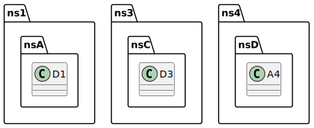

# t00083 - Test case for advanced diagram filter exclusion test with subclasses and namespaces
## Config
```yaml
diagrams:
  t00083_class:
    type: class
    glob:
      - t00083.cc
    generate_packages: true
    filter_mode: advanced
    exclude:
      anyof:
        subclasses:
          - clanguml::t00083::ns1::nsA::A1
        namespaces:
          - clanguml::t00083::ns2::nsB
        context:
          - clanguml::t00083::ns3::nsC::B3
    using_namespace: clanguml::t00083
```
## Source code
File `tests/t00083/t00083.cc`
```cpp
namespace clanguml::t00083 {
namespace ns1 {
namespace nsA {
struct A1 { };
struct B1 : public A1 { };
struct C1 : public B1 { };
struct D1 { };
}
}
namespace ns2 {
namespace nsB {
struct A2 { };
struct B2 : public A2 { };
struct C2 : public B2 { };
}
}
namespace ns3 {
namespace nsC {
struct A3 { };
struct B3 : public A3 { };
struct C3 : public B3 { };
struct D3 { };
}
}
namespace ns4 {
namespace nsD {
struct A4 { };
}
}
}
```
## Generated PlantUML diagrams

## Generated Mermaid diagrams

## Generated JSON models
```json
{
  "diagram_type": "class",
  "elements": [
    {
      "display_name": "ns1",
      "elements": [
        {
          "display_name": "nsA",
          "elements": [
            {
              "bases": [],
              "display_name": "D1",
              "id": "9216071282257341209",
              "is_abstract": false,
              "is_nested": false,
              "is_struct": true,
              "is_template": false,
              "is_union": false,
              "members": [],
              "methods": [],
              "name": "D1",
              "namespace": "clanguml::t00083::ns1::nsA",
              "source_location": {
                "column": 8,
                "file": "t00083.cc",
                "line": 7,
                "translation_unit": "t00083.cc"
              },
              "template_parameters": [],
              "type": "class"
            }
          ],
          "name": "nsA",
          "type": "namespace"
        }
      ],
      "name": "ns1",
      "type": "namespace"
    },
    {
      "display_name": "ns3",
      "elements": [
        {
          "display_name": "nsC",
          "elements": [
            {
              "bases": [],
              "display_name": "D3",
              "id": "1839346342710251347",
              "is_abstract": false,
              "is_nested": false,
              "is_struct": true,
              "is_template": false,
              "is_union": false,
              "members": [],
              "methods": [],
              "name": "D3",
              "namespace": "clanguml::t00083::ns3::nsC",
              "source_location": {
                "column": 8,
                "file": "t00083.cc",
                "line": 22,
                "translation_unit": "t00083.cc"
              },
              "template_parameters": [],
              "type": "class"
            }
          ],
          "name": "nsC",
          "type": "namespace"
        }
      ],
      "name": "ns3",
      "type": "namespace"
    },
    {
      "display_name": "ns4",
      "elements": [
        {
          "display_name": "nsD",
          "elements": [
            {
              "bases": [],
              "display_name": "A4",
              "id": "14002387352924575666",
              "is_abstract": false,
              "is_nested": false,
              "is_struct": true,
              "is_template": false,
              "is_union": false,
              "members": [],
              "methods": [],
              "name": "A4",
              "namespace": "clanguml::t00083::ns4::nsD",
              "source_location": {
                "column": 8,
                "file": "t00083.cc",
                "line": 27,
                "translation_unit": "t00083.cc"
              },
              "template_parameters": [],
              "type": "class"
            }
          ],
          "name": "nsD",
          "type": "namespace"
        }
      ],
      "name": "ns4",
      "type": "namespace"
    }
  ],
  "name": "t00083_class",
  "package_type": "namespace",
  "relationships": [],
  "using_namespace": "clanguml::t00083"
}
```
## Generated GraphML models
```xml
<?xml version="1.0"?>
<graphml xmlns="http://graphml.graphdrawing.org/xmlns" xmlns:xsi="http://www.w3.org/2001/XMLSchema-instance" xsi:schemaLocation="http://graphml.graphdrawing.org/xmlns http://graphml.graphdrawing.org/xmlns/1.0/graphml.xsd">
 <key attr.name="id" attr.type="string" for="graph" id="gd0" />
 <key attr.name="diagram_type" attr.type="string" for="graph" id="gd1" />
 <key attr.name="name" attr.type="string" for="graph" id="gd2" />
 <key attr.name="using_namespace" attr.type="string" for="graph" id="gd3" />
 <key attr.name="id" attr.type="string" for="node" id="nd0" />
 <key attr.name="type" attr.type="string" for="node" id="nd1" />
 <key attr.name="name" attr.type="string" for="node" id="nd2" />
 <key attr.name="stereotype" attr.type="string" for="node" id="nd3" />
 <key attr.name="url" attr.type="string" for="node" id="nd4" />
 <key attr.name="tooltip" attr.type="string" for="node" id="nd5" />
 <key attr.name="is_template" attr.type="boolean" for="node" id="nd6" />
 <key attr.name="type" attr.type="string" for="edge" id="ed0" />
 <key attr.name="access" attr.type="string" for="edge" id="ed1" />
 <key attr.name="label" attr.type="string" for="edge" id="ed2" />
 <key attr.name="url" attr.type="string" for="edge" id="ed3" />
 <graph id="g0" edgedefault="directed" parse.nodeids="canonical" parse.edgeids="canonical" parse.order="nodesfirst">
  <data key="gd3">clanguml::t00083</data>
  <node id="n0">
   <data key="nd2">ns1</data>
   <data key="nd1">namespace</data>
   <graph id="g1" edgedefault="directed" parse.nodeids="canonical" parse.edgeids="canonical" parse.order="nodesfirst">
    <node id="n1">
     <data key="nd2">nsA</data>
     <data key="nd1">namespace</data>
     <graph id="g2" edgedefault="directed" parse.nodeids="canonical" parse.edgeids="canonical" parse.order="nodesfirst">
      <node id="n2">
       <data key="nd1">class</data>
       <data key="nd2"><![CDATA[D1]]></data>
       <data key="nd6">false</data>
       <data key="nd4">https://github.com/bkryza/clang-uml/blob/669b30ea491fc93aa680d5303b8c092431ff11ce/tests/t00083/t00083.cc#L7</data>
       <data key="nd5">D1</data>
      </node>
     </graph>
    </node>
   </graph>
  </node>
  <node id="n3">
   <data key="nd2">ns3</data>
   <data key="nd1">namespace</data>
   <graph id="g3" edgedefault="directed" parse.nodeids="canonical" parse.edgeids="canonical" parse.order="nodesfirst">
    <node id="n4">
     <data key="nd2">nsC</data>
     <data key="nd1">namespace</data>
     <graph id="g4" edgedefault="directed" parse.nodeids="canonical" parse.edgeids="canonical" parse.order="nodesfirst">
      <node id="n5">
       <data key="nd1">class</data>
       <data key="nd2"><![CDATA[D3]]></data>
       <data key="nd6">false</data>
       <data key="nd4">https://github.com/bkryza/clang-uml/blob/669b30ea491fc93aa680d5303b8c092431ff11ce/tests/t00083/t00083.cc#L22</data>
       <data key="nd5">D3</data>
      </node>
     </graph>
    </node>
   </graph>
  </node>
  <node id="n6">
   <data key="nd2">ns4</data>
   <data key="nd1">namespace</data>
   <graph id="g5" edgedefault="directed" parse.nodeids="canonical" parse.edgeids="canonical" parse.order="nodesfirst">
    <node id="n7">
     <data key="nd2">nsD</data>
     <data key="nd1">namespace</data>
     <graph id="g6" edgedefault="directed" parse.nodeids="canonical" parse.edgeids="canonical" parse.order="nodesfirst">
      <node id="n8">
       <data key="nd1">class</data>
       <data key="nd2"><![CDATA[A4]]></data>
       <data key="nd6">false</data>
       <data key="nd4">https://github.com/bkryza/clang-uml/blob/669b30ea491fc93aa680d5303b8c092431ff11ce/tests/t00083/t00083.cc#L27</data>
       <data key="nd5">A4</data>
      </node>
     </graph>
    </node>
   </graph>
  </node>
 </graph>
</graphml>

```
