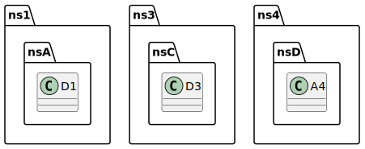

# t00083 - Test case for advanced diagram filter exclusion test with subclasses and namespaces
## Config
```yaml
diagrams:
  t00083_class:
    type: class
    glob:
      - t00083.cc
    generate_packages: true
    filter_mode: advanced
    exclude:
      anyof:
        subclasses:
          - clanguml::t00083::ns1::nsA::A1
        namespaces:
          - clanguml::t00083::ns2::nsB
        context:
          - clanguml::t00083::ns3::nsC::B3
    using_namespace: clanguml::t00083
```
## Source code
File `tests/t00083/t00083.cc`
```cpp
namespace clanguml::t00083 {
namespace ns1 {
namespace nsA {
struct A1 { };
struct B1 : public A1 { };
struct C1 : public B1 { };
struct D1 { };
}
}
namespace ns2 {
namespace nsB {
struct A2 { };
struct B2 : public A2 { };
struct C2 : public B2 { };
}
}
namespace ns3 {
namespace nsC {
struct A3 { };
struct B3 : public A3 { };
struct C3 : public B3 { };
struct D3 { };
}
}
namespace ns4 {
namespace nsD {
struct A4 { };
}
}
}
```
## Generated PlantUML diagrams

## Generated Mermaid diagrams

## Generated JSON models
```json
{
  "diagram_type": "class",
  "elements": [
    {
      "display_name": "ns1",
      "elements": [
        {
          "display_name": "nsA",
          "elements": [
            {
              "bases": [],
              "display_name": "D1",
              "id": "9216071282257341209",
              "is_abstract": false,
              "is_nested": false,
              "is_struct": true,
              "is_template": false,
              "is_union": false,
              "members": [],
              "methods": [],
              "name": "D1",
              "namespace": "clanguml::t00083::ns1::nsA",
              "source_location": {
                "column": 8,
                "file": "t00083.cc",
                "line": 7,
                "translation_unit": "t00083.cc"
              },
              "template_parameters": [],
              "type": "class"
            }
          ],
          "name": "nsA",
          "type": "namespace"
        }
      ],
      "name": "ns1",
      "type": "namespace"
    },
    {
      "display_name": "ns3",
      "elements": [
        {
          "display_name": "nsC",
          "elements": [
            {
              "bases": [],
              "display_name": "D3",
              "id": "1839346342710251347",
              "is_abstract": false,
              "is_nested": false,
              "is_struct": true,
              "is_template": false,
              "is_union": false,
              "members": [],
              "methods": [],
              "name": "D3",
              "namespace": "clanguml::t00083::ns3::nsC",
              "source_location": {
                "column": 8,
                "file": "t00083.cc",
                "line": 22,
                "translation_unit": "t00083.cc"
              },
              "template_parameters": [],
              "type": "class"
            }
          ],
          "name": "nsC",
          "type": "namespace"
        }
      ],
      "name": "ns3",
      "type": "namespace"
    },
    {
      "display_name": "ns4",
      "elements": [
        {
          "display_name": "nsD",
          "elements": [
            {
              "bases": [],
              "display_name": "A4",
              "id": "14002387352924575666",
              "is_abstract": false,
              "is_nested": false,
              "is_struct": true,
              "is_template": false,
              "is_union": false,
              "members": [],
              "methods": [],
              "name": "A4",
              "namespace": "clanguml::t00083::ns4::nsD",
              "source_location": {
                "column": 8,
                "file": "t00083.cc",
                "line": 27,
                "translation_unit": "t00083.cc"
              },
              "template_parameters": [],
              "type": "class"
            }
          ],
          "name": "nsD",
          "type": "namespace"
        }
      ],
      "name": "ns4",
      "type": "namespace"
    }
  ],
  "name": "t00083_class",
  "package_type": "namespace",
  "relationships": [],
  "using_namespace": "clanguml::t00083"
}
```
