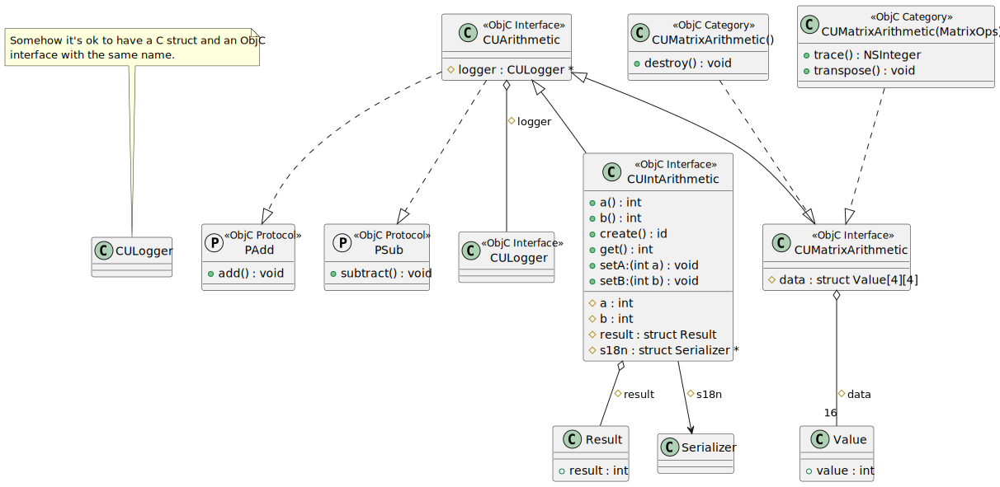

# t00084 - Objective-C overall use case
## Config
```yaml
diagrams:
  t00084_class:
    type: class
    glob:
      - t00084.m
    include:
      paths:
        - .
```
## Source code
File `tests/t00084/t00084.h`
```cpp
#include <Foundation/Foundation.h>

/// \uml{note[top] Somehow it's ok to have a C struct and an ObjC
/// interface with  the same name.}
struct CULogger { };

@protocol PAdd
- (void)add;
@end

@protocol PSub
- (void)subtract;
@end

@class CULogger;

@interface CUArithmetic : NSObject <PAdd, PSub> {
@protected
    CULogger *logger;
}
@end

struct Result {
    int result;
};

struct Serializer { };

@interface CUIntArithmetic : CUArithmetic {
    int a;
    int b;
    struct Result result;
    struct Serializer *s18n;
}
+ create;

@property (nonatomic) int a, b;

- (int)get;

@end

#define ROWS 4
#define COLUMNS 4
struct Value {
    int value;
};

@interface CUMatrixArithmetic : CUArithmetic {
    struct Value data[ROWS][COLUMNS];
}

@end

@interface CULogger : NSObject {
}
@end

@interface CUMatrixArithmetic ()
- (void)destroy;
@end

@interface CUMatrixArithmetic (MatrixOps)
- (void)transpose;
- (NSInteger)trace;
@end
```
File `tests/t00084/t00084.m`
```cpp
#include "t00084.h"

```
## Generated PlantUML diagrams

## Generated Mermaid diagrams

## Generated JSON models
```json
{
  "diagram_type": "class",
  "elements": [
    {
      "bases": [],
      "comment": {
        "formatted": "\\uml{note[top] Somehow it's ok to have a C struct and an ObjC\ninterface with  the same name.}",
        "raw": "/// \\uml{note[top] Somehow it's ok to have a C struct and an ObjC\n/// interface with  the same name.}"
      },
      "display_name": "CULogger",
      "id": "16468256462265534638",
      "is_abstract": false,
      "is_nested": false,
      "is_struct": true,
      "is_template": false,
      "is_union": false,
      "members": [],
      "methods": [],
      "name": "CULogger",
      "namespace": "",
      "source_location": {
        "column": 8,
        "file": "t00084.h",
        "line": 5,
        "translation_unit": "t00084.m"
      },
      "template_parameters": [],
      "type": "class"
    },
    {
      "bases": [],
      "display_name": "PAdd",
      "id": "17158401775138309712",
      "is_category": false,
      "is_protocol": true,
      "members": [],
      "methods": [
        {
          "access": "public",
          "display_name": "add",
          "is_optional": false,
          "name": "add",
          "parameters": [],
          "source_location": {
            "column": 1,
            "file": "t00084.h",
            "line": 8,
            "translation_unit": "t00084.m"
          },
          "type": "void"
        }
      ],
      "name": "PAdd",
      "namespace": "",
      "protocols": [],
      "source_location": {
        "column": 11,
        "file": "t00084.h",
        "line": 7,
        "translation_unit": "t00084.m"
      },
      "type": "objc_protocol"
    },
    {
      "bases": [],
      "display_name": "PSub",
      "id": "676331440279833610",
      "is_category": false,
      "is_protocol": true,
      "members": [],
      "methods": [
        {
          "access": "public",
          "display_name": "subtract",
          "is_optional": false,
          "name": "subtract",
          "parameters": [],
          "source_location": {
            "column": 1,
            "file": "t00084.h",
            "line": 12,
            "translation_unit": "t00084.m"
          },
          "type": "void"
        }
      ],
      "name": "PSub",
      "namespace": "",
      "protocols": [],
      "source_location": {
        "column": 11,
        "file": "t00084.h",
        "line": 11,
        "translation_unit": "t00084.m"
      },
      "type": "objc_protocol"
    },
    {
      "bases": [
        {
          "id": "13825978819641664869"
        }
      ],
      "display_name": "CULogger",
      "id": "14823865282534129355",
      "is_category": false,
      "is_protocol": false,
      "members": [],
      "methods": [],
      "name": "CULogger",
      "namespace": "",
      "protocols": [],
      "source_location": {
        "column": 8,
        "file": "t00084.h",
        "line": 15,
        "translation_unit": "t00084.m"
      },
      "type": "objc_interface"
    },
    {
      "bases": [
        {
          "id": "13825978819641664869"
        }
      ],
      "display_name": "CUArithmetic",
      "id": "11019244785995400036",
      "is_category": false,
      "is_protocol": false,
      "members": [
        {
          "access": "protected",
          "name": "logger",
          "source_location": {
            "column": 15,
            "file": "t00084.h",
            "line": 19,
            "translation_unit": "t00084.m"
          },
          "type": "CULogger *"
        }
      ],
      "methods": [],
      "name": "CUArithmetic",
      "namespace": "",
      "protocols": [
        {
          "id": "17158401775138309712"
        },
        {
          "id": "676331440279833610"
        }
      ],
      "source_location": {
        "column": 12,
        "file": "t00084.h",
        "line": 17,
        "translation_unit": "t00084.m"
      },
      "type": "objc_interface"
    },
    {
      "bases": [],
      "display_name": "Result",
      "id": "18440565303595988344",
      "is_abstract": false,
      "is_nested": false,
      "is_struct": true,
      "is_template": false,
      "is_union": false,
      "members": [
        {
          "access": "public",
          "is_static": false,
          "name": "result",
          "source_location": {
            "column": 9,
            "file": "t00084.h",
            "line": 24,
            "translation_unit": "t00084.m"
          },
          "type": "int"
        }
      ],
      "methods": [],
      "name": "Result",
      "namespace": "",
      "source_location": {
        "column": 8,
        "file": "t00084.h",
        "line": 23,
        "translation_unit": "t00084.m"
      },
      "template_parameters": [],
      "type": "class"
    },
    {
      "bases": [],
      "display_name": "Serializer",
      "id": "4286815225100151567",
      "is_abstract": false,
      "is_nested": false,
      "is_struct": true,
      "is_template": false,
      "is_union": false,
      "members": [],
      "methods": [],
      "name": "Serializer",
      "namespace": "",
      "source_location": {
        "column": 8,
        "file": "t00084.h",
        "line": 27,
        "translation_unit": "t00084.m"
      },
      "template_parameters": [],
      "type": "class"
    },
    {
      "bases": [
        {
          "id": "11019244785995400036"
        }
      ],
      "display_name": "CUIntArithmetic",
      "id": "10781908225073246261",
      "is_category": false,
      "is_protocol": false,
      "members": [
        {
          "access": "protected",
          "name": "a",
          "source_location": {
            "column": 9,
            "file": "t00084.h",
            "line": 30,
            "translation_unit": "t00084.m"
          },
          "type": "int"
        },
        {
          "access": "protected",
          "name": "b",
          "source_location": {
            "column": 9,
            "file": "t00084.h",
            "line": 31,
            "translation_unit": "t00084.m"
          },
          "type": "int"
        },
        {
          "access": "protected",
          "name": "result",
          "source_location": {
            "column": 19,
            "file": "t00084.h",
            "line": 32,
            "translation_unit": "t00084.m"
          },
          "type": "struct Result"
        },
        {
          "access": "protected",
          "name": "s18n",
          "source_location": {
            "column": 24,
            "file": "t00084.h",
            "line": 33,
            "translation_unit": "t00084.m"
          },
          "type": "struct Serializer *"
        }
      ],
      "methods": [
        {
          "access": "public",
          "display_name": "create",
          "is_optional": false,
          "name": "create",
          "parameters": [],
          "source_location": {
            "column": 1,
            "file": "t00084.h",
            "line": 35,
            "translation_unit": "t00084.m"
          },
          "type": "id"
        },
        {
          "access": "public",
          "display_name": "get",
          "is_optional": false,
          "name": "get",
          "parameters": [],
          "source_location": {
            "column": 1,
            "file": "t00084.h",
            "line": 39,
            "translation_unit": "t00084.m"
          },
          "type": "int"
        },
        {
          "access": "public",
          "display_name": "a",
          "is_optional": false,
          "name": "a",
          "parameters": [],
          "source_location": {
            "column": 27,
            "file": "t00084.h",
            "line": 37,
            "translation_unit": "t00084.m"
          },
          "type": "int"
        },
        {
          "access": "public",
          "display_name": "setA:",
          "is_optional": false,
          "name": "setA:",
          "parameters": [
            {
              "name": "a",
              "type": "int"
            }
          ],
          "source_location": {
            "column": 27,
            "file": "t00084.h",
            "line": 37,
            "translation_unit": "t00084.m"
          },
          "type": "void"
        },
        {
          "access": "public",
          "display_name": "b",
          "is_optional": false,
          "name": "b",
          "parameters": [],
          "source_location": {
            "column": 30,
            "file": "t00084.h",
            "line": 37,
            "translation_unit": "t00084.m"
          },
          "type": "int"
        },
        {
          "access": "public",
          "display_name": "setB:",
          "is_optional": false,
          "name": "setB:",
          "parameters": [
            {
              "name": "b",
              "type": "int"
            }
          ],
          "source_location": {
            "column": 30,
            "file": "t00084.h",
            "line": 37,
            "translation_unit": "t00084.m"
          },
          "type": "void"
        }
      ],
      "name": "CUIntArithmetic",
      "namespace": "",
      "protocols": [],
      "source_location": {
        "column": 12,
        "file": "t00084.h",
        "line": 29,
        "translation_unit": "t00084.m"
      },
      "type": "objc_interface"
    },
    {
      "bases": [],
      "display_name": "Value",
      "id": "14445756289022328108",
      "is_abstract": false,
      "is_nested": false,
      "is_struct": true,
      "is_template": false,
      "is_union": false,
      "members": [
        {
          "access": "public",
          "is_static": false,
          "name": "value",
          "source_location": {
            "column": 9,
            "file": "t00084.h",
            "line": 46,
            "translation_unit": "t00084.m"
          },
          "type": "int"
        }
      ],
      "methods": [],
      "name": "Value",
      "namespace": "",
      "source_location": {
        "column": 8,
        "file": "t00084.h",
        "line": 45,
        "translation_unit": "t00084.m"
      },
      "template_parameters": [],
      "type": "class"
    },
    {
      "bases": [
        {
          "id": "11019244785995400036"
        }
      ],
      "display_name": "CUMatrixArithmetic",
      "id": "1791467923800353512",
      "is_category": false,
      "is_protocol": false,
      "members": [
        {
          "access": "protected",
          "name": "data",
          "source_location": {
            "column": 18,
            "file": "t00084.h",
            "line": 50,
            "translation_unit": "t00084.m"
          },
          "type": "struct Value[4][4]"
        }
      ],
      "methods": [],
      "name": "CUMatrixArithmetic",
      "namespace": "",
      "protocols": [],
      "source_location": {
        "column": 12,
        "file": "t00084.h",
        "line": 49,
        "translation_unit": "t00084.m"
      },
      "type": "objc_interface"
    },
    {
      "bases": [],
      "display_name": "CUMatrixArithmetic()",
      "id": "4313316082397644277",
      "is_category": true,
      "is_protocol": false,
      "members": [],
      "methods": [
        {
          "access": "public",
          "display_name": "destroy",
          "is_optional": false,
          "name": "destroy",
          "parameters": [],
          "source_location": {
            "column": 1,
            "file": "t00084.h",
            "line": 60,
            "translation_unit": "t00084.m"
          },
          "type": "void"
        }
      ],
      "name": "CUMatrixArithmetic()",
      "namespace": "",
      "protocols": [
        {
          "id": "1791467923800353512"
        }
      ],
      "source_location": {
        "column": 12,
        "file": "t00084.h",
        "line": 59,
        "translation_unit": "t00084.m"
      },
      "type": "objc_category"
    },
    {
      "bases": [],
      "display_name": "CUMatrixArithmetic(MatrixOps)",
      "id": "10356097521022098570",
      "is_category": true,
      "is_protocol": false,
      "members": [],
      "methods": [
        {
          "access": "public",
          "display_name": "transpose",
          "is_optional": false,
          "name": "transpose",
          "parameters": [],
          "source_location": {
            "column": 1,
            "file": "t00084.h",
            "line": 64,
            "translation_unit": "t00084.m"
          },
          "type": "void"
        },
        {
          "access": "public",
          "display_name": "trace",
          "is_optional": false,
          "name": "trace",
          "parameters": [],
          "source_location": {
            "column": 1,
            "file": "t00084.h",
            "line": 65,
            "translation_unit": "t00084.m"
          },
          "type": "NSInteger"
        }
      ],
      "name": "CUMatrixArithmetic(MatrixOps)",
      "namespace": "",
      "protocols": [
        {
          "id": "1791467923800353512"
        }
      ],
      "source_location": {
        "column": 12,
        "file": "t00084.h",
        "line": 63,
        "translation_unit": "t00084.m"
      },
      "type": "objc_category"
    }
  ],
  "name": "t00084_class",
  "package_type": "namespace",
  "relationships": [
    {
      "access": "protected",
      "destination": "14823865282534129355",
      "label": "logger",
      "source": "11019244785995400036",
      "type": "aggregation"
    },
    {
      "destination": "17158401775138309712",
      "source": "11019244785995400036",
      "type": "instantiation"
    },
    {
      "destination": "676331440279833610",
      "source": "11019244785995400036",
      "type": "instantiation"
    },
    {
      "access": "protected",
      "destination": "18440565303595988344",
      "label": "result",
      "source": "10781908225073246261",
      "type": "aggregation"
    },
    {
      "access": "protected",
      "destination": "4286815225100151567",
      "label": "s18n",
      "source": "10781908225073246261",
      "type": "association"
    },
    {
      "destination": "11019244785995400036",
      "source": "10781908225073246261",
      "type": "extension"
    },
    {
      "access": "protected",
      "destination": "14445756289022328108",
      "label": "data",
      "multiplicity_destination": "16",
      "source": "1791467923800353512",
      "type": "aggregation"
    },
    {
      "destination": "11019244785995400036",
      "source": "1791467923800353512",
      "type": "extension"
    },
    {
      "destination": "1791467923800353512",
      "source": "4313316082397644277",
      "type": "instantiation"
    },
    {
      "destination": "1791467923800353512",
      "source": "10356097521022098570",
      "type": "instantiation"
    }
  ]
}
```
## Generated GraphML models
```xml
<?xml version="1.0"?>
<graphml xmlns="http://graphml.graphdrawing.org/xmlns" xmlns:xsi="http://www.w3.org/2001/XMLSchema-instance" xsi:schemaLocation="http://graphml.graphdrawing.org/xmlns http://graphml.graphdrawing.org/xmlns/1.0/graphml.xsd">
 <key attr.name="id" attr.type="string" for="graph" id="gd0" />
 <key attr.name="diagram_type" attr.type="string" for="graph" id="gd1" />
 <key attr.name="name" attr.type="string" for="graph" id="gd2" />
 <key attr.name="using_namespace" attr.type="string" for="graph" id="gd3" />
 <key attr.name="id" attr.type="string" for="node" id="nd0" />
 <key attr.name="type" attr.type="string" for="node" id="nd1" />
 <key attr.name="name" attr.type="string" for="node" id="nd2" />
 <key attr.name="stereotype" attr.type="string" for="node" id="nd3" />
 <key attr.name="url" attr.type="string" for="node" id="nd4" />
 <key attr.name="tooltip" attr.type="string" for="node" id="nd5" />
 <key attr.name="is_template" attr.type="boolean" for="node" id="nd6" />
 <key attr.name="type" attr.type="string" for="edge" id="ed0" />
 <key attr.name="access" attr.type="string" for="edge" id="ed1" />
 <key attr.name="label" attr.type="string" for="edge" id="ed2" />
 <key attr.name="url" attr.type="string" for="edge" id="ed3" />
 <graph id="g0" edgedefault="directed" parse.nodeids="canonical" parse.edgeids="canonical" parse.order="nodesfirst">
  <node id="n0">
   <data key="nd1">class</data>
   <data key="nd2"><![CDATA[CULogger]]></data>
   <data key="nd6">false</data>
   <data key="nd4">https://github.com/bkryza/clang-uml/blob/5a99d524aefa5b8d2a48d1d679ccb9ae351323ba/tests/t00084/t00084.h#L5</data>
   <data key="nd5">CULogger</data>
  </node>
  <node id="n1">
   <data key="nd1">objc_protocol</data>
   <data key="nd2">PAdd</data>
   <data key="nd4">https://github.com/bkryza/clang-uml/blob/5a99d524aefa5b8d2a48d1d679ccb9ae351323ba/tests/t00084/t00084.h#L7</data>
   <data key="nd5">PAdd</data>
  </node>
  <node id="n2">
   <data key="nd1">objc_protocol</data>
   <data key="nd2">PSub</data>
   <data key="nd4">https://github.com/bkryza/clang-uml/blob/5a99d524aefa5b8d2a48d1d679ccb9ae351323ba/tests/t00084/t00084.h#L11</data>
   <data key="nd5">PSub</data>
  </node>
  <node id="n3">
   <data key="nd1">objc_interface</data>
   <data key="nd2">CULogger</data>
   <data key="nd4">https://github.com/bkryza/clang-uml/blob/5a99d524aefa5b8d2a48d1d679ccb9ae351323ba/tests/t00084/t00084.h#L15</data>
   <data key="nd5">CULogger</data>
  </node>
  <node id="n4">
   <data key="nd1">objc_interface</data>
   <data key="nd2">CUArithmetic</data>
   <data key="nd4">https://github.com/bkryza/clang-uml/blob/5a99d524aefa5b8d2a48d1d679ccb9ae351323ba/tests/t00084/t00084.h#L17</data>
   <data key="nd5">CUArithmetic</data>
  </node>
  <node id="n5">
   <data key="nd1">class</data>
   <data key="nd2"><![CDATA[Result]]></data>
   <data key="nd6">false</data>
   <data key="nd4">https://github.com/bkryza/clang-uml/blob/5a99d524aefa5b8d2a48d1d679ccb9ae351323ba/tests/t00084/t00084.h#L23</data>
   <data key="nd5">Result</data>
  </node>
  <node id="n6">
   <data key="nd1">class</data>
   <data key="nd2"><![CDATA[Serializer]]></data>
   <data key="nd6">false</data>
   <data key="nd4">https://github.com/bkryza/clang-uml/blob/5a99d524aefa5b8d2a48d1d679ccb9ae351323ba/tests/t00084/t00084.h#L27</data>
   <data key="nd5">Serializer</data>
  </node>
  <node id="n7">
   <data key="nd1">objc_interface</data>
   <data key="nd2">CUIntArithmetic</data>
   <data key="nd4">https://github.com/bkryza/clang-uml/blob/5a99d524aefa5b8d2a48d1d679ccb9ae351323ba/tests/t00084/t00084.h#L29</data>
   <data key="nd5">CUIntArithmetic</data>
  </node>
  <node id="n8">
   <data key="nd1">class</data>
   <data key="nd2"><![CDATA[Value]]></data>
   <data key="nd6">false</data>
   <data key="nd4">https://github.com/bkryza/clang-uml/blob/5a99d524aefa5b8d2a48d1d679ccb9ae351323ba/tests/t00084/t00084.h#L45</data>
   <data key="nd5">Value</data>
  </node>
  <node id="n9">
   <data key="nd1">objc_interface</data>
   <data key="nd2">CUMatrixArithmetic</data>
   <data key="nd4">https://github.com/bkryza/clang-uml/blob/5a99d524aefa5b8d2a48d1d679ccb9ae351323ba/tests/t00084/t00084.h#L49</data>
   <data key="nd5">CUMatrixArithmetic</data>
  </node>
  <node id="n10">
   <data key="nd1">objc_category</data>
   <data key="nd2">CUMatrixArithmetic()</data>
   <data key="nd4">https://github.com/bkryza/clang-uml/blob/5a99d524aefa5b8d2a48d1d679ccb9ae351323ba/tests/t00084/t00084.h#L59</data>
   <data key="nd5">CUMatrixArithmetic()</data>
  </node>
  <node id="n11">
   <data key="nd1">objc_category</data>
   <data key="nd2">CUMatrixArithmetic(MatrixOps)</data>
   <data key="nd4">https://github.com/bkryza/clang-uml/blob/5a99d524aefa5b8d2a48d1d679ccb9ae351323ba/tests/t00084/t00084.h#L63</data>
   <data key="nd5">CUMatrixArithmetic(MatrixOps)</data>
  </node>
  <node id="n12">
   <data key="nd1">note</data>
   <data key="nd2"><![CDATA[Somehow it's ok to have a C struct and an ObjC
interface with  the same name.]]></data>
  </node>
  <edge id="e0" source="n12" target="n0">
   <data key="ed0">none</data>
  </edge>
  <edge id="e1" source="n4" target="n3">
   <data key="ed0">aggregation</data>
   <data key="ed2">logger</data>
   <data key="ed1">protected</data>
  </edge>
  <edge id="e2" source="n4" target="n1">
   <data key="ed0">instantiation</data>
  </edge>
  <edge id="e3" source="n4" target="n2">
   <data key="ed0">instantiation</data>
  </edge>
  <edge id="e4" source="n7" target="n5">
   <data key="ed0">aggregation</data>
   <data key="ed2">result</data>
   <data key="ed1">protected</data>
  </edge>
  <edge id="e5" source="n7" target="n6">
   <data key="ed0">association</data>
   <data key="ed2">s18n</data>
   <data key="ed1">protected</data>
  </edge>
  <edge id="e6" source="n7" target="n4">
   <data key="ed0">extension</data>
  </edge>
  <edge id="e7" source="n9" target="n8">
   <data key="ed0">aggregation</data>
   <data key="ed2">data</data>
   <data key="ed1">protected</data>
  </edge>
  <edge id="e8" source="n9" target="n4">
   <data key="ed0">extension</data>
  </edge>
  <edge id="e9" source="n10" target="n9">
   <data key="ed0">instantiation</data>
  </edge>
  <edge id="e10" source="n11" target="n9">
   <data key="ed0">instantiation</data>
  </edge>
 </graph>
</graphml>

```
