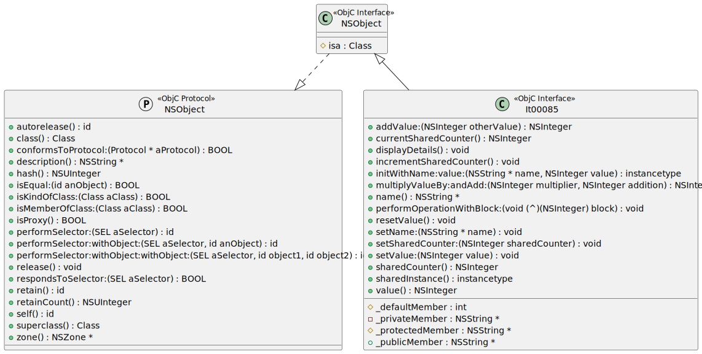

# t00085 - Objective-C test case for various class members and methods
## Config
```yaml
diagrams:
  t00085_class:
    type: class
    glob:
      - t00085.m
    filter_mode: advanced
    include_system_headers: true
    include:
      anyof:
        paths:
          - .
        elements:
          - NSObject

```
## Source code
File `tests/t00085/t00085.m`
```cpp
#import "t00085.h"

@implementation It00085

// Synthesize class property
static NSInteger _sharedCounter = 0;

+ (NSInteger)sharedCounter {
    return _sharedCounter;
}

+ (void)setSharedCounter:(NSInteger)newValue {
    _sharedCounter = newValue;
}

// Class method implementations
+ (void)incrementSharedCounter {
    _sharedCounter++;
}

+ (NSInteger)currentSharedCounter {
    return _sharedCounter;
}

+ (instancetype)sharedInstance {
    static It00085 *sharedInstance = nil;
    return sharedInstance;
}

// Instance method implementations
- (instancetype)initWithName:(NSString *)name value:(NSInteger)value {
    self = [super init];
    if (self) {
        _name = name;
        _value = value;

        // Initialize members with different access scopes
        _publicMember = @"Public Member";
        _protectedMember = @"Protected Member";
        _privateMember = @"Private Member";
    }
    return self;
}

- (void)displayDetails {
    NSLog(@"Name: %@, Value: %ld", self.name, (long)self.value);

    // Accessing members with different access scopes
    NSLog(@"Public Member: %@", _publicMember);
    NSLog(@"Protected Member: %@", _protectedMember);
    NSLog(@"Private Member: %@", _privateMember);
}

- (NSInteger)addValue:(NSInteger)otherValue {
    return self.value + otherValue;
}

- (NSInteger)multiplyValueBy:(NSInteger)multiplier andAdd:(NSInteger)addition {
    return (self.value * multiplier) + addition;
}

- (void)resetValue {
    self.value = 0;
}

// Method with a block parameter
- (void)performOperationWithBlock:(void (^)(NSInteger result))block {
    NSInteger result = self.value * 2;
    block(result);
}

@end

```
File `tests/t00085/t00085.h`
```cpp
#import <Foundation/Foundation.h>

@interface It00085 : NSObject {
    int _defaultMember;

@public
    NSString *_publicMember;

@protected
    NSString *_protectedMember;

@private
    NSString *_privateMember;
}

@property (class, nonatomic, assign) NSInteger sharedCounter;

@property (nonatomic, strong) NSString *name;
@property (nonatomic, assign) NSInteger value;

+ (void)incrementSharedCounter;
+ (NSInteger)currentSharedCounter;
+ (instancetype)sharedInstance;

- (instancetype)initWithName:(NSString *)name value:(NSInteger)value;
- (void)displayDetails;
- (NSInteger)addValue:(NSInteger)otherValue;
- (NSInteger)multiplyValueBy:(NSInteger)multiplier andAdd:(NSInteger)addition;
- (void)resetValue;

- (void)performOperationWithBlock:(void (^)(NSInteger result))block;

@end
```
## Generated PlantUML diagrams

## Generated Mermaid diagrams

## Generated JSON models
```json
{
  "diagram_type": "class",
  "elements": [
    {
      "bases": [],
      "display_name": "NSObject",
      "id": "13825978819641664869",
      "is_category": false,
      "is_protocol": false,
      "members": [
        {
          "access": "protected",
          "comment": {
            "formatted": "\n Points to instance's class.  Used by runtime to access method\n implementations, etc..  Set in +alloc, Unlike other instance variables,\n which are cleared there.\n  ",
            "raw": "/**\n  * Points to instance's class.  Used by runtime to access method\n  * implementations, etc..  Set in +alloc, Unlike other instance variables,\n  * which are cleared there.\n  */"
          },
          "name": "isa",
          "source_location": {
            "column": 9,
            "file": "",
            "line": 294,
            "translation_unit": "t00085.m"
          },
          "type": "Class"
        }
      ],
      "methods": [],
      "name": "NSObject",
      "namespace": "",
      "protocols": [
        {
          "id": "16988093069955139133"
        }
      ],
      "source_location": {
        "column": 8,
        "file": "",
        "line": 94,
        "translation_unit": "t00085.m"
      },
      "type": "objc_interface"
    },
    {
      "bases": [],
      "comment": {
        "formatted": "\n The NSObject protocol describes a minimal set of methods that all\n objects are expected to support.  You should be able to send any\n of the messages listed in this protocol to an object, and be safe\n in assuming that the receiver can handle it.\n ",
        "raw": "/**\n * The NSObject protocol describes a minimal set of methods that all\n * objects are expected to support.  You should be able to send any\n * of the messages listed in this protocol to an object, and be safe\n * in assuming that the receiver can handle it.\n */"
      },
      "display_name": "NSObject",
      "id": "16988093069955139133",
      "is_category": false,
      "is_protocol": true,
      "members": [],
      "methods": [
        {
          "access": "public",
          "comment": {
            "formatted": "\n Returns the class of the receiver.  If the receiver is a proxy, then this\n may return the class of the proxy target.  Use -isProxy to determine whether\n the receiver is a proxy.  If you wish to find the real class of the\n receiver, ignoring proxies, then use object_getClass().  \n ",
            "raw": "/**\n * Returns the class of the receiver.  If the receiver is a proxy, then this\n * may return the class of the proxy target.  Use -isProxy to determine whether\n * the receiver is a proxy.  If you wish to find the real class of the\n * receiver, ignoring proxies, then use object_getClass().  \n */"
          },
          "display_name": "class",
          "is_optional": false,
          "name": "class",
          "parameters": [],
          "source_location": {
            "column": 1,
            "file": "",
            "line": 65,
            "translation_unit": "t00085.m"
          },
          "type": "Class"
        },
        {
          "access": "public",
          "comment": {
            "formatted": "\n Returns the superclass of receiver's class.  If the receiver is a proxy,\n then this may return the class of the proxy target.  Use -isProxy to\n determine whether the receiver is a proxy.  If you wish to find the real\n superclass of the receiver's class, ignoring proxies, then use\n class_getSuperclass(object_getClass()).\n ",
            "raw": "/**\n * Returns the superclass of receiver's class.  If the receiver is a proxy,\n * then this may return the class of the proxy target.  Use -isProxy to\n * determine whether the receiver is a proxy.  If you wish to find the real\n * superclass of the receiver's class, ignoring proxies, then use\n * class_getSuperclass(object_getClass()).\n */"
          },
          "display_name": "superclass",
          "is_optional": false,
          "name": "superclass",
          "parameters": [],
          "source_location": {
            "column": 1,
            "file": "",
            "line": 73,
            "translation_unit": "t00085.m"
          },
          "type": "Class"
        },
        {
          "access": "public",
          "comment": {
            "formatted": "\n Returns whether the receiver is equal to the argument.  Defining equality is\n complex, so be careful when implementing this method.  Collections such as\n NSSet depend on the behaviour of this method.  In particular, this method\n must be commutative, so for any objects a and b:\n\n [a isEqual: b] == [b isEqual: a]\n\n This means that you must be very careful when returning YES if the argument\n is of another class.  For example, if you define a number class that returns\n YES if the argument is a string representation of the number, then this will\n break because the string will not recognise your object as being equal to\n itself.\n\n If two objects are equal, then they must have the same hash value, however\n equal hash values do not imply equality.\n ",
            "raw": "/**\n * Returns whether the receiver is equal to the argument.  Defining equality is\n * complex, so be careful when implementing this method.  Collections such as\n * NSSet depend on the behaviour of this method.  In particular, this method\n * must be commutative, so for any objects a and b:\n *\n * [a isEqual: b] == [b isEqual: a]\n *\n * This means that you must be very careful when returning YES if the argument\n * is of another class.  For example, if you define a number class that returns\n * YES if the argument is a string representation of the number, then this will\n * break because the string will not recognise your object as being equal to\n * itself.\n *\n * If two objects are equal, then they must have the same hash value, however\n * equal hash values do not imply equality.\n */"
          },
          "display_name": "isEqual:",
          "is_optional": false,
          "name": "isEqual:",
          "parameters": [
            {
              "name": "anObject",
              "type": "id"
            }
          ],
          "source_location": {
            "column": 1,
            "file": "",
            "line": 91,
            "translation_unit": "t00085.m"
          },
          "type": "BOOL"
        },
        {
          "access": "public",
          "comment": {
            "formatted": "\n Returns YES if the receiver is an instance of the class, an instance of the\n subclass, or (in the case of proxies), an instance of something that can be\n treated as an instance of the class.\n ",
            "raw": "/**\n * Returns YES if the receiver is an instance of the class, an instance of the\n * subclass, or (in the case of proxies), an instance of something that can be\n * treated as an instance of the class.\n */"
          },
          "display_name": "isKindOfClass:",
          "is_optional": false,
          "name": "isKindOfClass:",
          "parameters": [
            {
              "name": "aClass",
              "type": "Class"
            }
          ],
          "source_location": {
            "column": 1,
            "file": "",
            "line": 97,
            "translation_unit": "t00085.m"
          },
          "type": "BOOL"
        },
        {
          "access": "public",
          "comment": {
            "formatted": "\n Returns YES if the receiver is an instance of the class or (in the case of\n proxies), an instance of something that can be treated as an instance of the\n class.\n\n Calling this method is rarely the correct thing to do.  In most cases, a\n subclass can be substituted for a superclass, so you should never need to\n check that an object is really an instance of a specific class and not a\n subclass.  \n ",
            "raw": "/**\n * Returns YES if the receiver is an instance of the class or (in the case of\n * proxies), an instance of something that can be treated as an instance of the\n * class.\n *\n * Calling this method is rarely the correct thing to do.  In most cases, a\n * subclass can be substituted for a superclass, so you should never need to\n * check that an object is really an instance of a specific class and not a\n * subclass.  \n */"
          },
          "display_name": "isMemberOfClass:",
          "is_optional": false,
          "name": "isMemberOfClass:",
          "parameters": [
            {
              "name": "aClass",
              "type": "Class"
            }
          ],
          "source_location": {
            "column": 1,
            "file": "",
            "line": 108,
            "translation_unit": "t00085.m"
          },
          "type": "BOOL"
        },
        {
          "access": "public",
          "comment": {
            "formatted": "\n Returns YES if the receiver is a proxy, NO otherwise.  The default\n implementation of this method in NSObject returns NO, while the\n implementation in NSProxy returns YES.\n ",
            "raw": "/**\n * Returns YES if the receiver is a proxy, NO otherwise.  The default\n * implementation of this method in NSObject returns NO, while the\n * implementation in NSProxy returns YES.\n */"
          },
          "display_name": "isProxy",
          "is_optional": false,
          "name": "isProxy",
          "parameters": [],
          "source_location": {
            "column": 1,
            "file": "",
            "line": 114,
            "translation_unit": "t00085.m"
          },
          "type": "BOOL"
        },
        {
          "access": "public",
          "comment": {
            "formatted": "\n Returns a hash value for the object.  All objects that are equal *MUST*\n return the same hash value.  For efficient storage in sets, or as keys in\n dictionaries, different objects should return hashes spread evenly over the\n range of an integer.\n\n An object may not return different values from this method after being\n stored in a collection.  This typically means that ether the hash value must\n be constant after the object's creation, or that the object may not be\n modified while stored in an unordered collection.\n ",
            "raw": "/**\n * Returns a hash value for the object.  All objects that are equal *MUST*\n * return the same hash value.  For efficient storage in sets, or as keys in\n * dictionaries, different objects should return hashes spread evenly over the\n * range of an integer.\n *\n * An object may not return different values from this method after being\n * stored in a collection.  This typically means that ether the hash value must\n * be constant after the object's creation, or that the object may not be\n * modified while stored in an unordered collection.\n */"
          },
          "display_name": "hash",
          "is_optional": false,
          "name": "hash",
          "parameters": [],
          "source_location": {
            "column": 1,
            "file": "",
            "line": 126,
            "translation_unit": "t00085.m"
          },
          "type": "NSUInteger"
        },
        {
          "access": "public",
          "comment": {
            "formatted": "\n Returns the receiver.  In a proxy, this may (but is not required to) return\n the proxied object.\n ",
            "raw": "/**\n * Returns the receiver.  In a proxy, this may (but is not required to) return\n * the proxied object.\n */"
          },
          "display_name": "self",
          "is_optional": false,
          "name": "self",
          "parameters": [],
          "source_location": {
            "column": 1,
            "file": "",
            "line": 131,
            "translation_unit": "t00085.m"
          },
          "type": "id"
        },
        {
          "access": "public",
          "comment": {
            "formatted": "\n Performs the specified selector.  The selector must correspond to a method\n that takes no arguments.\n ",
            "raw": "/**\n * Performs the specified selector.  The selector must correspond to a method\n * that takes no arguments.\n */"
          },
          "display_name": "performSelector:",
          "is_optional": false,
          "name": "performSelector:",
          "parameters": [
            {
              "name": "aSelector",
              "type": "SEL"
            }
          ],
          "source_location": {
            "column": 1,
            "file": "",
            "line": 136,
            "translation_unit": "t00085.m"
          },
          "type": "id"
        },
        {
          "access": "public",
          "comment": {
            "formatted": "\n Performs the specified selector, with the object as the argument.  This\n method does not perform any automatic unboxing, so the selector must\n correspond to a method that takes one object argument.\n ",
            "raw": "/**\n * Performs the specified selector, with the object as the argument.  This\n * method does not perform any automatic unboxing, so the selector must\n * correspond to a method that takes one object argument.\n */"
          },
          "display_name": "performSelector:withObject:",
          "is_optional": false,
          "name": "performSelector:withObject:",
          "parameters": [
            {
              "name": "aSelector",
              "type": "SEL"
            },
            {
              "name": "anObject",
              "type": "id"
            }
          ],
          "source_location": {
            "column": 1,
            "file": "",
            "line": 142,
            "translation_unit": "t00085.m"
          },
          "type": "id"
        },
        {
          "access": "public",
          "comment": {
            "formatted": "\n Performs the specified selector, with the objects as the arguments.  This\n method does not perform any automatic unboxing, so the selector must\n correspond to a method that takes two object arguments.\n ",
            "raw": "/**\n * Performs the specified selector, with the objects as the arguments.  This\n * method does not perform any automatic unboxing, so the selector must\n * correspond to a method that takes two object arguments.\n */"
          },
          "display_name": "performSelector:withObject:withObject:",
          "is_optional": false,
          "name": "performSelector:withObject:withObject:",
          "parameters": [
            {
              "name": "aSelector",
              "type": "SEL"
            },
            {
              "name": "object1",
              "type": "id"
            },
            {
              "name": "object2",
              "type": "id"
            }
          ],
          "source_location": {
            "column": 1,
            "file": "",
            "line": 149,
            "translation_unit": "t00085.m"
          },
          "type": "id"
        },
        {
          "access": "public",
          "comment": {
            "formatted": "\n Returns YES if the object can respond to messages with the specified\n selector.  The default implementation in NSObject returns YES if the\n receiver has a method corresponding to the method, but other classes may\n return YES if they can respond to a selector using one of the various\n forwarding mechanisms.\n ",
            "raw": "/**\n * Returns YES if the object can respond to messages with the specified\n * selector.  The default implementation in NSObject returns YES if the\n * receiver has a method corresponding to the method, but other classes may\n * return YES if they can respond to a selector using one of the various\n * forwarding mechanisms.\n */"
          },
          "display_name": "respondsToSelector:",
          "is_optional": false,
          "name": "respondsToSelector:",
          "parameters": [
            {
              "name": "aSelector",
              "type": "SEL"
            }
          ],
          "source_location": {
            "column": 1,
            "file": "",
            "line": 159,
            "translation_unit": "t00085.m"
          },
          "type": "BOOL"
        },
        {
          "access": "public",
          "comment": {
            "formatted": "\n Returns YES if the receiver conforms to the specified protocol.\n ",
            "raw": "/**\n * Returns YES if the receiver conforms to the specified protocol.\n */"
          },
          "display_name": "conformsToProtocol:",
          "is_optional": false,
          "name": "conformsToProtocol:",
          "parameters": [
            {
              "name": "aProtocol",
              "type": "Protocol *"
            }
          ],
          "source_location": {
            "column": 1,
            "file": "",
            "line": 163,
            "translation_unit": "t00085.m"
          },
          "type": "BOOL"
        },
        {
          "access": "public",
          "comment": {
            "formatted": "\n Increments the reference count of the object and returns the receiver.  In\n garbage collected mode, this method does nothing.  In automated reference\n counting mode, you may neither implement this method nor call it directly.\n ",
            "raw": "/**\n * Increments the reference count of the object and returns the receiver.  In\n * garbage collected mode, this method does nothing.  In automated reference\n * counting mode, you may neither implement this method nor call it directly.\n */"
          },
          "display_name": "retain",
          "is_optional": false,
          "name": "retain",
          "parameters": [],
          "source_location": {
            "column": 1,
            "file": "",
            "line": 169,
            "translation_unit": "t00085.m"
          },
          "type": "id"
        },
        {
          "access": "public",
          "comment": {
            "formatted": "\n Decrements the reference count of the object and destroys if it there are no\n remaining references.  In garbage collected mode, this method does nothing.\n In automated reference counting mode, you may neither implement this method\n nor call it directly.\n ",
            "raw": "/**\n * Decrements the reference count of the object and destroys if it there are no\n * remaining references.  In garbage collected mode, this method does nothing.\n * In automated reference counting mode, you may neither implement this method\n * nor call it directly.\n */"
          },
          "display_name": "release",
          "is_optional": false,
          "name": "release",
          "parameters": [],
          "source_location": {
            "column": 1,
            "file": "",
            "line": 176,
            "translation_unit": "t00085.m"
          },
          "type": "void"
        },
        {
          "access": "public",
          "comment": {
            "formatted": "\n Performs a deferred -release operation.  The object's reference count is\n decremented at the end of the scope of the current autorelease pool,\n identified either by a -drain message sent to the current NSAutoreleasePool\n instance, or in more recent versions of Objective-C by the end of an\n @autorelease_pool scope.\n\n In garbage collected mode, this method does nothing.  In automated reference\n counting mode, you may neither implement this method nor call it directly.\n ",
            "raw": "/**\n * Performs a deferred -release operation.  The object's reference count is\n * decremented at the end of the scope of the current autorelease pool,\n * identified either by a -drain message sent to the current NSAutoreleasePool\n * instance, or in more recent versions of Objective-C by the end of an\n * @autorelease_pool scope.\n *\n * In garbage collected mode, this method does nothing.  In automated reference\n * counting mode, you may neither implement this method nor call it directly.\n */"
          },
          "display_name": "autorelease",
          "is_optional": false,
          "name": "autorelease",
          "parameters": [],
          "source_location": {
            "column": 1,
            "file": "",
            "line": 187,
            "translation_unit": "t00085.m"
          },
          "type": "id"
        },
        {
          "access": "public",
          "comment": {
            "formatted": "\n Returns the current retain count of an object.  This does not include the\n result of any pending autorelease operations.\n\n Code that relies on this method returning a sane value is broken.  For\n singletons, it may return NSUIntegerMax.  Even when it is tracking a retain\n count, it will not include on-stack pointers in manual retain/release mode,\n pointers marked as __unsafe_unretain or __weak in ARC mode, or pending\n autorelease operations.  Its value is therefore largely meaningless.  It can\n occasionally be useful for debugging.\n ",
            "raw": "/**\n * Returns the current retain count of an object.  This does not include the\n * result of any pending autorelease operations.\n *\n * Code that relies on this method returning a sane value is broken.  For\n * singletons, it may return NSUIntegerMax.  Even when it is tracking a retain\n * count, it will not include on-stack pointers in manual retain/release mode,\n * pointers marked as __unsafe_unretain or __weak in ARC mode, or pending\n * autorelease operations.  Its value is therefore largely meaningless.  It can\n * occasionally be useful for debugging.\n */"
          },
          "display_name": "retainCount",
          "is_optional": false,
          "name": "retainCount",
          "parameters": [],
          "source_location": {
            "column": 1,
            "file": "",
            "line": 199,
            "translation_unit": "t00085.m"
          },
          "type": "NSUInteger"
        },
        {
          "access": "public",
          "comment": {
            "formatted": "\n Returns the description of the object.  This is used by the %@ format\n specifier in strings.\n ",
            "raw": "/**\n * Returns the description of the object.  This is used by the %@ format\n * specifier in strings.\n */"
          },
          "display_name": "description",
          "is_optional": false,
          "name": "description",
          "parameters": [],
          "source_location": {
            "column": 1,
            "file": "",
            "line": 204,
            "translation_unit": "t00085.m"
          },
          "type": "NSString *"
        },
        {
          "access": "public",
          "comment": {
            "formatted": "\n Returns the zone of the object.\n ",
            "raw": "/**\n * Returns the zone of the object.\n */"
          },
          "display_name": "zone",
          "is_optional": false,
          "name": "zone",
          "parameters": [],
          "source_location": {
            "column": 1,
            "file": "",
            "line": 208,
            "translation_unit": "t00085.m"
          },
          "type": "NSZone *"
        }
      ],
      "name": "NSObject",
      "namespace": "",
      "protocols": [],
      "source_location": {
        "column": 11,
        "file": "",
        "line": 58,
        "translation_unit": "t00085.m"
      },
      "type": "objc_protocol"
    },
    {
      "bases": [
        {
          "id": "13825978819641664869"
        }
      ],
      "display_name": "It00085",
      "id": "12380559137179420140",
      "is_category": false,
      "is_protocol": false,
      "members": [
        {
          "access": "protected",
          "name": "_defaultMember",
          "source_location": {
            "column": 9,
            "file": "t00085.h",
            "line": 4,
            "translation_unit": "t00085.m"
          },
          "type": "int"
        },
        {
          "access": "public",
          "name": "_publicMember",
          "source_location": {
            "column": 15,
            "file": "t00085.h",
            "line": 7,
            "translation_unit": "t00085.m"
          },
          "type": "NSString *"
        },
        {
          "access": "protected",
          "name": "_protectedMember",
          "source_location": {
            "column": 15,
            "file": "t00085.h",
            "line": 10,
            "translation_unit": "t00085.m"
          },
          "type": "NSString *"
        },
        {
          "access": "private",
          "name": "_privateMember",
          "source_location": {
            "column": 15,
            "file": "t00085.h",
            "line": 13,
            "translation_unit": "t00085.m"
          },
          "type": "NSString *"
        }
      ],
      "methods": [
        {
          "access": "public",
          "display_name": "incrementSharedCounter",
          "is_optional": false,
          "name": "incrementSharedCounter",
          "parameters": [],
          "source_location": {
            "column": 1,
            "file": "t00085.h",
            "line": 21,
            "translation_unit": "t00085.m"
          },
          "type": "void"
        },
        {
          "access": "public",
          "display_name": "currentSharedCounter",
          "is_optional": false,
          "name": "currentSharedCounter",
          "parameters": [],
          "source_location": {
            "column": 1,
            "file": "t00085.h",
            "line": 22,
            "translation_unit": "t00085.m"
          },
          "type": "NSInteger"
        },
        {
          "access": "public",
          "display_name": "sharedInstance",
          "is_optional": false,
          "name": "sharedInstance",
          "parameters": [],
          "source_location": {
            "column": 1,
            "file": "t00085.h",
            "line": 23,
            "translation_unit": "t00085.m"
          },
          "type": "instancetype"
        },
        {
          "access": "public",
          "display_name": "initWithName:value:",
          "is_optional": false,
          "name": "initWithName:value:",
          "parameters": [
            {
              "name": "name",
              "type": "NSString *"
            },
            {
              "name": "value",
              "type": "NSInteger"
            }
          ],
          "source_location": {
            "column": 1,
            "file": "t00085.h",
            "line": 25,
            "translation_unit": "t00085.m"
          },
          "type": "instancetype"
        },
        {
          "access": "public",
          "display_name": "displayDetails",
          "is_optional": false,
          "name": "displayDetails",
          "parameters": [],
          "source_location": {
            "column": 1,
            "file": "t00085.h",
            "line": 26,
            "translation_unit": "t00085.m"
          },
          "type": "void"
        },
        {
          "access": "public",
          "display_name": "addValue:",
          "is_optional": false,
          "name": "addValue:",
          "parameters": [
            {
              "name": "otherValue",
              "type": "NSInteger"
            }
          ],
          "source_location": {
            "column": 1,
            "file": "t00085.h",
            "line": 27,
            "translation_unit": "t00085.m"
          },
          "type": "NSInteger"
        },
        {
          "access": "public",
          "display_name": "multiplyValueBy:andAdd:",
          "is_optional": false,
          "name": "multiplyValueBy:andAdd:",
          "parameters": [
            {
              "name": "multiplier",
              "type": "NSInteger"
            },
            {
              "name": "addition",
              "type": "NSInteger"
            }
          ],
          "source_location": {
            "column": 1,
            "file": "t00085.h",
            "line": 28,
            "translation_unit": "t00085.m"
          },
          "type": "NSInteger"
        },
        {
          "access": "public",
          "display_name": "resetValue",
          "is_optional": false,
          "name": "resetValue",
          "parameters": [],
          "source_location": {
            "column": 1,
            "file": "t00085.h",
            "line": 29,
            "translation_unit": "t00085.m"
          },
          "type": "void"
        },
        {
          "access": "public",
          "display_name": "performOperationWithBlock:",
          "is_optional": false,
          "name": "performOperationWithBlock:",
          "parameters": [
            {
              "name": "block",
              "type": "void (^)(NSInteger)"
            }
          ],
          "source_location": {
            "column": 1,
            "file": "t00085.h",
            "line": 31,
            "translation_unit": "t00085.m"
          },
          "type": "void"
        },
        {
          "access": "public",
          "display_name": "sharedCounter",
          "is_optional": false,
          "name": "sharedCounter",
          "parameters": [],
          "source_location": {
            "column": 48,
            "file": "t00085.h",
            "line": 16,
            "translation_unit": "t00085.m"
          },
          "type": "NSInteger"
        },
        {
          "access": "public",
          "display_name": "setSharedCounter:",
          "is_optional": false,
          "name": "setSharedCounter:",
          "parameters": [
            {
              "name": "sharedCounter",
              "type": "NSInteger"
            }
          ],
          "source_location": {
            "column": 48,
            "file": "t00085.h",
            "line": 16,
            "translation_unit": "t00085.m"
          },
          "type": "void"
        },
        {
          "access": "public",
          "display_name": "name",
          "is_optional": false,
          "name": "name",
          "parameters": [],
          "source_location": {
            "column": 41,
            "file": "t00085.h",
            "line": 18,
            "translation_unit": "t00085.m"
          },
          "type": "NSString *"
        },
        {
          "access": "public",
          "display_name": "setName:",
          "is_optional": false,
          "name": "setName:",
          "parameters": [
            {
              "name": "name",
              "type": "NSString *"
            }
          ],
          "source_location": {
            "column": 41,
            "file": "t00085.h",
            "line": 18,
            "translation_unit": "t00085.m"
          },
          "type": "void"
        },
        {
          "access": "public",
          "display_name": "value",
          "is_optional": false,
          "name": "value",
          "parameters": [],
          "source_location": {
            "column": 41,
            "file": "t00085.h",
            "line": 19,
            "translation_unit": "t00085.m"
          },
          "type": "NSInteger"
        },
        {
          "access": "public",
          "display_name": "setValue:",
          "is_optional": false,
          "name": "setValue:",
          "parameters": [
            {
              "name": "value",
              "type": "NSInteger"
            }
          ],
          "source_location": {
            "column": 41,
            "file": "t00085.h",
            "line": 19,
            "translation_unit": "t00085.m"
          },
          "type": "void"
        }
      ],
      "name": "It00085",
      "namespace": "",
      "protocols": [],
      "source_location": {
        "column": 12,
        "file": "t00085.h",
        "line": 3,
        "translation_unit": "t00085.m"
      },
      "type": "objc_interface"
    }
  ],
  "name": "t00085_class",
  "package_type": "namespace",
  "relationships": [
    {
      "destination": "16988093069955139133",
      "source": "13825978819641664869",
      "type": "instantiation"
    },
    {
      "destination": "13825978819641664869",
      "source": "12380559137179420140",
      "type": "extension"
    }
  ]
}
```
