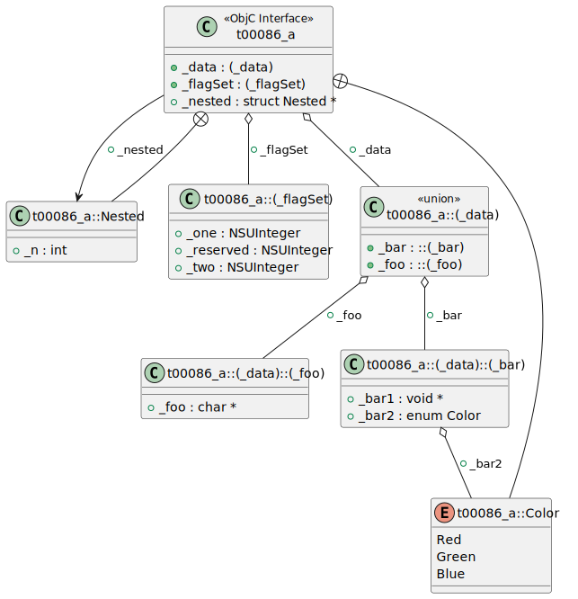

# t00086 - Objective-C nested structs and enums test case
## Config
```yaml
diagrams:
  t00086_class:
    type: class
    glob:
      - t00086.m
    include:
      paths:
        - .


```
## Source code
File `tests/t00086/t00086.m`
```cpp
#import <Foundation/NSObject.h>

@interface t00086_a : NSObject <NSCopying, NSMutableCopying> {
    @public
    enum Color { Red, Green, Blue };
    struct Nested {
        int _n;
    };
    struct {
        NSUInteger _one : 1;
        NSUInteger _two : 1;
        NSUInteger _reserved : 30;
    } _flagSet;
    union {
        struct {
            char *_foo;
        } _foo;
        struct {
            void *_bar1;
            enum Color _bar2;
        } _bar;
    } _data;

    struct Nested *_nested;
}
@end

```
## Generated PlantUML diagrams

## Generated Mermaid diagrams

## Generated JSON models
```json
{
  "diagram_type": "class",
  "elements": [
    {
      "bases": [
        {
          "id": "13825978819641664869"
        }
      ],
      "display_name": "t00086_a",
      "id": "16878117282567736309",
      "is_category": false,
      "is_protocol": false,
      "members": [
        {
          "access": "public",
          "name": "_flagSet",
          "source_location": {
            "column": 7,
            "file": "t00086.m",
            "line": 13,
            "translation_unit": "t00086.m"
          },
          "type": "(_flagSet)"
        },
        {
          "access": "public",
          "name": "_data",
          "source_location": {
            "column": 7,
            "file": "t00086.m",
            "line": 22,
            "translation_unit": "t00086.m"
          },
          "type": "(_data)"
        },
        {
          "access": "public",
          "name": "_nested",
          "source_location": {
            "column": 20,
            "file": "t00086.m",
            "line": 24,
            "translation_unit": "t00086.m"
          },
          "type": "struct Nested *"
        }
      ],
      "methods": [],
      "name": "t00086_a",
      "namespace": "",
      "protocols": [
        {
          "id": "179173215484625750"
        },
        {
          "id": "11877114125793620613"
        }
      ],
      "source_location": {
        "column": 12,
        "file": "t00086.m",
        "line": 3,
        "translation_unit": "t00086.m"
      },
      "type": "objc_interface"
    },
    {
      "constants": [
        "Red",
        "Green",
        "Blue"
      ],
      "display_name": "t00086_a::Color",
      "id": "17351707893194200075",
      "is_nested": true,
      "name": "t00086_a::Color",
      "namespace": "",
      "source_location": {
        "column": 10,
        "file": "t00086.m",
        "line": 5,
        "translation_unit": "t00086.m"
      },
      "type": "enum"
    },
    {
      "bases": [],
      "display_name": "t00086_a::Nested",
      "id": "9686371240316905747",
      "is_abstract": false,
      "is_nested": true,
      "is_struct": true,
      "is_template": false,
      "is_union": false,
      "members": [
        {
          "access": "public",
          "is_static": false,
          "name": "_n",
          "source_location": {
            "column": 13,
            "file": "t00086.m",
            "line": 7,
            "translation_unit": "t00086.m"
          },
          "type": "int"
        }
      ],
      "methods": [],
      "name": "t00086_a::Nested",
      "namespace": "",
      "source_location": {
        "column": 12,
        "file": "t00086.m",
        "line": 6,
        "translation_unit": "t00086.m"
      },
      "template_parameters": [],
      "type": "class"
    },
    {
      "bases": [],
      "display_name": "t00086_a::(_flagSet)",
      "id": "13283504095294322404",
      "is_abstract": false,
      "is_nested": true,
      "is_struct": true,
      "is_template": false,
      "is_union": false,
      "members": [
        {
          "access": "public",
          "is_static": false,
          "name": "_one",
          "source_location": {
            "column": 20,
            "file": "t00086.m",
            "line": 10,
            "translation_unit": "t00086.m"
          },
          "type": "NSUInteger"
        },
        {
          "access": "public",
          "is_static": false,
          "name": "_two",
          "source_location": {
            "column": 20,
            "file": "t00086.m",
            "line": 11,
            "translation_unit": "t00086.m"
          },
          "type": "NSUInteger"
        },
        {
          "access": "public",
          "is_static": false,
          "name": "_reserved",
          "source_location": {
            "column": 20,
            "file": "t00086.m",
            "line": 12,
            "translation_unit": "t00086.m"
          },
          "type": "NSUInteger"
        }
      ],
      "methods": [],
      "name": "t00086_a::(_flagSet)",
      "namespace": "",
      "source_location": {
        "column": 5,
        "file": "t00086.m",
        "line": 9,
        "translation_unit": "t00086.m"
      },
      "template_parameters": [],
      "type": "class"
    },
    {
      "bases": [],
      "display_name": "t00086_a::(_data)",
      "id": "879423984523072590",
      "is_abstract": false,
      "is_nested": true,
      "is_struct": false,
      "is_template": false,
      "is_union": true,
      "members": [
        {
          "access": "public",
          "is_static": false,
          "name": "_foo",
          "source_location": {
            "column": 11,
            "file": "t00086.m",
            "line": 17,
            "translation_unit": "t00086.m"
          },
          "type": "::(_foo)"
        },
        {
          "access": "public",
          "is_static": false,
          "name": "_bar",
          "source_location": {
            "column": 11,
            "file": "t00086.m",
            "line": 21,
            "translation_unit": "t00086.m"
          },
          "type": "::(_bar)"
        }
      ],
      "methods": [],
      "name": "t00086_a::(_data)",
      "namespace": "",
      "source_location": {
        "column": 5,
        "file": "t00086.m",
        "line": 14,
        "translation_unit": "t00086.m"
      },
      "template_parameters": [],
      "type": "class"
    },
    {
      "bases": [],
      "display_name": "t00086_a::(_data)::(_foo)",
      "id": "9940012201502719167",
      "is_abstract": false,
      "is_nested": true,
      "is_struct": true,
      "is_template": false,
      "is_union": false,
      "members": [
        {
          "access": "public",
          "is_static": false,
          "name": "_foo",
          "source_location": {
            "column": 19,
            "file": "t00086.m",
            "line": 16,
            "translation_unit": "t00086.m"
          },
          "type": "char *"
        }
      ],
      "methods": [],
      "name": "t00086_a::(_data)::(_foo)",
      "namespace": "",
      "source_location": {
        "column": 9,
        "file": "t00086.m",
        "line": 15,
        "translation_unit": "t00086.m"
      },
      "template_parameters": [],
      "type": "class"
    },
    {
      "bases": [],
      "display_name": "t00086_a::(_data)::(_bar)",
      "id": "4386299670932140231",
      "is_abstract": false,
      "is_nested": true,
      "is_struct": true,
      "is_template": false,
      "is_union": false,
      "members": [
        {
          "access": "public",
          "is_static": false,
          "name": "_bar1",
          "source_location": {
            "column": 19,
            "file": "t00086.m",
            "line": 19,
            "translation_unit": "t00086.m"
          },
          "type": "void *"
        },
        {
          "access": "public",
          "is_static": false,
          "name": "_bar2",
          "source_location": {
            "column": 24,
            "file": "t00086.m",
            "line": 20,
            "translation_unit": "t00086.m"
          },
          "type": "enum Color"
        }
      ],
      "methods": [],
      "name": "t00086_a::(_data)::(_bar)",
      "namespace": "",
      "source_location": {
        "column": 9,
        "file": "t00086.m",
        "line": 18,
        "translation_unit": "t00086.m"
      },
      "template_parameters": [],
      "type": "class"
    }
  ],
  "name": "t00086_class",
  "package_type": "namespace",
  "relationships": [
    {
      "access": "public",
      "destination": "9686371240316905747",
      "label": "_nested",
      "source": "16878117282567736309",
      "type": "association"
    },
    {
      "access": "public",
      "destination": "13283504095294322404",
      "label": "_flagSet",
      "source": "16878117282567736309",
      "type": "aggregation"
    },
    {
      "access": "public",
      "destination": "879423984523072590",
      "label": "_data",
      "source": "16878117282567736309",
      "type": "aggregation"
    },
    {
      "access": "public",
      "destination": "16878117282567736309",
      "source": "17351707893194200075",
      "type": "containment"
    },
    {
      "access": "public",
      "destination": "16878117282567736309",
      "source": "9686371240316905747",
      "type": "containment"
    },
    {
      "access": "public",
      "destination": "9940012201502719167",
      "label": "_foo",
      "source": "879423984523072590",
      "type": "aggregation"
    },
    {
      "access": "public",
      "destination": "4386299670932140231",
      "label": "_bar",
      "source": "879423984523072590",
      "type": "aggregation"
    },
    {
      "access": "public",
      "destination": "17351707893194200075",
      "label": "_bar2",
      "source": "4386299670932140231",
      "type": "aggregation"
    }
  ]
}
```
## Generated GraphML models
```xml
<?xml version="1.0"?>
<graphml xmlns="http://graphml.graphdrawing.org/xmlns" xmlns:xsi="http://www.w3.org/2001/XMLSchema-instance" xsi:schemaLocation="http://graphml.graphdrawing.org/xmlns http://graphml.graphdrawing.org/xmlns/1.0/graphml.xsd">
 <key attr.name="id" attr.type="string" for="graph" id="gd0" />
 <key attr.name="type" attr.type="string" for="graph" id="gd1" />
 <key attr.name="using_namespace" attr.type="string" for="graph" id="gd2" />
 <key attr.name="id" attr.type="string" for="node" id="nd0" />
 <key attr.name="type" attr.type="string" for="node" id="nd1" />
 <key attr.name="name" attr.type="string" for="node" id="nd2" />
 <key attr.name="stereotype" attr.type="string" for="node" id="nd3" />
 <key attr.name="url" attr.type="string" for="node" id="nd4" />
 <key attr.name="tooltip" attr.type="string" for="node" id="nd5" />
 <key attr.name="is_template" attr.type="boolean" for="node" id="nd6" />
 <key attr.name="type" attr.type="string" for="edge" id="ed0" />
 <key attr.name="access" attr.type="string" for="edge" id="ed1" />
 <key attr.name="label" attr.type="string" for="edge" id="ed2" />
 <key attr.name="url" attr.type="string" for="edge" id="ed3" />
 <graph id="g0" edgedefault="directed" parse.nodeids="canonical" parse.edgeids="canonical" parse.order="nodesfirst">
  <node id="n0">
   <data key="nd1">objc_interface</data>
   <data key="nd2">t00086_a</data>
   <data key="nd4">https://github.com/bkryza/clang-uml/blob/974c6f4a38a48a553ba3f79495af6c960d22884f/tests/t00086/t00086.m#L3</data>
   <data key="nd5">t00086_a</data>
  </node>
  <node id="n1">
   <data key="nd1">enum</data>
   <data key="nd2"><![CDATA[t00086_a::Color]]></data>
   <data key="nd4">https://github.com/bkryza/clang-uml/blob/974c6f4a38a48a553ba3f79495af6c960d22884f/tests/t00086/t00086.m#L5</data>
   <data key="nd5">t00086_a##Color</data>
  </node>
  <node id="n2">
   <data key="nd1">class</data>
   <data key="nd2"><![CDATA[t00086_a::Nested]]></data>
   <data key="nd6">false</data>
   <data key="nd4">https://github.com/bkryza/clang-uml/blob/974c6f4a38a48a553ba3f79495af6c960d22884f/tests/t00086/t00086.m#L6</data>
   <data key="nd5">t00086_a##Nested</data>
  </node>
  <node id="n3">
   <data key="nd1">class</data>
   <data key="nd2"><![CDATA[t00086_a::(_flagSet)]]></data>
   <data key="nd6">false</data>
   <data key="nd4">https://github.com/bkryza/clang-uml/blob/974c6f4a38a48a553ba3f79495af6c960d22884f/tests/t00086/t00086.m#L9</data>
   <data key="nd5">t00086_a##(_flagSet)</data>
  </node>
  <node id="n4">
   <data key="nd1">class</data>
   <data key="nd2"><![CDATA[t00086_a::(_data)]]></data>
   <data key="nd3">union</data>
   <data key="nd6">false</data>
   <data key="nd4">https://github.com/bkryza/clang-uml/blob/974c6f4a38a48a553ba3f79495af6c960d22884f/tests/t00086/t00086.m#L14</data>
   <data key="nd5">t00086_a##(_data)</data>
  </node>
  <node id="n5">
   <data key="nd1">class</data>
   <data key="nd2"><![CDATA[t00086_a::(_data)::(_foo)]]></data>
   <data key="nd6">false</data>
   <data key="nd4">https://github.com/bkryza/clang-uml/blob/974c6f4a38a48a553ba3f79495af6c960d22884f/tests/t00086/t00086.m#L15</data>
   <data key="nd5">t00086_a##(_data)##(_foo)</data>
  </node>
  <node id="n6">
   <data key="nd1">class</data>
   <data key="nd2"><![CDATA[t00086_a::(_data)::(_bar)]]></data>
   <data key="nd6">false</data>
   <data key="nd4">https://github.com/bkryza/clang-uml/blob/974c6f4a38a48a553ba3f79495af6c960d22884f/tests/t00086/t00086.m#L18</data>
   <data key="nd5">t00086_a##(_data)##(_bar)</data>
  </node>
  <edge id="e0" source="n2" target="n0">
   <data key="ed0">containment</data>
   <data key="ed1">public</data>
  </edge>
  <edge id="e1" source="n4" target="n5">
   <data key="ed0">aggregation</data>
   <data key="ed2">_foo</data>
   <data key="ed1">public</data>
  </edge>
  <edge id="e2" source="n4" target="n6">
   <data key="ed0">aggregation</data>
   <data key="ed2">_bar</data>
   <data key="ed1">public</data>
  </edge>
  <edge id="e3" source="n6" target="n1">
   <data key="ed0">aggregation</data>
   <data key="ed2">_bar2</data>
   <data key="ed1">public</data>
  </edge>
  <edge id="e4" source="n1" target="n0">
   <data key="ed0">containment</data>
   <data key="ed1">public</data>
  </edge>
  <edge id="e5" source="n0" target="n2">
   <data key="ed0">association</data>
   <data key="ed2">_nested</data>
   <data key="ed1">public</data>
  </edge>
  <edge id="e6" source="n0" target="n3">
   <data key="ed0">aggregation</data>
   <data key="ed2">_flagSet</data>
   <data key="ed1">public</data>
  </edge>
  <edge id="e7" source="n0" target="n4">
   <data key="ed0">aggregation</data>
   <data key="ed2">_data</data>
   <data key="ed1">public</data>
  </edge>
 </graph>
</graphml>

```
