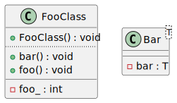

# t00087 - Typed element class diagram filter test case
## Config
```yaml
diagrams:
  t00087_class:
    type: class
    glob:
      - t00087.cc
    using_namespace: clanguml::t00087
    include:
      namespaces:
        - clanguml::t00087
      elements:
        - type: class
          name:
            r: '.*Foo.*'
        - "clanguml::t00087::Bar<T>"
    exclude:
      elements:
        - type: method
          name:
            r: '.*FooClass::(get|set).*'
        - type: member
          name: 'clanguml::t00087::FooClass::pImpl_'
        - bar
```
## Source code
File `tests/t00087/t00087.cc`
```cpp
namespace clanguml {
namespace t00087 {

class FooClass {
    int foo_;

    void *pImpl_;

public:
    FooClass() { }

    int getFoo() const { return foo_; }

    void setFoo(int f) { foo_ = f; }

    void foo() { }

    void bar() { }
};

enum FooEnum {};

template <typename T> class Bar {
    T bar;
};
}
}
```
## Generated PlantUML diagrams

## Generated Mermaid diagrams

## Generated JSON models
```json
{
  "diagram_type": "class",
  "elements": [
    {
      "bases": [],
      "display_name": "FooClass",
      "id": "11109277548113978055",
      "is_abstract": false,
      "is_nested": false,
      "is_struct": false,
      "is_template": false,
      "is_union": false,
      "members": [
        {
          "access": "private",
          "is_static": false,
          "name": "foo_",
          "source_location": {
            "column": 9,
            "file": "t00087.cc",
            "line": 5,
            "translation_unit": "t00087.cc"
          },
          "type": "int"
        }
      ],
      "methods": [
        {
          "access": "public",
          "display_name": "FooClass",
          "is_const": false,
          "is_consteval": false,
          "is_constexpr": false,
          "is_constructor": true,
          "is_copy_assignment": false,
          "is_coroutine": false,
          "is_defaulted": false,
          "is_deleted": false,
          "is_move_assignment": false,
          "is_noexcept": false,
          "is_operator": false,
          "is_pure_virtual": false,
          "is_static": false,
          "is_virtual": false,
          "name": "FooClass",
          "parameters": [],
          "source_location": {
            "column": 5,
            "file": "t00087.cc",
            "line": 10,
            "translation_unit": "t00087.cc"
          },
          "template_parameters": [],
          "type": "void"
        },
        {
          "access": "public",
          "display_name": "foo",
          "is_const": false,
          "is_consteval": false,
          "is_constexpr": false,
          "is_constructor": false,
          "is_copy_assignment": false,
          "is_coroutine": false,
          "is_defaulted": false,
          "is_deleted": false,
          "is_move_assignment": false,
          "is_noexcept": false,
          "is_operator": false,
          "is_pure_virtual": false,
          "is_static": false,
          "is_virtual": false,
          "name": "foo",
          "parameters": [],
          "source_location": {
            "column": 10,
            "file": "t00087.cc",
            "line": 16,
            "translation_unit": "t00087.cc"
          },
          "template_parameters": [],
          "type": "void"
        },
        {
          "access": "public",
          "display_name": "bar",
          "is_const": false,
          "is_consteval": false,
          "is_constexpr": false,
          "is_constructor": false,
          "is_copy_assignment": false,
          "is_coroutine": false,
          "is_defaulted": false,
          "is_deleted": false,
          "is_move_assignment": false,
          "is_noexcept": false,
          "is_operator": false,
          "is_pure_virtual": false,
          "is_static": false,
          "is_virtual": false,
          "name": "bar",
          "parameters": [],
          "source_location": {
            "column": 10,
            "file": "t00087.cc",
            "line": 18,
            "translation_unit": "t00087.cc"
          },
          "template_parameters": [],
          "type": "void"
        }
      ],
      "name": "FooClass",
      "namespace": "clanguml::t00087",
      "source_location": {
        "column": 7,
        "file": "t00087.cc",
        "line": 4,
        "translation_unit": "t00087.cc"
      },
      "template_parameters": [],
      "type": "class"
    },
    {
      "bases": [],
      "display_name": "Bar<T>",
      "id": "11116714444290790658",
      "is_abstract": false,
      "is_nested": false,
      "is_struct": false,
      "is_template": true,
      "is_union": false,
      "members": [
        {
          "access": "private",
          "is_static": false,
          "name": "bar",
          "source_location": {
            "column": 7,
            "file": "t00087.cc",
            "line": 24,
            "translation_unit": "t00087.cc"
          },
          "type": "T"
        }
      ],
      "methods": [],
      "name": "Bar",
      "namespace": "clanguml::t00087",
      "source_location": {
        "column": 29,
        "file": "t00087.cc",
        "line": 23,
        "translation_unit": "t00087.cc"
      },
      "template_parameters": [
        {
          "is_variadic": false,
          "kind": "template_type",
          "name": "T",
          "template_parameters": []
        }
      ],
      "type": "class"
    }
  ],
  "name": "t00087_class",
  "package_type": "namespace",
  "relationships": [],
  "using_namespace": "clanguml::t00087"
}
```
