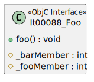

# t00088 - Typed element Objective-C class diagram filter test case
## Config
```yaml
diagrams:
  t00088_class:
    type: class
    glob:
      - t00088.m
    include:
      paths:
        - .
      elements:
        - type: objc_interface
          name: It00088_Foo
    exclude:
      elements:
        - type: objc_method
          name:
            r: 'It00088_Foo::bar.*'
        - type: objc_method
          name: 'It00088_Foo::baz:with:'
        - type: objc_member
          name: 'It00088_Foo::_barMember'
        - type: objc_protocol
          name: Pr00088
```
## Source code
File `tests/t00088/t00088.h`
```cpp
#import <Foundation/Foundation.h>

struct It00088_Foo { };

@protocol Pr00088

@end

@interface It00088_Foo : NSObject {
    int _fooMember;
    int _barMember;
}

+ (void)foo;
+ (void)bar;
+ (void)baz:(int)b with:(int)c;

@end

@interface It00088_Bar : NSObject {
}

@end
```
File `tests/t00088/t00088.m`
```cpp
#include "t00088.h"

@implementation It00088_Foo

+ (void)foo
{
}

+ (void)bar
{
}

+ (void)baz:(int)b with:(int)c
{
}
@end
```
## Generated PlantUML diagrams

## Generated Mermaid diagrams

## Generated JSON models
```json
{
  "diagram_type": "class",
  "elements": [
    {
      "bases": [
        {
          "id": "13825978819641664869"
        }
      ],
      "display_name": "It00088_Foo",
      "id": "13875468327584959141",
      "is_category": false,
      "is_protocol": false,
      "members": [
        {
          "access": "protected",
          "name": "_fooMember",
          "source_location": {
            "column": 9,
            "file": "t00088.h",
            "line": 10,
            "translation_unit": "t00088.m"
          },
          "type": "int"
        },
        {
          "access": "protected",
          "name": "_barMember",
          "source_location": {
            "column": 9,
            "file": "t00088.h",
            "line": 11,
            "translation_unit": "t00088.m"
          },
          "type": "int"
        }
      ],
      "methods": [
        {
          "access": "public",
          "display_name": "foo",
          "is_optional": false,
          "name": "foo",
          "parameters": [],
          "source_location": {
            "column": 1,
            "file": "t00088.h",
            "line": 14,
            "translation_unit": "t00088.m"
          },
          "type": "void"
        }
      ],
      "name": "It00088_Foo",
      "namespace": "",
      "protocols": [],
      "source_location": {
        "column": 12,
        "file": "t00088.h",
        "line": 9,
        "translation_unit": "t00088.m"
      },
      "type": "objc_interface"
    }
  ],
  "name": "t00088_class",
  "package_type": "namespace",
  "relationships": []
}
```
