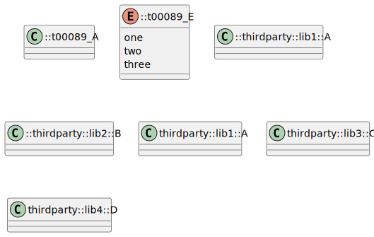
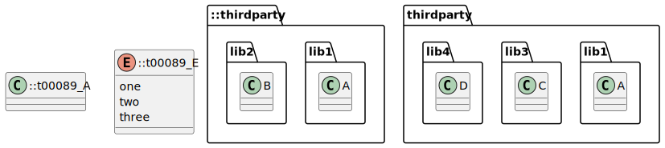

# t00089 - Test case for '::' prefix in class diagrams for namespaces outside of using_namespace
## Config
```yaml
diagrams:
  t00089_class:
    type: class
    generate_packages: false
    glob:
      - t00089.cc
    include:
      paths:
        - .
    using_namespace: clanguml::t00089
  t00089_packages_class:
    type: class
    generate_packages: true
    glob:
      - t00089.cc
    include:
      paths:
        - .
    using_namespace: clanguml::t00089
```
## Source code
File `tests/t00089/t00089.cc`
```cpp
class t00089_A { };

enum class t00089_E { one, two, three };

namespace thirdparty {
namespace lib1 {
class A { };
}
namespace lib2 {
class B { };
}
}

namespace clanguml {
namespace t00089 {
namespace thirdparty {
namespace lib1 {
class A { };
}
namespace lib3 {
class C { };
}
namespace lib4 {
class D { };
}
}
}
}
```
## Generated PlantUML diagrams


## Generated Mermaid diagrams


## Generated JSON models
```json
{
  "diagram_type": "class",
  "elements": [
    {
      "bases": [],
      "display_name": "::t00089_A",
      "id": "10732705655723511888",
      "is_abstract": false,
      "is_nested": false,
      "is_struct": false,
      "is_template": false,
      "is_union": false,
      "members": [],
      "methods": [],
      "name": "t00089_A",
      "namespace": "",
      "source_location": {
        "column": 7,
        "file": "t00089.cc",
        "line": 1,
        "translation_unit": "t00089.cc"
      },
      "template_parameters": [],
      "type": "class"
    },
    {
      "constants": [
        "one",
        "two",
        "three"
      ],
      "display_name": "::t00089_E",
      "id": "14039812785135828538",
      "is_nested": false,
      "name": "t00089_E",
      "namespace": "",
      "source_location": {
        "column": 12,
        "file": "t00089.cc",
        "line": 3,
        "translation_unit": "t00089.cc"
      },
      "type": "enum"
    },
    {
      "bases": [],
      "display_name": "::thirdparty::lib1::A",
      "id": "17472882252001821525",
      "is_abstract": false,
      "is_nested": false,
      "is_struct": false,
      "is_template": false,
      "is_union": false,
      "members": [],
      "methods": [],
      "name": "A",
      "namespace": "thirdparty::lib1",
      "source_location": {
        "column": 7,
        "file": "t00089.cc",
        "line": 7,
        "translation_unit": "t00089.cc"
      },
      "template_parameters": [],
      "type": "class"
    },
    {
      "bases": [],
      "display_name": "::thirdparty::lib2::B",
      "id": "16264232235334740782",
      "is_abstract": false,
      "is_nested": false,
      "is_struct": false,
      "is_template": false,
      "is_union": false,
      "members": [],
      "methods": [],
      "name": "B",
      "namespace": "thirdparty::lib2",
      "source_location": {
        "column": 7,
        "file": "t00089.cc",
        "line": 10,
        "translation_unit": "t00089.cc"
      },
      "template_parameters": [],
      "type": "class"
    },
    {
      "bases": [],
      "display_name": "thirdparty::lib1::A",
      "id": "18115595999802057074",
      "is_abstract": false,
      "is_nested": false,
      "is_struct": false,
      "is_template": false,
      "is_union": false,
      "members": [],
      "methods": [],
      "name": "A",
      "namespace": "clanguml::t00089::thirdparty::lib1",
      "source_location": {
        "column": 7,
        "file": "t00089.cc",
        "line": 18,
        "translation_unit": "t00089.cc"
      },
      "template_parameters": [],
      "type": "class"
    },
    {
      "bases": [],
      "display_name": "thirdparty::lib3::C",
      "id": "399617758963541908",
      "is_abstract": false,
      "is_nested": false,
      "is_struct": false,
      "is_template": false,
      "is_union": false,
      "members": [],
      "methods": [],
      "name": "C",
      "namespace": "clanguml::t00089::thirdparty::lib3",
      "source_location": {
        "column": 7,
        "file": "t00089.cc",
        "line": 21,
        "translation_unit": "t00089.cc"
      },
      "template_parameters": [],
      "type": "class"
    },
    {
      "bases": [],
      "display_name": "thirdparty::lib4::D",
      "id": "1591677300810518941",
      "is_abstract": false,
      "is_nested": false,
      "is_struct": false,
      "is_template": false,
      "is_union": false,
      "members": [],
      "methods": [],
      "name": "D",
      "namespace": "clanguml::t00089::thirdparty::lib4",
      "source_location": {
        "column": 7,
        "file": "t00089.cc",
        "line": 24,
        "translation_unit": "t00089.cc"
      },
      "template_parameters": [],
      "type": "class"
    }
  ],
  "name": "t00089_class",
  "package_type": "namespace",
  "relationships": [],
  "using_namespace": "clanguml::t00089"
}
```
```json
{
  "diagram_type": "class",
  "elements": [
    {
      "bases": [],
      "display_name": "::t00089_A",
      "id": "10732705655723511888",
      "is_abstract": false,
      "is_nested": false,
      "is_struct": false,
      "is_template": false,
      "is_union": false,
      "members": [],
      "methods": [],
      "name": "t00089_A",
      "namespace": "",
      "source_location": {
        "column": 7,
        "file": "t00089.cc",
        "line": 1,
        "translation_unit": "t00089.cc"
      },
      "template_parameters": [],
      "type": "class"
    },
    {
      "constants": [
        "one",
        "two",
        "three"
      ],
      "display_name": "::t00089_E",
      "id": "14039812785135828538",
      "is_nested": false,
      "name": "t00089_E",
      "namespace": "",
      "source_location": {
        "column": 12,
        "file": "t00089.cc",
        "line": 3,
        "translation_unit": "t00089.cc"
      },
      "type": "enum"
    },
    {
      "display_name": "::thirdparty",
      "elements": [
        {
          "display_name": "lib1",
          "elements": [
            {
              "bases": [],
              "display_name": "A",
              "id": "17472882252001821525",
              "is_abstract": false,
              "is_nested": false,
              "is_struct": false,
              "is_template": false,
              "is_union": false,
              "members": [],
              "methods": [],
              "name": "A",
              "namespace": "thirdparty::lib1",
              "source_location": {
                "column": 7,
                "file": "t00089.cc",
                "line": 7,
                "translation_unit": "t00089.cc"
              },
              "template_parameters": [],
              "type": "class"
            }
          ],
          "name": "lib1",
          "type": "namespace"
        },
        {
          "display_name": "lib2",
          "elements": [
            {
              "bases": [],
              "display_name": "B",
              "id": "16264232235334740782",
              "is_abstract": false,
              "is_nested": false,
              "is_struct": false,
              "is_template": false,
              "is_union": false,
              "members": [],
              "methods": [],
              "name": "B",
              "namespace": "thirdparty::lib2",
              "source_location": {
                "column": 7,
                "file": "t00089.cc",
                "line": 10,
                "translation_unit": "t00089.cc"
              },
              "template_parameters": [],
              "type": "class"
            }
          ],
          "name": "lib2",
          "type": "namespace"
        }
      ],
      "name": "thirdparty",
      "type": "namespace"
    },
    {
      "display_name": "thirdparty",
      "elements": [
        {
          "display_name": "lib1",
          "elements": [
            {
              "bases": [],
              "display_name": "A",
              "id": "18115595999802057074",
              "is_abstract": false,
              "is_nested": false,
              "is_struct": false,
              "is_template": false,
              "is_union": false,
              "members": [],
              "methods": [],
              "name": "A",
              "namespace": "clanguml::t00089::thirdparty::lib1",
              "source_location": {
                "column": 7,
                "file": "t00089.cc",
                "line": 18,
                "translation_unit": "t00089.cc"
              },
              "template_parameters": [],
              "type": "class"
            }
          ],
          "name": "lib1",
          "type": "namespace"
        },
        {
          "display_name": "lib3",
          "elements": [
            {
              "bases": [],
              "display_name": "C",
              "id": "399617758963541908",
              "is_abstract": false,
              "is_nested": false,
              "is_struct": false,
              "is_template": false,
              "is_union": false,
              "members": [],
              "methods": [],
              "name": "C",
              "namespace": "clanguml::t00089::thirdparty::lib3",
              "source_location": {
                "column": 7,
                "file": "t00089.cc",
                "line": 21,
                "translation_unit": "t00089.cc"
              },
              "template_parameters": [],
              "type": "class"
            }
          ],
          "name": "lib3",
          "type": "namespace"
        },
        {
          "display_name": "lib4",
          "elements": [
            {
              "bases": [],
              "display_name": "D",
              "id": "1591677300810518941",
              "is_abstract": false,
              "is_nested": false,
              "is_struct": false,
              "is_template": false,
              "is_union": false,
              "members": [],
              "methods": [],
              "name": "D",
              "namespace": "clanguml::t00089::thirdparty::lib4",
              "source_location": {
                "column": 7,
                "file": "t00089.cc",
                "line": 24,
                "translation_unit": "t00089.cc"
              },
              "template_parameters": [],
              "type": "class"
            }
          ],
          "name": "lib4",
          "type": "namespace"
        }
      ],
      "name": "thirdparty",
      "type": "namespace"
    }
  ],
  "name": "t00089_packages_class",
  "package_type": "namespace",
  "relationships": [],
  "using_namespace": "clanguml::t00089"
}
```
## Generated GraphML models
```xml
<?xml version="1.0"?>
<graphml xmlns="http://graphml.graphdrawing.org/xmlns" xmlns:xsi="http://www.w3.org/2001/XMLSchema-instance" xsi:schemaLocation="http://graphml.graphdrawing.org/xmlns http://graphml.graphdrawing.org/xmlns/1.0/graphml.xsd">
 <key attr.name="id" attr.type="string" for="graph" id="gd0" />
 <key attr.name="diagram_type" attr.type="string" for="graph" id="gd1" />
 <key attr.name="name" attr.type="string" for="graph" id="gd2" />
 <key attr.name="using_namespace" attr.type="string" for="graph" id="gd3" />
 <key attr.name="id" attr.type="string" for="node" id="nd0" />
 <key attr.name="type" attr.type="string" for="node" id="nd1" />
 <key attr.name="name" attr.type="string" for="node" id="nd2" />
 <key attr.name="stereotype" attr.type="string" for="node" id="nd3" />
 <key attr.name="url" attr.type="string" for="node" id="nd4" />
 <key attr.name="tooltip" attr.type="string" for="node" id="nd5" />
 <key attr.name="is_template" attr.type="boolean" for="node" id="nd6" />
 <key attr.name="type" attr.type="string" for="edge" id="ed0" />
 <key attr.name="access" attr.type="string" for="edge" id="ed1" />
 <key attr.name="label" attr.type="string" for="edge" id="ed2" />
 <key attr.name="url" attr.type="string" for="edge" id="ed3" />
 <graph id="g0" edgedefault="directed" parse.nodeids="canonical" parse.edgeids="canonical" parse.order="nodesfirst">
  <data key="gd3">clanguml::t00089</data>
  <node id="n0">
   <data key="nd1">class</data>
   <data key="nd2"><![CDATA[::t00089_A]]></data>
   <data key="nd6">false</data>
   <data key="nd4">https://github.com/bkryza/clang-uml/blob/375fb0bfc3a0e0b702776c4e39f79ee848c5c67c/tests/t00089/t00089.cc#L1</data>
   <data key="nd5">t00089_A</data>
  </node>
  <node id="n1">
   <data key="nd1">enum</data>
   <data key="nd2"><![CDATA[::t00089_E]]></data>
   <data key="nd4">https://github.com/bkryza/clang-uml/blob/375fb0bfc3a0e0b702776c4e39f79ee848c5c67c/tests/t00089/t00089.cc#L3</data>
   <data key="nd5">t00089_E</data>
  </node>
  <node id="n2">
   <data key="nd1">class</data>
   <data key="nd2"><![CDATA[::thirdparty::lib1::A]]></data>
   <data key="nd6">false</data>
   <data key="nd4">https://github.com/bkryza/clang-uml/blob/375fb0bfc3a0e0b702776c4e39f79ee848c5c67c/tests/t00089/t00089.cc#L7</data>
   <data key="nd5">A</data>
  </node>
  <node id="n3">
   <data key="nd1">class</data>
   <data key="nd2"><![CDATA[::thirdparty::lib2::B]]></data>
   <data key="nd6">false</data>
   <data key="nd4">https://github.com/bkryza/clang-uml/blob/375fb0bfc3a0e0b702776c4e39f79ee848c5c67c/tests/t00089/t00089.cc#L10</data>
   <data key="nd5">B</data>
  </node>
  <node id="n4">
   <data key="nd1">class</data>
   <data key="nd2"><![CDATA[thirdparty::lib1::A]]></data>
   <data key="nd6">false</data>
   <data key="nd4">https://github.com/bkryza/clang-uml/blob/375fb0bfc3a0e0b702776c4e39f79ee848c5c67c/tests/t00089/t00089.cc#L18</data>
   <data key="nd5">A</data>
  </node>
  <node id="n5">
   <data key="nd1">class</data>
   <data key="nd2"><![CDATA[thirdparty::lib3::C]]></data>
   <data key="nd6">false</data>
   <data key="nd4">https://github.com/bkryza/clang-uml/blob/375fb0bfc3a0e0b702776c4e39f79ee848c5c67c/tests/t00089/t00089.cc#L21</data>
   <data key="nd5">C</data>
  </node>
  <node id="n6">
   <data key="nd1">class</data>
   <data key="nd2"><![CDATA[thirdparty::lib4::D]]></data>
   <data key="nd6">false</data>
   <data key="nd4">https://github.com/bkryza/clang-uml/blob/375fb0bfc3a0e0b702776c4e39f79ee848c5c67c/tests/t00089/t00089.cc#L24</data>
   <data key="nd5">D</data>
  </node>
 </graph>
</graphml>

```
```xml
<?xml version="1.0"?>
<graphml xmlns="http://graphml.graphdrawing.org/xmlns" xmlns:xsi="http://www.w3.org/2001/XMLSchema-instance" xsi:schemaLocation="http://graphml.graphdrawing.org/xmlns http://graphml.graphdrawing.org/xmlns/1.0/graphml.xsd">
 <key attr.name="id" attr.type="string" for="graph" id="gd0" />
 <key attr.name="diagram_type" attr.type="string" for="graph" id="gd1" />
 <key attr.name="name" attr.type="string" for="graph" id="gd2" />
 <key attr.name="using_namespace" attr.type="string" for="graph" id="gd3" />
 <key attr.name="id" attr.type="string" for="node" id="nd0" />
 <key attr.name="type" attr.type="string" for="node" id="nd1" />
 <key attr.name="name" attr.type="string" for="node" id="nd2" />
 <key attr.name="stereotype" attr.type="string" for="node" id="nd3" />
 <key attr.name="url" attr.type="string" for="node" id="nd4" />
 <key attr.name="tooltip" attr.type="string" for="node" id="nd5" />
 <key attr.name="is_template" attr.type="boolean" for="node" id="nd6" />
 <key attr.name="type" attr.type="string" for="edge" id="ed0" />
 <key attr.name="access" attr.type="string" for="edge" id="ed1" />
 <key attr.name="label" attr.type="string" for="edge" id="ed2" />
 <key attr.name="url" attr.type="string" for="edge" id="ed3" />
 <graph id="g0" edgedefault="directed" parse.nodeids="canonical" parse.edgeids="canonical" parse.order="nodesfirst">
  <data key="gd3">clanguml::t00089</data>
  <node id="n0">
   <data key="nd1">class</data>
   <data key="nd2"><![CDATA[::t00089_A]]></data>
   <data key="nd6">false</data>
   <data key="nd4">https://github.com/bkryza/clang-uml/blob/375fb0bfc3a0e0b702776c4e39f79ee848c5c67c/tests/t00089/t00089.cc#L1</data>
   <data key="nd5">t00089_A</data>
  </node>
  <node id="n1">
   <data key="nd1">enum</data>
   <data key="nd2"><![CDATA[::t00089_E]]></data>
   <data key="nd4">https://github.com/bkryza/clang-uml/blob/375fb0bfc3a0e0b702776c4e39f79ee848c5c67c/tests/t00089/t00089.cc#L3</data>
   <data key="nd5">t00089_E</data>
  </node>
  <node id="n2">
   <data key="nd2">::thirdparty</data>
   <data key="nd1">namespace</data>
   <graph id="g1" edgedefault="directed" parse.nodeids="canonical" parse.edgeids="canonical" parse.order="nodesfirst">
    <node id="n3">
     <data key="nd2">lib1</data>
     <data key="nd1">namespace</data>
     <graph id="g2" edgedefault="directed" parse.nodeids="canonical" parse.edgeids="canonical" parse.order="nodesfirst">
      <node id="n4">
       <data key="nd1">class</data>
       <data key="nd2"><![CDATA[A]]></data>
       <data key="nd6">false</data>
       <data key="nd4">https://github.com/bkryza/clang-uml/blob/375fb0bfc3a0e0b702776c4e39f79ee848c5c67c/tests/t00089/t00089.cc#L7</data>
       <data key="nd5">A</data>
      </node>
     </graph>
    </node>
    <node id="n5">
     <data key="nd2">lib2</data>
     <data key="nd1">namespace</data>
     <graph id="g3" edgedefault="directed" parse.nodeids="canonical" parse.edgeids="canonical" parse.order="nodesfirst">
      <node id="n6">
       <data key="nd1">class</data>
       <data key="nd2"><![CDATA[B]]></data>
       <data key="nd6">false</data>
       <data key="nd4">https://github.com/bkryza/clang-uml/blob/375fb0bfc3a0e0b702776c4e39f79ee848c5c67c/tests/t00089/t00089.cc#L10</data>
       <data key="nd5">B</data>
      </node>
     </graph>
    </node>
   </graph>
  </node>
  <node id="n7">
   <data key="nd2">thirdparty</data>
   <data key="nd1">namespace</data>
   <graph id="g4" edgedefault="directed" parse.nodeids="canonical" parse.edgeids="canonical" parse.order="nodesfirst">
    <node id="n8">
     <data key="nd2">lib1</data>
     <data key="nd1">namespace</data>
     <graph id="g5" edgedefault="directed" parse.nodeids="canonical" parse.edgeids="canonical" parse.order="nodesfirst">
      <node id="n9">
       <data key="nd1">class</data>
       <data key="nd2"><![CDATA[A]]></data>
       <data key="nd6">false</data>
       <data key="nd4">https://github.com/bkryza/clang-uml/blob/375fb0bfc3a0e0b702776c4e39f79ee848c5c67c/tests/t00089/t00089.cc#L18</data>
       <data key="nd5">A</data>
      </node>
     </graph>
    </node>
    <node id="n10">
     <data key="nd2">lib3</data>
     <data key="nd1">namespace</data>
     <graph id="g6" edgedefault="directed" parse.nodeids="canonical" parse.edgeids="canonical" parse.order="nodesfirst">
      <node id="n11">
       <data key="nd1">class</data>
       <data key="nd2"><![CDATA[C]]></data>
       <data key="nd6">false</data>
       <data key="nd4">https://github.com/bkryza/clang-uml/blob/375fb0bfc3a0e0b702776c4e39f79ee848c5c67c/tests/t00089/t00089.cc#L21</data>
       <data key="nd5">C</data>
      </node>
     </graph>
    </node>
    <node id="n12">
     <data key="nd2">lib4</data>
     <data key="nd1">namespace</data>
     <graph id="g7" edgedefault="directed" parse.nodeids="canonical" parse.edgeids="canonical" parse.order="nodesfirst">
      <node id="n13">
       <data key="nd1">class</data>
       <data key="nd2"><![CDATA[D]]></data>
       <data key="nd6">false</data>
       <data key="nd4">https://github.com/bkryza/clang-uml/blob/375fb0bfc3a0e0b702776c4e39f79ee848c5c67c/tests/t00089/t00089.cc#L24</data>
       <data key="nd5">D</data>
      </node>
     </graph>
    </node>
   </graph>
  </node>
 </graph>
</graphml>

```
