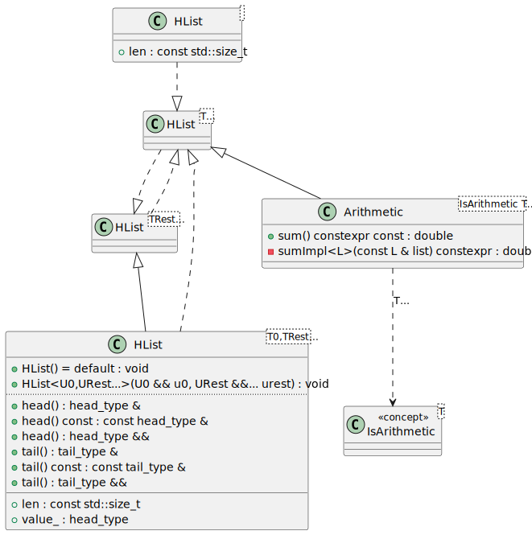

# t00090 - Metaprogramming test case with recursive type list
## Config
```yaml
diagrams:
  t00090_class:
    type: class
    glob:
      - t00090.cc
    include:
      namespaces:
        - clanguml::t00090
    using_namespace: clanguml::t00090
```
## Source code
File `tests/t00090/t00090.cc`
```cpp
#include <iostream>
#include <type_traits>

/// Based on recursive-types-through-inheritance example from:
/// https://www.scs.stanford.edu/~dm/blog/param-pack.html

namespace clanguml::t00090 {

template <typename... T> struct HList;

template <> struct HList<> {
    static constexpr std::size_t len = 0;
};

template <typename T0, typename... TRest>
struct HList<T0, TRest...> : HList<TRest...> {
    using head_type = T0;
    using tail_type = HList<TRest...>;

    static constexpr std::size_t len = 1 + sizeof...(TRest);
    [[no_unique_address]] head_type value_{};

    constexpr HList() = default;
    template <typename U0, typename... URest>
    constexpr HList(U0 &&u0, URest &&...urest)
        : tail_type(std::forward<URest>(urest)...)
        , value_(std::forward<U0>(u0))
    {
    }

    head_type &head() & { return value_; }
    const head_type &head() const & { return value_; }
    head_type &&head() && { return value_; }

    tail_type &tail() & { return *this; }
    const tail_type &tail() const & { return *this; }
    tail_type &&tail() && { return *this; }
};

template <typename... T> HList(T...) -> HList<T...>;

template <typename T>
concept IsArithmetic = std::is_arithmetic_v<T>;

template <IsArithmetic... T> class Arithmetic : HList<T...> {
public:
    using HList<T...>::HList;

    constexpr double sum() const { return sumImpl(*this); }

private:
    template <typename L> static constexpr double sumImpl(const L &list)
    {
        if constexpr (L::len == 0) {
            return 0.0;
        }
        else {
            return static_cast<double>(list.head()) + sumImpl(list.tail());
        }
    }
};

int tmain()
{
    constexpr Arithmetic<int, float, double> a{11, 12.0, 13.0};

    return a.sum();
}
}
```
## Generated PlantUML diagrams

## Generated Mermaid diagrams

## Generated JSON models
```json
{
  "diagram_type": "class",
  "elements": [
    {
      "bases": [],
      "display_name": "HList<>",
      "id": "1131745880253243196",
      "is_abstract": false,
      "is_nested": false,
      "is_struct": true,
      "is_template": true,
      "is_union": false,
      "members": [
        {
          "access": "public",
          "is_static": true,
          "name": "len",
          "source_location": {
            "column": 34,
            "file": "t00090.cc",
            "line": 12,
            "translation_unit": "t00090.cc"
          },
          "type": "const std::size_t"
        }
      ],
      "methods": [],
      "name": "HList",
      "namespace": "clanguml::t00090",
      "source_location": {
        "column": 20,
        "file": "t00090.cc",
        "line": 11,
        "translation_unit": "t00090.cc"
      },
      "template_parameters": [
        {
          "is_variadic": false,
          "kind": "empty",
          "template_parameters": []
        }
      ],
      "type": "class"
    },
    {
      "bases": [],
      "display_name": "HList<TRest...>",
      "id": "12180070346253587692",
      "is_abstract": false,
      "is_nested": false,
      "is_struct": false,
      "is_template": true,
      "is_union": false,
      "members": [],
      "methods": [],
      "name": "HList",
      "namespace": "clanguml::t00090",
      "source_location": {
        "column": 33,
        "file": "t00090.cc",
        "line": 9,
        "translation_unit": "t00090.cc"
      },
      "template_parameters": [
        {
          "is_variadic": true,
          "kind": "template_type",
          "name": "TRest...",
          "template_parameters": []
        }
      ],
      "type": "class"
    },
    {
      "bases": [
        {
          "access": "public",
          "id": "12180070346253587692",
          "is_virtual": false
        }
      ],
      "display_name": "HList<T0,TRest...>",
      "id": "3893726188464493564",
      "is_abstract": false,
      "is_nested": false,
      "is_struct": true,
      "is_template": true,
      "is_union": false,
      "members": [
        {
          "access": "public",
          "is_static": false,
          "name": "value_",
          "source_location": {
            "column": 37,
            "file": "t00090.cc",
            "line": 21,
            "translation_unit": "t00090.cc"
          },
          "type": "head_type"
        },
        {
          "access": "public",
          "is_static": true,
          "name": "len",
          "source_location": {
            "column": 34,
            "file": "t00090.cc",
            "line": 20,
            "translation_unit": "t00090.cc"
          },
          "type": "const std::size_t"
        }
      ],
      "methods": [
        {
          "access": "public",
          "display_name": "HList",
          "is_const": false,
          "is_consteval": false,
          "is_constexpr": false,
          "is_constructor": true,
          "is_copy_assignment": false,
          "is_coroutine": false,
          "is_defaulted": true,
          "is_deleted": false,
          "is_move_assignment": false,
          "is_noexcept": false,
          "is_operator": false,
          "is_pure_virtual": false,
          "is_static": false,
          "is_virtual": false,
          "name": "HList",
          "parameters": [],
          "source_location": {
            "column": 15,
            "file": "t00090.cc",
            "line": 23,
            "translation_unit": "t00090.cc"
          },
          "template_parameters": [],
          "type": "void"
        },
        {
          "access": "public",
          "display_name": "head",
          "is_const": false,
          "is_consteval": false,
          "is_constexpr": false,
          "is_constructor": false,
          "is_copy_assignment": false,
          "is_coroutine": false,
          "is_defaulted": false,
          "is_deleted": false,
          "is_move_assignment": false,
          "is_noexcept": false,
          "is_operator": false,
          "is_pure_virtual": false,
          "is_static": false,
          "is_virtual": false,
          "name": "head",
          "parameters": [],
          "source_location": {
            "column": 16,
            "file": "t00090.cc",
            "line": 31,
            "translation_unit": "t00090.cc"
          },
          "template_parameters": [],
          "type": "head_type &"
        },
        {
          "access": "public",
          "display_name": "head",
          "is_const": true,
          "is_consteval": false,
          "is_constexpr": false,
          "is_constructor": false,
          "is_copy_assignment": false,
          "is_coroutine": false,
          "is_defaulted": false,
          "is_deleted": false,
          "is_move_assignment": false,
          "is_noexcept": false,
          "is_operator": false,
          "is_pure_virtual": false,
          "is_static": false,
          "is_virtual": false,
          "name": "head",
          "parameters": [],
          "source_location": {
            "column": 22,
            "file": "t00090.cc",
            "line": 32,
            "translation_unit": "t00090.cc"
          },
          "template_parameters": [],
          "type": "const head_type &"
        },
        {
          "access": "public",
          "display_name": "head",
          "is_const": false,
          "is_consteval": false,
          "is_constexpr": false,
          "is_constructor": false,
          "is_copy_assignment": false,
          "is_coroutine": false,
          "is_defaulted": false,
          "is_deleted": false,
          "is_move_assignment": false,
          "is_noexcept": false,
          "is_operator": false,
          "is_pure_virtual": false,
          "is_static": false,
          "is_virtual": false,
          "name": "head",
          "parameters": [],
          "source_location": {
            "column": 17,
            "file": "t00090.cc",
            "line": 33,
            "translation_unit": "t00090.cc"
          },
          "template_parameters": [],
          "type": "head_type &&"
        },
        {
          "access": "public",
          "display_name": "tail",
          "is_const": false,
          "is_consteval": false,
          "is_constexpr": false,
          "is_constructor": false,
          "is_copy_assignment": false,
          "is_coroutine": false,
          "is_defaulted": false,
          "is_deleted": false,
          "is_move_assignment": false,
          "is_noexcept": false,
          "is_operator": false,
          "is_pure_virtual": false,
          "is_static": false,
          "is_virtual": false,
          "name": "tail",
          "parameters": [],
          "source_location": {
            "column": 16,
            "file": "t00090.cc",
            "line": 35,
            "translation_unit": "t00090.cc"
          },
          "template_parameters": [],
          "type": "tail_type &"
        },
        {
          "access": "public",
          "display_name": "tail",
          "is_const": true,
          "is_consteval": false,
          "is_constexpr": false,
          "is_constructor": false,
          "is_copy_assignment": false,
          "is_coroutine": false,
          "is_defaulted": false,
          "is_deleted": false,
          "is_move_assignment": false,
          "is_noexcept": false,
          "is_operator": false,
          "is_pure_virtual": false,
          "is_static": false,
          "is_virtual": false,
          "name": "tail",
          "parameters": [],
          "source_location": {
            "column": 22,
            "file": "t00090.cc",
            "line": 36,
            "translation_unit": "t00090.cc"
          },
          "template_parameters": [],
          "type": "const tail_type &"
        },
        {
          "access": "public",
          "display_name": "tail",
          "is_const": false,
          "is_consteval": false,
          "is_constexpr": false,
          "is_constructor": false,
          "is_copy_assignment": false,
          "is_coroutine": false,
          "is_defaulted": false,
          "is_deleted": false,
          "is_move_assignment": false,
          "is_noexcept": false,
          "is_operator": false,
          "is_pure_virtual": false,
          "is_static": false,
          "is_virtual": false,
          "name": "tail",
          "parameters": [],
          "source_location": {
            "column": 17,
            "file": "t00090.cc",
            "line": 37,
            "translation_unit": "t00090.cc"
          },
          "template_parameters": [],
          "type": "tail_type &&"
        },
        {
          "access": "public",
          "display_name": "HList<U0,URest...>",
          "is_const": false,
          "is_consteval": false,
          "is_constexpr": false,
          "is_constructor": true,
          "is_copy_assignment": false,
          "is_coroutine": false,
          "is_defaulted": false,
          "is_deleted": false,
          "is_move_assignment": false,
          "is_noexcept": false,
          "is_operator": false,
          "is_pure_virtual": false,
          "is_static": false,
          "is_virtual": false,
          "name": "HList",
          "parameters": [
            {
              "name": "u0",
              "type": "U0 &&"
            },
            {
              "name": "urest",
              "type": "URest &&..."
            }
          ],
          "template_parameters": [
            {
              "is_variadic": false,
              "kind": "template_type",
              "name": "U0",
              "template_parameters": []
            },
            {
              "is_variadic": true,
              "kind": "template_type",
              "name": "URest...",
              "template_parameters": []
            }
          ],
          "type": "void"
        }
      ],
      "name": "HList",
      "namespace": "clanguml::t00090",
      "source_location": {
        "column": 8,
        "file": "t00090.cc",
        "line": 16,
        "translation_unit": "t00090.cc"
      },
      "template_parameters": [
        {
          "is_variadic": false,
          "kind": "template_type",
          "name": "T0",
          "template_parameters": []
        },
        {
          "is_variadic": true,
          "kind": "template_type",
          "name": "TRest...",
          "template_parameters": []
        }
      ],
      "type": "class"
    },
    {
      "display_name": "IsArithmetic<T>",
      "id": "17998779808959677846",
      "name": "IsArithmetic",
      "namespace": "clanguml::t00090",
      "parameters": [],
      "source_location": {
        "column": 9,
        "file": "t00090.cc",
        "line": 43,
        "translation_unit": "t00090.cc"
      },
      "statements": [],
      "type": "concept"
    },
    {
      "bases": [],
      "display_name": "HList<T...>",
      "id": "8609626869808360498",
      "is_abstract": false,
      "is_nested": false,
      "is_struct": false,
      "is_template": true,
      "is_union": false,
      "members": [],
      "methods": [],
      "name": "HList",
      "namespace": "clanguml::t00090",
      "source_location": {
        "column": 36,
        "file": "t00090.cc",
        "line": 45,
        "translation_unit": "t00090.cc"
      },
      "template_parameters": [
        {
          "is_variadic": true,
          "kind": "template_type",
          "name": "T...",
          "template_parameters": []
        }
      ],
      "type": "class"
    },
    {
      "bases": [
        {
          "access": "private",
          "id": "8609626869808360498",
          "is_virtual": false
        }
      ],
      "display_name": "Arithmetic<IsArithmetic T...>",
      "id": "3597230173065033424",
      "is_abstract": false,
      "is_nested": false,
      "is_struct": false,
      "is_template": true,
      "is_union": false,
      "members": [],
      "methods": [
        {
          "access": "public",
          "display_name": "sum",
          "is_const": true,
          "is_consteval": false,
          "is_constexpr": true,
          "is_constructor": false,
          "is_copy_assignment": false,
          "is_coroutine": false,
          "is_defaulted": false,
          "is_deleted": false,
          "is_move_assignment": false,
          "is_noexcept": false,
          "is_operator": false,
          "is_pure_virtual": false,
          "is_static": false,
          "is_virtual": false,
          "name": "sum",
          "parameters": [],
          "source_location": {
            "column": 22,
            "file": "t00090.cc",
            "line": 49,
            "translation_unit": "t00090.cc"
          },
          "template_parameters": [],
          "type": "double"
        },
        {
          "access": "private",
          "display_name": "sumImpl<L>",
          "is_const": false,
          "is_consteval": false,
          "is_constexpr": true,
          "is_constructor": false,
          "is_copy_assignment": false,
          "is_coroutine": false,
          "is_defaulted": false,
          "is_deleted": false,
          "is_move_assignment": false,
          "is_noexcept": false,
          "is_operator": false,
          "is_pure_virtual": false,
          "is_static": true,
          "is_virtual": false,
          "name": "sumImpl",
          "parameters": [
            {
              "name": "list",
              "type": "const L &"
            }
          ],
          "template_parameters": [
            {
              "is_variadic": false,
              "kind": "template_type",
              "name": "L",
              "template_parameters": []
            }
          ],
          "type": "double"
        }
      ],
      "name": "Arithmetic",
      "namespace": "clanguml::t00090",
      "source_location": {
        "column": 36,
        "file": "t00090.cc",
        "line": 45,
        "translation_unit": "t00090.cc"
      },
      "template_parameters": [
        {
          "is_variadic": true,
          "kind": "template_type",
          "name": "T...",
          "template_parameters": []
        }
      ],
      "type": "class"
    }
  ],
  "name": "t00090_class",
  "package_type": "namespace",
  "relationships": [
    {
      "access": "public",
      "destination": "8609626869808360498",
      "source": "1131745880253243196",
      "type": "instantiation"
    },
    {
      "access": "public",
      "destination": "8609626869808360498",
      "source": "12180070346253587692",
      "type": "instantiation"
    },
    {
      "access": "public",
      "destination": "12180070346253587692",
      "source": "3893726188464493564",
      "type": "extension"
    },
    {
      "access": "public",
      "destination": "8609626869808360498",
      "source": "3893726188464493564",
      "type": "instantiation"
    },
    {
      "access": "public",
      "destination": "12180070346253587692",
      "source": "8609626869808360498",
      "type": "instantiation"
    },
    {
      "destination": "17998779808959677846",
      "label": "T...",
      "source": "3597230173065033424",
      "type": "constraint"
    },
    {
      "access": "private",
      "destination": "8609626869808360498",
      "source": "3597230173065033424",
      "type": "extension"
    }
  ],
  "using_namespace": "clanguml::t00090"
}
```
## Generated GraphML models
```xml
<?xml version="1.0"?>
<graphml xmlns="http://graphml.graphdrawing.org/xmlns" xmlns:xsi="http://www.w3.org/2001/XMLSchema-instance" xsi:schemaLocation="http://graphml.graphdrawing.org/xmlns http://graphml.graphdrawing.org/xmlns/1.0/graphml.xsd">
 <key attr.name="id" attr.type="string" for="graph" id="gd0" />
 <key attr.name="diagram_type" attr.type="string" for="graph" id="gd1" />
 <key attr.name="name" attr.type="string" for="graph" id="gd2" />
 <key attr.name="using_namespace" attr.type="string" for="graph" id="gd3" />
 <key attr.name="id" attr.type="string" for="node" id="nd0" />
 <key attr.name="type" attr.type="string" for="node" id="nd1" />
 <key attr.name="name" attr.type="string" for="node" id="nd2" />
 <key attr.name="stereotype" attr.type="string" for="node" id="nd3" />
 <key attr.name="url" attr.type="string" for="node" id="nd4" />
 <key attr.name="tooltip" attr.type="string" for="node" id="nd5" />
 <key attr.name="is_template" attr.type="boolean" for="node" id="nd6" />
 <key attr.name="type" attr.type="string" for="edge" id="ed0" />
 <key attr.name="access" attr.type="string" for="edge" id="ed1" />
 <key attr.name="label" attr.type="string" for="edge" id="ed2" />
 <key attr.name="url" attr.type="string" for="edge" id="ed3" />
 <graph id="g0" edgedefault="directed" parse.nodeids="canonical" parse.edgeids="canonical" parse.order="nodesfirst">
  <data key="gd3">clanguml::t00090</data>
  <node id="n0">
   <data key="nd1">class</data>
   <data key="nd2"><![CDATA[HList<>]]></data>
   <data key="nd6">true</data>
  </node>
  <node id="n1">
   <data key="nd1">class</data>
   <data key="nd2"><![CDATA[HList<TRest...>]]></data>
   <data key="nd6">true</data>
  </node>
  <node id="n2">
   <data key="nd1">class</data>
   <data key="nd2"><![CDATA[HList<T0,TRest...>]]></data>
   <data key="nd6">true</data>
  </node>
  <node id="n3">
   <data key="nd1">concept</data>
   <data key="nd2"><![CDATA[IsArithmetic<T>]]></data>
  </node>
  <node id="n4">
   <data key="nd1">class</data>
   <data key="nd2"><![CDATA[HList<T...>]]></data>
   <data key="nd6">true</data>
  </node>
  <node id="n5">
   <data key="nd1">class</data>
   <data key="nd2"><![CDATA[Arithmetic<IsArithmetic T...>]]></data>
   <data key="nd6">true</data>
  </node>
  <edge id="e0" source="n0" target="n4">
   <data key="ed0">instantiation</data>
   <data key="ed1">public</data>
  </edge>
  <edge id="e1" source="n1" target="n4">
   <data key="ed0">instantiation</data>
   <data key="ed1">public</data>
  </edge>
  <edge id="e2" source="n2" target="n1">
   <data key="ed0">extension</data>
   <data key="ed1">public</data>
  </edge>
  <edge id="e3" source="n2" target="n4">
   <data key="ed0">instantiation</data>
   <data key="ed1">public</data>
  </edge>
  <edge id="e4" source="n4" target="n1">
   <data key="ed0">instantiation</data>
   <data key="ed1">public</data>
  </edge>
  <edge id="e5" source="n5" target="n3">
   <data key="ed0">constraint</data>
   <data key="ed2">T...</data>
  </edge>
  <edge id="e6" source="n5" target="n4">
   <data key="ed0">extension</data>
   <data key="ed1">private</data>
  </edge>
 </graph>
</graphml>

```
