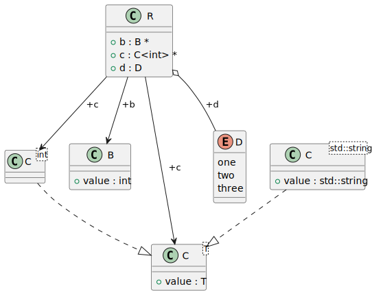

# t00091 - Declaration forwarding test case
## Config
```yaml
diagrams:
  t00091_class:
    type: class
    glob:
      - t00091_a.cc
      - t00091_b.cc
    include:
      namespaces:
        - clanguml::t00091
    using_namespace: clanguml::t00091
```
## Source code
File `tests/t00091/t00091_b.cc`
```cpp
#include <string>

namespace clanguml::t00091 {
struct B {
    int value;
};

template <class T> struct C {
    T value;
};

template <> struct C<std::string> {
    std::string value;
};

enum class D { one, two, three };
} // namespace clanguml::t00091
```
File `tests/t00091/t00091_a.cc`
```cpp
#include <string>

namespace clanguml::t00091 {
struct B;

template <class T> struct C;

template <> struct C<std::string>;

enum class D;

struct R {
    B *b;
    C<int> *c;
    D d;
};
} // namespace clanguml::t00091
```
## Generated PlantUML diagrams

## Generated Mermaid diagrams

## Generated JSON models
```json
{
  "diagram_type": "class",
  "elements": [
    {
      "bases": [],
      "display_name": "C<int>",
      "id": "14004321330474747031",
      "is_abstract": false,
      "is_nested": false,
      "is_struct": false,
      "is_template": true,
      "is_union": false,
      "members": [],
      "methods": [],
      "name": "C",
      "namespace": "clanguml::t00091",
      "source_location": {
        "column": 27,
        "file": "t00091_a.cc",
        "line": 6,
        "translation_unit": "t00091_a.cc"
      },
      "template_parameters": [
        {
          "is_variadic": false,
          "kind": "argument",
          "template_parameters": [],
          "type": "int"
        }
      ],
      "type": "class"
    },
    {
      "bases": [],
      "display_name": "R",
      "id": "4395057946988234582",
      "is_abstract": false,
      "is_nested": false,
      "is_struct": true,
      "is_template": false,
      "is_union": false,
      "members": [
        {
          "access": "public",
          "is_static": false,
          "name": "b",
          "source_location": {
            "column": 8,
            "file": "t00091_a.cc",
            "line": 13,
            "translation_unit": "t00091_a.cc"
          },
          "type": "B *"
        },
        {
          "access": "public",
          "is_static": false,
          "name": "c",
          "source_location": {
            "column": 13,
            "file": "t00091_a.cc",
            "line": 14,
            "translation_unit": "t00091_a.cc"
          },
          "type": "C<int> *"
        },
        {
          "access": "public",
          "is_static": false,
          "name": "d",
          "source_location": {
            "column": 7,
            "file": "t00091_a.cc",
            "line": 15,
            "translation_unit": "t00091_a.cc"
          },
          "type": "D"
        }
      ],
      "methods": [],
      "name": "R",
      "namespace": "clanguml::t00091",
      "source_location": {
        "column": 8,
        "file": "t00091_a.cc",
        "line": 12,
        "translation_unit": "t00091_a.cc"
      },
      "template_parameters": [],
      "type": "class"
    },
    {
      "bases": [],
      "display_name": "B",
      "id": "1644324341215065269",
      "is_abstract": false,
      "is_nested": false,
      "is_struct": true,
      "is_template": false,
      "is_union": false,
      "members": [
        {
          "access": "public",
          "is_static": false,
          "name": "value",
          "source_location": {
            "column": 9,
            "file": "t00091_b.cc",
            "line": 5,
            "translation_unit": "t00091_b.cc"
          },
          "type": "int"
        }
      ],
      "methods": [],
      "name": "B",
      "namespace": "clanguml::t00091",
      "source_location": {
        "column": 8,
        "file": "t00091_a.cc",
        "line": 4,
        "translation_unit": "t00091_a.cc"
      },
      "template_parameters": [],
      "type": "class"
    },
    {
      "bases": [],
      "display_name": "C<T>",
      "id": "7703295850668400795",
      "is_abstract": false,
      "is_nested": false,
      "is_struct": true,
      "is_template": true,
      "is_union": false,
      "members": [
        {
          "access": "public",
          "is_static": false,
          "name": "value",
          "source_location": {
            "column": 7,
            "file": "t00091_b.cc",
            "line": 9,
            "translation_unit": "t00091_b.cc"
          },
          "type": "T"
        }
      ],
      "methods": [],
      "name": "C",
      "namespace": "clanguml::t00091",
      "source_location": {
        "column": 27,
        "file": "t00091_a.cc",
        "line": 6,
        "translation_unit": "t00091_a.cc"
      },
      "template_parameters": [
        {
          "is_variadic": false,
          "kind": "template_type",
          "name": "T",
          "template_parameters": []
        }
      ],
      "type": "class"
    },
    {
      "bases": [],
      "display_name": "C<std::string>",
      "id": "8046227163819827386",
      "is_abstract": false,
      "is_nested": false,
      "is_struct": true,
      "is_template": true,
      "is_union": false,
      "members": [
        {
          "access": "public",
          "is_static": false,
          "name": "value",
          "source_location": {
            "column": 17,
            "file": "t00091_b.cc",
            "line": 13,
            "translation_unit": "t00091_b.cc"
          },
          "type": "std::string"
        }
      ],
      "methods": [],
      "name": "C",
      "namespace": "clanguml::t00091",
      "source_location": {
        "column": 20,
        "file": "t00091_a.cc",
        "line": 8,
        "translation_unit": "t00091_a.cc"
      },
      "template_parameters": [
        {
          "is_variadic": false,
          "kind": "argument",
          "template_parameters": [],
          "type": "std::string"
        }
      ],
      "type": "class"
    },
    {
      "constants": [],
      "display_name": "D",
      "id": "102424238946985412",
      "is_nested": false,
      "name": "D",
      "namespace": "clanguml::t00091",
      "source_location": {
        "column": 12,
        "file": "t00091_a.cc",
        "line": 10,
        "translation_unit": "t00091_a.cc"
      },
      "type": "enum"
    }
  ],
  "name": "t00091_class",
  "package_type": "namespace",
  "relationships": [
    {
      "access": "public",
      "destination": "7703295850668400795",
      "source": "14004321330474747031",
      "type": "instantiation"
    },
    {
      "access": "public",
      "destination": "1644324341215065269",
      "label": "b",
      "source": "4395057946988234582",
      "type": "association"
    },
    {
      "access": "public",
      "destination": "14004321330474747031",
      "label": "c",
      "source": "4395057946988234582",
      "type": "association"
    },
    {
      "access": "public",
      "destination": "7703295850668400795",
      "label": "c",
      "source": "4395057946988234582",
      "type": "association"
    },
    {
      "access": "public",
      "destination": "102424238946985412",
      "label": "d",
      "source": "4395057946988234582",
      "type": "aggregation"
    },
    {
      "access": "public",
      "destination": "7703295850668400795",
      "source": "8046227163819827386",
      "type": "instantiation"
    }
  ],
  "using_namespace": "clanguml::t00091"
}
```
## Generated GraphML models
```xml
<?xml version="1.0"?>
<graphml xmlns="http://graphml.graphdrawing.org/xmlns" xmlns:xsi="http://www.w3.org/2001/XMLSchema-instance" xsi:schemaLocation="http://graphml.graphdrawing.org/xmlns http://graphml.graphdrawing.org/xmlns/1.0/graphml.xsd">
 <key attr.name="id" attr.type="string" for="graph" id="gd0" />
 <key attr.name="diagram_type" attr.type="string" for="graph" id="gd1" />
 <key attr.name="name" attr.type="string" for="graph" id="gd2" />
 <key attr.name="using_namespace" attr.type="string" for="graph" id="gd3" />
 <key attr.name="id" attr.type="string" for="node" id="nd0" />
 <key attr.name="type" attr.type="string" for="node" id="nd1" />
 <key attr.name="name" attr.type="string" for="node" id="nd2" />
 <key attr.name="stereotype" attr.type="string" for="node" id="nd3" />
 <key attr.name="url" attr.type="string" for="node" id="nd4" />
 <key attr.name="tooltip" attr.type="string" for="node" id="nd5" />
 <key attr.name="is_template" attr.type="boolean" for="node" id="nd6" />
 <key attr.name="type" attr.type="string" for="edge" id="ed0" />
 <key attr.name="access" attr.type="string" for="edge" id="ed1" />
 <key attr.name="label" attr.type="string" for="edge" id="ed2" />
 <key attr.name="url" attr.type="string" for="edge" id="ed3" />
 <graph id="g0" edgedefault="directed" parse.nodeids="canonical" parse.edgeids="canonical" parse.order="nodesfirst">
  <data key="gd3">clanguml::t00091</data>
  <node id="n0">
   <data key="nd1">class</data>
   <data key="nd2"><![CDATA[C<int>]]></data>
   <data key="nd6">true</data>
  </node>
  <node id="n1">
   <data key="nd1">class</data>
   <data key="nd2"><![CDATA[R]]></data>
   <data key="nd6">false</data>
  </node>
  <node id="n2">
   <data key="nd1">class</data>
   <data key="nd2"><![CDATA[B]]></data>
   <data key="nd6">false</data>
  </node>
  <node id="n3">
   <data key="nd1">class</data>
   <data key="nd2"><![CDATA[C<T>]]></data>
   <data key="nd6">true</data>
  </node>
  <node id="n4">
   <data key="nd1">class</data>
   <data key="nd2"><![CDATA[C<std::string>]]></data>
   <data key="nd6">true</data>
  </node>
  <node id="n5">
   <data key="nd1">enum</data>
   <data key="nd2"><![CDATA[D]]></data>
  </node>
  <edge id="e0" source="n0" target="n3">
   <data key="ed0">instantiation</data>
   <data key="ed1">public</data>
  </edge>
  <edge id="e1" source="n1" target="n2">
   <data key="ed0">association</data>
   <data key="ed2">b</data>
   <data key="ed1">public</data>
  </edge>
  <edge id="e2" source="n1" target="n0">
   <data key="ed0">association</data>
   <data key="ed2">c</data>
   <data key="ed1">public</data>
  </edge>
  <edge id="e3" source="n1" target="n3">
   <data key="ed0">association</data>
   <data key="ed2">c</data>
   <data key="ed1">public</data>
  </edge>
  <edge id="e4" source="n1" target="n5">
   <data key="ed0">aggregation</data>
   <data key="ed2">d</data>
   <data key="ed1">public</data>
  </edge>
  <edge id="e5" source="n4" target="n3">
   <data key="ed0">instantiation</data>
   <data key="ed1">public</data>
  </edge>
 </graph>
</graphml>

```
