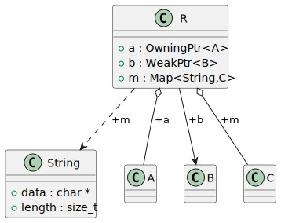

# t00092 - Test case for relationship_hints config option
## Config
```yaml
diagrams:
  t00092_class:
    type: class
    glob:
      - t00092.cc
    include:
      namespaces:
        - clanguml::t00092
    exclude:
      elements:
        - r: "clanguml::t00092::OwningPtr.*"
        - r: "clanguml::t00092::WeakPtr.*"
        - r: "clanguml::t00092::Map.*"
    relationship_hints:
      clanguml::t00092::OwningPtr: aggregation
      clanguml::t00092::WeakPtr: association
      clanguml::t00092::Map:
        default: association
        0: dependency
        1: aggregation
    using_namespace: clanguml::t00092
```
## Source code
File `tests/t00092/t00092.cc`
```cpp
#include <cstddef>
#include <map>

namespace clanguml::t00092 {

template <typename T> struct OwningPtr {
    T *ptr;
};

template <typename T> struct WeakPtr {
    T *ptr;
};

struct String {
    char *data;
    size_t length;
};

template <typename K, typename V> struct Map {
    std::map<K, V> map;
};

class A { };

class B { };

class C { };

class R {
public:
    OwningPtr<A> a;
    WeakPtr<B> b;
    Map<String, C> m;
};
} // namespace clanguml::t00092

```
## Generated PlantUML diagrams

## Generated Mermaid diagrams

## Generated JSON models
```json
{
  "diagram_type": "class",
  "elements": [
    {
      "bases": [],
      "display_name": "String",
      "id": "3653897770067065487",
      "is_abstract": false,
      "is_nested": false,
      "is_struct": true,
      "is_template": false,
      "is_union": false,
      "members": [
        {
          "access": "public",
          "is_static": false,
          "name": "data",
          "source_location": {
            "column": 11,
            "file": "t00092.cc",
            "line": 15,
            "translation_unit": "t00092.cc"
          },
          "type": "char *"
        },
        {
          "access": "public",
          "is_static": false,
          "name": "length",
          "source_location": {
            "column": 12,
            "file": "t00092.cc",
            "line": 16,
            "translation_unit": "t00092.cc"
          },
          "type": "size_t"
        }
      ],
      "methods": [],
      "name": "String",
      "namespace": "clanguml::t00092",
      "source_location": {
        "column": 8,
        "file": "t00092.cc",
        "line": 14,
        "translation_unit": "t00092.cc"
      },
      "template_parameters": [],
      "type": "class"
    },
    {
      "bases": [],
      "display_name": "A",
      "id": "611725202458589658",
      "is_abstract": false,
      "is_nested": false,
      "is_struct": false,
      "is_template": false,
      "is_union": false,
      "members": [],
      "methods": [],
      "name": "A",
      "namespace": "clanguml::t00092",
      "source_location": {
        "column": 7,
        "file": "t00092.cc",
        "line": 23,
        "translation_unit": "t00092.cc"
      },
      "template_parameters": [],
      "type": "class"
    },
    {
      "bases": [],
      "display_name": "B",
      "id": "3521217614773889206",
      "is_abstract": false,
      "is_nested": false,
      "is_struct": false,
      "is_template": false,
      "is_union": false,
      "members": [],
      "methods": [],
      "name": "B",
      "namespace": "clanguml::t00092",
      "source_location": {
        "column": 7,
        "file": "t00092.cc",
        "line": 25,
        "translation_unit": "t00092.cc"
      },
      "template_parameters": [],
      "type": "class"
    },
    {
      "bases": [],
      "display_name": "C",
      "id": "2783987908064225198",
      "is_abstract": false,
      "is_nested": false,
      "is_struct": false,
      "is_template": false,
      "is_union": false,
      "members": [],
      "methods": [],
      "name": "C",
      "namespace": "clanguml::t00092",
      "source_location": {
        "column": 7,
        "file": "t00092.cc",
        "line": 27,
        "translation_unit": "t00092.cc"
      },
      "template_parameters": [],
      "type": "class"
    },
    {
      "bases": [],
      "display_name": "R",
      "id": "3366051692360576668",
      "is_abstract": false,
      "is_nested": false,
      "is_struct": false,
      "is_template": false,
      "is_union": false,
      "members": [
        {
          "access": "public",
          "is_static": false,
          "name": "a",
          "source_location": {
            "column": 18,
            "file": "t00092.cc",
            "line": 31,
            "translation_unit": "t00092.cc"
          },
          "type": "OwningPtr<A>"
        },
        {
          "access": "public",
          "is_static": false,
          "name": "b",
          "source_location": {
            "column": 16,
            "file": "t00092.cc",
            "line": 32,
            "translation_unit": "t00092.cc"
          },
          "type": "WeakPtr<B>"
        },
        {
          "access": "public",
          "is_static": false,
          "name": "m",
          "source_location": {
            "column": 20,
            "file": "t00092.cc",
            "line": 33,
            "translation_unit": "t00092.cc"
          },
          "type": "Map<String,C>"
        }
      ],
      "methods": [],
      "name": "R",
      "namespace": "clanguml::t00092",
      "source_location": {
        "column": 7,
        "file": "t00092.cc",
        "line": 29,
        "translation_unit": "t00092.cc"
      },
      "template_parameters": [],
      "type": "class"
    }
  ],
  "name": "t00092_class",
  "package_type": "namespace",
  "relationships": [
    {
      "access": "public",
      "destination": "611725202458589658",
      "label": "a",
      "source": "3366051692360576668",
      "type": "aggregation"
    },
    {
      "access": "public",
      "destination": "3521217614773889206",
      "label": "b",
      "source": "3366051692360576668",
      "type": "association"
    },
    {
      "access": "public",
      "destination": "3653897770067065487",
      "label": "m",
      "source": "3366051692360576668",
      "type": "dependency"
    },
    {
      "access": "public",
      "destination": "2783987908064225198",
      "label": "m",
      "source": "3366051692360576668",
      "type": "aggregation"
    }
  ],
  "using_namespace": "clanguml::t00092"
}
```
## Generated GraphML models
```xml
<?xml version="1.0"?>
<graphml xmlns="http://graphml.graphdrawing.org/xmlns" xmlns:xsi="http://www.w3.org/2001/XMLSchema-instance" xsi:schemaLocation="http://graphml.graphdrawing.org/xmlns http://graphml.graphdrawing.org/xmlns/1.0/graphml.xsd">
 <key attr.name="id" attr.type="string" for="graph" id="gd0" />
 <key attr.name="diagram_type" attr.type="string" for="graph" id="gd1" />
 <key attr.name="name" attr.type="string" for="graph" id="gd2" />
 <key attr.name="using_namespace" attr.type="string" for="graph" id="gd3" />
 <key attr.name="id" attr.type="string" for="node" id="nd0" />
 <key attr.name="type" attr.type="string" for="node" id="nd1" />
 <key attr.name="name" attr.type="string" for="node" id="nd2" />
 <key attr.name="stereotype" attr.type="string" for="node" id="nd3" />
 <key attr.name="url" attr.type="string" for="node" id="nd4" />
 <key attr.name="tooltip" attr.type="string" for="node" id="nd5" />
 <key attr.name="is_template" attr.type="boolean" for="node" id="nd6" />
 <key attr.name="type" attr.type="string" for="edge" id="ed0" />
 <key attr.name="access" attr.type="string" for="edge" id="ed1" />
 <key attr.name="label" attr.type="string" for="edge" id="ed2" />
 <key attr.name="url" attr.type="string" for="edge" id="ed3" />
 <graph id="g0" edgedefault="directed" parse.nodeids="canonical" parse.edgeids="canonical" parse.order="nodesfirst">
  <data key="gd3">clanguml::t00092</data>
  <node id="n0">
   <data key="nd1">class</data>
   <data key="nd2"><![CDATA[String]]></data>
   <data key="nd6">false</data>
  </node>
  <node id="n1">
   <data key="nd1">class</data>
   <data key="nd2"><![CDATA[A]]></data>
   <data key="nd6">false</data>
  </node>
  <node id="n2">
   <data key="nd1">class</data>
   <data key="nd2"><![CDATA[B]]></data>
   <data key="nd6">false</data>
  </node>
  <node id="n3">
   <data key="nd1">class</data>
   <data key="nd2"><![CDATA[C]]></data>
   <data key="nd6">false</data>
  </node>
  <node id="n4">
   <data key="nd1">class</data>
   <data key="nd2"><![CDATA[R]]></data>
   <data key="nd6">false</data>
  </node>
  <edge id="e0" source="n4" target="n1">
   <data key="ed0">aggregation</data>
   <data key="ed2">a</data>
   <data key="ed1">public</data>
  </edge>
  <edge id="e1" source="n4" target="n2">
   <data key="ed0">association</data>
   <data key="ed2">b</data>
   <data key="ed1">public</data>
  </edge>
  <edge id="e2" source="n4" target="n0">
   <data key="ed0">dependency</data>
   <data key="ed2">m</data>
   <data key="ed1">public</data>
  </edge>
  <edge id="e3" source="n4" target="n3">
   <data key="ed0">aggregation</data>
   <data key="ed2">m</data>
   <data key="ed1">public</data>
  </edge>
 </graph>
</graphml>

```
