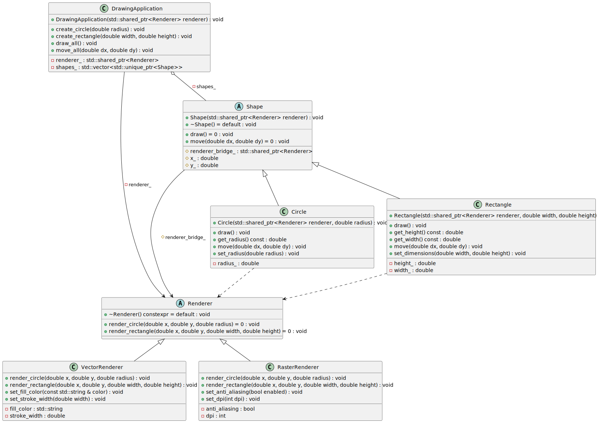

# t00093 - Test case for bridge design pattern
## Config
```yaml
diagrams:
  t00093_class:
    type: class
    glob:
      - t00093.cc
    include:
      namespaces:
        - clanguml::t00093
    using_namespace: clanguml::t00093
```
## Source code
File `tests/t00093/t00093.cc`
```cpp
#include <memory>
#include <string>
#include <vector>

namespace clanguml {
namespace t00093 {

class Renderer {
public:
    virtual ~Renderer() = default;
    virtual void render_circle(double x, double y, double radius) = 0;
    virtual void render_rectangle(
        double x, double y, double width, double height) = 0;
};

class VectorRenderer : public Renderer {
public:
    void render_circle(double x, double y, double radius) override { }
    void render_rectangle(
        double x, double y, double width, double height) override
    {
    }

    void set_stroke_width(double width) { stroke_width = width; }
    void set_fill_color(const std::string &color) { fill_color = color; }

private:
    double stroke_width{1.0};
    std::string fill_color{"black"};
};

class RasterRenderer : public Renderer {
public:
    void render_circle(double x, double y, double radius) override { }
    void render_rectangle(
        double x, double y, double width, double height) override
    {
    }

    void set_dpi(int dpi) { this->dpi = dpi; }
    void set_anti_aliasing(bool enabled) { anti_aliasing = enabled; }

private:
    int dpi{72};
    bool anti_aliasing{true};
};

class Shape {
public:
    explicit Shape(std::shared_ptr<Renderer> renderer)
        : renderer_bridge_(std::move(renderer))
    {
    }

    virtual ~Shape() = default;
    virtual void draw() = 0;
    virtual void move(double dx, double dy) = 0;

protected:
    std::shared_ptr<Renderer> renderer_bridge_;
    double x_{0.0};
    double y_{0.0};
};

class Circle : public Shape {
public:
    Circle(std::shared_ptr<Renderer> renderer, double radius)
        : Shape(std::move(renderer))
        , radius_(radius)
    {
    }

    void draw() override { renderer_bridge_->render_circle(x_, y_, radius_); }

    void move(double dx, double dy) override
    {
        x_ += dx;
        y_ += dy;
    }

    void set_radius(double radius) { radius_ = radius; }
    double get_radius() const { return radius_; }

private:
    double radius_;
};

class Rectangle : public Shape {
public:
    Rectangle(std::shared_ptr<Renderer> renderer, double width, double height)
        : Shape(std::move(renderer))
        , width_(width)
        , height_(height)
    {
    }

    void draw() override
    {
        renderer_bridge_->render_rectangle(x_, y_, width_, height_);
    }

    void move(double dx, double dy) override
    {
        x_ += dx;
        y_ += dy;
    }

    void set_dimensions(double width, double height)
    {
        width_ = width;
        height_ = height;
    }

    double get_width() const { return width_; }
    double get_height() const { return height_; }

private:
    double width_;
    double height_;
};

class DrawingApplication {
public:
    DrawingApplication(std::shared_ptr<Renderer> renderer)
        : renderer_(std::move(renderer))
    {
    }

    void create_circle(double radius)
    {
        auto circle = std::make_unique<Circle>(renderer_, radius);
        shapes_.push_back(std::move(circle));
    }

    void create_rectangle(double width, double height)
    {
        auto rectangle = std::make_unique<Rectangle>(renderer_, width, height);
        shapes_.push_back(std::move(rectangle));
    }

    void draw_all()
    {
        for (const auto &shape : shapes_) {
            shape->draw();
        }
    }

    void move_all(double dx, double dy)
    {
        for (const auto &shape : shapes_) {
            shape->move(dx, dy);
        }
    }

private:
    std::shared_ptr<Renderer> renderer_;
    std::vector<std::unique_ptr<Shape>> shapes_;
};

} // namespace t00093
} // namespace clanguml
```
## Generated PlantUML diagrams

## Generated Mermaid diagrams

## Generated JSON models
```json
{
  "diagram_type": "class",
  "elements": [
    {
      "bases": [],
      "display_name": "Renderer",
      "id": "7515812632800921463",
      "is_abstract": true,
      "is_nested": false,
      "is_struct": false,
      "is_template": false,
      "is_union": false,
      "members": [],
      "methods": [
        {
          "access": "public",
          "display_name": "~Renderer",
          "is_const": false,
          "is_consteval": false,
          "is_constexpr": true,
          "is_constructor": false,
          "is_copy_assignment": false,
          "is_coroutine": false,
          "is_defaulted": true,
          "is_deleted": false,
          "is_move_assignment": false,
          "is_noexcept": false,
          "is_operator": false,
          "is_pure_virtual": false,
          "is_static": false,
          "is_virtual": true,
          "name": "~Renderer",
          "parameters": [],
          "source_location": {
            "column": 13,
            "file": "t00093.cc",
            "line": 10,
            "translation_unit": "t00093.cc"
          },
          "template_parameters": [],
          "type": "void"
        },
        {
          "access": "public",
          "display_name": "render_circle",
          "is_const": false,
          "is_consteval": false,
          "is_constexpr": false,
          "is_constructor": false,
          "is_copy_assignment": false,
          "is_coroutine": false,
          "is_defaulted": false,
          "is_deleted": false,
          "is_move_assignment": false,
          "is_noexcept": false,
          "is_operator": false,
          "is_pure_virtual": true,
          "is_static": false,
          "is_virtual": true,
          "name": "render_circle",
          "parameters": [
            {
              "name": "x",
              "type": "double"
            },
            {
              "name": "y",
              "type": "double"
            },
            {
              "name": "radius",
              "type": "double"
            }
          ],
          "source_location": {
            "column": 18,
            "file": "t00093.cc",
            "line": 11,
            "translation_unit": "t00093.cc"
          },
          "template_parameters": [],
          "type": "void"
        },
        {
          "access": "public",
          "display_name": "render_rectangle",
          "is_const": false,
          "is_consteval": false,
          "is_constexpr": false,
          "is_constructor": false,
          "is_copy_assignment": false,
          "is_coroutine": false,
          "is_defaulted": false,
          "is_deleted": false,
          "is_move_assignment": false,
          "is_noexcept": false,
          "is_operator": false,
          "is_pure_virtual": true,
          "is_static": false,
          "is_virtual": true,
          "name": "render_rectangle",
          "parameters": [
            {
              "name": "x",
              "type": "double"
            },
            {
              "name": "y",
              "type": "double"
            },
            {
              "name": "width",
              "type": "double"
            },
            {
              "name": "height",
              "type": "double"
            }
          ],
          "source_location": {
            "column": 18,
            "file": "t00093.cc",
            "line": 12,
            "translation_unit": "t00093.cc"
          },
          "template_parameters": [],
          "type": "void"
        }
      ],
      "name": "Renderer",
      "namespace": "clanguml::t00093",
      "source_location": {
        "column": 7,
        "file": "t00093.cc",
        "line": 8,
        "translation_unit": "t00093.cc"
      },
      "template_parameters": [],
      "type": "class"
    },
    {
      "bases": [
        {
          "access": "public",
          "id": "7515812632800921463",
          "is_virtual": false
        }
      ],
      "display_name": "VectorRenderer",
      "id": "16028587466059689823",
      "is_abstract": false,
      "is_nested": false,
      "is_struct": false,
      "is_template": false,
      "is_union": false,
      "members": [
        {
          "access": "private",
          "is_static": false,
          "name": "stroke_width",
          "source_location": {
            "column": 12,
            "file": "t00093.cc",
            "line": 28,
            "translation_unit": "t00093.cc"
          },
          "type": "double"
        },
        {
          "access": "private",
          "is_static": false,
          "name": "fill_color",
          "source_location": {
            "column": 17,
            "file": "t00093.cc",
            "line": 29,
            "translation_unit": "t00093.cc"
          },
          "type": "std::string"
        }
      ],
      "methods": [
        {
          "access": "public",
          "display_name": "render_circle",
          "is_const": false,
          "is_consteval": false,
          "is_constexpr": false,
          "is_constructor": false,
          "is_copy_assignment": false,
          "is_coroutine": false,
          "is_defaulted": false,
          "is_deleted": false,
          "is_move_assignment": false,
          "is_noexcept": false,
          "is_operator": false,
          "is_pure_virtual": false,
          "is_static": false,
          "is_virtual": true,
          "name": "render_circle",
          "parameters": [
            {
              "name": "x",
              "type": "double"
            },
            {
              "name": "y",
              "type": "double"
            },
            {
              "name": "radius",
              "type": "double"
            }
          ],
          "source_location": {
            "column": 10,
            "file": "t00093.cc",
            "line": 18,
            "translation_unit": "t00093.cc"
          },
          "template_parameters": [],
          "type": "void"
        },
        {
          "access": "public",
          "display_name": "render_rectangle",
          "is_const": false,
          "is_consteval": false,
          "is_constexpr": false,
          "is_constructor": false,
          "is_copy_assignment": false,
          "is_coroutine": false,
          "is_defaulted": false,
          "is_deleted": false,
          "is_move_assignment": false,
          "is_noexcept": false,
          "is_operator": false,
          "is_pure_virtual": false,
          "is_static": false,
          "is_virtual": true,
          "name": "render_rectangle",
          "parameters": [
            {
              "name": "x",
              "type": "double"
            },
            {
              "name": "y",
              "type": "double"
            },
            {
              "name": "width",
              "type": "double"
            },
            {
              "name": "height",
              "type": "double"
            }
          ],
          "source_location": {
            "column": 10,
            "file": "t00093.cc",
            "line": 19,
            "translation_unit": "t00093.cc"
          },
          "template_parameters": [],
          "type": "void"
        },
        {
          "access": "public",
          "display_name": "set_stroke_width",
          "is_const": false,
          "is_consteval": false,
          "is_constexpr": false,
          "is_constructor": false,
          "is_copy_assignment": false,
          "is_coroutine": false,
          "is_defaulted": false,
          "is_deleted": false,
          "is_move_assignment": false,
          "is_noexcept": false,
          "is_operator": false,
          "is_pure_virtual": false,
          "is_static": false,
          "is_virtual": false,
          "name": "set_stroke_width",
          "parameters": [
            {
              "name": "width",
              "type": "double"
            }
          ],
          "source_location": {
            "column": 10,
            "file": "t00093.cc",
            "line": 24,
            "translation_unit": "t00093.cc"
          },
          "template_parameters": [],
          "type": "void"
        },
        {
          "access": "public",
          "display_name": "set_fill_color",
          "is_const": false,
          "is_consteval": false,
          "is_constexpr": false,
          "is_constructor": false,
          "is_copy_assignment": false,
          "is_coroutine": false,
          "is_defaulted": false,
          "is_deleted": false,
          "is_move_assignment": false,
          "is_noexcept": false,
          "is_operator": false,
          "is_pure_virtual": false,
          "is_static": false,
          "is_virtual": false,
          "name": "set_fill_color",
          "parameters": [
            {
              "name": "color",
              "type": "const std::string &"
            }
          ],
          "source_location": {
            "column": 10,
            "file": "t00093.cc",
            "line": 25,
            "translation_unit": "t00093.cc"
          },
          "template_parameters": [],
          "type": "void"
        }
      ],
      "name": "VectorRenderer",
      "namespace": "clanguml::t00093",
      "source_location": {
        "column": 7,
        "file": "t00093.cc",
        "line": 16,
        "translation_unit": "t00093.cc"
      },
      "template_parameters": [],
      "type": "class"
    },
    {
      "bases": [
        {
          "access": "public",
          "id": "7515812632800921463",
          "is_virtual": false
        }
      ],
      "display_name": "RasterRenderer",
      "id": "8868095716427291368",
      "is_abstract": false,
      "is_nested": false,
      "is_struct": false,
      "is_template": false,
      "is_union": false,
      "members": [
        {
          "access": "private",
          "is_static": false,
          "name": "dpi",
          "source_location": {
            "column": 9,
            "file": "t00093.cc",
            "line": 44,
            "translation_unit": "t00093.cc"
          },
          "type": "int"
        },
        {
          "access": "private",
          "is_static": false,
          "name": "anti_aliasing",
          "source_location": {
            "column": 10,
            "file": "t00093.cc",
            "line": 45,
            "translation_unit": "t00093.cc"
          },
          "type": "bool"
        }
      ],
      "methods": [
        {
          "access": "public",
          "display_name": "render_circle",
          "is_const": false,
          "is_consteval": false,
          "is_constexpr": false,
          "is_constructor": false,
          "is_copy_assignment": false,
          "is_coroutine": false,
          "is_defaulted": false,
          "is_deleted": false,
          "is_move_assignment": false,
          "is_noexcept": false,
          "is_operator": false,
          "is_pure_virtual": false,
          "is_static": false,
          "is_virtual": true,
          "name": "render_circle",
          "parameters": [
            {
              "name": "x",
              "type": "double"
            },
            {
              "name": "y",
              "type": "double"
            },
            {
              "name": "radius",
              "type": "double"
            }
          ],
          "source_location": {
            "column": 10,
            "file": "t00093.cc",
            "line": 34,
            "translation_unit": "t00093.cc"
          },
          "template_parameters": [],
          "type": "void"
        },
        {
          "access": "public",
          "display_name": "render_rectangle",
          "is_const": false,
          "is_consteval": false,
          "is_constexpr": false,
          "is_constructor": false,
          "is_copy_assignment": false,
          "is_coroutine": false,
          "is_defaulted": false,
          "is_deleted": false,
          "is_move_assignment": false,
          "is_noexcept": false,
          "is_operator": false,
          "is_pure_virtual": false,
          "is_static": false,
          "is_virtual": true,
          "name": "render_rectangle",
          "parameters": [
            {
              "name": "x",
              "type": "double"
            },
            {
              "name": "y",
              "type": "double"
            },
            {
              "name": "width",
              "type": "double"
            },
            {
              "name": "height",
              "type": "double"
            }
          ],
          "source_location": {
            "column": 10,
            "file": "t00093.cc",
            "line": 35,
            "translation_unit": "t00093.cc"
          },
          "template_parameters": [],
          "type": "void"
        },
        {
          "access": "public",
          "display_name": "set_dpi",
          "is_const": false,
          "is_consteval": false,
          "is_constexpr": false,
          "is_constructor": false,
          "is_copy_assignment": false,
          "is_coroutine": false,
          "is_defaulted": false,
          "is_deleted": false,
          "is_move_assignment": false,
          "is_noexcept": false,
          "is_operator": false,
          "is_pure_virtual": false,
          "is_static": false,
          "is_virtual": false,
          "name": "set_dpi",
          "parameters": [
            {
              "name": "dpi",
              "type": "int"
            }
          ],
          "source_location": {
            "column": 10,
            "file": "t00093.cc",
            "line": 40,
            "translation_unit": "t00093.cc"
          },
          "template_parameters": [],
          "type": "void"
        },
        {
          "access": "public",
          "display_name": "set_anti_aliasing",
          "is_const": false,
          "is_consteval": false,
          "is_constexpr": false,
          "is_constructor": false,
          "is_copy_assignment": false,
          "is_coroutine": false,
          "is_defaulted": false,
          "is_deleted": false,
          "is_move_assignment": false,
          "is_noexcept": false,
          "is_operator": false,
          "is_pure_virtual": false,
          "is_static": false,
          "is_virtual": false,
          "name": "set_anti_aliasing",
          "parameters": [
            {
              "name": "enabled",
              "type": "bool"
            }
          ],
          "source_location": {
            "column": 10,
            "file": "t00093.cc",
            "line": 41,
            "translation_unit": "t00093.cc"
          },
          "template_parameters": [],
          "type": "void"
        }
      ],
      "name": "RasterRenderer",
      "namespace": "clanguml::t00093",
      "source_location": {
        "column": 7,
        "file": "t00093.cc",
        "line": 32,
        "translation_unit": "t00093.cc"
      },
      "template_parameters": [],
      "type": "class"
    },
    {
      "bases": [],
      "display_name": "Shape",
      "id": "15822342402667944661",
      "is_abstract": true,
      "is_nested": false,
      "is_struct": false,
      "is_template": false,
      "is_union": false,
      "members": [
        {
          "access": "protected",
          "is_static": false,
          "name": "renderer_bridge_",
          "source_location": {
            "column": 31,
            "file": "t00093.cc",
            "line": 60,
            "translation_unit": "t00093.cc"
          },
          "type": "std::shared_ptr<Renderer>"
        },
        {
          "access": "protected",
          "is_static": false,
          "name": "x_",
          "source_location": {
            "column": 12,
            "file": "t00093.cc",
            "line": 61,
            "translation_unit": "t00093.cc"
          },
          "type": "double"
        },
        {
          "access": "protected",
          "is_static": false,
          "name": "y_",
          "source_location": {
            "column": 12,
            "file": "t00093.cc",
            "line": 62,
            "translation_unit": "t00093.cc"
          },
          "type": "double"
        }
      ],
      "methods": [
        {
          "access": "public",
          "display_name": "Shape",
          "is_const": false,
          "is_consteval": false,
          "is_constexpr": false,
          "is_constructor": true,
          "is_copy_assignment": false,
          "is_coroutine": false,
          "is_defaulted": false,
          "is_deleted": false,
          "is_move_assignment": false,
          "is_noexcept": false,
          "is_operator": false,
          "is_pure_virtual": false,
          "is_static": false,
          "is_virtual": false,
          "name": "Shape",
          "parameters": [
            {
              "name": "renderer",
              "type": "std::shared_ptr<Renderer>"
            }
          ],
          "source_location": {
            "column": 14,
            "file": "t00093.cc",
            "line": 50,
            "translation_unit": "t00093.cc"
          },
          "template_parameters": [],
          "type": "void"
        },
        {
          "access": "public",
          "display_name": "~Shape",
          "is_const": false,
          "is_consteval": false,
          "is_constexpr": false,
          "is_constructor": false,
          "is_copy_assignment": false,
          "is_coroutine": false,
          "is_defaulted": true,
          "is_deleted": false,
          "is_move_assignment": false,
          "is_noexcept": false,
          "is_operator": false,
          "is_pure_virtual": false,
          "is_static": false,
          "is_virtual": true,
          "name": "~Shape",
          "parameters": [],
          "source_location": {
            "column": 13,
            "file": "t00093.cc",
            "line": 55,
            "translation_unit": "t00093.cc"
          },
          "template_parameters": [],
          "type": "void"
        },
        {
          "access": "public",
          "display_name": "draw",
          "is_const": false,
          "is_consteval": false,
          "is_constexpr": false,
          "is_constructor": false,
          "is_copy_assignment": false,
          "is_coroutine": false,
          "is_defaulted": false,
          "is_deleted": false,
          "is_move_assignment": false,
          "is_noexcept": false,
          "is_operator": false,
          "is_pure_virtual": true,
          "is_static": false,
          "is_virtual": true,
          "name": "draw",
          "parameters": [],
          "source_location": {
            "column": 18,
            "file": "t00093.cc",
            "line": 56,
            "translation_unit": "t00093.cc"
          },
          "template_parameters": [],
          "type": "void"
        },
        {
          "access": "public",
          "display_name": "move",
          "is_const": false,
          "is_consteval": false,
          "is_constexpr": false,
          "is_constructor": false,
          "is_copy_assignment": false,
          "is_coroutine": false,
          "is_defaulted": false,
          "is_deleted": false,
          "is_move_assignment": false,
          "is_noexcept": false,
          "is_operator": false,
          "is_pure_virtual": true,
          "is_static": false,
          "is_virtual": true,
          "name": "move",
          "parameters": [
            {
              "name": "dx",
              "type": "double"
            },
            {
              "name": "dy",
              "type": "double"
            }
          ],
          "source_location": {
            "column": 18,
            "file": "t00093.cc",
            "line": 57,
            "translation_unit": "t00093.cc"
          },
          "template_parameters": [],
          "type": "void"
        }
      ],
      "name": "Shape",
      "namespace": "clanguml::t00093",
      "source_location": {
        "column": 7,
        "file": "t00093.cc",
        "line": 48,
        "translation_unit": "t00093.cc"
      },
      "template_parameters": [],
      "type": "class"
    },
    {
      "bases": [
        {
          "access": "public",
          "id": "15822342402667944661",
          "is_virtual": false
        }
      ],
      "display_name": "Circle",
      "id": "15170974831419498086",
      "is_abstract": false,
      "is_nested": false,
      "is_struct": false,
      "is_template": false,
      "is_union": false,
      "members": [
        {
          "access": "private",
          "is_static": false,
          "name": "radius_",
          "source_location": {
            "column": 12,
            "file": "t00093.cc",
            "line": 85,
            "translation_unit": "t00093.cc"
          },
          "type": "double"
        }
      ],
      "methods": [
        {
          "access": "public",
          "display_name": "Circle",
          "is_const": false,
          "is_consteval": false,
          "is_constexpr": false,
          "is_constructor": true,
          "is_copy_assignment": false,
          "is_coroutine": false,
          "is_defaulted": false,
          "is_deleted": false,
          "is_move_assignment": false,
          "is_noexcept": false,
          "is_operator": false,
          "is_pure_virtual": false,
          "is_static": false,
          "is_virtual": false,
          "name": "Circle",
          "parameters": [
            {
              "name": "renderer",
              "type": "std::shared_ptr<Renderer>"
            },
            {
              "name": "radius",
              "type": "double"
            }
          ],
          "source_location": {
            "column": 5,
            "file": "t00093.cc",
            "line": 67,
            "translation_unit": "t00093.cc"
          },
          "template_parameters": [],
          "type": "void"
        },
        {
          "access": "public",
          "display_name": "draw",
          "is_const": false,
          "is_consteval": false,
          "is_constexpr": false,
          "is_constructor": false,
          "is_copy_assignment": false,
          "is_coroutine": false,
          "is_defaulted": false,
          "is_deleted": false,
          "is_move_assignment": false,
          "is_noexcept": false,
          "is_operator": false,
          "is_pure_virtual": false,
          "is_static": false,
          "is_virtual": true,
          "name": "draw",
          "parameters": [],
          "source_location": {
            "column": 10,
            "file": "t00093.cc",
            "line": 73,
            "translation_unit": "t00093.cc"
          },
          "template_parameters": [],
          "type": "void"
        },
        {
          "access": "public",
          "display_name": "move",
          "is_const": false,
          "is_consteval": false,
          "is_constexpr": false,
          "is_constructor": false,
          "is_copy_assignment": false,
          "is_coroutine": false,
          "is_defaulted": false,
          "is_deleted": false,
          "is_move_assignment": false,
          "is_noexcept": false,
          "is_operator": false,
          "is_pure_virtual": false,
          "is_static": false,
          "is_virtual": true,
          "name": "move",
          "parameters": [
            {
              "name": "dx",
              "type": "double"
            },
            {
              "name": "dy",
              "type": "double"
            }
          ],
          "source_location": {
            "column": 10,
            "file": "t00093.cc",
            "line": 75,
            "translation_unit": "t00093.cc"
          },
          "template_parameters": [],
          "type": "void"
        },
        {
          "access": "public",
          "display_name": "set_radius",
          "is_const": false,
          "is_consteval": false,
          "is_constexpr": false,
          "is_constructor": false,
          "is_copy_assignment": false,
          "is_coroutine": false,
          "is_defaulted": false,
          "is_deleted": false,
          "is_move_assignment": false,
          "is_noexcept": false,
          "is_operator": false,
          "is_pure_virtual": false,
          "is_static": false,
          "is_virtual": false,
          "name": "set_radius",
          "parameters": [
            {
              "name": "radius",
              "type": "double"
            }
          ],
          "source_location": {
            "column": 10,
            "file": "t00093.cc",
            "line": 81,
            "translation_unit": "t00093.cc"
          },
          "template_parameters": [],
          "type": "void"
        },
        {
          "access": "public",
          "display_name": "get_radius",
          "is_const": true,
          "is_consteval": false,
          "is_constexpr": false,
          "is_constructor": false,
          "is_copy_assignment": false,
          "is_coroutine": false,
          "is_defaulted": false,
          "is_deleted": false,
          "is_move_assignment": false,
          "is_noexcept": false,
          "is_operator": false,
          "is_pure_virtual": false,
          "is_static": false,
          "is_virtual": false,
          "name": "get_radius",
          "parameters": [],
          "source_location": {
            "column": 12,
            "file": "t00093.cc",
            "line": 82,
            "translation_unit": "t00093.cc"
          },
          "template_parameters": [],
          "type": "double"
        }
      ],
      "name": "Circle",
      "namespace": "clanguml::t00093",
      "source_location": {
        "column": 7,
        "file": "t00093.cc",
        "line": 65,
        "translation_unit": "t00093.cc"
      },
      "template_parameters": [],
      "type": "class"
    },
    {
      "bases": [
        {
          "access": "public",
          "id": "15822342402667944661",
          "is_virtual": false
        }
      ],
      "display_name": "Rectangle",
      "id": "12375550317572858605",
      "is_abstract": false,
      "is_nested": false,
      "is_struct": false,
      "is_template": false,
      "is_union": false,
      "members": [
        {
          "access": "private",
          "is_static": false,
          "name": "width_",
          "source_location": {
            "column": 12,
            "file": "t00093.cc",
            "line": 118,
            "translation_unit": "t00093.cc"
          },
          "type": "double"
        },
        {
          "access": "private",
          "is_static": false,
          "name": "height_",
          "source_location": {
            "column": 12,
            "file": "t00093.cc",
            "line": 119,
            "translation_unit": "t00093.cc"
          },
          "type": "double"
        }
      ],
      "methods": [
        {
          "access": "public",
          "display_name": "Rectangle",
          "is_const": false,
          "is_consteval": false,
          "is_constexpr": false,
          "is_constructor": true,
          "is_copy_assignment": false,
          "is_coroutine": false,
          "is_defaulted": false,
          "is_deleted": false,
          "is_move_assignment": false,
          "is_noexcept": false,
          "is_operator": false,
          "is_pure_virtual": false,
          "is_static": false,
          "is_virtual": false,
          "name": "Rectangle",
          "parameters": [
            {
              "name": "renderer",
              "type": "std::shared_ptr<Renderer>"
            },
            {
              "name": "width",
              "type": "double"
            },
            {
              "name": "height",
              "type": "double"
            }
          ],
          "source_location": {
            "column": 5,
            "file": "t00093.cc",
            "line": 90,
            "translation_unit": "t00093.cc"
          },
          "template_parameters": [],
          "type": "void"
        },
        {
          "access": "public",
          "display_name": "draw",
          "is_const": false,
          "is_consteval": false,
          "is_constexpr": false,
          "is_constructor": false,
          "is_copy_assignment": false,
          "is_coroutine": false,
          "is_defaulted": false,
          "is_deleted": false,
          "is_move_assignment": false,
          "is_noexcept": false,
          "is_operator": false,
          "is_pure_virtual": false,
          "is_static": false,
          "is_virtual": true,
          "name": "draw",
          "parameters": [],
          "source_location": {
            "column": 10,
            "file": "t00093.cc",
            "line": 97,
            "translation_unit": "t00093.cc"
          },
          "template_parameters": [],
          "type": "void"
        },
        {
          "access": "public",
          "display_name": "move",
          "is_const": false,
          "is_consteval": false,
          "is_constexpr": false,
          "is_constructor": false,
          "is_copy_assignment": false,
          "is_coroutine": false,
          "is_defaulted": false,
          "is_deleted": false,
          "is_move_assignment": false,
          "is_noexcept": false,
          "is_operator": false,
          "is_pure_virtual": false,
          "is_static": false,
          "is_virtual": true,
          "name": "move",
          "parameters": [
            {
              "name": "dx",
              "type": "double"
            },
            {
              "name": "dy",
              "type": "double"
            }
          ],
          "source_location": {
            "column": 10,
            "file": "t00093.cc",
            "line": 102,
            "translation_unit": "t00093.cc"
          },
          "template_parameters": [],
          "type": "void"
        },
        {
          "access": "public",
          "display_name": "set_dimensions",
          "is_const": false,
          "is_consteval": false,
          "is_constexpr": false,
          "is_constructor": false,
          "is_copy_assignment": false,
          "is_coroutine": false,
          "is_defaulted": false,
          "is_deleted": false,
          "is_move_assignment": false,
          "is_noexcept": false,
          "is_operator": false,
          "is_pure_virtual": false,
          "is_static": false,
          "is_virtual": false,
          "name": "set_dimensions",
          "parameters": [
            {
              "name": "width",
              "type": "double"
            },
            {
              "name": "height",
              "type": "double"
            }
          ],
          "source_location": {
            "column": 10,
            "file": "t00093.cc",
            "line": 108,
            "translation_unit": "t00093.cc"
          },
          "template_parameters": [],
          "type": "void"
        },
        {
          "access": "public",
          "display_name": "get_width",
          "is_const": true,
          "is_consteval": false,
          "is_constexpr": false,
          "is_constructor": false,
          "is_copy_assignment": false,
          "is_coroutine": false,
          "is_defaulted": false,
          "is_deleted": false,
          "is_move_assignment": false,
          "is_noexcept": false,
          "is_operator": false,
          "is_pure_virtual": false,
          "is_static": false,
          "is_virtual": false,
          "name": "get_width",
          "parameters": [],
          "source_location": {
            "column": 12,
            "file": "t00093.cc",
            "line": 114,
            "translation_unit": "t00093.cc"
          },
          "template_parameters": [],
          "type": "double"
        },
        {
          "access": "public",
          "display_name": "get_height",
          "is_const": true,
          "is_consteval": false,
          "is_constexpr": false,
          "is_constructor": false,
          "is_copy_assignment": false,
          "is_coroutine": false,
          "is_defaulted": false,
          "is_deleted": false,
          "is_move_assignment": false,
          "is_noexcept": false,
          "is_operator": false,
          "is_pure_virtual": false,
          "is_static": false,
          "is_virtual": false,
          "name": "get_height",
          "parameters": [],
          "source_location": {
            "column": 12,
            "file": "t00093.cc",
            "line": 115,
            "translation_unit": "t00093.cc"
          },
          "template_parameters": [],
          "type": "double"
        }
      ],
      "name": "Rectangle",
      "namespace": "clanguml::t00093",
      "source_location": {
        "column": 7,
        "file": "t00093.cc",
        "line": 88,
        "translation_unit": "t00093.cc"
      },
      "template_parameters": [],
      "type": "class"
    },
    {
      "bases": [],
      "display_name": "DrawingApplication",
      "id": "17095177180264382182",
      "is_abstract": false,
      "is_nested": false,
      "is_struct": false,
      "is_template": false,
      "is_union": false,
      "members": [
        {
          "access": "private",
          "is_static": false,
          "name": "renderer_",
          "source_location": {
            "column": 31,
            "file": "t00093.cc",
            "line": 156,
            "translation_unit": "t00093.cc"
          },
          "type": "std::shared_ptr<Renderer>"
        },
        {
          "access": "private",
          "is_static": false,
          "name": "shapes_",
          "source_location": {
            "column": 41,
            "file": "t00093.cc",
            "line": 157,
            "translation_unit": "t00093.cc"
          },
          "type": "std::vector<std::unique_ptr<Shape>>"
        }
      ],
      "methods": [
        {
          "access": "public",
          "display_name": "DrawingApplication",
          "is_const": false,
          "is_consteval": false,
          "is_constexpr": false,
          "is_constructor": true,
          "is_copy_assignment": false,
          "is_coroutine": false,
          "is_defaulted": false,
          "is_deleted": false,
          "is_move_assignment": false,
          "is_noexcept": false,
          "is_operator": false,
          "is_pure_virtual": false,
          "is_static": false,
          "is_virtual": false,
          "name": "DrawingApplication",
          "parameters": [
            {
              "name": "renderer",
              "type": "std::shared_ptr<Renderer>"
            }
          ],
          "source_location": {
            "column": 5,
            "file": "t00093.cc",
            "line": 124,
            "translation_unit": "t00093.cc"
          },
          "template_parameters": [],
          "type": "void"
        },
        {
          "access": "public",
          "display_name": "create_circle",
          "is_const": false,
          "is_consteval": false,
          "is_constexpr": false,
          "is_constructor": false,
          "is_copy_assignment": false,
          "is_coroutine": false,
          "is_defaulted": false,
          "is_deleted": false,
          "is_move_assignment": false,
          "is_noexcept": false,
          "is_operator": false,
          "is_pure_virtual": false,
          "is_static": false,
          "is_virtual": false,
          "name": "create_circle",
          "parameters": [
            {
              "name": "radius",
              "type": "double"
            }
          ],
          "source_location": {
            "column": 10,
            "file": "t00093.cc",
            "line": 129,
            "translation_unit": "t00093.cc"
          },
          "template_parameters": [],
          "type": "void"
        },
        {
          "access": "public",
          "display_name": "create_rectangle",
          "is_const": false,
          "is_consteval": false,
          "is_constexpr": false,
          "is_constructor": false,
          "is_copy_assignment": false,
          "is_coroutine": false,
          "is_defaulted": false,
          "is_deleted": false,
          "is_move_assignment": false,
          "is_noexcept": false,
          "is_operator": false,
          "is_pure_virtual": false,
          "is_static": false,
          "is_virtual": false,
          "name": "create_rectangle",
          "parameters": [
            {
              "name": "width",
              "type": "double"
            },
            {
              "name": "height",
              "type": "double"
            }
          ],
          "source_location": {
            "column": 10,
            "file": "t00093.cc",
            "line": 135,
            "translation_unit": "t00093.cc"
          },
          "template_parameters": [],
          "type": "void"
        },
        {
          "access": "public",
          "display_name": "draw_all",
          "is_const": false,
          "is_consteval": false,
          "is_constexpr": false,
          "is_constructor": false,
          "is_copy_assignment": false,
          "is_coroutine": false,
          "is_defaulted": false,
          "is_deleted": false,
          "is_move_assignment": false,
          "is_noexcept": false,
          "is_operator": false,
          "is_pure_virtual": false,
          "is_static": false,
          "is_virtual": false,
          "name": "draw_all",
          "parameters": [],
          "source_location": {
            "column": 10,
            "file": "t00093.cc",
            "line": 141,
            "translation_unit": "t00093.cc"
          },
          "template_parameters": [],
          "type": "void"
        },
        {
          "access": "public",
          "display_name": "move_all",
          "is_const": false,
          "is_consteval": false,
          "is_constexpr": false,
          "is_constructor": false,
          "is_copy_assignment": false,
          "is_coroutine": false,
          "is_defaulted": false,
          "is_deleted": false,
          "is_move_assignment": false,
          "is_noexcept": false,
          "is_operator": false,
          "is_pure_virtual": false,
          "is_static": false,
          "is_virtual": false,
          "name": "move_all",
          "parameters": [
            {
              "name": "dx",
              "type": "double"
            },
            {
              "name": "dy",
              "type": "double"
            }
          ],
          "source_location": {
            "column": 10,
            "file": "t00093.cc",
            "line": 148,
            "translation_unit": "t00093.cc"
          },
          "template_parameters": [],
          "type": "void"
        }
      ],
      "name": "DrawingApplication",
      "namespace": "clanguml::t00093",
      "source_location": {
        "column": 7,
        "file": "t00093.cc",
        "line": 122,
        "translation_unit": "t00093.cc"
      },
      "template_parameters": [],
      "type": "class"
    }
  ],
  "name": "t00093_class",
  "package_type": "namespace",
  "relationships": [
    {
      "access": "public",
      "destination": "7515812632800921463",
      "source": "16028587466059689823",
      "type": "extension"
    },
    {
      "access": "public",
      "destination": "7515812632800921463",
      "source": "8868095716427291368",
      "type": "extension"
    },
    {
      "access": "protected",
      "destination": "7515812632800921463",
      "label": "renderer_bridge_",
      "source": "15822342402667944661",
      "type": "association"
    },
    {
      "access": "public",
      "destination": "7515812632800921463",
      "source": "15170974831419498086",
      "type": "dependency"
    },
    {
      "access": "public",
      "destination": "15822342402667944661",
      "source": "15170974831419498086",
      "type": "extension"
    },
    {
      "access": "public",
      "destination": "7515812632800921463",
      "source": "12375550317572858605",
      "type": "dependency"
    },
    {
      "access": "public",
      "destination": "15822342402667944661",
      "source": "12375550317572858605",
      "type": "extension"
    },
    {
      "access": "private",
      "destination": "7515812632800921463",
      "label": "renderer_",
      "source": "17095177180264382182",
      "type": "association"
    },
    {
      "access": "private",
      "destination": "15822342402667944661",
      "label": "shapes_",
      "source": "17095177180264382182",
      "type": "aggregation"
    }
  ],
  "using_namespace": "clanguml::t00093"
}
```
## Generated GraphML models
```xml
<?xml version="1.0"?>
<graphml xmlns="http://graphml.graphdrawing.org/xmlns" xmlns:xsi="http://www.w3.org/2001/XMLSchema-instance" xsi:schemaLocation="http://graphml.graphdrawing.org/xmlns http://graphml.graphdrawing.org/xmlns/1.0/graphml.xsd">
 <key attr.name="id" attr.type="string" for="graph" id="gd0" />
 <key attr.name="diagram_type" attr.type="string" for="graph" id="gd1" />
 <key attr.name="name" attr.type="string" for="graph" id="gd2" />
 <key attr.name="using_namespace" attr.type="string" for="graph" id="gd3" />
 <key attr.name="id" attr.type="string" for="node" id="nd0" />
 <key attr.name="type" attr.type="string" for="node" id="nd1" />
 <key attr.name="name" attr.type="string" for="node" id="nd2" />
 <key attr.name="stereotype" attr.type="string" for="node" id="nd3" />
 <key attr.name="url" attr.type="string" for="node" id="nd4" />
 <key attr.name="tooltip" attr.type="string" for="node" id="nd5" />
 <key attr.name="is_template" attr.type="boolean" for="node" id="nd6" />
 <key attr.name="type" attr.type="string" for="edge" id="ed0" />
 <key attr.name="access" attr.type="string" for="edge" id="ed1" />
 <key attr.name="label" attr.type="string" for="edge" id="ed2" />
 <key attr.name="url" attr.type="string" for="edge" id="ed3" />
 <graph id="g0" edgedefault="directed" parse.nodeids="canonical" parse.edgeids="canonical" parse.order="nodesfirst">
  <data key="gd3">clanguml::t00093</data>
  <node id="n0">
   <data key="nd1">class</data>
   <data key="nd2"><![CDATA[Renderer]]></data>
   <data key="nd3">abstract</data>
   <data key="nd6">false</data>
  </node>
  <node id="n1">
   <data key="nd1">class</data>
   <data key="nd2"><![CDATA[VectorRenderer]]></data>
   <data key="nd6">false</data>
  </node>
  <node id="n2">
   <data key="nd1">class</data>
   <data key="nd2"><![CDATA[RasterRenderer]]></data>
   <data key="nd6">false</data>
  </node>
  <node id="n3">
   <data key="nd1">class</data>
   <data key="nd2"><![CDATA[Shape]]></data>
   <data key="nd3">abstract</data>
   <data key="nd6">false</data>
  </node>
  <node id="n4">
   <data key="nd1">class</data>
   <data key="nd2"><![CDATA[Circle]]></data>
   <data key="nd6">false</data>
  </node>
  <node id="n5">
   <data key="nd1">class</data>
   <data key="nd2"><![CDATA[Rectangle]]></data>
   <data key="nd6">false</data>
  </node>
  <node id="n6">
   <data key="nd1">class</data>
   <data key="nd2"><![CDATA[DrawingApplication]]></data>
   <data key="nd6">false</data>
  </node>
  <edge id="e0" source="n1" target="n0">
   <data key="ed0">extension</data>
   <data key="ed1">public</data>
  </edge>
  <edge id="e1" source="n2" target="n0">
   <data key="ed0">extension</data>
   <data key="ed1">public</data>
  </edge>
  <edge id="e2" source="n3" target="n0">
   <data key="ed0">association</data>
   <data key="ed2">renderer_bridge_</data>
   <data key="ed1">protected</data>
  </edge>
  <edge id="e3" source="n4" target="n0">
   <data key="ed0">dependency</data>
   <data key="ed1">public</data>
  </edge>
  <edge id="e4" source="n4" target="n3">
   <data key="ed0">extension</data>
   <data key="ed1">public</data>
  </edge>
  <edge id="e5" source="n5" target="n0">
   <data key="ed0">dependency</data>
   <data key="ed1">public</data>
  </edge>
  <edge id="e6" source="n5" target="n3">
   <data key="ed0">extension</data>
   <data key="ed1">public</data>
  </edge>
  <edge id="e7" source="n6" target="n0">
   <data key="ed0">association</data>
   <data key="ed2">renderer_</data>
   <data key="ed1">private</data>
  </edge>
  <edge id="e8" source="n6" target="n3">
   <data key="ed0">aggregation</data>
   <data key="ed2">shapes_</data>
   <data key="ed1">private</data>
  </edge>
 </graph>
</graphml>

```
