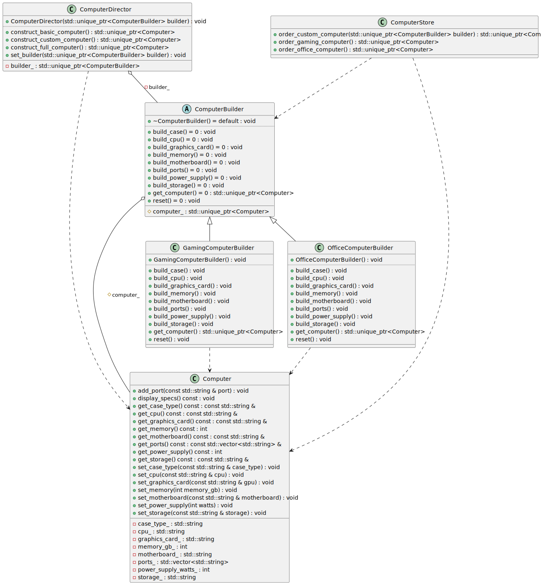

# t00094 - Test case for builder design pattern
## Config
```yaml
diagrams:
  t00094_class:
    type: class
    glob:
      - t00094.cc
    include:
      namespaces:
        - clanguml::t00094
    using_namespace: clanguml::t00094
```
## Source code
File `tests/t00094/t00094.cc`
```cpp
#include <memory>
#include <string>
#include <vector>

namespace clanguml {
namespace t00094 {

// Builder pattern implementation: Computer system configuration

// Product - the complex object to be built
class Computer {
public:
    void set_cpu(const std::string &cpu) { cpu_ = cpu; }
    void set_memory(int memory_gb) { memory_gb_ = memory_gb; }
    void set_storage(const std::string &storage) { storage_ = storage; }
    void set_graphics_card(const std::string &gpu) { graphics_card_ = gpu; }
    void set_motherboard(const std::string &motherboard)
    {
        motherboard_ = motherboard;
    }
    void add_port(const std::string &port) { ports_.push_back(port); }
    void set_power_supply(int watts) { power_supply_watts_ = watts; }
    void set_case_type(const std::string &case_type) { case_type_ = case_type; }

    const std::string &get_cpu() const { return cpu_; }
    int get_memory() const { return memory_gb_; }
    const std::string &get_storage() const { return storage_; }
    const std::string &get_graphics_card() const { return graphics_card_; }
    const std::string &get_motherboard() const { return motherboard_; }
    const std::vector<std::string> &get_ports() const { return ports_; }
    int get_power_supply() const { return power_supply_watts_; }
    const std::string &get_case_type() const { return case_type_; }

    void display_specs() const { }

private:
    std::string cpu_;
    int memory_gb_{0};
    std::string storage_;
    std::string graphics_card_;
    std::string motherboard_;
    std::vector<std::string> ports_;
    int power_supply_watts_{0};
    std::string case_type_;
};

// Abstract Builder interface
class ComputerBuilder {
public:
    virtual ~ComputerBuilder() = default;

    virtual void build_cpu() = 0;
    virtual void build_memory() = 0;
    virtual void build_storage() = 0;
    virtual void build_graphics_card() = 0;
    virtual void build_motherboard() = 0;
    virtual void build_ports() = 0;
    virtual void build_power_supply() = 0;
    virtual void build_case() = 0;

    virtual std::unique_ptr<Computer> get_computer() = 0;
    virtual void reset() = 0;

protected:
    std::unique_ptr<Computer> computer_;
};

// Concrete Builder for Gaming Computer
class GamingComputerBuilder : public ComputerBuilder {
public:
    GamingComputerBuilder() { reset(); }

    void build_cpu() override { computer_->set_cpu("Intel Core i9-13900K"); }

    void build_memory() override { computer_->set_memory(32); }

    void build_storage() override { computer_->set_storage("1TB NVMe SSD"); }

    void build_graphics_card() override
    {
        computer_->set_graphics_card("NVIDIA RTX 4080");
    }

    void build_motherboard() override
    {
        computer_->set_motherboard("ASUS ROG Maximus Z790");
    }

    void build_ports() override
    {
        computer_->add_port("USB 3.2");
        computer_->add_port("USB-C");
        computer_->add_port("HDMI 2.1");
        computer_->add_port("DisplayPort 1.4");
        computer_->add_port("Ethernet");
        computer_->add_port("Audio Jack");
    }

    void build_power_supply() override { computer_->set_power_supply(850); }

    void build_case() override { computer_->set_case_type("Full Tower RGB"); }

    std::unique_ptr<Computer> get_computer() override
    {
        auto result = std::move(computer_);
        reset();
        return result;
    }

    void reset() override { computer_ = std::make_unique<Computer>(); }
};

// Concrete Builder for Office Computer
class OfficeComputerBuilder : public ComputerBuilder {
public:
    OfficeComputerBuilder() { reset(); }

    void build_cpu() override { computer_->set_cpu("Intel Core i5-13400"); }

    void build_memory() override { computer_->set_memory(16); }

    void build_storage() override { computer_->set_storage("512GB SSD"); }

    void build_graphics_card() override
    {
        computer_->set_graphics_card("Integrated Graphics");
    }

    void build_motherboard() override
    {
        computer_->set_motherboard("MSI Pro B760M");
    }

    void build_ports() override
    {
        computer_->add_port("USB 3.0");
        computer_->add_port("USB 2.0");
        computer_->add_port("HDMI");
        computer_->add_port("VGA");
        computer_->add_port("Ethernet");
        computer_->add_port("Audio Jack");
    }

    void build_power_supply() override { computer_->set_power_supply(450); }

    void build_case() override { computer_->set_case_type("Mini Tower"); }

    std::unique_ptr<Computer> get_computer() override
    {
        auto result = std::move(computer_);
        reset();
        return result;
    }

    void reset() override { computer_ = std::make_unique<Computer>(); }
};

// Director - orchestrates the building process
class ComputerDirector {
public:
    explicit ComputerDirector(std::unique_ptr<ComputerBuilder> builder)
        : builder_(std::move(builder))
    {
    }

    void set_builder(std::unique_ptr<ComputerBuilder> builder)
    {
        builder_ = std::move(builder);
    }

    std::unique_ptr<Computer> construct_basic_computer()
    {
        builder_->reset();
        builder_->build_cpu();
        builder_->build_memory();
        builder_->build_storage();
        builder_->build_motherboard();
        builder_->build_power_supply();
        builder_->build_case();
        return builder_->get_computer();
    }

    std::unique_ptr<Computer> construct_full_computer()
    {
        builder_->reset();
        builder_->build_cpu();
        builder_->build_memory();
        builder_->build_storage();
        builder_->build_graphics_card();
        builder_->build_motherboard();
        builder_->build_ports();
        builder_->build_power_supply();
        builder_->build_case();
        return builder_->get_computer();
    }

    std::unique_ptr<Computer> construct_custom_computer()
    {
        builder_->reset();
        builder_->build_cpu();
        builder_->build_memory();
        builder_->build_storage();
        builder_->build_graphics_card();
        builder_->build_motherboard();
        return builder_->get_computer();
    }

private:
    std::unique_ptr<ComputerBuilder> builder_;
};

// Client code demonstrating the Builder pattern
class ComputerStore {
public:
    std::unique_ptr<Computer> order_gaming_computer()
    {
        auto builder = std::make_unique<GamingComputerBuilder>();
        ComputerDirector director(std::move(builder));
        return director.construct_full_computer();
    }

    std::unique_ptr<Computer> order_office_computer()
    {
        auto builder = std::make_unique<OfficeComputerBuilder>();
        ComputerDirector director(std::move(builder));
        return director.construct_full_computer();
    }

    std::unique_ptr<Computer> order_custom_computer(
        std::unique_ptr<ComputerBuilder> builder)
    {
        ComputerDirector director(std::move(builder));
        return director.construct_custom_computer();
    }
};

} // namespace t00094
} // namespace clanguml
```
## Generated PlantUML diagrams

## Generated Mermaid diagrams

## Generated JSON models
```json
{
  "diagram_type": "class",
  "elements": [
    {
      "bases": [],
      "display_name": "Computer",
      "id": "9303658429834106833",
      "is_abstract": false,
      "is_nested": false,
      "is_struct": false,
      "is_template": false,
      "is_union": false,
      "members": [
        {
          "access": "private",
          "is_static": false,
          "name": "cpu_",
          "source_location": {
            "column": 17,
            "file": "t00094.cc",
            "line": 37,
            "translation_unit": "t00094.cc"
          },
          "type": "std::string"
        },
        {
          "access": "private",
          "is_static": false,
          "name": "memory_gb_",
          "source_location": {
            "column": 9,
            "file": "t00094.cc",
            "line": 38,
            "translation_unit": "t00094.cc"
          },
          "type": "int"
        },
        {
          "access": "private",
          "is_static": false,
          "name": "storage_",
          "source_location": {
            "column": 17,
            "file": "t00094.cc",
            "line": 39,
            "translation_unit": "t00094.cc"
          },
          "type": "std::string"
        },
        {
          "access": "private",
          "is_static": false,
          "name": "graphics_card_",
          "source_location": {
            "column": 17,
            "file": "t00094.cc",
            "line": 40,
            "translation_unit": "t00094.cc"
          },
          "type": "std::string"
        },
        {
          "access": "private",
          "is_static": false,
          "name": "motherboard_",
          "source_location": {
            "column": 17,
            "file": "t00094.cc",
            "line": 41,
            "translation_unit": "t00094.cc"
          },
          "type": "std::string"
        },
        {
          "access": "private",
          "is_static": false,
          "name": "ports_",
          "source_location": {
            "column": 30,
            "file": "t00094.cc",
            "line": 42,
            "translation_unit": "t00094.cc"
          },
          "type": "std::vector<std::string>"
        },
        {
          "access": "private",
          "is_static": false,
          "name": "power_supply_watts_",
          "source_location": {
            "column": 9,
            "file": "t00094.cc",
            "line": 43,
            "translation_unit": "t00094.cc"
          },
          "type": "int"
        },
        {
          "access": "private",
          "is_static": false,
          "name": "case_type_",
          "source_location": {
            "column": 17,
            "file": "t00094.cc",
            "line": 44,
            "translation_unit": "t00094.cc"
          },
          "type": "std::string"
        }
      ],
      "methods": [
        {
          "access": "public",
          "display_name": "set_cpu",
          "is_const": false,
          "is_consteval": false,
          "is_constexpr": false,
          "is_constructor": false,
          "is_copy_assignment": false,
          "is_coroutine": false,
          "is_defaulted": false,
          "is_deleted": false,
          "is_move_assignment": false,
          "is_noexcept": false,
          "is_operator": false,
          "is_pure_virtual": false,
          "is_static": false,
          "is_virtual": false,
          "name": "set_cpu",
          "parameters": [
            {
              "name": "cpu",
              "type": "const std::string &"
            }
          ],
          "source_location": {
            "column": 10,
            "file": "t00094.cc",
            "line": 13,
            "translation_unit": "t00094.cc"
          },
          "template_parameters": [],
          "type": "void"
        },
        {
          "access": "public",
          "display_name": "set_memory",
          "is_const": false,
          "is_consteval": false,
          "is_constexpr": false,
          "is_constructor": false,
          "is_copy_assignment": false,
          "is_coroutine": false,
          "is_defaulted": false,
          "is_deleted": false,
          "is_move_assignment": false,
          "is_noexcept": false,
          "is_operator": false,
          "is_pure_virtual": false,
          "is_static": false,
          "is_virtual": false,
          "name": "set_memory",
          "parameters": [
            {
              "name": "memory_gb",
              "type": "int"
            }
          ],
          "source_location": {
            "column": 10,
            "file": "t00094.cc",
            "line": 14,
            "translation_unit": "t00094.cc"
          },
          "template_parameters": [],
          "type": "void"
        },
        {
          "access": "public",
          "display_name": "set_storage",
          "is_const": false,
          "is_consteval": false,
          "is_constexpr": false,
          "is_constructor": false,
          "is_copy_assignment": false,
          "is_coroutine": false,
          "is_defaulted": false,
          "is_deleted": false,
          "is_move_assignment": false,
          "is_noexcept": false,
          "is_operator": false,
          "is_pure_virtual": false,
          "is_static": false,
          "is_virtual": false,
          "name": "set_storage",
          "parameters": [
            {
              "name": "storage",
              "type": "const std::string &"
            }
          ],
          "source_location": {
            "column": 10,
            "file": "t00094.cc",
            "line": 15,
            "translation_unit": "t00094.cc"
          },
          "template_parameters": [],
          "type": "void"
        },
        {
          "access": "public",
          "display_name": "set_graphics_card",
          "is_const": false,
          "is_consteval": false,
          "is_constexpr": false,
          "is_constructor": false,
          "is_copy_assignment": false,
          "is_coroutine": false,
          "is_defaulted": false,
          "is_deleted": false,
          "is_move_assignment": false,
          "is_noexcept": false,
          "is_operator": false,
          "is_pure_virtual": false,
          "is_static": false,
          "is_virtual": false,
          "name": "set_graphics_card",
          "parameters": [
            {
              "name": "gpu",
              "type": "const std::string &"
            }
          ],
          "source_location": {
            "column": 10,
            "file": "t00094.cc",
            "line": 16,
            "translation_unit": "t00094.cc"
          },
          "template_parameters": [],
          "type": "void"
        },
        {
          "access": "public",
          "display_name": "set_motherboard",
          "is_const": false,
          "is_consteval": false,
          "is_constexpr": false,
          "is_constructor": false,
          "is_copy_assignment": false,
          "is_coroutine": false,
          "is_defaulted": false,
          "is_deleted": false,
          "is_move_assignment": false,
          "is_noexcept": false,
          "is_operator": false,
          "is_pure_virtual": false,
          "is_static": false,
          "is_virtual": false,
          "name": "set_motherboard",
          "parameters": [
            {
              "name": "motherboard",
              "type": "const std::string &"
            }
          ],
          "source_location": {
            "column": 10,
            "file": "t00094.cc",
            "line": 17,
            "translation_unit": "t00094.cc"
          },
          "template_parameters": [],
          "type": "void"
        },
        {
          "access": "public",
          "display_name": "add_port",
          "is_const": false,
          "is_consteval": false,
          "is_constexpr": false,
          "is_constructor": false,
          "is_copy_assignment": false,
          "is_coroutine": false,
          "is_defaulted": false,
          "is_deleted": false,
          "is_move_assignment": false,
          "is_noexcept": false,
          "is_operator": false,
          "is_pure_virtual": false,
          "is_static": false,
          "is_virtual": false,
          "name": "add_port",
          "parameters": [
            {
              "name": "port",
              "type": "const std::string &"
            }
          ],
          "source_location": {
            "column": 10,
            "file": "t00094.cc",
            "line": 21,
            "translation_unit": "t00094.cc"
          },
          "template_parameters": [],
          "type": "void"
        },
        {
          "access": "public",
          "display_name": "set_power_supply",
          "is_const": false,
          "is_consteval": false,
          "is_constexpr": false,
          "is_constructor": false,
          "is_copy_assignment": false,
          "is_coroutine": false,
          "is_defaulted": false,
          "is_deleted": false,
          "is_move_assignment": false,
          "is_noexcept": false,
          "is_operator": false,
          "is_pure_virtual": false,
          "is_static": false,
          "is_virtual": false,
          "name": "set_power_supply",
          "parameters": [
            {
              "name": "watts",
              "type": "int"
            }
          ],
          "source_location": {
            "column": 10,
            "file": "t00094.cc",
            "line": 22,
            "translation_unit": "t00094.cc"
          },
          "template_parameters": [],
          "type": "void"
        },
        {
          "access": "public",
          "display_name": "set_case_type",
          "is_const": false,
          "is_consteval": false,
          "is_constexpr": false,
          "is_constructor": false,
          "is_copy_assignment": false,
          "is_coroutine": false,
          "is_defaulted": false,
          "is_deleted": false,
          "is_move_assignment": false,
          "is_noexcept": false,
          "is_operator": false,
          "is_pure_virtual": false,
          "is_static": false,
          "is_virtual": false,
          "name": "set_case_type",
          "parameters": [
            {
              "name": "case_type",
              "type": "const std::string &"
            }
          ],
          "source_location": {
            "column": 10,
            "file": "t00094.cc",
            "line": 23,
            "translation_unit": "t00094.cc"
          },
          "template_parameters": [],
          "type": "void"
        },
        {
          "access": "public",
          "display_name": "get_cpu",
          "is_const": true,
          "is_consteval": false,
          "is_constexpr": false,
          "is_constructor": false,
          "is_copy_assignment": false,
          "is_coroutine": false,
          "is_defaulted": false,
          "is_deleted": false,
          "is_move_assignment": false,
          "is_noexcept": false,
          "is_operator": false,
          "is_pure_virtual": false,
          "is_static": false,
          "is_virtual": false,
          "name": "get_cpu",
          "parameters": [],
          "source_location": {
            "column": 24,
            "file": "t00094.cc",
            "line": 25,
            "translation_unit": "t00094.cc"
          },
          "template_parameters": [],
          "type": "const std::string &"
        },
        {
          "access": "public",
          "display_name": "get_memory",
          "is_const": true,
          "is_consteval": false,
          "is_constexpr": false,
          "is_constructor": false,
          "is_copy_assignment": false,
          "is_coroutine": false,
          "is_defaulted": false,
          "is_deleted": false,
          "is_move_assignment": false,
          "is_noexcept": false,
          "is_operator": false,
          "is_pure_virtual": false,
          "is_static": false,
          "is_virtual": false,
          "name": "get_memory",
          "parameters": [],
          "source_location": {
            "column": 9,
            "file": "t00094.cc",
            "line": 26,
            "translation_unit": "t00094.cc"
          },
          "template_parameters": [],
          "type": "int"
        },
        {
          "access": "public",
          "display_name": "get_storage",
          "is_const": true,
          "is_consteval": false,
          "is_constexpr": false,
          "is_constructor": false,
          "is_copy_assignment": false,
          "is_coroutine": false,
          "is_defaulted": false,
          "is_deleted": false,
          "is_move_assignment": false,
          "is_noexcept": false,
          "is_operator": false,
          "is_pure_virtual": false,
          "is_static": false,
          "is_virtual": false,
          "name": "get_storage",
          "parameters": [],
          "source_location": {
            "column": 24,
            "file": "t00094.cc",
            "line": 27,
            "translation_unit": "t00094.cc"
          },
          "template_parameters": [],
          "type": "const std::string &"
        },
        {
          "access": "public",
          "display_name": "get_graphics_card",
          "is_const": true,
          "is_consteval": false,
          "is_constexpr": false,
          "is_constructor": false,
          "is_copy_assignment": false,
          "is_coroutine": false,
          "is_defaulted": false,
          "is_deleted": false,
          "is_move_assignment": false,
          "is_noexcept": false,
          "is_operator": false,
          "is_pure_virtual": false,
          "is_static": false,
          "is_virtual": false,
          "name": "get_graphics_card",
          "parameters": [],
          "source_location": {
            "column": 24,
            "file": "t00094.cc",
            "line": 28,
            "translation_unit": "t00094.cc"
          },
          "template_parameters": [],
          "type": "const std::string &"
        },
        {
          "access": "public",
          "display_name": "get_motherboard",
          "is_const": true,
          "is_consteval": false,
          "is_constexpr": false,
          "is_constructor": false,
          "is_copy_assignment": false,
          "is_coroutine": false,
          "is_defaulted": false,
          "is_deleted": false,
          "is_move_assignment": false,
          "is_noexcept": false,
          "is_operator": false,
          "is_pure_virtual": false,
          "is_static": false,
          "is_virtual": false,
          "name": "get_motherboard",
          "parameters": [],
          "source_location": {
            "column": 24,
            "file": "t00094.cc",
            "line": 29,
            "translation_unit": "t00094.cc"
          },
          "template_parameters": [],
          "type": "const std::string &"
        },
        {
          "access": "public",
          "display_name": "get_ports",
          "is_const": true,
          "is_consteval": false,
          "is_constexpr": false,
          "is_constructor": false,
          "is_copy_assignment": false,
          "is_coroutine": false,
          "is_defaulted": false,
          "is_deleted": false,
          "is_move_assignment": false,
          "is_noexcept": false,
          "is_operator": false,
          "is_pure_virtual": false,
          "is_static": false,
          "is_virtual": false,
          "name": "get_ports",
          "parameters": [],
          "source_location": {
            "column": 37,
            "file": "t00094.cc",
            "line": 30,
            "translation_unit": "t00094.cc"
          },
          "template_parameters": [],
          "type": "const std::vector<std::string> &"
        },
        {
          "access": "public",
          "display_name": "get_power_supply",
          "is_const": true,
          "is_consteval": false,
          "is_constexpr": false,
          "is_constructor": false,
          "is_copy_assignment": false,
          "is_coroutine": false,
          "is_defaulted": false,
          "is_deleted": false,
          "is_move_assignment": false,
          "is_noexcept": false,
          "is_operator": false,
          "is_pure_virtual": false,
          "is_static": false,
          "is_virtual": false,
          "name": "get_power_supply",
          "parameters": [],
          "source_location": {
            "column": 9,
            "file": "t00094.cc",
            "line": 31,
            "translation_unit": "t00094.cc"
          },
          "template_parameters": [],
          "type": "int"
        },
        {
          "access": "public",
          "display_name": "get_case_type",
          "is_const": true,
          "is_consteval": false,
          "is_constexpr": false,
          "is_constructor": false,
          "is_copy_assignment": false,
          "is_coroutine": false,
          "is_defaulted": false,
          "is_deleted": false,
          "is_move_assignment": false,
          "is_noexcept": false,
          "is_operator": false,
          "is_pure_virtual": false,
          "is_static": false,
          "is_virtual": false,
          "name": "get_case_type",
          "parameters": [],
          "source_location": {
            "column": 24,
            "file": "t00094.cc",
            "line": 32,
            "translation_unit": "t00094.cc"
          },
          "template_parameters": [],
          "type": "const std::string &"
        },
        {
          "access": "public",
          "display_name": "display_specs",
          "is_const": true,
          "is_consteval": false,
          "is_constexpr": false,
          "is_constructor": false,
          "is_copy_assignment": false,
          "is_coroutine": false,
          "is_defaulted": false,
          "is_deleted": false,
          "is_move_assignment": false,
          "is_noexcept": false,
          "is_operator": false,
          "is_pure_virtual": false,
          "is_static": false,
          "is_virtual": false,
          "name": "display_specs",
          "parameters": [],
          "source_location": {
            "column": 10,
            "file": "t00094.cc",
            "line": 34,
            "translation_unit": "t00094.cc"
          },
          "template_parameters": [],
          "type": "void"
        }
      ],
      "name": "Computer",
      "namespace": "clanguml::t00094",
      "source_location": {
        "column": 7,
        "file": "t00094.cc",
        "line": 11,
        "translation_unit": "t00094.cc"
      },
      "template_parameters": [],
      "type": "class"
    },
    {
      "bases": [],
      "display_name": "ComputerBuilder",
      "id": "9947264012039475392",
      "is_abstract": true,
      "is_nested": false,
      "is_struct": false,
      "is_template": false,
      "is_union": false,
      "members": [
        {
          "access": "protected",
          "is_static": false,
          "name": "computer_",
          "source_location": {
            "column": 31,
            "file": "t00094.cc",
            "line": 65,
            "translation_unit": "t00094.cc"
          },
          "type": "std::unique_ptr<Computer>"
        }
      ],
      "methods": [
        {
          "access": "public",
          "display_name": "~ComputerBuilder",
          "is_const": false,
          "is_consteval": false,
          "is_constexpr": false,
          "is_constructor": false,
          "is_copy_assignment": false,
          "is_coroutine": false,
          "is_defaulted": true,
          "is_deleted": false,
          "is_move_assignment": false,
          "is_noexcept": false,
          "is_operator": false,
          "is_pure_virtual": false,
          "is_static": false,
          "is_virtual": true,
          "name": "~ComputerBuilder",
          "parameters": [],
          "source_location": {
            "column": 13,
            "file": "t00094.cc",
            "line": 50,
            "translation_unit": "t00094.cc"
          },
          "template_parameters": [],
          "type": "void"
        },
        {
          "access": "public",
          "display_name": "build_cpu",
          "is_const": false,
          "is_consteval": false,
          "is_constexpr": false,
          "is_constructor": false,
          "is_copy_assignment": false,
          "is_coroutine": false,
          "is_defaulted": false,
          "is_deleted": false,
          "is_move_assignment": false,
          "is_noexcept": false,
          "is_operator": false,
          "is_pure_virtual": true,
          "is_static": false,
          "is_virtual": true,
          "name": "build_cpu",
          "parameters": [],
          "source_location": {
            "column": 18,
            "file": "t00094.cc",
            "line": 52,
            "translation_unit": "t00094.cc"
          },
          "template_parameters": [],
          "type": "void"
        },
        {
          "access": "public",
          "display_name": "build_memory",
          "is_const": false,
          "is_consteval": false,
          "is_constexpr": false,
          "is_constructor": false,
          "is_copy_assignment": false,
          "is_coroutine": false,
          "is_defaulted": false,
          "is_deleted": false,
          "is_move_assignment": false,
          "is_noexcept": false,
          "is_operator": false,
          "is_pure_virtual": true,
          "is_static": false,
          "is_virtual": true,
          "name": "build_memory",
          "parameters": [],
          "source_location": {
            "column": 18,
            "file": "t00094.cc",
            "line": 53,
            "translation_unit": "t00094.cc"
          },
          "template_parameters": [],
          "type": "void"
        },
        {
          "access": "public",
          "display_name": "build_storage",
          "is_const": false,
          "is_consteval": false,
          "is_constexpr": false,
          "is_constructor": false,
          "is_copy_assignment": false,
          "is_coroutine": false,
          "is_defaulted": false,
          "is_deleted": false,
          "is_move_assignment": false,
          "is_noexcept": false,
          "is_operator": false,
          "is_pure_virtual": true,
          "is_static": false,
          "is_virtual": true,
          "name": "build_storage",
          "parameters": [],
          "source_location": {
            "column": 18,
            "file": "t00094.cc",
            "line": 54,
            "translation_unit": "t00094.cc"
          },
          "template_parameters": [],
          "type": "void"
        },
        {
          "access": "public",
          "display_name": "build_graphics_card",
          "is_const": false,
          "is_consteval": false,
          "is_constexpr": false,
          "is_constructor": false,
          "is_copy_assignment": false,
          "is_coroutine": false,
          "is_defaulted": false,
          "is_deleted": false,
          "is_move_assignment": false,
          "is_noexcept": false,
          "is_operator": false,
          "is_pure_virtual": true,
          "is_static": false,
          "is_virtual": true,
          "name": "build_graphics_card",
          "parameters": [],
          "source_location": {
            "column": 18,
            "file": "t00094.cc",
            "line": 55,
            "translation_unit": "t00094.cc"
          },
          "template_parameters": [],
          "type": "void"
        },
        {
          "access": "public",
          "display_name": "build_motherboard",
          "is_const": false,
          "is_consteval": false,
          "is_constexpr": false,
          "is_constructor": false,
          "is_copy_assignment": false,
          "is_coroutine": false,
          "is_defaulted": false,
          "is_deleted": false,
          "is_move_assignment": false,
          "is_noexcept": false,
          "is_operator": false,
          "is_pure_virtual": true,
          "is_static": false,
          "is_virtual": true,
          "name": "build_motherboard",
          "parameters": [],
          "source_location": {
            "column": 18,
            "file": "t00094.cc",
            "line": 56,
            "translation_unit": "t00094.cc"
          },
          "template_parameters": [],
          "type": "void"
        },
        {
          "access": "public",
          "display_name": "build_ports",
          "is_const": false,
          "is_consteval": false,
          "is_constexpr": false,
          "is_constructor": false,
          "is_copy_assignment": false,
          "is_coroutine": false,
          "is_defaulted": false,
          "is_deleted": false,
          "is_move_assignment": false,
          "is_noexcept": false,
          "is_operator": false,
          "is_pure_virtual": true,
          "is_static": false,
          "is_virtual": true,
          "name": "build_ports",
          "parameters": [],
          "source_location": {
            "column": 18,
            "file": "t00094.cc",
            "line": 57,
            "translation_unit": "t00094.cc"
          },
          "template_parameters": [],
          "type": "void"
        },
        {
          "access": "public",
          "display_name": "build_power_supply",
          "is_const": false,
          "is_consteval": false,
          "is_constexpr": false,
          "is_constructor": false,
          "is_copy_assignment": false,
          "is_coroutine": false,
          "is_defaulted": false,
          "is_deleted": false,
          "is_move_assignment": false,
          "is_noexcept": false,
          "is_operator": false,
          "is_pure_virtual": true,
          "is_static": false,
          "is_virtual": true,
          "name": "build_power_supply",
          "parameters": [],
          "source_location": {
            "column": 18,
            "file": "t00094.cc",
            "line": 58,
            "translation_unit": "t00094.cc"
          },
          "template_parameters": [],
          "type": "void"
        },
        {
          "access": "public",
          "display_name": "build_case",
          "is_const": false,
          "is_consteval": false,
          "is_constexpr": false,
          "is_constructor": false,
          "is_copy_assignment": false,
          "is_coroutine": false,
          "is_defaulted": false,
          "is_deleted": false,
          "is_move_assignment": false,
          "is_noexcept": false,
          "is_operator": false,
          "is_pure_virtual": true,
          "is_static": false,
          "is_virtual": true,
          "name": "build_case",
          "parameters": [],
          "source_location": {
            "column": 18,
            "file": "t00094.cc",
            "line": 59,
            "translation_unit": "t00094.cc"
          },
          "template_parameters": [],
          "type": "void"
        },
        {
          "access": "public",
          "display_name": "get_computer",
          "is_const": false,
          "is_consteval": false,
          "is_constexpr": false,
          "is_constructor": false,
          "is_copy_assignment": false,
          "is_coroutine": false,
          "is_defaulted": false,
          "is_deleted": false,
          "is_move_assignment": false,
          "is_noexcept": false,
          "is_operator": false,
          "is_pure_virtual": true,
          "is_static": false,
          "is_virtual": true,
          "name": "get_computer",
          "parameters": [],
          "source_location": {
            "column": 39,
            "file": "t00094.cc",
            "line": 61,
            "translation_unit": "t00094.cc"
          },
          "template_parameters": [],
          "type": "std::unique_ptr<Computer>"
        },
        {
          "access": "public",
          "display_name": "reset",
          "is_const": false,
          "is_consteval": false,
          "is_constexpr": false,
          "is_constructor": false,
          "is_copy_assignment": false,
          "is_coroutine": false,
          "is_defaulted": false,
          "is_deleted": false,
          "is_move_assignment": false,
          "is_noexcept": false,
          "is_operator": false,
          "is_pure_virtual": true,
          "is_static": false,
          "is_virtual": true,
          "name": "reset",
          "parameters": [],
          "source_location": {
            "column": 18,
            "file": "t00094.cc",
            "line": 62,
            "translation_unit": "t00094.cc"
          },
          "template_parameters": [],
          "type": "void"
        }
      ],
      "name": "ComputerBuilder",
      "namespace": "clanguml::t00094",
      "source_location": {
        "column": 7,
        "file": "t00094.cc",
        "line": 48,
        "translation_unit": "t00094.cc"
      },
      "template_parameters": [],
      "type": "class"
    },
    {
      "bases": [
        {
          "access": "public",
          "id": "9947264012039475392",
          "is_virtual": false
        }
      ],
      "display_name": "GamingComputerBuilder",
      "id": "13852582857276413846",
      "is_abstract": false,
      "is_nested": false,
      "is_struct": false,
      "is_template": false,
      "is_union": false,
      "members": [],
      "methods": [
        {
          "access": "public",
          "display_name": "GamingComputerBuilder",
          "is_const": false,
          "is_consteval": false,
          "is_constexpr": false,
          "is_constructor": true,
          "is_copy_assignment": false,
          "is_coroutine": false,
          "is_defaulted": false,
          "is_deleted": false,
          "is_move_assignment": false,
          "is_noexcept": false,
          "is_operator": false,
          "is_pure_virtual": false,
          "is_static": false,
          "is_virtual": false,
          "name": "GamingComputerBuilder",
          "parameters": [],
          "source_location": {
            "column": 5,
            "file": "t00094.cc",
            "line": 71,
            "translation_unit": "t00094.cc"
          },
          "template_parameters": [],
          "type": "void"
        },
        {
          "access": "public",
          "display_name": "build_cpu",
          "is_const": false,
          "is_consteval": false,
          "is_constexpr": false,
          "is_constructor": false,
          "is_copy_assignment": false,
          "is_coroutine": false,
          "is_defaulted": false,
          "is_deleted": false,
          "is_move_assignment": false,
          "is_noexcept": false,
          "is_operator": false,
          "is_pure_virtual": false,
          "is_static": false,
          "is_virtual": true,
          "name": "build_cpu",
          "parameters": [],
          "source_location": {
            "column": 10,
            "file": "t00094.cc",
            "line": 73,
            "translation_unit": "t00094.cc"
          },
          "template_parameters": [],
          "type": "void"
        },
        {
          "access": "public",
          "display_name": "build_memory",
          "is_const": false,
          "is_consteval": false,
          "is_constexpr": false,
          "is_constructor": false,
          "is_copy_assignment": false,
          "is_coroutine": false,
          "is_defaulted": false,
          "is_deleted": false,
          "is_move_assignment": false,
          "is_noexcept": false,
          "is_operator": false,
          "is_pure_virtual": false,
          "is_static": false,
          "is_virtual": true,
          "name": "build_memory",
          "parameters": [],
          "source_location": {
            "column": 10,
            "file": "t00094.cc",
            "line": 75,
            "translation_unit": "t00094.cc"
          },
          "template_parameters": [],
          "type": "void"
        },
        {
          "access": "public",
          "display_name": "build_storage",
          "is_const": false,
          "is_consteval": false,
          "is_constexpr": false,
          "is_constructor": false,
          "is_copy_assignment": false,
          "is_coroutine": false,
          "is_defaulted": false,
          "is_deleted": false,
          "is_move_assignment": false,
          "is_noexcept": false,
          "is_operator": false,
          "is_pure_virtual": false,
          "is_static": false,
          "is_virtual": true,
          "name": "build_storage",
          "parameters": [],
          "source_location": {
            "column": 10,
            "file": "t00094.cc",
            "line": 77,
            "translation_unit": "t00094.cc"
          },
          "template_parameters": [],
          "type": "void"
        },
        {
          "access": "public",
          "display_name": "build_graphics_card",
          "is_const": false,
          "is_consteval": false,
          "is_constexpr": false,
          "is_constructor": false,
          "is_copy_assignment": false,
          "is_coroutine": false,
          "is_defaulted": false,
          "is_deleted": false,
          "is_move_assignment": false,
          "is_noexcept": false,
          "is_operator": false,
          "is_pure_virtual": false,
          "is_static": false,
          "is_virtual": true,
          "name": "build_graphics_card",
          "parameters": [],
          "source_location": {
            "column": 10,
            "file": "t00094.cc",
            "line": 79,
            "translation_unit": "t00094.cc"
          },
          "template_parameters": [],
          "type": "void"
        },
        {
          "access": "public",
          "display_name": "build_motherboard",
          "is_const": false,
          "is_consteval": false,
          "is_constexpr": false,
          "is_constructor": false,
          "is_copy_assignment": false,
          "is_coroutine": false,
          "is_defaulted": false,
          "is_deleted": false,
          "is_move_assignment": false,
          "is_noexcept": false,
          "is_operator": false,
          "is_pure_virtual": false,
          "is_static": false,
          "is_virtual": true,
          "name": "build_motherboard",
          "parameters": [],
          "source_location": {
            "column": 10,
            "file": "t00094.cc",
            "line": 84,
            "translation_unit": "t00094.cc"
          },
          "template_parameters": [],
          "type": "void"
        },
        {
          "access": "public",
          "display_name": "build_ports",
          "is_const": false,
          "is_consteval": false,
          "is_constexpr": false,
          "is_constructor": false,
          "is_copy_assignment": false,
          "is_coroutine": false,
          "is_defaulted": false,
          "is_deleted": false,
          "is_move_assignment": false,
          "is_noexcept": false,
          "is_operator": false,
          "is_pure_virtual": false,
          "is_static": false,
          "is_virtual": true,
          "name": "build_ports",
          "parameters": [],
          "source_location": {
            "column": 10,
            "file": "t00094.cc",
            "line": 89,
            "translation_unit": "t00094.cc"
          },
          "template_parameters": [],
          "type": "void"
        },
        {
          "access": "public",
          "display_name": "build_power_supply",
          "is_const": false,
          "is_consteval": false,
          "is_constexpr": false,
          "is_constructor": false,
          "is_copy_assignment": false,
          "is_coroutine": false,
          "is_defaulted": false,
          "is_deleted": false,
          "is_move_assignment": false,
          "is_noexcept": false,
          "is_operator": false,
          "is_pure_virtual": false,
          "is_static": false,
          "is_virtual": true,
          "name": "build_power_supply",
          "parameters": [],
          "source_location": {
            "column": 10,
            "file": "t00094.cc",
            "line": 99,
            "translation_unit": "t00094.cc"
          },
          "template_parameters": [],
          "type": "void"
        },
        {
          "access": "public",
          "display_name": "build_case",
          "is_const": false,
          "is_consteval": false,
          "is_constexpr": false,
          "is_constructor": false,
          "is_copy_assignment": false,
          "is_coroutine": false,
          "is_defaulted": false,
          "is_deleted": false,
          "is_move_assignment": false,
          "is_noexcept": false,
          "is_operator": false,
          "is_pure_virtual": false,
          "is_static": false,
          "is_virtual": true,
          "name": "build_case",
          "parameters": [],
          "source_location": {
            "column": 10,
            "file": "t00094.cc",
            "line": 101,
            "translation_unit": "t00094.cc"
          },
          "template_parameters": [],
          "type": "void"
        },
        {
          "access": "public",
          "display_name": "get_computer",
          "is_const": false,
          "is_consteval": false,
          "is_constexpr": false,
          "is_constructor": false,
          "is_copy_assignment": false,
          "is_coroutine": false,
          "is_defaulted": false,
          "is_deleted": false,
          "is_move_assignment": false,
          "is_noexcept": false,
          "is_operator": false,
          "is_pure_virtual": false,
          "is_static": false,
          "is_virtual": true,
          "name": "get_computer",
          "parameters": [],
          "source_location": {
            "column": 31,
            "file": "t00094.cc",
            "line": 103,
            "translation_unit": "t00094.cc"
          },
          "template_parameters": [],
          "type": "std::unique_ptr<Computer>"
        },
        {
          "access": "public",
          "display_name": "reset",
          "is_const": false,
          "is_consteval": false,
          "is_constexpr": false,
          "is_constructor": false,
          "is_copy_assignment": false,
          "is_coroutine": false,
          "is_defaulted": false,
          "is_deleted": false,
          "is_move_assignment": false,
          "is_noexcept": false,
          "is_operator": false,
          "is_pure_virtual": false,
          "is_static": false,
          "is_virtual": true,
          "name": "reset",
          "parameters": [],
          "source_location": {
            "column": 10,
            "file": "t00094.cc",
            "line": 110,
            "translation_unit": "t00094.cc"
          },
          "template_parameters": [],
          "type": "void"
        }
      ],
      "name": "GamingComputerBuilder",
      "namespace": "clanguml::t00094",
      "source_location": {
        "column": 7,
        "file": "t00094.cc",
        "line": 69,
        "translation_unit": "t00094.cc"
      },
      "template_parameters": [],
      "type": "class"
    },
    {
      "bases": [
        {
          "access": "public",
          "id": "9947264012039475392",
          "is_virtual": false
        }
      ],
      "display_name": "OfficeComputerBuilder",
      "id": "7183842431282563313",
      "is_abstract": false,
      "is_nested": false,
      "is_struct": false,
      "is_template": false,
      "is_union": false,
      "members": [],
      "methods": [
        {
          "access": "public",
          "display_name": "OfficeComputerBuilder",
          "is_const": false,
          "is_consteval": false,
          "is_constexpr": false,
          "is_constructor": true,
          "is_copy_assignment": false,
          "is_coroutine": false,
          "is_defaulted": false,
          "is_deleted": false,
          "is_move_assignment": false,
          "is_noexcept": false,
          "is_operator": false,
          "is_pure_virtual": false,
          "is_static": false,
          "is_virtual": false,
          "name": "OfficeComputerBuilder",
          "parameters": [],
          "source_location": {
            "column": 5,
            "file": "t00094.cc",
            "line": 116,
            "translation_unit": "t00094.cc"
          },
          "template_parameters": [],
          "type": "void"
        },
        {
          "access": "public",
          "display_name": "build_cpu",
          "is_const": false,
          "is_consteval": false,
          "is_constexpr": false,
          "is_constructor": false,
          "is_copy_assignment": false,
          "is_coroutine": false,
          "is_defaulted": false,
          "is_deleted": false,
          "is_move_assignment": false,
          "is_noexcept": false,
          "is_operator": false,
          "is_pure_virtual": false,
          "is_static": false,
          "is_virtual": true,
          "name": "build_cpu",
          "parameters": [],
          "source_location": {
            "column": 10,
            "file": "t00094.cc",
            "line": 118,
            "translation_unit": "t00094.cc"
          },
          "template_parameters": [],
          "type": "void"
        },
        {
          "access": "public",
          "display_name": "build_memory",
          "is_const": false,
          "is_consteval": false,
          "is_constexpr": false,
          "is_constructor": false,
          "is_copy_assignment": false,
          "is_coroutine": false,
          "is_defaulted": false,
          "is_deleted": false,
          "is_move_assignment": false,
          "is_noexcept": false,
          "is_operator": false,
          "is_pure_virtual": false,
          "is_static": false,
          "is_virtual": true,
          "name": "build_memory",
          "parameters": [],
          "source_location": {
            "column": 10,
            "file": "t00094.cc",
            "line": 120,
            "translation_unit": "t00094.cc"
          },
          "template_parameters": [],
          "type": "void"
        },
        {
          "access": "public",
          "display_name": "build_storage",
          "is_const": false,
          "is_consteval": false,
          "is_constexpr": false,
          "is_constructor": false,
          "is_copy_assignment": false,
          "is_coroutine": false,
          "is_defaulted": false,
          "is_deleted": false,
          "is_move_assignment": false,
          "is_noexcept": false,
          "is_operator": false,
          "is_pure_virtual": false,
          "is_static": false,
          "is_virtual": true,
          "name": "build_storage",
          "parameters": [],
          "source_location": {
            "column": 10,
            "file": "t00094.cc",
            "line": 122,
            "translation_unit": "t00094.cc"
          },
          "template_parameters": [],
          "type": "void"
        },
        {
          "access": "public",
          "display_name": "build_graphics_card",
          "is_const": false,
          "is_consteval": false,
          "is_constexpr": false,
          "is_constructor": false,
          "is_copy_assignment": false,
          "is_coroutine": false,
          "is_defaulted": false,
          "is_deleted": false,
          "is_move_assignment": false,
          "is_noexcept": false,
          "is_operator": false,
          "is_pure_virtual": false,
          "is_static": false,
          "is_virtual": true,
          "name": "build_graphics_card",
          "parameters": [],
          "source_location": {
            "column": 10,
            "file": "t00094.cc",
            "line": 124,
            "translation_unit": "t00094.cc"
          },
          "template_parameters": [],
          "type": "void"
        },
        {
          "access": "public",
          "display_name": "build_motherboard",
          "is_const": false,
          "is_consteval": false,
          "is_constexpr": false,
          "is_constructor": false,
          "is_copy_assignment": false,
          "is_coroutine": false,
          "is_defaulted": false,
          "is_deleted": false,
          "is_move_assignment": false,
          "is_noexcept": false,
          "is_operator": false,
          "is_pure_virtual": false,
          "is_static": false,
          "is_virtual": true,
          "name": "build_motherboard",
          "parameters": [],
          "source_location": {
            "column": 10,
            "file": "t00094.cc",
            "line": 129,
            "translation_unit": "t00094.cc"
          },
          "template_parameters": [],
          "type": "void"
        },
        {
          "access": "public",
          "display_name": "build_ports",
          "is_const": false,
          "is_consteval": false,
          "is_constexpr": false,
          "is_constructor": false,
          "is_copy_assignment": false,
          "is_coroutine": false,
          "is_defaulted": false,
          "is_deleted": false,
          "is_move_assignment": false,
          "is_noexcept": false,
          "is_operator": false,
          "is_pure_virtual": false,
          "is_static": false,
          "is_virtual": true,
          "name": "build_ports",
          "parameters": [],
          "source_location": {
            "column": 10,
            "file": "t00094.cc",
            "line": 134,
            "translation_unit": "t00094.cc"
          },
          "template_parameters": [],
          "type": "void"
        },
        {
          "access": "public",
          "display_name": "build_power_supply",
          "is_const": false,
          "is_consteval": false,
          "is_constexpr": false,
          "is_constructor": false,
          "is_copy_assignment": false,
          "is_coroutine": false,
          "is_defaulted": false,
          "is_deleted": false,
          "is_move_assignment": false,
          "is_noexcept": false,
          "is_operator": false,
          "is_pure_virtual": false,
          "is_static": false,
          "is_virtual": true,
          "name": "build_power_supply",
          "parameters": [],
          "source_location": {
            "column": 10,
            "file": "t00094.cc",
            "line": 144,
            "translation_unit": "t00094.cc"
          },
          "template_parameters": [],
          "type": "void"
        },
        {
          "access": "public",
          "display_name": "build_case",
          "is_const": false,
          "is_consteval": false,
          "is_constexpr": false,
          "is_constructor": false,
          "is_copy_assignment": false,
          "is_coroutine": false,
          "is_defaulted": false,
          "is_deleted": false,
          "is_move_assignment": false,
          "is_noexcept": false,
          "is_operator": false,
          "is_pure_virtual": false,
          "is_static": false,
          "is_virtual": true,
          "name": "build_case",
          "parameters": [],
          "source_location": {
            "column": 10,
            "file": "t00094.cc",
            "line": 146,
            "translation_unit": "t00094.cc"
          },
          "template_parameters": [],
          "type": "void"
        },
        {
          "access": "public",
          "display_name": "get_computer",
          "is_const": false,
          "is_consteval": false,
          "is_constexpr": false,
          "is_constructor": false,
          "is_copy_assignment": false,
          "is_coroutine": false,
          "is_defaulted": false,
          "is_deleted": false,
          "is_move_assignment": false,
          "is_noexcept": false,
          "is_operator": false,
          "is_pure_virtual": false,
          "is_static": false,
          "is_virtual": true,
          "name": "get_computer",
          "parameters": [],
          "source_location": {
            "column": 31,
            "file": "t00094.cc",
            "line": 148,
            "translation_unit": "t00094.cc"
          },
          "template_parameters": [],
          "type": "std::unique_ptr<Computer>"
        },
        {
          "access": "public",
          "display_name": "reset",
          "is_const": false,
          "is_consteval": false,
          "is_constexpr": false,
          "is_constructor": false,
          "is_copy_assignment": false,
          "is_coroutine": false,
          "is_defaulted": false,
          "is_deleted": false,
          "is_move_assignment": false,
          "is_noexcept": false,
          "is_operator": false,
          "is_pure_virtual": false,
          "is_static": false,
          "is_virtual": true,
          "name": "reset",
          "parameters": [],
          "source_location": {
            "column": 10,
            "file": "t00094.cc",
            "line": 155,
            "translation_unit": "t00094.cc"
          },
          "template_parameters": [],
          "type": "void"
        }
      ],
      "name": "OfficeComputerBuilder",
      "namespace": "clanguml::t00094",
      "source_location": {
        "column": 7,
        "file": "t00094.cc",
        "line": 114,
        "translation_unit": "t00094.cc"
      },
      "template_parameters": [],
      "type": "class"
    },
    {
      "bases": [],
      "display_name": "ComputerDirector",
      "id": "10870507312489566148",
      "is_abstract": false,
      "is_nested": false,
      "is_struct": false,
      "is_template": false,
      "is_union": false,
      "members": [
        {
          "access": "private",
          "is_static": false,
          "name": "builder_",
          "source_location": {
            "column": 38,
            "file": "t00094.cc",
            "line": 209,
            "translation_unit": "t00094.cc"
          },
          "type": "std::unique_ptr<ComputerBuilder>"
        }
      ],
      "methods": [
        {
          "access": "public",
          "display_name": "ComputerDirector",
          "is_const": false,
          "is_consteval": false,
          "is_constexpr": false,
          "is_constructor": true,
          "is_copy_assignment": false,
          "is_coroutine": false,
          "is_defaulted": false,
          "is_deleted": false,
          "is_move_assignment": false,
          "is_noexcept": false,
          "is_operator": false,
          "is_pure_virtual": false,
          "is_static": false,
          "is_virtual": false,
          "name": "ComputerDirector",
          "parameters": [
            {
              "name": "builder",
              "type": "std::unique_ptr<ComputerBuilder>"
            }
          ],
          "source_location": {
            "column": 14,
            "file": "t00094.cc",
            "line": 161,
            "translation_unit": "t00094.cc"
          },
          "template_parameters": [],
          "type": "void"
        },
        {
          "access": "public",
          "display_name": "set_builder",
          "is_const": false,
          "is_consteval": false,
          "is_constexpr": false,
          "is_constructor": false,
          "is_copy_assignment": false,
          "is_coroutine": false,
          "is_defaulted": false,
          "is_deleted": false,
          "is_move_assignment": false,
          "is_noexcept": false,
          "is_operator": false,
          "is_pure_virtual": false,
          "is_static": false,
          "is_virtual": false,
          "name": "set_builder",
          "parameters": [
            {
              "name": "builder",
              "type": "std::unique_ptr<ComputerBuilder>"
            }
          ],
          "source_location": {
            "column": 10,
            "file": "t00094.cc",
            "line": 166,
            "translation_unit": "t00094.cc"
          },
          "template_parameters": [],
          "type": "void"
        },
        {
          "access": "public",
          "display_name": "construct_basic_computer",
          "is_const": false,
          "is_consteval": false,
          "is_constexpr": false,
          "is_constructor": false,
          "is_copy_assignment": false,
          "is_coroutine": false,
          "is_defaulted": false,
          "is_deleted": false,
          "is_move_assignment": false,
          "is_noexcept": false,
          "is_operator": false,
          "is_pure_virtual": false,
          "is_static": false,
          "is_virtual": false,
          "name": "construct_basic_computer",
          "parameters": [],
          "source_location": {
            "column": 31,
            "file": "t00094.cc",
            "line": 171,
            "translation_unit": "t00094.cc"
          },
          "template_parameters": [],
          "type": "std::unique_ptr<Computer>"
        },
        {
          "access": "public",
          "display_name": "construct_full_computer",
          "is_const": false,
          "is_consteval": false,
          "is_constexpr": false,
          "is_constructor": false,
          "is_copy_assignment": false,
          "is_coroutine": false,
          "is_defaulted": false,
          "is_deleted": false,
          "is_move_assignment": false,
          "is_noexcept": false,
          "is_operator": false,
          "is_pure_virtual": false,
          "is_static": false,
          "is_virtual": false,
          "name": "construct_full_computer",
          "parameters": [],
          "source_location": {
            "column": 31,
            "file": "t00094.cc",
            "line": 183,
            "translation_unit": "t00094.cc"
          },
          "template_parameters": [],
          "type": "std::unique_ptr<Computer>"
        },
        {
          "access": "public",
          "display_name": "construct_custom_computer",
          "is_const": false,
          "is_consteval": false,
          "is_constexpr": false,
          "is_constructor": false,
          "is_copy_assignment": false,
          "is_coroutine": false,
          "is_defaulted": false,
          "is_deleted": false,
          "is_move_assignment": false,
          "is_noexcept": false,
          "is_operator": false,
          "is_pure_virtual": false,
          "is_static": false,
          "is_virtual": false,
          "name": "construct_custom_computer",
          "parameters": [],
          "source_location": {
            "column": 31,
            "file": "t00094.cc",
            "line": 197,
            "translation_unit": "t00094.cc"
          },
          "template_parameters": [],
          "type": "std::unique_ptr<Computer>"
        }
      ],
      "name": "ComputerDirector",
      "namespace": "clanguml::t00094",
      "source_location": {
        "column": 7,
        "file": "t00094.cc",
        "line": 159,
        "translation_unit": "t00094.cc"
      },
      "template_parameters": [],
      "type": "class"
    },
    {
      "bases": [],
      "display_name": "ComputerStore",
      "id": "9531330955696297245",
      "is_abstract": false,
      "is_nested": false,
      "is_struct": false,
      "is_template": false,
      "is_union": false,
      "members": [],
      "methods": [
        {
          "access": "public",
          "display_name": "order_gaming_computer",
          "is_const": false,
          "is_consteval": false,
          "is_constexpr": false,
          "is_constructor": false,
          "is_copy_assignment": false,
          "is_coroutine": false,
          "is_defaulted": false,
          "is_deleted": false,
          "is_move_assignment": false,
          "is_noexcept": false,
          "is_operator": false,
          "is_pure_virtual": false,
          "is_static": false,
          "is_virtual": false,
          "name": "order_gaming_computer",
          "parameters": [],
          "source_location": {
            "column": 31,
            "file": "t00094.cc",
            "line": 215,
            "translation_unit": "t00094.cc"
          },
          "template_parameters": [],
          "type": "std::unique_ptr<Computer>"
        },
        {
          "access": "public",
          "display_name": "order_office_computer",
          "is_const": false,
          "is_consteval": false,
          "is_constexpr": false,
          "is_constructor": false,
          "is_copy_assignment": false,
          "is_coroutine": false,
          "is_defaulted": false,
          "is_deleted": false,
          "is_move_assignment": false,
          "is_noexcept": false,
          "is_operator": false,
          "is_pure_virtual": false,
          "is_static": false,
          "is_virtual": false,
          "name": "order_office_computer",
          "parameters": [],
          "source_location": {
            "column": 31,
            "file": "t00094.cc",
            "line": 222,
            "translation_unit": "t00094.cc"
          },
          "template_parameters": [],
          "type": "std::unique_ptr<Computer>"
        },
        {
          "access": "public",
          "display_name": "order_custom_computer",
          "is_const": false,
          "is_consteval": false,
          "is_constexpr": false,
          "is_constructor": false,
          "is_copy_assignment": false,
          "is_coroutine": false,
          "is_defaulted": false,
          "is_deleted": false,
          "is_move_assignment": false,
          "is_noexcept": false,
          "is_operator": false,
          "is_pure_virtual": false,
          "is_static": false,
          "is_virtual": false,
          "name": "order_custom_computer",
          "parameters": [
            {
              "name": "builder",
              "type": "std::unique_ptr<ComputerBuilder>"
            }
          ],
          "source_location": {
            "column": 31,
            "file": "t00094.cc",
            "line": 229,
            "translation_unit": "t00094.cc"
          },
          "template_parameters": [],
          "type": "std::unique_ptr<Computer>"
        }
      ],
      "name": "ComputerStore",
      "namespace": "clanguml::t00094",
      "source_location": {
        "column": 7,
        "file": "t00094.cc",
        "line": 213,
        "translation_unit": "t00094.cc"
      },
      "template_parameters": [],
      "type": "class"
    }
  ],
  "name": "t00094_class",
  "package_type": "namespace",
  "relationships": [
    {
      "access": "protected",
      "destination": "9303658429834106833",
      "label": "computer_",
      "source": "9947264012039475392",
      "type": "aggregation"
    },
    {
      "access": "public",
      "destination": "9303658429834106833",
      "source": "13852582857276413846",
      "type": "dependency"
    },
    {
      "access": "public",
      "destination": "9947264012039475392",
      "source": "13852582857276413846",
      "type": "extension"
    },
    {
      "access": "public",
      "destination": "9303658429834106833",
      "source": "7183842431282563313",
      "type": "dependency"
    },
    {
      "access": "public",
      "destination": "9947264012039475392",
      "source": "7183842431282563313",
      "type": "extension"
    },
    {
      "access": "public",
      "destination": "9303658429834106833",
      "source": "10870507312489566148",
      "type": "dependency"
    },
    {
      "access": "private",
      "destination": "9947264012039475392",
      "label": "builder_",
      "source": "10870507312489566148",
      "type": "aggregation"
    },
    {
      "access": "public",
      "destination": "9303658429834106833",
      "source": "9531330955696297245",
      "type": "dependency"
    },
    {
      "access": "public",
      "destination": "9947264012039475392",
      "source": "9531330955696297245",
      "type": "dependency"
    }
  ],
  "using_namespace": "clanguml::t00094"
}
```
## Generated GraphML models
```xml
<?xml version="1.0"?>
<graphml xmlns="http://graphml.graphdrawing.org/xmlns" xmlns:xsi="http://www.w3.org/2001/XMLSchema-instance" xsi:schemaLocation="http://graphml.graphdrawing.org/xmlns http://graphml.graphdrawing.org/xmlns/1.0/graphml.xsd">
 <key attr.name="id" attr.type="string" for="graph" id="gd0" />
 <key attr.name="diagram_type" attr.type="string" for="graph" id="gd1" />
 <key attr.name="name" attr.type="string" for="graph" id="gd2" />
 <key attr.name="using_namespace" attr.type="string" for="graph" id="gd3" />
 <key attr.name="id" attr.type="string" for="node" id="nd0" />
 <key attr.name="type" attr.type="string" for="node" id="nd1" />
 <key attr.name="name" attr.type="string" for="node" id="nd2" />
 <key attr.name="stereotype" attr.type="string" for="node" id="nd3" />
 <key attr.name="url" attr.type="string" for="node" id="nd4" />
 <key attr.name="tooltip" attr.type="string" for="node" id="nd5" />
 <key attr.name="is_template" attr.type="boolean" for="node" id="nd6" />
 <key attr.name="type" attr.type="string" for="edge" id="ed0" />
 <key attr.name="access" attr.type="string" for="edge" id="ed1" />
 <key attr.name="label" attr.type="string" for="edge" id="ed2" />
 <key attr.name="url" attr.type="string" for="edge" id="ed3" />
 <graph id="g0" edgedefault="directed" parse.nodeids="canonical" parse.edgeids="canonical" parse.order="nodesfirst">
  <data key="gd3">clanguml::t00094</data>
  <node id="n0">
   <data key="nd1">class</data>
   <data key="nd2"><![CDATA[Computer]]></data>
   <data key="nd6">false</data>
  </node>
  <node id="n1">
   <data key="nd1">class</data>
   <data key="nd2"><![CDATA[ComputerBuilder]]></data>
   <data key="nd3">abstract</data>
   <data key="nd6">false</data>
  </node>
  <node id="n2">
   <data key="nd1">class</data>
   <data key="nd2"><![CDATA[GamingComputerBuilder]]></data>
   <data key="nd6">false</data>
  </node>
  <node id="n3">
   <data key="nd1">class</data>
   <data key="nd2"><![CDATA[OfficeComputerBuilder]]></data>
   <data key="nd6">false</data>
  </node>
  <node id="n4">
   <data key="nd1">class</data>
   <data key="nd2"><![CDATA[ComputerDirector]]></data>
   <data key="nd6">false</data>
  </node>
  <node id="n5">
   <data key="nd1">class</data>
   <data key="nd2"><![CDATA[ComputerStore]]></data>
   <data key="nd6">false</data>
  </node>
  <edge id="e0" source="n1" target="n0">
   <data key="ed0">aggregation</data>
   <data key="ed2">computer_</data>
   <data key="ed1">protected</data>
  </edge>
  <edge id="e1" source="n2" target="n0">
   <data key="ed0">dependency</data>
   <data key="ed1">public</data>
  </edge>
  <edge id="e2" source="n2" target="n1">
   <data key="ed0">extension</data>
   <data key="ed1">public</data>
  </edge>
  <edge id="e3" source="n3" target="n0">
   <data key="ed0">dependency</data>
   <data key="ed1">public</data>
  </edge>
  <edge id="e4" source="n3" target="n1">
   <data key="ed0">extension</data>
   <data key="ed1">public</data>
  </edge>
  <edge id="e5" source="n4" target="n0">
   <data key="ed0">dependency</data>
   <data key="ed1">public</data>
  </edge>
  <edge id="e6" source="n4" target="n1">
   <data key="ed0">aggregation</data>
   <data key="ed2">builder_</data>
   <data key="ed1">private</data>
  </edge>
  <edge id="e7" source="n5" target="n0">
   <data key="ed0">dependency</data>
   <data key="ed1">public</data>
  </edge>
  <edge id="e8" source="n5" target="n1">
   <data key="ed0">dependency</data>
   <data key="ed1">public</data>
  </edge>
 </graph>
</graphml>

```
