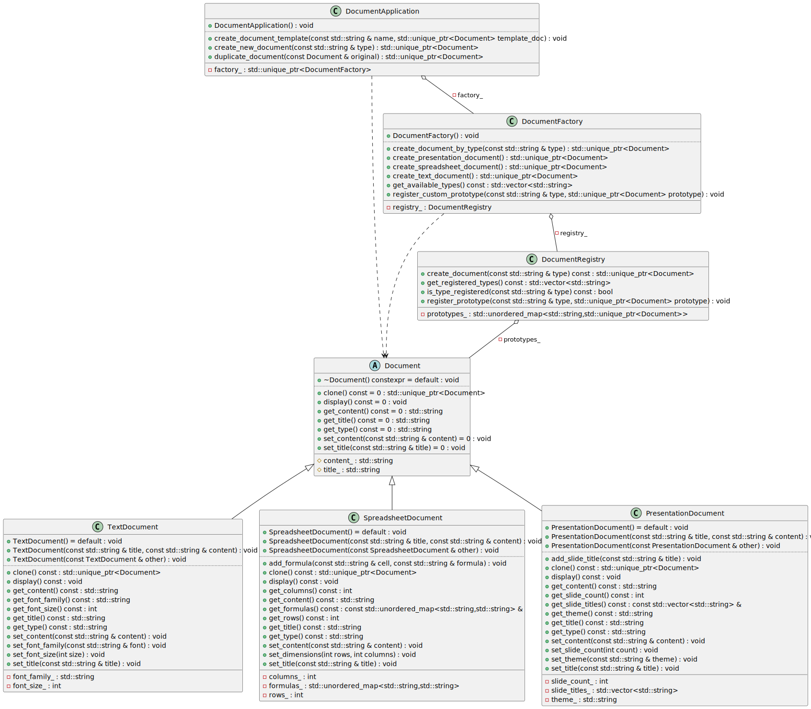

# t00095 - Test case for prototype design pattern
## Config
```yaml
diagrams:
  t00095_class:
    type: class
    glob:
      - t00095.cc
    include:
      namespaces:
        - clanguml::t00095
    using_namespace: clanguml::t00095
```
## Source code
File `tests/t00095/t00095.cc`
```cpp
#include <memory>
#include <string>
#include <unordered_map>
#include <vector>

namespace clanguml {
namespace t00095 {

// Prototype pattern implementation: Document cloning system

// Abstract Prototype interface
class Document {
public:
    virtual ~Document() = default;

    // The clone method is the core of the Prototype pattern
    virtual std::unique_ptr<Document> clone() const = 0;

    virtual void set_title(const std::string &title) = 0;
    virtual void set_content(const std::string &content) = 0;
    virtual std::string get_title() const = 0;
    virtual std::string get_content() const = 0;
    virtual std::string get_type() const = 0;
    virtual void display() const = 0;

protected:
    std::string title_;
    std::string content_;
};

// Concrete Prototype: Text Document
class TextDocument : public Document {
public:
    TextDocument() = default;

    TextDocument(const std::string &title, const std::string &content)
        : font_family_("Arial")
        , font_size_(12)
    {
        title_ = title;
        content_ = content;
    }

    // Copy constructor for cloning
    TextDocument(const TextDocument &other)
        : font_family_(other.font_family_)
        , font_size_(other.font_size_)
    {
        title_ = other.title_;
        content_ = other.content_;
    }

    std::unique_ptr<Document> clone() const override
    {
        return std::make_unique<TextDocument>(*this);
    }

    void set_title(const std::string &title) override { title_ = title; }
    void set_content(const std::string &content) override
    {
        content_ = content;
    }
    std::string get_title() const override { return title_; }
    std::string get_content() const override { return content_; }
    std::string get_type() const override { return "TextDocument"; }
    void display() const override { }

    void set_font_family(const std::string &font) { font_family_ = font; }
    void set_font_size(int size) { font_size_ = size; }
    std::string get_font_family() const { return font_family_; }
    int get_font_size() const { return font_size_; }

private:
    std::string font_family_;
    int font_size_;
};

// Concrete Prototype: Spreadsheet Document
class SpreadsheetDocument : public Document {
public:
    SpreadsheetDocument() = default;

    SpreadsheetDocument(const std::string &title, const std::string &content)
        : rows_(10)
        , columns_(10)
    {
        title_ = title;
        content_ = content;
    }

    // Copy constructor for cloning
    SpreadsheetDocument(const SpreadsheetDocument &other)
        : rows_(other.rows_)
        , columns_(other.columns_)
        , formulas_(other.formulas_)
    {
        title_ = other.title_;
        content_ = other.content_;
    }

    std::unique_ptr<Document> clone() const override
    {
        return std::make_unique<SpreadsheetDocument>(*this);
    }

    void set_title(const std::string &title) override { title_ = title; }
    void set_content(const std::string &content) override
    {
        content_ = content;
    }
    std::string get_title() const override { return title_; }
    std::string get_content() const override { return content_; }
    std::string get_type() const override { return "SpreadsheetDocument"; }
    void display() const override { }

    void set_dimensions(int rows, int columns)
    {
        rows_ = rows;
        columns_ = columns;
    }

    void add_formula(const std::string &cell, const std::string &formula)
    {
        formulas_[cell] = formula;
    }

    int get_rows() const { return rows_; }
    int get_columns() const { return columns_; }
    const std::unordered_map<std::string, std::string> &get_formulas() const
    {
        return formulas_;
    }

private:
    int rows_;
    int columns_;
    std::unordered_map<std::string, std::string> formulas_;
};

// Concrete Prototype: Presentation Document
class PresentationDocument : public Document {
public:
    PresentationDocument() = default;

    PresentationDocument(const std::string &title, const std::string &content)
        : slide_count_(1)
        , theme_("Default")
    {
        title_ = title;
        content_ = content;
    }

    // Copy constructor for cloning
    PresentationDocument(const PresentationDocument &other)
        : slide_count_(other.slide_count_)
        , theme_(other.theme_)
        , slide_titles_(other.slide_titles_)
    {
        title_ = other.title_;
        content_ = other.content_;
    }

    std::unique_ptr<Document> clone() const override
    {
        return std::make_unique<PresentationDocument>(*this);
    }

    void set_title(const std::string &title) override { title_ = title; }
    void set_content(const std::string &content) override
    {
        content_ = content;
    }
    std::string get_title() const override { return title_; }
    std::string get_content() const override { return content_; }
    std::string get_type() const override { return "PresentationDocument"; }
    void display() const override { }

    void set_slide_count(int count) { slide_count_ = count; }
    void set_theme(const std::string &theme) { theme_ = theme; }
    void add_slide_title(const std::string &title)
    {
        slide_titles_.push_back(title);
    }

    int get_slide_count() const { return slide_count_; }
    std::string get_theme() const { return theme_; }
    const std::vector<std::string> &get_slide_titles() const
    {
        return slide_titles_;
    }

private:
    int slide_count_;
    std::string theme_;
    std::vector<std::string> slide_titles_;
};

// Prototype Registry/Manager
class DocumentRegistry {
public:
    void register_prototype(
        const std::string &type, std::unique_ptr<Document> prototype)
    {
        prototypes_[type] = std::move(prototype);
    }

    std::unique_ptr<Document> create_document(const std::string &type) const
    {
        auto it = prototypes_.find(type);
        if (it != prototypes_.end()) {
            return it->second->clone();
        }
        return nullptr;
    }

    std::vector<std::string> get_registered_types() const
    {
        std::vector<std::string> types;
        for (const auto &pair : prototypes_) {
            types.push_back(pair.first);
        }
        return types;
    }

    bool is_type_registered(const std::string &type) const
    {
        return prototypes_.find(type) != prototypes_.end();
    }

private:
    std::unordered_map<std::string, std::unique_ptr<Document>> prototypes_;
};

// Client code demonstrating the Prototype pattern
class DocumentFactory {
public:
    DocumentFactory()
    {
        // Register default prototypes
        auto text_proto =
            std::make_unique<TextDocument>("Template", "Enter text here");
        auto spreadsheet_proto =
            std::make_unique<SpreadsheetDocument>("Template", "Data");
        auto presentation_proto =
            std::make_unique<PresentationDocument>("Template", "Slide content");

        registry_.register_prototype("text", std::move(text_proto));
        registry_.register_prototype(
            "spreadsheet", std::move(spreadsheet_proto));
        registry_.register_prototype(
            "presentation", std::move(presentation_proto));
    }

    std::unique_ptr<Document> create_text_document()
    {
        return registry_.create_document("text");
    }

    std::unique_ptr<Document> create_spreadsheet_document()
    {
        return registry_.create_document("spreadsheet");
    }

    std::unique_ptr<Document> create_presentation_document()
    {
        return registry_.create_document("presentation");
    }

    std::unique_ptr<Document> create_document_by_type(const std::string &type)
    {
        return registry_.create_document(type);
    }

    void register_custom_prototype(
        const std::string &type, std::unique_ptr<Document> prototype)
    {
        registry_.register_prototype(type, std::move(prototype));
    }

    std::vector<std::string> get_available_types() const
    {
        return registry_.get_registered_types();
    }

private:
    DocumentRegistry registry_;
};

// Application demonstrating prototype usage
class DocumentApplication {
public:
    DocumentApplication()
        : factory_(std::make_unique<DocumentFactory>())
    {
    }

    std::unique_ptr<Document> create_new_document(const std::string &type)
    {
        return factory_->create_document_by_type(type);
    }

    std::unique_ptr<Document> duplicate_document(const Document &original)
    {
        return original.clone();
    }

    void create_document_template(
        const std::string &name, std::unique_ptr<Document> template_doc)
    {
        factory_->register_custom_prototype(name, std::move(template_doc));
    }

private:
    std::unique_ptr<DocumentFactory> factory_;
};

} // namespace t00095
} // namespace clanguml
```
## Generated PlantUML diagrams

## Generated Mermaid diagrams

## Generated JSON models
```json
{
  "diagram_type": "class",
  "elements": [
    {
      "bases": [],
      "display_name": "Document",
      "id": "5221504587205040302",
      "is_abstract": true,
      "is_nested": false,
      "is_struct": false,
      "is_template": false,
      "is_union": false,
      "members": [
        {
          "access": "protected",
          "is_static": false,
          "name": "title_",
          "source_location": {
            "column": 17,
            "file": "t00095.cc",
            "line": 27,
            "translation_unit": "t00095.cc"
          },
          "type": "std::string"
        },
        {
          "access": "protected",
          "is_static": false,
          "name": "content_",
          "source_location": {
            "column": 17,
            "file": "t00095.cc",
            "line": 28,
            "translation_unit": "t00095.cc"
          },
          "type": "std::string"
        }
      ],
      "methods": [
        {
          "access": "public",
          "display_name": "~Document",
          "is_const": false,
          "is_consteval": false,
          "is_constexpr": true,
          "is_constructor": false,
          "is_copy_assignment": false,
          "is_coroutine": false,
          "is_defaulted": true,
          "is_deleted": false,
          "is_move_assignment": false,
          "is_noexcept": false,
          "is_operator": false,
          "is_pure_virtual": false,
          "is_static": false,
          "is_virtual": true,
          "name": "~Document",
          "parameters": [],
          "source_location": {
            "column": 13,
            "file": "t00095.cc",
            "line": 14,
            "translation_unit": "t00095.cc"
          },
          "template_parameters": [],
          "type": "void"
        },
        {
          "access": "public",
          "display_name": "clone",
          "is_const": true,
          "is_consteval": false,
          "is_constexpr": false,
          "is_constructor": false,
          "is_copy_assignment": false,
          "is_coroutine": false,
          "is_defaulted": false,
          "is_deleted": false,
          "is_move_assignment": false,
          "is_noexcept": false,
          "is_operator": false,
          "is_pure_virtual": true,
          "is_static": false,
          "is_virtual": true,
          "name": "clone",
          "parameters": [],
          "source_location": {
            "column": 39,
            "file": "t00095.cc",
            "line": 17,
            "translation_unit": "t00095.cc"
          },
          "template_parameters": [],
          "type": "std::unique_ptr<Document>"
        },
        {
          "access": "public",
          "display_name": "set_title",
          "is_const": false,
          "is_consteval": false,
          "is_constexpr": false,
          "is_constructor": false,
          "is_copy_assignment": false,
          "is_coroutine": false,
          "is_defaulted": false,
          "is_deleted": false,
          "is_move_assignment": false,
          "is_noexcept": false,
          "is_operator": false,
          "is_pure_virtual": true,
          "is_static": false,
          "is_virtual": true,
          "name": "set_title",
          "parameters": [
            {
              "name": "title",
              "type": "const std::string &"
            }
          ],
          "source_location": {
            "column": 18,
            "file": "t00095.cc",
            "line": 19,
            "translation_unit": "t00095.cc"
          },
          "template_parameters": [],
          "type": "void"
        },
        {
          "access": "public",
          "display_name": "set_content",
          "is_const": false,
          "is_consteval": false,
          "is_constexpr": false,
          "is_constructor": false,
          "is_copy_assignment": false,
          "is_coroutine": false,
          "is_defaulted": false,
          "is_deleted": false,
          "is_move_assignment": false,
          "is_noexcept": false,
          "is_operator": false,
          "is_pure_virtual": true,
          "is_static": false,
          "is_virtual": true,
          "name": "set_content",
          "parameters": [
            {
              "name": "content",
              "type": "const std::string &"
            }
          ],
          "source_location": {
            "column": 18,
            "file": "t00095.cc",
            "line": 20,
            "translation_unit": "t00095.cc"
          },
          "template_parameters": [],
          "type": "void"
        },
        {
          "access": "public",
          "display_name": "get_title",
          "is_const": true,
          "is_consteval": false,
          "is_constexpr": false,
          "is_constructor": false,
          "is_copy_assignment": false,
          "is_coroutine": false,
          "is_defaulted": false,
          "is_deleted": false,
          "is_move_assignment": false,
          "is_noexcept": false,
          "is_operator": false,
          "is_pure_virtual": true,
          "is_static": false,
          "is_virtual": true,
          "name": "get_title",
          "parameters": [],
          "source_location": {
            "column": 25,
            "file": "t00095.cc",
            "line": 21,
            "translation_unit": "t00095.cc"
          },
          "template_parameters": [],
          "type": "std::string"
        },
        {
          "access": "public",
          "display_name": "get_content",
          "is_const": true,
          "is_consteval": false,
          "is_constexpr": false,
          "is_constructor": false,
          "is_copy_assignment": false,
          "is_coroutine": false,
          "is_defaulted": false,
          "is_deleted": false,
          "is_move_assignment": false,
          "is_noexcept": false,
          "is_operator": false,
          "is_pure_virtual": true,
          "is_static": false,
          "is_virtual": true,
          "name": "get_content",
          "parameters": [],
          "source_location": {
            "column": 25,
            "file": "t00095.cc",
            "line": 22,
            "translation_unit": "t00095.cc"
          },
          "template_parameters": [],
          "type": "std::string"
        },
        {
          "access": "public",
          "display_name": "get_type",
          "is_const": true,
          "is_consteval": false,
          "is_constexpr": false,
          "is_constructor": false,
          "is_copy_assignment": false,
          "is_coroutine": false,
          "is_defaulted": false,
          "is_deleted": false,
          "is_move_assignment": false,
          "is_noexcept": false,
          "is_operator": false,
          "is_pure_virtual": true,
          "is_static": false,
          "is_virtual": true,
          "name": "get_type",
          "parameters": [],
          "source_location": {
            "column": 25,
            "file": "t00095.cc",
            "line": 23,
            "translation_unit": "t00095.cc"
          },
          "template_parameters": [],
          "type": "std::string"
        },
        {
          "access": "public",
          "display_name": "display",
          "is_const": true,
          "is_consteval": false,
          "is_constexpr": false,
          "is_constructor": false,
          "is_copy_assignment": false,
          "is_coroutine": false,
          "is_defaulted": false,
          "is_deleted": false,
          "is_move_assignment": false,
          "is_noexcept": false,
          "is_operator": false,
          "is_pure_virtual": true,
          "is_static": false,
          "is_virtual": true,
          "name": "display",
          "parameters": [],
          "source_location": {
            "column": 18,
            "file": "t00095.cc",
            "line": 24,
            "translation_unit": "t00095.cc"
          },
          "template_parameters": [],
          "type": "void"
        }
      ],
      "name": "Document",
      "namespace": "clanguml::t00095",
      "source_location": {
        "column": 7,
        "file": "t00095.cc",
        "line": 12,
        "translation_unit": "t00095.cc"
      },
      "template_parameters": [],
      "type": "class"
    },
    {
      "bases": [
        {
          "access": "public",
          "id": "5221504587205040302",
          "is_virtual": false
        }
      ],
      "display_name": "TextDocument",
      "id": "14533967972277992259",
      "is_abstract": false,
      "is_nested": false,
      "is_struct": false,
      "is_template": false,
      "is_union": false,
      "members": [
        {
          "access": "private",
          "is_static": false,
          "name": "font_family_",
          "source_location": {
            "column": 17,
            "file": "t00095.cc",
            "line": 74,
            "translation_unit": "t00095.cc"
          },
          "type": "std::string"
        },
        {
          "access": "private",
          "is_static": false,
          "name": "font_size_",
          "source_location": {
            "column": 9,
            "file": "t00095.cc",
            "line": 75,
            "translation_unit": "t00095.cc"
          },
          "type": "int"
        }
      ],
      "methods": [
        {
          "access": "public",
          "display_name": "TextDocument",
          "is_const": false,
          "is_consteval": false,
          "is_constexpr": false,
          "is_constructor": true,
          "is_copy_assignment": false,
          "is_coroutine": false,
          "is_defaulted": true,
          "is_deleted": false,
          "is_move_assignment": false,
          "is_noexcept": false,
          "is_operator": false,
          "is_pure_virtual": false,
          "is_static": false,
          "is_virtual": false,
          "name": "TextDocument",
          "parameters": [],
          "source_location": {
            "column": 5,
            "file": "t00095.cc",
            "line": 34,
            "translation_unit": "t00095.cc"
          },
          "template_parameters": [],
          "type": "void"
        },
        {
          "access": "public",
          "display_name": "TextDocument",
          "is_const": false,
          "is_consteval": false,
          "is_constexpr": false,
          "is_constructor": true,
          "is_copy_assignment": false,
          "is_coroutine": false,
          "is_defaulted": false,
          "is_deleted": false,
          "is_move_assignment": false,
          "is_noexcept": false,
          "is_operator": false,
          "is_pure_virtual": false,
          "is_static": false,
          "is_virtual": false,
          "name": "TextDocument",
          "parameters": [
            {
              "name": "title",
              "type": "const std::string &"
            },
            {
              "name": "content",
              "type": "const std::string &"
            }
          ],
          "source_location": {
            "column": 5,
            "file": "t00095.cc",
            "line": 36,
            "translation_unit": "t00095.cc"
          },
          "template_parameters": [],
          "type": "void"
        },
        {
          "access": "public",
          "display_name": "TextDocument",
          "is_const": false,
          "is_consteval": false,
          "is_constexpr": false,
          "is_constructor": true,
          "is_copy_assignment": false,
          "is_coroutine": false,
          "is_defaulted": false,
          "is_deleted": false,
          "is_move_assignment": false,
          "is_noexcept": false,
          "is_operator": false,
          "is_pure_virtual": false,
          "is_static": false,
          "is_virtual": false,
          "name": "TextDocument",
          "parameters": [
            {
              "name": "other",
              "type": "const TextDocument &"
            }
          ],
          "source_location": {
            "column": 5,
            "file": "t00095.cc",
            "line": 45,
            "translation_unit": "t00095.cc"
          },
          "template_parameters": [],
          "type": "void"
        },
        {
          "access": "public",
          "display_name": "clone",
          "is_const": true,
          "is_consteval": false,
          "is_constexpr": false,
          "is_constructor": false,
          "is_copy_assignment": false,
          "is_coroutine": false,
          "is_defaulted": false,
          "is_deleted": false,
          "is_move_assignment": false,
          "is_noexcept": false,
          "is_operator": false,
          "is_pure_virtual": false,
          "is_static": false,
          "is_virtual": true,
          "name": "clone",
          "parameters": [],
          "source_location": {
            "column": 31,
            "file": "t00095.cc",
            "line": 53,
            "translation_unit": "t00095.cc"
          },
          "template_parameters": [],
          "type": "std::unique_ptr<Document>"
        },
        {
          "access": "public",
          "display_name": "set_title",
          "is_const": false,
          "is_consteval": false,
          "is_constexpr": false,
          "is_constructor": false,
          "is_copy_assignment": false,
          "is_coroutine": false,
          "is_defaulted": false,
          "is_deleted": false,
          "is_move_assignment": false,
          "is_noexcept": false,
          "is_operator": false,
          "is_pure_virtual": false,
          "is_static": false,
          "is_virtual": true,
          "name": "set_title",
          "parameters": [
            {
              "name": "title",
              "type": "const std::string &"
            }
          ],
          "source_location": {
            "column": 10,
            "file": "t00095.cc",
            "line": 58,
            "translation_unit": "t00095.cc"
          },
          "template_parameters": [],
          "type": "void"
        },
        {
          "access": "public",
          "display_name": "set_content",
          "is_const": false,
          "is_consteval": false,
          "is_constexpr": false,
          "is_constructor": false,
          "is_copy_assignment": false,
          "is_coroutine": false,
          "is_defaulted": false,
          "is_deleted": false,
          "is_move_assignment": false,
          "is_noexcept": false,
          "is_operator": false,
          "is_pure_virtual": false,
          "is_static": false,
          "is_virtual": true,
          "name": "set_content",
          "parameters": [
            {
              "name": "content",
              "type": "const std::string &"
            }
          ],
          "source_location": {
            "column": 10,
            "file": "t00095.cc",
            "line": 59,
            "translation_unit": "t00095.cc"
          },
          "template_parameters": [],
          "type": "void"
        },
        {
          "access": "public",
          "display_name": "get_title",
          "is_const": true,
          "is_consteval": false,
          "is_constexpr": false,
          "is_constructor": false,
          "is_copy_assignment": false,
          "is_coroutine": false,
          "is_defaulted": false,
          "is_deleted": false,
          "is_move_assignment": false,
          "is_noexcept": false,
          "is_operator": false,
          "is_pure_virtual": false,
          "is_static": false,
          "is_virtual": true,
          "name": "get_title",
          "parameters": [],
          "source_location": {
            "column": 17,
            "file": "t00095.cc",
            "line": 63,
            "translation_unit": "t00095.cc"
          },
          "template_parameters": [],
          "type": "std::string"
        },
        {
          "access": "public",
          "display_name": "get_content",
          "is_const": true,
          "is_consteval": false,
          "is_constexpr": false,
          "is_constructor": false,
          "is_copy_assignment": false,
          "is_coroutine": false,
          "is_defaulted": false,
          "is_deleted": false,
          "is_move_assignment": false,
          "is_noexcept": false,
          "is_operator": false,
          "is_pure_virtual": false,
          "is_static": false,
          "is_virtual": true,
          "name": "get_content",
          "parameters": [],
          "source_location": {
            "column": 17,
            "file": "t00095.cc",
            "line": 64,
            "translation_unit": "t00095.cc"
          },
          "template_parameters": [],
          "type": "std::string"
        },
        {
          "access": "public",
          "display_name": "get_type",
          "is_const": true,
          "is_consteval": false,
          "is_constexpr": false,
          "is_constructor": false,
          "is_copy_assignment": false,
          "is_coroutine": false,
          "is_defaulted": false,
          "is_deleted": false,
          "is_move_assignment": false,
          "is_noexcept": false,
          "is_operator": false,
          "is_pure_virtual": false,
          "is_static": false,
          "is_virtual": true,
          "name": "get_type",
          "parameters": [],
          "source_location": {
            "column": 17,
            "file": "t00095.cc",
            "line": 65,
            "translation_unit": "t00095.cc"
          },
          "template_parameters": [],
          "type": "std::string"
        },
        {
          "access": "public",
          "display_name": "display",
          "is_const": true,
          "is_consteval": false,
          "is_constexpr": false,
          "is_constructor": false,
          "is_copy_assignment": false,
          "is_coroutine": false,
          "is_defaulted": false,
          "is_deleted": false,
          "is_move_assignment": false,
          "is_noexcept": false,
          "is_operator": false,
          "is_pure_virtual": false,
          "is_static": false,
          "is_virtual": true,
          "name": "display",
          "parameters": [],
          "source_location": {
            "column": 10,
            "file": "t00095.cc",
            "line": 66,
            "translation_unit": "t00095.cc"
          },
          "template_parameters": [],
          "type": "void"
        },
        {
          "access": "public",
          "display_name": "set_font_family",
          "is_const": false,
          "is_consteval": false,
          "is_constexpr": false,
          "is_constructor": false,
          "is_copy_assignment": false,
          "is_coroutine": false,
          "is_defaulted": false,
          "is_deleted": false,
          "is_move_assignment": false,
          "is_noexcept": false,
          "is_operator": false,
          "is_pure_virtual": false,
          "is_static": false,
          "is_virtual": false,
          "name": "set_font_family",
          "parameters": [
            {
              "name": "font",
              "type": "const std::string &"
            }
          ],
          "source_location": {
            "column": 10,
            "file": "t00095.cc",
            "line": 68,
            "translation_unit": "t00095.cc"
          },
          "template_parameters": [],
          "type": "void"
        },
        {
          "access": "public",
          "display_name": "set_font_size",
          "is_const": false,
          "is_consteval": false,
          "is_constexpr": false,
          "is_constructor": false,
          "is_copy_assignment": false,
          "is_coroutine": false,
          "is_defaulted": false,
          "is_deleted": false,
          "is_move_assignment": false,
          "is_noexcept": false,
          "is_operator": false,
          "is_pure_virtual": false,
          "is_static": false,
          "is_virtual": false,
          "name": "set_font_size",
          "parameters": [
            {
              "name": "size",
              "type": "int"
            }
          ],
          "source_location": {
            "column": 10,
            "file": "t00095.cc",
            "line": 69,
            "translation_unit": "t00095.cc"
          },
          "template_parameters": [],
          "type": "void"
        },
        {
          "access": "public",
          "display_name": "get_font_family",
          "is_const": true,
          "is_consteval": false,
          "is_constexpr": false,
          "is_constructor": false,
          "is_copy_assignment": false,
          "is_coroutine": false,
          "is_defaulted": false,
          "is_deleted": false,
          "is_move_assignment": false,
          "is_noexcept": false,
          "is_operator": false,
          "is_pure_virtual": false,
          "is_static": false,
          "is_virtual": false,
          "name": "get_font_family",
          "parameters": [],
          "source_location": {
            "column": 17,
            "file": "t00095.cc",
            "line": 70,
            "translation_unit": "t00095.cc"
          },
          "template_parameters": [],
          "type": "std::string"
        },
        {
          "access": "public",
          "display_name": "get_font_size",
          "is_const": true,
          "is_consteval": false,
          "is_constexpr": false,
          "is_constructor": false,
          "is_copy_assignment": false,
          "is_coroutine": false,
          "is_defaulted": false,
          "is_deleted": false,
          "is_move_assignment": false,
          "is_noexcept": false,
          "is_operator": false,
          "is_pure_virtual": false,
          "is_static": false,
          "is_virtual": false,
          "name": "get_font_size",
          "parameters": [],
          "source_location": {
            "column": 9,
            "file": "t00095.cc",
            "line": 71,
            "translation_unit": "t00095.cc"
          },
          "template_parameters": [],
          "type": "int"
        }
      ],
      "name": "TextDocument",
      "namespace": "clanguml::t00095",
      "source_location": {
        "column": 7,
        "file": "t00095.cc",
        "line": 32,
        "translation_unit": "t00095.cc"
      },
      "template_parameters": [],
      "type": "class"
    },
    {
      "bases": [
        {
          "access": "public",
          "id": "5221504587205040302",
          "is_virtual": false
        }
      ],
      "display_name": "SpreadsheetDocument",
      "id": "2305114085068683126",
      "is_abstract": false,
      "is_nested": false,
      "is_struct": false,
      "is_template": false,
      "is_union": false,
      "members": [
        {
          "access": "private",
          "is_static": false,
          "name": "rows_",
          "source_location": {
            "column": 9,
            "file": "t00095.cc",
            "line": 135,
            "translation_unit": "t00095.cc"
          },
          "type": "int"
        },
        {
          "access": "private",
          "is_static": false,
          "name": "columns_",
          "source_location": {
            "column": 9,
            "file": "t00095.cc",
            "line": 136,
            "translation_unit": "t00095.cc"
          },
          "type": "int"
        },
        {
          "access": "private",
          "is_static": false,
          "name": "formulas_",
          "source_location": {
            "column": 50,
            "file": "t00095.cc",
            "line": 137,
            "translation_unit": "t00095.cc"
          },
          "type": "std::unordered_map<std::string,std::string>"
        }
      ],
      "methods": [
        {
          "access": "public",
          "display_name": "SpreadsheetDocument",
          "is_const": false,
          "is_consteval": false,
          "is_constexpr": false,
          "is_constructor": true,
          "is_copy_assignment": false,
          "is_coroutine": false,
          "is_defaulted": true,
          "is_deleted": false,
          "is_move_assignment": false,
          "is_noexcept": false,
          "is_operator": false,
          "is_pure_virtual": false,
          "is_static": false,
          "is_virtual": false,
          "name": "SpreadsheetDocument",
          "parameters": [],
          "source_location": {
            "column": 5,
            "file": "t00095.cc",
            "line": 81,
            "translation_unit": "t00095.cc"
          },
          "template_parameters": [],
          "type": "void"
        },
        {
          "access": "public",
          "display_name": "SpreadsheetDocument",
          "is_const": false,
          "is_consteval": false,
          "is_constexpr": false,
          "is_constructor": true,
          "is_copy_assignment": false,
          "is_coroutine": false,
          "is_defaulted": false,
          "is_deleted": false,
          "is_move_assignment": false,
          "is_noexcept": false,
          "is_operator": false,
          "is_pure_virtual": false,
          "is_static": false,
          "is_virtual": false,
          "name": "SpreadsheetDocument",
          "parameters": [
            {
              "name": "title",
              "type": "const std::string &"
            },
            {
              "name": "content",
              "type": "const std::string &"
            }
          ],
          "source_location": {
            "column": 5,
            "file": "t00095.cc",
            "line": 83,
            "translation_unit": "t00095.cc"
          },
          "template_parameters": [],
          "type": "void"
        },
        {
          "access": "public",
          "display_name": "SpreadsheetDocument",
          "is_const": false,
          "is_consteval": false,
          "is_constexpr": false,
          "is_constructor": true,
          "is_copy_assignment": false,
          "is_coroutine": false,
          "is_defaulted": false,
          "is_deleted": false,
          "is_move_assignment": false,
          "is_noexcept": false,
          "is_operator": false,
          "is_pure_virtual": false,
          "is_static": false,
          "is_virtual": false,
          "name": "SpreadsheetDocument",
          "parameters": [
            {
              "name": "other",
              "type": "const SpreadsheetDocument &"
            }
          ],
          "source_location": {
            "column": 5,
            "file": "t00095.cc",
            "line": 92,
            "translation_unit": "t00095.cc"
          },
          "template_parameters": [],
          "type": "void"
        },
        {
          "access": "public",
          "display_name": "clone",
          "is_const": true,
          "is_consteval": false,
          "is_constexpr": false,
          "is_constructor": false,
          "is_copy_assignment": false,
          "is_coroutine": false,
          "is_defaulted": false,
          "is_deleted": false,
          "is_move_assignment": false,
          "is_noexcept": false,
          "is_operator": false,
          "is_pure_virtual": false,
          "is_static": false,
          "is_virtual": true,
          "name": "clone",
          "parameters": [],
          "source_location": {
            "column": 31,
            "file": "t00095.cc",
            "line": 101,
            "translation_unit": "t00095.cc"
          },
          "template_parameters": [],
          "type": "std::unique_ptr<Document>"
        },
        {
          "access": "public",
          "display_name": "set_title",
          "is_const": false,
          "is_consteval": false,
          "is_constexpr": false,
          "is_constructor": false,
          "is_copy_assignment": false,
          "is_coroutine": false,
          "is_defaulted": false,
          "is_deleted": false,
          "is_move_assignment": false,
          "is_noexcept": false,
          "is_operator": false,
          "is_pure_virtual": false,
          "is_static": false,
          "is_virtual": true,
          "name": "set_title",
          "parameters": [
            {
              "name": "title",
              "type": "const std::string &"
            }
          ],
          "source_location": {
            "column": 10,
            "file": "t00095.cc",
            "line": 106,
            "translation_unit": "t00095.cc"
          },
          "template_parameters": [],
          "type": "void"
        },
        {
          "access": "public",
          "display_name": "set_content",
          "is_const": false,
          "is_consteval": false,
          "is_constexpr": false,
          "is_constructor": false,
          "is_copy_assignment": false,
          "is_coroutine": false,
          "is_defaulted": false,
          "is_deleted": false,
          "is_move_assignment": false,
          "is_noexcept": false,
          "is_operator": false,
          "is_pure_virtual": false,
          "is_static": false,
          "is_virtual": true,
          "name": "set_content",
          "parameters": [
            {
              "name": "content",
              "type": "const std::string &"
            }
          ],
          "source_location": {
            "column": 10,
            "file": "t00095.cc",
            "line": 107,
            "translation_unit": "t00095.cc"
          },
          "template_parameters": [],
          "type": "void"
        },
        {
          "access": "public",
          "display_name": "get_title",
          "is_const": true,
          "is_consteval": false,
          "is_constexpr": false,
          "is_constructor": false,
          "is_copy_assignment": false,
          "is_coroutine": false,
          "is_defaulted": false,
          "is_deleted": false,
          "is_move_assignment": false,
          "is_noexcept": false,
          "is_operator": false,
          "is_pure_virtual": false,
          "is_static": false,
          "is_virtual": true,
          "name": "get_title",
          "parameters": [],
          "source_location": {
            "column": 17,
            "file": "t00095.cc",
            "line": 111,
            "translation_unit": "t00095.cc"
          },
          "template_parameters": [],
          "type": "std::string"
        },
        {
          "access": "public",
          "display_name": "get_content",
          "is_const": true,
          "is_consteval": false,
          "is_constexpr": false,
          "is_constructor": false,
          "is_copy_assignment": false,
          "is_coroutine": false,
          "is_defaulted": false,
          "is_deleted": false,
          "is_move_assignment": false,
          "is_noexcept": false,
          "is_operator": false,
          "is_pure_virtual": false,
          "is_static": false,
          "is_virtual": true,
          "name": "get_content",
          "parameters": [],
          "source_location": {
            "column": 17,
            "file": "t00095.cc",
            "line": 112,
            "translation_unit": "t00095.cc"
          },
          "template_parameters": [],
          "type": "std::string"
        },
        {
          "access": "public",
          "display_name": "get_type",
          "is_const": true,
          "is_consteval": false,
          "is_constexpr": false,
          "is_constructor": false,
          "is_copy_assignment": false,
          "is_coroutine": false,
          "is_defaulted": false,
          "is_deleted": false,
          "is_move_assignment": false,
          "is_noexcept": false,
          "is_operator": false,
          "is_pure_virtual": false,
          "is_static": false,
          "is_virtual": true,
          "name": "get_type",
          "parameters": [],
          "source_location": {
            "column": 17,
            "file": "t00095.cc",
            "line": 113,
            "translation_unit": "t00095.cc"
          },
          "template_parameters": [],
          "type": "std::string"
        },
        {
          "access": "public",
          "display_name": "display",
          "is_const": true,
          "is_consteval": false,
          "is_constexpr": false,
          "is_constructor": false,
          "is_copy_assignment": false,
          "is_coroutine": false,
          "is_defaulted": false,
          "is_deleted": false,
          "is_move_assignment": false,
          "is_noexcept": false,
          "is_operator": false,
          "is_pure_virtual": false,
          "is_static": false,
          "is_virtual": true,
          "name": "display",
          "parameters": [],
          "source_location": {
            "column": 10,
            "file": "t00095.cc",
            "line": 114,
            "translation_unit": "t00095.cc"
          },
          "template_parameters": [],
          "type": "void"
        },
        {
          "access": "public",
          "display_name": "set_dimensions",
          "is_const": false,
          "is_consteval": false,
          "is_constexpr": false,
          "is_constructor": false,
          "is_copy_assignment": false,
          "is_coroutine": false,
          "is_defaulted": false,
          "is_deleted": false,
          "is_move_assignment": false,
          "is_noexcept": false,
          "is_operator": false,
          "is_pure_virtual": false,
          "is_static": false,
          "is_virtual": false,
          "name": "set_dimensions",
          "parameters": [
            {
              "name": "rows",
              "type": "int"
            },
            {
              "name": "columns",
              "type": "int"
            }
          ],
          "source_location": {
            "column": 10,
            "file": "t00095.cc",
            "line": 116,
            "translation_unit": "t00095.cc"
          },
          "template_parameters": [],
          "type": "void"
        },
        {
          "access": "public",
          "display_name": "add_formula",
          "is_const": false,
          "is_consteval": false,
          "is_constexpr": false,
          "is_constructor": false,
          "is_copy_assignment": false,
          "is_coroutine": false,
          "is_defaulted": false,
          "is_deleted": false,
          "is_move_assignment": false,
          "is_noexcept": false,
          "is_operator": false,
          "is_pure_virtual": false,
          "is_static": false,
          "is_virtual": false,
          "name": "add_formula",
          "parameters": [
            {
              "name": "cell",
              "type": "const std::string &"
            },
            {
              "name": "formula",
              "type": "const std::string &"
            }
          ],
          "source_location": {
            "column": 10,
            "file": "t00095.cc",
            "line": 122,
            "translation_unit": "t00095.cc"
          },
          "template_parameters": [],
          "type": "void"
        },
        {
          "access": "public",
          "display_name": "get_rows",
          "is_const": true,
          "is_consteval": false,
          "is_constexpr": false,
          "is_constructor": false,
          "is_copy_assignment": false,
          "is_coroutine": false,
          "is_defaulted": false,
          "is_deleted": false,
          "is_move_assignment": false,
          "is_noexcept": false,
          "is_operator": false,
          "is_pure_virtual": false,
          "is_static": false,
          "is_virtual": false,
          "name": "get_rows",
          "parameters": [],
          "source_location": {
            "column": 9,
            "file": "t00095.cc",
            "line": 127,
            "translation_unit": "t00095.cc"
          },
          "template_parameters": [],
          "type": "int"
        },
        {
          "access": "public",
          "display_name": "get_columns",
          "is_const": true,
          "is_consteval": false,
          "is_constexpr": false,
          "is_constructor": false,
          "is_copy_assignment": false,
          "is_coroutine": false,
          "is_defaulted": false,
          "is_deleted": false,
          "is_move_assignment": false,
          "is_noexcept": false,
          "is_operator": false,
          "is_pure_virtual": false,
          "is_static": false,
          "is_virtual": false,
          "name": "get_columns",
          "parameters": [],
          "source_location": {
            "column": 9,
            "file": "t00095.cc",
            "line": 128,
            "translation_unit": "t00095.cc"
          },
          "template_parameters": [],
          "type": "int"
        },
        {
          "access": "public",
          "display_name": "get_formulas",
          "is_const": true,
          "is_consteval": false,
          "is_constexpr": false,
          "is_constructor": false,
          "is_copy_assignment": false,
          "is_coroutine": false,
          "is_defaulted": false,
          "is_deleted": false,
          "is_move_assignment": false,
          "is_noexcept": false,
          "is_operator": false,
          "is_pure_virtual": false,
          "is_static": false,
          "is_virtual": false,
          "name": "get_formulas",
          "parameters": [],
          "source_location": {
            "column": 57,
            "file": "t00095.cc",
            "line": 129,
            "translation_unit": "t00095.cc"
          },
          "template_parameters": [],
          "type": "const std::unordered_map<std::string,std::string> &"
        }
      ],
      "name": "SpreadsheetDocument",
      "namespace": "clanguml::t00095",
      "source_location": {
        "column": 7,
        "file": "t00095.cc",
        "line": 79,
        "translation_unit": "t00095.cc"
      },
      "template_parameters": [],
      "type": "class"
    },
    {
      "bases": [
        {
          "access": "public",
          "id": "5221504587205040302",
          "is_virtual": false
        }
      ],
      "display_name": "PresentationDocument",
      "id": "611556097111014333",
      "is_abstract": false,
      "is_nested": false,
      "is_struct": false,
      "is_template": false,
      "is_union": false,
      "members": [
        {
          "access": "private",
          "is_static": false,
          "name": "slide_count_",
          "source_location": {
            "column": 9,
            "file": "t00095.cc",
            "line": 193,
            "translation_unit": "t00095.cc"
          },
          "type": "int"
        },
        {
          "access": "private",
          "is_static": false,
          "name": "theme_",
          "source_location": {
            "column": 17,
            "file": "t00095.cc",
            "line": 194,
            "translation_unit": "t00095.cc"
          },
          "type": "std::string"
        },
        {
          "access": "private",
          "is_static": false,
          "name": "slide_titles_",
          "source_location": {
            "column": 30,
            "file": "t00095.cc",
            "line": 195,
            "translation_unit": "t00095.cc"
          },
          "type": "std::vector<std::string>"
        }
      ],
      "methods": [
        {
          "access": "public",
          "display_name": "PresentationDocument",
          "is_const": false,
          "is_consteval": false,
          "is_constexpr": false,
          "is_constructor": true,
          "is_copy_assignment": false,
          "is_coroutine": false,
          "is_defaulted": true,
          "is_deleted": false,
          "is_move_assignment": false,
          "is_noexcept": false,
          "is_operator": false,
          "is_pure_virtual": false,
          "is_static": false,
          "is_virtual": false,
          "name": "PresentationDocument",
          "parameters": [],
          "source_location": {
            "column": 5,
            "file": "t00095.cc",
            "line": 143,
            "translation_unit": "t00095.cc"
          },
          "template_parameters": [],
          "type": "void"
        },
        {
          "access": "public",
          "display_name": "PresentationDocument",
          "is_const": false,
          "is_consteval": false,
          "is_constexpr": false,
          "is_constructor": true,
          "is_copy_assignment": false,
          "is_coroutine": false,
          "is_defaulted": false,
          "is_deleted": false,
          "is_move_assignment": false,
          "is_noexcept": false,
          "is_operator": false,
          "is_pure_virtual": false,
          "is_static": false,
          "is_virtual": false,
          "name": "PresentationDocument",
          "parameters": [
            {
              "name": "title",
              "type": "const std::string &"
            },
            {
              "name": "content",
              "type": "const std::string &"
            }
          ],
          "source_location": {
            "column": 5,
            "file": "t00095.cc",
            "line": 145,
            "translation_unit": "t00095.cc"
          },
          "template_parameters": [],
          "type": "void"
        },
        {
          "access": "public",
          "display_name": "PresentationDocument",
          "is_const": false,
          "is_consteval": false,
          "is_constexpr": false,
          "is_constructor": true,
          "is_copy_assignment": false,
          "is_coroutine": false,
          "is_defaulted": false,
          "is_deleted": false,
          "is_move_assignment": false,
          "is_noexcept": false,
          "is_operator": false,
          "is_pure_virtual": false,
          "is_static": false,
          "is_virtual": false,
          "name": "PresentationDocument",
          "parameters": [
            {
              "name": "other",
              "type": "const PresentationDocument &"
            }
          ],
          "source_location": {
            "column": 5,
            "file": "t00095.cc",
            "line": 154,
            "translation_unit": "t00095.cc"
          },
          "template_parameters": [],
          "type": "void"
        },
        {
          "access": "public",
          "display_name": "clone",
          "is_const": true,
          "is_consteval": false,
          "is_constexpr": false,
          "is_constructor": false,
          "is_copy_assignment": false,
          "is_coroutine": false,
          "is_defaulted": false,
          "is_deleted": false,
          "is_move_assignment": false,
          "is_noexcept": false,
          "is_operator": false,
          "is_pure_virtual": false,
          "is_static": false,
          "is_virtual": true,
          "name": "clone",
          "parameters": [],
          "source_location": {
            "column": 31,
            "file": "t00095.cc",
            "line": 163,
            "translation_unit": "t00095.cc"
          },
          "template_parameters": [],
          "type": "std::unique_ptr<Document>"
        },
        {
          "access": "public",
          "display_name": "set_title",
          "is_const": false,
          "is_consteval": false,
          "is_constexpr": false,
          "is_constructor": false,
          "is_copy_assignment": false,
          "is_coroutine": false,
          "is_defaulted": false,
          "is_deleted": false,
          "is_move_assignment": false,
          "is_noexcept": false,
          "is_operator": false,
          "is_pure_virtual": false,
          "is_static": false,
          "is_virtual": true,
          "name": "set_title",
          "parameters": [
            {
              "name": "title",
              "type": "const std::string &"
            }
          ],
          "source_location": {
            "column": 10,
            "file": "t00095.cc",
            "line": 168,
            "translation_unit": "t00095.cc"
          },
          "template_parameters": [],
          "type": "void"
        },
        {
          "access": "public",
          "display_name": "set_content",
          "is_const": false,
          "is_consteval": false,
          "is_constexpr": false,
          "is_constructor": false,
          "is_copy_assignment": false,
          "is_coroutine": false,
          "is_defaulted": false,
          "is_deleted": false,
          "is_move_assignment": false,
          "is_noexcept": false,
          "is_operator": false,
          "is_pure_virtual": false,
          "is_static": false,
          "is_virtual": true,
          "name": "set_content",
          "parameters": [
            {
              "name": "content",
              "type": "const std::string &"
            }
          ],
          "source_location": {
            "column": 10,
            "file": "t00095.cc",
            "line": 169,
            "translation_unit": "t00095.cc"
          },
          "template_parameters": [],
          "type": "void"
        },
        {
          "access": "public",
          "display_name": "get_title",
          "is_const": true,
          "is_consteval": false,
          "is_constexpr": false,
          "is_constructor": false,
          "is_copy_assignment": false,
          "is_coroutine": false,
          "is_defaulted": false,
          "is_deleted": false,
          "is_move_assignment": false,
          "is_noexcept": false,
          "is_operator": false,
          "is_pure_virtual": false,
          "is_static": false,
          "is_virtual": true,
          "name": "get_title",
          "parameters": [],
          "source_location": {
            "column": 17,
            "file": "t00095.cc",
            "line": 173,
            "translation_unit": "t00095.cc"
          },
          "template_parameters": [],
          "type": "std::string"
        },
        {
          "access": "public",
          "display_name": "get_content",
          "is_const": true,
          "is_consteval": false,
          "is_constexpr": false,
          "is_constructor": false,
          "is_copy_assignment": false,
          "is_coroutine": false,
          "is_defaulted": false,
          "is_deleted": false,
          "is_move_assignment": false,
          "is_noexcept": false,
          "is_operator": false,
          "is_pure_virtual": false,
          "is_static": false,
          "is_virtual": true,
          "name": "get_content",
          "parameters": [],
          "source_location": {
            "column": 17,
            "file": "t00095.cc",
            "line": 174,
            "translation_unit": "t00095.cc"
          },
          "template_parameters": [],
          "type": "std::string"
        },
        {
          "access": "public",
          "display_name": "get_type",
          "is_const": true,
          "is_consteval": false,
          "is_constexpr": false,
          "is_constructor": false,
          "is_copy_assignment": false,
          "is_coroutine": false,
          "is_defaulted": false,
          "is_deleted": false,
          "is_move_assignment": false,
          "is_noexcept": false,
          "is_operator": false,
          "is_pure_virtual": false,
          "is_static": false,
          "is_virtual": true,
          "name": "get_type",
          "parameters": [],
          "source_location": {
            "column": 17,
            "file": "t00095.cc",
            "line": 175,
            "translation_unit": "t00095.cc"
          },
          "template_parameters": [],
          "type": "std::string"
        },
        {
          "access": "public",
          "display_name": "display",
          "is_const": true,
          "is_consteval": false,
          "is_constexpr": false,
          "is_constructor": false,
          "is_copy_assignment": false,
          "is_coroutine": false,
          "is_defaulted": false,
          "is_deleted": false,
          "is_move_assignment": false,
          "is_noexcept": false,
          "is_operator": false,
          "is_pure_virtual": false,
          "is_static": false,
          "is_virtual": true,
          "name": "display",
          "parameters": [],
          "source_location": {
            "column": 10,
            "file": "t00095.cc",
            "line": 176,
            "translation_unit": "t00095.cc"
          },
          "template_parameters": [],
          "type": "void"
        },
        {
          "access": "public",
          "display_name": "set_slide_count",
          "is_const": false,
          "is_consteval": false,
          "is_constexpr": false,
          "is_constructor": false,
          "is_copy_assignment": false,
          "is_coroutine": false,
          "is_defaulted": false,
          "is_deleted": false,
          "is_move_assignment": false,
          "is_noexcept": false,
          "is_operator": false,
          "is_pure_virtual": false,
          "is_static": false,
          "is_virtual": false,
          "name": "set_slide_count",
          "parameters": [
            {
              "name": "count",
              "type": "int"
            }
          ],
          "source_location": {
            "column": 10,
            "file": "t00095.cc",
            "line": 178,
            "translation_unit": "t00095.cc"
          },
          "template_parameters": [],
          "type": "void"
        },
        {
          "access": "public",
          "display_name": "set_theme",
          "is_const": false,
          "is_consteval": false,
          "is_constexpr": false,
          "is_constructor": false,
          "is_copy_assignment": false,
          "is_coroutine": false,
          "is_defaulted": false,
          "is_deleted": false,
          "is_move_assignment": false,
          "is_noexcept": false,
          "is_operator": false,
          "is_pure_virtual": false,
          "is_static": false,
          "is_virtual": false,
          "name": "set_theme",
          "parameters": [
            {
              "name": "theme",
              "type": "const std::string &"
            }
          ],
          "source_location": {
            "column": 10,
            "file": "t00095.cc",
            "line": 179,
            "translation_unit": "t00095.cc"
          },
          "template_parameters": [],
          "type": "void"
        },
        {
          "access": "public",
          "display_name": "add_slide_title",
          "is_const": false,
          "is_consteval": false,
          "is_constexpr": false,
          "is_constructor": false,
          "is_copy_assignment": false,
          "is_coroutine": false,
          "is_defaulted": false,
          "is_deleted": false,
          "is_move_assignment": false,
          "is_noexcept": false,
          "is_operator": false,
          "is_pure_virtual": false,
          "is_static": false,
          "is_virtual": false,
          "name": "add_slide_title",
          "parameters": [
            {
              "name": "title",
              "type": "const std::string &"
            }
          ],
          "source_location": {
            "column": 10,
            "file": "t00095.cc",
            "line": 180,
            "translation_unit": "t00095.cc"
          },
          "template_parameters": [],
          "type": "void"
        },
        {
          "access": "public",
          "display_name": "get_slide_count",
          "is_const": true,
          "is_consteval": false,
          "is_constexpr": false,
          "is_constructor": false,
          "is_copy_assignment": false,
          "is_coroutine": false,
          "is_defaulted": false,
          "is_deleted": false,
          "is_move_assignment": false,
          "is_noexcept": false,
          "is_operator": false,
          "is_pure_virtual": false,
          "is_static": false,
          "is_virtual": false,
          "name": "get_slide_count",
          "parameters": [],
          "source_location": {
            "column": 9,
            "file": "t00095.cc",
            "line": 185,
            "translation_unit": "t00095.cc"
          },
          "template_parameters": [],
          "type": "int"
        },
        {
          "access": "public",
          "display_name": "get_theme",
          "is_const": true,
          "is_consteval": false,
          "is_constexpr": false,
          "is_constructor": false,
          "is_copy_assignment": false,
          "is_coroutine": false,
          "is_defaulted": false,
          "is_deleted": false,
          "is_move_assignment": false,
          "is_noexcept": false,
          "is_operator": false,
          "is_pure_virtual": false,
          "is_static": false,
          "is_virtual": false,
          "name": "get_theme",
          "parameters": [],
          "source_location": {
            "column": 17,
            "file": "t00095.cc",
            "line": 186,
            "translation_unit": "t00095.cc"
          },
          "template_parameters": [],
          "type": "std::string"
        },
        {
          "access": "public",
          "display_name": "get_slide_titles",
          "is_const": true,
          "is_consteval": false,
          "is_constexpr": false,
          "is_constructor": false,
          "is_copy_assignment": false,
          "is_coroutine": false,
          "is_defaulted": false,
          "is_deleted": false,
          "is_move_assignment": false,
          "is_noexcept": false,
          "is_operator": false,
          "is_pure_virtual": false,
          "is_static": false,
          "is_virtual": false,
          "name": "get_slide_titles",
          "parameters": [],
          "source_location": {
            "column": 37,
            "file": "t00095.cc",
            "line": 187,
            "translation_unit": "t00095.cc"
          },
          "template_parameters": [],
          "type": "const std::vector<std::string> &"
        }
      ],
      "name": "PresentationDocument",
      "namespace": "clanguml::t00095",
      "source_location": {
        "column": 7,
        "file": "t00095.cc",
        "line": 141,
        "translation_unit": "t00095.cc"
      },
      "template_parameters": [],
      "type": "class"
    },
    {
      "bases": [],
      "display_name": "DocumentRegistry",
      "id": "8710558658600266601",
      "is_abstract": false,
      "is_nested": false,
      "is_struct": false,
      "is_template": false,
      "is_union": false,
      "members": [
        {
          "access": "private",
          "is_static": false,
          "name": "prototypes_",
          "source_location": {
            "column": 64,
            "file": "t00095.cc",
            "line": 231,
            "translation_unit": "t00095.cc"
          },
          "type": "std::unordered_map<std::string,std::unique_ptr<Document>>"
        }
      ],
      "methods": [
        {
          "access": "public",
          "display_name": "register_prototype",
          "is_const": false,
          "is_consteval": false,
          "is_constexpr": false,
          "is_constructor": false,
          "is_copy_assignment": false,
          "is_coroutine": false,
          "is_defaulted": false,
          "is_deleted": false,
          "is_move_assignment": false,
          "is_noexcept": false,
          "is_operator": false,
          "is_pure_virtual": false,
          "is_static": false,
          "is_virtual": false,
          "name": "register_prototype",
          "parameters": [
            {
              "name": "type",
              "type": "const std::string &"
            },
            {
              "name": "prototype",
              "type": "std::unique_ptr<Document>"
            }
          ],
          "source_location": {
            "column": 10,
            "file": "t00095.cc",
            "line": 201,
            "translation_unit": "t00095.cc"
          },
          "template_parameters": [],
          "type": "void"
        },
        {
          "access": "public",
          "display_name": "create_document",
          "is_const": true,
          "is_consteval": false,
          "is_constexpr": false,
          "is_constructor": false,
          "is_copy_assignment": false,
          "is_coroutine": false,
          "is_defaulted": false,
          "is_deleted": false,
          "is_move_assignment": false,
          "is_noexcept": false,
          "is_operator": false,
          "is_pure_virtual": false,
          "is_static": false,
          "is_virtual": false,
          "name": "create_document",
          "parameters": [
            {
              "name": "type",
              "type": "const std::string &"
            }
          ],
          "source_location": {
            "column": 31,
            "file": "t00095.cc",
            "line": 207,
            "translation_unit": "t00095.cc"
          },
          "template_parameters": [],
          "type": "std::unique_ptr<Document>"
        },
        {
          "access": "public",
          "display_name": "get_registered_types",
          "is_const": true,
          "is_consteval": false,
          "is_constexpr": false,
          "is_constructor": false,
          "is_copy_assignment": false,
          "is_coroutine": false,
          "is_defaulted": false,
          "is_deleted": false,
          "is_move_assignment": false,
          "is_noexcept": false,
          "is_operator": false,
          "is_pure_virtual": false,
          "is_static": false,
          "is_virtual": false,
          "name": "get_registered_types",
          "parameters": [],
          "source_location": {
            "column": 30,
            "file": "t00095.cc",
            "line": 216,
            "translation_unit": "t00095.cc"
          },
          "template_parameters": [],
          "type": "std::vector<std::string>"
        },
        {
          "access": "public",
          "display_name": "is_type_registered",
          "is_const": true,
          "is_consteval": false,
          "is_constexpr": false,
          "is_constructor": false,
          "is_copy_assignment": false,
          "is_coroutine": false,
          "is_defaulted": false,
          "is_deleted": false,
          "is_move_assignment": false,
          "is_noexcept": false,
          "is_operator": false,
          "is_pure_virtual": false,
          "is_static": false,
          "is_virtual": false,
          "name": "is_type_registered",
          "parameters": [
            {
              "name": "type",
              "type": "const std::string &"
            }
          ],
          "source_location": {
            "column": 10,
            "file": "t00095.cc",
            "line": 225,
            "translation_unit": "t00095.cc"
          },
          "template_parameters": [],
          "type": "bool"
        }
      ],
      "name": "DocumentRegistry",
      "namespace": "clanguml::t00095",
      "source_location": {
        "column": 7,
        "file": "t00095.cc",
        "line": 199,
        "translation_unit": "t00095.cc"
      },
      "template_parameters": [],
      "type": "class"
    },
    {
      "bases": [],
      "display_name": "DocumentFactory",
      "id": "5358168373881656558",
      "is_abstract": false,
      "is_nested": false,
      "is_struct": false,
      "is_template": false,
      "is_union": false,
      "members": [
        {
          "access": "private",
          "is_static": false,
          "name": "registry_",
          "source_location": {
            "column": 22,
            "file": "t00095.cc",
            "line": 286,
            "translation_unit": "t00095.cc"
          },
          "type": "DocumentRegistry"
        }
      ],
      "methods": [
        {
          "access": "public",
          "display_name": "DocumentFactory",
          "is_const": false,
          "is_consteval": false,
          "is_constexpr": false,
          "is_constructor": true,
          "is_copy_assignment": false,
          "is_coroutine": false,
          "is_defaulted": false,
          "is_deleted": false,
          "is_move_assignment": false,
          "is_noexcept": false,
          "is_operator": false,
          "is_pure_virtual": false,
          "is_static": false,
          "is_virtual": false,
          "name": "DocumentFactory",
          "parameters": [],
          "source_location": {
            "column": 5,
            "file": "t00095.cc",
            "line": 237,
            "translation_unit": "t00095.cc"
          },
          "template_parameters": [],
          "type": "void"
        },
        {
          "access": "public",
          "display_name": "create_text_document",
          "is_const": false,
          "is_consteval": false,
          "is_constexpr": false,
          "is_constructor": false,
          "is_copy_assignment": false,
          "is_coroutine": false,
          "is_defaulted": false,
          "is_deleted": false,
          "is_move_assignment": false,
          "is_noexcept": false,
          "is_operator": false,
          "is_pure_virtual": false,
          "is_static": false,
          "is_virtual": false,
          "name": "create_text_document",
          "parameters": [],
          "source_location": {
            "column": 31,
            "file": "t00095.cc",
            "line": 254,
            "translation_unit": "t00095.cc"
          },
          "template_parameters": [],
          "type": "std::unique_ptr<Document>"
        },
        {
          "access": "public",
          "display_name": "create_spreadsheet_document",
          "is_const": false,
          "is_consteval": false,
          "is_constexpr": false,
          "is_constructor": false,
          "is_copy_assignment": false,
          "is_coroutine": false,
          "is_defaulted": false,
          "is_deleted": false,
          "is_move_assignment": false,
          "is_noexcept": false,
          "is_operator": false,
          "is_pure_virtual": false,
          "is_static": false,
          "is_virtual": false,
          "name": "create_spreadsheet_document",
          "parameters": [],
          "source_location": {
            "column": 31,
            "file": "t00095.cc",
            "line": 259,
            "translation_unit": "t00095.cc"
          },
          "template_parameters": [],
          "type": "std::unique_ptr<Document>"
        },
        {
          "access": "public",
          "display_name": "create_presentation_document",
          "is_const": false,
          "is_consteval": false,
          "is_constexpr": false,
          "is_constructor": false,
          "is_copy_assignment": false,
          "is_coroutine": false,
          "is_defaulted": false,
          "is_deleted": false,
          "is_move_assignment": false,
          "is_noexcept": false,
          "is_operator": false,
          "is_pure_virtual": false,
          "is_static": false,
          "is_virtual": false,
          "name": "create_presentation_document",
          "parameters": [],
          "source_location": {
            "column": 31,
            "file": "t00095.cc",
            "line": 264,
            "translation_unit": "t00095.cc"
          },
          "template_parameters": [],
          "type": "std::unique_ptr<Document>"
        },
        {
          "access": "public",
          "display_name": "create_document_by_type",
          "is_const": false,
          "is_consteval": false,
          "is_constexpr": false,
          "is_constructor": false,
          "is_copy_assignment": false,
          "is_coroutine": false,
          "is_defaulted": false,
          "is_deleted": false,
          "is_move_assignment": false,
          "is_noexcept": false,
          "is_operator": false,
          "is_pure_virtual": false,
          "is_static": false,
          "is_virtual": false,
          "name": "create_document_by_type",
          "parameters": [
            {
              "name": "type",
              "type": "const std::string &"
            }
          ],
          "source_location": {
            "column": 31,
            "file": "t00095.cc",
            "line": 269,
            "translation_unit": "t00095.cc"
          },
          "template_parameters": [],
          "type": "std::unique_ptr<Document>"
        },
        {
          "access": "public",
          "display_name": "register_custom_prototype",
          "is_const": false,
          "is_consteval": false,
          "is_constexpr": false,
          "is_constructor": false,
          "is_copy_assignment": false,
          "is_coroutine": false,
          "is_defaulted": false,
          "is_deleted": false,
          "is_move_assignment": false,
          "is_noexcept": false,
          "is_operator": false,
          "is_pure_virtual": false,
          "is_static": false,
          "is_virtual": false,
          "name": "register_custom_prototype",
          "parameters": [
            {
              "name": "type",
              "type": "const std::string &"
            },
            {
              "name": "prototype",
              "type": "std::unique_ptr<Document>"
            }
          ],
          "source_location": {
            "column": 10,
            "file": "t00095.cc",
            "line": 274,
            "translation_unit": "t00095.cc"
          },
          "template_parameters": [],
          "type": "void"
        },
        {
          "access": "public",
          "display_name": "get_available_types",
          "is_const": true,
          "is_consteval": false,
          "is_constexpr": false,
          "is_constructor": false,
          "is_copy_assignment": false,
          "is_coroutine": false,
          "is_defaulted": false,
          "is_deleted": false,
          "is_move_assignment": false,
          "is_noexcept": false,
          "is_operator": false,
          "is_pure_virtual": false,
          "is_static": false,
          "is_virtual": false,
          "name": "get_available_types",
          "parameters": [],
          "source_location": {
            "column": 30,
            "file": "t00095.cc",
            "line": 280,
            "translation_unit": "t00095.cc"
          },
          "template_parameters": [],
          "type": "std::vector<std::string>"
        }
      ],
      "name": "DocumentFactory",
      "namespace": "clanguml::t00095",
      "source_location": {
        "column": 7,
        "file": "t00095.cc",
        "line": 235,
        "translation_unit": "t00095.cc"
      },
      "template_parameters": [],
      "type": "class"
    },
    {
      "bases": [],
      "display_name": "DocumentApplication",
      "id": "4798182382714279225",
      "is_abstract": false,
      "is_nested": false,
      "is_struct": false,
      "is_template": false,
      "is_union": false,
      "members": [
        {
          "access": "private",
          "is_static": false,
          "name": "factory_",
          "source_location": {
            "column": 38,
            "file": "t00095.cc",
            "line": 314,
            "translation_unit": "t00095.cc"
          },
          "type": "std::unique_ptr<DocumentFactory>"
        }
      ],
      "methods": [
        {
          "access": "public",
          "display_name": "DocumentApplication",
          "is_const": false,
          "is_consteval": false,
          "is_constexpr": false,
          "is_constructor": true,
          "is_copy_assignment": false,
          "is_coroutine": false,
          "is_defaulted": false,
          "is_deleted": false,
          "is_move_assignment": false,
          "is_noexcept": false,
          "is_operator": false,
          "is_pure_virtual": false,
          "is_static": false,
          "is_virtual": false,
          "name": "DocumentApplication",
          "parameters": [],
          "source_location": {
            "column": 5,
            "file": "t00095.cc",
            "line": 292,
            "translation_unit": "t00095.cc"
          },
          "template_parameters": [],
          "type": "void"
        },
        {
          "access": "public",
          "display_name": "create_new_document",
          "is_const": false,
          "is_consteval": false,
          "is_constexpr": false,
          "is_constructor": false,
          "is_copy_assignment": false,
          "is_coroutine": false,
          "is_defaulted": false,
          "is_deleted": false,
          "is_move_assignment": false,
          "is_noexcept": false,
          "is_operator": false,
          "is_pure_virtual": false,
          "is_static": false,
          "is_virtual": false,
          "name": "create_new_document",
          "parameters": [
            {
              "name": "type",
              "type": "const std::string &"
            }
          ],
          "source_location": {
            "column": 31,
            "file": "t00095.cc",
            "line": 297,
            "translation_unit": "t00095.cc"
          },
          "template_parameters": [],
          "type": "std::unique_ptr<Document>"
        },
        {
          "access": "public",
          "display_name": "duplicate_document",
          "is_const": false,
          "is_consteval": false,
          "is_constexpr": false,
          "is_constructor": false,
          "is_copy_assignment": false,
          "is_coroutine": false,
          "is_defaulted": false,
          "is_deleted": false,
          "is_move_assignment": false,
          "is_noexcept": false,
          "is_operator": false,
          "is_pure_virtual": false,
          "is_static": false,
          "is_virtual": false,
          "name": "duplicate_document",
          "parameters": [
            {
              "name": "original",
              "type": "const Document &"
            }
          ],
          "source_location": {
            "column": 31,
            "file": "t00095.cc",
            "line": 302,
            "translation_unit": "t00095.cc"
          },
          "template_parameters": [],
          "type": "std::unique_ptr<Document>"
        },
        {
          "access": "public",
          "display_name": "create_document_template",
          "is_const": false,
          "is_consteval": false,
          "is_constexpr": false,
          "is_constructor": false,
          "is_copy_assignment": false,
          "is_coroutine": false,
          "is_defaulted": false,
          "is_deleted": false,
          "is_move_assignment": false,
          "is_noexcept": false,
          "is_operator": false,
          "is_pure_virtual": false,
          "is_static": false,
          "is_virtual": false,
          "name": "create_document_template",
          "parameters": [
            {
              "name": "name",
              "type": "const std::string &"
            },
            {
              "name": "template_doc",
              "type": "std::unique_ptr<Document>"
            }
          ],
          "source_location": {
            "column": 10,
            "file": "t00095.cc",
            "line": 307,
            "translation_unit": "t00095.cc"
          },
          "template_parameters": [],
          "type": "void"
        }
      ],
      "name": "DocumentApplication",
      "namespace": "clanguml::t00095",
      "source_location": {
        "column": 7,
        "file": "t00095.cc",
        "line": 290,
        "translation_unit": "t00095.cc"
      },
      "template_parameters": [],
      "type": "class"
    }
  ],
  "name": "t00095_class",
  "package_type": "namespace",
  "relationships": [
    {
      "access": "public",
      "destination": "5221504587205040302",
      "source": "14533967972277992259",
      "type": "extension"
    },
    {
      "access": "public",
      "destination": "5221504587205040302",
      "source": "2305114085068683126",
      "type": "extension"
    },
    {
      "access": "public",
      "destination": "5221504587205040302",
      "source": "611556097111014333",
      "type": "extension"
    },
    {
      "access": "private",
      "destination": "5221504587205040302",
      "label": "prototypes_",
      "source": "8710558658600266601",
      "type": "aggregation"
    },
    {
      "access": "public",
      "destination": "5221504587205040302",
      "source": "5358168373881656558",
      "type": "dependency"
    },
    {
      "access": "private",
      "destination": "8710558658600266601",
      "label": "registry_",
      "source": "5358168373881656558",
      "type": "aggregation"
    },
    {
      "access": "public",
      "destination": "5221504587205040302",
      "source": "4798182382714279225",
      "type": "dependency"
    },
    {
      "access": "private",
      "destination": "5358168373881656558",
      "label": "factory_",
      "source": "4798182382714279225",
      "type": "aggregation"
    }
  ],
  "using_namespace": "clanguml::t00095"
}
```
## Generated GraphML models
```xml
<?xml version="1.0"?>
<graphml xmlns="http://graphml.graphdrawing.org/xmlns" xmlns:xsi="http://www.w3.org/2001/XMLSchema-instance" xsi:schemaLocation="http://graphml.graphdrawing.org/xmlns http://graphml.graphdrawing.org/xmlns/1.0/graphml.xsd">
 <key attr.name="id" attr.type="string" for="graph" id="gd0" />
 <key attr.name="diagram_type" attr.type="string" for="graph" id="gd1" />
 <key attr.name="name" attr.type="string" for="graph" id="gd2" />
 <key attr.name="using_namespace" attr.type="string" for="graph" id="gd3" />
 <key attr.name="id" attr.type="string" for="node" id="nd0" />
 <key attr.name="type" attr.type="string" for="node" id="nd1" />
 <key attr.name="name" attr.type="string" for="node" id="nd2" />
 <key attr.name="stereotype" attr.type="string" for="node" id="nd3" />
 <key attr.name="url" attr.type="string" for="node" id="nd4" />
 <key attr.name="tooltip" attr.type="string" for="node" id="nd5" />
 <key attr.name="is_template" attr.type="boolean" for="node" id="nd6" />
 <key attr.name="type" attr.type="string" for="edge" id="ed0" />
 <key attr.name="access" attr.type="string" for="edge" id="ed1" />
 <key attr.name="label" attr.type="string" for="edge" id="ed2" />
 <key attr.name="url" attr.type="string" for="edge" id="ed3" />
 <graph id="g0" edgedefault="directed" parse.nodeids="canonical" parse.edgeids="canonical" parse.order="nodesfirst">
  <data key="gd3">clanguml::t00095</data>
  <node id="n0">
   <data key="nd1">class</data>
   <data key="nd2"><![CDATA[Document]]></data>
   <data key="nd3">abstract</data>
   <data key="nd6">false</data>
  </node>
  <node id="n1">
   <data key="nd1">class</data>
   <data key="nd2"><![CDATA[TextDocument]]></data>
   <data key="nd6">false</data>
  </node>
  <node id="n2">
   <data key="nd1">class</data>
   <data key="nd2"><![CDATA[SpreadsheetDocument]]></data>
   <data key="nd6">false</data>
  </node>
  <node id="n3">
   <data key="nd1">class</data>
   <data key="nd2"><![CDATA[PresentationDocument]]></data>
   <data key="nd6">false</data>
  </node>
  <node id="n4">
   <data key="nd1">class</data>
   <data key="nd2"><![CDATA[DocumentRegistry]]></data>
   <data key="nd6">false</data>
  </node>
  <node id="n5">
   <data key="nd1">class</data>
   <data key="nd2"><![CDATA[DocumentFactory]]></data>
   <data key="nd6">false</data>
  </node>
  <node id="n6">
   <data key="nd1">class</data>
   <data key="nd2"><![CDATA[DocumentApplication]]></data>
   <data key="nd6">false</data>
  </node>
  <edge id="e0" source="n1" target="n0">
   <data key="ed0">extension</data>
   <data key="ed1">public</data>
  </edge>
  <edge id="e1" source="n2" target="n0">
   <data key="ed0">extension</data>
   <data key="ed1">public</data>
  </edge>
  <edge id="e2" source="n3" target="n0">
   <data key="ed0">extension</data>
   <data key="ed1">public</data>
  </edge>
  <edge id="e3" source="n4" target="n0">
   <data key="ed0">aggregation</data>
   <data key="ed2">prototypes_</data>
   <data key="ed1">private</data>
  </edge>
  <edge id="e4" source="n5" target="n0">
   <data key="ed0">dependency</data>
   <data key="ed1">public</data>
  </edge>
  <edge id="e5" source="n5" target="n4">
   <data key="ed0">aggregation</data>
   <data key="ed2">registry_</data>
   <data key="ed1">private</data>
  </edge>
  <edge id="e6" source="n6" target="n0">
   <data key="ed0">dependency</data>
   <data key="ed1">public</data>
  </edge>
  <edge id="e7" source="n6" target="n5">
   <data key="ed0">aggregation</data>
   <data key="ed2">factory_</data>
   <data key="ed1">private</data>
  </edge>
 </graph>
</graphml>

```
