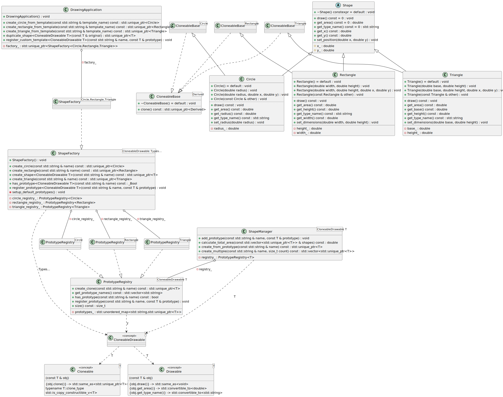

# t00096 - Test case for prototype design pattern using static polymorphism
## Config
```yaml
diagrams:
  t00096_class:
    type: class
    glob:
      - t00096.cc
    include:
      namespaces:
        - clanguml::t00096
    exclude:
      relationships:
        - dependency
    using_namespace: clanguml::t00096
```
## Source code
File `tests/t00096/t00096.cc`
```cpp
#include <concepts>
#include <memory>
#include <string>
#include <type_traits>
#include <unordered_map>
#include <vector>

namespace clanguml {
namespace t00096 {

// This concept defining the requirements for a cloneable type
template <typename T>
concept Cloneable = requires(const T &obj) {
    { obj.clone() } -> std::same_as<std::unique_ptr<T>>;
    typename T::clone_type;
    std::is_copy_constructible_v<T>;
};

// Concept for drawable objects
template <typename T>
concept Drawable = requires(const T &obj) {
    { obj.draw() } -> std::same_as<void>;
    { obj.get_area() } -> std::convertible_to<double>;
    { obj.get_type_name() } -> std::convertible_to<std::string>;
};

template <typename T>
concept CloneableDrawable = Cloneable<T> && Drawable<T>;

template <typename Derived> class CloneableBase {
public:
    using clone_type = Derived;

    std::unique_ptr<Derived> clone() const
    {
        return std::make_unique<Derived>(static_cast<const Derived &>(*this));
    }

    virtual ~CloneableBase() = default;
};

// Abstract shape interface (without virtual clone)
class Shape {
public:
    virtual ~Shape() = default;
    virtual void draw() const = 0;
    virtual double get_area() const = 0;
    virtual std::string get_type_name() const = 0;

    void set_position(double x, double y)
    {
        x_ = x;
        y_ = y;
    }
    double get_x() const { return x_; }
    double get_y() const { return y_; }

protected:
    double x_{0.0};
    double y_{0.0};
};

// Concrete shape: Circle
class Circle : public Shape, public CloneableBase<Circle> {
public:
    Circle() = default;

    explicit Circle(double radius)
        : radius_(radius)
    {
    }

    Circle(double radius, double x, double y)
        : radius_(radius)
    {
        x_ = x;
        y_ = y;
    }

    // Copy constructor for cloning
    Circle(const Circle &other)
        : radius_(other.radius_)
    {
        x_ = other.x_;
        y_ = other.y_;
    }

    void draw() const override { }

    double get_area() const override { return 3.14159 * radius_ * radius_; }

    std::string get_type_name() const override { return "Circle"; }

    void set_radius(double radius) { radius_ = radius; }
    double get_radius() const { return radius_; }

private:
    double radius_{1.0};
};

// Concrete shape: Rectangle
class Rectangle : public Shape, public CloneableBase<Rectangle> {
public:
    Rectangle() = default;

    Rectangle(double width, double height)
        : width_(width)
        , height_(height)
    {
    }

    Rectangle(double width, double height, double x, double y)
        : width_(width)
        , height_(height)
    {
        x_ = x;
        y_ = y;
    }

    // Copy constructor for cloning
    Rectangle(const Rectangle &other)
        : width_(other.width_)
        , height_(other.height_)
    {
        x_ = other.x_;
        y_ = other.y_;
    }

    void draw() const override { }

    double get_area() const override { return width_ * height_; }

    std::string get_type_name() const override { return "Rectangle"; }

    void set_dimensions(double width, double height)
    {
        width_ = width;
        height_ = height;
    }

    double get_width() const { return width_; }
    double get_height() const { return height_; }

private:
    double width_{1.0};
    double height_{1.0};
};

// Concrete shape: Triangle
class Triangle : public Shape, public CloneableBase<Triangle> {
public:
    Triangle() = default;

    Triangle(double base, double height)
        : base_(base)
        , height_(height)
    {
    }

    Triangle(double base, double height, double x, double y)
        : base_(base)
        , height_(height)
    {
        x_ = x;
        y_ = y;
    }

    // Copy constructor for cloning
    Triangle(const Triangle &other)
        : base_(other.base_)
        , height_(other.height_)
    {
        x_ = other.x_;
        y_ = other.y_;
    }

    void draw() const override { }

    double get_area() const override { return 0.5 * base_ * height_; }

    std::string get_type_name() const override { return "Triangle"; }

    void set_dimensions(double base, double height)
    {
        base_ = base;
        height_ = height;
    }

    double get_base() const { return base_; }
    double get_height() const { return height_; }

private:
    double base_{1.0};
    double height_{1.0};
};

// Template-based prototype registry
template <CloneableDrawable T> class PrototypeRegistry {
public:
    void register_prototype(const std::string &name, const T &prototype)
    {
        prototypes_[name] = std::make_unique<T>(prototype);
    }

    std::unique_ptr<T> create_clone(const std::string &name) const
    {
        auto it = prototypes_.find(name);
        if (it != prototypes_.end()) {
            return it->second->clone();
        }
        return nullptr;
    }

    bool has_prototype(const std::string &name) const
    {
        return prototypes_.find(name) != prototypes_.end();
    }

    std::vector<std::string> get_prototype_names() const
    {
        std::vector<std::string> names;
        for (const auto &pair : prototypes_) {
            names.push_back(pair.first);
        }
        return names;
    }

    size_t size() const { return prototypes_.size(); }

private:
    std::unordered_map<std::string, std::unique_ptr<T>> prototypes_;
};

// Template factory using prototype registries
template <CloneableDrawable... Types> class ShapeFactory {
public:
    ShapeFactory() { setup_default_prototypes(); }

    template <CloneableDrawable T>
    void register_prototype(const std::string &name, const T &prototype)
    {
        if constexpr (std::is_same_v<T, Circle>) {
            circle_registry_.register_prototype(name, prototype);
        }
        else if constexpr (std::is_same_v<T, Rectangle>) {
            rectangle_registry_.register_prototype(name, prototype);
        }
        else if constexpr (std::is_same_v<T, Triangle>) {
            triangle_registry_.register_prototype(name, prototype);
        }
    }

    template <CloneableDrawable T>
    std::unique_ptr<T> create_shape(const std::string &name) const
    {
        if constexpr (std::is_same_v<T, Circle>) {
            return circle_registry_.create_clone(name);
        }
        else if constexpr (std::is_same_v<T, Rectangle>) {
            return rectangle_registry_.create_clone(name);
        }
        else if constexpr (std::is_same_v<T, Triangle>) {
            return triangle_registry_.create_clone(name);
        }
        return nullptr;
    }

    std::unique_ptr<Circle> create_circle(const std::string &name) const
    {
        return circle_registry_.create_clone(name);
    }

    std::unique_ptr<Rectangle> create_rectangle(const std::string &name) const
    {
        return rectangle_registry_.create_clone(name);
    }

    std::unique_ptr<Triangle> create_triangle(const std::string &name) const
    {
        return triangle_registry_.create_clone(name);
    }

    template <CloneableDrawable T>
    bool has_prototype(const std::string &name) const
    {
        if constexpr (std::is_same_v<T, Circle>) {
            return circle_registry_.has_prototype(name);
        }
        else if constexpr (std::is_same_v<T, Rectangle>) {
            return rectangle_registry_.has_prototype(name);
        }
        else if constexpr (std::is_same_v<T, Triangle>) {
            return triangle_registry_.has_prototype(name);
        }
        return false;
    }

private:
    void setup_default_prototypes()
    {
        circle_registry_.register_prototype("default_circle", Circle(1.0));
        circle_registry_.register_prototype("large_circle", Circle(5.0));

        rectangle_registry_.register_prototype(
            "default_rectangle", Rectangle(2.0, 3.0));
        rectangle_registry_.register_prototype("square", Rectangle(2.0, 2.0));

        triangle_registry_.register_prototype(
            "default_triangle", Triangle(3.0, 4.0));
        triangle_registry_.register_prototype(
            "right_triangle", Triangle(3.0, 4.0));
    }

    PrototypeRegistry<Circle> circle_registry_;
    PrototypeRegistry<Rectangle> rectangle_registry_;
    PrototypeRegistry<Triangle> triangle_registry_;
};

// Generic cloning utility function
template <CloneableDrawable T> std::unique_ptr<T> clone_shape(const T &original)
{
    return original.clone();
}

// Template-based shape manager
template <CloneableDrawable T> class ShapeManager {
public:
    void add_prototype(const std::string &name, const T &prototype)
    {
        registry_.register_prototype(name, prototype);
    }

    std::unique_ptr<T> create_from_prototype(const std::string &name) const
    {
        return registry_.create_clone(name);
    }

    std::vector<std::unique_ptr<T>> create_multiple(
        const std::string &name, size_t count) const
    {
        std::vector<std::unique_ptr<T>> shapes;
        shapes.reserve(count);

        for (size_t i = 0; i < count; ++i) {
            auto shape = registry_.create_clone(name);
            if (shape) {
                shapes.push_back(std::move(shape));
            }
        }
        return shapes;
    }

    double calculate_total_area(
        const std::vector<std::unique_ptr<T>> &shapes) const
    {
        double total = 0.0;
        for (const auto &shape : shapes) {
            if (shape) {
                total += shape->get_area();
            }
        }
        return total;
    }

private:
    PrototypeRegistry<T> registry_;
};

// Application demonstrating template-based prototype usage
class DrawingApplication {
public:
    DrawingApplication()
        : factory_(
              std::make_unique<ShapeFactory<Circle, Rectangle, Triangle>>())
    {
    }

    std::unique_ptr<Circle> create_circle_from_template(
        const std::string &template_name) const
    {
        return factory_->create_circle(template_name);
    }

    std::unique_ptr<Rectangle> create_rectangle_from_template(
        const std::string &template_name) const
    {
        return factory_->create_rectangle(template_name);
    }

    std::unique_ptr<Triangle> create_triangle_from_template(
        const std::string &template_name) const
    {
        return factory_->create_triangle(template_name);
    }

    template <CloneableDrawable T>
    void register_custom_template(const std::string &name, const T &prototype)
    {
        factory_->register_prototype(name, prototype);
    }

    template <CloneableDrawable T>
    std::unique_ptr<T> duplicate_shape(const T &original)
    {
        return clone_shape(original);
    }

private:
    std::unique_ptr<ShapeFactory<Circle, Rectangle, Triangle>> factory_;
};

} // namespace t00096
} // namespace clanguml
```
## Generated PlantUML diagrams

## Generated Mermaid diagrams

## Generated JSON models
```json
{
  "diagram_type": "class",
  "elements": [
    {
      "display_name": "Cloneable<T>",
      "id": "7481243647547906680",
      "name": "Cloneable",
      "namespace": "clanguml::t00096",
      "parameters": [
        {
          "name": "obj",
          "type": "const T &"
        }
      ],
      "source_location": {
        "column": 9,
        "file": "t00096.cc",
        "line": 13,
        "translation_unit": "t00096.cc"
      },
      "statements": [
        "{obj.clone()} -> std::same_as<std::unique_ptr<T>>",
        "typename T::clone_type",
        "std::is_copy_constructible_v<T>"
      ],
      "type": "concept"
    },
    {
      "display_name": "Drawable<T>",
      "id": "3200437950935302478",
      "name": "Drawable",
      "namespace": "clanguml::t00096",
      "parameters": [
        {
          "name": "obj",
          "type": "const T &"
        }
      ],
      "source_location": {
        "column": 9,
        "file": "t00096.cc",
        "line": 21,
        "translation_unit": "t00096.cc"
      },
      "statements": [
        "{obj.draw()} -> std::same_as<void>",
        "{obj.get_area()} -> std::convertible_to<double>",
        "{obj.get_type_name()} -> std::convertible_to<std::string>"
      ],
      "type": "concept"
    },
    {
      "display_name": "CloneableDrawable<T>",
      "id": "4511592048356824665",
      "name": "CloneableDrawable",
      "namespace": "clanguml::t00096",
      "parameters": [],
      "source_location": {
        "column": 9,
        "file": "t00096.cc",
        "line": 28,
        "translation_unit": "t00096.cc"
      },
      "statements": [],
      "type": "concept"
    },
    {
      "bases": [],
      "display_name": "CloneableBase<Derived>",
      "id": "5927888907293943504",
      "is_abstract": false,
      "is_nested": false,
      "is_struct": false,
      "is_template": true,
      "is_union": false,
      "members": [],
      "methods": [
        {
          "access": "public",
          "display_name": "clone",
          "is_const": true,
          "is_consteval": false,
          "is_constexpr": false,
          "is_constructor": false,
          "is_copy_assignment": false,
          "is_coroutine": false,
          "is_defaulted": false,
          "is_deleted": false,
          "is_move_assignment": false,
          "is_noexcept": false,
          "is_operator": false,
          "is_pure_virtual": false,
          "is_static": false,
          "is_virtual": false,
          "name": "clone",
          "parameters": [],
          "source_location": {
            "column": 30,
            "file": "t00096.cc",
            "line": 34,
            "translation_unit": "t00096.cc"
          },
          "template_parameters": [],
          "type": "std::unique_ptr<Derived>"
        },
        {
          "access": "public",
          "display_name": "~CloneableBase",
          "is_const": false,
          "is_consteval": false,
          "is_constexpr": false,
          "is_constructor": false,
          "is_copy_assignment": false,
          "is_coroutine": false,
          "is_defaulted": true,
          "is_deleted": false,
          "is_move_assignment": false,
          "is_noexcept": false,
          "is_operator": false,
          "is_pure_virtual": false,
          "is_static": false,
          "is_virtual": true,
          "name": "~CloneableBase",
          "parameters": [],
          "source_location": {
            "column": 13,
            "file": "t00096.cc",
            "line": 39,
            "translation_unit": "t00096.cc"
          },
          "template_parameters": [],
          "type": "void"
        }
      ],
      "name": "CloneableBase",
      "namespace": "clanguml::t00096",
      "source_location": {
        "column": 35,
        "file": "t00096.cc",
        "line": 30,
        "translation_unit": "t00096.cc"
      },
      "template_parameters": [
        {
          "is_variadic": false,
          "kind": "template_type",
          "name": "Derived",
          "template_parameters": []
        }
      ],
      "type": "class"
    },
    {
      "bases": [],
      "display_name": "Shape",
      "id": "14958619769170201284",
      "is_abstract": true,
      "is_nested": false,
      "is_struct": false,
      "is_template": false,
      "is_union": false,
      "members": [
        {
          "access": "protected",
          "is_static": false,
          "name": "x_",
          "source_location": {
            "column": 12,
            "file": "t00096.cc",
            "line": 59,
            "translation_unit": "t00096.cc"
          },
          "type": "double"
        },
        {
          "access": "protected",
          "is_static": false,
          "name": "y_",
          "source_location": {
            "column": 12,
            "file": "t00096.cc",
            "line": 60,
            "translation_unit": "t00096.cc"
          },
          "type": "double"
        }
      ],
      "methods": [
        {
          "access": "public",
          "display_name": "~Shape",
          "is_const": false,
          "is_consteval": false,
          "is_constexpr": true,
          "is_constructor": false,
          "is_copy_assignment": false,
          "is_coroutine": false,
          "is_defaulted": true,
          "is_deleted": false,
          "is_move_assignment": false,
          "is_noexcept": false,
          "is_operator": false,
          "is_pure_virtual": false,
          "is_static": false,
          "is_virtual": true,
          "name": "~Shape",
          "parameters": [],
          "source_location": {
            "column": 13,
            "file": "t00096.cc",
            "line": 45,
            "translation_unit": "t00096.cc"
          },
          "template_parameters": [],
          "type": "void"
        },
        {
          "access": "public",
          "display_name": "draw",
          "is_const": true,
          "is_consteval": false,
          "is_constexpr": false,
          "is_constructor": false,
          "is_copy_assignment": false,
          "is_coroutine": false,
          "is_defaulted": false,
          "is_deleted": false,
          "is_move_assignment": false,
          "is_noexcept": false,
          "is_operator": false,
          "is_pure_virtual": true,
          "is_static": false,
          "is_virtual": true,
          "name": "draw",
          "parameters": [],
          "source_location": {
            "column": 18,
            "file": "t00096.cc",
            "line": 46,
            "translation_unit": "t00096.cc"
          },
          "template_parameters": [],
          "type": "void"
        },
        {
          "access": "public",
          "display_name": "get_area",
          "is_const": true,
          "is_consteval": false,
          "is_constexpr": false,
          "is_constructor": false,
          "is_copy_assignment": false,
          "is_coroutine": false,
          "is_defaulted": false,
          "is_deleted": false,
          "is_move_assignment": false,
          "is_noexcept": false,
          "is_operator": false,
          "is_pure_virtual": true,
          "is_static": false,
          "is_virtual": true,
          "name": "get_area",
          "parameters": [],
          "source_location": {
            "column": 20,
            "file": "t00096.cc",
            "line": 47,
            "translation_unit": "t00096.cc"
          },
          "template_parameters": [],
          "type": "double"
        },
        {
          "access": "public",
          "display_name": "get_type_name",
          "is_const": true,
          "is_consteval": false,
          "is_constexpr": false,
          "is_constructor": false,
          "is_copy_assignment": false,
          "is_coroutine": false,
          "is_defaulted": false,
          "is_deleted": false,
          "is_move_assignment": false,
          "is_noexcept": false,
          "is_operator": false,
          "is_pure_virtual": true,
          "is_static": false,
          "is_virtual": true,
          "name": "get_type_name",
          "parameters": [],
          "source_location": {
            "column": 25,
            "file": "t00096.cc",
            "line": 48,
            "translation_unit": "t00096.cc"
          },
          "template_parameters": [],
          "type": "std::string"
        },
        {
          "access": "public",
          "display_name": "set_position",
          "is_const": false,
          "is_consteval": false,
          "is_constexpr": false,
          "is_constructor": false,
          "is_copy_assignment": false,
          "is_coroutine": false,
          "is_defaulted": false,
          "is_deleted": false,
          "is_move_assignment": false,
          "is_noexcept": false,
          "is_operator": false,
          "is_pure_virtual": false,
          "is_static": false,
          "is_virtual": false,
          "name": "set_position",
          "parameters": [
            {
              "name": "x",
              "type": "double"
            },
            {
              "name": "y",
              "type": "double"
            }
          ],
          "source_location": {
            "column": 10,
            "file": "t00096.cc",
            "line": 50,
            "translation_unit": "t00096.cc"
          },
          "template_parameters": [],
          "type": "void"
        },
        {
          "access": "public",
          "display_name": "get_x",
          "is_const": true,
          "is_consteval": false,
          "is_constexpr": false,
          "is_constructor": false,
          "is_copy_assignment": false,
          "is_coroutine": false,
          "is_defaulted": false,
          "is_deleted": false,
          "is_move_assignment": false,
          "is_noexcept": false,
          "is_operator": false,
          "is_pure_virtual": false,
          "is_static": false,
          "is_virtual": false,
          "name": "get_x",
          "parameters": [],
          "source_location": {
            "column": 12,
            "file": "t00096.cc",
            "line": 55,
            "translation_unit": "t00096.cc"
          },
          "template_parameters": [],
          "type": "double"
        },
        {
          "access": "public",
          "display_name": "get_y",
          "is_const": true,
          "is_consteval": false,
          "is_constexpr": false,
          "is_constructor": false,
          "is_copy_assignment": false,
          "is_coroutine": false,
          "is_defaulted": false,
          "is_deleted": false,
          "is_move_assignment": false,
          "is_noexcept": false,
          "is_operator": false,
          "is_pure_virtual": false,
          "is_static": false,
          "is_virtual": false,
          "name": "get_y",
          "parameters": [],
          "source_location": {
            "column": 12,
            "file": "t00096.cc",
            "line": 56,
            "translation_unit": "t00096.cc"
          },
          "template_parameters": [],
          "type": "double"
        }
      ],
      "name": "Shape",
      "namespace": "clanguml::t00096",
      "source_location": {
        "column": 7,
        "file": "t00096.cc",
        "line": 43,
        "translation_unit": "t00096.cc"
      },
      "template_parameters": [],
      "type": "class"
    },
    {
      "bases": [],
      "display_name": "CloneableBase<Circle>",
      "id": "7182555910073084487",
      "is_abstract": false,
      "is_nested": false,
      "is_struct": false,
      "is_template": true,
      "is_union": false,
      "members": [],
      "methods": [],
      "name": "CloneableBase",
      "namespace": "clanguml::t00096",
      "source_location": {
        "column": 7,
        "file": "t00096.cc",
        "line": 64,
        "translation_unit": "t00096.cc"
      },
      "template_parameters": [
        {
          "is_variadic": false,
          "kind": "argument",
          "template_parameters": [],
          "type": "Circle"
        }
      ],
      "type": "class"
    },
    {
      "bases": [
        {
          "access": "public",
          "id": "14958619769170201284",
          "is_virtual": false
        },
        {
          "access": "public",
          "id": "7182555910073084487",
          "is_virtual": false
        }
      ],
      "display_name": "Circle",
      "id": "1478106619351220327",
      "is_abstract": false,
      "is_nested": false,
      "is_struct": false,
      "is_template": false,
      "is_union": false,
      "members": [
        {
          "access": "private",
          "is_static": false,
          "name": "radius_",
          "source_location": {
            "column": 12,
            "file": "t00096.cc",
            "line": 98,
            "translation_unit": "t00096.cc"
          },
          "type": "double"
        }
      ],
      "methods": [
        {
          "access": "public",
          "display_name": "Circle",
          "is_const": false,
          "is_consteval": false,
          "is_constexpr": false,
          "is_constructor": true,
          "is_copy_assignment": false,
          "is_coroutine": false,
          "is_defaulted": true,
          "is_deleted": false,
          "is_move_assignment": false,
          "is_noexcept": false,
          "is_operator": false,
          "is_pure_virtual": false,
          "is_static": false,
          "is_virtual": false,
          "name": "Circle",
          "parameters": [],
          "source_location": {
            "column": 5,
            "file": "t00096.cc",
            "line": 66,
            "translation_unit": "t00096.cc"
          },
          "template_parameters": [],
          "type": "void"
        },
        {
          "access": "public",
          "display_name": "Circle",
          "is_const": false,
          "is_consteval": false,
          "is_constexpr": false,
          "is_constructor": true,
          "is_copy_assignment": false,
          "is_coroutine": false,
          "is_defaulted": false,
          "is_deleted": false,
          "is_move_assignment": false,
          "is_noexcept": false,
          "is_operator": false,
          "is_pure_virtual": false,
          "is_static": false,
          "is_virtual": false,
          "name": "Circle",
          "parameters": [
            {
              "name": "radius",
              "type": "double"
            }
          ],
          "source_location": {
            "column": 14,
            "file": "t00096.cc",
            "line": 68,
            "translation_unit": "t00096.cc"
          },
          "template_parameters": [],
          "type": "void"
        },
        {
          "access": "public",
          "display_name": "Circle",
          "is_const": false,
          "is_consteval": false,
          "is_constexpr": false,
          "is_constructor": true,
          "is_copy_assignment": false,
          "is_coroutine": false,
          "is_defaulted": false,
          "is_deleted": false,
          "is_move_assignment": false,
          "is_noexcept": false,
          "is_operator": false,
          "is_pure_virtual": false,
          "is_static": false,
          "is_virtual": false,
          "name": "Circle",
          "parameters": [
            {
              "name": "radius",
              "type": "double"
            },
            {
              "name": "x",
              "type": "double"
            },
            {
              "name": "y",
              "type": "double"
            }
          ],
          "source_location": {
            "column": 5,
            "file": "t00096.cc",
            "line": 73,
            "translation_unit": "t00096.cc"
          },
          "template_parameters": [],
          "type": "void"
        },
        {
          "access": "public",
          "display_name": "Circle",
          "is_const": false,
          "is_consteval": false,
          "is_constexpr": false,
          "is_constructor": true,
          "is_copy_assignment": false,
          "is_coroutine": false,
          "is_defaulted": false,
          "is_deleted": false,
          "is_move_assignment": false,
          "is_noexcept": false,
          "is_operator": false,
          "is_pure_virtual": false,
          "is_static": false,
          "is_virtual": false,
          "name": "Circle",
          "parameters": [
            {
              "name": "other",
              "type": "const Circle &"
            }
          ],
          "source_location": {
            "column": 5,
            "file": "t00096.cc",
            "line": 81,
            "translation_unit": "t00096.cc"
          },
          "template_parameters": [],
          "type": "void"
        },
        {
          "access": "public",
          "display_name": "draw",
          "is_const": true,
          "is_consteval": false,
          "is_constexpr": false,
          "is_constructor": false,
          "is_copy_assignment": false,
          "is_coroutine": false,
          "is_defaulted": false,
          "is_deleted": false,
          "is_move_assignment": false,
          "is_noexcept": false,
          "is_operator": false,
          "is_pure_virtual": false,
          "is_static": false,
          "is_virtual": true,
          "name": "draw",
          "parameters": [],
          "source_location": {
            "column": 10,
            "file": "t00096.cc",
            "line": 88,
            "translation_unit": "t00096.cc"
          },
          "template_parameters": [],
          "type": "void"
        },
        {
          "access": "public",
          "display_name": "get_area",
          "is_const": true,
          "is_consteval": false,
          "is_constexpr": false,
          "is_constructor": false,
          "is_copy_assignment": false,
          "is_coroutine": false,
          "is_defaulted": false,
          "is_deleted": false,
          "is_move_assignment": false,
          "is_noexcept": false,
          "is_operator": false,
          "is_pure_virtual": false,
          "is_static": false,
          "is_virtual": true,
          "name": "get_area",
          "parameters": [],
          "source_location": {
            "column": 12,
            "file": "t00096.cc",
            "line": 90,
            "translation_unit": "t00096.cc"
          },
          "template_parameters": [],
          "type": "double"
        },
        {
          "access": "public",
          "display_name": "get_type_name",
          "is_const": true,
          "is_consteval": false,
          "is_constexpr": false,
          "is_constructor": false,
          "is_copy_assignment": false,
          "is_coroutine": false,
          "is_defaulted": false,
          "is_deleted": false,
          "is_move_assignment": false,
          "is_noexcept": false,
          "is_operator": false,
          "is_pure_virtual": false,
          "is_static": false,
          "is_virtual": true,
          "name": "get_type_name",
          "parameters": [],
          "source_location": {
            "column": 17,
            "file": "t00096.cc",
            "line": 92,
            "translation_unit": "t00096.cc"
          },
          "template_parameters": [],
          "type": "std::string"
        },
        {
          "access": "public",
          "display_name": "set_radius",
          "is_const": false,
          "is_consteval": false,
          "is_constexpr": false,
          "is_constructor": false,
          "is_copy_assignment": false,
          "is_coroutine": false,
          "is_defaulted": false,
          "is_deleted": false,
          "is_move_assignment": false,
          "is_noexcept": false,
          "is_operator": false,
          "is_pure_virtual": false,
          "is_static": false,
          "is_virtual": false,
          "name": "set_radius",
          "parameters": [
            {
              "name": "radius",
              "type": "double"
            }
          ],
          "source_location": {
            "column": 10,
            "file": "t00096.cc",
            "line": 94,
            "translation_unit": "t00096.cc"
          },
          "template_parameters": [],
          "type": "void"
        },
        {
          "access": "public",
          "display_name": "get_radius",
          "is_const": true,
          "is_consteval": false,
          "is_constexpr": false,
          "is_constructor": false,
          "is_copy_assignment": false,
          "is_coroutine": false,
          "is_defaulted": false,
          "is_deleted": false,
          "is_move_assignment": false,
          "is_noexcept": false,
          "is_operator": false,
          "is_pure_virtual": false,
          "is_static": false,
          "is_virtual": false,
          "name": "get_radius",
          "parameters": [],
          "source_location": {
            "column": 12,
            "file": "t00096.cc",
            "line": 95,
            "translation_unit": "t00096.cc"
          },
          "template_parameters": [],
          "type": "double"
        }
      ],
      "name": "Circle",
      "namespace": "clanguml::t00096",
      "source_location": {
        "column": 7,
        "file": "t00096.cc",
        "line": 64,
        "translation_unit": "t00096.cc"
      },
      "template_parameters": [],
      "type": "class"
    },
    {
      "bases": [],
      "display_name": "CloneableBase<Rectangle>",
      "id": "3605412105101326734",
      "is_abstract": false,
      "is_nested": false,
      "is_struct": false,
      "is_template": true,
      "is_union": false,
      "members": [],
      "methods": [],
      "name": "CloneableBase",
      "namespace": "clanguml::t00096",
      "source_location": {
        "column": 7,
        "file": "t00096.cc",
        "line": 102,
        "translation_unit": "t00096.cc"
      },
      "template_parameters": [
        {
          "is_variadic": false,
          "kind": "argument",
          "template_parameters": [],
          "type": "Rectangle"
        }
      ],
      "type": "class"
    },
    {
      "bases": [
        {
          "access": "public",
          "id": "14958619769170201284",
          "is_virtual": false
        },
        {
          "access": "public",
          "id": "3605412105101326734",
          "is_virtual": false
        }
      ],
      "display_name": "Rectangle",
      "id": "5923781825878215333",
      "is_abstract": false,
      "is_nested": false,
      "is_struct": false,
      "is_template": false,
      "is_union": false,
      "members": [
        {
          "access": "private",
          "is_static": false,
          "name": "width_",
          "source_location": {
            "column": 12,
            "file": "t00096.cc",
            "line": 145,
            "translation_unit": "t00096.cc"
          },
          "type": "double"
        },
        {
          "access": "private",
          "is_static": false,
          "name": "height_",
          "source_location": {
            "column": 12,
            "file": "t00096.cc",
            "line": 146,
            "translation_unit": "t00096.cc"
          },
          "type": "double"
        }
      ],
      "methods": [
        {
          "access": "public",
          "display_name": "Rectangle",
          "is_const": false,
          "is_consteval": false,
          "is_constexpr": false,
          "is_constructor": true,
          "is_copy_assignment": false,
          "is_coroutine": false,
          "is_defaulted": true,
          "is_deleted": false,
          "is_move_assignment": false,
          "is_noexcept": false,
          "is_operator": false,
          "is_pure_virtual": false,
          "is_static": false,
          "is_virtual": false,
          "name": "Rectangle",
          "parameters": [],
          "source_location": {
            "column": 5,
            "file": "t00096.cc",
            "line": 104,
            "translation_unit": "t00096.cc"
          },
          "template_parameters": [],
          "type": "void"
        },
        {
          "access": "public",
          "display_name": "Rectangle",
          "is_const": false,
          "is_consteval": false,
          "is_constexpr": false,
          "is_constructor": true,
          "is_copy_assignment": false,
          "is_coroutine": false,
          "is_defaulted": false,
          "is_deleted": false,
          "is_move_assignment": false,
          "is_noexcept": false,
          "is_operator": false,
          "is_pure_virtual": false,
          "is_static": false,
          "is_virtual": false,
          "name": "Rectangle",
          "parameters": [
            {
              "name": "width",
              "type": "double"
            },
            {
              "name": "height",
              "type": "double"
            }
          ],
          "source_location": {
            "column": 5,
            "file": "t00096.cc",
            "line": 106,
            "translation_unit": "t00096.cc"
          },
          "template_parameters": [],
          "type": "void"
        },
        {
          "access": "public",
          "display_name": "Rectangle",
          "is_const": false,
          "is_consteval": false,
          "is_constexpr": false,
          "is_constructor": true,
          "is_copy_assignment": false,
          "is_coroutine": false,
          "is_defaulted": false,
          "is_deleted": false,
          "is_move_assignment": false,
          "is_noexcept": false,
          "is_operator": false,
          "is_pure_virtual": false,
          "is_static": false,
          "is_virtual": false,
          "name": "Rectangle",
          "parameters": [
            {
              "name": "width",
              "type": "double"
            },
            {
              "name": "height",
              "type": "double"
            },
            {
              "name": "x",
              "type": "double"
            },
            {
              "name": "y",
              "type": "double"
            }
          ],
          "source_location": {
            "column": 5,
            "file": "t00096.cc",
            "line": 112,
            "translation_unit": "t00096.cc"
          },
          "template_parameters": [],
          "type": "void"
        },
        {
          "access": "public",
          "display_name": "Rectangle",
          "is_const": false,
          "is_consteval": false,
          "is_constexpr": false,
          "is_constructor": true,
          "is_copy_assignment": false,
          "is_coroutine": false,
          "is_defaulted": false,
          "is_deleted": false,
          "is_move_assignment": false,
          "is_noexcept": false,
          "is_operator": false,
          "is_pure_virtual": false,
          "is_static": false,
          "is_virtual": false,
          "name": "Rectangle",
          "parameters": [
            {
              "name": "other",
              "type": "const Rectangle &"
            }
          ],
          "source_location": {
            "column": 5,
            "file": "t00096.cc",
            "line": 121,
            "translation_unit": "t00096.cc"
          },
          "template_parameters": [],
          "type": "void"
        },
        {
          "access": "public",
          "display_name": "draw",
          "is_const": true,
          "is_consteval": false,
          "is_constexpr": false,
          "is_constructor": false,
          "is_copy_assignment": false,
          "is_coroutine": false,
          "is_defaulted": false,
          "is_deleted": false,
          "is_move_assignment": false,
          "is_noexcept": false,
          "is_operator": false,
          "is_pure_virtual": false,
          "is_static": false,
          "is_virtual": true,
          "name": "draw",
          "parameters": [],
          "source_location": {
            "column": 10,
            "file": "t00096.cc",
            "line": 129,
            "translation_unit": "t00096.cc"
          },
          "template_parameters": [],
          "type": "void"
        },
        {
          "access": "public",
          "display_name": "get_area",
          "is_const": true,
          "is_consteval": false,
          "is_constexpr": false,
          "is_constructor": false,
          "is_copy_assignment": false,
          "is_coroutine": false,
          "is_defaulted": false,
          "is_deleted": false,
          "is_move_assignment": false,
          "is_noexcept": false,
          "is_operator": false,
          "is_pure_virtual": false,
          "is_static": false,
          "is_virtual": true,
          "name": "get_area",
          "parameters": [],
          "source_location": {
            "column": 12,
            "file": "t00096.cc",
            "line": 131,
            "translation_unit": "t00096.cc"
          },
          "template_parameters": [],
          "type": "double"
        },
        {
          "access": "public",
          "display_name": "get_type_name",
          "is_const": true,
          "is_consteval": false,
          "is_constexpr": false,
          "is_constructor": false,
          "is_copy_assignment": false,
          "is_coroutine": false,
          "is_defaulted": false,
          "is_deleted": false,
          "is_move_assignment": false,
          "is_noexcept": false,
          "is_operator": false,
          "is_pure_virtual": false,
          "is_static": false,
          "is_virtual": true,
          "name": "get_type_name",
          "parameters": [],
          "source_location": {
            "column": 17,
            "file": "t00096.cc",
            "line": 133,
            "translation_unit": "t00096.cc"
          },
          "template_parameters": [],
          "type": "std::string"
        },
        {
          "access": "public",
          "display_name": "set_dimensions",
          "is_const": false,
          "is_consteval": false,
          "is_constexpr": false,
          "is_constructor": false,
          "is_copy_assignment": false,
          "is_coroutine": false,
          "is_defaulted": false,
          "is_deleted": false,
          "is_move_assignment": false,
          "is_noexcept": false,
          "is_operator": false,
          "is_pure_virtual": false,
          "is_static": false,
          "is_virtual": false,
          "name": "set_dimensions",
          "parameters": [
            {
              "name": "width",
              "type": "double"
            },
            {
              "name": "height",
              "type": "double"
            }
          ],
          "source_location": {
            "column": 10,
            "file": "t00096.cc",
            "line": 135,
            "translation_unit": "t00096.cc"
          },
          "template_parameters": [],
          "type": "void"
        },
        {
          "access": "public",
          "display_name": "get_width",
          "is_const": true,
          "is_consteval": false,
          "is_constexpr": false,
          "is_constructor": false,
          "is_copy_assignment": false,
          "is_coroutine": false,
          "is_defaulted": false,
          "is_deleted": false,
          "is_move_assignment": false,
          "is_noexcept": false,
          "is_operator": false,
          "is_pure_virtual": false,
          "is_static": false,
          "is_virtual": false,
          "name": "get_width",
          "parameters": [],
          "source_location": {
            "column": 12,
            "file": "t00096.cc",
            "line": 141,
            "translation_unit": "t00096.cc"
          },
          "template_parameters": [],
          "type": "double"
        },
        {
          "access": "public",
          "display_name": "get_height",
          "is_const": true,
          "is_consteval": false,
          "is_constexpr": false,
          "is_constructor": false,
          "is_copy_assignment": false,
          "is_coroutine": false,
          "is_defaulted": false,
          "is_deleted": false,
          "is_move_assignment": false,
          "is_noexcept": false,
          "is_operator": false,
          "is_pure_virtual": false,
          "is_static": false,
          "is_virtual": false,
          "name": "get_height",
          "parameters": [],
          "source_location": {
            "column": 12,
            "file": "t00096.cc",
            "line": 142,
            "translation_unit": "t00096.cc"
          },
          "template_parameters": [],
          "type": "double"
        }
      ],
      "name": "Rectangle",
      "namespace": "clanguml::t00096",
      "source_location": {
        "column": 7,
        "file": "t00096.cc",
        "line": 102,
        "translation_unit": "t00096.cc"
      },
      "template_parameters": [],
      "type": "class"
    },
    {
      "bases": [],
      "display_name": "CloneableBase<Triangle>",
      "id": "16579460110297851869",
      "is_abstract": false,
      "is_nested": false,
      "is_struct": false,
      "is_template": true,
      "is_union": false,
      "members": [],
      "methods": [],
      "name": "CloneableBase",
      "namespace": "clanguml::t00096",
      "source_location": {
        "column": 7,
        "file": "t00096.cc",
        "line": 150,
        "translation_unit": "t00096.cc"
      },
      "template_parameters": [
        {
          "is_variadic": false,
          "kind": "argument",
          "template_parameters": [],
          "type": "Triangle"
        }
      ],
      "type": "class"
    },
    {
      "bases": [
        {
          "access": "public",
          "id": "14958619769170201284",
          "is_virtual": false
        },
        {
          "access": "public",
          "id": "16579460110297851869",
          "is_virtual": false
        }
      ],
      "display_name": "Triangle",
      "id": "6870936089061531148",
      "is_abstract": false,
      "is_nested": false,
      "is_struct": false,
      "is_template": false,
      "is_union": false,
      "members": [
        {
          "access": "private",
          "is_static": false,
          "name": "base_",
          "source_location": {
            "column": 12,
            "file": "t00096.cc",
            "line": 193,
            "translation_unit": "t00096.cc"
          },
          "type": "double"
        },
        {
          "access": "private",
          "is_static": false,
          "name": "height_",
          "source_location": {
            "column": 12,
            "file": "t00096.cc",
            "line": 194,
            "translation_unit": "t00096.cc"
          },
          "type": "double"
        }
      ],
      "methods": [
        {
          "access": "public",
          "display_name": "Triangle",
          "is_const": false,
          "is_consteval": false,
          "is_constexpr": false,
          "is_constructor": true,
          "is_copy_assignment": false,
          "is_coroutine": false,
          "is_defaulted": true,
          "is_deleted": false,
          "is_move_assignment": false,
          "is_noexcept": false,
          "is_operator": false,
          "is_pure_virtual": false,
          "is_static": false,
          "is_virtual": false,
          "name": "Triangle",
          "parameters": [],
          "source_location": {
            "column": 5,
            "file": "t00096.cc",
            "line": 152,
            "translation_unit": "t00096.cc"
          },
          "template_parameters": [],
          "type": "void"
        },
        {
          "access": "public",
          "display_name": "Triangle",
          "is_const": false,
          "is_consteval": false,
          "is_constexpr": false,
          "is_constructor": true,
          "is_copy_assignment": false,
          "is_coroutine": false,
          "is_defaulted": false,
          "is_deleted": false,
          "is_move_assignment": false,
          "is_noexcept": false,
          "is_operator": false,
          "is_pure_virtual": false,
          "is_static": false,
          "is_virtual": false,
          "name": "Triangle",
          "parameters": [
            {
              "name": "base",
              "type": "double"
            },
            {
              "name": "height",
              "type": "double"
            }
          ],
          "source_location": {
            "column": 5,
            "file": "t00096.cc",
            "line": 154,
            "translation_unit": "t00096.cc"
          },
          "template_parameters": [],
          "type": "void"
        },
        {
          "access": "public",
          "display_name": "Triangle",
          "is_const": false,
          "is_consteval": false,
          "is_constexpr": false,
          "is_constructor": true,
          "is_copy_assignment": false,
          "is_coroutine": false,
          "is_defaulted": false,
          "is_deleted": false,
          "is_move_assignment": false,
          "is_noexcept": false,
          "is_operator": false,
          "is_pure_virtual": false,
          "is_static": false,
          "is_virtual": false,
          "name": "Triangle",
          "parameters": [
            {
              "name": "base",
              "type": "double"
            },
            {
              "name": "height",
              "type": "double"
            },
            {
              "name": "x",
              "type": "double"
            },
            {
              "name": "y",
              "type": "double"
            }
          ],
          "source_location": {
            "column": 5,
            "file": "t00096.cc",
            "line": 160,
            "translation_unit": "t00096.cc"
          },
          "template_parameters": [],
          "type": "void"
        },
        {
          "access": "public",
          "display_name": "Triangle",
          "is_const": false,
          "is_consteval": false,
          "is_constexpr": false,
          "is_constructor": true,
          "is_copy_assignment": false,
          "is_coroutine": false,
          "is_defaulted": false,
          "is_deleted": false,
          "is_move_assignment": false,
          "is_noexcept": false,
          "is_operator": false,
          "is_pure_virtual": false,
          "is_static": false,
          "is_virtual": false,
          "name": "Triangle",
          "parameters": [
            {
              "name": "other",
              "type": "const Triangle &"
            }
          ],
          "source_location": {
            "column": 5,
            "file": "t00096.cc",
            "line": 169,
            "translation_unit": "t00096.cc"
          },
          "template_parameters": [],
          "type": "void"
        },
        {
          "access": "public",
          "display_name": "draw",
          "is_const": true,
          "is_consteval": false,
          "is_constexpr": false,
          "is_constructor": false,
          "is_copy_assignment": false,
          "is_coroutine": false,
          "is_defaulted": false,
          "is_deleted": false,
          "is_move_assignment": false,
          "is_noexcept": false,
          "is_operator": false,
          "is_pure_virtual": false,
          "is_static": false,
          "is_virtual": true,
          "name": "draw",
          "parameters": [],
          "source_location": {
            "column": 10,
            "file": "t00096.cc",
            "line": 177,
            "translation_unit": "t00096.cc"
          },
          "template_parameters": [],
          "type": "void"
        },
        {
          "access": "public",
          "display_name": "get_area",
          "is_const": true,
          "is_consteval": false,
          "is_constexpr": false,
          "is_constructor": false,
          "is_copy_assignment": false,
          "is_coroutine": false,
          "is_defaulted": false,
          "is_deleted": false,
          "is_move_assignment": false,
          "is_noexcept": false,
          "is_operator": false,
          "is_pure_virtual": false,
          "is_static": false,
          "is_virtual": true,
          "name": "get_area",
          "parameters": [],
          "source_location": {
            "column": 12,
            "file": "t00096.cc",
            "line": 179,
            "translation_unit": "t00096.cc"
          },
          "template_parameters": [],
          "type": "double"
        },
        {
          "access": "public",
          "display_name": "get_type_name",
          "is_const": true,
          "is_consteval": false,
          "is_constexpr": false,
          "is_constructor": false,
          "is_copy_assignment": false,
          "is_coroutine": false,
          "is_defaulted": false,
          "is_deleted": false,
          "is_move_assignment": false,
          "is_noexcept": false,
          "is_operator": false,
          "is_pure_virtual": false,
          "is_static": false,
          "is_virtual": true,
          "name": "get_type_name",
          "parameters": [],
          "source_location": {
            "column": 17,
            "file": "t00096.cc",
            "line": 181,
            "translation_unit": "t00096.cc"
          },
          "template_parameters": [],
          "type": "std::string"
        },
        {
          "access": "public",
          "display_name": "set_dimensions",
          "is_const": false,
          "is_consteval": false,
          "is_constexpr": false,
          "is_constructor": false,
          "is_copy_assignment": false,
          "is_coroutine": false,
          "is_defaulted": false,
          "is_deleted": false,
          "is_move_assignment": false,
          "is_noexcept": false,
          "is_operator": false,
          "is_pure_virtual": false,
          "is_static": false,
          "is_virtual": false,
          "name": "set_dimensions",
          "parameters": [
            {
              "name": "base",
              "type": "double"
            },
            {
              "name": "height",
              "type": "double"
            }
          ],
          "source_location": {
            "column": 10,
            "file": "t00096.cc",
            "line": 183,
            "translation_unit": "t00096.cc"
          },
          "template_parameters": [],
          "type": "void"
        },
        {
          "access": "public",
          "display_name": "get_base",
          "is_const": true,
          "is_consteval": false,
          "is_constexpr": false,
          "is_constructor": false,
          "is_copy_assignment": false,
          "is_coroutine": false,
          "is_defaulted": false,
          "is_deleted": false,
          "is_move_assignment": false,
          "is_noexcept": false,
          "is_operator": false,
          "is_pure_virtual": false,
          "is_static": false,
          "is_virtual": false,
          "name": "get_base",
          "parameters": [],
          "source_location": {
            "column": 12,
            "file": "t00096.cc",
            "line": 189,
            "translation_unit": "t00096.cc"
          },
          "template_parameters": [],
          "type": "double"
        },
        {
          "access": "public",
          "display_name": "get_height",
          "is_const": true,
          "is_consteval": false,
          "is_constexpr": false,
          "is_constructor": false,
          "is_copy_assignment": false,
          "is_coroutine": false,
          "is_defaulted": false,
          "is_deleted": false,
          "is_move_assignment": false,
          "is_noexcept": false,
          "is_operator": false,
          "is_pure_virtual": false,
          "is_static": false,
          "is_virtual": false,
          "name": "get_height",
          "parameters": [],
          "source_location": {
            "column": 12,
            "file": "t00096.cc",
            "line": 190,
            "translation_unit": "t00096.cc"
          },
          "template_parameters": [],
          "type": "double"
        }
      ],
      "name": "Triangle",
      "namespace": "clanguml::t00096",
      "source_location": {
        "column": 7,
        "file": "t00096.cc",
        "line": 150,
        "translation_unit": "t00096.cc"
      },
      "template_parameters": [],
      "type": "class"
    },
    {
      "bases": [],
      "display_name": "PrototypeRegistry<CloneableDrawable T>",
      "id": "5620052981910870275",
      "is_abstract": false,
      "is_nested": false,
      "is_struct": false,
      "is_template": true,
      "is_union": false,
      "members": [
        {
          "access": "private",
          "is_static": false,
          "name": "prototypes_",
          "source_location": {
            "column": 57,
            "file": "t00096.cc",
            "line": 231,
            "translation_unit": "t00096.cc"
          },
          "type": "std::unordered_map<std::string,std::unique_ptr<T>>"
        }
      ],
      "methods": [
        {
          "access": "public",
          "display_name": "register_prototype",
          "is_const": false,
          "is_consteval": false,
          "is_constexpr": false,
          "is_constructor": false,
          "is_copy_assignment": false,
          "is_coroutine": false,
          "is_defaulted": false,
          "is_deleted": false,
          "is_move_assignment": false,
          "is_noexcept": false,
          "is_operator": false,
          "is_pure_virtual": false,
          "is_static": false,
          "is_virtual": false,
          "name": "register_prototype",
          "parameters": [
            {
              "name": "name",
              "type": "const std::string &"
            },
            {
              "name": "prototype",
              "type": "const T &"
            }
          ],
          "source_location": {
            "column": 10,
            "file": "t00096.cc",
            "line": 200,
            "translation_unit": "t00096.cc"
          },
          "template_parameters": [],
          "type": "void"
        },
        {
          "access": "public",
          "display_name": "create_clone",
          "is_const": true,
          "is_consteval": false,
          "is_constexpr": false,
          "is_constructor": false,
          "is_copy_assignment": false,
          "is_coroutine": false,
          "is_defaulted": false,
          "is_deleted": false,
          "is_move_assignment": false,
          "is_noexcept": false,
          "is_operator": false,
          "is_pure_virtual": false,
          "is_static": false,
          "is_virtual": false,
          "name": "create_clone",
          "parameters": [
            {
              "name": "name",
              "type": "const std::string &"
            }
          ],
          "source_location": {
            "column": 24,
            "file": "t00096.cc",
            "line": 205,
            "translation_unit": "t00096.cc"
          },
          "template_parameters": [],
          "type": "std::unique_ptr<T>"
        },
        {
          "access": "public",
          "display_name": "has_prototype",
          "is_const": true,
          "is_consteval": false,
          "is_constexpr": false,
          "is_constructor": false,
          "is_copy_assignment": false,
          "is_coroutine": false,
          "is_defaulted": false,
          "is_deleted": false,
          "is_move_assignment": false,
          "is_noexcept": false,
          "is_operator": false,
          "is_pure_virtual": false,
          "is_static": false,
          "is_virtual": false,
          "name": "has_prototype",
          "parameters": [
            {
              "name": "name",
              "type": "const std::string &"
            }
          ],
          "source_location": {
            "column": 10,
            "file": "t00096.cc",
            "line": 214,
            "translation_unit": "t00096.cc"
          },
          "template_parameters": [],
          "type": "bool"
        },
        {
          "access": "public",
          "display_name": "get_prototype_names",
          "is_const": true,
          "is_consteval": false,
          "is_constexpr": false,
          "is_constructor": false,
          "is_copy_assignment": false,
          "is_coroutine": false,
          "is_defaulted": false,
          "is_deleted": false,
          "is_move_assignment": false,
          "is_noexcept": false,
          "is_operator": false,
          "is_pure_virtual": false,
          "is_static": false,
          "is_virtual": false,
          "name": "get_prototype_names",
          "parameters": [],
          "source_location": {
            "column": 30,
            "file": "t00096.cc",
            "line": 219,
            "translation_unit": "t00096.cc"
          },
          "template_parameters": [],
          "type": "std::vector<std::string>"
        },
        {
          "access": "public",
          "display_name": "size",
          "is_const": true,
          "is_consteval": false,
          "is_constexpr": false,
          "is_constructor": false,
          "is_copy_assignment": false,
          "is_coroutine": false,
          "is_defaulted": false,
          "is_deleted": false,
          "is_move_assignment": false,
          "is_noexcept": false,
          "is_operator": false,
          "is_pure_virtual": false,
          "is_static": false,
          "is_virtual": false,
          "name": "size",
          "parameters": [],
          "source_location": {
            "column": 12,
            "file": "t00096.cc",
            "line": 228,
            "translation_unit": "t00096.cc"
          },
          "template_parameters": [],
          "type": "size_t"
        }
      ],
      "name": "PrototypeRegistry",
      "namespace": "clanguml::t00096",
      "source_location": {
        "column": 38,
        "file": "t00096.cc",
        "line": 198,
        "translation_unit": "t00096.cc"
      },
      "template_parameters": [
        {
          "is_variadic": false,
          "kind": "template_type",
          "name": "T",
          "template_parameters": []
        }
      ],
      "type": "class"
    },
    {
      "bases": [],
      "display_name": "PrototypeRegistry<Circle>",
      "id": "1971209884753098161",
      "is_abstract": false,
      "is_nested": false,
      "is_struct": false,
      "is_template": true,
      "is_union": false,
      "members": [],
      "methods": [],
      "name": "PrototypeRegistry",
      "namespace": "clanguml::t00096",
      "source_location": {
        "column": 31,
        "file": "t00096.cc",
        "line": 314,
        "translation_unit": "t00096.cc"
      },
      "template_parameters": [
        {
          "is_variadic": false,
          "kind": "argument",
          "template_parameters": [],
          "type": "Circle"
        }
      ],
      "type": "class"
    },
    {
      "bases": [],
      "display_name": "PrototypeRegistry<Rectangle>",
      "id": "11908914043221639521",
      "is_abstract": false,
      "is_nested": false,
      "is_struct": false,
      "is_template": true,
      "is_union": false,
      "members": [],
      "methods": [],
      "name": "PrototypeRegistry",
      "namespace": "clanguml::t00096",
      "source_location": {
        "column": 34,
        "file": "t00096.cc",
        "line": 315,
        "translation_unit": "t00096.cc"
      },
      "template_parameters": [
        {
          "is_variadic": false,
          "kind": "argument",
          "template_parameters": [],
          "type": "Rectangle"
        }
      ],
      "type": "class"
    },
    {
      "bases": [],
      "display_name": "PrototypeRegistry<Triangle>",
      "id": "1098676982460595195",
      "is_abstract": false,
      "is_nested": false,
      "is_struct": false,
      "is_template": true,
      "is_union": false,
      "members": [],
      "methods": [],
      "name": "PrototypeRegistry",
      "namespace": "clanguml::t00096",
      "source_location": {
        "column": 33,
        "file": "t00096.cc",
        "line": 316,
        "translation_unit": "t00096.cc"
      },
      "template_parameters": [
        {
          "is_variadic": false,
          "kind": "argument",
          "template_parameters": [],
          "type": "Triangle"
        }
      ],
      "type": "class"
    },
    {
      "bases": [],
      "display_name": "ShapeFactory<CloneableDrawable Types...>",
      "id": "4496949720443545673",
      "is_abstract": false,
      "is_nested": false,
      "is_struct": false,
      "is_template": true,
      "is_union": false,
      "members": [
        {
          "access": "private",
          "is_static": false,
          "name": "circle_registry_",
          "source_location": {
            "column": 31,
            "file": "t00096.cc",
            "line": 314,
            "translation_unit": "t00096.cc"
          },
          "type": "PrototypeRegistry<Circle>"
        },
        {
          "access": "private",
          "is_static": false,
          "name": "rectangle_registry_",
          "source_location": {
            "column": 34,
            "file": "t00096.cc",
            "line": 315,
            "translation_unit": "t00096.cc"
          },
          "type": "PrototypeRegistry<Rectangle>"
        },
        {
          "access": "private",
          "is_static": false,
          "name": "triangle_registry_",
          "source_location": {
            "column": 33,
            "file": "t00096.cc",
            "line": 316,
            "translation_unit": "t00096.cc"
          },
          "type": "PrototypeRegistry<Triangle>"
        }
      ],
      "methods": [
        {
          "access": "public",
          "display_name": "ShapeFactory",
          "is_const": false,
          "is_consteval": false,
          "is_constexpr": false,
          "is_constructor": true,
          "is_copy_assignment": false,
          "is_coroutine": false,
          "is_defaulted": false,
          "is_deleted": false,
          "is_move_assignment": false,
          "is_noexcept": false,
          "is_operator": false,
          "is_pure_virtual": false,
          "is_static": false,
          "is_virtual": false,
          "name": "ShapeFactory",
          "parameters": [],
          "source_location": {
            "column": 5,
            "file": "t00096.cc",
            "line": 237,
            "translation_unit": "t00096.cc"
          },
          "template_parameters": [],
          "type": "void"
        },
        {
          "access": "public",
          "display_name": "create_circle",
          "is_const": true,
          "is_consteval": false,
          "is_constexpr": false,
          "is_constructor": false,
          "is_copy_assignment": false,
          "is_coroutine": false,
          "is_defaulted": false,
          "is_deleted": false,
          "is_move_assignment": false,
          "is_noexcept": false,
          "is_operator": false,
          "is_pure_virtual": false,
          "is_static": false,
          "is_virtual": false,
          "name": "create_circle",
          "parameters": [
            {
              "name": "name",
              "type": "const std::string &"
            }
          ],
          "source_location": {
            "column": 29,
            "file": "t00096.cc",
            "line": 268,
            "translation_unit": "t00096.cc"
          },
          "template_parameters": [],
          "type": "std::unique_ptr<Circle>"
        },
        {
          "access": "public",
          "display_name": "create_rectangle",
          "is_const": true,
          "is_consteval": false,
          "is_constexpr": false,
          "is_constructor": false,
          "is_copy_assignment": false,
          "is_coroutine": false,
          "is_defaulted": false,
          "is_deleted": false,
          "is_move_assignment": false,
          "is_noexcept": false,
          "is_operator": false,
          "is_pure_virtual": false,
          "is_static": false,
          "is_virtual": false,
          "name": "create_rectangle",
          "parameters": [
            {
              "name": "name",
              "type": "const std::string &"
            }
          ],
          "source_location": {
            "column": 32,
            "file": "t00096.cc",
            "line": 273,
            "translation_unit": "t00096.cc"
          },
          "template_parameters": [],
          "type": "std::unique_ptr<Rectangle>"
        },
        {
          "access": "public",
          "display_name": "create_triangle",
          "is_const": true,
          "is_consteval": false,
          "is_constexpr": false,
          "is_constructor": false,
          "is_copy_assignment": false,
          "is_coroutine": false,
          "is_defaulted": false,
          "is_deleted": false,
          "is_move_assignment": false,
          "is_noexcept": false,
          "is_operator": false,
          "is_pure_virtual": false,
          "is_static": false,
          "is_virtual": false,
          "name": "create_triangle",
          "parameters": [
            {
              "name": "name",
              "type": "const std::string &"
            }
          ],
          "source_location": {
            "column": 31,
            "file": "t00096.cc",
            "line": 278,
            "translation_unit": "t00096.cc"
          },
          "template_parameters": [],
          "type": "std::unique_ptr<Triangle>"
        },
        {
          "access": "private",
          "display_name": "setup_default_prototypes",
          "is_const": false,
          "is_consteval": false,
          "is_constexpr": false,
          "is_constructor": false,
          "is_copy_assignment": false,
          "is_coroutine": false,
          "is_defaulted": false,
          "is_deleted": false,
          "is_move_assignment": false,
          "is_noexcept": false,
          "is_operator": false,
          "is_pure_virtual": false,
          "is_static": false,
          "is_virtual": false,
          "name": "setup_default_prototypes",
          "parameters": [],
          "source_location": {
            "column": 10,
            "file": "t00096.cc",
            "line": 299,
            "translation_unit": "t00096.cc"
          },
          "template_parameters": [],
          "type": "void"
        },
        {
          "access": "public",
          "display_name": "register_prototype<CloneableDrawable T>",
          "is_const": false,
          "is_consteval": false,
          "is_constexpr": false,
          "is_constructor": false,
          "is_copy_assignment": false,
          "is_coroutine": false,
          "is_defaulted": false,
          "is_deleted": false,
          "is_move_assignment": false,
          "is_noexcept": false,
          "is_operator": false,
          "is_pure_virtual": false,
          "is_static": false,
          "is_virtual": false,
          "name": "register_prototype",
          "parameters": [
            {
              "name": "name",
              "type": "const std::string &"
            },
            {
              "name": "prototype",
              "type": "const T &"
            }
          ],
          "template_parameters": [
            {
              "is_variadic": false,
              "kind": "template_type",
              "name": "T",
              "template_parameters": []
            }
          ],
          "type": "void"
        },
        {
          "access": "public",
          "display_name": "create_shape<CloneableDrawable T>",
          "is_const": true,
          "is_consteval": false,
          "is_constexpr": false,
          "is_constructor": false,
          "is_copy_assignment": false,
          "is_coroutine": false,
          "is_defaulted": false,
          "is_deleted": false,
          "is_move_assignment": false,
          "is_noexcept": false,
          "is_operator": false,
          "is_pure_virtual": false,
          "is_static": false,
          "is_virtual": false,
          "name": "create_shape",
          "parameters": [
            {
              "name": "name",
              "type": "const std::string &"
            }
          ],
          "template_parameters": [
            {
              "is_variadic": false,
              "kind": "template_type",
              "name": "T",
              "template_parameters": []
            }
          ],
          "type": "std::unique_ptr<T>"
        },
        {
          "access": "public",
          "display_name": "has_prototype<CloneableDrawable T>",
          "is_const": true,
          "is_consteval": false,
          "is_constexpr": false,
          "is_constructor": false,
          "is_copy_assignment": false,
          "is_coroutine": false,
          "is_defaulted": false,
          "is_deleted": false,
          "is_move_assignment": false,
          "is_noexcept": false,
          "is_operator": false,
          "is_pure_virtual": false,
          "is_static": false,
          "is_virtual": false,
          "name": "has_prototype",
          "parameters": [
            {
              "name": "name",
              "type": "const std::string &"
            }
          ],
          "template_parameters": [
            {
              "is_variadic": false,
              "kind": "template_type",
              "name": "T",
              "template_parameters": []
            }
          ],
          "type": "_Bool"
        }
      ],
      "name": "ShapeFactory",
      "namespace": "clanguml::t00096",
      "source_location": {
        "column": 45,
        "file": "t00096.cc",
        "line": 235,
        "translation_unit": "t00096.cc"
      },
      "template_parameters": [
        {
          "is_variadic": true,
          "kind": "template_type",
          "name": "Types...",
          "template_parameters": []
        }
      ],
      "type": "class"
    },
    {
      "bases": [],
      "display_name": "ShapeManager<CloneableDrawable T>",
      "id": "729651914804965101",
      "is_abstract": false,
      "is_nested": false,
      "is_struct": false,
      "is_template": true,
      "is_union": false,
      "members": [
        {
          "access": "private",
          "is_static": false,
          "name": "registry_",
          "source_location": {
            "column": 26,
            "file": "t00096.cc",
            "line": 366,
            "translation_unit": "t00096.cc"
          },
          "type": "PrototypeRegistry<T>"
        }
      ],
      "methods": [
        {
          "access": "public",
          "display_name": "add_prototype",
          "is_const": false,
          "is_consteval": false,
          "is_constexpr": false,
          "is_constructor": false,
          "is_copy_assignment": false,
          "is_coroutine": false,
          "is_defaulted": false,
          "is_deleted": false,
          "is_move_assignment": false,
          "is_noexcept": false,
          "is_operator": false,
          "is_pure_virtual": false,
          "is_static": false,
          "is_virtual": false,
          "name": "add_prototype",
          "parameters": [
            {
              "name": "name",
              "type": "const std::string &"
            },
            {
              "name": "prototype",
              "type": "const T &"
            }
          ],
          "source_location": {
            "column": 10,
            "file": "t00096.cc",
            "line": 328,
            "translation_unit": "t00096.cc"
          },
          "template_parameters": [],
          "type": "void"
        },
        {
          "access": "public",
          "display_name": "create_from_prototype",
          "is_const": true,
          "is_consteval": false,
          "is_constexpr": false,
          "is_constructor": false,
          "is_copy_assignment": false,
          "is_coroutine": false,
          "is_defaulted": false,
          "is_deleted": false,
          "is_move_assignment": false,
          "is_noexcept": false,
          "is_operator": false,
          "is_pure_virtual": false,
          "is_static": false,
          "is_virtual": false,
          "name": "create_from_prototype",
          "parameters": [
            {
              "name": "name",
              "type": "const std::string &"
            }
          ],
          "source_location": {
            "column": 24,
            "file": "t00096.cc",
            "line": 333,
            "translation_unit": "t00096.cc"
          },
          "template_parameters": [],
          "type": "std::unique_ptr<T>"
        },
        {
          "access": "public",
          "display_name": "create_multiple",
          "is_const": true,
          "is_consteval": false,
          "is_constexpr": false,
          "is_constructor": false,
          "is_copy_assignment": false,
          "is_coroutine": false,
          "is_defaulted": false,
          "is_deleted": false,
          "is_move_assignment": false,
          "is_noexcept": false,
          "is_operator": false,
          "is_pure_virtual": false,
          "is_static": false,
          "is_virtual": false,
          "name": "create_multiple",
          "parameters": [
            {
              "name": "name",
              "type": "const std::string &"
            },
            {
              "name": "count",
              "type": "size_t"
            }
          ],
          "source_location": {
            "column": 37,
            "file": "t00096.cc",
            "line": 338,
            "translation_unit": "t00096.cc"
          },
          "template_parameters": [],
          "type": "std::vector<std::unique_ptr<T>>"
        },
        {
          "access": "public",
          "display_name": "calculate_total_area",
          "is_const": true,
          "is_consteval": false,
          "is_constexpr": false,
          "is_constructor": false,
          "is_copy_assignment": false,
          "is_coroutine": false,
          "is_defaulted": false,
          "is_deleted": false,
          "is_move_assignment": false,
          "is_noexcept": false,
          "is_operator": false,
          "is_pure_virtual": false,
          "is_static": false,
          "is_virtual": false,
          "name": "calculate_total_area",
          "parameters": [
            {
              "name": "shapes",
              "type": "const std::vector<std::unique_ptr<T>> &"
            }
          ],
          "source_location": {
            "column": 12,
            "file": "t00096.cc",
            "line": 353,
            "translation_unit": "t00096.cc"
          },
          "template_parameters": [],
          "type": "double"
        }
      ],
      "name": "ShapeManager",
      "namespace": "clanguml::t00096",
      "source_location": {
        "column": 38,
        "file": "t00096.cc",
        "line": 326,
        "translation_unit": "t00096.cc"
      },
      "template_parameters": [
        {
          "is_variadic": false,
          "kind": "template_type",
          "name": "T",
          "template_parameters": []
        }
      ],
      "type": "class"
    },
    {
      "bases": [],
      "display_name": "ShapeFactory<Circle,Rectangle,Triangle>",
      "id": "16221303884390976240",
      "is_abstract": false,
      "is_nested": false,
      "is_struct": false,
      "is_template": true,
      "is_union": false,
      "members": [],
      "methods": [],
      "name": "ShapeFactory",
      "namespace": "clanguml::t00096",
      "source_location": {
        "column": 64,
        "file": "t00096.cc",
        "line": 409,
        "translation_unit": "t00096.cc"
      },
      "template_parameters": [
        {
          "is_variadic": false,
          "kind": "argument",
          "template_parameters": [],
          "type": "Circle"
        },
        {
          "is_variadic": false,
          "kind": "argument",
          "template_parameters": [],
          "type": "Rectangle"
        },
        {
          "is_variadic": false,
          "kind": "argument",
          "template_parameters": [],
          "type": "Triangle"
        }
      ],
      "type": "class"
    },
    {
      "bases": [],
      "display_name": "DrawingApplication",
      "id": "4733091594430815106",
      "is_abstract": false,
      "is_nested": false,
      "is_struct": false,
      "is_template": false,
      "is_union": false,
      "members": [
        {
          "access": "private",
          "is_static": false,
          "name": "factory_",
          "source_location": {
            "column": 64,
            "file": "t00096.cc",
            "line": 409,
            "translation_unit": "t00096.cc"
          },
          "type": "std::unique_ptr<ShapeFactory<Circle,Rectangle,Triangle>>"
        }
      ],
      "methods": [
        {
          "access": "public",
          "display_name": "DrawingApplication",
          "is_const": false,
          "is_consteval": false,
          "is_constexpr": false,
          "is_constructor": true,
          "is_copy_assignment": false,
          "is_coroutine": false,
          "is_defaulted": false,
          "is_deleted": false,
          "is_move_assignment": false,
          "is_noexcept": false,
          "is_operator": false,
          "is_pure_virtual": false,
          "is_static": false,
          "is_virtual": false,
          "name": "DrawingApplication",
          "parameters": [],
          "source_location": {
            "column": 5,
            "file": "t00096.cc",
            "line": 372,
            "translation_unit": "t00096.cc"
          },
          "template_parameters": [],
          "type": "void"
        },
        {
          "access": "public",
          "display_name": "create_circle_from_template",
          "is_const": true,
          "is_consteval": false,
          "is_constexpr": false,
          "is_constructor": false,
          "is_copy_assignment": false,
          "is_coroutine": false,
          "is_defaulted": false,
          "is_deleted": false,
          "is_move_assignment": false,
          "is_noexcept": false,
          "is_operator": false,
          "is_pure_virtual": false,
          "is_static": false,
          "is_virtual": false,
          "name": "create_circle_from_template",
          "parameters": [
            {
              "name": "template_name",
              "type": "const std::string &"
            }
          ],
          "source_location": {
            "column": 29,
            "file": "t00096.cc",
            "line": 378,
            "translation_unit": "t00096.cc"
          },
          "template_parameters": [],
          "type": "std::unique_ptr<Circle>"
        },
        {
          "access": "public",
          "display_name": "create_rectangle_from_template",
          "is_const": true,
          "is_consteval": false,
          "is_constexpr": false,
          "is_constructor": false,
          "is_copy_assignment": false,
          "is_coroutine": false,
          "is_defaulted": false,
          "is_deleted": false,
          "is_move_assignment": false,
          "is_noexcept": false,
          "is_operator": false,
          "is_pure_virtual": false,
          "is_static": false,
          "is_virtual": false,
          "name": "create_rectangle_from_template",
          "parameters": [
            {
              "name": "template_name",
              "type": "const std::string &"
            }
          ],
          "source_location": {
            "column": 32,
            "file": "t00096.cc",
            "line": 384,
            "translation_unit": "t00096.cc"
          },
          "template_parameters": [],
          "type": "std::unique_ptr<Rectangle>"
        },
        {
          "access": "public",
          "display_name": "create_triangle_from_template",
          "is_const": true,
          "is_consteval": false,
          "is_constexpr": false,
          "is_constructor": false,
          "is_copy_assignment": false,
          "is_coroutine": false,
          "is_defaulted": false,
          "is_deleted": false,
          "is_move_assignment": false,
          "is_noexcept": false,
          "is_operator": false,
          "is_pure_virtual": false,
          "is_static": false,
          "is_virtual": false,
          "name": "create_triangle_from_template",
          "parameters": [
            {
              "name": "template_name",
              "type": "const std::string &"
            }
          ],
          "source_location": {
            "column": 31,
            "file": "t00096.cc",
            "line": 390,
            "translation_unit": "t00096.cc"
          },
          "template_parameters": [],
          "type": "std::unique_ptr<Triangle>"
        },
        {
          "access": "public",
          "display_name": "register_custom_template<CloneableDrawable T>",
          "is_const": false,
          "is_consteval": false,
          "is_constexpr": false,
          "is_constructor": false,
          "is_copy_assignment": false,
          "is_coroutine": false,
          "is_defaulted": false,
          "is_deleted": false,
          "is_move_assignment": false,
          "is_noexcept": false,
          "is_operator": false,
          "is_pure_virtual": false,
          "is_static": false,
          "is_virtual": false,
          "name": "register_custom_template",
          "parameters": [
            {
              "name": "name",
              "type": "const std::string &"
            },
            {
              "name": "prototype",
              "type": "const T &"
            }
          ],
          "template_parameters": [
            {
              "is_variadic": false,
              "kind": "template_type",
              "name": "T",
              "template_parameters": []
            }
          ],
          "type": "void"
        },
        {
          "access": "public",
          "display_name": "duplicate_shape<CloneableDrawable T>",
          "is_const": false,
          "is_consteval": false,
          "is_constexpr": false,
          "is_constructor": false,
          "is_copy_assignment": false,
          "is_coroutine": false,
          "is_defaulted": false,
          "is_deleted": false,
          "is_move_assignment": false,
          "is_noexcept": false,
          "is_operator": false,
          "is_pure_virtual": false,
          "is_static": false,
          "is_virtual": false,
          "name": "duplicate_shape",
          "parameters": [
            {
              "name": "original",
              "type": "const T &"
            }
          ],
          "template_parameters": [
            {
              "is_variadic": false,
              "kind": "template_type",
              "name": "T",
              "template_parameters": []
            }
          ],
          "type": "std::unique_ptr<T>"
        }
      ],
      "name": "DrawingApplication",
      "namespace": "clanguml::t00096",
      "source_location": {
        "column": 7,
        "file": "t00096.cc",
        "line": 370,
        "translation_unit": "t00096.cc"
      },
      "template_parameters": [],
      "type": "class"
    }
  ],
  "name": "t00096_class",
  "package_type": "namespace",
  "relationships": [
    {
      "destination": "7481243647547906680",
      "label": "T",
      "source": "4511592048356824665",
      "type": "constraint"
    },
    {
      "destination": "3200437950935302478",
      "label": "T",
      "source": "4511592048356824665",
      "type": "constraint"
    },
    {
      "access": "public",
      "destination": "5927888907293943504",
      "source": "7182555910073084487",
      "type": "instantiation"
    },
    {
      "access": "public",
      "destination": "14958619769170201284",
      "source": "1478106619351220327",
      "type": "extension"
    },
    {
      "access": "public",
      "destination": "7182555910073084487",
      "source": "1478106619351220327",
      "type": "extension"
    },
    {
      "access": "public",
      "destination": "5927888907293943504",
      "source": "3605412105101326734",
      "type": "instantiation"
    },
    {
      "access": "public",
      "destination": "14958619769170201284",
      "source": "5923781825878215333",
      "type": "extension"
    },
    {
      "access": "public",
      "destination": "3605412105101326734",
      "source": "5923781825878215333",
      "type": "extension"
    },
    {
      "access": "public",
      "destination": "5927888907293943504",
      "source": "16579460110297851869",
      "type": "instantiation"
    },
    {
      "access": "public",
      "destination": "14958619769170201284",
      "source": "6870936089061531148",
      "type": "extension"
    },
    {
      "access": "public",
      "destination": "16579460110297851869",
      "source": "6870936089061531148",
      "type": "extension"
    },
    {
      "destination": "4511592048356824665",
      "label": "T",
      "source": "5620052981910870275",
      "type": "constraint"
    },
    {
      "access": "public",
      "destination": "5620052981910870275",
      "source": "1971209884753098161",
      "type": "instantiation"
    },
    {
      "access": "public",
      "destination": "5620052981910870275",
      "source": "11908914043221639521",
      "type": "instantiation"
    },
    {
      "access": "public",
      "destination": "5620052981910870275",
      "source": "1098676982460595195",
      "type": "instantiation"
    },
    {
      "destination": "4511592048356824665",
      "label": "Types...",
      "source": "4496949720443545673",
      "type": "constraint"
    },
    {
      "access": "private",
      "destination": "1971209884753098161",
      "label": "circle_registry_",
      "source": "4496949720443545673",
      "type": "aggregation"
    },
    {
      "access": "private",
      "destination": "11908914043221639521",
      "label": "rectangle_registry_",
      "source": "4496949720443545673",
      "type": "aggregation"
    },
    {
      "access": "private",
      "destination": "1098676982460595195",
      "label": "triangle_registry_",
      "source": "4496949720443545673",
      "type": "aggregation"
    },
    {
      "destination": "4511592048356824665",
      "label": "T",
      "source": "729651914804965101",
      "type": "constraint"
    },
    {
      "access": "private",
      "destination": "5620052981910870275",
      "label": "registry_",
      "source": "729651914804965101",
      "type": "aggregation"
    },
    {
      "access": "public",
      "destination": "4496949720443545673",
      "source": "16221303884390976240",
      "type": "instantiation"
    },
    {
      "access": "private",
      "destination": "16221303884390976240",
      "label": "factory_",
      "source": "4733091594430815106",
      "type": "aggregation"
    }
  ],
  "using_namespace": "clanguml::t00096"
}
```
## Generated GraphML models
```xml
<?xml version="1.0"?>
<graphml xmlns="http://graphml.graphdrawing.org/xmlns" xmlns:xsi="http://www.w3.org/2001/XMLSchema-instance" xsi:schemaLocation="http://graphml.graphdrawing.org/xmlns http://graphml.graphdrawing.org/xmlns/1.0/graphml.xsd">
 <key attr.name="id" attr.type="string" for="graph" id="gd0" />
 <key attr.name="diagram_type" attr.type="string" for="graph" id="gd1" />
 <key attr.name="name" attr.type="string" for="graph" id="gd2" />
 <key attr.name="using_namespace" attr.type="string" for="graph" id="gd3" />
 <key attr.name="id" attr.type="string" for="node" id="nd0" />
 <key attr.name="type" attr.type="string" for="node" id="nd1" />
 <key attr.name="name" attr.type="string" for="node" id="nd2" />
 <key attr.name="stereotype" attr.type="string" for="node" id="nd3" />
 <key attr.name="url" attr.type="string" for="node" id="nd4" />
 <key attr.name="tooltip" attr.type="string" for="node" id="nd5" />
 <key attr.name="is_template" attr.type="boolean" for="node" id="nd6" />
 <key attr.name="type" attr.type="string" for="edge" id="ed0" />
 <key attr.name="access" attr.type="string" for="edge" id="ed1" />
 <key attr.name="label" attr.type="string" for="edge" id="ed2" />
 <key attr.name="url" attr.type="string" for="edge" id="ed3" />
 <graph id="g0" edgedefault="directed" parse.nodeids="canonical" parse.edgeids="canonical" parse.order="nodesfirst">
  <data key="gd3">clanguml::t00096</data>
  <node id="n0">
   <data key="nd1">concept</data>
   <data key="nd2"><![CDATA[Cloneable<T>]]></data>
  </node>
  <node id="n1">
   <data key="nd1">concept</data>
   <data key="nd2"><![CDATA[Drawable<T>]]></data>
  </node>
  <node id="n2">
   <data key="nd1">concept</data>
   <data key="nd2"><![CDATA[CloneableDrawable<T>]]></data>
  </node>
  <node id="n3">
   <data key="nd1">class</data>
   <data key="nd2"><![CDATA[CloneableBase<Derived>]]></data>
   <data key="nd6">true</data>
  </node>
  <node id="n4">
   <data key="nd1">class</data>
   <data key="nd2"><![CDATA[Shape]]></data>
   <data key="nd3">abstract</data>
   <data key="nd6">false</data>
  </node>
  <node id="n5">
   <data key="nd1">class</data>
   <data key="nd2"><![CDATA[CloneableBase<Circle>]]></data>
   <data key="nd6">true</data>
  </node>
  <node id="n6">
   <data key="nd1">class</data>
   <data key="nd2"><![CDATA[Circle]]></data>
   <data key="nd6">false</data>
  </node>
  <node id="n7">
   <data key="nd1">class</data>
   <data key="nd2"><![CDATA[CloneableBase<Rectangle>]]></data>
   <data key="nd6">true</data>
  </node>
  <node id="n8">
   <data key="nd1">class</data>
   <data key="nd2"><![CDATA[Rectangle]]></data>
   <data key="nd6">false</data>
  </node>
  <node id="n9">
   <data key="nd1">class</data>
   <data key="nd2"><![CDATA[CloneableBase<Triangle>]]></data>
   <data key="nd6">true</data>
  </node>
  <node id="n10">
   <data key="nd1">class</data>
   <data key="nd2"><![CDATA[Triangle]]></data>
   <data key="nd6">false</data>
  </node>
  <node id="n11">
   <data key="nd1">class</data>
   <data key="nd2"><![CDATA[PrototypeRegistry<CloneableDrawable T>]]></data>
   <data key="nd6">true</data>
  </node>
  <node id="n12">
   <data key="nd1">class</data>
   <data key="nd2"><![CDATA[PrototypeRegistry<Circle>]]></data>
   <data key="nd6">true</data>
  </node>
  <node id="n13">
   <data key="nd1">class</data>
   <data key="nd2"><![CDATA[PrototypeRegistry<Rectangle>]]></data>
   <data key="nd6">true</data>
  </node>
  <node id="n14">
   <data key="nd1">class</data>
   <data key="nd2"><![CDATA[PrototypeRegistry<Triangle>]]></data>
   <data key="nd6">true</data>
  </node>
  <node id="n15">
   <data key="nd1">class</data>
   <data key="nd2"><![CDATA[ShapeFactory<CloneableDrawable Types...>]]></data>
   <data key="nd6">true</data>
  </node>
  <node id="n16">
   <data key="nd1">class</data>
   <data key="nd2"><![CDATA[ShapeManager<CloneableDrawable T>]]></data>
   <data key="nd6">true</data>
  </node>
  <node id="n17">
   <data key="nd1">class</data>
   <data key="nd2"><![CDATA[ShapeFactory<Circle,Rectangle,Triangle>]]></data>
   <data key="nd6">true</data>
  </node>
  <node id="n18">
   <data key="nd1">class</data>
   <data key="nd2"><![CDATA[DrawingApplication]]></data>
   <data key="nd6">false</data>
  </node>
  <edge id="e0" source="n5" target="n3">
   <data key="ed0">instantiation</data>
   <data key="ed1">public</data>
  </edge>
  <edge id="e1" source="n6" target="n4">
   <data key="ed0">extension</data>
   <data key="ed1">public</data>
  </edge>
  <edge id="e2" source="n6" target="n5">
   <data key="ed0">extension</data>
   <data key="ed1">public</data>
  </edge>
  <edge id="e3" source="n7" target="n3">
   <data key="ed0">instantiation</data>
   <data key="ed1">public</data>
  </edge>
  <edge id="e4" source="n8" target="n4">
   <data key="ed0">extension</data>
   <data key="ed1">public</data>
  </edge>
  <edge id="e5" source="n8" target="n7">
   <data key="ed0">extension</data>
   <data key="ed1">public</data>
  </edge>
  <edge id="e6" source="n9" target="n3">
   <data key="ed0">instantiation</data>
   <data key="ed1">public</data>
  </edge>
  <edge id="e7" source="n10" target="n4">
   <data key="ed0">extension</data>
   <data key="ed1">public</data>
  </edge>
  <edge id="e8" source="n10" target="n9">
   <data key="ed0">extension</data>
   <data key="ed1">public</data>
  </edge>
  <edge id="e9" source="n11" target="n2">
   <data key="ed0">constraint</data>
   <data key="ed2">T</data>
  </edge>
  <edge id="e10" source="n12" target="n11">
   <data key="ed0">instantiation</data>
   <data key="ed1">public</data>
  </edge>
  <edge id="e11" source="n13" target="n11">
   <data key="ed0">instantiation</data>
   <data key="ed1">public</data>
  </edge>
  <edge id="e12" source="n14" target="n11">
   <data key="ed0">instantiation</data>
   <data key="ed1">public</data>
  </edge>
  <edge id="e13" source="n15" target="n2">
   <data key="ed0">constraint</data>
   <data key="ed2">Types...</data>
  </edge>
  <edge id="e14" source="n15" target="n12">
   <data key="ed0">aggregation</data>
   <data key="ed2">circle_registry_</data>
   <data key="ed1">private</data>
  </edge>
  <edge id="e15" source="n15" target="n13">
   <data key="ed0">aggregation</data>
   <data key="ed2">rectangle_registry_</data>
   <data key="ed1">private</data>
  </edge>
  <edge id="e16" source="n15" target="n14">
   <data key="ed0">aggregation</data>
   <data key="ed2">triangle_registry_</data>
   <data key="ed1">private</data>
  </edge>
  <edge id="e17" source="n16" target="n2">
   <data key="ed0">constraint</data>
   <data key="ed2">T</data>
  </edge>
  <edge id="e18" source="n16" target="n11">
   <data key="ed0">aggregation</data>
   <data key="ed2">registry_</data>
   <data key="ed1">private</data>
  </edge>
  <edge id="e19" source="n17" target="n15">
   <data key="ed0">instantiation</data>
   <data key="ed1">public</data>
  </edge>
  <edge id="e20" source="n18" target="n17">
   <data key="ed0">aggregation</data>
   <data key="ed2">factory_</data>
   <data key="ed1">private</data>
  </edge>
  <edge id="e21" source="n2" target="n0">
   <data key="ed0">constraint</data>
   <data key="ed2">T</data>
  </edge>
  <edge id="e22" source="n2" target="n1">
   <data key="ed0">constraint</data>
   <data key="ed2">T</data>
  </edge>
 </graph>
</graphml>

```
