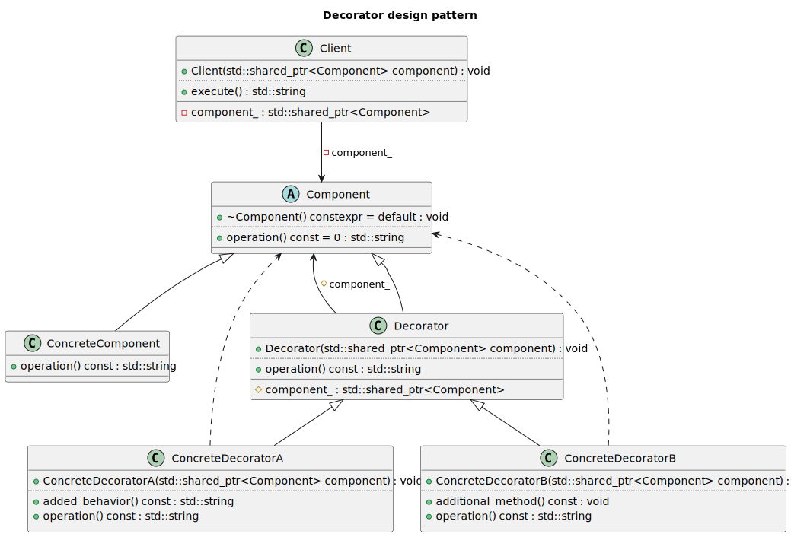

# t00097 - Test case for decorator design pattern
## Config
```yaml
diagrams:
  t00097_class:
    type: class
    title: Decorator design pattern
    glob:
      - t00097.cc
    using_namespace: clanguml::t00097
    include:
      namespaces:
        - clanguml::t00097
```
## Source code
File `tests/t00097/t00097.cc`
```cpp
#include <memory>
#include <string>

namespace clanguml {
namespace t00097 {

class Component {
public:
    virtual ~Component() = default;
    virtual std::string operation() const = 0;
};

class ConcreteComponent : public Component {
public:
    std::string operation() const override { return "ConcreteComponent"; }
};

class Decorator : public Component {
protected:
    std::shared_ptr<Component> component_;

public:
    explicit Decorator(std::shared_ptr<Component> component)
        : component_(component)
    {
    }

    std::string operation() const override { return component_->operation(); }
};

class ConcreteDecoratorA : public Decorator {
public:
    explicit ConcreteDecoratorA(std::shared_ptr<Component> component)
        : Decorator(component)
    {
    }

    std::string operation() const override
    {
        return "ConcreteDecoratorA(" + Decorator::operation() + ")";
    }

    std::string added_behavior() const { return "Added behavior A"; }
};

class ConcreteDecoratorB : public Decorator {
public:
    explicit ConcreteDecoratorB(std::shared_ptr<Component> component)
        : Decorator(component)
    {
    }

    std::string operation() const override
    {
        return "ConcreteDecoratorB(" + Decorator::operation() + ")";
    }

    void additional_method() const { }
};

class Client {
    std::shared_ptr<Component> component_;

public:
    explicit Client(std::shared_ptr<Component> component)
        : component_(component)
    {
    }

    std::string execute() { return component_->operation(); }
};

} // namespace t00097
} // namespace clanguml
```
## Generated PlantUML diagrams

## Generated Mermaid diagrams

## Generated JSON models
```json
{
  "diagram_type": "class",
  "elements": [
    {
      "bases": [],
      "display_name": "Component",
      "id": "8448329958717014819",
      "is_abstract": true,
      "is_nested": false,
      "is_struct": false,
      "is_template": false,
      "is_union": false,
      "members": [],
      "methods": [
        {
          "access": "public",
          "display_name": "~Component",
          "is_const": false,
          "is_consteval": false,
          "is_constexpr": true,
          "is_constructor": false,
          "is_copy_assignment": false,
          "is_coroutine": false,
          "is_defaulted": true,
          "is_deleted": false,
          "is_move_assignment": false,
          "is_noexcept": false,
          "is_operator": false,
          "is_pure_virtual": false,
          "is_static": false,
          "is_virtual": true,
          "name": "~Component",
          "parameters": [],
          "source_location": {
            "column": 13,
            "file": "t00097.cc",
            "line": 9,
            "translation_unit": "t00097.cc"
          },
          "template_parameters": [],
          "type": "void"
        },
        {
          "access": "public",
          "display_name": "operation",
          "is_const": true,
          "is_consteval": false,
          "is_constexpr": false,
          "is_constructor": false,
          "is_copy_assignment": false,
          "is_coroutine": false,
          "is_defaulted": false,
          "is_deleted": false,
          "is_move_assignment": false,
          "is_noexcept": false,
          "is_operator": false,
          "is_pure_virtual": true,
          "is_static": false,
          "is_virtual": true,
          "name": "operation",
          "parameters": [],
          "source_location": {
            "column": 25,
            "file": "t00097.cc",
            "line": 10,
            "translation_unit": "t00097.cc"
          },
          "template_parameters": [],
          "type": "std::string"
        }
      ],
      "name": "Component",
      "namespace": "clanguml::t00097",
      "source_location": {
        "column": 7,
        "file": "t00097.cc",
        "line": 7,
        "translation_unit": "t00097.cc"
      },
      "template_parameters": [],
      "type": "class"
    },
    {
      "bases": [
        {
          "access": "public",
          "id": "8448329958717014819",
          "is_virtual": false
        }
      ],
      "display_name": "ConcreteComponent",
      "id": "16380586648883491151",
      "is_abstract": false,
      "is_nested": false,
      "is_struct": false,
      "is_template": false,
      "is_union": false,
      "members": [],
      "methods": [
        {
          "access": "public",
          "display_name": "operation",
          "is_const": true,
          "is_consteval": false,
          "is_constexpr": false,
          "is_constructor": false,
          "is_copy_assignment": false,
          "is_coroutine": false,
          "is_defaulted": false,
          "is_deleted": false,
          "is_move_assignment": false,
          "is_noexcept": false,
          "is_operator": false,
          "is_pure_virtual": false,
          "is_static": false,
          "is_virtual": true,
          "name": "operation",
          "parameters": [],
          "source_location": {
            "column": 17,
            "file": "t00097.cc",
            "line": 15,
            "translation_unit": "t00097.cc"
          },
          "template_parameters": [],
          "type": "std::string"
        }
      ],
      "name": "ConcreteComponent",
      "namespace": "clanguml::t00097",
      "source_location": {
        "column": 7,
        "file": "t00097.cc",
        "line": 13,
        "translation_unit": "t00097.cc"
      },
      "template_parameters": [],
      "type": "class"
    },
    {
      "bases": [
        {
          "access": "public",
          "id": "8448329958717014819",
          "is_virtual": false
        }
      ],
      "display_name": "Decorator",
      "id": "13173452899673238327",
      "is_abstract": false,
      "is_nested": false,
      "is_struct": false,
      "is_template": false,
      "is_union": false,
      "members": [
        {
          "access": "protected",
          "is_static": false,
          "name": "component_",
          "source_location": {
            "column": 32,
            "file": "t00097.cc",
            "line": 20,
            "translation_unit": "t00097.cc"
          },
          "type": "std::shared_ptr<Component>"
        }
      ],
      "methods": [
        {
          "access": "public",
          "display_name": "Decorator",
          "is_const": false,
          "is_consteval": false,
          "is_constexpr": false,
          "is_constructor": true,
          "is_copy_assignment": false,
          "is_coroutine": false,
          "is_defaulted": false,
          "is_deleted": false,
          "is_move_assignment": false,
          "is_noexcept": false,
          "is_operator": false,
          "is_pure_virtual": false,
          "is_static": false,
          "is_virtual": false,
          "name": "Decorator",
          "parameters": [
            {
              "name": "component",
              "type": "std::shared_ptr<Component>"
            }
          ],
          "source_location": {
            "column": 14,
            "file": "t00097.cc",
            "line": 23,
            "translation_unit": "t00097.cc"
          },
          "template_parameters": [],
          "type": "void"
        },
        {
          "access": "public",
          "display_name": "operation",
          "is_const": true,
          "is_consteval": false,
          "is_constexpr": false,
          "is_constructor": false,
          "is_copy_assignment": false,
          "is_coroutine": false,
          "is_defaulted": false,
          "is_deleted": false,
          "is_move_assignment": false,
          "is_noexcept": false,
          "is_operator": false,
          "is_pure_virtual": false,
          "is_static": false,
          "is_virtual": true,
          "name": "operation",
          "parameters": [],
          "source_location": {
            "column": 17,
            "file": "t00097.cc",
            "line": 28,
            "translation_unit": "t00097.cc"
          },
          "template_parameters": [],
          "type": "std::string"
        }
      ],
      "name": "Decorator",
      "namespace": "clanguml::t00097",
      "source_location": {
        "column": 7,
        "file": "t00097.cc",
        "line": 18,
        "translation_unit": "t00097.cc"
      },
      "template_parameters": [],
      "type": "class"
    },
    {
      "bases": [
        {
          "access": "public",
          "id": "13173452899673238327",
          "is_virtual": false
        }
      ],
      "display_name": "ConcreteDecoratorA",
      "id": "16397069279202510767",
      "is_abstract": false,
      "is_nested": false,
      "is_struct": false,
      "is_template": false,
      "is_union": false,
      "members": [],
      "methods": [
        {
          "access": "public",
          "display_name": "ConcreteDecoratorA",
          "is_const": false,
          "is_consteval": false,
          "is_constexpr": false,
          "is_constructor": true,
          "is_copy_assignment": false,
          "is_coroutine": false,
          "is_defaulted": false,
          "is_deleted": false,
          "is_move_assignment": false,
          "is_noexcept": false,
          "is_operator": false,
          "is_pure_virtual": false,
          "is_static": false,
          "is_virtual": false,
          "name": "ConcreteDecoratorA",
          "parameters": [
            {
              "name": "component",
              "type": "std::shared_ptr<Component>"
            }
          ],
          "source_location": {
            "column": 14,
            "file": "t00097.cc",
            "line": 33,
            "translation_unit": "t00097.cc"
          },
          "template_parameters": [],
          "type": "void"
        },
        {
          "access": "public",
          "display_name": "operation",
          "is_const": true,
          "is_consteval": false,
          "is_constexpr": false,
          "is_constructor": false,
          "is_copy_assignment": false,
          "is_coroutine": false,
          "is_defaulted": false,
          "is_deleted": false,
          "is_move_assignment": false,
          "is_noexcept": false,
          "is_operator": false,
          "is_pure_virtual": false,
          "is_static": false,
          "is_virtual": true,
          "name": "operation",
          "parameters": [],
          "source_location": {
            "column": 17,
            "file": "t00097.cc",
            "line": 38,
            "translation_unit": "t00097.cc"
          },
          "template_parameters": [],
          "type": "std::string"
        },
        {
          "access": "public",
          "display_name": "added_behavior",
          "is_const": true,
          "is_consteval": false,
          "is_constexpr": false,
          "is_constructor": false,
          "is_copy_assignment": false,
          "is_coroutine": false,
          "is_defaulted": false,
          "is_deleted": false,
          "is_move_assignment": false,
          "is_noexcept": false,
          "is_operator": false,
          "is_pure_virtual": false,
          "is_static": false,
          "is_virtual": false,
          "name": "added_behavior",
          "parameters": [],
          "source_location": {
            "column": 17,
            "file": "t00097.cc",
            "line": 43,
            "translation_unit": "t00097.cc"
          },
          "template_parameters": [],
          "type": "std::string"
        }
      ],
      "name": "ConcreteDecoratorA",
      "namespace": "clanguml::t00097",
      "source_location": {
        "column": 7,
        "file": "t00097.cc",
        "line": 31,
        "translation_unit": "t00097.cc"
      },
      "template_parameters": [],
      "type": "class"
    },
    {
      "bases": [
        {
          "access": "public",
          "id": "13173452899673238327",
          "is_virtual": false
        }
      ],
      "display_name": "ConcreteDecoratorB",
      "id": "15014709903311791285",
      "is_abstract": false,
      "is_nested": false,
      "is_struct": false,
      "is_template": false,
      "is_union": false,
      "members": [],
      "methods": [
        {
          "access": "public",
          "display_name": "ConcreteDecoratorB",
          "is_const": false,
          "is_consteval": false,
          "is_constexpr": false,
          "is_constructor": true,
          "is_copy_assignment": false,
          "is_coroutine": false,
          "is_defaulted": false,
          "is_deleted": false,
          "is_move_assignment": false,
          "is_noexcept": false,
          "is_operator": false,
          "is_pure_virtual": false,
          "is_static": false,
          "is_virtual": false,
          "name": "ConcreteDecoratorB",
          "parameters": [
            {
              "name": "component",
              "type": "std::shared_ptr<Component>"
            }
          ],
          "source_location": {
            "column": 14,
            "file": "t00097.cc",
            "line": 48,
            "translation_unit": "t00097.cc"
          },
          "template_parameters": [],
          "type": "void"
        },
        {
          "access": "public",
          "display_name": "operation",
          "is_const": true,
          "is_consteval": false,
          "is_constexpr": false,
          "is_constructor": false,
          "is_copy_assignment": false,
          "is_coroutine": false,
          "is_defaulted": false,
          "is_deleted": false,
          "is_move_assignment": false,
          "is_noexcept": false,
          "is_operator": false,
          "is_pure_virtual": false,
          "is_static": false,
          "is_virtual": true,
          "name": "operation",
          "parameters": [],
          "source_location": {
            "column": 17,
            "file": "t00097.cc",
            "line": 53,
            "translation_unit": "t00097.cc"
          },
          "template_parameters": [],
          "type": "std::string"
        },
        {
          "access": "public",
          "display_name": "additional_method",
          "is_const": true,
          "is_consteval": false,
          "is_constexpr": false,
          "is_constructor": false,
          "is_copy_assignment": false,
          "is_coroutine": false,
          "is_defaulted": false,
          "is_deleted": false,
          "is_move_assignment": false,
          "is_noexcept": false,
          "is_operator": false,
          "is_pure_virtual": false,
          "is_static": false,
          "is_virtual": false,
          "name": "additional_method",
          "parameters": [],
          "source_location": {
            "column": 10,
            "file": "t00097.cc",
            "line": 58,
            "translation_unit": "t00097.cc"
          },
          "template_parameters": [],
          "type": "void"
        }
      ],
      "name": "ConcreteDecoratorB",
      "namespace": "clanguml::t00097",
      "source_location": {
        "column": 7,
        "file": "t00097.cc",
        "line": 46,
        "translation_unit": "t00097.cc"
      },
      "template_parameters": [],
      "type": "class"
    },
    {
      "bases": [],
      "display_name": "Client",
      "id": "6102660322816991468",
      "is_abstract": false,
      "is_nested": false,
      "is_struct": false,
      "is_template": false,
      "is_union": false,
      "members": [
        {
          "access": "private",
          "is_static": false,
          "name": "component_",
          "source_location": {
            "column": 32,
            "file": "t00097.cc",
            "line": 62,
            "translation_unit": "t00097.cc"
          },
          "type": "std::shared_ptr<Component>"
        }
      ],
      "methods": [
        {
          "access": "public",
          "display_name": "Client",
          "is_const": false,
          "is_consteval": false,
          "is_constexpr": false,
          "is_constructor": true,
          "is_copy_assignment": false,
          "is_coroutine": false,
          "is_defaulted": false,
          "is_deleted": false,
          "is_move_assignment": false,
          "is_noexcept": false,
          "is_operator": false,
          "is_pure_virtual": false,
          "is_static": false,
          "is_virtual": false,
          "name": "Client",
          "parameters": [
            {
              "name": "component",
              "type": "std::shared_ptr<Component>"
            }
          ],
          "source_location": {
            "column": 14,
            "file": "t00097.cc",
            "line": 65,
            "translation_unit": "t00097.cc"
          },
          "template_parameters": [],
          "type": "void"
        },
        {
          "access": "public",
          "display_name": "execute",
          "is_const": false,
          "is_consteval": false,
          "is_constexpr": false,
          "is_constructor": false,
          "is_copy_assignment": false,
          "is_coroutine": false,
          "is_defaulted": false,
          "is_deleted": false,
          "is_move_assignment": false,
          "is_noexcept": false,
          "is_operator": false,
          "is_pure_virtual": false,
          "is_static": false,
          "is_virtual": false,
          "name": "execute",
          "parameters": [],
          "source_location": {
            "column": 17,
            "file": "t00097.cc",
            "line": 70,
            "translation_unit": "t00097.cc"
          },
          "template_parameters": [],
          "type": "std::string"
        }
      ],
      "name": "Client",
      "namespace": "clanguml::t00097",
      "source_location": {
        "column": 7,
        "file": "t00097.cc",
        "line": 61,
        "translation_unit": "t00097.cc"
      },
      "template_parameters": [],
      "type": "class"
    }
  ],
  "name": "t00097_class",
  "package_type": "namespace",
  "relationships": [
    {
      "access": "public",
      "destination": "8448329958717014819",
      "source": "16380586648883491151",
      "type": "extension"
    },
    {
      "access": "protected",
      "destination": "8448329958717014819",
      "label": "component_",
      "source": "13173452899673238327",
      "type": "association"
    },
    {
      "access": "public",
      "destination": "8448329958717014819",
      "source": "13173452899673238327",
      "type": "extension"
    },
    {
      "access": "public",
      "destination": "8448329958717014819",
      "source": "16397069279202510767",
      "type": "dependency"
    },
    {
      "access": "public",
      "destination": "13173452899673238327",
      "source": "16397069279202510767",
      "type": "extension"
    },
    {
      "access": "public",
      "destination": "8448329958717014819",
      "source": "15014709903311791285",
      "type": "dependency"
    },
    {
      "access": "public",
      "destination": "13173452899673238327",
      "source": "15014709903311791285",
      "type": "extension"
    },
    {
      "access": "private",
      "destination": "8448329958717014819",
      "label": "component_",
      "source": "6102660322816991468",
      "type": "association"
    }
  ],
  "title": "Decorator design pattern",
  "using_namespace": "clanguml::t00097"
}
```
## Generated GraphML models
```xml
<?xml version="1.0"?>
<graphml xmlns="http://graphml.graphdrawing.org/xmlns" xmlns:xsi="http://www.w3.org/2001/XMLSchema-instance" xsi:schemaLocation="http://graphml.graphdrawing.org/xmlns http://graphml.graphdrawing.org/xmlns/1.0/graphml.xsd">
 <desc><![CDATA[Decorator design pattern]]></desc>
 <key attr.name="id" attr.type="string" for="graph" id="gd0" />
 <key attr.name="diagram_type" attr.type="string" for="graph" id="gd1" />
 <key attr.name="name" attr.type="string" for="graph" id="gd2" />
 <key attr.name="using_namespace" attr.type="string" for="graph" id="gd3" />
 <key attr.name="id" attr.type="string" for="node" id="nd0" />
 <key attr.name="type" attr.type="string" for="node" id="nd1" />
 <key attr.name="name" attr.type="string" for="node" id="nd2" />
 <key attr.name="stereotype" attr.type="string" for="node" id="nd3" />
 <key attr.name="url" attr.type="string" for="node" id="nd4" />
 <key attr.name="tooltip" attr.type="string" for="node" id="nd5" />
 <key attr.name="is_template" attr.type="boolean" for="node" id="nd6" />
 <key attr.name="type" attr.type="string" for="edge" id="ed0" />
 <key attr.name="access" attr.type="string" for="edge" id="ed1" />
 <key attr.name="label" attr.type="string" for="edge" id="ed2" />
 <key attr.name="url" attr.type="string" for="edge" id="ed3" />
 <graph id="g0" edgedefault="directed" parse.nodeids="canonical" parse.edgeids="canonical" parse.order="nodesfirst">
  <data key="gd3">clanguml::t00097</data>
  <node id="n0">
   <data key="nd1">class</data>
   <data key="nd2"><![CDATA[Component]]></data>
   <data key="nd3">abstract</data>
   <data key="nd6">false</data>
  </node>
  <node id="n1">
   <data key="nd1">class</data>
   <data key="nd2"><![CDATA[ConcreteComponent]]></data>
   <data key="nd6">false</data>
  </node>
  <node id="n2">
   <data key="nd1">class</data>
   <data key="nd2"><![CDATA[Decorator]]></data>
   <data key="nd6">false</data>
  </node>
  <node id="n3">
   <data key="nd1">class</data>
   <data key="nd2"><![CDATA[ConcreteDecoratorA]]></data>
   <data key="nd6">false</data>
  </node>
  <node id="n4">
   <data key="nd1">class</data>
   <data key="nd2"><![CDATA[ConcreteDecoratorB]]></data>
   <data key="nd6">false</data>
  </node>
  <node id="n5">
   <data key="nd1">class</data>
   <data key="nd2"><![CDATA[Client]]></data>
   <data key="nd6">false</data>
  </node>
  <edge id="e0" source="n1" target="n0">
   <data key="ed0">extension</data>
   <data key="ed1">public</data>
  </edge>
  <edge id="e1" source="n2" target="n0">
   <data key="ed0">association</data>
   <data key="ed2">component_</data>
   <data key="ed1">protected</data>
  </edge>
  <edge id="e2" source="n2" target="n0">
   <data key="ed0">extension</data>
   <data key="ed1">public</data>
  </edge>
  <edge id="e3" source="n3" target="n0">
   <data key="ed0">dependency</data>
   <data key="ed1">public</data>
  </edge>
  <edge id="e4" source="n3" target="n2">
   <data key="ed0">extension</data>
   <data key="ed1">public</data>
  </edge>
  <edge id="e5" source="n4" target="n0">
   <data key="ed0">dependency</data>
   <data key="ed1">public</data>
  </edge>
  <edge id="e6" source="n4" target="n2">
   <data key="ed0">extension</data>
   <data key="ed1">public</data>
  </edge>
  <edge id="e7" source="n5" target="n0">
   <data key="ed0">association</data>
   <data key="ed2">component_</data>
   <data key="ed1">private</data>
  </edge>
 </graph>
</graphml>

```
