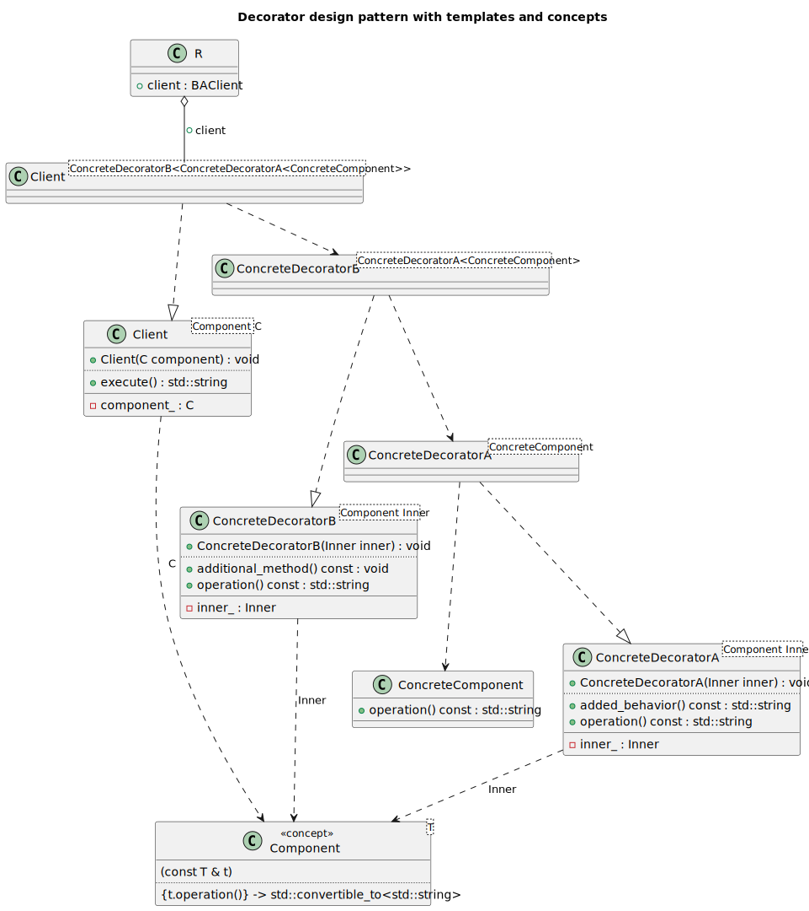

# t00098 - Test case for decorator design pattern using static polymorphism
## Config
```yaml
diagrams:
  t00098_class:
    type: class
    title: Decorator design pattern with templates and concepts
    glob:
      - t00098.cc
    using_namespace: clanguml::t00098
    include:
      namespaces:
        - clanguml::t00098
```
## Source code
File `tests/t00098/t00098.cc`
```cpp
#include <concepts>
#include <memory>
#include <string>

namespace clanguml {
namespace t00098 {

template <typename T>
concept Component = requires(const T &t) {
    { t.operation() } -> std::convertible_to<std::string>;
};

struct ConcreteComponent {
    std::string operation() const { return "ConcreteComponent"; }
};

template <Component Inner> class ConcreteDecoratorA {
    Inner inner_;

public:
    explicit ConcreteDecoratorA(Inner inner)
        : inner_(std::move(inner))
    {
    }

    std::string operation() const
    {
        return "ConcreteDecoratorA(" + inner_.operation() + ")";
    }

    std::string added_behavior() const { return "Added behavior A"; }
};

template <Component Inner> class ConcreteDecoratorB {
    Inner inner_;

public:
    explicit ConcreteDecoratorB(Inner inner)
        : inner_(std::move(inner))
    {
    }

    std::string operation() const
    {
        return "ConcreteDecoratorB(" + inner_.operation() + ")";
    }

    void additional_method() const { }
};

template <Component C> class Client {
    C component_;

public:
    explicit Client(C component)
        : component_(std::move(component))
    {
    }

    std::string execute() { return component_.operation(); }
};

using BAClient =
    Client<ConcreteDecoratorB<ConcreteDecoratorA<ConcreteComponent>>>;

struct R {
    BAClient client;
};

int main()
{
    R r{.client = Client{
            ConcreteDecoratorB{ConcreteDecoratorA{ConcreteComponent{}}}}};

    std::puts(r.client.execute().c_str());

    return 0;
}
} // namespace t00098
} // namespace clanguml
```
## Generated PlantUML diagrams

## Generated Mermaid diagrams

## Generated JSON models
```json
{
  "diagram_type": "class",
  "elements": [
    {
      "display_name": "Component<T>",
      "id": "8876837216240248889",
      "name": "Component",
      "namespace": "clanguml::t00098",
      "parameters": [
        {
          "name": "t",
          "type": "const T &"
        }
      ],
      "source_location": {
        "column": 9,
        "file": "t00098.cc",
        "line": 9,
        "translation_unit": "t00098.cc"
      },
      "statements": [
        "{t.operation()} -> std::convertible_to<std::string>"
      ],
      "type": "concept"
    },
    {
      "bases": [],
      "display_name": "ConcreteComponent",
      "id": "16561016950896338451",
      "is_abstract": false,
      "is_nested": false,
      "is_struct": true,
      "is_template": false,
      "is_union": false,
      "members": [],
      "methods": [
        {
          "access": "public",
          "display_name": "operation",
          "is_const": true,
          "is_consteval": false,
          "is_constexpr": false,
          "is_constructor": false,
          "is_copy_assignment": false,
          "is_coroutine": false,
          "is_defaulted": false,
          "is_deleted": false,
          "is_move_assignment": false,
          "is_noexcept": false,
          "is_operator": false,
          "is_pure_virtual": false,
          "is_static": false,
          "is_virtual": false,
          "name": "operation",
          "parameters": [],
          "source_location": {
            "column": 17,
            "file": "t00098.cc",
            "line": 14,
            "translation_unit": "t00098.cc"
          },
          "template_parameters": [],
          "type": "std::string"
        }
      ],
      "name": "ConcreteComponent",
      "namespace": "clanguml::t00098",
      "source_location": {
        "column": 8,
        "file": "t00098.cc",
        "line": 13,
        "translation_unit": "t00098.cc"
      },
      "template_parameters": [],
      "type": "class"
    },
    {
      "bases": [],
      "display_name": "ConcreteDecoratorA<Component Inner>",
      "id": "5213864195876733834",
      "is_abstract": false,
      "is_nested": false,
      "is_struct": false,
      "is_template": true,
      "is_union": false,
      "members": [
        {
          "access": "private",
          "is_static": false,
          "name": "inner_",
          "source_location": {
            "column": 11,
            "file": "t00098.cc",
            "line": 18,
            "translation_unit": "t00098.cc"
          },
          "type": "Inner"
        }
      ],
      "methods": [
        {
          "access": "public",
          "display_name": "ConcreteDecoratorA",
          "is_const": false,
          "is_consteval": false,
          "is_constexpr": false,
          "is_constructor": true,
          "is_copy_assignment": false,
          "is_coroutine": false,
          "is_defaulted": false,
          "is_deleted": false,
          "is_move_assignment": false,
          "is_noexcept": false,
          "is_operator": false,
          "is_pure_virtual": false,
          "is_static": false,
          "is_virtual": false,
          "name": "ConcreteDecoratorA",
          "parameters": [
            {
              "name": "inner",
              "type": "Inner"
            }
          ],
          "source_location": {
            "column": 14,
            "file": "t00098.cc",
            "line": 21,
            "translation_unit": "t00098.cc"
          },
          "template_parameters": [],
          "type": "void"
        },
        {
          "access": "public",
          "display_name": "operation",
          "is_const": true,
          "is_consteval": false,
          "is_constexpr": false,
          "is_constructor": false,
          "is_copy_assignment": false,
          "is_coroutine": false,
          "is_defaulted": false,
          "is_deleted": false,
          "is_move_assignment": false,
          "is_noexcept": false,
          "is_operator": false,
          "is_pure_virtual": false,
          "is_static": false,
          "is_virtual": false,
          "name": "operation",
          "parameters": [],
          "source_location": {
            "column": 17,
            "file": "t00098.cc",
            "line": 26,
            "translation_unit": "t00098.cc"
          },
          "template_parameters": [],
          "type": "std::string"
        },
        {
          "access": "public",
          "display_name": "added_behavior",
          "is_const": true,
          "is_consteval": false,
          "is_constexpr": false,
          "is_constructor": false,
          "is_copy_assignment": false,
          "is_coroutine": false,
          "is_defaulted": false,
          "is_deleted": false,
          "is_move_assignment": false,
          "is_noexcept": false,
          "is_operator": false,
          "is_pure_virtual": false,
          "is_static": false,
          "is_virtual": false,
          "name": "added_behavior",
          "parameters": [],
          "source_location": {
            "column": 17,
            "file": "t00098.cc",
            "line": 31,
            "translation_unit": "t00098.cc"
          },
          "template_parameters": [],
          "type": "std::string"
        }
      ],
      "name": "ConcreteDecoratorA",
      "namespace": "clanguml::t00098",
      "source_location": {
        "column": 34,
        "file": "t00098.cc",
        "line": 17,
        "translation_unit": "t00098.cc"
      },
      "template_parameters": [
        {
          "is_variadic": false,
          "kind": "template_type",
          "name": "Inner",
          "template_parameters": []
        }
      ],
      "type": "class"
    },
    {
      "bases": [],
      "display_name": "ConcreteDecoratorB<Component Inner>",
      "id": "5066890982799846966",
      "is_abstract": false,
      "is_nested": false,
      "is_struct": false,
      "is_template": true,
      "is_union": false,
      "members": [
        {
          "access": "private",
          "is_static": false,
          "name": "inner_",
          "source_location": {
            "column": 11,
            "file": "t00098.cc",
            "line": 35,
            "translation_unit": "t00098.cc"
          },
          "type": "Inner"
        }
      ],
      "methods": [
        {
          "access": "public",
          "display_name": "ConcreteDecoratorB",
          "is_const": false,
          "is_consteval": false,
          "is_constexpr": false,
          "is_constructor": true,
          "is_copy_assignment": false,
          "is_coroutine": false,
          "is_defaulted": false,
          "is_deleted": false,
          "is_move_assignment": false,
          "is_noexcept": false,
          "is_operator": false,
          "is_pure_virtual": false,
          "is_static": false,
          "is_virtual": false,
          "name": "ConcreteDecoratorB",
          "parameters": [
            {
              "name": "inner",
              "type": "Inner"
            }
          ],
          "source_location": {
            "column": 14,
            "file": "t00098.cc",
            "line": 38,
            "translation_unit": "t00098.cc"
          },
          "template_parameters": [],
          "type": "void"
        },
        {
          "access": "public",
          "display_name": "operation",
          "is_const": true,
          "is_consteval": false,
          "is_constexpr": false,
          "is_constructor": false,
          "is_copy_assignment": false,
          "is_coroutine": false,
          "is_defaulted": false,
          "is_deleted": false,
          "is_move_assignment": false,
          "is_noexcept": false,
          "is_operator": false,
          "is_pure_virtual": false,
          "is_static": false,
          "is_virtual": false,
          "name": "operation",
          "parameters": [],
          "source_location": {
            "column": 17,
            "file": "t00098.cc",
            "line": 43,
            "translation_unit": "t00098.cc"
          },
          "template_parameters": [],
          "type": "std::string"
        },
        {
          "access": "public",
          "display_name": "additional_method",
          "is_const": true,
          "is_consteval": false,
          "is_constexpr": false,
          "is_constructor": false,
          "is_copy_assignment": false,
          "is_coroutine": false,
          "is_defaulted": false,
          "is_deleted": false,
          "is_move_assignment": false,
          "is_noexcept": false,
          "is_operator": false,
          "is_pure_virtual": false,
          "is_static": false,
          "is_virtual": false,
          "name": "additional_method",
          "parameters": [],
          "source_location": {
            "column": 10,
            "file": "t00098.cc",
            "line": 48,
            "translation_unit": "t00098.cc"
          },
          "template_parameters": [],
          "type": "void"
        }
      ],
      "name": "ConcreteDecoratorB",
      "namespace": "clanguml::t00098",
      "source_location": {
        "column": 34,
        "file": "t00098.cc",
        "line": 34,
        "translation_unit": "t00098.cc"
      },
      "template_parameters": [
        {
          "is_variadic": false,
          "kind": "template_type",
          "name": "Inner",
          "template_parameters": []
        }
      ],
      "type": "class"
    },
    {
      "bases": [],
      "display_name": "Client<Component C>",
      "id": "15308488410191553172",
      "is_abstract": false,
      "is_nested": false,
      "is_struct": false,
      "is_template": true,
      "is_union": false,
      "members": [
        {
          "access": "private",
          "is_static": false,
          "name": "component_",
          "source_location": {
            "column": 7,
            "file": "t00098.cc",
            "line": 52,
            "translation_unit": "t00098.cc"
          },
          "type": "C"
        }
      ],
      "methods": [
        {
          "access": "public",
          "display_name": "Client",
          "is_const": false,
          "is_consteval": false,
          "is_constexpr": false,
          "is_constructor": true,
          "is_copy_assignment": false,
          "is_coroutine": false,
          "is_defaulted": false,
          "is_deleted": false,
          "is_move_assignment": false,
          "is_noexcept": false,
          "is_operator": false,
          "is_pure_virtual": false,
          "is_static": false,
          "is_virtual": false,
          "name": "Client",
          "parameters": [
            {
              "name": "component",
              "type": "C"
            }
          ],
          "source_location": {
            "column": 14,
            "file": "t00098.cc",
            "line": 55,
            "translation_unit": "t00098.cc"
          },
          "template_parameters": [],
          "type": "void"
        },
        {
          "access": "public",
          "display_name": "execute",
          "is_const": false,
          "is_consteval": false,
          "is_constexpr": false,
          "is_constructor": false,
          "is_copy_assignment": false,
          "is_coroutine": false,
          "is_defaulted": false,
          "is_deleted": false,
          "is_move_assignment": false,
          "is_noexcept": false,
          "is_operator": false,
          "is_pure_virtual": false,
          "is_static": false,
          "is_virtual": false,
          "name": "execute",
          "parameters": [],
          "source_location": {
            "column": 17,
            "file": "t00098.cc",
            "line": 60,
            "translation_unit": "t00098.cc"
          },
          "template_parameters": [],
          "type": "std::string"
        }
      ],
      "name": "Client",
      "namespace": "clanguml::t00098",
      "source_location": {
        "column": 30,
        "file": "t00098.cc",
        "line": 51,
        "translation_unit": "t00098.cc"
      },
      "template_parameters": [
        {
          "is_variadic": false,
          "kind": "template_type",
          "name": "C",
          "template_parameters": []
        }
      ],
      "type": "class"
    },
    {
      "bases": [],
      "display_name": "ConcreteDecoratorA<ConcreteComponent>",
      "id": "8905995241130596975",
      "is_abstract": false,
      "is_nested": false,
      "is_struct": false,
      "is_template": true,
      "is_union": false,
      "members": [],
      "methods": [],
      "name": "ConcreteDecoratorA",
      "namespace": "clanguml::t00098",
      "source_location": {
        "column": 14,
        "file": "t00098.cc",
        "line": 67,
        "translation_unit": "t00098.cc"
      },
      "template_parameters": [
        {
          "is_variadic": false,
          "kind": "argument",
          "template_parameters": [],
          "type": "ConcreteComponent"
        }
      ],
      "type": "class"
    },
    {
      "bases": [],
      "display_name": "ConcreteDecoratorB<ConcreteDecoratorA<ConcreteComponent>>",
      "id": "3285186541502255684",
      "is_abstract": false,
      "is_nested": false,
      "is_struct": false,
      "is_template": true,
      "is_union": false,
      "members": [],
      "methods": [],
      "name": "ConcreteDecoratorB",
      "namespace": "clanguml::t00098",
      "source_location": {
        "column": 14,
        "file": "t00098.cc",
        "line": 67,
        "translation_unit": "t00098.cc"
      },
      "template_parameters": [
        {
          "is_variadic": false,
          "kind": "argument",
          "template_parameters": [
            {
              "is_variadic": false,
              "kind": "argument",
              "template_parameters": [],
              "type": "clanguml::t00098::ConcreteComponent"
            }
          ],
          "type": "ConcreteDecoratorA"
        }
      ],
      "type": "class"
    },
    {
      "bases": [],
      "display_name": "Client<ConcreteDecoratorB<ConcreteDecoratorA<ConcreteComponent>>>",
      "id": "11754703513508804720",
      "is_abstract": false,
      "is_nested": false,
      "is_struct": false,
      "is_template": true,
      "is_union": false,
      "members": [],
      "methods": [],
      "name": "Client",
      "namespace": "clanguml::t00098",
      "source_location": {
        "column": 14,
        "file": "t00098.cc",
        "line": 67,
        "translation_unit": "t00098.cc"
      },
      "template_parameters": [
        {
          "is_variadic": false,
          "kind": "argument",
          "template_parameters": [
            {
              "is_variadic": false,
              "kind": "argument",
              "template_parameters": [
                {
                  "is_variadic": false,
                  "kind": "argument",
                  "template_parameters": [],
                  "type": "clanguml::t00098::ConcreteComponent"
                }
              ],
              "type": "clanguml::t00098::ConcreteDecoratorA"
            }
          ],
          "type": "ConcreteDecoratorB"
        }
      ],
      "type": "class"
    },
    {
      "bases": [],
      "display_name": "R",
      "id": "9384409517498194198",
      "is_abstract": false,
      "is_nested": false,
      "is_struct": true,
      "is_template": false,
      "is_union": false,
      "members": [
        {
          "access": "public",
          "is_static": false,
          "name": "client",
          "source_location": {
            "column": 14,
            "file": "t00098.cc",
            "line": 67,
            "translation_unit": "t00098.cc"
          },
          "type": "BAClient"
        }
      ],
      "methods": [],
      "name": "R",
      "namespace": "clanguml::t00098",
      "source_location": {
        "column": 8,
        "file": "t00098.cc",
        "line": 66,
        "translation_unit": "t00098.cc"
      },
      "template_parameters": [],
      "type": "class"
    }
  ],
  "name": "t00098_class",
  "package_type": "namespace",
  "relationships": [
    {
      "destination": "8876837216240248889",
      "label": "Inner",
      "source": "5213864195876733834",
      "type": "constraint"
    },
    {
      "destination": "8876837216240248889",
      "label": "Inner",
      "source": "5066890982799846966",
      "type": "constraint"
    },
    {
      "destination": "8876837216240248889",
      "label": "C",
      "source": "15308488410191553172",
      "type": "constraint"
    },
    {
      "access": "public",
      "destination": "16561016950896338451",
      "source": "8905995241130596975",
      "type": "dependency"
    },
    {
      "access": "public",
      "destination": "5213864195876733834",
      "source": "8905995241130596975",
      "type": "instantiation"
    },
    {
      "access": "public",
      "destination": "8905995241130596975",
      "source": "3285186541502255684",
      "type": "dependency"
    },
    {
      "access": "public",
      "destination": "5066890982799846966",
      "source": "3285186541502255684",
      "type": "instantiation"
    },
    {
      "access": "public",
      "destination": "3285186541502255684",
      "source": "11754703513508804720",
      "type": "dependency"
    },
    {
      "access": "public",
      "destination": "15308488410191553172",
      "source": "11754703513508804720",
      "type": "instantiation"
    },
    {
      "access": "public",
      "destination": "11754703513508804720",
      "label": "client",
      "source": "9384409517498194198",
      "type": "aggregation"
    }
  ],
  "title": "Decorator design pattern with templates and concepts",
  "using_namespace": "clanguml::t00098"
}
```
## Generated GraphML models
```xml
<?xml version="1.0"?>
<graphml xmlns="http://graphml.graphdrawing.org/xmlns" xmlns:xsi="http://www.w3.org/2001/XMLSchema-instance" xsi:schemaLocation="http://graphml.graphdrawing.org/xmlns http://graphml.graphdrawing.org/xmlns/1.0/graphml.xsd">
 <desc><![CDATA[Decorator design pattern with templates and concepts]]></desc>
 <key attr.name="id" attr.type="string" for="graph" id="gd0" />
 <key attr.name="diagram_type" attr.type="string" for="graph" id="gd1" />
 <key attr.name="name" attr.type="string" for="graph" id="gd2" />
 <key attr.name="using_namespace" attr.type="string" for="graph" id="gd3" />
 <key attr.name="id" attr.type="string" for="node" id="nd0" />
 <key attr.name="type" attr.type="string" for="node" id="nd1" />
 <key attr.name="name" attr.type="string" for="node" id="nd2" />
 <key attr.name="stereotype" attr.type="string" for="node" id="nd3" />
 <key attr.name="url" attr.type="string" for="node" id="nd4" />
 <key attr.name="tooltip" attr.type="string" for="node" id="nd5" />
 <key attr.name="is_template" attr.type="boolean" for="node" id="nd6" />
 <key attr.name="type" attr.type="string" for="edge" id="ed0" />
 <key attr.name="access" attr.type="string" for="edge" id="ed1" />
 <key attr.name="label" attr.type="string" for="edge" id="ed2" />
 <key attr.name="url" attr.type="string" for="edge" id="ed3" />
 <graph id="g0" edgedefault="directed" parse.nodeids="canonical" parse.edgeids="canonical" parse.order="nodesfirst">
  <data key="gd3">clanguml::t00098</data>
  <node id="n0">
   <data key="nd1">concept</data>
   <data key="nd2"><![CDATA[Component<T>]]></data>
  </node>
  <node id="n1">
   <data key="nd1">class</data>
   <data key="nd2"><![CDATA[ConcreteComponent]]></data>
   <data key="nd6">false</data>
  </node>
  <node id="n2">
   <data key="nd1">class</data>
   <data key="nd2"><![CDATA[ConcreteDecoratorA<Component Inner>]]></data>
   <data key="nd6">true</data>
  </node>
  <node id="n3">
   <data key="nd1">class</data>
   <data key="nd2"><![CDATA[ConcreteDecoratorB<Component Inner>]]></data>
   <data key="nd6">true</data>
  </node>
  <node id="n4">
   <data key="nd1">class</data>
   <data key="nd2"><![CDATA[Client<Component C>]]></data>
   <data key="nd6">true</data>
  </node>
  <node id="n5">
   <data key="nd1">class</data>
   <data key="nd2"><![CDATA[ConcreteDecoratorA<ConcreteComponent>]]></data>
   <data key="nd6">true</data>
  </node>
  <node id="n6">
   <data key="nd1">class</data>
   <data key="nd2"><![CDATA[ConcreteDecoratorB<ConcreteDecoratorA<ConcreteComponent>>]]></data>
   <data key="nd6">true</data>
  </node>
  <node id="n7">
   <data key="nd1">class</data>
   <data key="nd2"><![CDATA[Client<ConcreteDecoratorB<ConcreteDecoratorA<ConcreteComponent>>>]]></data>
   <data key="nd6">true</data>
  </node>
  <node id="n8">
   <data key="nd1">class</data>
   <data key="nd2"><![CDATA[R]]></data>
   <data key="nd6">false</data>
  </node>
  <edge id="e0" source="n2" target="n0">
   <data key="ed0">constraint</data>
   <data key="ed2">Inner</data>
  </edge>
  <edge id="e1" source="n3" target="n0">
   <data key="ed0">constraint</data>
   <data key="ed2">Inner</data>
  </edge>
  <edge id="e2" source="n4" target="n0">
   <data key="ed0">constraint</data>
   <data key="ed2">C</data>
  </edge>
  <edge id="e3" source="n5" target="n1">
   <data key="ed0">dependency</data>
   <data key="ed1">public</data>
  </edge>
  <edge id="e4" source="n5" target="n2">
   <data key="ed0">instantiation</data>
   <data key="ed1">public</data>
  </edge>
  <edge id="e5" source="n6" target="n5">
   <data key="ed0">dependency</data>
   <data key="ed1">public</data>
  </edge>
  <edge id="e6" source="n6" target="n3">
   <data key="ed0">instantiation</data>
   <data key="ed1">public</data>
  </edge>
  <edge id="e7" source="n7" target="n6">
   <data key="ed0">dependency</data>
   <data key="ed1">public</data>
  </edge>
  <edge id="e8" source="n7" target="n4">
   <data key="ed0">instantiation</data>
   <data key="ed1">public</data>
  </edge>
  <edge id="e9" source="n8" target="n7">
   <data key="ed0">aggregation</data>
   <data key="ed2">client</data>
   <data key="ed1">public</data>
  </edge>
 </graph>
</graphml>

```
