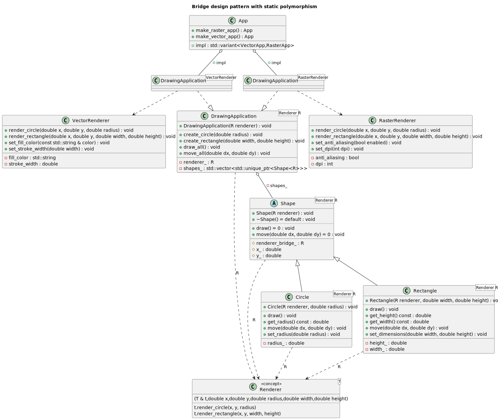

# t00099 - Test case for bridge design pattern using static polymorphism
## Config
```yaml
diagrams:
  t00099_class:
    type: class
    glob:
      - t00099.cc
    title: Bridge design pattern with static polymorphism
    include:
      namespaces:
        - clanguml::t00099
    using_namespace: clanguml::t00099
```
## Source code
File `tests/t00099/t00099.cc`
```cpp
#include <concepts>
#include <memory>
#include <string>
#include <variant>
#include <vector>

namespace clanguml {
namespace t00099 {

template <typename T>
concept Renderer = requires(
    T &t, double x, double y, double radius, double width, double height) {
    t.render_circle(x, y, radius);
    t.render_rectangle(x, y, width, height);
};

class VectorRenderer {
public:
    void render_circle(double x, double y, double radius) { }
    void render_rectangle(double x, double y, double width, double height) { }

    void set_stroke_width(double width) { stroke_width = width; }
    void set_fill_color(const std::string &color) { fill_color = color; }

private:
    double stroke_width{1.0};
    std::string fill_color{"black"};
};

class RasterRenderer {
public:
    void render_circle(double x, double y, double radius) { }
    void render_rectangle(double x, double y, double width, double height) { }

    void set_dpi(int dpi) { this->dpi = dpi; }
    void set_anti_aliasing(bool enabled) { anti_aliasing = enabled; }

private:
    int dpi{72};
    bool anti_aliasing{true};
};

template <Renderer R> class Shape {
public:
    explicit Shape(R renderer)
        : renderer_bridge_(std::move(renderer))
    {
    }

    virtual ~Shape() = default;
    virtual void draw() = 0;
    virtual void move(double dx, double dy) = 0;

protected:
    R renderer_bridge_;
    double x_{0.0};
    double y_{0.0};
};

template <Renderer R> class Circle : public Shape<R> {
public:
    Circle(R renderer, double radius)
        : Shape<R>(std::move(renderer))
        , radius_(radius)
    {
    }

    void draw() override
    {
        this->renderer_bridge_.render_circle(this->x_, this->y_, radius_);
    }

    void move(double dx, double dy) override
    {
        this->x_ += dx;
        this->y_ += dy;
    }

    void set_radius(double radius) { radius_ = radius; }
    double get_radius() const { return radius_; }

private:
    double radius_;
};

template <Renderer R> class Rectangle : public Shape<R> {
public:
    Rectangle(R renderer, double width, double height)
        : Shape<R>(std::move(renderer))
        , width_(width)
        , height_(height)
    {
    }

    void draw() override
    {
        this->renderer_bridge_.render_rectangle(
            this->x_, this->y_, width_, height_);
    }

    void move(double dx, double dy) override
    {
        this->x_ += dx;
        this->y_ += dy;
    }

    void set_dimensions(double width, double height)
    {
        width_ = width;
        height_ = height;
    }

    double get_width() const { return width_; }
    double get_height() const { return height_; }

private:
    double width_;
    double height_;
};

template <Renderer R> class DrawingApplication {
public:
    DrawingApplication(R renderer)
        : renderer_(std::move(renderer))
    {
    }

    void create_circle(double radius)
    {
        auto circle = std::make_unique<Circle<R>>(renderer_, radius);
        shapes_.push_back(std::move(circle));
    }

    void create_rectangle(double width, double height)
    {
        auto rectangle =
            std::make_unique<Rectangle<R>>(renderer_, width, height);
        shapes_.push_back(std::move(rectangle));
    }

    void draw_all()
    {
        for (const auto &shape : shapes_) {
            shape->draw();
        }
    }

    void move_all(double dx, double dy)
    {
        for (const auto &shape : shapes_) {
            shape->move(dx, dy);
        }
    }

private:
    R renderer_;
    std::vector<std::unique_ptr<Shape<R>>> shapes_;
};

using VectorApp = DrawingApplication<VectorRenderer>;
using RasterApp = DrawingApplication<RasterRenderer>;

struct App {
    std::variant<VectorApp, RasterApp> impl;

    static App make_vector_app() { return App{.impl = VectorRenderer{}}; }

    static App make_raster_app() { return App{.impl = RasterRenderer{}}; }
};

int main()
{
    auto app = App::make_vector_app();

    return 0;
}

} // namespace t00099
} // namespace clanguml
```
## Generated PlantUML diagrams

## Generated Mermaid diagrams

## Generated JSON models
```json
{
  "diagram_type": "class",
  "elements": [
    {
      "display_name": "Renderer<T>",
      "id": "9634615813666335298",
      "name": "Renderer",
      "namespace": "clanguml::t00099",
      "parameters": [
        {
          "name": "t",
          "type": "T &"
        },
        {
          "name": "x",
          "type": "double"
        },
        {
          "name": "y",
          "type": "double"
        },
        {
          "name": "radius",
          "type": "double"
        },
        {
          "name": "width",
          "type": "double"
        },
        {
          "name": "height",
          "type": "double"
        }
      ],
      "source_location": {
        "column": 9,
        "file": "t00099.cc",
        "line": 11,
        "translation_unit": "t00099.cc"
      },
      "statements": [
        "t.render_circle(x, y, radius)",
        "t.render_rectangle(x, y, width, height)"
      ],
      "type": "concept"
    },
    {
      "bases": [],
      "display_name": "VectorRenderer",
      "id": "3387176406646031341",
      "is_abstract": false,
      "is_nested": false,
      "is_struct": false,
      "is_template": false,
      "is_union": false,
      "members": [
        {
          "access": "private",
          "is_static": false,
          "name": "stroke_width",
          "source_location": {
            "column": 12,
            "file": "t00099.cc",
            "line": 26,
            "translation_unit": "t00099.cc"
          },
          "type": "double"
        },
        {
          "access": "private",
          "is_static": false,
          "name": "fill_color",
          "source_location": {
            "column": 17,
            "file": "t00099.cc",
            "line": 27,
            "translation_unit": "t00099.cc"
          },
          "type": "std::string"
        }
      ],
      "methods": [
        {
          "access": "public",
          "display_name": "render_circle",
          "is_const": false,
          "is_consteval": false,
          "is_constexpr": false,
          "is_constructor": false,
          "is_copy_assignment": false,
          "is_coroutine": false,
          "is_defaulted": false,
          "is_deleted": false,
          "is_move_assignment": false,
          "is_noexcept": false,
          "is_operator": false,
          "is_pure_virtual": false,
          "is_static": false,
          "is_virtual": false,
          "name": "render_circle",
          "parameters": [
            {
              "name": "x",
              "type": "double"
            },
            {
              "name": "y",
              "type": "double"
            },
            {
              "name": "radius",
              "type": "double"
            }
          ],
          "source_location": {
            "column": 10,
            "file": "t00099.cc",
            "line": 19,
            "translation_unit": "t00099.cc"
          },
          "template_parameters": [],
          "type": "void"
        },
        {
          "access": "public",
          "display_name": "render_rectangle",
          "is_const": false,
          "is_consteval": false,
          "is_constexpr": false,
          "is_constructor": false,
          "is_copy_assignment": false,
          "is_coroutine": false,
          "is_defaulted": false,
          "is_deleted": false,
          "is_move_assignment": false,
          "is_noexcept": false,
          "is_operator": false,
          "is_pure_virtual": false,
          "is_static": false,
          "is_virtual": false,
          "name": "render_rectangle",
          "parameters": [
            {
              "name": "x",
              "type": "double"
            },
            {
              "name": "y",
              "type": "double"
            },
            {
              "name": "width",
              "type": "double"
            },
            {
              "name": "height",
              "type": "double"
            }
          ],
          "source_location": {
            "column": 10,
            "file": "t00099.cc",
            "line": 20,
            "translation_unit": "t00099.cc"
          },
          "template_parameters": [],
          "type": "void"
        },
        {
          "access": "public",
          "display_name": "set_stroke_width",
          "is_const": false,
          "is_consteval": false,
          "is_constexpr": false,
          "is_constructor": false,
          "is_copy_assignment": false,
          "is_coroutine": false,
          "is_defaulted": false,
          "is_deleted": false,
          "is_move_assignment": false,
          "is_noexcept": false,
          "is_operator": false,
          "is_pure_virtual": false,
          "is_static": false,
          "is_virtual": false,
          "name": "set_stroke_width",
          "parameters": [
            {
              "name": "width",
              "type": "double"
            }
          ],
          "source_location": {
            "column": 10,
            "file": "t00099.cc",
            "line": 22,
            "translation_unit": "t00099.cc"
          },
          "template_parameters": [],
          "type": "void"
        },
        {
          "access": "public",
          "display_name": "set_fill_color",
          "is_const": false,
          "is_consteval": false,
          "is_constexpr": false,
          "is_constructor": false,
          "is_copy_assignment": false,
          "is_coroutine": false,
          "is_defaulted": false,
          "is_deleted": false,
          "is_move_assignment": false,
          "is_noexcept": false,
          "is_operator": false,
          "is_pure_virtual": false,
          "is_static": false,
          "is_virtual": false,
          "name": "set_fill_color",
          "parameters": [
            {
              "name": "color",
              "type": "const std::string &"
            }
          ],
          "source_location": {
            "column": 10,
            "file": "t00099.cc",
            "line": 23,
            "translation_unit": "t00099.cc"
          },
          "template_parameters": [],
          "type": "void"
        }
      ],
      "name": "VectorRenderer",
      "namespace": "clanguml::t00099",
      "source_location": {
        "column": 7,
        "file": "t00099.cc",
        "line": 17,
        "translation_unit": "t00099.cc"
      },
      "template_parameters": [],
      "type": "class"
    },
    {
      "bases": [],
      "display_name": "RasterRenderer",
      "id": "7465171824666205808",
      "is_abstract": false,
      "is_nested": false,
      "is_struct": false,
      "is_template": false,
      "is_union": false,
      "members": [
        {
          "access": "private",
          "is_static": false,
          "name": "dpi",
          "source_location": {
            "column": 9,
            "file": "t00099.cc",
            "line": 39,
            "translation_unit": "t00099.cc"
          },
          "type": "int"
        },
        {
          "access": "private",
          "is_static": false,
          "name": "anti_aliasing",
          "source_location": {
            "column": 10,
            "file": "t00099.cc",
            "line": 40,
            "translation_unit": "t00099.cc"
          },
          "type": "bool"
        }
      ],
      "methods": [
        {
          "access": "public",
          "display_name": "render_circle",
          "is_const": false,
          "is_consteval": false,
          "is_constexpr": false,
          "is_constructor": false,
          "is_copy_assignment": false,
          "is_coroutine": false,
          "is_defaulted": false,
          "is_deleted": false,
          "is_move_assignment": false,
          "is_noexcept": false,
          "is_operator": false,
          "is_pure_virtual": false,
          "is_static": false,
          "is_virtual": false,
          "name": "render_circle",
          "parameters": [
            {
              "name": "x",
              "type": "double"
            },
            {
              "name": "y",
              "type": "double"
            },
            {
              "name": "radius",
              "type": "double"
            }
          ],
          "source_location": {
            "column": 10,
            "file": "t00099.cc",
            "line": 32,
            "translation_unit": "t00099.cc"
          },
          "template_parameters": [],
          "type": "void"
        },
        {
          "access": "public",
          "display_name": "render_rectangle",
          "is_const": false,
          "is_consteval": false,
          "is_constexpr": false,
          "is_constructor": false,
          "is_copy_assignment": false,
          "is_coroutine": false,
          "is_defaulted": false,
          "is_deleted": false,
          "is_move_assignment": false,
          "is_noexcept": false,
          "is_operator": false,
          "is_pure_virtual": false,
          "is_static": false,
          "is_virtual": false,
          "name": "render_rectangle",
          "parameters": [
            {
              "name": "x",
              "type": "double"
            },
            {
              "name": "y",
              "type": "double"
            },
            {
              "name": "width",
              "type": "double"
            },
            {
              "name": "height",
              "type": "double"
            }
          ],
          "source_location": {
            "column": 10,
            "file": "t00099.cc",
            "line": 33,
            "translation_unit": "t00099.cc"
          },
          "template_parameters": [],
          "type": "void"
        },
        {
          "access": "public",
          "display_name": "set_dpi",
          "is_const": false,
          "is_consteval": false,
          "is_constexpr": false,
          "is_constructor": false,
          "is_copy_assignment": false,
          "is_coroutine": false,
          "is_defaulted": false,
          "is_deleted": false,
          "is_move_assignment": false,
          "is_noexcept": false,
          "is_operator": false,
          "is_pure_virtual": false,
          "is_static": false,
          "is_virtual": false,
          "name": "set_dpi",
          "parameters": [
            {
              "name": "dpi",
              "type": "int"
            }
          ],
          "source_location": {
            "column": 10,
            "file": "t00099.cc",
            "line": 35,
            "translation_unit": "t00099.cc"
          },
          "template_parameters": [],
          "type": "void"
        },
        {
          "access": "public",
          "display_name": "set_anti_aliasing",
          "is_const": false,
          "is_consteval": false,
          "is_constexpr": false,
          "is_constructor": false,
          "is_copy_assignment": false,
          "is_coroutine": false,
          "is_defaulted": false,
          "is_deleted": false,
          "is_move_assignment": false,
          "is_noexcept": false,
          "is_operator": false,
          "is_pure_virtual": false,
          "is_static": false,
          "is_virtual": false,
          "name": "set_anti_aliasing",
          "parameters": [
            {
              "name": "enabled",
              "type": "bool"
            }
          ],
          "source_location": {
            "column": 10,
            "file": "t00099.cc",
            "line": 36,
            "translation_unit": "t00099.cc"
          },
          "template_parameters": [],
          "type": "void"
        }
      ],
      "name": "RasterRenderer",
      "namespace": "clanguml::t00099",
      "source_location": {
        "column": 7,
        "file": "t00099.cc",
        "line": 30,
        "translation_unit": "t00099.cc"
      },
      "template_parameters": [],
      "type": "class"
    },
    {
      "bases": [],
      "display_name": "Shape<Renderer R>",
      "id": "10547461671610283629",
      "is_abstract": true,
      "is_nested": false,
      "is_struct": false,
      "is_template": true,
      "is_union": false,
      "members": [
        {
          "access": "protected",
          "is_static": false,
          "name": "renderer_bridge_",
          "source_location": {
            "column": 7,
            "file": "t00099.cc",
            "line": 55,
            "translation_unit": "t00099.cc"
          },
          "type": "R"
        },
        {
          "access": "protected",
          "is_static": false,
          "name": "x_",
          "source_location": {
            "column": 12,
            "file": "t00099.cc",
            "line": 56,
            "translation_unit": "t00099.cc"
          },
          "type": "double"
        },
        {
          "access": "protected",
          "is_static": false,
          "name": "y_",
          "source_location": {
            "column": 12,
            "file": "t00099.cc",
            "line": 57,
            "translation_unit": "t00099.cc"
          },
          "type": "double"
        }
      ],
      "methods": [
        {
          "access": "public",
          "display_name": "Shape",
          "is_const": false,
          "is_consteval": false,
          "is_constexpr": false,
          "is_constructor": true,
          "is_copy_assignment": false,
          "is_coroutine": false,
          "is_defaulted": false,
          "is_deleted": false,
          "is_move_assignment": false,
          "is_noexcept": false,
          "is_operator": false,
          "is_pure_virtual": false,
          "is_static": false,
          "is_virtual": false,
          "name": "Shape",
          "parameters": [
            {
              "name": "renderer",
              "type": "R"
            }
          ],
          "source_location": {
            "column": 14,
            "file": "t00099.cc",
            "line": 45,
            "translation_unit": "t00099.cc"
          },
          "template_parameters": [],
          "type": "void"
        },
        {
          "access": "public",
          "display_name": "~Shape",
          "is_const": false,
          "is_consteval": false,
          "is_constexpr": false,
          "is_constructor": false,
          "is_copy_assignment": false,
          "is_coroutine": false,
          "is_defaulted": true,
          "is_deleted": false,
          "is_move_assignment": false,
          "is_noexcept": false,
          "is_operator": false,
          "is_pure_virtual": false,
          "is_static": false,
          "is_virtual": true,
          "name": "~Shape",
          "parameters": [],
          "source_location": {
            "column": 13,
            "file": "t00099.cc",
            "line": 50,
            "translation_unit": "t00099.cc"
          },
          "template_parameters": [],
          "type": "void"
        },
        {
          "access": "public",
          "display_name": "draw",
          "is_const": false,
          "is_consteval": false,
          "is_constexpr": false,
          "is_constructor": false,
          "is_copy_assignment": false,
          "is_coroutine": false,
          "is_defaulted": false,
          "is_deleted": false,
          "is_move_assignment": false,
          "is_noexcept": false,
          "is_operator": false,
          "is_pure_virtual": true,
          "is_static": false,
          "is_virtual": true,
          "name": "draw",
          "parameters": [],
          "source_location": {
            "column": 18,
            "file": "t00099.cc",
            "line": 51,
            "translation_unit": "t00099.cc"
          },
          "template_parameters": [],
          "type": "void"
        },
        {
          "access": "public",
          "display_name": "move",
          "is_const": false,
          "is_consteval": false,
          "is_constexpr": false,
          "is_constructor": false,
          "is_copy_assignment": false,
          "is_coroutine": false,
          "is_defaulted": false,
          "is_deleted": false,
          "is_move_assignment": false,
          "is_noexcept": false,
          "is_operator": false,
          "is_pure_virtual": true,
          "is_static": false,
          "is_virtual": true,
          "name": "move",
          "parameters": [
            {
              "name": "dx",
              "type": "double"
            },
            {
              "name": "dy",
              "type": "double"
            }
          ],
          "source_location": {
            "column": 18,
            "file": "t00099.cc",
            "line": 52,
            "translation_unit": "t00099.cc"
          },
          "template_parameters": [],
          "type": "void"
        }
      ],
      "name": "Shape",
      "namespace": "clanguml::t00099",
      "source_location": {
        "column": 29,
        "file": "t00099.cc",
        "line": 43,
        "translation_unit": "t00099.cc"
      },
      "template_parameters": [
        {
          "is_variadic": false,
          "kind": "template_type",
          "name": "R",
          "template_parameters": []
        }
      ],
      "type": "class"
    },
    {
      "bases": [
        {
          "access": "public",
          "id": "10547461671610283629",
          "is_virtual": false
        }
      ],
      "display_name": "Circle<Renderer R>",
      "id": "5917892581072736630",
      "is_abstract": false,
      "is_nested": false,
      "is_struct": false,
      "is_template": true,
      "is_union": false,
      "members": [
        {
          "access": "private",
          "is_static": false,
          "name": "radius_",
          "source_location": {
            "column": 12,
            "file": "t00099.cc",
            "line": 83,
            "translation_unit": "t00099.cc"
          },
          "type": "double"
        }
      ],
      "methods": [
        {
          "access": "public",
          "display_name": "Circle",
          "is_const": false,
          "is_consteval": false,
          "is_constexpr": false,
          "is_constructor": true,
          "is_copy_assignment": false,
          "is_coroutine": false,
          "is_defaulted": false,
          "is_deleted": false,
          "is_move_assignment": false,
          "is_noexcept": false,
          "is_operator": false,
          "is_pure_virtual": false,
          "is_static": false,
          "is_virtual": false,
          "name": "Circle",
          "parameters": [
            {
              "name": "renderer",
              "type": "R"
            },
            {
              "name": "radius",
              "type": "double"
            }
          ],
          "source_location": {
            "column": 5,
            "file": "t00099.cc",
            "line": 62,
            "translation_unit": "t00099.cc"
          },
          "template_parameters": [],
          "type": "void"
        },
        {
          "access": "public",
          "display_name": "draw",
          "is_const": false,
          "is_consteval": false,
          "is_constexpr": false,
          "is_constructor": false,
          "is_copy_assignment": false,
          "is_coroutine": false,
          "is_defaulted": false,
          "is_deleted": false,
          "is_move_assignment": false,
          "is_noexcept": false,
          "is_operator": false,
          "is_pure_virtual": false,
          "is_static": false,
          "is_virtual": false,
          "name": "draw",
          "parameters": [],
          "source_location": {
            "column": 10,
            "file": "t00099.cc",
            "line": 68,
            "translation_unit": "t00099.cc"
          },
          "template_parameters": [],
          "type": "void"
        },
        {
          "access": "public",
          "display_name": "move",
          "is_const": false,
          "is_consteval": false,
          "is_constexpr": false,
          "is_constructor": false,
          "is_copy_assignment": false,
          "is_coroutine": false,
          "is_defaulted": false,
          "is_deleted": false,
          "is_move_assignment": false,
          "is_noexcept": false,
          "is_operator": false,
          "is_pure_virtual": false,
          "is_static": false,
          "is_virtual": false,
          "name": "move",
          "parameters": [
            {
              "name": "dx",
              "type": "double"
            },
            {
              "name": "dy",
              "type": "double"
            }
          ],
          "source_location": {
            "column": 10,
            "file": "t00099.cc",
            "line": 73,
            "translation_unit": "t00099.cc"
          },
          "template_parameters": [],
          "type": "void"
        },
        {
          "access": "public",
          "display_name": "set_radius",
          "is_const": false,
          "is_consteval": false,
          "is_constexpr": false,
          "is_constructor": false,
          "is_copy_assignment": false,
          "is_coroutine": false,
          "is_defaulted": false,
          "is_deleted": false,
          "is_move_assignment": false,
          "is_noexcept": false,
          "is_operator": false,
          "is_pure_virtual": false,
          "is_static": false,
          "is_virtual": false,
          "name": "set_radius",
          "parameters": [
            {
              "name": "radius",
              "type": "double"
            }
          ],
          "source_location": {
            "column": 10,
            "file": "t00099.cc",
            "line": 79,
            "translation_unit": "t00099.cc"
          },
          "template_parameters": [],
          "type": "void"
        },
        {
          "access": "public",
          "display_name": "get_radius",
          "is_const": true,
          "is_consteval": false,
          "is_constexpr": false,
          "is_constructor": false,
          "is_copy_assignment": false,
          "is_coroutine": false,
          "is_defaulted": false,
          "is_deleted": false,
          "is_move_assignment": false,
          "is_noexcept": false,
          "is_operator": false,
          "is_pure_virtual": false,
          "is_static": false,
          "is_virtual": false,
          "name": "get_radius",
          "parameters": [],
          "source_location": {
            "column": 12,
            "file": "t00099.cc",
            "line": 80,
            "translation_unit": "t00099.cc"
          },
          "template_parameters": [],
          "type": "double"
        }
      ],
      "name": "Circle",
      "namespace": "clanguml::t00099",
      "source_location": {
        "column": 29,
        "file": "t00099.cc",
        "line": 60,
        "translation_unit": "t00099.cc"
      },
      "template_parameters": [
        {
          "is_variadic": false,
          "kind": "template_type",
          "name": "R",
          "template_parameters": []
        }
      ],
      "type": "class"
    },
    {
      "bases": [
        {
          "access": "public",
          "id": "10547461671610283629",
          "is_virtual": false
        }
      ],
      "display_name": "Rectangle<Renderer R>",
      "id": "193653733709211866",
      "is_abstract": false,
      "is_nested": false,
      "is_struct": false,
      "is_template": true,
      "is_union": false,
      "members": [
        {
          "access": "private",
          "is_static": false,
          "name": "width_",
          "source_location": {
            "column": 12,
            "file": "t00099.cc",
            "line": 117,
            "translation_unit": "t00099.cc"
          },
          "type": "double"
        },
        {
          "access": "private",
          "is_static": false,
          "name": "height_",
          "source_location": {
            "column": 12,
            "file": "t00099.cc",
            "line": 118,
            "translation_unit": "t00099.cc"
          },
          "type": "double"
        }
      ],
      "methods": [
        {
          "access": "public",
          "display_name": "Rectangle",
          "is_const": false,
          "is_consteval": false,
          "is_constexpr": false,
          "is_constructor": true,
          "is_copy_assignment": false,
          "is_coroutine": false,
          "is_defaulted": false,
          "is_deleted": false,
          "is_move_assignment": false,
          "is_noexcept": false,
          "is_operator": false,
          "is_pure_virtual": false,
          "is_static": false,
          "is_virtual": false,
          "name": "Rectangle",
          "parameters": [
            {
              "name": "renderer",
              "type": "R"
            },
            {
              "name": "width",
              "type": "double"
            },
            {
              "name": "height",
              "type": "double"
            }
          ],
          "source_location": {
            "column": 5,
            "file": "t00099.cc",
            "line": 88,
            "translation_unit": "t00099.cc"
          },
          "template_parameters": [],
          "type": "void"
        },
        {
          "access": "public",
          "display_name": "draw",
          "is_const": false,
          "is_consteval": false,
          "is_constexpr": false,
          "is_constructor": false,
          "is_copy_assignment": false,
          "is_coroutine": false,
          "is_defaulted": false,
          "is_deleted": false,
          "is_move_assignment": false,
          "is_noexcept": false,
          "is_operator": false,
          "is_pure_virtual": false,
          "is_static": false,
          "is_virtual": false,
          "name": "draw",
          "parameters": [],
          "source_location": {
            "column": 10,
            "file": "t00099.cc",
            "line": 95,
            "translation_unit": "t00099.cc"
          },
          "template_parameters": [],
          "type": "void"
        },
        {
          "access": "public",
          "display_name": "move",
          "is_const": false,
          "is_consteval": false,
          "is_constexpr": false,
          "is_constructor": false,
          "is_copy_assignment": false,
          "is_coroutine": false,
          "is_defaulted": false,
          "is_deleted": false,
          "is_move_assignment": false,
          "is_noexcept": false,
          "is_operator": false,
          "is_pure_virtual": false,
          "is_static": false,
          "is_virtual": false,
          "name": "move",
          "parameters": [
            {
              "name": "dx",
              "type": "double"
            },
            {
              "name": "dy",
              "type": "double"
            }
          ],
          "source_location": {
            "column": 10,
            "file": "t00099.cc",
            "line": 101,
            "translation_unit": "t00099.cc"
          },
          "template_parameters": [],
          "type": "void"
        },
        {
          "access": "public",
          "display_name": "set_dimensions",
          "is_const": false,
          "is_consteval": false,
          "is_constexpr": false,
          "is_constructor": false,
          "is_copy_assignment": false,
          "is_coroutine": false,
          "is_defaulted": false,
          "is_deleted": false,
          "is_move_assignment": false,
          "is_noexcept": false,
          "is_operator": false,
          "is_pure_virtual": false,
          "is_static": false,
          "is_virtual": false,
          "name": "set_dimensions",
          "parameters": [
            {
              "name": "width",
              "type": "double"
            },
            {
              "name": "height",
              "type": "double"
            }
          ],
          "source_location": {
            "column": 10,
            "file": "t00099.cc",
            "line": 107,
            "translation_unit": "t00099.cc"
          },
          "template_parameters": [],
          "type": "void"
        },
        {
          "access": "public",
          "display_name": "get_width",
          "is_const": true,
          "is_consteval": false,
          "is_constexpr": false,
          "is_constructor": false,
          "is_copy_assignment": false,
          "is_coroutine": false,
          "is_defaulted": false,
          "is_deleted": false,
          "is_move_assignment": false,
          "is_noexcept": false,
          "is_operator": false,
          "is_pure_virtual": false,
          "is_static": false,
          "is_virtual": false,
          "name": "get_width",
          "parameters": [],
          "source_location": {
            "column": 12,
            "file": "t00099.cc",
            "line": 113,
            "translation_unit": "t00099.cc"
          },
          "template_parameters": [],
          "type": "double"
        },
        {
          "access": "public",
          "display_name": "get_height",
          "is_const": true,
          "is_consteval": false,
          "is_constexpr": false,
          "is_constructor": false,
          "is_copy_assignment": false,
          "is_coroutine": false,
          "is_defaulted": false,
          "is_deleted": false,
          "is_move_assignment": false,
          "is_noexcept": false,
          "is_operator": false,
          "is_pure_virtual": false,
          "is_static": false,
          "is_virtual": false,
          "name": "get_height",
          "parameters": [],
          "source_location": {
            "column": 12,
            "file": "t00099.cc",
            "line": 114,
            "translation_unit": "t00099.cc"
          },
          "template_parameters": [],
          "type": "double"
        }
      ],
      "name": "Rectangle",
      "namespace": "clanguml::t00099",
      "source_location": {
        "column": 29,
        "file": "t00099.cc",
        "line": 86,
        "translation_unit": "t00099.cc"
      },
      "template_parameters": [
        {
          "is_variadic": false,
          "kind": "template_type",
          "name": "R",
          "template_parameters": []
        }
      ],
      "type": "class"
    },
    {
      "bases": [],
      "display_name": "DrawingApplication<Renderer R>",
      "id": "3126163245014421542",
      "is_abstract": false,
      "is_nested": false,
      "is_struct": false,
      "is_template": true,
      "is_union": false,
      "members": [
        {
          "access": "private",
          "is_static": false,
          "name": "renderer_",
          "source_location": {
            "column": 7,
            "file": "t00099.cc",
            "line": 156,
            "translation_unit": "t00099.cc"
          },
          "type": "R"
        },
        {
          "access": "private",
          "is_static": false,
          "name": "shapes_",
          "source_location": {
            "column": 44,
            "file": "t00099.cc",
            "line": 157,
            "translation_unit": "t00099.cc"
          },
          "type": "std::vector<std::unique_ptr<Shape<R>>>"
        }
      ],
      "methods": [
        {
          "access": "public",
          "display_name": "DrawingApplication",
          "is_const": false,
          "is_consteval": false,
          "is_constexpr": false,
          "is_constructor": true,
          "is_copy_assignment": false,
          "is_coroutine": false,
          "is_defaulted": false,
          "is_deleted": false,
          "is_move_assignment": false,
          "is_noexcept": false,
          "is_operator": false,
          "is_pure_virtual": false,
          "is_static": false,
          "is_virtual": false,
          "name": "DrawingApplication",
          "parameters": [
            {
              "name": "renderer",
              "type": "R"
            }
          ],
          "source_location": {
            "column": 5,
            "file": "t00099.cc",
            "line": 123,
            "translation_unit": "t00099.cc"
          },
          "template_parameters": [],
          "type": "void"
        },
        {
          "access": "public",
          "display_name": "create_circle",
          "is_const": false,
          "is_consteval": false,
          "is_constexpr": false,
          "is_constructor": false,
          "is_copy_assignment": false,
          "is_coroutine": false,
          "is_defaulted": false,
          "is_deleted": false,
          "is_move_assignment": false,
          "is_noexcept": false,
          "is_operator": false,
          "is_pure_virtual": false,
          "is_static": false,
          "is_virtual": false,
          "name": "create_circle",
          "parameters": [
            {
              "name": "radius",
              "type": "double"
            }
          ],
          "source_location": {
            "column": 10,
            "file": "t00099.cc",
            "line": 128,
            "translation_unit": "t00099.cc"
          },
          "template_parameters": [],
          "type": "void"
        },
        {
          "access": "public",
          "display_name": "create_rectangle",
          "is_const": false,
          "is_consteval": false,
          "is_constexpr": false,
          "is_constructor": false,
          "is_copy_assignment": false,
          "is_coroutine": false,
          "is_defaulted": false,
          "is_deleted": false,
          "is_move_assignment": false,
          "is_noexcept": false,
          "is_operator": false,
          "is_pure_virtual": false,
          "is_static": false,
          "is_virtual": false,
          "name": "create_rectangle",
          "parameters": [
            {
              "name": "width",
              "type": "double"
            },
            {
              "name": "height",
              "type": "double"
            }
          ],
          "source_location": {
            "column": 10,
            "file": "t00099.cc",
            "line": 134,
            "translation_unit": "t00099.cc"
          },
          "template_parameters": [],
          "type": "void"
        },
        {
          "access": "public",
          "display_name": "draw_all",
          "is_const": false,
          "is_consteval": false,
          "is_constexpr": false,
          "is_constructor": false,
          "is_copy_assignment": false,
          "is_coroutine": false,
          "is_defaulted": false,
          "is_deleted": false,
          "is_move_assignment": false,
          "is_noexcept": false,
          "is_operator": false,
          "is_pure_virtual": false,
          "is_static": false,
          "is_virtual": false,
          "name": "draw_all",
          "parameters": [],
          "source_location": {
            "column": 10,
            "file": "t00099.cc",
            "line": 141,
            "translation_unit": "t00099.cc"
          },
          "template_parameters": [],
          "type": "void"
        },
        {
          "access": "public",
          "display_name": "move_all",
          "is_const": false,
          "is_consteval": false,
          "is_constexpr": false,
          "is_constructor": false,
          "is_copy_assignment": false,
          "is_coroutine": false,
          "is_defaulted": false,
          "is_deleted": false,
          "is_move_assignment": false,
          "is_noexcept": false,
          "is_operator": false,
          "is_pure_virtual": false,
          "is_static": false,
          "is_virtual": false,
          "name": "move_all",
          "parameters": [
            {
              "name": "dx",
              "type": "double"
            },
            {
              "name": "dy",
              "type": "double"
            }
          ],
          "source_location": {
            "column": 10,
            "file": "t00099.cc",
            "line": 148,
            "translation_unit": "t00099.cc"
          },
          "template_parameters": [],
          "type": "void"
        }
      ],
      "name": "DrawingApplication",
      "namespace": "clanguml::t00099",
      "source_location": {
        "column": 29,
        "file": "t00099.cc",
        "line": 121,
        "translation_unit": "t00099.cc"
      },
      "template_parameters": [
        {
          "is_variadic": false,
          "kind": "template_type",
          "name": "R",
          "template_parameters": []
        }
      ],
      "type": "class"
    },
    {
      "bases": [],
      "display_name": "DrawingApplication<VectorRenderer>",
      "id": "11279698866107468036",
      "is_abstract": false,
      "is_nested": false,
      "is_struct": false,
      "is_template": true,
      "is_union": false,
      "members": [],
      "methods": [],
      "name": "DrawingApplication",
      "namespace": "clanguml::t00099",
      "source_location": {
        "column": 40,
        "file": "t00099.cc",
        "line": 164,
        "translation_unit": "t00099.cc"
      },
      "template_parameters": [
        {
          "is_variadic": false,
          "kind": "argument",
          "template_parameters": [],
          "type": "VectorRenderer"
        }
      ],
      "type": "class"
    },
    {
      "bases": [],
      "display_name": "DrawingApplication<RasterRenderer>",
      "id": "8390679619457752720",
      "is_abstract": false,
      "is_nested": false,
      "is_struct": false,
      "is_template": true,
      "is_union": false,
      "members": [],
      "methods": [],
      "name": "DrawingApplication",
      "namespace": "clanguml::t00099",
      "source_location": {
        "column": 40,
        "file": "t00099.cc",
        "line": 164,
        "translation_unit": "t00099.cc"
      },
      "template_parameters": [
        {
          "is_variadic": false,
          "kind": "argument",
          "template_parameters": [],
          "type": "RasterRenderer"
        }
      ],
      "type": "class"
    },
    {
      "bases": [],
      "display_name": "App",
      "id": "15436604594372585658",
      "is_abstract": false,
      "is_nested": false,
      "is_struct": true,
      "is_template": false,
      "is_union": false,
      "members": [
        {
          "access": "public",
          "is_static": false,
          "name": "impl",
          "source_location": {
            "column": 40,
            "file": "t00099.cc",
            "line": 164,
            "translation_unit": "t00099.cc"
          },
          "type": "std::variant<VectorApp,RasterApp>"
        }
      ],
      "methods": [
        {
          "access": "public",
          "display_name": "make_vector_app",
          "is_const": false,
          "is_consteval": false,
          "is_constexpr": false,
          "is_constructor": false,
          "is_copy_assignment": false,
          "is_coroutine": false,
          "is_defaulted": false,
          "is_deleted": false,
          "is_move_assignment": false,
          "is_noexcept": false,
          "is_operator": false,
          "is_pure_virtual": false,
          "is_static": true,
          "is_virtual": false,
          "name": "make_vector_app",
          "parameters": [],
          "source_location": {
            "column": 16,
            "file": "t00099.cc",
            "line": 166,
            "translation_unit": "t00099.cc"
          },
          "template_parameters": [],
          "type": "App"
        },
        {
          "access": "public",
          "display_name": "make_raster_app",
          "is_const": false,
          "is_consteval": false,
          "is_constexpr": false,
          "is_constructor": false,
          "is_copy_assignment": false,
          "is_coroutine": false,
          "is_defaulted": false,
          "is_deleted": false,
          "is_move_assignment": false,
          "is_noexcept": false,
          "is_operator": false,
          "is_pure_virtual": false,
          "is_static": true,
          "is_virtual": false,
          "name": "make_raster_app",
          "parameters": [],
          "source_location": {
            "column": 16,
            "file": "t00099.cc",
            "line": 168,
            "translation_unit": "t00099.cc"
          },
          "template_parameters": [],
          "type": "App"
        }
      ],
      "name": "App",
      "namespace": "clanguml::t00099",
      "source_location": {
        "column": 8,
        "file": "t00099.cc",
        "line": 163,
        "translation_unit": "t00099.cc"
      },
      "template_parameters": [],
      "type": "class"
    }
  ],
  "name": "t00099_class",
  "package_type": "namespace",
  "relationships": [
    {
      "destination": "9634615813666335298",
      "label": "R",
      "source": "10547461671610283629",
      "type": "constraint"
    },
    {
      "destination": "9634615813666335298",
      "label": "R",
      "source": "5917892581072736630",
      "type": "constraint"
    },
    {
      "access": "public",
      "destination": "10547461671610283629",
      "source": "5917892581072736630",
      "type": "extension"
    },
    {
      "destination": "9634615813666335298",
      "label": "R",
      "source": "193653733709211866",
      "type": "constraint"
    },
    {
      "access": "public",
      "destination": "10547461671610283629",
      "source": "193653733709211866",
      "type": "extension"
    },
    {
      "destination": "9634615813666335298",
      "label": "R",
      "source": "3126163245014421542",
      "type": "constraint"
    },
    {
      "access": "private",
      "destination": "10547461671610283629",
      "label": "shapes_",
      "source": "3126163245014421542",
      "type": "aggregation"
    },
    {
      "access": "public",
      "destination": "3387176406646031341",
      "source": "11279698866107468036",
      "type": "dependency"
    },
    {
      "access": "public",
      "destination": "3126163245014421542",
      "source": "11279698866107468036",
      "type": "instantiation"
    },
    {
      "access": "public",
      "destination": "7465171824666205808",
      "source": "8390679619457752720",
      "type": "dependency"
    },
    {
      "access": "public",
      "destination": "3126163245014421542",
      "source": "8390679619457752720",
      "type": "instantiation"
    },
    {
      "access": "public",
      "destination": "11279698866107468036",
      "label": "impl",
      "source": "15436604594372585658",
      "type": "aggregation"
    },
    {
      "access": "public",
      "destination": "8390679619457752720",
      "label": "impl",
      "source": "15436604594372585658",
      "type": "aggregation"
    }
  ],
  "title": "Bridge design pattern with static polymorphism",
  "using_namespace": "clanguml::t00099"
}
```
## Generated GraphML models
```xml
<?xml version="1.0"?>
<graphml xmlns="http://graphml.graphdrawing.org/xmlns" xmlns:xsi="http://www.w3.org/2001/XMLSchema-instance" xsi:schemaLocation="http://graphml.graphdrawing.org/xmlns http://graphml.graphdrawing.org/xmlns/1.0/graphml.xsd">
 <desc><![CDATA[Bridge design pattern with static polymorphism]]></desc>
 <key attr.name="id" attr.type="string" for="graph" id="gd0" />
 <key attr.name="diagram_type" attr.type="string" for="graph" id="gd1" />
 <key attr.name="name" attr.type="string" for="graph" id="gd2" />
 <key attr.name="using_namespace" attr.type="string" for="graph" id="gd3" />
 <key attr.name="id" attr.type="string" for="node" id="nd0" />
 <key attr.name="type" attr.type="string" for="node" id="nd1" />
 <key attr.name="name" attr.type="string" for="node" id="nd2" />
 <key attr.name="stereotype" attr.type="string" for="node" id="nd3" />
 <key attr.name="url" attr.type="string" for="node" id="nd4" />
 <key attr.name="tooltip" attr.type="string" for="node" id="nd5" />
 <key attr.name="is_template" attr.type="boolean" for="node" id="nd6" />
 <key attr.name="type" attr.type="string" for="edge" id="ed0" />
 <key attr.name="access" attr.type="string" for="edge" id="ed1" />
 <key attr.name="label" attr.type="string" for="edge" id="ed2" />
 <key attr.name="url" attr.type="string" for="edge" id="ed3" />
 <graph id="g0" edgedefault="directed" parse.nodeids="canonical" parse.edgeids="canonical" parse.order="nodesfirst">
  <data key="gd3">clanguml::t00099</data>
  <node id="n0">
   <data key="nd1">concept</data>
   <data key="nd2"><![CDATA[Renderer<T>]]></data>
  </node>
  <node id="n1">
   <data key="nd1">class</data>
   <data key="nd2"><![CDATA[VectorRenderer]]></data>
   <data key="nd6">false</data>
  </node>
  <node id="n2">
   <data key="nd1">class</data>
   <data key="nd2"><![CDATA[RasterRenderer]]></data>
   <data key="nd6">false</data>
  </node>
  <node id="n3">
   <data key="nd1">class</data>
   <data key="nd2"><![CDATA[Shape<Renderer R>]]></data>
   <data key="nd3">abstract</data>
   <data key="nd6">true</data>
  </node>
  <node id="n4">
   <data key="nd1">class</data>
   <data key="nd2"><![CDATA[Circle<Renderer R>]]></data>
   <data key="nd6">true</data>
  </node>
  <node id="n5">
   <data key="nd1">class</data>
   <data key="nd2"><![CDATA[Rectangle<Renderer R>]]></data>
   <data key="nd6">true</data>
  </node>
  <node id="n6">
   <data key="nd1">class</data>
   <data key="nd2"><![CDATA[DrawingApplication<Renderer R>]]></data>
   <data key="nd6">true</data>
  </node>
  <node id="n7">
   <data key="nd1">class</data>
   <data key="nd2"><![CDATA[DrawingApplication<VectorRenderer>]]></data>
   <data key="nd6">true</data>
  </node>
  <node id="n8">
   <data key="nd1">class</data>
   <data key="nd2"><![CDATA[DrawingApplication<RasterRenderer>]]></data>
   <data key="nd6">true</data>
  </node>
  <node id="n9">
   <data key="nd1">class</data>
   <data key="nd2"><![CDATA[App]]></data>
   <data key="nd6">false</data>
  </node>
  <edge id="e0" source="n3" target="n0">
   <data key="ed0">constraint</data>
   <data key="ed2">R</data>
  </edge>
  <edge id="e1" source="n4" target="n0">
   <data key="ed0">constraint</data>
   <data key="ed2">R</data>
  </edge>
  <edge id="e2" source="n4" target="n3">
   <data key="ed0">extension</data>
   <data key="ed1">public</data>
  </edge>
  <edge id="e3" source="n5" target="n0">
   <data key="ed0">constraint</data>
   <data key="ed2">R</data>
  </edge>
  <edge id="e4" source="n5" target="n3">
   <data key="ed0">extension</data>
   <data key="ed1">public</data>
  </edge>
  <edge id="e5" source="n6" target="n0">
   <data key="ed0">constraint</data>
   <data key="ed2">R</data>
  </edge>
  <edge id="e6" source="n6" target="n3">
   <data key="ed0">aggregation</data>
   <data key="ed2">shapes_</data>
   <data key="ed1">private</data>
  </edge>
  <edge id="e7" source="n7" target="n1">
   <data key="ed0">dependency</data>
   <data key="ed1">public</data>
  </edge>
  <edge id="e8" source="n7" target="n6">
   <data key="ed0">instantiation</data>
   <data key="ed1">public</data>
  </edge>
  <edge id="e9" source="n8" target="n2">
   <data key="ed0">dependency</data>
   <data key="ed1">public</data>
  </edge>
  <edge id="e10" source="n8" target="n6">
   <data key="ed0">instantiation</data>
   <data key="ed1">public</data>
  </edge>
  <edge id="e11" source="n9" target="n7">
   <data key="ed0">aggregation</data>
   <data key="ed2">impl</data>
   <data key="ed1">public</data>
  </edge>
  <edge id="e12" source="n9" target="n8">
   <data key="ed0">aggregation</data>
   <data key="ed2">impl</data>
   <data key="ed1">public</data>
  </edge>
 </graph>
</graphml>

```
