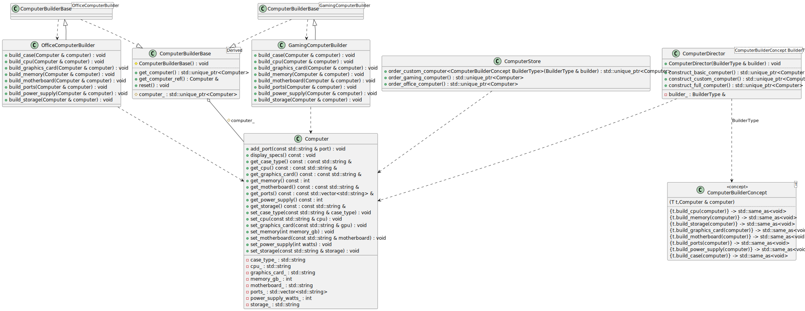

# t00100 - Test case for builder design pattern using static polymorphism
## Config
```yaml
diagrams:
  t00100_class:
    type: class
    glob:
      - t00100.cc
    include:
      namespaces:
        - clanguml::t00100
    using_namespace: clanguml::t00100
```
## Source code
File `tests/t00100/t00100.cc`
```cpp
#include <concepts>
#include <memory>
#include <string>
#include <vector>

namespace clanguml {
namespace t00100 {

// Builder pattern implementation using static polymorphism with C++20 concepts

// Product - the complex object to be built
class Computer {
public:
    void set_cpu(const std::string &cpu) { cpu_ = cpu; }
    void set_memory(int memory_gb) { memory_gb_ = memory_gb; }
    void set_storage(const std::string &storage) { storage_ = storage; }
    void set_graphics_card(const std::string &gpu) { graphics_card_ = gpu; }
    void set_motherboard(const std::string &motherboard)
    {
        motherboard_ = motherboard;
    }
    void add_port(const std::string &port) { ports_.push_back(port); }
    void set_power_supply(int watts) { power_supply_watts_ = watts; }
    void set_case_type(const std::string &case_type) { case_type_ = case_type; }

    const std::string &get_cpu() const { return cpu_; }
    int get_memory() const { return memory_gb_; }
    const std::string &get_storage() const { return storage_; }
    const std::string &get_graphics_card() const { return graphics_card_; }
    const std::string &get_motherboard() const { return motherboard_; }
    const std::vector<std::string> &get_ports() const { return ports_; }
    int get_power_supply() const { return power_supply_watts_; }
    const std::string &get_case_type() const { return case_type_; }

    void display_specs() const { }

private:
    std::string cpu_;
    int memory_gb_{0};
    std::string storage_;
    std::string graphics_card_;
    std::string motherboard_;
    std::vector<std::string> ports_;
    int power_supply_watts_{0};
    std::string case_type_;
};

// C++20 concept for Builder interface using static polymorphism
template <typename T>
concept ComputerBuilderConcept = requires(T t, Computer &computer) {
    { t.build_cpu(computer) } -> std::same_as<void>;
    { t.build_memory(computer) } -> std::same_as<void>;
    { t.build_storage(computer) } -> std::same_as<void>;
    { t.build_graphics_card(computer) } -> std::same_as<void>;
    { t.build_motherboard(computer) } -> std::same_as<void>;
    { t.build_ports(computer) } -> std::same_as<void>;
    { t.build_power_supply(computer) } -> std::same_as<void>;
    { t.build_case(computer) } -> std::same_as<void>;
};

// Template base for concrete builders
template <typename Derived> class ComputerBuilderBase {
public:
    std::unique_ptr<Computer> get_computer()
    {
        auto result = std::move(computer_);
        reset();
        return result;
    }

    Computer &get_computer_ref() { return *computer_; }

    void reset() { computer_ = std::make_unique<Computer>(); }

protected:
    std::unique_ptr<Computer> computer_;

    ComputerBuilderBase() { reset(); }
};

// Concrete Builder for Gaming Computer using static polymorphism
class GamingComputerBuilder
    : public ComputerBuilderBase<GamingComputerBuilder> {
public:
    void build_cpu(Computer &computer)
    {
        computer.set_cpu("Intel Core i9-13900K");
    }

    void build_memory(Computer &computer) { computer.set_memory(32); }

    void build_storage(Computer &computer)
    {
        computer.set_storage("1TB NVMe SSD");
    }

    void build_graphics_card(Computer &computer)
    {
        computer.set_graphics_card("NVIDIA RTX 4080");
    }

    void build_motherboard(Computer &computer)
    {
        computer.set_motherboard("ASUS ROG Maximus Z790");
    }

    void build_ports(Computer &computer)
    {
        computer.add_port("USB 3.2");
        computer.add_port("USB-C");
        computer.add_port("HDMI 2.1");
        computer.add_port("DisplayPort 1.4");
        computer.add_port("Ethernet");
        computer.add_port("Audio Jack");
    }

    void build_power_supply(Computer &computer)
    {
        computer.set_power_supply(850);
    }

    void build_case(Computer &computer)
    {
        computer.set_case_type("Full Tower RGB");
    }
};

// Concrete Builder for Office Computer using static polymorphism
class OfficeComputerBuilder
    : public ComputerBuilderBase<OfficeComputerBuilder> {
public:
    void build_cpu(Computer &computer)
    {
        computer.set_cpu("Intel Core i5-13400");
    }

    void build_memory(Computer &computer) { computer.set_memory(16); }

    void build_storage(Computer &computer)
    {
        computer.set_storage("512GB SSD");
    }

    void build_graphics_card(Computer &computer)
    {
        computer.set_graphics_card("Integrated Graphics");
    }

    void build_motherboard(Computer &computer)
    {
        computer.set_motherboard("MSI Pro B760M");
    }

    void build_ports(Computer &computer)
    {
        computer.add_port("USB 3.0");
        computer.add_port("USB 2.0");
        computer.add_port("HDMI");
        computer.add_port("VGA");
        computer.add_port("Ethernet");
        computer.add_port("Audio Jack");
    }

    void build_power_supply(Computer &computer)
    {
        computer.set_power_supply(450);
    }

    void build_case(Computer &computer)
    {
        computer.set_case_type("Mini Tower");
    }
};

// Director template using static polymorphism and C++20 concepts
template <ComputerBuilderConcept BuilderType> class ComputerDirector {
public:
    explicit ComputerDirector(BuilderType &builder)
        : builder_(builder)
    {
    }

    std::unique_ptr<Computer> construct_basic_computer()
    {
        builder_.reset();
        auto &computer = builder_.get_computer_ref();
        builder_.build_cpu(computer);
        builder_.build_memory(computer);
        builder_.build_storage(computer);
        builder_.build_motherboard(computer);
        builder_.build_power_supply(computer);
        builder_.build_case(computer);
        return builder_.get_computer();
    }

    std::unique_ptr<Computer> construct_full_computer()
    {
        builder_.reset();
        auto &computer = builder_.get_computer_ref();
        builder_.build_cpu(computer);
        builder_.build_memory(computer);
        builder_.build_storage(computer);
        builder_.build_graphics_card(computer);
        builder_.build_motherboard(computer);
        builder_.build_ports(computer);
        builder_.build_power_supply(computer);
        builder_.build_case(computer);
        return builder_.get_computer();
    }

    std::unique_ptr<Computer> construct_custom_computer()
    {
        builder_.reset();
        auto &computer = builder_.get_computer_ref();
        builder_.build_cpu(computer);
        builder_.build_memory(computer);
        builder_.build_storage(computer);
        builder_.build_graphics_card(computer);
        builder_.build_motherboard(computer);
        return builder_.get_computer();
    }

private:
    BuilderType &builder_;
};

// Client code demonstrating the Builder pattern with static polymorphism
class ComputerStore {
public:
    std::unique_ptr<Computer> order_gaming_computer()
    {
        GamingComputerBuilder builder;
        ComputerDirector director(builder);
        return director.construct_full_computer();
    }

    std::unique_ptr<Computer> order_office_computer()
    {
        OfficeComputerBuilder builder;
        ComputerDirector director(builder);
        return director.construct_full_computer();
    }

    template <ComputerBuilderConcept BuilderType>
    std::unique_ptr<Computer> order_custom_computer(BuilderType &builder)
    {
        ComputerDirector director(builder);
        return director.construct_custom_computer();
    }
};

} // namespace t00100
} // namespace clanguml
```
## Generated PlantUML diagrams

## Generated Mermaid diagrams

## Generated JSON models
```json
{
  "diagram_type": "class",
  "elements": [
    {
      "bases": [],
      "display_name": "Computer",
      "id": "6827834764220301334",
      "is_abstract": false,
      "is_nested": false,
      "is_struct": false,
      "is_template": false,
      "is_union": false,
      "members": [
        {
          "access": "private",
          "is_static": false,
          "name": "cpu_",
          "source_location": {
            "column": 17,
            "file": "t00100.cc",
            "line": 38,
            "translation_unit": "t00100.cc"
          },
          "type": "std::string"
        },
        {
          "access": "private",
          "is_static": false,
          "name": "memory_gb_",
          "source_location": {
            "column": 9,
            "file": "t00100.cc",
            "line": 39,
            "translation_unit": "t00100.cc"
          },
          "type": "int"
        },
        {
          "access": "private",
          "is_static": false,
          "name": "storage_",
          "source_location": {
            "column": 17,
            "file": "t00100.cc",
            "line": 40,
            "translation_unit": "t00100.cc"
          },
          "type": "std::string"
        },
        {
          "access": "private",
          "is_static": false,
          "name": "graphics_card_",
          "source_location": {
            "column": 17,
            "file": "t00100.cc",
            "line": 41,
            "translation_unit": "t00100.cc"
          },
          "type": "std::string"
        },
        {
          "access": "private",
          "is_static": false,
          "name": "motherboard_",
          "source_location": {
            "column": 17,
            "file": "t00100.cc",
            "line": 42,
            "translation_unit": "t00100.cc"
          },
          "type": "std::string"
        },
        {
          "access": "private",
          "is_static": false,
          "name": "ports_",
          "source_location": {
            "column": 30,
            "file": "t00100.cc",
            "line": 43,
            "translation_unit": "t00100.cc"
          },
          "type": "std::vector<std::string>"
        },
        {
          "access": "private",
          "is_static": false,
          "name": "power_supply_watts_",
          "source_location": {
            "column": 9,
            "file": "t00100.cc",
            "line": 44,
            "translation_unit": "t00100.cc"
          },
          "type": "int"
        },
        {
          "access": "private",
          "is_static": false,
          "name": "case_type_",
          "source_location": {
            "column": 17,
            "file": "t00100.cc",
            "line": 45,
            "translation_unit": "t00100.cc"
          },
          "type": "std::string"
        }
      ],
      "methods": [
        {
          "access": "public",
          "display_name": "set_cpu",
          "is_const": false,
          "is_consteval": false,
          "is_constexpr": false,
          "is_constructor": false,
          "is_copy_assignment": false,
          "is_coroutine": false,
          "is_defaulted": false,
          "is_deleted": false,
          "is_move_assignment": false,
          "is_noexcept": false,
          "is_operator": false,
          "is_pure_virtual": false,
          "is_static": false,
          "is_virtual": false,
          "name": "set_cpu",
          "parameters": [
            {
              "name": "cpu",
              "type": "const std::string &"
            }
          ],
          "source_location": {
            "column": 10,
            "file": "t00100.cc",
            "line": 14,
            "translation_unit": "t00100.cc"
          },
          "template_parameters": [],
          "type": "void"
        },
        {
          "access": "public",
          "display_name": "set_memory",
          "is_const": false,
          "is_consteval": false,
          "is_constexpr": false,
          "is_constructor": false,
          "is_copy_assignment": false,
          "is_coroutine": false,
          "is_defaulted": false,
          "is_deleted": false,
          "is_move_assignment": false,
          "is_noexcept": false,
          "is_operator": false,
          "is_pure_virtual": false,
          "is_static": false,
          "is_virtual": false,
          "name": "set_memory",
          "parameters": [
            {
              "name": "memory_gb",
              "type": "int"
            }
          ],
          "source_location": {
            "column": 10,
            "file": "t00100.cc",
            "line": 15,
            "translation_unit": "t00100.cc"
          },
          "template_parameters": [],
          "type": "void"
        },
        {
          "access": "public",
          "display_name": "set_storage",
          "is_const": false,
          "is_consteval": false,
          "is_constexpr": false,
          "is_constructor": false,
          "is_copy_assignment": false,
          "is_coroutine": false,
          "is_defaulted": false,
          "is_deleted": false,
          "is_move_assignment": false,
          "is_noexcept": false,
          "is_operator": false,
          "is_pure_virtual": false,
          "is_static": false,
          "is_virtual": false,
          "name": "set_storage",
          "parameters": [
            {
              "name": "storage",
              "type": "const std::string &"
            }
          ],
          "source_location": {
            "column": 10,
            "file": "t00100.cc",
            "line": 16,
            "translation_unit": "t00100.cc"
          },
          "template_parameters": [],
          "type": "void"
        },
        {
          "access": "public",
          "display_name": "set_graphics_card",
          "is_const": false,
          "is_consteval": false,
          "is_constexpr": false,
          "is_constructor": false,
          "is_copy_assignment": false,
          "is_coroutine": false,
          "is_defaulted": false,
          "is_deleted": false,
          "is_move_assignment": false,
          "is_noexcept": false,
          "is_operator": false,
          "is_pure_virtual": false,
          "is_static": false,
          "is_virtual": false,
          "name": "set_graphics_card",
          "parameters": [
            {
              "name": "gpu",
              "type": "const std::string &"
            }
          ],
          "source_location": {
            "column": 10,
            "file": "t00100.cc",
            "line": 17,
            "translation_unit": "t00100.cc"
          },
          "template_parameters": [],
          "type": "void"
        },
        {
          "access": "public",
          "display_name": "set_motherboard",
          "is_const": false,
          "is_consteval": false,
          "is_constexpr": false,
          "is_constructor": false,
          "is_copy_assignment": false,
          "is_coroutine": false,
          "is_defaulted": false,
          "is_deleted": false,
          "is_move_assignment": false,
          "is_noexcept": false,
          "is_operator": false,
          "is_pure_virtual": false,
          "is_static": false,
          "is_virtual": false,
          "name": "set_motherboard",
          "parameters": [
            {
              "name": "motherboard",
              "type": "const std::string &"
            }
          ],
          "source_location": {
            "column": 10,
            "file": "t00100.cc",
            "line": 18,
            "translation_unit": "t00100.cc"
          },
          "template_parameters": [],
          "type": "void"
        },
        {
          "access": "public",
          "display_name": "add_port",
          "is_const": false,
          "is_consteval": false,
          "is_constexpr": false,
          "is_constructor": false,
          "is_copy_assignment": false,
          "is_coroutine": false,
          "is_defaulted": false,
          "is_deleted": false,
          "is_move_assignment": false,
          "is_noexcept": false,
          "is_operator": false,
          "is_pure_virtual": false,
          "is_static": false,
          "is_virtual": false,
          "name": "add_port",
          "parameters": [
            {
              "name": "port",
              "type": "const std::string &"
            }
          ],
          "source_location": {
            "column": 10,
            "file": "t00100.cc",
            "line": 22,
            "translation_unit": "t00100.cc"
          },
          "template_parameters": [],
          "type": "void"
        },
        {
          "access": "public",
          "display_name": "set_power_supply",
          "is_const": false,
          "is_consteval": false,
          "is_constexpr": false,
          "is_constructor": false,
          "is_copy_assignment": false,
          "is_coroutine": false,
          "is_defaulted": false,
          "is_deleted": false,
          "is_move_assignment": false,
          "is_noexcept": false,
          "is_operator": false,
          "is_pure_virtual": false,
          "is_static": false,
          "is_virtual": false,
          "name": "set_power_supply",
          "parameters": [
            {
              "name": "watts",
              "type": "int"
            }
          ],
          "source_location": {
            "column": 10,
            "file": "t00100.cc",
            "line": 23,
            "translation_unit": "t00100.cc"
          },
          "template_parameters": [],
          "type": "void"
        },
        {
          "access": "public",
          "display_name": "set_case_type",
          "is_const": false,
          "is_consteval": false,
          "is_constexpr": false,
          "is_constructor": false,
          "is_copy_assignment": false,
          "is_coroutine": false,
          "is_defaulted": false,
          "is_deleted": false,
          "is_move_assignment": false,
          "is_noexcept": false,
          "is_operator": false,
          "is_pure_virtual": false,
          "is_static": false,
          "is_virtual": false,
          "name": "set_case_type",
          "parameters": [
            {
              "name": "case_type",
              "type": "const std::string &"
            }
          ],
          "source_location": {
            "column": 10,
            "file": "t00100.cc",
            "line": 24,
            "translation_unit": "t00100.cc"
          },
          "template_parameters": [],
          "type": "void"
        },
        {
          "access": "public",
          "display_name": "get_cpu",
          "is_const": true,
          "is_consteval": false,
          "is_constexpr": false,
          "is_constructor": false,
          "is_copy_assignment": false,
          "is_coroutine": false,
          "is_defaulted": false,
          "is_deleted": false,
          "is_move_assignment": false,
          "is_noexcept": false,
          "is_operator": false,
          "is_pure_virtual": false,
          "is_static": false,
          "is_virtual": false,
          "name": "get_cpu",
          "parameters": [],
          "source_location": {
            "column": 24,
            "file": "t00100.cc",
            "line": 26,
            "translation_unit": "t00100.cc"
          },
          "template_parameters": [],
          "type": "const std::string &"
        },
        {
          "access": "public",
          "display_name": "get_memory",
          "is_const": true,
          "is_consteval": false,
          "is_constexpr": false,
          "is_constructor": false,
          "is_copy_assignment": false,
          "is_coroutine": false,
          "is_defaulted": false,
          "is_deleted": false,
          "is_move_assignment": false,
          "is_noexcept": false,
          "is_operator": false,
          "is_pure_virtual": false,
          "is_static": false,
          "is_virtual": false,
          "name": "get_memory",
          "parameters": [],
          "source_location": {
            "column": 9,
            "file": "t00100.cc",
            "line": 27,
            "translation_unit": "t00100.cc"
          },
          "template_parameters": [],
          "type": "int"
        },
        {
          "access": "public",
          "display_name": "get_storage",
          "is_const": true,
          "is_consteval": false,
          "is_constexpr": false,
          "is_constructor": false,
          "is_copy_assignment": false,
          "is_coroutine": false,
          "is_defaulted": false,
          "is_deleted": false,
          "is_move_assignment": false,
          "is_noexcept": false,
          "is_operator": false,
          "is_pure_virtual": false,
          "is_static": false,
          "is_virtual": false,
          "name": "get_storage",
          "parameters": [],
          "source_location": {
            "column": 24,
            "file": "t00100.cc",
            "line": 28,
            "translation_unit": "t00100.cc"
          },
          "template_parameters": [],
          "type": "const std::string &"
        },
        {
          "access": "public",
          "display_name": "get_graphics_card",
          "is_const": true,
          "is_consteval": false,
          "is_constexpr": false,
          "is_constructor": false,
          "is_copy_assignment": false,
          "is_coroutine": false,
          "is_defaulted": false,
          "is_deleted": false,
          "is_move_assignment": false,
          "is_noexcept": false,
          "is_operator": false,
          "is_pure_virtual": false,
          "is_static": false,
          "is_virtual": false,
          "name": "get_graphics_card",
          "parameters": [],
          "source_location": {
            "column": 24,
            "file": "t00100.cc",
            "line": 29,
            "translation_unit": "t00100.cc"
          },
          "template_parameters": [],
          "type": "const std::string &"
        },
        {
          "access": "public",
          "display_name": "get_motherboard",
          "is_const": true,
          "is_consteval": false,
          "is_constexpr": false,
          "is_constructor": false,
          "is_copy_assignment": false,
          "is_coroutine": false,
          "is_defaulted": false,
          "is_deleted": false,
          "is_move_assignment": false,
          "is_noexcept": false,
          "is_operator": false,
          "is_pure_virtual": false,
          "is_static": false,
          "is_virtual": false,
          "name": "get_motherboard",
          "parameters": [],
          "source_location": {
            "column": 24,
            "file": "t00100.cc",
            "line": 30,
            "translation_unit": "t00100.cc"
          },
          "template_parameters": [],
          "type": "const std::string &"
        },
        {
          "access": "public",
          "display_name": "get_ports",
          "is_const": true,
          "is_consteval": false,
          "is_constexpr": false,
          "is_constructor": false,
          "is_copy_assignment": false,
          "is_coroutine": false,
          "is_defaulted": false,
          "is_deleted": false,
          "is_move_assignment": false,
          "is_noexcept": false,
          "is_operator": false,
          "is_pure_virtual": false,
          "is_static": false,
          "is_virtual": false,
          "name": "get_ports",
          "parameters": [],
          "source_location": {
            "column": 37,
            "file": "t00100.cc",
            "line": 31,
            "translation_unit": "t00100.cc"
          },
          "template_parameters": [],
          "type": "const std::vector<std::string> &"
        },
        {
          "access": "public",
          "display_name": "get_power_supply",
          "is_const": true,
          "is_consteval": false,
          "is_constexpr": false,
          "is_constructor": false,
          "is_copy_assignment": false,
          "is_coroutine": false,
          "is_defaulted": false,
          "is_deleted": false,
          "is_move_assignment": false,
          "is_noexcept": false,
          "is_operator": false,
          "is_pure_virtual": false,
          "is_static": false,
          "is_virtual": false,
          "name": "get_power_supply",
          "parameters": [],
          "source_location": {
            "column": 9,
            "file": "t00100.cc",
            "line": 32,
            "translation_unit": "t00100.cc"
          },
          "template_parameters": [],
          "type": "int"
        },
        {
          "access": "public",
          "display_name": "get_case_type",
          "is_const": true,
          "is_consteval": false,
          "is_constexpr": false,
          "is_constructor": false,
          "is_copy_assignment": false,
          "is_coroutine": false,
          "is_defaulted": false,
          "is_deleted": false,
          "is_move_assignment": false,
          "is_noexcept": false,
          "is_operator": false,
          "is_pure_virtual": false,
          "is_static": false,
          "is_virtual": false,
          "name": "get_case_type",
          "parameters": [],
          "source_location": {
            "column": 24,
            "file": "t00100.cc",
            "line": 33,
            "translation_unit": "t00100.cc"
          },
          "template_parameters": [],
          "type": "const std::string &"
        },
        {
          "access": "public",
          "display_name": "display_specs",
          "is_const": true,
          "is_consteval": false,
          "is_constexpr": false,
          "is_constructor": false,
          "is_copy_assignment": false,
          "is_coroutine": false,
          "is_defaulted": false,
          "is_deleted": false,
          "is_move_assignment": false,
          "is_noexcept": false,
          "is_operator": false,
          "is_pure_virtual": false,
          "is_static": false,
          "is_virtual": false,
          "name": "display_specs",
          "parameters": [],
          "source_location": {
            "column": 10,
            "file": "t00100.cc",
            "line": 35,
            "translation_unit": "t00100.cc"
          },
          "template_parameters": [],
          "type": "void"
        }
      ],
      "name": "Computer",
      "namespace": "clanguml::t00100",
      "source_location": {
        "column": 7,
        "file": "t00100.cc",
        "line": 12,
        "translation_unit": "t00100.cc"
      },
      "template_parameters": [],
      "type": "class"
    },
    {
      "display_name": "ComputerBuilderConcept<T>",
      "id": "431987183704199885",
      "name": "ComputerBuilderConcept",
      "namespace": "clanguml::t00100",
      "parameters": [
        {
          "name": "t",
          "type": "T"
        },
        {
          "name": "computer",
          "type": "Computer &"
        }
      ],
      "source_location": {
        "column": 9,
        "file": "t00100.cc",
        "line": 50,
        "translation_unit": "t00100.cc"
      },
      "statements": [
        "{t.build_cpu(computer)} -> std::same_as<void>",
        "{t.build_memory(computer)} -> std::same_as<void>",
        "{t.build_storage(computer)} -> std::same_as<void>",
        "{t.build_graphics_card(computer)} -> std::same_as<void>",
        "{t.build_motherboard(computer)} -> std::same_as<void>",
        "{t.build_ports(computer)} -> std::same_as<void>",
        "{t.build_power_supply(computer)} -> std::same_as<void>",
        "{t.build_case(computer)} -> std::same_as<void>"
      ],
      "type": "concept"
    },
    {
      "bases": [],
      "display_name": "ComputerBuilderBase<Derived>",
      "id": "4689822801959945338",
      "is_abstract": false,
      "is_nested": false,
      "is_struct": false,
      "is_template": true,
      "is_union": false,
      "members": [
        {
          "access": "protected",
          "is_static": false,
          "name": "computer_",
          "source_location": {
            "column": 31,
            "file": "t00100.cc",
            "line": 76,
            "translation_unit": "t00100.cc"
          },
          "type": "std::unique_ptr<Computer>"
        }
      ],
      "methods": [
        {
          "access": "public",
          "display_name": "get_computer",
          "is_const": false,
          "is_consteval": false,
          "is_constexpr": false,
          "is_constructor": false,
          "is_copy_assignment": false,
          "is_coroutine": false,
          "is_defaulted": false,
          "is_deleted": false,
          "is_move_assignment": false,
          "is_noexcept": false,
          "is_operator": false,
          "is_pure_virtual": false,
          "is_static": false,
          "is_virtual": false,
          "name": "get_computer",
          "parameters": [],
          "source_location": {
            "column": 31,
            "file": "t00100.cc",
            "line": 64,
            "translation_unit": "t00100.cc"
          },
          "template_parameters": [],
          "type": "std::unique_ptr<Computer>"
        },
        {
          "access": "public",
          "display_name": "get_computer_ref",
          "is_const": false,
          "is_consteval": false,
          "is_constexpr": false,
          "is_constructor": false,
          "is_copy_assignment": false,
          "is_coroutine": false,
          "is_defaulted": false,
          "is_deleted": false,
          "is_move_assignment": false,
          "is_noexcept": false,
          "is_operator": false,
          "is_pure_virtual": false,
          "is_static": false,
          "is_virtual": false,
          "name": "get_computer_ref",
          "parameters": [],
          "source_location": {
            "column": 15,
            "file": "t00100.cc",
            "line": 71,
            "translation_unit": "t00100.cc"
          },
          "template_parameters": [],
          "type": "Computer &"
        },
        {
          "access": "public",
          "display_name": "reset",
          "is_const": false,
          "is_consteval": false,
          "is_constexpr": false,
          "is_constructor": false,
          "is_copy_assignment": false,
          "is_coroutine": false,
          "is_defaulted": false,
          "is_deleted": false,
          "is_move_assignment": false,
          "is_noexcept": false,
          "is_operator": false,
          "is_pure_virtual": false,
          "is_static": false,
          "is_virtual": false,
          "name": "reset",
          "parameters": [],
          "source_location": {
            "column": 10,
            "file": "t00100.cc",
            "line": 73,
            "translation_unit": "t00100.cc"
          },
          "template_parameters": [],
          "type": "void"
        },
        {
          "access": "protected",
          "display_name": "ComputerBuilderBase",
          "is_const": false,
          "is_consteval": false,
          "is_constexpr": false,
          "is_constructor": true,
          "is_copy_assignment": false,
          "is_coroutine": false,
          "is_defaulted": false,
          "is_deleted": false,
          "is_move_assignment": false,
          "is_noexcept": false,
          "is_operator": false,
          "is_pure_virtual": false,
          "is_static": false,
          "is_virtual": false,
          "name": "ComputerBuilderBase",
          "parameters": [],
          "source_location": {
            "column": 5,
            "file": "t00100.cc",
            "line": 78,
            "translation_unit": "t00100.cc"
          },
          "template_parameters": [],
          "type": "void"
        }
      ],
      "name": "ComputerBuilderBase",
      "namespace": "clanguml::t00100",
      "source_location": {
        "column": 35,
        "file": "t00100.cc",
        "line": 62,
        "translation_unit": "t00100.cc"
      },
      "template_parameters": [
        {
          "is_variadic": false,
          "kind": "template_type",
          "name": "Derived",
          "template_parameters": []
        }
      ],
      "type": "class"
    },
    {
      "bases": [],
      "display_name": "ComputerBuilderBase<GamingComputerBuilder>",
      "id": "5914491979003344838",
      "is_abstract": false,
      "is_nested": false,
      "is_struct": false,
      "is_template": true,
      "is_union": false,
      "members": [],
      "methods": [],
      "name": "ComputerBuilderBase",
      "namespace": "clanguml::t00100",
      "source_location": {
        "column": 7,
        "file": "t00100.cc",
        "line": 82,
        "translation_unit": "t00100.cc"
      },
      "template_parameters": [
        {
          "is_variadic": false,
          "kind": "argument",
          "template_parameters": [],
          "type": "GamingComputerBuilder"
        }
      ],
      "type": "class"
    },
    {
      "bases": [
        {
          "access": "public",
          "id": "5914491979003344838",
          "is_virtual": false
        }
      ],
      "display_name": "GamingComputerBuilder",
      "id": "16867399468362730095",
      "is_abstract": false,
      "is_nested": false,
      "is_struct": false,
      "is_template": false,
      "is_union": false,
      "members": [],
      "methods": [
        {
          "access": "public",
          "display_name": "build_cpu",
          "is_const": false,
          "is_consteval": false,
          "is_constexpr": false,
          "is_constructor": false,
          "is_copy_assignment": false,
          "is_coroutine": false,
          "is_defaulted": false,
          "is_deleted": false,
          "is_move_assignment": false,
          "is_noexcept": false,
          "is_operator": false,
          "is_pure_virtual": false,
          "is_static": false,
          "is_virtual": false,
          "name": "build_cpu",
          "parameters": [
            {
              "name": "computer",
              "type": "Computer &"
            }
          ],
          "source_location": {
            "column": 10,
            "file": "t00100.cc",
            "line": 85,
            "translation_unit": "t00100.cc"
          },
          "template_parameters": [],
          "type": "void"
        },
        {
          "access": "public",
          "display_name": "build_memory",
          "is_const": false,
          "is_consteval": false,
          "is_constexpr": false,
          "is_constructor": false,
          "is_copy_assignment": false,
          "is_coroutine": false,
          "is_defaulted": false,
          "is_deleted": false,
          "is_move_assignment": false,
          "is_noexcept": false,
          "is_operator": false,
          "is_pure_virtual": false,
          "is_static": false,
          "is_virtual": false,
          "name": "build_memory",
          "parameters": [
            {
              "name": "computer",
              "type": "Computer &"
            }
          ],
          "source_location": {
            "column": 10,
            "file": "t00100.cc",
            "line": 90,
            "translation_unit": "t00100.cc"
          },
          "template_parameters": [],
          "type": "void"
        },
        {
          "access": "public",
          "display_name": "build_storage",
          "is_const": false,
          "is_consteval": false,
          "is_constexpr": false,
          "is_constructor": false,
          "is_copy_assignment": false,
          "is_coroutine": false,
          "is_defaulted": false,
          "is_deleted": false,
          "is_move_assignment": false,
          "is_noexcept": false,
          "is_operator": false,
          "is_pure_virtual": false,
          "is_static": false,
          "is_virtual": false,
          "name": "build_storage",
          "parameters": [
            {
              "name": "computer",
              "type": "Computer &"
            }
          ],
          "source_location": {
            "column": 10,
            "file": "t00100.cc",
            "line": 92,
            "translation_unit": "t00100.cc"
          },
          "template_parameters": [],
          "type": "void"
        },
        {
          "access": "public",
          "display_name": "build_graphics_card",
          "is_const": false,
          "is_consteval": false,
          "is_constexpr": false,
          "is_constructor": false,
          "is_copy_assignment": false,
          "is_coroutine": false,
          "is_defaulted": false,
          "is_deleted": false,
          "is_move_assignment": false,
          "is_noexcept": false,
          "is_operator": false,
          "is_pure_virtual": false,
          "is_static": false,
          "is_virtual": false,
          "name": "build_graphics_card",
          "parameters": [
            {
              "name": "computer",
              "type": "Computer &"
            }
          ],
          "source_location": {
            "column": 10,
            "file": "t00100.cc",
            "line": 97,
            "translation_unit": "t00100.cc"
          },
          "template_parameters": [],
          "type": "void"
        },
        {
          "access": "public",
          "display_name": "build_motherboard",
          "is_const": false,
          "is_consteval": false,
          "is_constexpr": false,
          "is_constructor": false,
          "is_copy_assignment": false,
          "is_coroutine": false,
          "is_defaulted": false,
          "is_deleted": false,
          "is_move_assignment": false,
          "is_noexcept": false,
          "is_operator": false,
          "is_pure_virtual": false,
          "is_static": false,
          "is_virtual": false,
          "name": "build_motherboard",
          "parameters": [
            {
              "name": "computer",
              "type": "Computer &"
            }
          ],
          "source_location": {
            "column": 10,
            "file": "t00100.cc",
            "line": 102,
            "translation_unit": "t00100.cc"
          },
          "template_parameters": [],
          "type": "void"
        },
        {
          "access": "public",
          "display_name": "build_ports",
          "is_const": false,
          "is_consteval": false,
          "is_constexpr": false,
          "is_constructor": false,
          "is_copy_assignment": false,
          "is_coroutine": false,
          "is_defaulted": false,
          "is_deleted": false,
          "is_move_assignment": false,
          "is_noexcept": false,
          "is_operator": false,
          "is_pure_virtual": false,
          "is_static": false,
          "is_virtual": false,
          "name": "build_ports",
          "parameters": [
            {
              "name": "computer",
              "type": "Computer &"
            }
          ],
          "source_location": {
            "column": 10,
            "file": "t00100.cc",
            "line": 107,
            "translation_unit": "t00100.cc"
          },
          "template_parameters": [],
          "type": "void"
        },
        {
          "access": "public",
          "display_name": "build_power_supply",
          "is_const": false,
          "is_consteval": false,
          "is_constexpr": false,
          "is_constructor": false,
          "is_copy_assignment": false,
          "is_coroutine": false,
          "is_defaulted": false,
          "is_deleted": false,
          "is_move_assignment": false,
          "is_noexcept": false,
          "is_operator": false,
          "is_pure_virtual": false,
          "is_static": false,
          "is_virtual": false,
          "name": "build_power_supply",
          "parameters": [
            {
              "name": "computer",
              "type": "Computer &"
            }
          ],
          "source_location": {
            "column": 10,
            "file": "t00100.cc",
            "line": 117,
            "translation_unit": "t00100.cc"
          },
          "template_parameters": [],
          "type": "void"
        },
        {
          "access": "public",
          "display_name": "build_case",
          "is_const": false,
          "is_consteval": false,
          "is_constexpr": false,
          "is_constructor": false,
          "is_copy_assignment": false,
          "is_coroutine": false,
          "is_defaulted": false,
          "is_deleted": false,
          "is_move_assignment": false,
          "is_noexcept": false,
          "is_operator": false,
          "is_pure_virtual": false,
          "is_static": false,
          "is_virtual": false,
          "name": "build_case",
          "parameters": [
            {
              "name": "computer",
              "type": "Computer &"
            }
          ],
          "source_location": {
            "column": 10,
            "file": "t00100.cc",
            "line": 122,
            "translation_unit": "t00100.cc"
          },
          "template_parameters": [],
          "type": "void"
        }
      ],
      "name": "GamingComputerBuilder",
      "namespace": "clanguml::t00100",
      "source_location": {
        "column": 7,
        "file": "t00100.cc",
        "line": 82,
        "translation_unit": "t00100.cc"
      },
      "template_parameters": [],
      "type": "class"
    },
    {
      "bases": [],
      "display_name": "ComputerBuilderBase<OfficeComputerBuilder>",
      "id": "12505201150258931951",
      "is_abstract": false,
      "is_nested": false,
      "is_struct": false,
      "is_template": true,
      "is_union": false,
      "members": [],
      "methods": [],
      "name": "ComputerBuilderBase",
      "namespace": "clanguml::t00100",
      "source_location": {
        "column": 7,
        "file": "t00100.cc",
        "line": 129,
        "translation_unit": "t00100.cc"
      },
      "template_parameters": [
        {
          "is_variadic": false,
          "kind": "argument",
          "template_parameters": [],
          "type": "OfficeComputerBuilder"
        }
      ],
      "type": "class"
    },
    {
      "bases": [
        {
          "access": "public",
          "id": "12505201150258931951",
          "is_virtual": false
        }
      ],
      "display_name": "OfficeComputerBuilder",
      "id": "16647461979205590288",
      "is_abstract": false,
      "is_nested": false,
      "is_struct": false,
      "is_template": false,
      "is_union": false,
      "members": [],
      "methods": [
        {
          "access": "public",
          "display_name": "build_cpu",
          "is_const": false,
          "is_consteval": false,
          "is_constexpr": false,
          "is_constructor": false,
          "is_copy_assignment": false,
          "is_coroutine": false,
          "is_defaulted": false,
          "is_deleted": false,
          "is_move_assignment": false,
          "is_noexcept": false,
          "is_operator": false,
          "is_pure_virtual": false,
          "is_static": false,
          "is_virtual": false,
          "name": "build_cpu",
          "parameters": [
            {
              "name": "computer",
              "type": "Computer &"
            }
          ],
          "source_location": {
            "column": 10,
            "file": "t00100.cc",
            "line": 132,
            "translation_unit": "t00100.cc"
          },
          "template_parameters": [],
          "type": "void"
        },
        {
          "access": "public",
          "display_name": "build_memory",
          "is_const": false,
          "is_consteval": false,
          "is_constexpr": false,
          "is_constructor": false,
          "is_copy_assignment": false,
          "is_coroutine": false,
          "is_defaulted": false,
          "is_deleted": false,
          "is_move_assignment": false,
          "is_noexcept": false,
          "is_operator": false,
          "is_pure_virtual": false,
          "is_static": false,
          "is_virtual": false,
          "name": "build_memory",
          "parameters": [
            {
              "name": "computer",
              "type": "Computer &"
            }
          ],
          "source_location": {
            "column": 10,
            "file": "t00100.cc",
            "line": 137,
            "translation_unit": "t00100.cc"
          },
          "template_parameters": [],
          "type": "void"
        },
        {
          "access": "public",
          "display_name": "build_storage",
          "is_const": false,
          "is_consteval": false,
          "is_constexpr": false,
          "is_constructor": false,
          "is_copy_assignment": false,
          "is_coroutine": false,
          "is_defaulted": false,
          "is_deleted": false,
          "is_move_assignment": false,
          "is_noexcept": false,
          "is_operator": false,
          "is_pure_virtual": false,
          "is_static": false,
          "is_virtual": false,
          "name": "build_storage",
          "parameters": [
            {
              "name": "computer",
              "type": "Computer &"
            }
          ],
          "source_location": {
            "column": 10,
            "file": "t00100.cc",
            "line": 139,
            "translation_unit": "t00100.cc"
          },
          "template_parameters": [],
          "type": "void"
        },
        {
          "access": "public",
          "display_name": "build_graphics_card",
          "is_const": false,
          "is_consteval": false,
          "is_constexpr": false,
          "is_constructor": false,
          "is_copy_assignment": false,
          "is_coroutine": false,
          "is_defaulted": false,
          "is_deleted": false,
          "is_move_assignment": false,
          "is_noexcept": false,
          "is_operator": false,
          "is_pure_virtual": false,
          "is_static": false,
          "is_virtual": false,
          "name": "build_graphics_card",
          "parameters": [
            {
              "name": "computer",
              "type": "Computer &"
            }
          ],
          "source_location": {
            "column": 10,
            "file": "t00100.cc",
            "line": 144,
            "translation_unit": "t00100.cc"
          },
          "template_parameters": [],
          "type": "void"
        },
        {
          "access": "public",
          "display_name": "build_motherboard",
          "is_const": false,
          "is_consteval": false,
          "is_constexpr": false,
          "is_constructor": false,
          "is_copy_assignment": false,
          "is_coroutine": false,
          "is_defaulted": false,
          "is_deleted": false,
          "is_move_assignment": false,
          "is_noexcept": false,
          "is_operator": false,
          "is_pure_virtual": false,
          "is_static": false,
          "is_virtual": false,
          "name": "build_motherboard",
          "parameters": [
            {
              "name": "computer",
              "type": "Computer &"
            }
          ],
          "source_location": {
            "column": 10,
            "file": "t00100.cc",
            "line": 149,
            "translation_unit": "t00100.cc"
          },
          "template_parameters": [],
          "type": "void"
        },
        {
          "access": "public",
          "display_name": "build_ports",
          "is_const": false,
          "is_consteval": false,
          "is_constexpr": false,
          "is_constructor": false,
          "is_copy_assignment": false,
          "is_coroutine": false,
          "is_defaulted": false,
          "is_deleted": false,
          "is_move_assignment": false,
          "is_noexcept": false,
          "is_operator": false,
          "is_pure_virtual": false,
          "is_static": false,
          "is_virtual": false,
          "name": "build_ports",
          "parameters": [
            {
              "name": "computer",
              "type": "Computer &"
            }
          ],
          "source_location": {
            "column": 10,
            "file": "t00100.cc",
            "line": 154,
            "translation_unit": "t00100.cc"
          },
          "template_parameters": [],
          "type": "void"
        },
        {
          "access": "public",
          "display_name": "build_power_supply",
          "is_const": false,
          "is_consteval": false,
          "is_constexpr": false,
          "is_constructor": false,
          "is_copy_assignment": false,
          "is_coroutine": false,
          "is_defaulted": false,
          "is_deleted": false,
          "is_move_assignment": false,
          "is_noexcept": false,
          "is_operator": false,
          "is_pure_virtual": false,
          "is_static": false,
          "is_virtual": false,
          "name": "build_power_supply",
          "parameters": [
            {
              "name": "computer",
              "type": "Computer &"
            }
          ],
          "source_location": {
            "column": 10,
            "file": "t00100.cc",
            "line": 164,
            "translation_unit": "t00100.cc"
          },
          "template_parameters": [],
          "type": "void"
        },
        {
          "access": "public",
          "display_name": "build_case",
          "is_const": false,
          "is_consteval": false,
          "is_constexpr": false,
          "is_constructor": false,
          "is_copy_assignment": false,
          "is_coroutine": false,
          "is_defaulted": false,
          "is_deleted": false,
          "is_move_assignment": false,
          "is_noexcept": false,
          "is_operator": false,
          "is_pure_virtual": false,
          "is_static": false,
          "is_virtual": false,
          "name": "build_case",
          "parameters": [
            {
              "name": "computer",
              "type": "Computer &"
            }
          ],
          "source_location": {
            "column": 10,
            "file": "t00100.cc",
            "line": 169,
            "translation_unit": "t00100.cc"
          },
          "template_parameters": [],
          "type": "void"
        }
      ],
      "name": "OfficeComputerBuilder",
      "namespace": "clanguml::t00100",
      "source_location": {
        "column": 7,
        "file": "t00100.cc",
        "line": 129,
        "translation_unit": "t00100.cc"
      },
      "template_parameters": [],
      "type": "class"
    },
    {
      "bases": [],
      "display_name": "ComputerDirector<ComputerBuilderConcept BuilderType>",
      "id": "6260083873164418939",
      "is_abstract": false,
      "is_nested": false,
      "is_struct": false,
      "is_template": true,
      "is_union": false,
      "members": [
        {
          "access": "private",
          "is_static": false,
          "name": "builder_",
          "source_location": {
            "column": 18,
            "file": "t00100.cc",
            "line": 224,
            "translation_unit": "t00100.cc"
          },
          "type": "BuilderType &"
        }
      ],
      "methods": [
        {
          "access": "public",
          "display_name": "ComputerDirector",
          "is_const": false,
          "is_consteval": false,
          "is_constexpr": false,
          "is_constructor": true,
          "is_copy_assignment": false,
          "is_coroutine": false,
          "is_defaulted": false,
          "is_deleted": false,
          "is_move_assignment": false,
          "is_noexcept": false,
          "is_operator": false,
          "is_pure_virtual": false,
          "is_static": false,
          "is_virtual": false,
          "name": "ComputerDirector",
          "parameters": [
            {
              "name": "builder",
              "type": "BuilderType &"
            }
          ],
          "source_location": {
            "column": 14,
            "file": "t00100.cc",
            "line": 178,
            "translation_unit": "t00100.cc"
          },
          "template_parameters": [],
          "type": "void"
        },
        {
          "access": "public",
          "display_name": "construct_basic_computer",
          "is_const": false,
          "is_consteval": false,
          "is_constexpr": false,
          "is_constructor": false,
          "is_copy_assignment": false,
          "is_coroutine": false,
          "is_defaulted": false,
          "is_deleted": false,
          "is_move_assignment": false,
          "is_noexcept": false,
          "is_operator": false,
          "is_pure_virtual": false,
          "is_static": false,
          "is_virtual": false,
          "name": "construct_basic_computer",
          "parameters": [],
          "source_location": {
            "column": 31,
            "file": "t00100.cc",
            "line": 183,
            "translation_unit": "t00100.cc"
          },
          "template_parameters": [],
          "type": "std::unique_ptr<Computer>"
        },
        {
          "access": "public",
          "display_name": "construct_full_computer",
          "is_const": false,
          "is_consteval": false,
          "is_constexpr": false,
          "is_constructor": false,
          "is_copy_assignment": false,
          "is_coroutine": false,
          "is_defaulted": false,
          "is_deleted": false,
          "is_move_assignment": false,
          "is_noexcept": false,
          "is_operator": false,
          "is_pure_virtual": false,
          "is_static": false,
          "is_virtual": false,
          "name": "construct_full_computer",
          "parameters": [],
          "source_location": {
            "column": 31,
            "file": "t00100.cc",
            "line": 196,
            "translation_unit": "t00100.cc"
          },
          "template_parameters": [],
          "type": "std::unique_ptr<Computer>"
        },
        {
          "access": "public",
          "display_name": "construct_custom_computer",
          "is_const": false,
          "is_consteval": false,
          "is_constexpr": false,
          "is_constructor": false,
          "is_copy_assignment": false,
          "is_coroutine": false,
          "is_defaulted": false,
          "is_deleted": false,
          "is_move_assignment": false,
          "is_noexcept": false,
          "is_operator": false,
          "is_pure_virtual": false,
          "is_static": false,
          "is_virtual": false,
          "name": "construct_custom_computer",
          "parameters": [],
          "source_location": {
            "column": 31,
            "file": "t00100.cc",
            "line": 211,
            "translation_unit": "t00100.cc"
          },
          "template_parameters": [],
          "type": "std::unique_ptr<Computer>"
        }
      ],
      "name": "ComputerDirector",
      "namespace": "clanguml::t00100",
      "source_location": {
        "column": 53,
        "file": "t00100.cc",
        "line": 176,
        "translation_unit": "t00100.cc"
      },
      "template_parameters": [
        {
          "is_variadic": false,
          "kind": "template_type",
          "name": "BuilderType",
          "template_parameters": []
        }
      ],
      "type": "class"
    },
    {
      "bases": [],
      "display_name": "ComputerStore",
      "id": "790557712426801484",
      "is_abstract": false,
      "is_nested": false,
      "is_struct": false,
      "is_template": false,
      "is_union": false,
      "members": [],
      "methods": [
        {
          "access": "public",
          "display_name": "order_gaming_computer",
          "is_const": false,
          "is_consteval": false,
          "is_constexpr": false,
          "is_constructor": false,
          "is_copy_assignment": false,
          "is_coroutine": false,
          "is_defaulted": false,
          "is_deleted": false,
          "is_move_assignment": false,
          "is_noexcept": false,
          "is_operator": false,
          "is_pure_virtual": false,
          "is_static": false,
          "is_virtual": false,
          "name": "order_gaming_computer",
          "parameters": [],
          "source_location": {
            "column": 31,
            "file": "t00100.cc",
            "line": 230,
            "translation_unit": "t00100.cc"
          },
          "template_parameters": [],
          "type": "std::unique_ptr<Computer>"
        },
        {
          "access": "public",
          "display_name": "order_office_computer",
          "is_const": false,
          "is_consteval": false,
          "is_constexpr": false,
          "is_constructor": false,
          "is_copy_assignment": false,
          "is_coroutine": false,
          "is_defaulted": false,
          "is_deleted": false,
          "is_move_assignment": false,
          "is_noexcept": false,
          "is_operator": false,
          "is_pure_virtual": false,
          "is_static": false,
          "is_virtual": false,
          "name": "order_office_computer",
          "parameters": [],
          "source_location": {
            "column": 31,
            "file": "t00100.cc",
            "line": 237,
            "translation_unit": "t00100.cc"
          },
          "template_parameters": [],
          "type": "std::unique_ptr<Computer>"
        },
        {
          "access": "public",
          "display_name": "order_custom_computer<ComputerBuilderConcept BuilderType>",
          "is_const": false,
          "is_consteval": false,
          "is_constexpr": false,
          "is_constructor": false,
          "is_copy_assignment": false,
          "is_coroutine": false,
          "is_defaulted": false,
          "is_deleted": false,
          "is_move_assignment": false,
          "is_noexcept": false,
          "is_operator": false,
          "is_pure_virtual": false,
          "is_static": false,
          "is_virtual": false,
          "name": "order_custom_computer",
          "parameters": [
            {
              "name": "builder",
              "type": "BuilderType &"
            }
          ],
          "template_parameters": [
            {
              "is_variadic": false,
              "kind": "template_type",
              "name": "BuilderType",
              "template_parameters": []
            }
          ],
          "type": "std::unique_ptr<Computer>"
        }
      ],
      "name": "ComputerStore",
      "namespace": "clanguml::t00100",
      "source_location": {
        "column": 7,
        "file": "t00100.cc",
        "line": 228,
        "translation_unit": "t00100.cc"
      },
      "template_parameters": [],
      "type": "class"
    }
  ],
  "name": "t00100_class",
  "package_type": "namespace",
  "relationships": [
    {
      "access": "protected",
      "destination": "6827834764220301334",
      "label": "computer_",
      "source": "4689822801959945338",
      "type": "aggregation"
    },
    {
      "access": "public",
      "destination": "16867399468362730095",
      "source": "5914491979003344838",
      "type": "dependency"
    },
    {
      "access": "public",
      "destination": "4689822801959945338",
      "source": "5914491979003344838",
      "type": "instantiation"
    },
    {
      "access": "public",
      "destination": "6827834764220301334",
      "source": "16867399468362730095",
      "type": "dependency"
    },
    {
      "access": "public",
      "destination": "5914491979003344838",
      "source": "16867399468362730095",
      "type": "extension"
    },
    {
      "access": "public",
      "destination": "16647461979205590288",
      "source": "12505201150258931951",
      "type": "dependency"
    },
    {
      "access": "public",
      "destination": "4689822801959945338",
      "source": "12505201150258931951",
      "type": "instantiation"
    },
    {
      "access": "public",
      "destination": "6827834764220301334",
      "source": "16647461979205590288",
      "type": "dependency"
    },
    {
      "access": "public",
      "destination": "12505201150258931951",
      "source": "16647461979205590288",
      "type": "extension"
    },
    {
      "destination": "431987183704199885",
      "label": "BuilderType",
      "source": "6260083873164418939",
      "type": "constraint"
    },
    {
      "access": "public",
      "destination": "6827834764220301334",
      "source": "6260083873164418939",
      "type": "dependency"
    },
    {
      "access": "public",
      "destination": "6827834764220301334",
      "source": "790557712426801484",
      "type": "dependency"
    }
  ],
  "using_namespace": "clanguml::t00100"
}
```
## Generated GraphML models
```xml
<?xml version="1.0"?>
<graphml xmlns="http://graphml.graphdrawing.org/xmlns" xmlns:xsi="http://www.w3.org/2001/XMLSchema-instance" xsi:schemaLocation="http://graphml.graphdrawing.org/xmlns http://graphml.graphdrawing.org/xmlns/1.0/graphml.xsd">
 <key attr.name="id" attr.type="string" for="graph" id="gd0" />
 <key attr.name="diagram_type" attr.type="string" for="graph" id="gd1" />
 <key attr.name="name" attr.type="string" for="graph" id="gd2" />
 <key attr.name="using_namespace" attr.type="string" for="graph" id="gd3" />
 <key attr.name="id" attr.type="string" for="node" id="nd0" />
 <key attr.name="type" attr.type="string" for="node" id="nd1" />
 <key attr.name="name" attr.type="string" for="node" id="nd2" />
 <key attr.name="stereotype" attr.type="string" for="node" id="nd3" />
 <key attr.name="url" attr.type="string" for="node" id="nd4" />
 <key attr.name="tooltip" attr.type="string" for="node" id="nd5" />
 <key attr.name="is_template" attr.type="boolean" for="node" id="nd6" />
 <key attr.name="type" attr.type="string" for="edge" id="ed0" />
 <key attr.name="access" attr.type="string" for="edge" id="ed1" />
 <key attr.name="label" attr.type="string" for="edge" id="ed2" />
 <key attr.name="url" attr.type="string" for="edge" id="ed3" />
 <graph id="g0" edgedefault="directed" parse.nodeids="canonical" parse.edgeids="canonical" parse.order="nodesfirst">
  <data key="gd3">clanguml::t00100</data>
  <node id="n0">
   <data key="nd1">class</data>
   <data key="nd2"><![CDATA[Computer]]></data>
   <data key="nd6">false</data>
  </node>
  <node id="n1">
   <data key="nd1">concept</data>
   <data key="nd2"><![CDATA[ComputerBuilderConcept<T>]]></data>
  </node>
  <node id="n2">
   <data key="nd1">class</data>
   <data key="nd2"><![CDATA[ComputerBuilderBase<Derived>]]></data>
   <data key="nd6">true</data>
  </node>
  <node id="n3">
   <data key="nd1">class</data>
   <data key="nd2"><![CDATA[ComputerBuilderBase<GamingComputerBuilder>]]></data>
   <data key="nd6">true</data>
  </node>
  <node id="n4">
   <data key="nd1">class</data>
   <data key="nd2"><![CDATA[GamingComputerBuilder]]></data>
   <data key="nd6">false</data>
  </node>
  <node id="n5">
   <data key="nd1">class</data>
   <data key="nd2"><![CDATA[ComputerBuilderBase<OfficeComputerBuilder>]]></data>
   <data key="nd6">true</data>
  </node>
  <node id="n6">
   <data key="nd1">class</data>
   <data key="nd2"><![CDATA[OfficeComputerBuilder]]></data>
   <data key="nd6">false</data>
  </node>
  <node id="n7">
   <data key="nd1">class</data>
   <data key="nd2"><![CDATA[ComputerDirector<ComputerBuilderConcept BuilderType>]]></data>
   <data key="nd6">true</data>
  </node>
  <node id="n8">
   <data key="nd1">class</data>
   <data key="nd2"><![CDATA[ComputerStore]]></data>
   <data key="nd6">false</data>
  </node>
  <edge id="e0" source="n2" target="n0">
   <data key="ed0">aggregation</data>
   <data key="ed2">computer_</data>
   <data key="ed1">protected</data>
  </edge>
  <edge id="e1" source="n3" target="n4">
   <data key="ed0">dependency</data>
   <data key="ed1">public</data>
  </edge>
  <edge id="e2" source="n3" target="n2">
   <data key="ed0">instantiation</data>
   <data key="ed1">public</data>
  </edge>
  <edge id="e3" source="n4" target="n0">
   <data key="ed0">dependency</data>
   <data key="ed1">public</data>
  </edge>
  <edge id="e4" source="n4" target="n3">
   <data key="ed0">extension</data>
   <data key="ed1">public</data>
  </edge>
  <edge id="e5" source="n5" target="n6">
   <data key="ed0">dependency</data>
   <data key="ed1">public</data>
  </edge>
  <edge id="e6" source="n5" target="n2">
   <data key="ed0">instantiation</data>
   <data key="ed1">public</data>
  </edge>
  <edge id="e7" source="n6" target="n0">
   <data key="ed0">dependency</data>
   <data key="ed1">public</data>
  </edge>
  <edge id="e8" source="n6" target="n5">
   <data key="ed0">extension</data>
   <data key="ed1">public</data>
  </edge>
  <edge id="e9" source="n7" target="n1">
   <data key="ed0">constraint</data>
   <data key="ed2">BuilderType</data>
  </edge>
  <edge id="e10" source="n7" target="n0">
   <data key="ed0">dependency</data>
   <data key="ed1">public</data>
  </edge>
  <edge id="e11" source="n8" target="n0">
   <data key="ed0">dependency</data>
   <data key="ed1">public</data>
  </edge>
 </graph>
</graphml>

```
