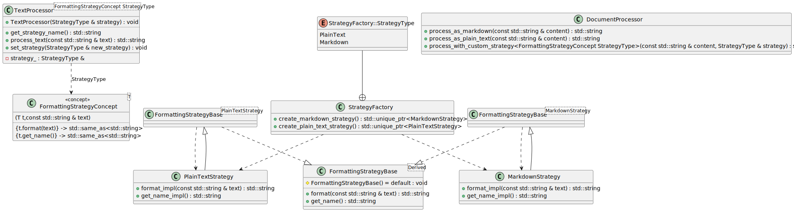

# t00101 - Test case for strategy design pattern using static polymorphism
## Config
```yaml
diagrams:
  t00101_class:
    type: class
    glob:
      - t00101.cc
    include:
      namespaces:
        - clanguml::t00101
    using_namespace: clanguml::t00101
```
## Source code
File `tests/t00101/t00101.cc`
```cpp
#include <concepts>
#include <memory>
#include <string>
#include <vector>

namespace clanguml {
namespace t00101 {

// Strategy pattern implementation using static polymorphism with C++20 concepts

// Example context: Text processing with different formatting strategies

// C++20 concept for Strategy interface using static polymorphism
template <typename T>
concept FormattingStrategyConcept = requires(T t, const std::string &text) {
    { t.format(text) } -> std::same_as<std::string>;
    { t.get_name() } -> std::same_as<std::string>;
};

// Template base for concrete strategies (CRTP)
template <typename Derived> class FormattingStrategyBase {
public:
    std::string format(const std::string &text)
    {
        return static_cast<Derived *>(this)->format_impl(text);
    }

    std::string get_name()
    {
        return static_cast<Derived *>(this)->get_name_impl();
    }

protected:
    FormattingStrategyBase() = default;
};

// Concrete Strategy for plain text formatting
class PlainTextStrategy : public FormattingStrategyBase<PlainTextStrategy> {
public:
    std::string format_impl(const std::string &text) { return text; }

    std::string get_name_impl() { return "PlainText"; }
};

// Concrete Strategy for markdown formatting
class MarkdownStrategy : public FormattingStrategyBase<MarkdownStrategy> {
public:
    std::string format_impl(const std::string &text)
    {
        return "# " + text + "\n";
    }

    std::string get_name_impl() { return "Markdown"; }
};

// Context template using static polymorphism and C++20 concepts
template <FormattingStrategyConcept StrategyType> class TextProcessor {
public:
    explicit TextProcessor(StrategyType &strategy)
        : strategy_(strategy)
    {
    }

    std::string process_text(const std::string &text)
    {
        return strategy_.format(text);
    }

    std::string get_strategy_name() { return strategy_.get_name(); }

    void set_strategy(StrategyType &new_strategy) { strategy_ = new_strategy; }

private:
    StrategyType &strategy_;
};

// Client code demonstrating the Strategy pattern with static polymorphism
class DocumentProcessor {
public:
    std::string process_as_plain_text(const std::string &content)
    {
        PlainTextStrategy strategy;
        TextProcessor processor(strategy);
        return processor.process_text(content);
    }

    std::string process_as_markdown(const std::string &content)
    {
        MarkdownStrategy strategy;
        TextProcessor processor(strategy);
        return processor.process_text(content);
    }

    template <FormattingStrategyConcept StrategyType>
    std::string process_with_custom_strategy(
        const std::string &content, StrategyType &strategy)
    {
        TextProcessor processor(strategy);
        return processor.process_text(content);
    }
};

// Factory for creating different strategies
class StrategyFactory {
public:
    enum class StrategyType { PlainText, Markdown };

    static std::unique_ptr<PlainTextStrategy> create_plain_text_strategy()
    {
        return std::make_unique<PlainTextStrategy>();
    }

    static std::unique_ptr<MarkdownStrategy> create_markdown_strategy()
    {
        return std::make_unique<MarkdownStrategy>();
    }
};

} // namespace t00101
} // namespace clanguml
```
## Generated PlantUML diagrams

## Generated Mermaid diagrams

## Generated JSON models
```json
{
  "diagram_type": "class",
  "elements": [
    {
      "display_name": "FormattingStrategyConcept<T>",
      "id": "17415094877193714719",
      "name": "FormattingStrategyConcept",
      "namespace": "clanguml::t00101",
      "parameters": [
        {
          "name": "t",
          "type": "T"
        },
        {
          "name": "text",
          "type": "const std::string &"
        }
      ],
      "source_location": {
        "column": 9,
        "file": "t00101.cc",
        "line": 15,
        "translation_unit": "t00101.cc"
      },
      "statements": [
        "{t.format(text)} -> std::same_as<std::string>",
        "{t.get_name()} -> std::same_as<std::string>"
      ],
      "type": "concept"
    },
    {
      "bases": [],
      "display_name": "FormattingStrategyBase<Derived>",
      "id": "14112435091745763149",
      "is_abstract": false,
      "is_nested": false,
      "is_struct": false,
      "is_template": true,
      "is_union": false,
      "members": [],
      "methods": [
        {
          "access": "public",
          "display_name": "format",
          "is_const": false,
          "is_consteval": false,
          "is_constexpr": false,
          "is_constructor": false,
          "is_copy_assignment": false,
          "is_coroutine": false,
          "is_defaulted": false,
          "is_deleted": false,
          "is_move_assignment": false,
          "is_noexcept": false,
          "is_operator": false,
          "is_pure_virtual": false,
          "is_static": false,
          "is_virtual": false,
          "name": "format",
          "parameters": [
            {
              "name": "text",
              "type": "const std::string &"
            }
          ],
          "source_location": {
            "column": 17,
            "file": "t00101.cc",
            "line": 23,
            "translation_unit": "t00101.cc"
          },
          "template_parameters": [],
          "type": "std::string"
        },
        {
          "access": "public",
          "display_name": "get_name",
          "is_const": false,
          "is_consteval": false,
          "is_constexpr": false,
          "is_constructor": false,
          "is_copy_assignment": false,
          "is_coroutine": false,
          "is_defaulted": false,
          "is_deleted": false,
          "is_move_assignment": false,
          "is_noexcept": false,
          "is_operator": false,
          "is_pure_virtual": false,
          "is_static": false,
          "is_virtual": false,
          "name": "get_name",
          "parameters": [],
          "source_location": {
            "column": 17,
            "file": "t00101.cc",
            "line": 28,
            "translation_unit": "t00101.cc"
          },
          "template_parameters": [],
          "type": "std::string"
        },
        {
          "access": "protected",
          "display_name": "FormattingStrategyBase",
          "is_const": false,
          "is_consteval": false,
          "is_constexpr": false,
          "is_constructor": true,
          "is_copy_assignment": false,
          "is_coroutine": false,
          "is_defaulted": true,
          "is_deleted": false,
          "is_move_assignment": false,
          "is_noexcept": false,
          "is_operator": false,
          "is_pure_virtual": false,
          "is_static": false,
          "is_virtual": false,
          "name": "FormattingStrategyBase",
          "parameters": [],
          "source_location": {
            "column": 5,
            "file": "t00101.cc",
            "line": 34,
            "translation_unit": "t00101.cc"
          },
          "template_parameters": [],
          "type": "void"
        }
      ],
      "name": "FormattingStrategyBase",
      "namespace": "clanguml::t00101",
      "source_location": {
        "column": 35,
        "file": "t00101.cc",
        "line": 21,
        "translation_unit": "t00101.cc"
      },
      "template_parameters": [
        {
          "is_variadic": false,
          "kind": "template_type",
          "name": "Derived",
          "template_parameters": []
        }
      ],
      "type": "class"
    },
    {
      "bases": [],
      "display_name": "FormattingStrategyBase<PlainTextStrategy>",
      "id": "3017018330506343241",
      "is_abstract": false,
      "is_nested": false,
      "is_struct": false,
      "is_template": true,
      "is_union": false,
      "members": [],
      "methods": [],
      "name": "FormattingStrategyBase",
      "namespace": "clanguml::t00101",
      "source_location": {
        "column": 7,
        "file": "t00101.cc",
        "line": 38,
        "translation_unit": "t00101.cc"
      },
      "template_parameters": [
        {
          "is_variadic": false,
          "kind": "argument",
          "template_parameters": [],
          "type": "PlainTextStrategy"
        }
      ],
      "type": "class"
    },
    {
      "bases": [
        {
          "access": "public",
          "id": "3017018330506343241",
          "is_virtual": false
        }
      ],
      "display_name": "PlainTextStrategy",
      "id": "5704419823270881204",
      "is_abstract": false,
      "is_nested": false,
      "is_struct": false,
      "is_template": false,
      "is_union": false,
      "members": [],
      "methods": [
        {
          "access": "public",
          "display_name": "format_impl",
          "is_const": false,
          "is_consteval": false,
          "is_constexpr": false,
          "is_constructor": false,
          "is_copy_assignment": false,
          "is_coroutine": false,
          "is_defaulted": false,
          "is_deleted": false,
          "is_move_assignment": false,
          "is_noexcept": false,
          "is_operator": false,
          "is_pure_virtual": false,
          "is_static": false,
          "is_virtual": false,
          "name": "format_impl",
          "parameters": [
            {
              "name": "text",
              "type": "const std::string &"
            }
          ],
          "source_location": {
            "column": 17,
            "file": "t00101.cc",
            "line": 40,
            "translation_unit": "t00101.cc"
          },
          "template_parameters": [],
          "type": "std::string"
        },
        {
          "access": "public",
          "display_name": "get_name_impl",
          "is_const": false,
          "is_consteval": false,
          "is_constexpr": false,
          "is_constructor": false,
          "is_copy_assignment": false,
          "is_coroutine": false,
          "is_defaulted": false,
          "is_deleted": false,
          "is_move_assignment": false,
          "is_noexcept": false,
          "is_operator": false,
          "is_pure_virtual": false,
          "is_static": false,
          "is_virtual": false,
          "name": "get_name_impl",
          "parameters": [],
          "source_location": {
            "column": 17,
            "file": "t00101.cc",
            "line": 42,
            "translation_unit": "t00101.cc"
          },
          "template_parameters": [],
          "type": "std::string"
        }
      ],
      "name": "PlainTextStrategy",
      "namespace": "clanguml::t00101",
      "source_location": {
        "column": 7,
        "file": "t00101.cc",
        "line": 38,
        "translation_unit": "t00101.cc"
      },
      "template_parameters": [],
      "type": "class"
    },
    {
      "bases": [],
      "display_name": "FormattingStrategyBase<MarkdownStrategy>",
      "id": "7699995325586521439",
      "is_abstract": false,
      "is_nested": false,
      "is_struct": false,
      "is_template": true,
      "is_union": false,
      "members": [],
      "methods": [],
      "name": "FormattingStrategyBase",
      "namespace": "clanguml::t00101",
      "source_location": {
        "column": 7,
        "file": "t00101.cc",
        "line": 46,
        "translation_unit": "t00101.cc"
      },
      "template_parameters": [
        {
          "is_variadic": false,
          "kind": "argument",
          "template_parameters": [],
          "type": "MarkdownStrategy"
        }
      ],
      "type": "class"
    },
    {
      "bases": [
        {
          "access": "public",
          "id": "7699995325586521439",
          "is_virtual": false
        }
      ],
      "display_name": "MarkdownStrategy",
      "id": "807604561818921537",
      "is_abstract": false,
      "is_nested": false,
      "is_struct": false,
      "is_template": false,
      "is_union": false,
      "members": [],
      "methods": [
        {
          "access": "public",
          "display_name": "format_impl",
          "is_const": false,
          "is_consteval": false,
          "is_constexpr": false,
          "is_constructor": false,
          "is_copy_assignment": false,
          "is_coroutine": false,
          "is_defaulted": false,
          "is_deleted": false,
          "is_move_assignment": false,
          "is_noexcept": false,
          "is_operator": false,
          "is_pure_virtual": false,
          "is_static": false,
          "is_virtual": false,
          "name": "format_impl",
          "parameters": [
            {
              "name": "text",
              "type": "const std::string &"
            }
          ],
          "source_location": {
            "column": 17,
            "file": "t00101.cc",
            "line": 48,
            "translation_unit": "t00101.cc"
          },
          "template_parameters": [],
          "type": "std::string"
        },
        {
          "access": "public",
          "display_name": "get_name_impl",
          "is_const": false,
          "is_consteval": false,
          "is_constexpr": false,
          "is_constructor": false,
          "is_copy_assignment": false,
          "is_coroutine": false,
          "is_defaulted": false,
          "is_deleted": false,
          "is_move_assignment": false,
          "is_noexcept": false,
          "is_operator": false,
          "is_pure_virtual": false,
          "is_static": false,
          "is_virtual": false,
          "name": "get_name_impl",
          "parameters": [],
          "source_location": {
            "column": 17,
            "file": "t00101.cc",
            "line": 53,
            "translation_unit": "t00101.cc"
          },
          "template_parameters": [],
          "type": "std::string"
        }
      ],
      "name": "MarkdownStrategy",
      "namespace": "clanguml::t00101",
      "source_location": {
        "column": 7,
        "file": "t00101.cc",
        "line": 46,
        "translation_unit": "t00101.cc"
      },
      "template_parameters": [],
      "type": "class"
    },
    {
      "bases": [],
      "display_name": "TextProcessor<FormattingStrategyConcept StrategyType>",
      "id": "11974992586374228230",
      "is_abstract": false,
      "is_nested": false,
      "is_struct": false,
      "is_template": true,
      "is_union": false,
      "members": [
        {
          "access": "private",
          "is_static": false,
          "name": "strategy_",
          "source_location": {
            "column": 19,
            "file": "t00101.cc",
            "line": 74,
            "translation_unit": "t00101.cc"
          },
          "type": "StrategyType &"
        }
      ],
      "methods": [
        {
          "access": "public",
          "display_name": "TextProcessor",
          "is_const": false,
          "is_consteval": false,
          "is_constexpr": false,
          "is_constructor": true,
          "is_copy_assignment": false,
          "is_coroutine": false,
          "is_defaulted": false,
          "is_deleted": false,
          "is_move_assignment": false,
          "is_noexcept": false,
          "is_operator": false,
          "is_pure_virtual": false,
          "is_static": false,
          "is_virtual": false,
          "name": "TextProcessor",
          "parameters": [
            {
              "name": "strategy",
              "type": "StrategyType &"
            }
          ],
          "source_location": {
            "column": 14,
            "file": "t00101.cc",
            "line": 59,
            "translation_unit": "t00101.cc"
          },
          "template_parameters": [],
          "type": "void"
        },
        {
          "access": "public",
          "display_name": "process_text",
          "is_const": false,
          "is_consteval": false,
          "is_constexpr": false,
          "is_constructor": false,
          "is_copy_assignment": false,
          "is_coroutine": false,
          "is_defaulted": false,
          "is_deleted": false,
          "is_move_assignment": false,
          "is_noexcept": false,
          "is_operator": false,
          "is_pure_virtual": false,
          "is_static": false,
          "is_virtual": false,
          "name": "process_text",
          "parameters": [
            {
              "name": "text",
              "type": "const std::string &"
            }
          ],
          "source_location": {
            "column": 17,
            "file": "t00101.cc",
            "line": 64,
            "translation_unit": "t00101.cc"
          },
          "template_parameters": [],
          "type": "std::string"
        },
        {
          "access": "public",
          "display_name": "get_strategy_name",
          "is_const": false,
          "is_consteval": false,
          "is_constexpr": false,
          "is_constructor": false,
          "is_copy_assignment": false,
          "is_coroutine": false,
          "is_defaulted": false,
          "is_deleted": false,
          "is_move_assignment": false,
          "is_noexcept": false,
          "is_operator": false,
          "is_pure_virtual": false,
          "is_static": false,
          "is_virtual": false,
          "name": "get_strategy_name",
          "parameters": [],
          "source_location": {
            "column": 17,
            "file": "t00101.cc",
            "line": 69,
            "translation_unit": "t00101.cc"
          },
          "template_parameters": [],
          "type": "std::string"
        },
        {
          "access": "public",
          "display_name": "set_strategy",
          "is_const": false,
          "is_consteval": false,
          "is_constexpr": false,
          "is_constructor": false,
          "is_copy_assignment": false,
          "is_coroutine": false,
          "is_defaulted": false,
          "is_deleted": false,
          "is_move_assignment": false,
          "is_noexcept": false,
          "is_operator": false,
          "is_pure_virtual": false,
          "is_static": false,
          "is_virtual": false,
          "name": "set_strategy",
          "parameters": [
            {
              "name": "new_strategy",
              "type": "StrategyType &"
            }
          ],
          "source_location": {
            "column": 10,
            "file": "t00101.cc",
            "line": 71,
            "translation_unit": "t00101.cc"
          },
          "template_parameters": [],
          "type": "void"
        }
      ],
      "name": "TextProcessor",
      "namespace": "clanguml::t00101",
      "source_location": {
        "column": 57,
        "file": "t00101.cc",
        "line": 57,
        "translation_unit": "t00101.cc"
      },
      "template_parameters": [
        {
          "is_variadic": false,
          "kind": "template_type",
          "name": "StrategyType",
          "template_parameters": []
        }
      ],
      "type": "class"
    },
    {
      "bases": [],
      "display_name": "DocumentProcessor",
      "id": "5538239167729960401",
      "is_abstract": false,
      "is_nested": false,
      "is_struct": false,
      "is_template": false,
      "is_union": false,
      "members": [],
      "methods": [
        {
          "access": "public",
          "display_name": "process_as_plain_text",
          "is_const": false,
          "is_consteval": false,
          "is_constexpr": false,
          "is_constructor": false,
          "is_copy_assignment": false,
          "is_coroutine": false,
          "is_defaulted": false,
          "is_deleted": false,
          "is_move_assignment": false,
          "is_noexcept": false,
          "is_operator": false,
          "is_pure_virtual": false,
          "is_static": false,
          "is_virtual": false,
          "name": "process_as_plain_text",
          "parameters": [
            {
              "name": "content",
              "type": "const std::string &"
            }
          ],
          "source_location": {
            "column": 17,
            "file": "t00101.cc",
            "line": 80,
            "translation_unit": "t00101.cc"
          },
          "template_parameters": [],
          "type": "std::string"
        },
        {
          "access": "public",
          "display_name": "process_as_markdown",
          "is_const": false,
          "is_consteval": false,
          "is_constexpr": false,
          "is_constructor": false,
          "is_copy_assignment": false,
          "is_coroutine": false,
          "is_defaulted": false,
          "is_deleted": false,
          "is_move_assignment": false,
          "is_noexcept": false,
          "is_operator": false,
          "is_pure_virtual": false,
          "is_static": false,
          "is_virtual": false,
          "name": "process_as_markdown",
          "parameters": [
            {
              "name": "content",
              "type": "const std::string &"
            }
          ],
          "source_location": {
            "column": 17,
            "file": "t00101.cc",
            "line": 87,
            "translation_unit": "t00101.cc"
          },
          "template_parameters": [],
          "type": "std::string"
        },
        {
          "access": "public",
          "display_name": "process_with_custom_strategy<FormattingStrategyConcept StrategyType>",
          "is_const": false,
          "is_consteval": false,
          "is_constexpr": false,
          "is_constructor": false,
          "is_copy_assignment": false,
          "is_coroutine": false,
          "is_defaulted": false,
          "is_deleted": false,
          "is_move_assignment": false,
          "is_noexcept": false,
          "is_operator": false,
          "is_pure_virtual": false,
          "is_static": false,
          "is_virtual": false,
          "name": "process_with_custom_strategy",
          "parameters": [
            {
              "name": "content",
              "type": "const std::string &"
            },
            {
              "name": "strategy",
              "type": "StrategyType &"
            }
          ],
          "template_parameters": [
            {
              "is_variadic": false,
              "kind": "template_type",
              "name": "StrategyType",
              "template_parameters": []
            }
          ],
          "type": "std::string"
        }
      ],
      "name": "DocumentProcessor",
      "namespace": "clanguml::t00101",
      "source_location": {
        "column": 7,
        "file": "t00101.cc",
        "line": 78,
        "translation_unit": "t00101.cc"
      },
      "template_parameters": [],
      "type": "class"
    },
    {
      "bases": [],
      "display_name": "StrategyFactory",
      "id": "12978743466082846464",
      "is_abstract": false,
      "is_nested": false,
      "is_struct": false,
      "is_template": false,
      "is_union": false,
      "members": [],
      "methods": [
        {
          "access": "public",
          "display_name": "create_plain_text_strategy",
          "is_const": false,
          "is_consteval": false,
          "is_constexpr": false,
          "is_constructor": false,
          "is_copy_assignment": false,
          "is_coroutine": false,
          "is_defaulted": false,
          "is_deleted": false,
          "is_move_assignment": false,
          "is_noexcept": false,
          "is_operator": false,
          "is_pure_virtual": false,
          "is_static": true,
          "is_virtual": false,
          "name": "create_plain_text_strategy",
          "parameters": [],
          "source_location": {
            "column": 47,
            "file": "t00101.cc",
            "line": 108,
            "translation_unit": "t00101.cc"
          },
          "template_parameters": [],
          "type": "std::unique_ptr<PlainTextStrategy>"
        },
        {
          "access": "public",
          "display_name": "create_markdown_strategy",
          "is_const": false,
          "is_consteval": false,
          "is_constexpr": false,
          "is_constructor": false,
          "is_copy_assignment": false,
          "is_coroutine": false,
          "is_defaulted": false,
          "is_deleted": false,
          "is_move_assignment": false,
          "is_noexcept": false,
          "is_operator": false,
          "is_pure_virtual": false,
          "is_static": true,
          "is_virtual": false,
          "name": "create_markdown_strategy",
          "parameters": [],
          "source_location": {
            "column": 46,
            "file": "t00101.cc",
            "line": 113,
            "translation_unit": "t00101.cc"
          },
          "template_parameters": [],
          "type": "std::unique_ptr<MarkdownStrategy>"
        }
      ],
      "name": "StrategyFactory",
      "namespace": "clanguml::t00101",
      "source_location": {
        "column": 7,
        "file": "t00101.cc",
        "line": 104,
        "translation_unit": "t00101.cc"
      },
      "template_parameters": [],
      "type": "class"
    },
    {
      "constants": [
        "PlainText",
        "Markdown"
      ],
      "display_name": "StrategyFactory::StrategyType",
      "id": "5068471644211142180",
      "is_nested": true,
      "name": "StrategyFactory##StrategyType",
      "namespace": "clanguml::t00101",
      "source_location": {
        "column": 16,
        "file": "t00101.cc",
        "line": 106,
        "translation_unit": "t00101.cc"
      },
      "type": "enum"
    }
  ],
  "name": "t00101_class",
  "package_type": "namespace",
  "relationships": [
    {
      "access": "public",
      "destination": "5704419823270881204",
      "source": "3017018330506343241",
      "type": "dependency"
    },
    {
      "access": "public",
      "destination": "14112435091745763149",
      "source": "3017018330506343241",
      "type": "instantiation"
    },
    {
      "access": "public",
      "destination": "3017018330506343241",
      "source": "5704419823270881204",
      "type": "extension"
    },
    {
      "access": "public",
      "destination": "807604561818921537",
      "source": "7699995325586521439",
      "type": "dependency"
    },
    {
      "access": "public",
      "destination": "14112435091745763149",
      "source": "7699995325586521439",
      "type": "instantiation"
    },
    {
      "access": "public",
      "destination": "7699995325586521439",
      "source": "807604561818921537",
      "type": "extension"
    },
    {
      "destination": "17415094877193714719",
      "label": "StrategyType",
      "source": "11974992586374228230",
      "type": "constraint"
    },
    {
      "access": "public",
      "destination": "5704419823270881204",
      "source": "12978743466082846464",
      "type": "dependency"
    },
    {
      "access": "public",
      "destination": "807604561818921537",
      "source": "12978743466082846464",
      "type": "dependency"
    },
    {
      "access": "public",
      "destination": "12978743466082846464",
      "source": "5068471644211142180",
      "type": "containment"
    }
  ],
  "using_namespace": "clanguml::t00101"
}
```
## Generated GraphML models
```xml
<?xml version="1.0"?>
<graphml xmlns="http://graphml.graphdrawing.org/xmlns" xmlns:xsi="http://www.w3.org/2001/XMLSchema-instance" xsi:schemaLocation="http://graphml.graphdrawing.org/xmlns http://graphml.graphdrawing.org/xmlns/1.0/graphml.xsd">
 <key attr.name="id" attr.type="string" for="graph" id="gd0" />
 <key attr.name="diagram_type" attr.type="string" for="graph" id="gd1" />
 <key attr.name="name" attr.type="string" for="graph" id="gd2" />
 <key attr.name="using_namespace" attr.type="string" for="graph" id="gd3" />
 <key attr.name="id" attr.type="string" for="node" id="nd0" />
 <key attr.name="type" attr.type="string" for="node" id="nd1" />
 <key attr.name="name" attr.type="string" for="node" id="nd2" />
 <key attr.name="stereotype" attr.type="string" for="node" id="nd3" />
 <key attr.name="url" attr.type="string" for="node" id="nd4" />
 <key attr.name="tooltip" attr.type="string" for="node" id="nd5" />
 <key attr.name="is_template" attr.type="boolean" for="node" id="nd6" />
 <key attr.name="type" attr.type="string" for="edge" id="ed0" />
 <key attr.name="access" attr.type="string" for="edge" id="ed1" />
 <key attr.name="label" attr.type="string" for="edge" id="ed2" />
 <key attr.name="url" attr.type="string" for="edge" id="ed3" />
 <graph id="g0" edgedefault="directed" parse.nodeids="canonical" parse.edgeids="canonical" parse.order="nodesfirst">
  <data key="gd3">clanguml::t00101</data>
  <node id="n0">
   <data key="nd1">concept</data>
   <data key="nd2"><![CDATA[FormattingStrategyConcept<T>]]></data>
  </node>
  <node id="n1">
   <data key="nd1">class</data>
   <data key="nd2"><![CDATA[FormattingStrategyBase<Derived>]]></data>
   <data key="nd6">true</data>
  </node>
  <node id="n2">
   <data key="nd1">class</data>
   <data key="nd2"><![CDATA[FormattingStrategyBase<PlainTextStrategy>]]></data>
   <data key="nd6">true</data>
  </node>
  <node id="n3">
   <data key="nd1">class</data>
   <data key="nd2"><![CDATA[PlainTextStrategy]]></data>
   <data key="nd6">false</data>
  </node>
  <node id="n4">
   <data key="nd1">class</data>
   <data key="nd2"><![CDATA[FormattingStrategyBase<MarkdownStrategy>]]></data>
   <data key="nd6">true</data>
  </node>
  <node id="n5">
   <data key="nd1">class</data>
   <data key="nd2"><![CDATA[MarkdownStrategy]]></data>
   <data key="nd6">false</data>
  </node>
  <node id="n6">
   <data key="nd1">class</data>
   <data key="nd2"><![CDATA[TextProcessor<FormattingStrategyConcept StrategyType>]]></data>
   <data key="nd6">true</data>
  </node>
  <node id="n7">
   <data key="nd1">class</data>
   <data key="nd2"><![CDATA[DocumentProcessor]]></data>
   <data key="nd6">false</data>
  </node>
  <node id="n8">
   <data key="nd1">class</data>
   <data key="nd2"><![CDATA[StrategyFactory]]></data>
   <data key="nd6">false</data>
  </node>
  <node id="n9">
   <data key="nd1">enum</data>
   <data key="nd2"><![CDATA[StrategyFactory::StrategyType]]></data>
  </node>
  <edge id="e0" source="n2" target="n3">
   <data key="ed0">dependency</data>
   <data key="ed1">public</data>
  </edge>
  <edge id="e1" source="n2" target="n1">
   <data key="ed0">instantiation</data>
   <data key="ed1">public</data>
  </edge>
  <edge id="e2" source="n3" target="n2">
   <data key="ed0">extension</data>
   <data key="ed1">public</data>
  </edge>
  <edge id="e3" source="n4" target="n5">
   <data key="ed0">dependency</data>
   <data key="ed1">public</data>
  </edge>
  <edge id="e4" source="n4" target="n1">
   <data key="ed0">instantiation</data>
   <data key="ed1">public</data>
  </edge>
  <edge id="e5" source="n5" target="n4">
   <data key="ed0">extension</data>
   <data key="ed1">public</data>
  </edge>
  <edge id="e6" source="n6" target="n0">
   <data key="ed0">constraint</data>
   <data key="ed2">StrategyType</data>
  </edge>
  <edge id="e7" source="n8" target="n3">
   <data key="ed0">dependency</data>
   <data key="ed1">public</data>
  </edge>
  <edge id="e8" source="n8" target="n5">
   <data key="ed0">dependency</data>
   <data key="ed1">public</data>
  </edge>
  <edge id="e9" source="n9" target="n8">
   <data key="ed0">containment</data>
   <data key="ed1">public</data>
  </edge>
 </graph>
</graphml>

```
