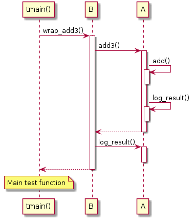

# t20001 - Basic sequence diagram
## Config
```yaml
compilation_database_dir: ..
output_directory: puml
diagrams:
  t20001_sequence:
    type: sequence
    glob:
      - ../../tests/t20001/t20001.cc
    include:
      namespaces:
        - clanguml::t20001
    exclude:
      namespaces:
        - clanguml::t20001::detail
    using_namespace:
      - clanguml::t20001
    start_from:
      - usr: "c:@N@clanguml@N@t20001@F@tmain#"
    plantuml:
      before:
        - "' t20001 test sequence diagram"
      after:
        - 'note over "tmain()": Main test function'

```
## Source code
File t20001.cc
```cpp
#include <algorithm>
#include <numeric>
#include <vector>

namespace clanguml {
namespace t20001 {

namespace detail {
struct C {
    auto add(int x, int y) { return x + y; }
};
}

class A {
public:
    A() {}

    int add(int x, int y) { return m_c.add(x, y); }

    int add3(int x, int y, int z)
    {
        std::vector<int> v;
        v.push_back(x);
        v.push_back(y);
        v.push_back(z);
        auto res = add(v[0], v[1]) + v[2];
        log_result(res);
        return res;
    }

    void log_result(int r) {}

private:
    detail::C m_c{};
};

class B {
public:
    B(A &a)
        : m_a{a}
    {
    }

    int wrap_add(int x, int y)
    {
        auto res = m_a.add(x, y);
        m_a.log_result(res);
        return res;
    }

    int wrap_add3(int x, int y, int z)
    {
        auto res = m_a.add3(x, y, z);
        m_a.log_result(res);
        return res;
    }

private:
    A &m_a;
};

int tmain()
{
    A a;
    B b(a);

    return b.wrap_add3(1, 2, 3);
}
}
}

```
## Generated UML diagrams

