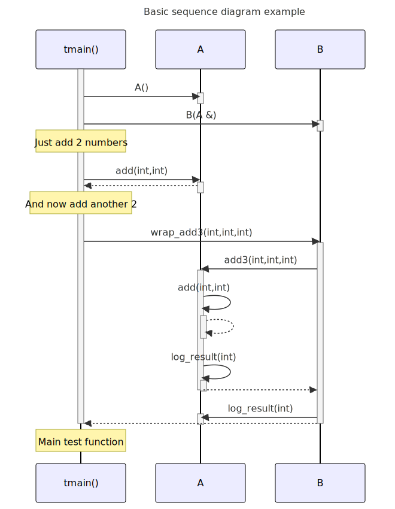

# t20001 - Basic sequence diagram test case
## Config
```yaml
add_compile_flags:
  - -fparse-all-comments
diagrams:
  t20001_sequence:
    type: sequence
    title: Basic sequence diagram example
    glob:
      - t20001.cc
    include:
      namespaces:
        - clanguml::t20001
    exclude:
      namespaces:
        - clanguml::t20001::detail
    using_namespace: clanguml::t20001
    from:
      - function: "clanguml::t20001::tmain()"
    plantuml:
      before:
        - "' t20001 test diagram of type {{ diagram.type }}"
      after:
        - ' note over {{ e.alias }}: Main test function'
    mermaid:
      before:
        - "%% t20001 test diagram of type {{ diagram.type }}"
      after:
        - ' Note over {{ e.alias }}: Main test function'

```
## Source code
File `tests/t20001/t20001.cc`
```cpp
#include <algorithm>
#include <vector>

namespace clanguml {
namespace t20001 {

namespace detail {
struct C {
    auto add(int x, int y) { return x + y; }
};
}

class A {
public:
    A() { }

    int add(int x, int y) { return m_c.add(x, y); }

    int add3(int x, int y, int z)
    {
        std::vector<int> v;
        v.push_back(x);
        v.push_back(y);
        v.push_back(z);
        auto res = add(v[0], v[1]) + v[2];
        log_result(res);
        return res;
    }

    static void log_result(int r) { }

private:
    detail::C m_c{};
};

class B {
public:
    B(A &a)
        : m_a{a}
    {
    }

    int wrap_add(int x, int y)
    {
        auto res = m_a.add(x, y);
        m_a.log_result(res);
        return res;
    }

    int wrap_add3(int x, int y, int z)
    {
        auto res = m_a.add3(x, y, z);
        m_a.log_result(res);
        return res;
    }

private:
    A &m_a;
};

int tmain()
{
    A a;
    B b(a);

    // \uml{note Just add 2 numbers}
    auto tmp = a.add(1, 2);

    // \uml{note[] And now add another 2}
    return b.wrap_add3(tmp, 2, 3);
}
}
}

```
## Generated PlantUML diagrams

## Generated Mermaid diagrams

## Generated JSON models
```json
{
  "diagram_type": "sequence",
  "name": "t20001_sequence",
  "participants": [
    {
      "display_name": "tmain()",
      "full_name": "clanguml::t20001::tmain()",
      "id": "4981380837840289120",
      "name": "tmain",
      "namespace": "clanguml::t20001",
      "source_location": {
        "column": 5,
        "file": "t20001.cc",
        "line": 61,
        "translation_unit": "t20001.cc"
      },
      "type": "function"
    },
    {
      "activities": [
        {
          "display_name": "A()",
          "full_name": "clanguml::t20001::A::A()",
          "id": "2202827688275505167",
          "name": "A",
          "namespace": "clanguml::t20001",
          "source_location": {
            "column": 5,
            "file": "t20001.cc",
            "line": 15,
            "translation_unit": "t20001.cc"
          },
          "type": "method"
        },
        {
          "display_name": "add(int,int)",
          "full_name": "clanguml::t20001::A::add(int,int)",
          "id": "9052399461707163220",
          "name": "add",
          "namespace": "clanguml::t20001",
          "source_location": {
            "column": 9,
            "file": "t20001.cc",
            "line": 17,
            "translation_unit": "t20001.cc"
          },
          "type": "method"
        },
        {
          "display_name": "add3(int,int,int)",
          "full_name": "clanguml::t20001::A::add3(int,int,int)",
          "id": "16723493083595356745",
          "name": "add3",
          "namespace": "clanguml::t20001",
          "source_location": {
            "column": 9,
            "file": "t20001.cc",
            "line": 19,
            "translation_unit": "t20001.cc"
          },
          "type": "method"
        },
        {
          "display_name": "log_result(int)",
          "full_name": "clanguml::t20001::A::log_result(int)",
          "id": "9647581054471616782",
          "name": "log_result",
          "namespace": "clanguml::t20001",
          "source_location": {
            "column": 17,
            "file": "t20001.cc",
            "line": 30,
            "translation_unit": "t20001.cc"
          },
          "type": "method"
        }
      ],
      "display_name": "A",
      "full_name": "clanguml::t20001::A",
      "id": "14175548373193465074",
      "name": "A",
      "namespace": "clanguml::t20001",
      "source_location": {
        "column": 7,
        "file": "t20001.cc",
        "line": 13,
        "translation_unit": "t20001.cc"
      },
      "type": "class"
    },
    {
      "activities": [
        {
          "display_name": "B(A &)",
          "full_name": "clanguml::t20001::B::B(A &)",
          "id": "17883821270364000003",
          "name": "B",
          "namespace": "clanguml::t20001",
          "source_location": {
            "column": 5,
            "file": "t20001.cc",
            "line": 38,
            "translation_unit": "t20001.cc"
          },
          "type": "method"
        },
        {
          "display_name": "wrap_add3(int,int,int)",
          "full_name": "clanguml::t20001::B::wrap_add3(int,int,int)",
          "id": "5140401210585671495",
          "name": "wrap_add3",
          "namespace": "clanguml::t20001",
          "source_location": {
            "column": 9,
            "file": "t20001.cc",
            "line": 50,
            "translation_unit": "t20001.cc"
          },
          "type": "method"
        }
      ],
      "display_name": "B",
      "full_name": "clanguml::t20001::B",
      "id": "2179471188062404803",
      "name": "B",
      "namespace": "clanguml::t20001",
      "source_location": {
        "column": 7,
        "file": "t20001.cc",
        "line": 36,
        "translation_unit": "t20001.cc"
      },
      "type": "class"
    }
  ],
  "sequences": [
    {
      "messages": [
        {
          "from": {
            "activity_id": "4981380837840289120",
            "participant_id": "4981380837840289120"
          },
          "name": "A()",
          "return_type": "void",
          "scope": "normal",
          "source_location": {
            "column": 7,
            "file": "t20001.cc",
            "line": 63,
            "translation_unit": "t20001.cc"
          },
          "to": {
            "activity_id": "2202827688275505167",
            "participant_id": "14175548373193465074"
          },
          "type": "message"
        },
        {
          "from": {
            "activity_id": "4981380837840289120",
            "participant_id": "4981380837840289120"
          },
          "name": "B(A &)",
          "return_type": "void",
          "scope": "normal",
          "source_location": {
            "column": 7,
            "file": "t20001.cc",
            "line": 64,
            "translation_unit": "t20001.cc"
          },
          "to": {
            "activity_id": "17883821270364000003",
            "participant_id": "2179471188062404803"
          },
          "type": "message"
        },
        {
          "from": {
            "activity_id": "4981380837840289120",
            "participant_id": "4981380837840289120"
          },
          "name": "add(int,int)",
          "return_type": "int",
          "scope": "normal",
          "source_location": {
            "column": 16,
            "file": "t20001.cc",
            "line": 67,
            "translation_unit": "t20001.cc"
          },
          "to": {
            "activity_id": "9052399461707163220",
            "participant_id": "14175548373193465074"
          },
          "type": "message"
        },
        {
          "from": {
            "activity_id": "4981380837840289120",
            "participant_id": "4981380837840289120"
          },
          "name": "wrap_add3(int,int,int)",
          "return_type": "int",
          "scope": "normal",
          "source_location": {
            "column": 12,
            "file": "t20001.cc",
            "line": 70,
            "translation_unit": "t20001.cc"
          },
          "to": {
            "activity_id": "5140401210585671495",
            "participant_id": "2179471188062404803"
          },
          "type": "message"
        },
        {
          "from": {
            "activity_id": "5140401210585671495",
            "participant_id": "2179471188062404803"
          },
          "name": "add3(int,int,int)",
          "return_type": "int",
          "scope": "normal",
          "source_location": {
            "column": 20,
            "file": "t20001.cc",
            "line": 52,
            "translation_unit": "t20001.cc"
          },
          "to": {
            "activity_id": "16723493083595356745",
            "participant_id": "14175548373193465074"
          },
          "type": "message"
        },
        {
          "from": {
            "activity_id": "16723493083595356745",
            "participant_id": "14175548373193465074"
          },
          "name": "add(int,int)",
          "return_type": "int",
          "scope": "normal",
          "source_location": {
            "column": 20,
            "file": "t20001.cc",
            "line": 25,
            "translation_unit": "t20001.cc"
          },
          "to": {
            "activity_id": "9052399461707163220",
            "participant_id": "14175548373193465074"
          },
          "type": "message"
        },
        {
          "from": {
            "activity_id": "16723493083595356745",
            "participant_id": "14175548373193465074"
          },
          "name": "log_result(int)",
          "return_type": "void",
          "scope": "normal",
          "source_location": {
            "column": 9,
            "file": "t20001.cc",
            "line": 26,
            "translation_unit": "t20001.cc"
          },
          "to": {
            "activity_id": "9647581054471616782",
            "participant_id": "14175548373193465074"
          },
          "type": "message"
        },
        {
          "from": {
            "activity_id": "5140401210585671495",
            "participant_id": "2179471188062404803"
          },
          "name": "log_result(int)",
          "return_type": "void",
          "scope": "normal",
          "source_location": {
            "column": 9,
            "file": "t20001.cc",
            "line": 53,
            "translation_unit": "t20001.cc"
          },
          "to": {
            "activity_id": "9647581054471616782",
            "participant_id": "14175548373193465074"
          },
          "type": "message"
        }
      ],
      "start_from": {
        "id": "4981380837840289120",
        "location": "clanguml::t20001::tmain()"
      }
    }
  ],
  "title": "Basic sequence diagram example",
  "using_namespace": "clanguml::t20001"
}
```
