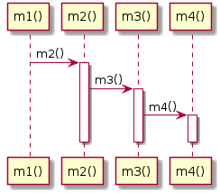

# t20002 - Free function sequence diagram test case
## Config
```yaml
compilation_database_dir: ..
output_directory: puml
diagrams:
  t20002_sequence:
    type: sequence
    glob:
      - ../../tests/t20002/t20002.cc
    include:
      namespaces:
        - clanguml::t20002
    using_namespace:
      - clanguml::t20002
    start_from:
      - function: "clanguml::t20002::m1()"

```
## Source code
File t20002.cc
```cpp
#include <algorithm>
#include <numeric>
#include <vector>

namespace clanguml {
namespace t20002 {

void m4() { }

void m3() { m4(); }

void m2() { m3(); }

void m1() { m2(); }
}
}

```
## Generated UML diagrams

