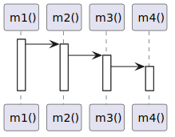
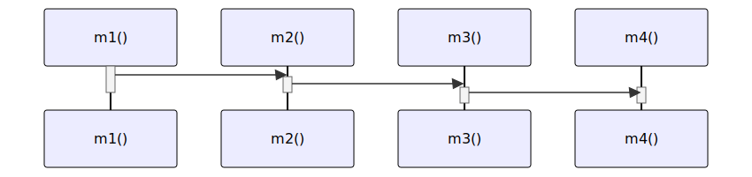

# t20002 - Free function sequence diagram test case
## Config
```yaml
diagrams:
  t20002_sequence:
    type: sequence
    glob:
      - t20002.cc
    include:
      namespaces:
        - clanguml::t20002
    using_namespace: clanguml::t20002
    from:
      - function: "clanguml::t20002::m1()"

```
## Source code
File `tests/t20002/t20002.cc`
```cpp
namespace clanguml {
namespace t20002 {

void m4() { }

void m3() { m4(); }

void m2() { m3(); }

void m1() { m2(); }
}
}

```
## Generated PlantUML diagrams

## Generated Mermaid diagrams

## Generated JSON models
```json
{
  "diagram_type": "sequence",
  "name": "t20002_sequence",
  "participants": [
    {
      "display_name": "m1()",
      "full_name": "clanguml::t20002::m1()",
      "id": "18245064466698427640",
      "name": "m1",
      "namespace": "clanguml::t20002",
      "source_location": {
        "column": 6,
        "file": "t20002.cc",
        "line": 10,
        "translation_unit": "t20002.cc"
      },
      "type": "function"
    },
    {
      "display_name": "m2()",
      "full_name": "clanguml::t20002::m2()",
      "id": "3198690958058710202",
      "name": "m2",
      "namespace": "clanguml::t20002",
      "source_location": {
        "column": 6,
        "file": "t20002.cc",
        "line": 8,
        "translation_unit": "t20002.cc"
      },
      "type": "function"
    },
    {
      "display_name": "m3()",
      "full_name": "clanguml::t20002::m3()",
      "id": "4092227584141594202",
      "name": "m3",
      "namespace": "clanguml::t20002",
      "source_location": {
        "column": 6,
        "file": "t20002.cc",
        "line": 6,
        "translation_unit": "t20002.cc"
      },
      "type": "function"
    },
    {
      "display_name": "m4()",
      "full_name": "clanguml::t20002::m4()",
      "id": "17107448909844746550",
      "name": "m4",
      "namespace": "clanguml::t20002",
      "source_location": {
        "column": 6,
        "file": "t20002.cc",
        "line": 4,
        "translation_unit": "t20002.cc"
      },
      "type": "function"
    }
  ],
  "sequences": [
    {
      "from": {
        "id": "18245064466698427640",
        "location": "clanguml::t20002::m1()"
      },
      "messages": [
        {
          "from": {
            "activity_id": "18245064466698427640",
            "participant_id": "18245064466698427640"
          },
          "name": "",
          "return_type": "void",
          "scope": "normal",
          "source_location": {
            "column": 13,
            "file": "t20002.cc",
            "line": 10,
            "translation_unit": "t20002.cc"
          },
          "to": {
            "activity_id": "3198690958058710202",
            "participant_id": "3198690958058710202"
          },
          "type": "message"
        },
        {
          "from": {
            "activity_id": "3198690958058710202",
            "participant_id": "3198690958058710202"
          },
          "name": "",
          "return_type": "void",
          "scope": "normal",
          "source_location": {
            "column": 13,
            "file": "t20002.cc",
            "line": 8,
            "translation_unit": "t20002.cc"
          },
          "to": {
            "activity_id": "4092227584141594202",
            "participant_id": "4092227584141594202"
          },
          "type": "message"
        },
        {
          "from": {
            "activity_id": "4092227584141594202",
            "participant_id": "4092227584141594202"
          },
          "name": "",
          "return_type": "void",
          "scope": "normal",
          "source_location": {
            "column": 13,
            "file": "t20002.cc",
            "line": 6,
            "translation_unit": "t20002.cc"
          },
          "to": {
            "activity_id": "17107448909844746550",
            "participant_id": "17107448909844746550"
          },
          "type": "message"
        }
      ]
    }
  ],
  "using_namespace": "clanguml::t20002"
}
```
## Generated GraphML models
