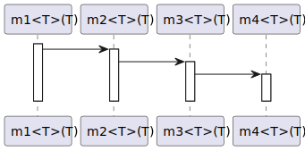

# t20003 - Function template sequence diagram test case
## Config
```yaml
compilation_database_dir: ..
output_directory: puml
diagrams:
  t20003_sequence:
    type: sequence
    glob:
      - ../../tests/t20003/t20003.cc
    include:
      namespaces:
        - clanguml::t20003
    using_namespace:
      - clanguml::t20003
    start_from:
      - function: "clanguml::t20003::m1<T>(T)"

```
## Source code
File t20003.cc
```cpp
namespace clanguml {
namespace t20003 {

template <typename T> void m4(T p) { }

template <typename T> void m3(T p) { m4<T>(p); }

template <typename T> void m2(T p) { m3<T>(p); }

template <typename T> void m1(T p) { m2<T>(p); }
}
}

```
## Generated UML diagrams

## Generated JSON models
```json
{
  "diagram_type": "sequence",
  "metadata": {
    "clang_uml_version": "0.3.5-2-g7e9944c",
    "llvm_version": "Ubuntu clang version 15.0.6",
    "schema_version": 1
  },
  "name": "t20003_sequence",
  "participants": [
    {
      "id": "469205740799240869",
      "name": "clanguml::t20003::m1<T>(T)",
      "source_location": {
        "file": "../../tests/t20003/t20003.cc",
        "line": 10
      },
      "type": "function_template"
    },
    {
      "id": "1502957449367040488",
      "name": "clanguml::t20003::m2<T>(T)",
      "source_location": {
        "file": "../../tests/t20003/t20003.cc",
        "line": 8
      },
      "type": "function_template"
    },
    {
      "id": "613477682313507585",
      "name": "clanguml::t20003::m3<T>(T)",
      "source_location": {
        "file": "../../tests/t20003/t20003.cc",
        "line": 6
      },
      "type": "function_template"
    },
    {
      "id": "619960023608507925",
      "name": "clanguml::t20003::m4<T>(T)",
      "source_location": {
        "file": "../../tests/t20003/t20003.cc",
        "line": 4
      },
      "type": "function_template"
    }
  ],
  "sequences": [
    {
      "messages": [
        {
          "from": {
            "activity_id": "469205740799240869",
            "activity_name": "clanguml::t20003::m1<T>(T)",
            "participant_id": "469205740799240869",
            "participant_name": "clanguml::t20003::m1<T>(T)"
          },
          "name": "",
          "return_type": "",
          "scope": "normal",
          "source_location": {
            "file": "../../tests/t20003/t20003.cc",
            "line": 10
          },
          "to": {
            "activity_id": "1502957449367040488",
            "activity_name": "clanguml::t20003::m2<T>(T)",
            "participant_id": "1502957449367040488"
          },
          "type": "message"
        },
        {
          "from": {
            "activity_id": "1502957449367040488",
            "activity_name": "clanguml::t20003::m2<T>(T)",
            "participant_id": "1502957449367040488",
            "participant_name": "clanguml::t20003::m2<T>(T)"
          },
          "name": "",
          "return_type": "",
          "scope": "normal",
          "source_location": {
            "file": "../../tests/t20003/t20003.cc",
            "line": 8
          },
          "to": {
            "activity_id": "613477682313507585",
            "activity_name": "clanguml::t20003::m3<T>(T)",
            "participant_id": "613477682313507585"
          },
          "type": "message"
        },
        {
          "from": {
            "activity_id": "613477682313507585",
            "activity_name": "clanguml::t20003::m3<T>(T)",
            "participant_id": "613477682313507585",
            "participant_name": "clanguml::t20003::m3<T>(T)"
          },
          "name": "",
          "return_type": "",
          "scope": "normal",
          "source_location": {
            "file": "../../tests/t20003/t20003.cc",
            "line": 6
          },
          "to": {
            "activity_id": "619960023608507925",
            "activity_name": "clanguml::t20003::m4<T>(T)",
            "participant_id": "619960023608507925"
          },
          "type": "message"
        }
      ],
      "start_from": {
        "id": 469205740799240869,
        "location": "clanguml::t20003::m1<T>(T)"
      }
    }
  ],
  "using_namespace": "clanguml::t20003"
}
```
