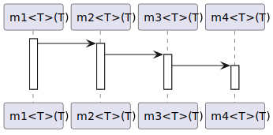
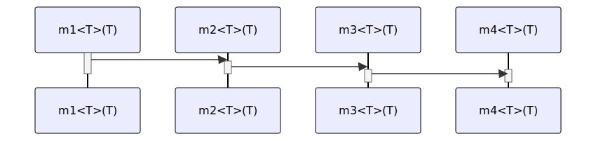

# t20003 - Function template sequence diagram test case
## Config
```yaml
diagrams:
  t20003_sequence:
    type: sequence
    glob:
      - t20003.cc
    include:
      namespaces:
        - clanguml::t20003
    using_namespace: clanguml::t20003
    from:
      - function: "clanguml::t20003::m1<T>(T)"

```
## Source code
File `tests/t20003/t20003.cc`
```cpp
namespace clanguml {
namespace t20003 {

template <typename T> void m4(T p) { }

template <typename T> void m3(T p) { m4<T>(p); }

template <typename T> void m2(T p) { m3<T>(p); }

template <typename T> void m1(T p) { m2<T>(p); }
}
}

```
## Generated PlantUML diagrams

## Generated Mermaid diagrams

## Generated JSON models
```json
{
  "diagram_type": "sequence",
  "name": "t20003_sequence",
  "participants": [
    {
      "display_name": "m1<T>(T)",
      "full_name": "clanguml::t20003::m1<T>(T)",
      "id": "11829166439630102283",
      "name": "m1",
      "namespace": "clanguml::t20003",
      "source_location": {
        "column": 28,
        "file": "t20003.cc",
        "line": 10,
        "translation_unit": "t20003.cc"
      },
      "type": "function_template"
    },
    {
      "display_name": "m2<T>(T)",
      "full_name": "clanguml::t20003::m2<T>(T)",
      "id": "14601968075638172466",
      "name": "m2",
      "namespace": "clanguml::t20003",
      "source_location": {
        "column": 28,
        "file": "t20003.cc",
        "line": 8,
        "translation_unit": "t20003.cc"
      },
      "type": "function_template"
    },
    {
      "display_name": "m3<T>(T)",
      "full_name": "clanguml::t20003::m3<T>(T)",
      "id": "12572894056817321253",
      "name": "m3",
      "namespace": "clanguml::t20003",
      "source_location": {
        "column": 28,
        "file": "t20003.cc",
        "line": 6,
        "translation_unit": "t20003.cc"
      },
      "type": "function_template"
    },
    {
      "display_name": "m4<T>(T)",
      "full_name": "clanguml::t20003::m4<T>(T)",
      "id": "6370114393268681535",
      "name": "m4",
      "namespace": "clanguml::t20003",
      "source_location": {
        "column": 28,
        "file": "t20003.cc",
        "line": 4,
        "translation_unit": "t20003.cc"
      },
      "type": "function_template"
    }
  ],
  "sequences": [
    {
      "from": {
        "id": "11829166439630102283",
        "location": "clanguml::t20003::m1<T>(T)"
      },
      "messages": [
        {
          "from": {
            "activity_id": "11829166439630102283",
            "participant_id": "11829166439630102283"
          },
          "name": "",
          "return_type": "void",
          "scope": "normal",
          "source_location": {
            "column": 38,
            "file": "t20003.cc",
            "line": 10,
            "translation_unit": "t20003.cc"
          },
          "to": {
            "activity_id": "14601968075638172466",
            "participant_id": "14601968075638172466"
          },
          "type": "message"
        },
        {
          "from": {
            "activity_id": "14601968075638172466",
            "participant_id": "14601968075638172466"
          },
          "name": "",
          "return_type": "void",
          "scope": "normal",
          "source_location": {
            "column": 38,
            "file": "t20003.cc",
            "line": 8,
            "translation_unit": "t20003.cc"
          },
          "to": {
            "activity_id": "12572894056817321253",
            "participant_id": "12572894056817321253"
          },
          "type": "message"
        },
        {
          "from": {
            "activity_id": "12572894056817321253",
            "participant_id": "12572894056817321253"
          },
          "name": "",
          "return_type": "void",
          "scope": "normal",
          "source_location": {
            "column": 38,
            "file": "t20003.cc",
            "line": 6,
            "translation_unit": "t20003.cc"
          },
          "to": {
            "activity_id": "6370114393268681535",
            "participant_id": "6370114393268681535"
          },
          "type": "message"
        }
      ]
    }
  ],
  "using_namespace": "clanguml::t20003"
}
```
## Generated GraphML models
