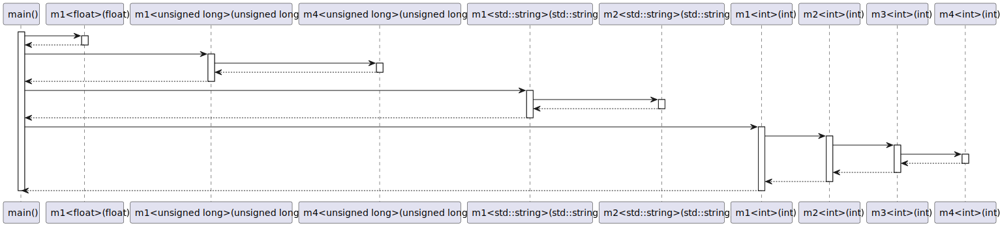
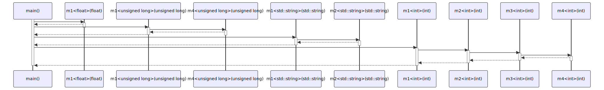

# t20004 - Function template instantiation sequence diagram test case
## Config
```yaml
diagrams:
  t20004_sequence:
    type: sequence
    glob:
      - t20004.cc
    include:
      namespaces:
        - clanguml::t20004
    using_namespace: clanguml::t20004
    from:
      - function: "clanguml::t20004::main()"
```
## Source code
File `tests/t20004/t20004.cc`
```cpp
#include <string>

namespace clanguml {
namespace t20004 {

template <typename T> T m4(T p);

template <> [[maybe_unused]] int m4<int>(int p) { return p + 2; }

template <> [[maybe_unused]] unsigned long m4<unsigned long>(unsigned long p)
{
    return 1000 * p;
}

template <typename T> T m3(T p) { return m4<T>(p); }

template <typename T> T m2(T p) { return m3<T>(p); }

template <> [[maybe_unused]] std::string m2<std::string>(std::string p)
{
    return std::string{"m2"} + p;
}

template <typename T> T m1(T p) { return m2<T>(p); }

template <> [[maybe_unused]] float m1<float>(float p) { return 2 * p; }

template <> [[maybe_unused]] unsigned long m1<unsigned long>(unsigned long p)
{
    return m4<unsigned long>(p);
}

template <> [[maybe_unused]] std::string m1<std::string>(std::string p)
{
    return m2<std::string>(p);
}

int main()
{
    m1<float>(2.2);

    m1<unsigned long>(100);

    m1<std::string>("main");

    return m1<int>(0);
}
}
}

```
## Generated PlantUML diagrams

## Generated Mermaid diagrams

## Generated JSON models
```json
{
  "diagram_type": "sequence",
  "name": "t20004_sequence",
  "participants": [
    {
      "display_name": "main()",
      "full_name": "clanguml::t20004::main()",
      "id": "2299662004367884401",
      "name": "main",
      "namespace": "clanguml::t20004",
      "source_location": {
        "column": 5,
        "file": "t20004.cc",
        "line": 38,
        "translation_unit": "t20004.cc"
      },
      "type": "function"
    },
    {
      "display_name": "m1<float>(float)",
      "full_name": "clanguml::t20004::m1<float>(float)",
      "id": "138925040763435897",
      "name": "m1",
      "namespace": "clanguml::t20004",
      "source_location": {
        "column": 36,
        "file": "t20004.cc",
        "line": 26,
        "translation_unit": "t20004.cc"
      },
      "type": "function_template"
    },
    {
      "display_name": "m1<unsigned long>(unsigned long)",
      "full_name": "clanguml::t20004::m1<unsigned long>(unsigned long)",
      "id": "1239083518717603720",
      "name": "m1",
      "namespace": "clanguml::t20004",
      "source_location": {
        "column": 44,
        "file": "t20004.cc",
        "line": 28,
        "translation_unit": "t20004.cc"
      },
      "type": "function_template"
    },
    {
      "display_name": "m4<unsigned long>(unsigned long)",
      "full_name": "clanguml::t20004::m4<unsigned long>(unsigned long)",
      "id": "376599675205498367",
      "name": "m4",
      "namespace": "clanguml::t20004",
      "source_location": {
        "column": 44,
        "file": "t20004.cc",
        "line": 10,
        "translation_unit": "t20004.cc"
      },
      "type": "function_template"
    },
    {
      "display_name": "m1<std::string>(std::string)",
      "full_name": "clanguml::t20004::m1<std::string>(std::string)",
      "id": "1845817984839618223",
      "name": "m1",
      "namespace": "clanguml::t20004",
      "source_location": {
        "column": 42,
        "file": "t20004.cc",
        "line": 33,
        "translation_unit": "t20004.cc"
      },
      "type": "function_template"
    },
    {
      "display_name": "m2<std::string>(std::string)",
      "full_name": "clanguml::t20004::m2<std::string>(std::string)",
      "id": "1735054254122948614",
      "name": "m2",
      "namespace": "clanguml::t20004",
      "source_location": {
        "column": 42,
        "file": "t20004.cc",
        "line": 19,
        "translation_unit": "t20004.cc"
      },
      "type": "function_template"
    },
    {
      "display_name": "m1<int>(int)",
      "full_name": "clanguml::t20004::m1<int>(int)",
      "id": "121663532044911922",
      "name": "m1",
      "namespace": "clanguml::t20004",
      "source_location": {
        "column": 25,
        "file": "t20004.cc",
        "line": 24,
        "translation_unit": "t20004.cc"
      },
      "type": "function_template"
    },
    {
      "display_name": "m2<int>(int)",
      "full_name": "clanguml::t20004::m2<int>(int)",
      "id": "1475362124497386656",
      "name": "m2",
      "namespace": "clanguml::t20004",
      "source_location": {
        "column": 25,
        "file": "t20004.cc",
        "line": 17,
        "translation_unit": "t20004.cc"
      },
      "type": "function_template"
    },
    {
      "display_name": "m3<int>(int)",
      "full_name": "clanguml::t20004::m3<int>(int)",
      "id": "734999226157549914",
      "name": "m3",
      "namespace": "clanguml::t20004",
      "source_location": {
        "column": 25,
        "file": "t20004.cc",
        "line": 15,
        "translation_unit": "t20004.cc"
      },
      "type": "function_template"
    },
    {
      "display_name": "m4<int>(int)",
      "full_name": "clanguml::t20004::m4<int>(int)",
      "id": "1006390865908497562",
      "name": "m4",
      "namespace": "clanguml::t20004",
      "source_location": {
        "column": 34,
        "file": "t20004.cc",
        "line": 8,
        "translation_unit": "t20004.cc"
      },
      "type": "function_template"
    }
  ],
  "sequences": [
    {
      "messages": [
        {
          "from": {
            "activity_id": "2299662004367884401",
            "participant_id": "2299662004367884401"
          },
          "name": "",
          "return_type": "",
          "scope": "normal",
          "source_location": {
            "column": 5,
            "file": "t20004.cc",
            "line": 40,
            "translation_unit": "t20004.cc"
          },
          "to": {
            "activity_id": "138925040763435897",
            "participant_id": "138925040763435897"
          },
          "type": "message"
        },
        {
          "from": {
            "activity_id": "2299662004367884401",
            "participant_id": "2299662004367884401"
          },
          "name": "",
          "return_type": "",
          "scope": "normal",
          "source_location": {
            "column": 5,
            "file": "t20004.cc",
            "line": 42,
            "translation_unit": "t20004.cc"
          },
          "to": {
            "activity_id": "1239083518717603720",
            "participant_id": "1239083518717603720"
          },
          "type": "message"
        },
        {
          "from": {
            "activity_id": "1239083518717603720",
            "participant_id": "1239083518717603720"
          },
          "name": "",
          "return_type": "",
          "scope": "normal",
          "source_location": {
            "column": 12,
            "file": "t20004.cc",
            "line": 30,
            "translation_unit": "t20004.cc"
          },
          "to": {
            "activity_id": "376599675205498367",
            "participant_id": "376599675205498367"
          },
          "type": "message"
        },
        {
          "from": {
            "activity_id": "2299662004367884401",
            "participant_id": "2299662004367884401"
          },
          "name": "",
          "return_type": "",
          "scope": "normal",
          "source_location": {
            "column": 5,
            "file": "t20004.cc",
            "line": 44,
            "translation_unit": "t20004.cc"
          },
          "to": {
            "activity_id": "1845817984839618223",
            "participant_id": "1845817984839618223"
          },
          "type": "message"
        },
        {
          "from": {
            "activity_id": "1845817984839618223",
            "participant_id": "1845817984839618223"
          },
          "name": "",
          "return_type": "",
          "scope": "normal",
          "source_location": {
            "column": 12,
            "file": "t20004.cc",
            "line": 35,
            "translation_unit": "t20004.cc"
          },
          "to": {
            "activity_id": "1735054254122948614",
            "participant_id": "1735054254122948614"
          },
          "type": "message"
        },
        {
          "from": {
            "activity_id": "2299662004367884401",
            "participant_id": "2299662004367884401"
          },
          "name": "",
          "return_type": "",
          "scope": "normal",
          "source_location": {
            "column": 12,
            "file": "t20004.cc",
            "line": 46,
            "translation_unit": "t20004.cc"
          },
          "to": {
            "activity_id": "121663532044911922",
            "participant_id": "121663532044911922"
          },
          "type": "message"
        },
        {
          "from": {
            "activity_id": "121663532044911922",
            "participant_id": "121663532044911922"
          },
          "name": "",
          "return_type": "",
          "scope": "normal",
          "source_location": {
            "column": 42,
            "file": "t20004.cc",
            "line": 24,
            "translation_unit": "t20004.cc"
          },
          "to": {
            "activity_id": "1475362124497386656",
            "participant_id": "1475362124497386656"
          },
          "type": "message"
        },
        {
          "from": {
            "activity_id": "1475362124497386656",
            "participant_id": "1475362124497386656"
          },
          "name": "",
          "return_type": "",
          "scope": "normal",
          "source_location": {
            "column": 42,
            "file": "t20004.cc",
            "line": 17,
            "translation_unit": "t20004.cc"
          },
          "to": {
            "activity_id": "734999226157549914",
            "participant_id": "734999226157549914"
          },
          "type": "message"
        },
        {
          "from": {
            "activity_id": "734999226157549914",
            "participant_id": "734999226157549914"
          },
          "name": "",
          "return_type": "",
          "scope": "normal",
          "source_location": {
            "column": 42,
            "file": "t20004.cc",
            "line": 15,
            "translation_unit": "t20004.cc"
          },
          "to": {
            "activity_id": "1006390865908497562",
            "participant_id": "1006390865908497562"
          },
          "type": "message"
        }
      ],
      "start_from": {
        "id": 2299662004367884401,
        "location": "clanguml::t20004::main()"
      }
    }
  ],
  "using_namespace": "clanguml::t20004"
}
```
