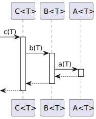
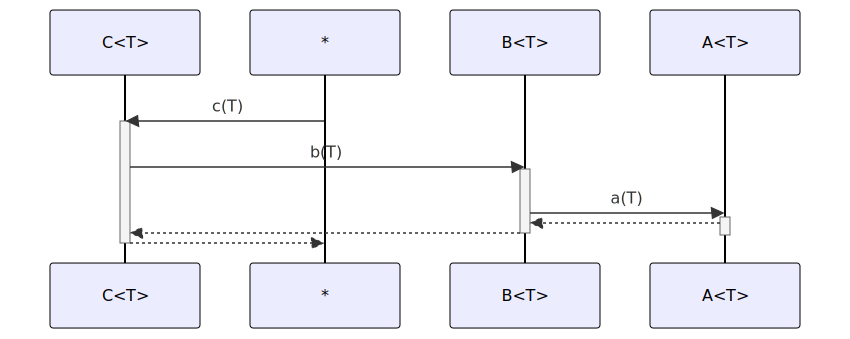

# t20005 - Class template basic sequence diagram
## Config
```yaml
diagrams:
  t20005_sequence:
    type: sequence
    glob:
      - t20005.cc
    include:
      namespaces:
        - clanguml::t20005
    using_namespace: clanguml::t20005
    from:
      - function: "clanguml::t20005::C<T>::c(T)"
```
## Source code
File `tests/t20005/t20005.cc`
```cpp
namespace clanguml {
namespace t20005 {

template <typename T> struct A {
    T a(T arg) { return arg; }
};

template <typename T> struct B {
    T b(T arg) { return a_.a(arg); }

    A<T> a_;
};

template <typename T> struct C {
    T c(T arg) { return b_.b(arg); }

    B<T> b_;
};

}
}
```
## Generated PlantUML diagrams

## Generated Mermaid diagrams

## Generated JSON models
```json
{
  "diagram_type": "sequence",
  "name": "t20005_sequence",
  "participants": [
    {
      "activities": [
        {
          "display_name": "c(T)",
          "full_name": "clanguml::t20005::C<T>::c(T)",
          "id": "578718872965404973",
          "name": "c",
          "namespace": "",
          "source_location": {
            "column": 7,
            "file": "t20005.cc",
            "line": 15,
            "translation_unit": "t20005.cc"
          },
          "type": "method"
        }
      ],
      "display_name": "C<T>",
      "full_name": "clanguml::t20005::C<T>",
      "id": "365569130532127604",
      "name": "C",
      "namespace": "clanguml::t20005",
      "source_location": {
        "column": 30,
        "file": "t20005.cc",
        "line": 14,
        "translation_unit": "t20005.cc"
      },
      "type": "class"
    },
    {
      "activities": [
        {
          "display_name": "b(T)",
          "full_name": "clanguml::t20005::B<T>::b(T)",
          "id": "870466496899932117",
          "name": "b",
          "namespace": "",
          "source_location": {
            "column": 7,
            "file": "t20005.cc",
            "line": 9,
            "translation_unit": "t20005.cc"
          },
          "type": "method"
        }
      ],
      "display_name": "B<T>",
      "full_name": "clanguml::t20005::B<T>",
      "id": "666000829532846850",
      "name": "B",
      "namespace": "clanguml::t20005",
      "source_location": {
        "column": 30,
        "file": "t20005.cc",
        "line": 8,
        "translation_unit": "t20005.cc"
      },
      "type": "class"
    },
    {
      "activities": [
        {
          "display_name": "a(T)",
          "full_name": "clanguml::t20005::A<T>::a(T)",
          "id": "124853455814403745",
          "name": "a",
          "namespace": "",
          "source_location": {
            "column": 7,
            "file": "t20005.cc",
            "line": 5,
            "translation_unit": "t20005.cc"
          },
          "type": "method"
        }
      ],
      "display_name": "A<T>",
      "full_name": "clanguml::t20005::A<T>",
      "id": "1278330455625941185",
      "name": "A",
      "namespace": "clanguml::t20005",
      "source_location": {
        "column": 30,
        "file": "t20005.cc",
        "line": 4,
        "translation_unit": "t20005.cc"
      },
      "type": "class"
    }
  ],
  "sequences": [
    {
      "messages": [
        {
          "from": {
            "activity_id": "578718872965404973",
            "participant_id": "365569130532127604"
          },
          "name": "b(T)",
          "return_type": "T",
          "scope": "normal",
          "source_location": {
            "column": 25,
            "file": "t20005.cc",
            "line": 15,
            "translation_unit": "t20005.cc"
          },
          "to": {
            "activity_id": "870466496899932117",
            "participant_id": "666000829532846850"
          },
          "type": "message"
        },
        {
          "from": {
            "activity_id": "870466496899932117",
            "participant_id": "666000829532846850"
          },
          "name": "a(T)",
          "return_type": "T",
          "scope": "normal",
          "source_location": {
            "column": 25,
            "file": "t20005.cc",
            "line": 9,
            "translation_unit": "t20005.cc"
          },
          "to": {
            "activity_id": "124853455814403745",
            "participant_id": "1278330455625941185"
          },
          "type": "message"
        }
      ],
      "return_type": "T",
      "start_from": {
        "id": 578718872965404973,
        "location": "clanguml::t20005::C<T>::c(T)"
      }
    }
  ],
  "using_namespace": "clanguml::t20005"
}
```
