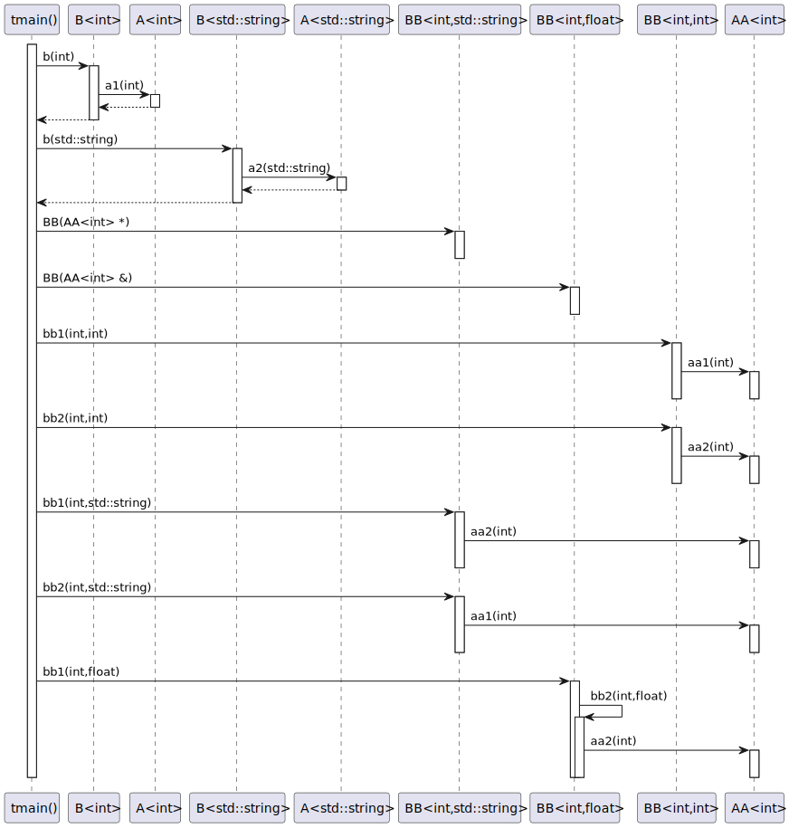
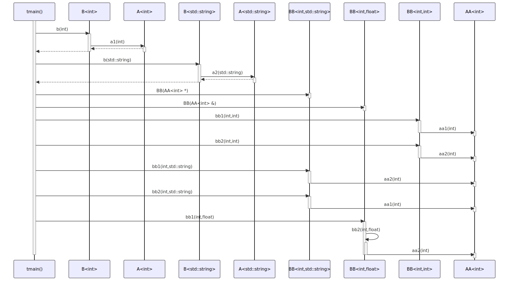

# t20006 - Class template specialization basic sequence diagram
## Config
```yaml
diagrams:
  t20006_sequence:
    type: sequence
    glob:
      - t20006.cc
    include:
      namespaces:
        - clanguml::t20006
    using_namespace: clanguml::t20006
    from:
      - function: "clanguml::t20006::tmain()"
```
## Source code
File `tests/t20006/t20006.cc`
```cpp
#include <string>

namespace clanguml {
namespace t20006 {

template <typename T> struct A {
    T a1(T arg) { return arg; }
    T a2(T arg) { return arg + arg; }
};

template <typename T> struct B {
    T b(T arg) { return a_.a1(arg); }
    A<T> a_;
};

template <> struct B<std::string> {
    std::string b(std::string arg) { return a_.a2(arg); }
    A<std::string> a_;
};

template <typename T> struct AA {
    void aa1(T t) { }
    void aa2(T t) { }
};

template <typename T, typename F> struct BB {
    void bb1(T t, F f) { aa_.aa1(t); }
    void bb2(T t, F f) { aa_.aa2(t); }

    AA<T> aa_;
};

template <typename T> struct BB<T, std::string> {
    void bb1(T t, std::string f) { aa_->aa2(t); }
    void bb2(T t, std::string f) { aa_->aa1(t); }

    BB(AA<T> *aa)
        : aa_{aa}
    {
    }

    AA<T> *aa_;
};

template <typename T> struct BB<T, float> {
    void bb1(T t, float f) { bb2(t, f); }
    void bb2(T t, float f) { aa_.aa2(t); }

    BB(AA<T> &aa)
        : aa_{aa}
    {
    }

    AA<T> &aa_;
};

void tmain()
{
    B<int> bint;
    B<std::string> bstring;

    bint.b(1);
    bstring.b("bstring");

    BB<int, int> bbint;
    AA<int> aaint;
    BB<int, std::string> bbstring{&aaint};
    BB<int, float> bbfloat{aaint};

    bbint.bb1(1, 1);
    bbint.bb2(2, 2);

    bbstring.bb1(1, "calling aa2");
    bbstring.bb2(1, "calling aa1");

    bbfloat.bb1(1, 1.0f);
}
}
}
```
## Generated PlantUML diagrams

## Generated Mermaid diagrams

## Generated JSON models
```json
{
  "diagram_type": "sequence",
  "name": "t20006_sequence",
  "participants": [
    {
      "display_name": "tmain()",
      "full_name": "clanguml::t20006::tmain()",
      "id": "363965584448680958",
      "name": "tmain",
      "namespace": "clanguml::t20006",
      "source_location": {
        "column": 6,
        "file": "t20006.cc",
        "line": 57,
        "translation_unit": "t20006.cc"
      },
      "type": "function"
    },
    {
      "activities": [
        {
          "display_name": "b(int)",
          "full_name": "clanguml::t20006::B<int>::b(int)",
          "id": "250247217888843587",
          "name": "b",
          "namespace": "",
          "source_location": {
            "column": 7,
            "file": "t20006.cc",
            "line": 12,
            "translation_unit": "t20006.cc"
          },
          "type": "method"
        }
      ],
      "display_name": "B<int>",
      "full_name": "clanguml::t20006::B<int>",
      "id": "2197760498261923035",
      "name": "B",
      "namespace": "clanguml::t20006",
      "source_location": {
        "column": 30,
        "file": "t20006.cc",
        "line": 11,
        "translation_unit": "t20006.cc"
      },
      "type": "class"
    },
    {
      "activities": [
        {
          "display_name": "a1(int)",
          "full_name": "clanguml::t20006::A<int>::a1(int)",
          "id": "196390487987395669",
          "name": "a1",
          "namespace": "",
          "source_location": {
            "column": 7,
            "file": "t20006.cc",
            "line": 7,
            "translation_unit": "t20006.cc"
          },
          "type": "method"
        }
      ],
      "display_name": "A<int>",
      "full_name": "clanguml::t20006::A<int>",
      "id": "596484796124829039",
      "name": "A",
      "namespace": "clanguml::t20006",
      "source_location": {
        "column": 30,
        "file": "t20006.cc",
        "line": 6,
        "translation_unit": "t20006.cc"
      },
      "type": "class"
    },
    {
      "activities": [
        {
          "display_name": "b(std::string)",
          "full_name": "clanguml::t20006::B<std::string>::b(std::string)",
          "id": "13049632552871157",
          "name": "b",
          "namespace": "",
          "source_location": {
            "column": 17,
            "file": "t20006.cc",
            "line": 17,
            "translation_unit": "t20006.cc"
          },
          "type": "method"
        }
      ],
      "display_name": "B<std::string>",
      "full_name": "clanguml::t20006::B<std::string>",
      "id": "2102622661983365981",
      "name": "B",
      "namespace": "clanguml::t20006",
      "source_location": {
        "column": 20,
        "file": "t20006.cc",
        "line": 16,
        "translation_unit": "t20006.cc"
      },
      "type": "class"
    },
    {
      "activities": [
        {
          "display_name": "a2(std::string)",
          "full_name": "clanguml::t20006::A<std::string>::a2(std::string)",
          "id": "11762588624112907",
          "name": "a2",
          "namespace": "",
          "source_location": {
            "column": 7,
            "file": "t20006.cc",
            "line": 8,
            "translation_unit": "t20006.cc"
          },
          "type": "method"
        }
      ],
      "display_name": "A<std::string>",
      "full_name": "clanguml::t20006::A<std::string>",
      "id": "413459875415381273",
      "name": "A",
      "namespace": "clanguml::t20006",
      "source_location": {
        "column": 30,
        "file": "t20006.cc",
        "line": 6,
        "translation_unit": "t20006.cc"
      },
      "type": "class"
    },
    {
      "activities": [
        {
          "display_name": "BB(AA<int> *)",
          "full_name": "clanguml::t20006::BB<int,std::string>::BB(AA<int> *)",
          "id": "381732876807761480",
          "name": "BB",
          "namespace": "",
          "source_location": {
            "column": 5,
            "file": "t20006.cc",
            "line": 37,
            "translation_unit": "t20006.cc"
          },
          "type": "method"
        },
        {
          "display_name": "bb1(int,std::string)",
          "full_name": "clanguml::t20006::BB<int,std::string>::bb1(int,std::string)",
          "id": "1062874005712014125",
          "name": "bb1",
          "namespace": "",
          "source_location": {
            "column": 10,
            "file": "t20006.cc",
            "line": 34,
            "translation_unit": "t20006.cc"
          },
          "type": "method"
        },
        {
          "display_name": "bb2(int,std::string)",
          "full_name": "clanguml::t20006::BB<int,std::string>::bb2(int,std::string)",
          "id": "787705189994778234",
          "name": "bb2",
          "namespace": "",
          "source_location": {
            "column": 10,
            "file": "t20006.cc",
            "line": 35,
            "translation_unit": "t20006.cc"
          },
          "type": "method"
        }
      ],
      "display_name": "BB<int,std::string>",
      "full_name": "clanguml::t20006::BB<int,std::string>",
      "id": "2269742833301555472",
      "name": "BB",
      "namespace": "clanguml::t20006",
      "source_location": {
        "column": 30,
        "file": "t20006.cc",
        "line": 33,
        "translation_unit": "t20006.cc"
      },
      "type": "class"
    },
    {
      "activities": [
        {
          "display_name": "BB(AA<int> &)",
          "full_name": "clanguml::t20006::BB<int,float>::BB(AA<int> &)",
          "id": "1051013203072323842",
          "name": "BB",
          "namespace": "",
          "source_location": {
            "column": 5,
            "file": "t20006.cc",
            "line": 49,
            "translation_unit": "t20006.cc"
          },
          "type": "method"
        },
        {
          "display_name": "bb1(int,float)",
          "full_name": "clanguml::t20006::BB<int,float>::bb1(int,float)",
          "id": "1463188845572485713",
          "name": "bb1",
          "namespace": "",
          "source_location": {
            "column": 10,
            "file": "t20006.cc",
            "line": 46,
            "translation_unit": "t20006.cc"
          },
          "type": "method"
        },
        {
          "display_name": "bb2(int,float)",
          "full_name": "clanguml::t20006::BB<int,float>::bb2(int,float)",
          "id": "732362671329401903",
          "name": "bb2",
          "namespace": "",
          "source_location": {
            "column": 10,
            "file": "t20006.cc",
            "line": 47,
            "translation_unit": "t20006.cc"
          },
          "type": "method"
        }
      ],
      "display_name": "BB<int,float>",
      "full_name": "clanguml::t20006::BB<int,float>",
      "id": "1743503037360505162",
      "name": "BB",
      "namespace": "clanguml::t20006",
      "source_location": {
        "column": 30,
        "file": "t20006.cc",
        "line": 45,
        "translation_unit": "t20006.cc"
      },
      "type": "class"
    },
    {
      "activities": [
        {
          "display_name": "bb1(int,int)",
          "full_name": "clanguml::t20006::BB<int,int>::bb1(int,int)",
          "id": "1213865121829347654",
          "name": "bb1",
          "namespace": "",
          "source_location": {
            "column": 10,
            "file": "t20006.cc",
            "line": 27,
            "translation_unit": "t20006.cc"
          },
          "type": "method"
        },
        {
          "display_name": "bb2(int,int)",
          "full_name": "clanguml::t20006::BB<int,int>::bb2(int,int)",
          "id": "361650123916792854",
          "name": "bb2",
          "namespace": "",
          "source_location": {
            "column": 10,
            "file": "t20006.cc",
            "line": 28,
            "translation_unit": "t20006.cc"
          },
          "type": "method"
        }
      ],
      "display_name": "BB<int,int>",
      "full_name": "clanguml::t20006::BB<int,int>",
      "id": "264392653889863384",
      "name": "BB",
      "namespace": "clanguml::t20006",
      "source_location": {
        "column": 42,
        "file": "t20006.cc",
        "line": 26,
        "translation_unit": "t20006.cc"
      },
      "type": "class"
    },
    {
      "activities": [
        {
          "display_name": "aa1(int)",
          "full_name": "clanguml::t20006::AA<int>::aa1(int)",
          "id": "1235428163990670191",
          "name": "aa1",
          "namespace": "",
          "source_location": {
            "column": 10,
            "file": "t20006.cc",
            "line": 22,
            "translation_unit": "t20006.cc"
          },
          "type": "method"
        },
        {
          "display_name": "aa2(int)",
          "full_name": "clanguml::t20006::AA<int>::aa2(int)",
          "id": "582097827335267290",
          "name": "aa2",
          "namespace": "",
          "source_location": {
            "column": 10,
            "file": "t20006.cc",
            "line": 23,
            "translation_unit": "t20006.cc"
          },
          "type": "method"
        }
      ],
      "display_name": "AA<int>",
      "full_name": "clanguml::t20006::AA<int>",
      "id": "1903567228894636312",
      "name": "AA",
      "namespace": "clanguml::t20006",
      "source_location": {
        "column": 30,
        "file": "t20006.cc",
        "line": 21,
        "translation_unit": "t20006.cc"
      },
      "type": "class"
    }
  ],
  "sequences": [
    {
      "messages": [
        {
          "from": {
            "activity_id": "363965584448680958",
            "participant_id": "363965584448680958"
          },
          "name": "b(int)",
          "return_type": "int",
          "scope": "normal",
          "source_location": {
            "column": 5,
            "file": "t20006.cc",
            "line": 62,
            "translation_unit": "t20006.cc"
          },
          "to": {
            "activity_id": "250247217888843587",
            "participant_id": "2197760498261923035"
          },
          "type": "message"
        },
        {
          "from": {
            "activity_id": "250247217888843587",
            "participant_id": "2197760498261923035"
          },
          "name": "a1(int)",
          "return_type": "int",
          "scope": "normal",
          "source_location": {
            "column": 25,
            "file": "t20006.cc",
            "line": 12,
            "translation_unit": "t20006.cc"
          },
          "to": {
            "activity_id": "196390487987395669",
            "participant_id": "596484796124829039"
          },
          "type": "message"
        },
        {
          "from": {
            "activity_id": "363965584448680958",
            "participant_id": "363965584448680958"
          },
          "name": "b(std::string)",
          "return_type": "std::string",
          "scope": "normal",
          "source_location": {
            "column": 5,
            "file": "t20006.cc",
            "line": 63,
            "translation_unit": "t20006.cc"
          },
          "to": {
            "activity_id": "13049632552871157",
            "participant_id": "2102622661983365981"
          },
          "type": "message"
        },
        {
          "from": {
            "activity_id": "13049632552871157",
            "participant_id": "2102622661983365981"
          },
          "name": "a2(std::string)",
          "return_type": "std::string",
          "scope": "normal",
          "source_location": {
            "column": 45,
            "file": "t20006.cc",
            "line": 17,
            "translation_unit": "t20006.cc"
          },
          "to": {
            "activity_id": "11762588624112907",
            "participant_id": "413459875415381273"
          },
          "type": "message"
        },
        {
          "from": {
            "activity_id": "363965584448680958",
            "participant_id": "363965584448680958"
          },
          "name": "BB(AA<int> *)",
          "return_type": "void",
          "scope": "normal",
          "source_location": {
            "column": 26,
            "file": "t20006.cc",
            "line": 67,
            "translation_unit": "t20006.cc"
          },
          "to": {
            "activity_id": "381732876807761480",
            "participant_id": "2269742833301555472"
          },
          "type": "message"
        },
        {
          "from": {
            "activity_id": "363965584448680958",
            "participant_id": "363965584448680958"
          },
          "name": "BB(AA<int> &)",
          "return_type": "void",
          "scope": "normal",
          "source_location": {
            "column": 20,
            "file": "t20006.cc",
            "line": 68,
            "translation_unit": "t20006.cc"
          },
          "to": {
            "activity_id": "1051013203072323842",
            "participant_id": "1743503037360505162"
          },
          "type": "message"
        },
        {
          "from": {
            "activity_id": "363965584448680958",
            "participant_id": "363965584448680958"
          },
          "name": "bb1(int,int)",
          "return_type": "void",
          "scope": "normal",
          "source_location": {
            "column": 5,
            "file": "t20006.cc",
            "line": 70,
            "translation_unit": "t20006.cc"
          },
          "to": {
            "activity_id": "1213865121829347654",
            "participant_id": "264392653889863384"
          },
          "type": "message"
        },
        {
          "from": {
            "activity_id": "1213865121829347654",
            "participant_id": "264392653889863384"
          },
          "name": "aa1(int)",
          "return_type": "void",
          "scope": "normal",
          "source_location": {
            "column": 26,
            "file": "t20006.cc",
            "line": 27,
            "translation_unit": "t20006.cc"
          },
          "to": {
            "activity_id": "1235428163990670191",
            "participant_id": "1903567228894636312"
          },
          "type": "message"
        },
        {
          "from": {
            "activity_id": "363965584448680958",
            "participant_id": "363965584448680958"
          },
          "name": "bb2(int,int)",
          "return_type": "void",
          "scope": "normal",
          "source_location": {
            "column": 5,
            "file": "t20006.cc",
            "line": 71,
            "translation_unit": "t20006.cc"
          },
          "to": {
            "activity_id": "361650123916792854",
            "participant_id": "264392653889863384"
          },
          "type": "message"
        },
        {
          "from": {
            "activity_id": "361650123916792854",
            "participant_id": "264392653889863384"
          },
          "name": "aa2(int)",
          "return_type": "void",
          "scope": "normal",
          "source_location": {
            "column": 26,
            "file": "t20006.cc",
            "line": 28,
            "translation_unit": "t20006.cc"
          },
          "to": {
            "activity_id": "582097827335267290",
            "participant_id": "1903567228894636312"
          },
          "type": "message"
        },
        {
          "from": {
            "activity_id": "363965584448680958",
            "participant_id": "363965584448680958"
          },
          "name": "bb1(int,std::string)",
          "return_type": "void",
          "scope": "normal",
          "source_location": {
            "column": 5,
            "file": "t20006.cc",
            "line": 73,
            "translation_unit": "t20006.cc"
          },
          "to": {
            "activity_id": "1062874005712014125",
            "participant_id": "2269742833301555472"
          },
          "type": "message"
        },
        {
          "from": {
            "activity_id": "1062874005712014125",
            "participant_id": "2269742833301555472"
          },
          "name": "aa2(int)",
          "return_type": "void",
          "scope": "normal",
          "source_location": {
            "column": 36,
            "file": "t20006.cc",
            "line": 34,
            "translation_unit": "t20006.cc"
          },
          "to": {
            "activity_id": "582097827335267290",
            "participant_id": "1903567228894636312"
          },
          "type": "message"
        },
        {
          "from": {
            "activity_id": "363965584448680958",
            "participant_id": "363965584448680958"
          },
          "name": "bb2(int,std::string)",
          "return_type": "void",
          "scope": "normal",
          "source_location": {
            "column": 5,
            "file": "t20006.cc",
            "line": 74,
            "translation_unit": "t20006.cc"
          },
          "to": {
            "activity_id": "787705189994778234",
            "participant_id": "2269742833301555472"
          },
          "type": "message"
        },
        {
          "from": {
            "activity_id": "787705189994778234",
            "participant_id": "2269742833301555472"
          },
          "name": "aa1(int)",
          "return_type": "void",
          "scope": "normal",
          "source_location": {
            "column": 36,
            "file": "t20006.cc",
            "line": 35,
            "translation_unit": "t20006.cc"
          },
          "to": {
            "activity_id": "1235428163990670191",
            "participant_id": "1903567228894636312"
          },
          "type": "message"
        },
        {
          "from": {
            "activity_id": "363965584448680958",
            "participant_id": "363965584448680958"
          },
          "name": "bb1(int,float)",
          "return_type": "void",
          "scope": "normal",
          "source_location": {
            "column": 5,
            "file": "t20006.cc",
            "line": 76,
            "translation_unit": "t20006.cc"
          },
          "to": {
            "activity_id": "1463188845572485713",
            "participant_id": "1743503037360505162"
          },
          "type": "message"
        },
        {
          "from": {
            "activity_id": "1463188845572485713",
            "participant_id": "1743503037360505162"
          },
          "name": "bb2(int,float)",
          "return_type": "void",
          "scope": "normal",
          "source_location": {
            "column": 30,
            "file": "t20006.cc",
            "line": 46,
            "translation_unit": "t20006.cc"
          },
          "to": {
            "activity_id": "732362671329401903",
            "participant_id": "1743503037360505162"
          },
          "type": "message"
        },
        {
          "from": {
            "activity_id": "732362671329401903",
            "participant_id": "1743503037360505162"
          },
          "name": "aa2(int)",
          "return_type": "void",
          "scope": "normal",
          "source_location": {
            "column": 30,
            "file": "t20006.cc",
            "line": 47,
            "translation_unit": "t20006.cc"
          },
          "to": {
            "activity_id": "582097827335267290",
            "participant_id": "1903567228894636312"
          },
          "type": "message"
        }
      ],
      "start_from": {
        "id": 363965584448680958,
        "location": "clanguml::t20006::tmain()"
      }
    }
  ],
  "using_namespace": "clanguml::t20006"
}
```
