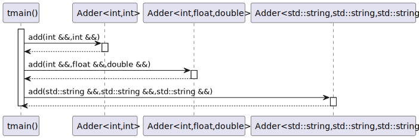
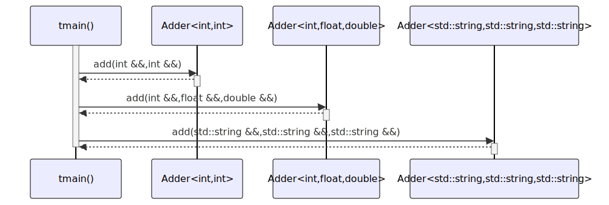

# t20007 - Class template variadic argument list sequence diagram
## Config
```yaml
diagrams:
  t20007_sequence:
    type: sequence
    glob:
      - t20007.cc
    include:
      namespaces:
        - clanguml::t20007
    using_namespace: clanguml::t20007
    from:
      - function: "clanguml::t20007::tmain()"
```
## Source code
File `tests/t20007/t20007.cc`
```cpp
#include <string>
#include <utility>

namespace clanguml {
namespace t20007 {

template <typename First, typename... Args> struct Adder {
    First add(First &&arg, Args &&...args) { return (arg + ... + args); }
};

void tmain()
{
    using namespace std::string_literals;

    Adder<int, int> adder1;
    Adder<int, float, double> adder2;
    Adder<std::string, std::string, std::string> adder3;

    [[maybe_unused]] auto res1 = adder1.add(2, 2);
    [[maybe_unused]] auto res2 = adder2.add(1, 2.0, 3.0);
    [[maybe_unused]] auto res3 = adder3.add("one"s, "two"s, "three"s);
}

}
}
```
## Generated PlantUML diagrams

## Generated Mermaid diagrams

## Generated JSON models
```json
{
  "diagram_type": "sequence",
  "name": "t20007_sequence",
  "participants": [
    {
      "display_name": "tmain()",
      "full_name": "clanguml::t20007::tmain()",
      "id": "622662006747239840",
      "name": "tmain",
      "namespace": "clanguml::t20007",
      "source_location": {
        "column": 6,
        "file": "t20007.cc",
        "line": 11,
        "translation_unit": "t20007.cc"
      },
      "type": "function"
    },
    {
      "activities": [
        {
          "display_name": "add(int &&,int &&)",
          "full_name": "clanguml::t20007::Adder<int,int>::add(int &&,int &&)",
          "id": "438133719207269065",
          "name": "add",
          "namespace": "",
          "source_location": {
            "column": 11,
            "file": "t20007.cc",
            "line": 8,
            "translation_unit": "t20007.cc"
          },
          "type": "method"
        }
      ],
      "display_name": "Adder<int,int>",
      "full_name": "clanguml::t20007::Adder<int,int>",
      "id": "1742497005509009302",
      "name": "Adder",
      "namespace": "clanguml::t20007",
      "source_location": {
        "column": 52,
        "file": "t20007.cc",
        "line": 7,
        "translation_unit": "t20007.cc"
      },
      "type": "class"
    },
    {
      "activities": [
        {
          "display_name": "add(int &&,float &&,double &&)",
          "full_name": "clanguml::t20007::Adder<int,float,double>::add(int &&,float &&,double &&)",
          "id": "9522724767688870",
          "name": "add",
          "namespace": "",
          "source_location": {
            "column": 11,
            "file": "t20007.cc",
            "line": 8,
            "translation_unit": "t20007.cc"
          },
          "type": "method"
        }
      ],
      "display_name": "Adder<int,float,double>",
      "full_name": "clanguml::t20007::Adder<int,float,double>",
      "id": "599640474306956868",
      "name": "Adder",
      "namespace": "clanguml::t20007",
      "source_location": {
        "column": 52,
        "file": "t20007.cc",
        "line": 7,
        "translation_unit": "t20007.cc"
      },
      "type": "class"
    },
    {
      "activities": [
        {
          "display_name": "add(std::string &&,std::string &&,std::string &&)",
          "full_name": "clanguml::t20007::Adder<std::string,std::string,std::string>::add(std::string &&,std::string &&,std::string &&)",
          "id": "384866641042941480",
          "name": "add",
          "namespace": "",
          "source_location": {
            "column": 11,
            "file": "t20007.cc",
            "line": 8,
            "translation_unit": "t20007.cc"
          },
          "type": "method"
        }
      ],
      "display_name": "Adder<std::string,std::string,std::string>",
      "full_name": "clanguml::t20007::Adder<std::string,std::string,std::string>",
      "id": "228191787514523926",
      "name": "Adder",
      "namespace": "clanguml::t20007",
      "source_location": {
        "column": 52,
        "file": "t20007.cc",
        "line": 7,
        "translation_unit": "t20007.cc"
      },
      "type": "class"
    }
  ],
  "sequences": [
    {
      "messages": [
        {
          "from": {
            "activity_id": "622662006747239840",
            "participant_id": "622662006747239840"
          },
          "name": "add(int &&,int &&)",
          "return_type": "int",
          "scope": "normal",
          "source_location": {
            "column": 34,
            "file": "t20007.cc",
            "line": 19,
            "translation_unit": "t20007.cc"
          },
          "to": {
            "activity_id": "438133719207269065",
            "participant_id": "1742497005509009302"
          },
          "type": "message"
        },
        {
          "from": {
            "activity_id": "622662006747239840",
            "participant_id": "622662006747239840"
          },
          "name": "add(int &&,float &&,double &&)",
          "return_type": "int",
          "scope": "normal",
          "source_location": {
            "column": 34,
            "file": "t20007.cc",
            "line": 20,
            "translation_unit": "t20007.cc"
          },
          "to": {
            "activity_id": "9522724767688870",
            "participant_id": "599640474306956868"
          },
          "type": "message"
        },
        {
          "from": {
            "activity_id": "622662006747239840",
            "participant_id": "622662006747239840"
          },
          "name": "add(std::string &&,std::string &&,std::string &&)",
          "return_type": "std::string",
          "scope": "normal",
          "source_location": {
            "column": 34,
            "file": "t20007.cc",
            "line": 21,
            "translation_unit": "t20007.cc"
          },
          "to": {
            "activity_id": "384866641042941480",
            "participant_id": "228191787514523926"
          },
          "type": "message"
        }
      ],
      "start_from": {
        "id": 622662006747239840,
        "location": "clanguml::t20007::tmain()"
      }
    }
  ],
  "using_namespace": "clanguml::t20007"
}
```
