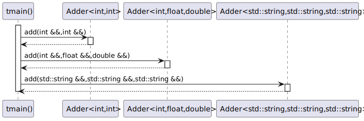
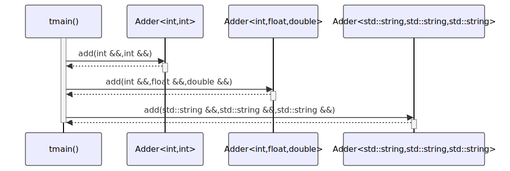

# t20007 - Class template variadic argument list sequence diagram
## Config
```yaml
diagrams:
  t20007_sequence:
    type: sequence
    glob:
      - t20007.cc
    include:
      namespaces:
        - clanguml::t20007
    using_namespace: clanguml::t20007
    from:
      - function: "clanguml::t20007::tmain()"
```
## Source code
File `tests/t20007/t20007.cc`
```cpp
#include <string>
#include <utility>

namespace clanguml {
namespace t20007 {

template <typename First, typename... Args> struct Adder {
    First add(First &&arg, Args &&...args) { return (arg + ... + args); }
};

void tmain()
{
    using namespace std::string_literals;

    Adder<int, int> adder1;
    Adder<int, float, double> adder2;
    Adder<std::string, std::string, std::string> adder3;

    [[maybe_unused]] auto res1 = adder1.add(2, 2);
    [[maybe_unused]] auto res2 = adder2.add(1, 2.0, 3.0);
    [[maybe_unused]] auto res3 = adder3.add("one"s, "two"s, "three"s);
}

}
}
```
## Generated PlantUML diagrams

## Generated Mermaid diagrams

## Generated JSON models
```json
{
  "diagram_type": "sequence",
  "name": "t20007_sequence",
  "participants": [
    {
      "display_name": "tmain()",
      "full_name": "clanguml::t20007::tmain()",
      "id": "16774132733644328992",
      "name": "tmain",
      "namespace": "clanguml::t20007",
      "source_location": {
        "column": 6,
        "file": "t20007.cc",
        "line": 11,
        "translation_unit": "t20007.cc"
      },
      "type": "function"
    },
    {
      "activities": [
        {
          "display_name": "add(int &&,int &&)",
          "full_name": "clanguml::t20007::Adder<int,int>::add(int &&,int &&)",
          "id": "6523866140061758983",
          "name": "add",
          "namespace": "clanguml::t20007",
          "source_location": {
            "column": 11,
            "file": "t20007.cc",
            "line": 8,
            "translation_unit": "t20007.cc"
          },
          "type": "method"
        }
      ],
      "display_name": "Adder<int,int>",
      "full_name": "clanguml::t20007::Adder<int,int>",
      "id": "10169917504688867786",
      "name": "Adder",
      "namespace": "clanguml::t20007",
      "source_location": {
        "column": 52,
        "file": "t20007.cc",
        "line": 7,
        "translation_unit": "t20007.cc"
      },
      "type": "class"
    },
    {
      "activities": [
        {
          "display_name": "add(int &&,float &&,double &&)",
          "full_name": "clanguml::t20007::Adder<int,float,double>::add(int &&,float &&,double &&)",
          "id": "2152719690889677782",
          "name": "add",
          "namespace": "clanguml::t20007",
          "source_location": {
            "column": 11,
            "file": "t20007.cc",
            "line": 8,
            "translation_unit": "t20007.cc"
          },
          "type": "method"
        }
      ],
      "display_name": "Adder<int,float,double>",
      "full_name": "clanguml::t20007::Adder<int,float,double>",
      "id": "4336834658812826091",
      "name": "Adder",
      "namespace": "clanguml::t20007",
      "source_location": {
        "column": 52,
        "file": "t20007.cc",
        "line": 7,
        "translation_unit": "t20007.cc"
      },
      "type": "class"
    },
    {
      "activities": [
        {
          "display_name": "add(std::string &&,std::string &&,std::string &&)",
          "full_name": "clanguml::t20007::Adder<std::string,std::string,std::string>::add(std::string &&,std::string &&,std::string &&)",
          "id": "14830845222527773352",
          "name": "add",
          "namespace": "clanguml::t20007::Adder<std::basic_string<char>, std::basic_string<char>, std",
          "source_location": {
            "column": 11,
            "file": "t20007.cc",
            "line": 8,
            "translation_unit": "t20007.cc"
          },
          "type": "method"
        }
      ],
      "display_name": "Adder<std::string,std::string,std::string>",
      "full_name": "clanguml::t20007::Adder<std::string,std::string,std::string>",
      "id": "380755016290731411",
      "name": "Adder",
      "namespace": "clanguml::t20007",
      "source_location": {
        "column": 52,
        "file": "t20007.cc",
        "line": 7,
        "translation_unit": "t20007.cc"
      },
      "type": "class"
    }
  ],
  "sequences": [
    {
      "from": {
        "id": "16774132733644328992",
        "location": "clanguml::t20007::tmain()"
      },
      "messages": [
        {
          "from": {
            "activity_id": "16774132733644328992",
            "participant_id": "16774132733644328992"
          },
          "name": "add(int &&,int &&)",
          "return_type": "int",
          "scope": "normal",
          "source_location": {
            "column": 34,
            "file": "t20007.cc",
            "line": 19,
            "translation_unit": "t20007.cc"
          },
          "to": {
            "activity_id": "6523866140061758983",
            "participant_id": "10169917504688867786"
          },
          "type": "message"
        },
        {
          "from": {
            "activity_id": "6523866140061758983",
            "participant_id": "10169917504688867786"
          },
          "name": "",
          "return_type": "int",
          "scope": "normal",
          "source_location": {
            "column": 46,
            "file": "t20007.cc",
            "line": 8,
            "translation_unit": "t20007.cc"
          },
          "to": {
            "activity_id": "16774132733644328992",
            "participant_id": "16774132733644328992"
          },
          "type": "return"
        },
        {
          "from": {
            "activity_id": "16774132733644328992",
            "participant_id": "16774132733644328992"
          },
          "name": "add(int &&,float &&,double &&)",
          "return_type": "int",
          "scope": "normal",
          "source_location": {
            "column": 34,
            "file": "t20007.cc",
            "line": 20,
            "translation_unit": "t20007.cc"
          },
          "to": {
            "activity_id": "2152719690889677782",
            "participant_id": "4336834658812826091"
          },
          "type": "message"
        },
        {
          "from": {
            "activity_id": "2152719690889677782",
            "participant_id": "4336834658812826091"
          },
          "name": "",
          "return_type": "int",
          "scope": "normal",
          "source_location": {
            "column": 46,
            "file": "t20007.cc",
            "line": 8,
            "translation_unit": "t20007.cc"
          },
          "to": {
            "activity_id": "16774132733644328992",
            "participant_id": "16774132733644328992"
          },
          "type": "return"
        },
        {
          "from": {
            "activity_id": "16774132733644328992",
            "participant_id": "16774132733644328992"
          },
          "name": "add(std::string &&,std::string &&,std::string &&)",
          "return_type": "std::string",
          "scope": "normal",
          "source_location": {
            "column": 34,
            "file": "t20007.cc",
            "line": 21,
            "translation_unit": "t20007.cc"
          },
          "to": {
            "activity_id": "14830845222527773352",
            "participant_id": "380755016290731411"
          },
          "type": "message"
        },
        {
          "from": {
            "activity_id": "14830845222527773352",
            "participant_id": "380755016290731411"
          },
          "name": "",
          "return_type": "class std::string",
          "scope": "normal",
          "source_location": {
            "column": 46,
            "file": "t20007.cc",
            "line": 8,
            "translation_unit": "t20007.cc"
          },
          "to": {
            "activity_id": "16774132733644328992",
            "participant_id": "16774132733644328992"
          },
          "type": "return"
        }
      ]
    }
  ],
  "using_namespace": "clanguml::t20007"
}
```
## Generated GraphML models
