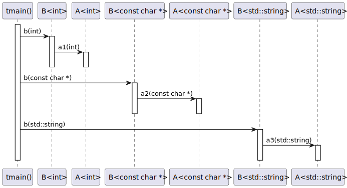
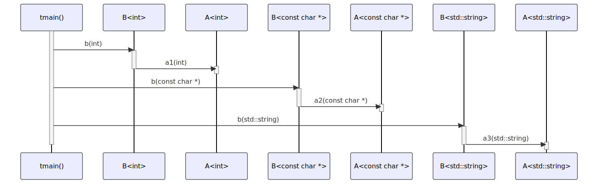

# t20008 - Constexpr if sequence diagram test case
## Config
```yaml
diagrams:
  t20008_sequence:
    type: sequence
    glob:
      - t20008.cc
    include:
      namespaces:
        - clanguml::t20008
    using_namespace: clanguml::t20008
    from:
      - function: "clanguml::t20008::tmain()"
```
## Source code
File `tests/t20008/t20008.cc`
```cpp
#include <string>
#include <type_traits>

namespace clanguml {
namespace t20008 {

template <typename T> struct A {
    void a1(T arg) { }
    void a2(T arg) { }
    void a3(T arg) { }
};

template <typename T> struct B {
    A<T> a;

    void b(T arg)
    {
        if constexpr (std::is_integral_v<T>) {
            a.a1(arg);
        }
        else if constexpr (std::is_pointer_v<T>) {
            a.a2(arg);
        }
        else {
            a.a3(arg);
        }
    }
};

void tmain()
{
    using namespace std::string_literals;

    B<int> bint;
    B<const char *> bcharp;
    B<std::string> bstring;

    bint.b(1);
    bcharp.b("1");
    bstring.b("1"s);
}
}
}
```
## Generated PlantUML diagrams

## Generated Mermaid diagrams

## Generated JSON models
```json
{
  "diagram_type": "sequence",
  "name": "t20008_sequence",
  "participants": [
    {
      "display_name": "tmain()",
      "full_name": "clanguml::t20008::tmain()",
      "id": "1180776240543224244",
      "name": "tmain",
      "namespace": "clanguml::t20008",
      "source_location": {
        "column": 6,
        "file": "t20008.cc",
        "line": 30,
        "translation_unit": "t20008.cc"
      },
      "type": "function"
    },
    {
      "activities": [
        {
          "display_name": "b(int)",
          "full_name": "clanguml::t20008::B<int>::b(int)",
          "id": "379850145437051189",
          "name": "b",
          "namespace": "",
          "source_location": {
            "column": 10,
            "file": "t20008.cc",
            "line": 16,
            "translation_unit": "t20008.cc"
          },
          "type": "method"
        }
      ],
      "display_name": "B<int>",
      "full_name": "clanguml::t20008::B<int>",
      "id": "1906510289157013670",
      "name": "B",
      "namespace": "clanguml::t20008",
      "source_location": {
        "column": 30,
        "file": "t20008.cc",
        "line": 13,
        "translation_unit": "t20008.cc"
      },
      "type": "class"
    },
    {
      "activities": [
        {
          "display_name": "a1(int)",
          "full_name": "clanguml::t20008::A<int>::a1(int)",
          "id": "2066363630174644719",
          "name": "a1",
          "namespace": "",
          "source_location": {
            "column": 10,
            "file": "t20008.cc",
            "line": 8,
            "translation_unit": "t20008.cc"
          },
          "type": "method"
        }
      ],
      "display_name": "A<int>",
      "full_name": "clanguml::t20008::A<int>",
      "id": "1376149084762923197",
      "name": "A",
      "namespace": "clanguml::t20008",
      "source_location": {
        "column": 30,
        "file": "t20008.cc",
        "line": 7,
        "translation_unit": "t20008.cc"
      },
      "type": "class"
    },
    {
      "activities": [
        {
          "display_name": "b(const char *)",
          "full_name": "clanguml::t20008::B<const char *>::b(const char *)",
          "id": "1347162523481637780",
          "name": "b",
          "namespace": "",
          "source_location": {
            "column": 10,
            "file": "t20008.cc",
            "line": 16,
            "translation_unit": "t20008.cc"
          },
          "type": "method"
        }
      ],
      "display_name": "B<const char *>",
      "full_name": "clanguml::t20008::B<const char *>",
      "id": "867098551202196741",
      "name": "B",
      "namespace": "clanguml::t20008",
      "source_location": {
        "column": 30,
        "file": "t20008.cc",
        "line": 13,
        "translation_unit": "t20008.cc"
      },
      "type": "class"
    },
    {
      "activities": [
        {
          "display_name": "a2(const char *)",
          "full_name": "clanguml::t20008::A<const char *>::a2(const char *)",
          "id": "718650834962275580",
          "name": "a2",
          "namespace": "",
          "source_location": {
            "column": 10,
            "file": "t20008.cc",
            "line": 9,
            "translation_unit": "t20008.cc"
          },
          "type": "method"
        }
      ],
      "display_name": "A<const char *>",
      "full_name": "clanguml::t20008::A<const char *>",
      "id": "144833378017373200",
      "name": "A",
      "namespace": "clanguml::t20008",
      "source_location": {
        "column": 30,
        "file": "t20008.cc",
        "line": 7,
        "translation_unit": "t20008.cc"
      },
      "type": "class"
    },
    {
      "activities": [
        {
          "display_name": "b(std::string)",
          "full_name": "clanguml::t20008::B<std::string>::b(std::string)",
          "id": "1286410946666951254",
          "name": "b",
          "namespace": "",
          "source_location": {
            "column": 10,
            "file": "t20008.cc",
            "line": 16,
            "translation_unit": "t20008.cc"
          },
          "type": "method"
        }
      ],
      "display_name": "B<std::string>",
      "full_name": "clanguml::t20008::B<std::string>",
      "id": "927702553742507923",
      "name": "B",
      "namespace": "clanguml::t20008",
      "source_location": {
        "column": 30,
        "file": "t20008.cc",
        "line": 13,
        "translation_unit": "t20008.cc"
      },
      "type": "class"
    },
    {
      "activities": [
        {
          "display_name": "a3(std::string)",
          "full_name": "clanguml::t20008::A<std::string>::a3(std::string)",
          "id": "1404594247101138737",
          "name": "a3",
          "namespace": "",
          "source_location": {
            "column": 10,
            "file": "t20008.cc",
            "line": 10,
            "translation_unit": "t20008.cc"
          },
          "type": "method"
        }
      ],
      "display_name": "A<std::string>",
      "full_name": "clanguml::t20008::A<std::string>",
      "id": "390605614583363778",
      "name": "A",
      "namespace": "clanguml::t20008",
      "source_location": {
        "column": 30,
        "file": "t20008.cc",
        "line": 7,
        "translation_unit": "t20008.cc"
      },
      "type": "class"
    }
  ],
  "sequences": [
    {
      "messages": [
        {
          "from": {
            "activity_id": "1180776240543224244",
            "participant_id": "1180776240543224244"
          },
          "name": "b(int)",
          "return_type": "void",
          "scope": "normal",
          "source_location": {
            "column": 5,
            "file": "t20008.cc",
            "line": 38,
            "translation_unit": "t20008.cc"
          },
          "to": {
            "activity_id": "379850145437051189",
            "participant_id": "1906510289157013670"
          },
          "type": "message"
        },
        {
          "from": {
            "activity_id": "379850145437051189",
            "participant_id": "1906510289157013670"
          },
          "name": "a1(int)",
          "return_type": "void",
          "scope": "normal",
          "source_location": {
            "column": 13,
            "file": "t20008.cc",
            "line": 19,
            "translation_unit": "t20008.cc"
          },
          "to": {
            "activity_id": "2066363630174644719",
            "participant_id": "1376149084762923197"
          },
          "type": "message"
        },
        {
          "from": {
            "activity_id": "1180776240543224244",
            "participant_id": "1180776240543224244"
          },
          "name": "b(const char *)",
          "return_type": "void",
          "scope": "normal",
          "source_location": {
            "column": 5,
            "file": "t20008.cc",
            "line": 39,
            "translation_unit": "t20008.cc"
          },
          "to": {
            "activity_id": "1347162523481637780",
            "participant_id": "867098551202196741"
          },
          "type": "message"
        },
        {
          "from": {
            "activity_id": "1347162523481637780",
            "participant_id": "867098551202196741"
          },
          "name": "a2(const char *)",
          "return_type": "void",
          "scope": "normal",
          "source_location": {
            "column": 13,
            "file": "t20008.cc",
            "line": 22,
            "translation_unit": "t20008.cc"
          },
          "to": {
            "activity_id": "718650834962275580",
            "participant_id": "144833378017373200"
          },
          "type": "message"
        },
        {
          "from": {
            "activity_id": "1180776240543224244",
            "participant_id": "1180776240543224244"
          },
          "name": "b(std::string)",
          "return_type": "void",
          "scope": "normal",
          "source_location": {
            "column": 5,
            "file": "t20008.cc",
            "line": 40,
            "translation_unit": "t20008.cc"
          },
          "to": {
            "activity_id": "1286410946666951254",
            "participant_id": "927702553742507923"
          },
          "type": "message"
        },
        {
          "from": {
            "activity_id": "1286410946666951254",
            "participant_id": "927702553742507923"
          },
          "name": "a3(std::string)",
          "return_type": "void",
          "scope": "normal",
          "source_location": {
            "column": 13,
            "file": "t20008.cc",
            "line": 25,
            "translation_unit": "t20008.cc"
          },
          "to": {
            "activity_id": "1404594247101138737",
            "participant_id": "390605614583363778"
          },
          "type": "message"
        }
      ],
      "start_from": {
        "id": 1180776240543224244,
        "location": "clanguml::t20008::tmain()"
      }
    }
  ],
  "using_namespace": "clanguml::t20008"
}
```
