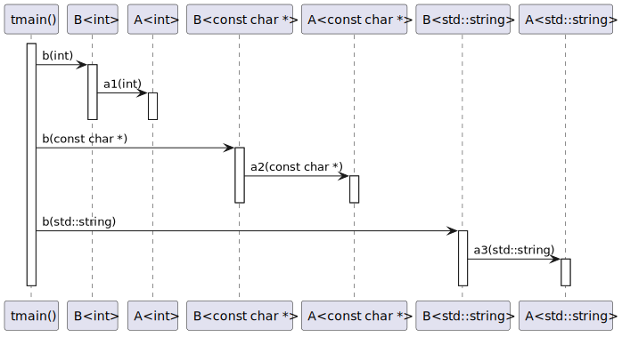
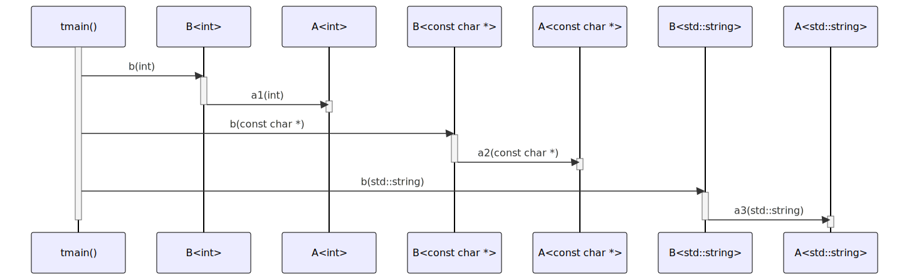

# t20008 - Constexpr if sequence diagram test case
## Config
```yaml
diagrams:
  t20008_sequence:
    type: sequence
    glob:
      - t20008.cc
    include:
      namespaces:
        - clanguml::t20008
    using_namespace: clanguml::t20008
    from:
      - function: "clanguml::t20008::tmain()"
```
## Source code
File `tests/t20008/t20008.cc`
```cpp
#include <string>
#include <type_traits>

namespace clanguml {
namespace t20008 {

template <typename T> struct A {
    void a1(T arg) { }
    void a2(T arg) { }
    void a3(T arg) { }
};

template <typename T> struct B {
    A<T> a;

    void b(T arg)
    {
        if constexpr (std::is_integral_v<T>) {
            a.a1(arg);
        }
        else if constexpr (std::is_pointer_v<T>) {
            a.a2(arg);
        }
        else {
            a.a3(arg);
        }
    }
};

void tmain()
{
    using namespace std::string_literals;

    B<int> bint;
    B<const char *> bcharp;
    B<std::string> bstring;

    bint.b(1);
    bcharp.b("1");
    bstring.b("1"s);
}
}
}
```
## Generated PlantUML diagrams

## Generated Mermaid diagrams

## Generated JSON models
```json
{
  "diagram_type": "sequence",
  "name": "t20008_sequence",
  "participants": [
    {
      "display_name": "tmain()",
      "full_name": "clanguml::t20008::tmain()",
      "id": "5354175706842228850",
      "name": "tmain",
      "namespace": "clanguml::t20008",
      "source_location": {
        "column": 6,
        "file": "t20008.cc",
        "line": 30,
        "translation_unit": "t20008.cc"
      },
      "type": "function"
    },
    {
      "activities": [
        {
          "display_name": "b(int)",
          "full_name": "clanguml::t20008::B<int>::b(int)",
          "id": "3449802306108138936",
          "name": "b",
          "namespace": "clanguml::t20008",
          "source_location": {
            "column": 10,
            "file": "t20008.cc",
            "line": 16,
            "translation_unit": "t20008.cc"
          },
          "type": "method"
        }
      ],
      "display_name": "B<int>",
      "full_name": "clanguml::t20008::B<int>",
      "id": "3695898748407466060",
      "name": "B",
      "namespace": "clanguml::t20008",
      "source_location": {
        "column": 30,
        "file": "t20008.cc",
        "line": 13,
        "translation_unit": "t20008.cc"
      },
      "type": "class"
    },
    {
      "activities": [
        {
          "display_name": "a1(int)",
          "full_name": "clanguml::t20008::A<int>::a1(int)",
          "id": "16852721870923313584",
          "name": "a1",
          "namespace": "clanguml::t20008",
          "source_location": {
            "column": 10,
            "file": "t20008.cc",
            "line": 8,
            "translation_unit": "t20008.cc"
          },
          "type": "method"
        }
      ],
      "display_name": "A<int>",
      "full_name": "clanguml::t20008::A<int>",
      "id": "17460857490532632217",
      "name": "A",
      "namespace": "clanguml::t20008",
      "source_location": {
        "column": 30,
        "file": "t20008.cc",
        "line": 7,
        "translation_unit": "t20008.cc"
      },
      "type": "class"
    },
    {
      "activities": [
        {
          "display_name": "b(const char *)",
          "full_name": "clanguml::t20008::B<const char *>::b(const char *)",
          "id": "3212052899005865250",
          "name": "b",
          "namespace": "clanguml::t20008",
          "source_location": {
            "column": 10,
            "file": "t20008.cc",
            "line": 16,
            "translation_unit": "t20008.cc"
          },
          "type": "method"
        }
      ],
      "display_name": "B<const char *>",
      "full_name": "clanguml::t20008::B<const char *>",
      "id": "9018156717014018381",
      "name": "B",
      "namespace": "clanguml::t20008",
      "source_location": {
        "column": 30,
        "file": "t20008.cc",
        "line": 13,
        "translation_unit": "t20008.cc"
      },
      "type": "class"
    },
    {
      "activities": [
        {
          "display_name": "a2(const char *)",
          "full_name": "clanguml::t20008::A<const char *>::a2(const char *)",
          "id": "13130321644389216608",
          "name": "a2",
          "namespace": "clanguml::t20008",
          "source_location": {
            "column": 10,
            "file": "t20008.cc",
            "line": 9,
            "translation_unit": "t20008.cc"
          },
          "type": "method"
        }
      ],
      "display_name": "A<const char *>",
      "full_name": "clanguml::t20008::A<const char *>",
      "id": "123113780418191610",
      "name": "A",
      "namespace": "clanguml::t20008",
      "source_location": {
        "column": 30,
        "file": "t20008.cc",
        "line": 7,
        "translation_unit": "t20008.cc"
      },
      "type": "class"
    },
    {
      "activities": [
        {
          "display_name": "b(std::string)",
          "full_name": "clanguml::t20008::B<std::string>::b(std::string)",
          "id": "8234643022489228749",
          "name": "b",
          "namespace": "clanguml::t20008::B<std",
          "source_location": {
            "column": 10,
            "file": "t20008.cc",
            "line": 16,
            "translation_unit": "t20008.cc"
          },
          "type": "method"
        }
      ],
      "display_name": "B<std::string>",
      "full_name": "clanguml::t20008::B<std::string>",
      "id": "3906888555640850899",
      "name": "B",
      "namespace": "clanguml::t20008",
      "source_location": {
        "column": 30,
        "file": "t20008.cc",
        "line": 13,
        "translation_unit": "t20008.cc"
      },
      "type": "class"
    },
    {
      "activities": [
        {
          "display_name": "a3(std::string)",
          "full_name": "clanguml::t20008::A<std::string>::a3(std::string)",
          "id": "9384295234051350222",
          "name": "a3",
          "namespace": "clanguml::t20008::A<std",
          "source_location": {
            "column": 10,
            "file": "t20008.cc",
            "line": 10,
            "translation_unit": "t20008.cc"
          },
          "type": "method"
        }
      ],
      "display_name": "A<std::string>",
      "full_name": "clanguml::t20008::A<std::string>",
      "id": "9132945526157388329",
      "name": "A",
      "namespace": "clanguml::t20008",
      "source_location": {
        "column": 30,
        "file": "t20008.cc",
        "line": 7,
        "translation_unit": "t20008.cc"
      },
      "type": "class"
    }
  ],
  "sequences": [
    {
      "from": {
        "id": "5354175706842228850",
        "location": "clanguml::t20008::tmain()"
      },
      "messages": [
        {
          "from": {
            "activity_id": "5354175706842228850",
            "participant_id": "5354175706842228850"
          },
          "name": "b(int)",
          "return_type": "void",
          "scope": "normal",
          "source_location": {
            "column": 5,
            "file": "t20008.cc",
            "line": 38,
            "translation_unit": "t20008.cc"
          },
          "to": {
            "activity_id": "3449802306108138936",
            "participant_id": "3695898748407466060"
          },
          "type": "message"
        },
        {
          "from": {
            "activity_id": "3449802306108138936",
            "participant_id": "3695898748407466060"
          },
          "name": "a1(int)",
          "return_type": "void",
          "scope": "normal",
          "source_location": {
            "column": 13,
            "file": "t20008.cc",
            "line": 19,
            "translation_unit": "t20008.cc"
          },
          "to": {
            "activity_id": "16852721870923313584",
            "participant_id": "17460857490532632217"
          },
          "type": "message"
        },
        {
          "from": {
            "activity_id": "5354175706842228850",
            "participant_id": "5354175706842228850"
          },
          "name": "b(const char *)",
          "return_type": "void",
          "scope": "normal",
          "source_location": {
            "column": 5,
            "file": "t20008.cc",
            "line": 39,
            "translation_unit": "t20008.cc"
          },
          "to": {
            "activity_id": "3212052899005865250",
            "participant_id": "9018156717014018381"
          },
          "type": "message"
        },
        {
          "from": {
            "activity_id": "3212052899005865250",
            "participant_id": "9018156717014018381"
          },
          "name": "a2(const char *)",
          "return_type": "void",
          "scope": "normal",
          "source_location": {
            "column": 13,
            "file": "t20008.cc",
            "line": 22,
            "translation_unit": "t20008.cc"
          },
          "to": {
            "activity_id": "13130321644389216608",
            "participant_id": "123113780418191610"
          },
          "type": "message"
        },
        {
          "from": {
            "activity_id": "5354175706842228850",
            "participant_id": "5354175706842228850"
          },
          "name": "b(std::string)",
          "return_type": "void",
          "scope": "normal",
          "source_location": {
            "column": 5,
            "file": "t20008.cc",
            "line": 40,
            "translation_unit": "t20008.cc"
          },
          "to": {
            "activity_id": "8234643022489228749",
            "participant_id": "3906888555640850899"
          },
          "type": "message"
        },
        {
          "from": {
            "activity_id": "8234643022489228749",
            "participant_id": "3906888555640850899"
          },
          "name": "a3(std::string)",
          "return_type": "void",
          "scope": "normal",
          "source_location": {
            "column": 13,
            "file": "t20008.cc",
            "line": 25,
            "translation_unit": "t20008.cc"
          },
          "to": {
            "activity_id": "9384295234051350222",
            "participant_id": "9132945526157388329"
          },
          "type": "message"
        }
      ]
    }
  ],
  "using_namespace": "clanguml::t20008"
}
```
## Generated GraphML models
