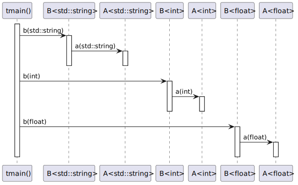
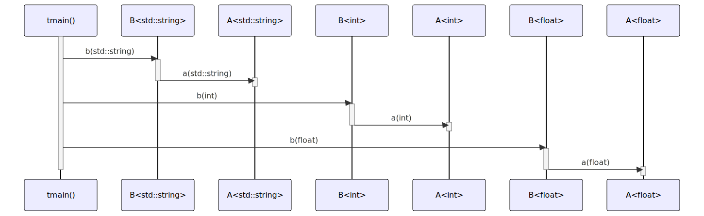

# t20009 - Smart pointer dereference call expression test case
## Config
```yaml
diagrams:
  t20009_sequence:
    type: sequence
    glob:
      - t20009.cc
    include:
      namespaces:
        - clanguml::t20009
    using_namespace: clanguml::t20009
    from:
      - function: "clanguml::t20009::tmain()"
```
## Source code
File `tests/t20009/t20009.cc`
```cpp
#include <memory>
#include <string>

namespace clanguml {
namespace t20009 {
template <typename T> struct A {
    void a(T arg) { }
};

template <typename T> struct B {
    void b(T arg) { a->a(arg); }

    std::unique_ptr<A<T>> a;
};

using BFloatPtr = std::shared_ptr<B<float>>;

void tmain()
{
    std::shared_ptr<B<std::string>> bstring;
    auto bint = std::make_unique<B<int>>();
    BFloatPtr bfloat;

    bstring->b("b");
    bint.get()->b(42);
    bfloat->b(1.0);
}
}
}
```
## Generated PlantUML diagrams

## Generated Mermaid diagrams

## Generated JSON models
```json
{
  "diagram_type": "sequence",
  "name": "t20009_sequence",
  "participants": [
    {
      "display_name": "tmain()",
      "full_name": "clanguml::t20009::tmain()",
      "id": "798871627956492366",
      "name": "tmain",
      "namespace": "clanguml::t20009",
      "source_location": {
        "column": 6,
        "file": "t20009.cc",
        "line": 18,
        "translation_unit": "t20009.cc"
      },
      "type": "function"
    },
    {
      "activities": [
        {
          "display_name": "b(std::string)",
          "full_name": "clanguml::t20009::B<std::string>::b(std::string)",
          "id": "15300852849647561631",
          "name": "b",
          "namespace": "clanguml::t20009::B<std",
          "source_location": {
            "column": 10,
            "file": "t20009.cc",
            "line": 11,
            "translation_unit": "t20009.cc"
          },
          "type": "method"
        }
      ],
      "display_name": "B<std::string>",
      "full_name": "clanguml::t20009::B<std::string>",
      "id": "15881499561055042325",
      "name": "B",
      "namespace": "clanguml::t20009",
      "source_location": {
        "column": 30,
        "file": "t20009.cc",
        "line": 10,
        "translation_unit": "t20009.cc"
      },
      "type": "class"
    },
    {
      "activities": [
        {
          "display_name": "a(std::string)",
          "full_name": "clanguml::t20009::A<std::string>::a(std::string)",
          "id": "7931133935140690916",
          "name": "a",
          "namespace": "clanguml::t20009::A<std",
          "source_location": {
            "column": 10,
            "file": "t20009.cc",
            "line": 7,
            "translation_unit": "t20009.cc"
          },
          "type": "method"
        }
      ],
      "display_name": "A<std::string>",
      "full_name": "clanguml::t20009::A<std::string>",
      "id": "12279591094086659294",
      "name": "A",
      "namespace": "clanguml::t20009",
      "source_location": {
        "column": 30,
        "file": "t20009.cc",
        "line": 6,
        "translation_unit": "t20009.cc"
      },
      "type": "class"
    },
    {
      "activities": [
        {
          "display_name": "b(int)",
          "full_name": "clanguml::t20009::B<int>::b(int)",
          "id": "282781252021326865",
          "name": "b",
          "namespace": "clanguml::t20009",
          "source_location": {
            "column": 10,
            "file": "t20009.cc",
            "line": 11,
            "translation_unit": "t20009.cc"
          },
          "type": "method"
        }
      ],
      "display_name": "B<int>",
      "full_name": "clanguml::t20009::B<int>",
      "id": "6225837122716484680",
      "name": "B",
      "namespace": "clanguml::t20009",
      "source_location": {
        "column": 30,
        "file": "t20009.cc",
        "line": 10,
        "translation_unit": "t20009.cc"
      },
      "type": "class"
    },
    {
      "activities": [
        {
          "display_name": "a(int)",
          "full_name": "clanguml::t20009::A<int>::a(int)",
          "id": "2019707249224880591",
          "name": "a",
          "namespace": "clanguml::t20009",
          "source_location": {
            "column": 10,
            "file": "t20009.cc",
            "line": 7,
            "translation_unit": "t20009.cc"
          },
          "type": "method"
        }
      ],
      "display_name": "A<int>",
      "full_name": "clanguml::t20009::A<int>",
      "id": "17732358603641599348",
      "name": "A",
      "namespace": "clanguml::t20009",
      "source_location": {
        "column": 30,
        "file": "t20009.cc",
        "line": 6,
        "translation_unit": "t20009.cc"
      },
      "type": "class"
    },
    {
      "activities": [
        {
          "display_name": "b(float)",
          "full_name": "clanguml::t20009::B<float>::b(float)",
          "id": "2953462178061583072",
          "name": "b",
          "namespace": "clanguml::t20009",
          "source_location": {
            "column": 10,
            "file": "t20009.cc",
            "line": 11,
            "translation_unit": "t20009.cc"
          },
          "type": "method"
        }
      ],
      "display_name": "B<float>",
      "full_name": "clanguml::t20009::B<float>",
      "id": "770661232338440259",
      "name": "B",
      "namespace": "clanguml::t20009",
      "source_location": {
        "column": 30,
        "file": "t20009.cc",
        "line": 10,
        "translation_unit": "t20009.cc"
      },
      "type": "class"
    },
    {
      "activities": [
        {
          "display_name": "a(float)",
          "full_name": "clanguml::t20009::A<float>::a(float)",
          "id": "14977724703169695050",
          "name": "a",
          "namespace": "clanguml::t20009",
          "source_location": {
            "column": 10,
            "file": "t20009.cc",
            "line": 7,
            "translation_unit": "t20009.cc"
          },
          "type": "method"
        }
      ],
      "display_name": "A<float>",
      "full_name": "clanguml::t20009::A<float>",
      "id": "4145201515863317751",
      "name": "A",
      "namespace": "clanguml::t20009",
      "source_location": {
        "column": 30,
        "file": "t20009.cc",
        "line": 6,
        "translation_unit": "t20009.cc"
      },
      "type": "class"
    }
  ],
  "sequences": [
    {
      "from": {
        "id": "798871627956492366",
        "location": "clanguml::t20009::tmain()"
      },
      "messages": [
        {
          "from": {
            "activity_id": "798871627956492366",
            "participant_id": "798871627956492366"
          },
          "name": "b(std::string)",
          "return_type": "void",
          "scope": "normal",
          "source_location": {
            "column": 5,
            "file": "t20009.cc",
            "line": 24,
            "translation_unit": "t20009.cc"
          },
          "to": {
            "activity_id": "15300852849647561631",
            "participant_id": "15881499561055042325"
          },
          "type": "message"
        },
        {
          "from": {
            "activity_id": "15300852849647561631",
            "participant_id": "15881499561055042325"
          },
          "name": "a(std::string)",
          "return_type": "void",
          "scope": "normal",
          "source_location": {
            "column": 21,
            "file": "t20009.cc",
            "line": 11,
            "translation_unit": "t20009.cc"
          },
          "to": {
            "activity_id": "7931133935140690916",
            "participant_id": "12279591094086659294"
          },
          "type": "message"
        },
        {
          "from": {
            "activity_id": "798871627956492366",
            "participant_id": "798871627956492366"
          },
          "name": "b(int)",
          "return_type": "void",
          "scope": "normal",
          "source_location": {
            "column": 5,
            "file": "t20009.cc",
            "line": 25,
            "translation_unit": "t20009.cc"
          },
          "to": {
            "activity_id": "282781252021326865",
            "participant_id": "6225837122716484680"
          },
          "type": "message"
        },
        {
          "from": {
            "activity_id": "282781252021326865",
            "participant_id": "6225837122716484680"
          },
          "name": "a(int)",
          "return_type": "void",
          "scope": "normal",
          "source_location": {
            "column": 21,
            "file": "t20009.cc",
            "line": 11,
            "translation_unit": "t20009.cc"
          },
          "to": {
            "activity_id": "2019707249224880591",
            "participant_id": "17732358603641599348"
          },
          "type": "message"
        },
        {
          "from": {
            "activity_id": "798871627956492366",
            "participant_id": "798871627956492366"
          },
          "name": "b(float)",
          "return_type": "void",
          "scope": "normal",
          "source_location": {
            "column": 5,
            "file": "t20009.cc",
            "line": 26,
            "translation_unit": "t20009.cc"
          },
          "to": {
            "activity_id": "2953462178061583072",
            "participant_id": "770661232338440259"
          },
          "type": "message"
        },
        {
          "from": {
            "activity_id": "2953462178061583072",
            "participant_id": "770661232338440259"
          },
          "name": "a(float)",
          "return_type": "void",
          "scope": "normal",
          "source_location": {
            "column": 21,
            "file": "t20009.cc",
            "line": 11,
            "translation_unit": "t20009.cc"
          },
          "to": {
            "activity_id": "14977724703169695050",
            "participant_id": "4145201515863317751"
          },
          "type": "message"
        }
      ]
    }
  ],
  "using_namespace": "clanguml::t20009"
}
```
## Generated GraphML models
