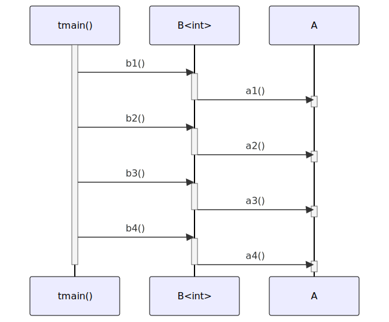

# t20010 - Container sequence diagram test case
## Config
```yaml
diagrams:
  t20010_sequence:
    type: sequence
    glob:
      - t20010.cc
    include:
      namespaces:
        - clanguml::t20010
    using_namespace: clanguml::t20010
    from:
      - function: "clanguml::t20010::tmain()"
```
## Source code
File `tests/t20010/t20010.cc`
```cpp
#include <array>
#include <map>
#include <memory>
#include <vector>

namespace clanguml {
namespace t20010 {

struct A {
    void a1() { }
    void a2() { }
    void a3() { }
    void a4() { }
};

template <typename T> struct B {
    void b1() { a_.a1(); }
    void b2() { avector_.front().a2(); }
    void b3() { aptrvector_.front()->a3(); }
    void b4() { amap_.at(0).a4(); }

    A a_;
    std::vector<A> avector_;
    std::vector<std::unique_ptr<A>> aptrvector_;
    std::map<T, A> amap_;
};

void tmain()
{
    B<int> b;

    b.b1();
    b.b2();
    b.b3();
    b.b4();
}

}
}
```
## Generated PlantUML diagrams

## Generated Mermaid diagrams

## Generated JSON models
```json
{
  "diagram_type": "sequence",
  "name": "t20010_sequence",
  "participants": [
    {
      "display_name": "tmain()",
      "full_name": "clanguml::t20010::tmain()",
      "id": "10917284878333881955",
      "name": "tmain",
      "namespace": "clanguml::t20010",
      "source_location": {
        "column": 6,
        "file": "t20010.cc",
        "line": 28,
        "translation_unit": "t20010.cc"
      },
      "type": "function"
    },
    {
      "activities": [
        {
          "display_name": "b1()",
          "full_name": "clanguml::t20010::B<int>::b1()",
          "id": "2749008487419934688",
          "name": "b1",
          "namespace": "clanguml::t20010",
          "source_location": {
            "column": 10,
            "file": "t20010.cc",
            "line": 17,
            "translation_unit": "t20010.cc"
          },
          "type": "method"
        },
        {
          "display_name": "b2()",
          "full_name": "clanguml::t20010::B<int>::b2()",
          "id": "13064248908824496351",
          "name": "b2",
          "namespace": "clanguml::t20010",
          "source_location": {
            "column": 10,
            "file": "t20010.cc",
            "line": 18,
            "translation_unit": "t20010.cc"
          },
          "type": "method"
        },
        {
          "display_name": "b3()",
          "full_name": "clanguml::t20010::B<int>::b3()",
          "id": "6289748349234477538",
          "name": "b3",
          "namespace": "clanguml::t20010",
          "source_location": {
            "column": 10,
            "file": "t20010.cc",
            "line": 19,
            "translation_unit": "t20010.cc"
          },
          "type": "method"
        },
        {
          "display_name": "b4()",
          "full_name": "clanguml::t20010::B<int>::b4()",
          "id": "14928551723181621328",
          "name": "b4",
          "namespace": "clanguml::t20010",
          "source_location": {
            "column": 10,
            "file": "t20010.cc",
            "line": 20,
            "translation_unit": "t20010.cc"
          },
          "type": "method"
        }
      ],
      "display_name": "B<int>",
      "full_name": "clanguml::t20010::B<int>",
      "id": "17239817607233680921",
      "name": "B",
      "namespace": "clanguml::t20010",
      "source_location": {
        "column": 30,
        "file": "t20010.cc",
        "line": 16,
        "translation_unit": "t20010.cc"
      },
      "type": "class"
    },
    {
      "activities": [
        {
          "display_name": "a1()",
          "full_name": "clanguml::t20010::A::a1()",
          "id": "7849477454619758807",
          "name": "a1",
          "namespace": "clanguml::t20010",
          "source_location": {
            "column": 10,
            "file": "t20010.cc",
            "line": 10,
            "translation_unit": "t20010.cc"
          },
          "type": "method"
        },
        {
          "display_name": "a2()",
          "full_name": "clanguml::t20010::A::a2()",
          "id": "5314967045057172736",
          "name": "a2",
          "namespace": "clanguml::t20010",
          "source_location": {
            "column": 10,
            "file": "t20010.cc",
            "line": 11,
            "translation_unit": "t20010.cc"
          },
          "type": "method"
        },
        {
          "display_name": "a3()",
          "full_name": "clanguml::t20010::A::a3()",
          "id": "17165914358584127192",
          "name": "a3",
          "namespace": "clanguml::t20010",
          "source_location": {
            "column": 10,
            "file": "t20010.cc",
            "line": 12,
            "translation_unit": "t20010.cc"
          },
          "type": "method"
        },
        {
          "display_name": "a4()",
          "full_name": "clanguml::t20010::A::a4()",
          "id": "9799491886675206575",
          "name": "a4",
          "namespace": "clanguml::t20010",
          "source_location": {
            "column": 10,
            "file": "t20010.cc",
            "line": 13,
            "translation_unit": "t20010.cc"
          },
          "type": "method"
        }
      ],
      "display_name": "A",
      "full_name": "clanguml::t20010::A",
      "id": "816562811939400905",
      "name": "A",
      "namespace": "clanguml::t20010",
      "source_location": {
        "column": 8,
        "file": "t20010.cc",
        "line": 9,
        "translation_unit": "t20010.cc"
      },
      "type": "class"
    }
  ],
  "sequences": [
    {
      "from": {
        "id": "10917284878333881955",
        "location": "clanguml::t20010::tmain()"
      },
      "messages": [
        {
          "from": {
            "activity_id": "10917284878333881955",
            "participant_id": "10917284878333881955"
          },
          "name": "b1()",
          "return_type": "void",
          "scope": "normal",
          "source_location": {
            "column": 5,
            "file": "t20010.cc",
            "line": 32,
            "translation_unit": "t20010.cc"
          },
          "to": {
            "activity_id": "2749008487419934688",
            "participant_id": "17239817607233680921"
          },
          "type": "message"
        },
        {
          "from": {
            "activity_id": "2749008487419934688",
            "participant_id": "17239817607233680921"
          },
          "name": "a1()",
          "return_type": "void",
          "scope": "normal",
          "source_location": {
            "column": 17,
            "file": "t20010.cc",
            "line": 17,
            "translation_unit": "t20010.cc"
          },
          "to": {
            "activity_id": "7849477454619758807",
            "participant_id": "816562811939400905"
          },
          "type": "message"
        },
        {
          "from": {
            "activity_id": "10917284878333881955",
            "participant_id": "10917284878333881955"
          },
          "name": "b2()",
          "return_type": "void",
          "scope": "normal",
          "source_location": {
            "column": 5,
            "file": "t20010.cc",
            "line": 33,
            "translation_unit": "t20010.cc"
          },
          "to": {
            "activity_id": "13064248908824496351",
            "participant_id": "17239817607233680921"
          },
          "type": "message"
        },
        {
          "from": {
            "activity_id": "13064248908824496351",
            "participant_id": "17239817607233680921"
          },
          "name": "a2()",
          "return_type": "void",
          "scope": "normal",
          "source_location": {
            "column": 17,
            "file": "t20010.cc",
            "line": 18,
            "translation_unit": "t20010.cc"
          },
          "to": {
            "activity_id": "5314967045057172736",
            "participant_id": "816562811939400905"
          },
          "type": "message"
        },
        {
          "from": {
            "activity_id": "10917284878333881955",
            "participant_id": "10917284878333881955"
          },
          "name": "b3()",
          "return_type": "void",
          "scope": "normal",
          "source_location": {
            "column": 5,
            "file": "t20010.cc",
            "line": 34,
            "translation_unit": "t20010.cc"
          },
          "to": {
            "activity_id": "6289748349234477538",
            "participant_id": "17239817607233680921"
          },
          "type": "message"
        },
        {
          "from": {
            "activity_id": "6289748349234477538",
            "participant_id": "17239817607233680921"
          },
          "name": "a3()",
          "return_type": "void",
          "scope": "normal",
          "source_location": {
            "column": 17,
            "file": "t20010.cc",
            "line": 19,
            "translation_unit": "t20010.cc"
          },
          "to": {
            "activity_id": "17165914358584127192",
            "participant_id": "816562811939400905"
          },
          "type": "message"
        },
        {
          "from": {
            "activity_id": "10917284878333881955",
            "participant_id": "10917284878333881955"
          },
          "name": "b4()",
          "return_type": "void",
          "scope": "normal",
          "source_location": {
            "column": 5,
            "file": "t20010.cc",
            "line": 35,
            "translation_unit": "t20010.cc"
          },
          "to": {
            "activity_id": "14928551723181621328",
            "participant_id": "17239817607233680921"
          },
          "type": "message"
        },
        {
          "from": {
            "activity_id": "14928551723181621328",
            "participant_id": "17239817607233680921"
          },
          "name": "a4()",
          "return_type": "void",
          "scope": "normal",
          "source_location": {
            "column": 17,
            "file": "t20010.cc",
            "line": 20,
            "translation_unit": "t20010.cc"
          },
          "to": {
            "activity_id": "9799491886675206575",
            "participant_id": "816562811939400905"
          },
          "type": "message"
        }
      ]
    }
  ],
  "using_namespace": "clanguml::t20010"
}
```
## Generated GraphML models
