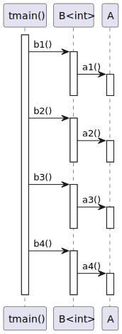

# t20010 - Container sequence diagram test case
## Config
```yaml
compilation_database_dir: ..
output_directory: puml
diagrams:
  t20010_sequence:
    type: sequence
    glob:
      - ../../tests/t20010/t20010.cc
    include:
      namespaces:
        - clanguml::t20010
    using_namespace:
      - clanguml::t20010
    start_from:
      - function: "clanguml::t20010::tmain()"
```
## Source code
File t20010.cc
```cpp
#include <array>
#include <map>
#include <memory>
#include <vector>

namespace clanguml {
namespace t20010 {

struct A {
    void a1() { }
    void a2() { }
    void a3() { }
    void a4() { }
};

template <typename T> struct B {
    void b1() { a_.a1(); }
    void b2() { avector_.front().a2(); }
    void b3() { aptrvector_.front()->a3(); }
    void b4() { amap_.at(0).a4(); }

    A a_;
    std::vector<A> avector_;
    std::vector<std::unique_ptr<A>> aptrvector_;
    std::map<T, A> amap_;
};

void tmain()
{
    B<int> b;

    b.b1();
    b.b2();
    b.b3();
    b.b4();
}

}
}
```
## Generated UML diagrams

## Generated JSON models
```json
{
  "diagram_type": "sequence",
  "metadata": {
    "clang_uml_version": "0.3.5-13-g57aa174",
    "llvm_version": "Ubuntu clang version 15.0.6",
    "schema_version": 1
  },
  "name": "t20010_sequence",
  "participants": [
    {
      "id": "1364660609791735244",
      "name": "clanguml::t20010::tmain()",
      "source_location": {
        "file": "../../tests/t20010/t20010.cc",
        "line": 28
      },
      "type": "function"
    },
    {
      "id": "2154977200904210115",
      "name": "clanguml::t20010::B<int>",
      "source_location": {
        "file": "../../tests/t20010/t20010.cc",
        "line": 16
      },
      "type": "class"
    },
    {
      "id": "102070351492425113",
      "name": "clanguml::t20010::A",
      "source_location": {
        "file": "../../tests/t20010/t20010.cc",
        "line": 9
      },
      "type": "class"
    }
  ],
  "sequences": [
    {
      "messages": [
        {
          "from": {
            "activity_id": "1364660609791735244",
            "activity_name": "clanguml::t20010::tmain()",
            "participant_id": "1364660609791735244",
            "participant_name": "clanguml::t20010::tmain()"
          },
          "name": "b1()",
          "return_type": "void",
          "scope": "normal",
          "source_location": {
            "file": "../../tests/t20010/t20010.cc",
            "line": 32
          },
          "to": {
            "activity_id": "343626060927491836",
            "activity_name": "clanguml::t20010::B<int>::b1()",
            "participant_id": "2154977200904210115"
          },
          "type": "message"
        },
        {
          "from": {
            "activity_id": "343626060927491836",
            "activity_name": "clanguml::t20010::B<int>::b1()",
            "participant_id": "2154977200904210115"
          },
          "name": "a1()",
          "return_type": "void",
          "scope": "normal",
          "source_location": {
            "file": "../../tests/t20010/t20010.cc",
            "line": 17
          },
          "to": {
            "activity_id": "981184681827469850",
            "activity_name": "clanguml::t20010::A::a1()",
            "participant_id": "102070351492425113"
          },
          "type": "message"
        },
        {
          "from": {
            "activity_id": "1364660609791735244",
            "activity_name": "clanguml::t20010::tmain()",
            "participant_id": "1364660609791735244",
            "participant_name": "clanguml::t20010::tmain()"
          },
          "name": "b2()",
          "return_type": "void",
          "scope": "normal",
          "source_location": {
            "file": "../../tests/t20010/t20010.cc",
            "line": 33
          },
          "to": {
            "activity_id": "1633031113603062043",
            "activity_name": "clanguml::t20010::B<int>::b2()",
            "participant_id": "2154977200904210115"
          },
          "type": "message"
        },
        {
          "from": {
            "activity_id": "1633031113603062043",
            "activity_name": "clanguml::t20010::B<int>::b2()",
            "participant_id": "2154977200904210115"
          },
          "name": "a2()",
          "return_type": "void",
          "scope": "normal",
          "source_location": {
            "file": "../../tests/t20010/t20010.cc",
            "line": 18
          },
          "to": {
            "activity_id": "664370880632146592",
            "activity_name": "clanguml::t20010::A::a2()",
            "participant_id": "102070351492425113"
          },
          "type": "message"
        },
        {
          "from": {
            "activity_id": "1364660609791735244",
            "activity_name": "clanguml::t20010::tmain()",
            "participant_id": "1364660609791735244",
            "participant_name": "clanguml::t20010::tmain()"
          },
          "name": "b3()",
          "return_type": "void",
          "scope": "normal",
          "source_location": {
            "file": "../../tests/t20010/t20010.cc",
            "line": 34
          },
          "to": {
            "activity_id": "786218543654309692",
            "activity_name": "clanguml::t20010::B<int>::b3()",
            "participant_id": "2154977200904210115"
          },
          "type": "message"
        },
        {
          "from": {
            "activity_id": "786218543654309692",
            "activity_name": "clanguml::t20010::B<int>::b3()",
            "participant_id": "2154977200904210115"
          },
          "name": "a3()",
          "return_type": "void",
          "scope": "normal",
          "source_location": {
            "file": "../../tests/t20010/t20010.cc",
            "line": 19
          },
          "to": {
            "activity_id": "2145739294823015899",
            "activity_name": "clanguml::t20010::A::a3()",
            "participant_id": "102070351492425113"
          },
          "type": "message"
        },
        {
          "from": {
            "activity_id": "1364660609791735244",
            "activity_name": "clanguml::t20010::tmain()",
            "participant_id": "1364660609791735244",
            "participant_name": "clanguml::t20010::tmain()"
          },
          "name": "b4()",
          "return_type": "void",
          "scope": "normal",
          "source_location": {
            "file": "../../tests/t20010/t20010.cc",
            "line": 35
          },
          "to": {
            "activity_id": "1866068965397702666",
            "activity_name": "clanguml::t20010::B<int>::b4()",
            "participant_id": "2154977200904210115"
          },
          "type": "message"
        },
        {
          "from": {
            "activity_id": "1866068965397702666",
            "activity_name": "clanguml::t20010::B<int>::b4()",
            "participant_id": "2154977200904210115"
          },
          "name": "a4()",
          "return_type": "void",
          "scope": "normal",
          "source_location": {
            "file": "../../tests/t20010/t20010.cc",
            "line": 20
          },
          "to": {
            "activity_id": "1224936485834400821",
            "activity_name": "clanguml::t20010::A::a4()",
            "participant_id": "102070351492425113"
          },
          "type": "message"
        }
      ],
      "start_from": {
        "id": 1364660609791735244,
        "location": "clanguml::t20010::tmain()"
      }
    }
  ],
  "using_namespace": "clanguml::t20010"
}
```
