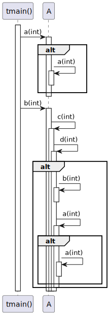
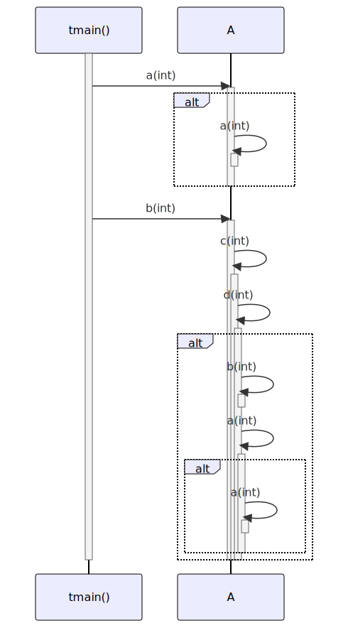

# t20011 - Recursive calls sequence diagram test case
## Config
```yaml
compilation_database_dir: ..
output_directory: diagrams
diagrams:
  t20011_sequence:
    type: sequence
    glob:
      - ../../tests/t20011/t20011.cc
    include:
      namespaces:
        - clanguml::t20011
    using_namespace:
      - clanguml::t20011
    from:
      - function: "clanguml::t20011::tmain()"
```
## Source code
File t20011.cc
```cpp
namespace clanguml {
namespace t20011 {

struct A {
    void a(int i = 10)
    {
        if (i > 0)
            a(i - 1);
    }

    void b(int i = 10) { c(i); }
    void c(int i) { d(i); }
    void d(int i)
    {
        if (i > 0)
            b(i - 1);
        else
            a();
    }
};

void tmain()
{
    A a;

    a.a();

    a.b();
}
}
}
```
## Generated PlantUML diagrams

## Generated Mermaid diagrams

## Generated JSON models
```json
{
  "diagram_type": "sequence",
  "metadata": {
    "clang_uml_version": "0.4.1",
    "llvm_version": "Ubuntu clang version 16.0.6 (++20230710042027+7cbf1a259152-1~exp1~20230710162048.105)",
    "schema_version": 1
  },
  "name": "t20011_sequence",
  "participants": [
    {
      "id": "1866210527166391126",
      "name": "clanguml::t20011::tmain()",
      "source_location": {
        "column": 6,
        "file": "../../tests/t20011/t20011.cc",
        "line": 22,
        "translation_unit": "../../tests/t20011/t20011.cc"
      },
      "type": "function"
    },
    {
      "id": "816061502062128285",
      "name": "clanguml::t20011::A",
      "source_location": {
        "column": 8,
        "file": "../../tests/t20011/t20011.cc",
        "line": 4,
        "translation_unit": "../../tests/t20011/t20011.cc"
      },
      "type": "class"
    }
  ],
  "sequences": [
    {
      "messages": [
        {
          "from": {
            "activity_id": "1866210527166391126",
            "activity_name": "clanguml::t20011::tmain()",
            "participant_id": "1866210527166391126",
            "participant_name": "clanguml::t20011::tmain()"
          },
          "name": "a(int)",
          "return_type": "void",
          "scope": "normal",
          "source_location": {
            "column": 5,
            "file": "../../tests/t20011/t20011.cc",
            "line": 26,
            "translation_unit": "../../tests/t20011/t20011.cc"
          },
          "to": {
            "activity_id": "1647578261840204206",
            "activity_name": "clanguml::t20011::A::a(int)",
            "participant_id": "816061502062128285"
          },
          "type": "message"
        },
        {
          "activity_id": "1647578261840204206",
          "branches": [
            {
              "messages": [
                {
                  "from": {
                    "activity_id": "1647578261840204206",
                    "activity_name": "clanguml::t20011::A::a(int)",
                    "participant_id": "816061502062128285"
                  },
                  "name": "a(int)",
                  "return_type": "void",
                  "scope": "normal",
                  "source_location": {
                    "column": 13,
                    "file": "../../tests/t20011/t20011.cc",
                    "line": 8,
                    "translation_unit": "../../tests/t20011/t20011.cc"
                  },
                  "to": {
                    "activity_id": "1647578261840204206",
                    "activity_name": "clanguml::t20011::A::a(int)",
                    "participant_id": "816061502062128285"
                  },
                  "type": "message"
                }
              ],
              "type": "consequent"
            }
          ],
          "name": "if",
          "type": "alt"
        },
        {
          "from": {
            "activity_id": "1866210527166391126",
            "activity_name": "clanguml::t20011::tmain()",
            "participant_id": "1866210527166391126",
            "participant_name": "clanguml::t20011::tmain()"
          },
          "name": "b(int)",
          "return_type": "void",
          "scope": "normal",
          "source_location": {
            "column": 5,
            "file": "../../tests/t20011/t20011.cc",
            "line": 28,
            "translation_unit": "../../tests/t20011/t20011.cc"
          },
          "to": {
            "activity_id": "305456175818875420",
            "activity_name": "clanguml::t20011::A::b(int)",
            "participant_id": "816061502062128285"
          },
          "type": "message"
        },
        {
          "from": {
            "activity_id": "305456175818875420",
            "activity_name": "clanguml::t20011::A::b(int)",
            "participant_id": "816061502062128285"
          },
          "name": "c(int)",
          "return_type": "void",
          "scope": "normal",
          "source_location": {
            "column": 26,
            "file": "../../tests/t20011/t20011.cc",
            "line": 11,
            "translation_unit": "../../tests/t20011/t20011.cc"
          },
          "to": {
            "activity_id": "963268672079901211",
            "activity_name": "clanguml::t20011::A::c(int)",
            "participant_id": "816061502062128285"
          },
          "type": "message"
        },
        {
          "from": {
            "activity_id": "963268672079901211",
            "activity_name": "clanguml::t20011::A::c(int)",
            "participant_id": "816061502062128285"
          },
          "name": "d(int)",
          "return_type": "void",
          "scope": "normal",
          "source_location": {
            "column": 21,
            "file": "../../tests/t20011/t20011.cc",
            "line": 12,
            "translation_unit": "../../tests/t20011/t20011.cc"
          },
          "to": {
            "activity_id": "1874311762268001137",
            "activity_name": "clanguml::t20011::A::d(int)",
            "participant_id": "816061502062128285"
          },
          "type": "message"
        },
        {
          "activity_id": "1874311762268001137",
          "branches": [
            {
              "messages": [
                {
                  "from": {
                    "activity_id": "1874311762268001137",
                    "activity_name": "clanguml::t20011::A::d(int)",
                    "participant_id": "816061502062128285"
                  },
                  "name": "b(int)",
                  "return_type": "void",
                  "scope": "normal",
                  "source_location": {
                    "column": 13,
                    "file": "../../tests/t20011/t20011.cc",
                    "line": 16,
                    "translation_unit": "../../tests/t20011/t20011.cc"
                  },
                  "to": {
                    "activity_id": "305456175818875420",
                    "activity_name": "clanguml::t20011::A::b(int)",
                    "participant_id": "816061502062128285"
                  },
                  "type": "message"
                },
                {
                  "from": {
                    "activity_id": "1874311762268001137",
                    "activity_name": "clanguml::t20011::A::d(int)",
                    "participant_id": "816061502062128285"
                  },
                  "name": "a(int)",
                  "return_type": "void",
                  "scope": "normal",
                  "source_location": {
                    "column": 13,
                    "file": "../../tests/t20011/t20011.cc",
                    "line": 18,
                    "translation_unit": "../../tests/t20011/t20011.cc"
                  },
                  "to": {
                    "activity_id": "1647578261840204206",
                    "activity_name": "clanguml::t20011::A::a(int)",
                    "participant_id": "816061502062128285"
                  },
                  "type": "message"
                }
              ],
              "type": "consequent"
            }
          ],
          "name": "if",
          "type": "alt"
        }
      ],
      "start_from": {
        "id": 1866210527166391126,
        "location": "clanguml::t20011::tmain()"
      }
    }
  ],
  "using_namespace": "clanguml::t20011"
}
```
